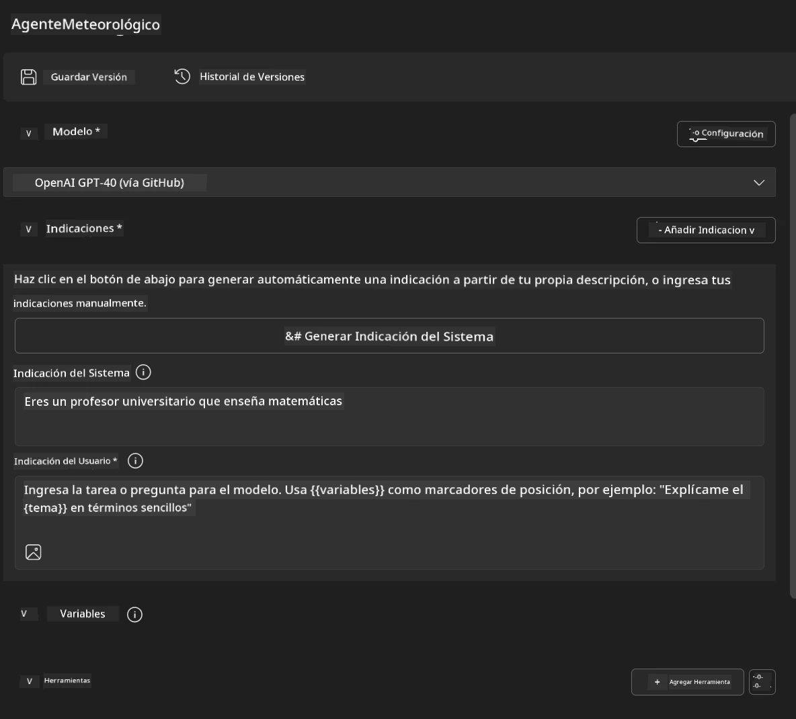
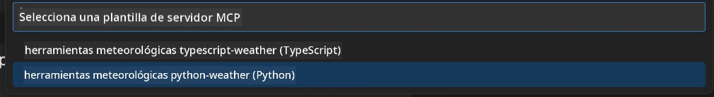
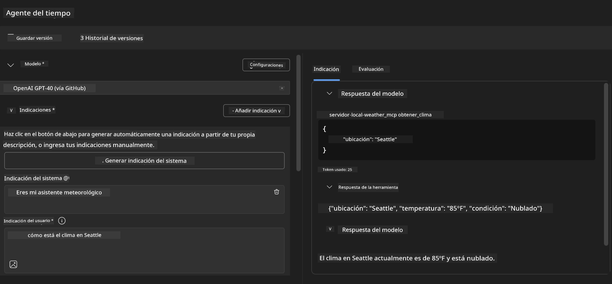
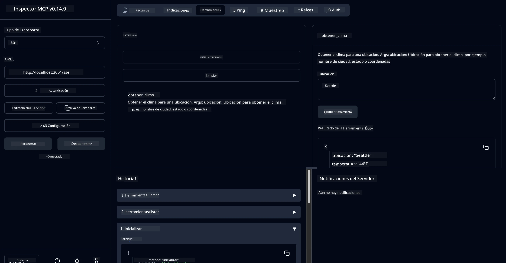

# 🔧 Módulo 3: Desarrollo Avanzado de MCP con Microsoft Foundry Toolkit

> [!NOTE]
> Las URLs del Inspector en este laboratorio usan el endpoint legado `/sse` y apuntan a las dependencias
> fijadas MCP SDK `1.9.3` e Inspector `0.14.0`. No son
> ejemplos actuales de Streamable HTTP `2026-07-28`.


## 🎯 Objetivos de Aprendizaje

Al finalizar este laboratorio, podrás:

- ✅ Crear servidores MCP personalizados usando Microsoft Foundry Toolkit
- ✅ Configurar y usar el último MCP Python SDK (v1.9.3)
- ✅ Configurar y utilizar el MCP Inspector para depuración
- ✅ Depurar servidores MCP en entornos Agent Builder e Inspector
- ✅ Entender flujos de trabajo avanzados de desarrollo de servidores MCP

## 📋 Prerrequisitos

- Haber completado el Laboratorio 2 (Fundamentos de MCP)
- VS Code con la extensión Microsoft Foundry Toolkit instalada
- Entorno Python 3.10+
- Node.js y npm para la configuración de Inspector

## 🏗️ Lo que Construirás

En este laboratorio, crearás un **Servidor MCP de Clima** que demostrará:
- Implementación personalizada de servidor MCP
- Integración con Microsoft Foundry Toolkit Agent Builder
- Flujos de trabajo profesionales de depuración
- Patrones modernos de uso del MCP SDK

---

## 🔧 Resumen de Componentes Clave

### 🐍 MCP Python SDK
El Model Context Protocol Python SDK proporciona la base para construir servidores MCP personalizados. Usarás la versión 1.9.3 con capacidades ampliadas de depuración.

### 🔍 MCP Inspector
Una poderosa herramienta de depuración que ofrece:
- Monitoreo del servidor en tiempo real
- Visualización de ejecución de herramientas
- Inspección de peticiones y respuestas de red
- Entorno interactivo de pruebas

---

## 📖 Implementación Paso a Paso

### Paso 1: Crear un WeatherAgent en Agent Builder

1. **Lanza Agent Builder** en VS Code a través de la extensión Microsoft Foundry Toolkit
2. **Crea un nuevo agente** con la siguiente configuración:
   - Nombre del agente: `WeatherAgent`



### Paso 2: Inicializar el Proyecto del Servidor MCP

1. **Navega a Herramientas** → **Agregar Herramienta** en Agent Builder
2. **Selecciona "Servidor MCP"** de las opciones disponibles
3. **Elige "Crear un nuevo Servidor MCP"**
4. **Selecciona la plantilla `python-weather`**
5. **Nombra tu servidor:** `weather_mcp`



### Paso 3: Abrir y Examinar el Proyecto

1. **Abre el proyecto generado** en VS Code
2. **Revisa la estructura del proyecto:**
   ```
   weather_mcp/
   ├── src/
   │   ├── __init__.py
   │   └── server.py
   ├── inspector/
   │   ├── package.json
   │   └── package-lock.json
   ├── .vscode/
   │   ├── launch.json
   │   └── tasks.json
   ├── pyproject.toml
   └── README.md
   ```

### Paso 4: Actualizar al Último MCP SDK

> **🔍 ¿Por qué Actualizar?** Queremos usar la última versión del MCP SDK (v1.9.3) y el servicio Inspector (0.14.0) para características mejoradas y mejores capacidades de depuración.

#### 4a. Actualizar Dependencias Python

**Editar `pyproject.toml`:** actualizar [./code/weather_mcp/pyproject.toml](../../../../10-StreamliningAIWorkflowsBuildingAnMCPServerWithAIToolkit/lab3/code/weather_mcp/pyproject.toml)


#### 4b. Actualizar Configuración de Inspector

**Editar `inspector/package.json`:** actualizar [./code/weather_mcp/inspector/package.json](../../../../10-StreamliningAIWorkflowsBuildingAnMCPServerWithAIToolkit/lab3/code/weather_mcp/inspector/package.json)

#### 4c. Actualizar Dependencias de Inspector

**Editar `inspector/package-lock.json`:** actualizar [./code/weather_mcp/inspector/package-lock.json](../../../../10-StreamliningAIWorkflowsBuildingAnMCPServerWithAIToolkit/lab3/code/weather_mcp/inspector/package-lock.json)

> **📝 Nota:** Este archivo contiene definiciones extensas de dependencias. A continuación se muestra la estructura esencial - el contenido completo asegura una resolución adecuada de dependencias.


> **⚡ Bloqueo Completo de Paquete:** El package-lock.json completo contiene ~3000 líneas de definiciones de dependencias. Lo anterior muestra la estructura clave - use el archivo proporcionado para la resolución completa de dependencias.

### Paso 5: Configurar la Depuración en VS Code

*Nota: Por favor copia el archivo en la ruta especificada para reemplazar el archivo local correspondiente*

#### 5a. Actualizar Configuración de Lanzamiento

**Editar `.vscode/launch.json`:**

```json
{
  "version": "0.2.0",
  "configurations": [
    {
      "name": "Attach to Local MCP",
      "type": "debugpy",
      "request": "attach",
      "connect": {
        "host": "localhost",
        "port": 5678
      },
      "presentation": {
        "hidden": true
      },
      "internalConsoleOptions": "neverOpen",
      "postDebugTask": "Terminate All Tasks"
    },
    {
      "name": "Launch Inspector (Edge)",
      "type": "msedge",
      "request": "launch",
      "url": "http://localhost:6274?timeout=60000&serverUrl=http://localhost:3001/sse#tools",
      "cascadeTerminateToConfigurations": [
        "Attach to Local MCP"
      ],
      "presentation": {
        "hidden": true
      },
      "internalConsoleOptions": "neverOpen"
    },
    {
      "name": "Launch Inspector (Chrome)",
      "type": "chrome",
      "request": "launch",
      "url": "http://localhost:6274?timeout=60000&serverUrl=http://localhost:3001/sse#tools",
      "cascadeTerminateToConfigurations": [
        "Attach to Local MCP"
      ],
      "presentation": {
        "hidden": true
      },
      "internalConsoleOptions": "neverOpen"
    }
  ],
  "compounds": [
    {
      "name": "Debug in Agent Builder",
      "configurations": [
        "Attach to Local MCP"
      ],
      "preLaunchTask": "Open Agent Builder",
    },
    {
      "name": "Debug in Inspector (Edge)",
      "configurations": [
        "Launch Inspector (Edge)",
        "Attach to Local MCP"
      ],
      "preLaunchTask": "Start MCP Inspector",
      "stopAll": true
    },
    {
      "name": "Debug in Inspector (Chrome)",
      "configurations": [
        "Launch Inspector (Chrome)",
        "Attach to Local MCP"
      ],
      "preLaunchTask": "Start MCP Inspector",
      "stopAll": true
    }
  ]
}
```

**Editar `.vscode/tasks.json`:**

```
{
  "version": "2.0.0",
  "tasks": [
    {
      "label": "Start MCP Server",
      "type": "shell",
      "command": "python -m debugpy --listen 127.0.0.1:5678 src/__init__.py sse",
      "isBackground": true,
      "options": {
        "cwd": "${workspaceFolder}",
        "env": {
          "PORT": "3001"
        }
      },
      "problemMatcher": {
        "pattern": [
          {
            "regexp": "^.*$",
            "file": 0,
            "location": 1,
            "message": 2
          }
        ],
        "background": {
          "activeOnStart": true,
          "beginsPattern": ".*",
          "endsPattern": "Application startup complete|running"
        }
      }
    },
    {
      "label": "Start MCP Inspector",
      "type": "shell",
      "command": "npm run dev:inspector",
      "isBackground": true,
      "options": {
        "cwd": "${workspaceFolder}/inspector",
        "env": {
          "CLIENT_PORT": "6274",
          "SERVER_PORT": "6277",
        }
      },
      "problemMatcher": {
        "pattern": [
          {
            "regexp": "^.*$",
            "file": 0,
            "location": 1,
            "message": 2
          }
        ],
        "background": {
          "activeOnStart": true,
          "beginsPattern": "Starting MCP inspector",
          "endsPattern": "Proxy server listening on port"
        }
      },
      "dependsOn": [
        "Start MCP Server"
      ]
    },
    {
      "label": "Open Agent Builder",
      "type": "shell",
      "command": "echo ${input:openAgentBuilder}",
      "presentation": {
        "reveal": "never"
      },
      "dependsOn": [
        "Start MCP Server"
      ],
    },
    {
      "label": "Terminate All Tasks",
      "command": "echo ${input:terminate}",
      "type": "shell",
      "problemMatcher": []
    }
  ],
  "inputs": [
    {
      "id": "openAgentBuilder",
      "type": "command",
      "command": "ai-mlstudio.agentBuilder",
      "args": {
        "initialMCPs": [ "local-server-weather_mcp" ],
        "triggeredFrom": "vsc-tasks"
      }
    },
    {
      "id": "terminate",
      "type": "command",
      "command": "workbench.action.tasks.terminate",
      "args": "terminateAll"
    }
  ]
}
```


---

## 🚀 Ejecutar y Probar tu Servidor MCP

### Paso 6: Instalar Dependencias

Después de realizar los cambios de configuración, ejecuta los siguientes comandos:

**Instalar dependencias Python:**
```bash
uv sync
```

**Instalar dependencias de Inspector:**
```bash
cd inspector
npm install
```

### Paso 7: Depurar con Agent Builder

1. **Presiona F5** o usa la configuración **"Depurar en Agent Builder"**
2. **Selecciona la configuración compuesta** desde el panel de depuración
3. **Espera a que el servidor inicie** y Agent Builder se abra
4. **Prueba tu servidor MCP de clima** con consultas en lenguaje natural

Ingresa un prompt así

SYSTEM_PROMPT

```
You are my weather assistant
```

USER_PROMPT

```
How's the weather like in Seattle
```



### Paso 8: Depurar con MCP Inspector

1. **Usa la configuración "Depurar en Inspector"** (Edge o Chrome)
2. **Abre la interfaz del Inspector** en `http://localhost:6274`
3. **Explora el entorno interactivo de pruebas:**
   - Visualiza las herramientas disponibles
   - Prueba la ejecución de herramientas
   - Monitorea las solicitudes de red
   - Depura las respuestas del servidor



---

## 🎯 Resultados Clave de Aprendizaje

Al completar este laboratorio, has:

- [x] **Creado un servidor MCP personalizado** usando plantillas de Microsoft Foundry Toolkit
- [x] **Actualizado al último MCP SDK** (v1.9.3) para funcionalidades mejoradas
- [x] **Configurado flujos profesionales de depuración** tanto para Agent Builder como Inspector
- [x] **Configurado el MCP Inspector** para pruebas interactivas del servidor
- [x] **Dominado configuraciones de depuración en VS Code** para desarrollo MCP

## 🔧 Funcionalidades Avanzadas Exploradas

| Funcionalidad | Descripción | Caso de Uso |
|---------|-------------|----------|
| **MCP Python SDK v1.9.3** | Última implementación del protocolo | Desarrollo moderno de servidores |
| **MCP Inspector 0.14.0** | Herramienta de depuración interactiva | Pruebas de servidor en tiempo real |
| **Depuración en VS Code** | Entorno de desarrollo integrado | Flujo profesional de depuración |
| **Integración con Agent Builder** | Conexión directa con Microsoft Foundry Toolkit | Pruebas de agente de principio a fin |

## 📚 Recursos Adicionales

- [Documentación MCP Python SDK](https://modelcontextprotocol.io/docs/sdk/python)
- [Guía de Extensión Microsoft Foundry Toolkit](https://code.visualstudio.com/docs/ai/ai-toolkit)
- [Documentación de Depuración en VS Code](https://code.visualstudio.com/docs/editor/debugging)
- [Especificación Model Context Protocol](https://modelcontextprotocol.io/docs/concepts/architecture)

---

**🎉 ¡Felicidades!** Has completado con éxito el Laboratorio 3 y ahora puedes crear, depurar y desplegar servidores MCP personalizados usando flujos de trabajo profesionales de desarrollo.

### 🔜 Continúa al Siguiente Módulo

¿Listo para aplicar tus habilidades MCP en un flujo de trabajo de desarrollo real? Continúa a **[Módulo 4: Desarrollo Práctico de MCP - Servidor Personalizado de Clonación en GitHub](../lab4/README.md)** donde:
- Construirás un servidor MCP listo para producción que automatiza operaciones de repositorios GitHub
- Implementarás funcionalidad de clonación de repositorios GitHub vía MCP
- Integrarás servidores MCP personalizados con VS Code y GitHub Copilot Agent Mode
- Probarás y desplegarás servidores MCP personalizados en ambientes de producción
- Aprenderás automatización práctica de flujos para desarrolladores

---

<!-- CO-OP TRANSLATOR DISCLAIMER START -->
**Descargo de responsabilidad**:
Este documento ha sido traducido utilizando el servicio de traducción automática [Co-op Translator](https://github.com/Azure/co-op-translator). Aunque nos esforzamos por la precisión, tenga en cuenta que las traducciones automatizadas pueden contener errores o inexactitudes. El documento original en su idioma nativo debe considerarse la fuente autorizada. Para información crítica, se recomienda una traducción profesional humana. No somos responsables de cualquier malentendido o interpretación errónea que surja del uso de esta traducción.
<!-- CO-OP TRANSLATOR DISCLAIMER END -->