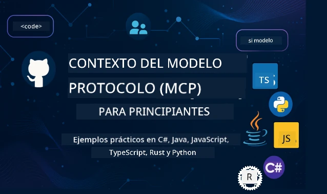

 

[](https://GitHub.com/microsoft/mcp-for-beginners/graphs/contributors)
[](https://GitHub.com/microsoft/mcp-for-beginners/issues)
[](https://GitHub.com/microsoft/mcp-for-beginners/pulls)
[](http://makeapullrequest.com)

[](https://GitHub.com/microsoft/mcp-for-beginners/watchers)
[](https://GitHub.com/microsoft/mcp-for-beginners/fork)
[](https://GitHub.com/microsoft/mcp-for-beginners/stargazers)


[](https://discord.gg/nTYy5BXMWG)

Sigue estos pasos para empezar a usar estos recursos:
1. **Haz fork del repositorio**: Haz clic en [](https://GitHub.com/microsoft/mcp-for-beginners/fork)
2. **Clona el repositorio**:   `git clone https://github.com/microsoft/mcp-for-beginners.git`
3. **Únete a** [](https://discord.gg/nTYy5BXMWG)


### 🌐 Soporte multilingüe

#### Soportado vía GitHub Action (Automatizado y Siempre Actualizado)

<!-- CO-OP TRANSLATOR LANGUAGES TABLE START -->
[Arabic](../ar/README.md) | [Bengali](../bn/README.md) | [Bulgarian](../bg/README.md) | [Burmese (Myanmar)](../my/README.md) | [Chinese (Simplified)](../zh-CN/README.md) | [Chinese (Traditional, Hong Kong)](../zh-HK/README.md) | [Chinese (Traditional, Macau)](../zh-MO/README.md) | [Chinese (Traditional, Taiwan)](../zh-TW/README.md) | [Croatian](../hr/README.md) | [Czech](../cs/README.md) | [Danish](../da/README.md) | [Dutch](../nl/README.md) | [Estonian](../et/README.md) | [Finnish](../fi/README.md) | [French](../fr/README.md) | [German](../de/README.md) | [Greek](../el/README.md) | [Hebrew](../he/README.md) | [Hindi](../hi/README.md) | [Hungarian](../hu/README.md) | [Indonesian](../id/README.md) | [Italian](../it/README.md) | [Japanese](../ja/README.md) | [Kannada](../kn/README.md) | [Korean](../ko/README.md) | [Lithuanian](../lt/README.md) | [Malay](../ms/README.md) | [Malayalam](../ml/README.md) | [Marathi](../mr/README.md) | [Nepali](../ne/README.md) | [Nigerian Pidgin](../pcm/README.md) | [Norwegian](../no/README.md) | [Persian (Farsi)](../fa/README.md) | [Polish](../pl/README.md) | [Portuguese (Brazil)](../pt-BR/README.md) | [Portuguese (Portugal)](../pt-PT/README.md) | [Punjabi (Gurmukhi)](../pa/README.md) | [Romanian](../ro/README.md) | [Russian](../ru/README.md) | [Serbian (Cyrillic)](../sr/README.md) | [Slovak](../sk/README.md) | [Slovenian](../sl/README.md) | [Spanish](./README.md) | [Swahili](../sw/README.md) | [Swedish](../sv/README.md) | [Tagalog (Filipino)](../tl/README.md) | [Tamil](../ta/README.md) | [Telugu](../te/README.md) | [Thai](../th/README.md) | [Turkish](../tr/README.md) | [Ukrainian](../uk/README.md) | [Urdu](../ur/README.md) | [Vietnamese](../vi/README.md)

> **¿Prefieres clonar localmente?**
>
> Este repositorio incluye traducciones en más de 50 idiomas lo que aumenta significativamente el tamaño de la descarga. Para clonar sin traducciones, usa la comprobación selectiva:
>
> **Bash / macOS / Linux:**
> ```bash
> git clone --filter=blob:none --sparse https://github.com/microsoft/mcp-for-beginners.git
> cd mcp-for-beginners
> git sparse-checkout set --no-cone '/*' '!translations' '!translated_images'
> ```
>
> **CMD (Windows):**
> ```cmd
> git clone --filter=blob:none --sparse https://github.com/microsoft/mcp-for-beginners.git
> cd mcp-for-beginners
> git sparse-checkout set --no-cone "/*" "!translations" "!translated_images"
> ```
>
> Esto te dará todo lo que necesitas para completar el curso con una descarga mucho más rápida.
<!-- CO-OP TRANSLATOR LANGUAGES TABLE END -->

# 🚀 Currículo del Protocolo de Contexto de Modelo (MCP) para Principiantes

## **Aprende MCP con ejemplos prácticos de código en C#, Java, JavaScript, Rust, Python y TypeScript**

## 🧠 Resumen del Currículo del Protocolo de Contexto de Modelo
¡Bienvenido a tu viaje dentro del Protocolo de Contexto de Modelo! Si alguna vez te has preguntado cómo las aplicaciones de IA se comunican con diferentes herramientas y servicios, estás a punto de descubrir la elegante solución que está transformando la forma en que los desarrolladores construyen sistemas inteligentes.

Piensa en MCP como un traductor universal para aplicaciones de IA, así como los puertos USB permiten conectar cualquier dispositivo a tu computadora, MCP permite que los modelos de IA se conecten a cualquier herramienta o servicio de manera estandarizada. Ya sea que estés construyendo tu primer chatbot o trabajando en flujos de trabajo complejos de IA, entender MCP te dará el poder de crear aplicaciones más capaces y flexibles.

Este currículo está diseñado con paciencia y cuidado para tu proceso de aprendizaje. Comenzaremos con conceptos simples que ya conoces y gradualmente construiremos tu experiencia con práctica práctica utilizando tu lenguaje de programación favorito. Cada paso incluye explicaciones claras, ejemplos prácticos y mucho ánimo en el camino.

Al completar este viaje, tendrás la confianza para construir tus propios servidores MCP, integrarlos con plataformas populares de IA y entender cómo esta tecnología está remodelando el futuro del desarrollo de IA. ¡Comencemos esta emocionante aventura juntos!

### Documentación y Especificaciones Oficiales

Este currículo está alineado con la **Especificación MCP 2025-11-25** (la última versión estable). La especificación MCP usa versionado basado en fechas (formato AAAA-MM-DD) para asegurar un seguimiento claro de las versiones del protocolo.

Estos recursos se vuelven más valiosos a medida que crece tu entendimiento, pero no sientas presión por leer todo de inmediato. Empieza con las áreas que más te interesen.
- 📘 [Documentación MCP](https://modelcontextprotocol.io/) – Este es tu recurso principal para tutoriales paso a paso y guías de usuario. La documentación está escrita pensando en principiantes, proporcionando ejemplos claros que puedes seguir a tu propio ritmo.
- 📜 [Especificación MCP](https://modelcontextprotocol.io/specification/2025-11-25) – Considéralo tu manual de referencia completo. A medida que avances en el currículo, querrás volver a consultar aquí para detalles específicos y explorar características avanzadas.
- 📜 [Versionado de Especificación MCP](https://modelcontextprotocol.io/specification/versioning) – Aquí encontrarás información sobre el historial de versiones del protocolo y cómo MCP utiliza el versionado basado en fechas (formato AAAA-MM-DD).
- 🧑‍💻 [Repositorio MCP en GitHub](https://github.com/modelcontextprotocol) – Aquí encontrarás SDKs, herramientas y ejemplos de código en múltiples lenguajes de programación. Es como un tesoro de ejemplos prácticos y componentes listos para usar.
- 🌐 [Comunidad MCP](https://github.com/orgs/modelcontextprotocol/discussions) – Únete a otros aprendices y desarrolladores experimentados en discusiones sobre MCP. Es una comunidad de apoyo donde las preguntas son bienvenidas y el conocimiento se comparte libremente.
  
## Objetivos de Aprendizaje

Al final de este currículo, te sentirás seguro y entusiasmado con tus nuevas habilidades. Esto es lo que lograrás:

• **Comprender los fundamentos de MCP**: Entenderás qué es el Protocolo de Contexto de Modelo y por qué está revolucionando la forma en que las aplicaciones de IA trabajan juntas, usando analogías y ejemplos que tengan sentido.

• **Construir tu primer servidor MCP**: Crearás un servidor MCP funcional en tu lenguaje de programación preferido, comenzando con ejemplos simples y desarrollando tus habilidades paso a paso.

• **Conectar modelos de IA con herramientas reales**: Aprenderás a conectar el modelo de IA con servicios reales, brindando a tus aplicaciones nuevas capacidades potentes.

• **Implementar prácticas de seguridad óptimas**: Entenderás cómo mantener tus implementaciones MCP seguras, protegiendo tanto tus aplicaciones como a tus usuarios.

• **Desplegar con confianza**: Sabrás cómo llevar tus proyectos MCP de desarrollo a producción, con estrategias prácticas de despliegue que funcionan en el mundo real.

• **Unirte a la comunidad MCP**: Formarás parte de una creciente comunidad de desarrolladores que están dando forma al futuro del desarrollo de aplicaciones de IA.

## Antecedentes esenciales

Antes de sumergirnos en los detalles de MCP, asegurémonos de que te sientas cómodo con algunos conceptos fundamentales. No te preocupes si no eres experto en estas áreas, ¡te explicaremos todo lo que necesites saber a medida que avancemos!

### Entendiendo protocolos (la base)

Piensa en un protocolo como las reglas para una conversación. Cuando llamas a un amigo, ambos saben decir "hola" al contestar, turnarse para hablar y decir "adiós" cuando terminan. Los programas de computadora necesitan reglas similares para comunicarse eficazmente.

MCP es un protocolo — un conjunto de reglas acordadas que ayudan a que los modelos y aplicaciones de IA tengan "conversaciones" productivas con herramientas y servicios. Así como las reglas en una conversación humana hacen que la comunicación sea más fluida, MCP hace que la comunicación entre aplicaciones de IA sea mucho más confiable y potente.

### Relaciones cliente-servidor (cómo trabajan juntos los programas)

¡Ya usas relaciones cliente-servidor todos los días! Cuando usas un navegador web (cliente) para visitar un sitio, te conectas a un servidor web que te envía el contenido de la página. El navegador sabe cómo pedir información y el servidor sabe cómo responder.

En MCP, tenemos una relación similar: los modelos de IA actúan como clientes que solicitan información o acciones, mientras los servidores MCP proporcionan esas capacidades. Es como tener un asistente útil (el servidor) al que la IA puede pedir que realice tareas específicas.

### Por qué la estandarización importa (hacer que las cosas funcionen juntas)

Imagina que cada fabricante de autos usara bombas de gasolina con formas diferentes — ¡necesitarías un adaptador distinto para cada auto! La estandarización significa acordar enfoques comunes para que las cosas funcionen sin problemas.

MCP ofrece esta estandarización para aplicaciones de IA. En lugar de que cada modelo de IA necesite código personalizado para cada herramienta, MCP crea una forma universal para que se comuniquen. Esto significa que los desarrolladores pueden construir herramientas una vez y hacer que funcionen con muchos sistemas de IA diferentes.

## 🧭 Resumen de tu ruta de aprendizaje

Tu viaje MCP está cuidadosamente estructurado para construir tu confianza y habilidades progresivamente. Cada fase introduce nuevos conceptos mientras refuerza lo que ya has aprendido.

### 🌱 Fase de Fundación: Entendiendo los conceptos básicos (Módulos 0-2)

¡Aquí comienza tu aventura! Te presentaremos conceptos MCP usando analogías familiares y ejemplos simples. Entenderás qué es MCP, por qué existe y cómo encaja en el mundo más amplio del desarrollo de IA.

• **Módulo 0 - Introducción a MCP**: Comenzaremos explorando qué es MCP y por qué es tan importante para las aplicaciones modernas de IA. Verás ejemplos reales de MCP en acción y entenderás cómo resuelve problemas comunes que enfrentan los desarrolladores.

• **Módulo 1 - Explicación de conceptos clave**: Aquí aprenderás los bloques de construcción esenciales del MCP. Usaremos muchas analogías y ejemplos visuales para que estos conceptos te resulten naturales y fáciles de entender.

• **Módulo 2 - Seguridad en MCP**: La seguridad puede parecer intimidante, pero te mostraremos cómo MCP incluye funciones de seguridad integradas y te enseñaremos buenas prácticas que protegen tus aplicaciones desde el principio.

### 🔨 Fase de Construcción: Creando tus primeras implementaciones (Módulo 3)

¡Ahora comienza la diversión real! Obtendrás experiencia práctica creando servidores y clientes MCP reales. No te preocupes — comenzaremos simple y te guiaremos en cada paso.
Este módulo incluye múltiples guías prácticas que te permiten practicar en tu lenguaje de programación preferido. Crearás tu primer servidor, construirás un cliente para conectar con él, e incluso integrarás con herramientas de desarrollo populares como VS Code.

Cada guía incluye ejemplos completos de código, consejos para la resolución de problemas y explicaciones sobre por qué tomamos decisiones de diseño específicas. ¡Al final de esta fase, tendrás implementaciones MCP funcionantes de las que podrás estar orgulloso!

### 🚀 Fase de Crecimiento: Conceptos Avanzados y Aplicación en el Mundo Real (Módulos 4-5)

Con los conceptos básicos dominados, estás listo para explorar funciones MCP más sofisticadas. Cubriremos estrategias prácticas de implementación, técnicas de depuración y temas avanzados como la integración multimodal de IA.

También aprenderás a escalar tus implementaciones MCP para uso en producción e integrar con plataformas en la nube como Azure. Estos módulos te preparan para construir soluciones MCP que puedan manejar demandas del mundo real.

### 🌟 Fase de Maestría: Comunidad y Especialización (Módulos 6-11)

La fase final se centra en unirte a la comunidad MCP y especializarte en áreas que más te interesan. Aprenderás cómo contribuir a proyectos MCP de código abierto, implementar patrones avanzados de autenticación y construir soluciones completas integradas con bases de datos.

El módulo 11 merece una mención especial: es un completo camino de aprendizaje práctico de 13 laboratorios que te enseña a construir servidores MCP listos para producción con integración de PostgreSQL. ¡Es como un proyecto final que reúne todo lo que has aprendido!

### 📚 Estructura Completa del Currículo

| Módulo | Tema | Descripción | Enlace |
|--------|-------|-------------|------|
| **Módulo 0-3: Fundamentos** | | | |
| 00 | Introducción a MCP | Visión general del Protocolo de Contexto de Modelo y su importancia en pipelines de IA | [Leer más](./00-Introduction/README.md) |
| 01 | Conceptos Básicos Explicados | Exploración en profundidad de los conceptos centrales de MCP | [Leer más](./01-CoreConcepts/README.md) |
| 02 | Seguridad en MCP | Amenazas de seguridad y mejores prácticas | [Leer más](./02-Security/README.md) |
| 03 | Comenzando con MCP | Configuración del entorno, servidores/clientes básicos, integración | [Leer más](./03-GettingStarted/README.md) |
| **Módulo 3: Construyendo Tu Primer Servidor y Cliente** | | | |
| 3.1 | Primer Servidor | Crea tu primer servidor MCP | [Guía](./03-GettingStarted/01-first-server/README.md) |
| 3.2 | Primer Cliente | Desarrolla un cliente MCP básico | [Guía](./03-GettingStarted/02-client/README.md) |
| 3.3 | Cliente con LLM | Integra modelos de lenguaje grandes | [Guía](./03-GettingStarted/03-llm-client/README.md) |
| 3.4 | Integración con VS Code | Consume servidores MCP en VS Code | [Guía](./03-GettingStarted/04-vscode/README.md) |
| 3.5 | Servidor stdio | Crea servidores usando transporte stdio | [Guía](./03-GettingStarted/05-stdio-server/README.md) |
| 3.6 | Transmisión HTTP | Implementa streaming HTTP en MCP | [Guía](./03-GettingStarted/06-http-streaming/README.md) |
| 3.7 | Kit de Herramientas de IA | Usa AI Toolkit con MCP | [Guía](./03-GettingStarted/07-aitk/README.md) |
| 3.8 | Pruebas | Testea tu implementación del servidor MCP | [Guía](./03-GettingStarted/08-testing/README.md) |
| 3.9 | Despliegue | Despliega servidores MCP a producción | [Guía](./03-GettingStarted/09-deployment/README.md) |
| 3.10 | Uso avanzado de servidores | Utiliza servidores avanzados para funciones avanzadas y arquitectura mejorada | [Guía](./03-GettingStarted/10-advanced/README.md) |
| 3.11 | Autenticación simple | Un capítulo que muestra la autenticación desde el inicio y RBAC | [Guía](./03-GettingStarted/11-simple-auth/README.md) |
| 3.12 | Hosts MCP | Configura Claude Desktop, Cursor, Cline y otros hosts MCP | [Guía](./03-GettingStarted/12-mcp-hosts/README.md) |
| 3.13 | Inspector MCP | Depura y prueba servidores MCP con la herramienta Inspector | [Guía](./03-GettingStarted/13-mcp-inspector/README.md) |
| 3.14 | Muestreo | Usa el muestreo para colaborar con el cliente | [Guía](./03-GettingStarted/14-sampling/README.md) |
| 3.15 | Aplicaciones MCP | Construye aplicaciones MCP | [Guía](./03-GettingStarted/15-mcp-apps/README.md) |

| **Módulo 4-5: Práctico y Avanzado** | | | |
| 04 | Implementación Práctica | SDKs, depuración, pruebas, plantillas reutilizables de prompts | [Leer más](./04-PracticalImplementation/README.md) |
| 4.1 | Paginación | Maneja grandes conjuntos de resultados con paginación basada en cursores | [Guía](./04-PracticalImplementation/pagination/README.md) |
| 05 | Temas Avanzados en MCP | IA multimodal, escalado, uso empresarial | [Leer más](./05-AdvancedTopics/README.md) |
| 5.1 | Integración Azure | Integración MCP con Azure | [Guía](./05-AdvancedTopics/mcp-integration/README.md) |
| 5.2 | Multimodalidad | Trabajando con múltiples modalidades | [Guía](./05-AdvancedTopics/mcp-multi-modality/README.md) |
| 5.3 | Demo OAuth2 | Implementa autenticación OAuth2 | [Guía](./05-AdvancedTopics/mcp-oauth2-demo/README.md) |
| 5.4 | Contextos Raíz | Entiende e implementa contextos raíz | [Guía](./05-AdvancedTopics/mcp-root-contexts/README.md) |
| 5.5 | Enrutamiento | Estrategias de enrutamiento MCP | [Guía](./05-AdvancedTopics/mcp-routing/README.md) |
| 5.6 | Muestreo | Técnicas de muestreo en MCP | [Guía](./05-AdvancedTopics/mcp-sampling/README.md) |
| 5.7 | Escalado | Escala implementaciones MCP | [Guía](./05-AdvancedTopics/mcp-scaling/README.md) |
| 5.8 | Seguridad | Consideraciones avanzadas de seguridad | [Guía](./05-AdvancedTopics/mcp-security/README.md) |
| 5.9 | Búsqueda Web | Implementa capacidades de búsqueda web | [Guía](./05-AdvancedTopics/web-search-mcp/README.md) |
| 5.10 | Streaming en tiempo real | Construye funcionalidad de streaming en tiempo real | [Guía](./05-AdvancedTopics/mcp-realtimestreaming/README.md) |
| 5.11 | Búsqueda en tiempo real | Implementa búsqueda en tiempo real | [Guía](./05-AdvancedTopics/mcp-realtimesearch/README.md) |
| 5.12 | Autenticación Entra ID | Autenticación con Microsoft Entra ID | [Guía](./05-AdvancedTopics/mcp-security-entra/README.md) |
| 5.13 | Integración Foundry | Integra con Azure AI Foundry | [Guía](./05-AdvancedTopics/mcp-foundry-agent-integration/README.md) |
| 5.14 | Ingeniería de Contextos | Técnicas para una ingeniería de contextos efectiva | [Guía](./05-AdvancedTopics/mcp-contextengineering/README.md) |
| 5.15 | Transporte Personalizado MCP | Implementaciones de transporte personalizadas | [Guía](./05-AdvancedTopics/mcp-transport/README.md) |
| 5.16 | Características del Protocolo | Notificaciones de progreso, cancelación, plantillas de recursos | [Guía](./05-AdvancedTopics/mcp-protocol-features/README.md) |
| **Módulo 6-10: Comunidad y Mejores Prácticas** | | | |
| 06 | Contribuciones de la Comunidad | Cómo contribuir al ecosistema MCP | [Guía](./06-CommunityContributions/README.md) |
| 07 | Lecciones de la Adopción Temprana | Historias de implementación en el mundo real | [Guía](./07-LessonsfromEarlyAdoption/README.md) |
| 08 | Mejores Prácticas para MCP | Rendimiento, tolerancia a fallos, resiliencia | [Guía](./08-BestPractices/README.md) |
| 09 | Estudios de Caso MCP | Ejemplos prácticos de implementación | [Guía](./09-CaseStudy/README.md) |
| 10 | Taller Práctico | Construyendo un Servidor MCP con AI Toolkit | [Laboratorio](./10-StreamliningAIWorkflowsBuildingAnMCPServerWithAIToolkit/README.md) |
| **Módulo 11: Laboratorio Práctico de Servidor MCP** | | | |
| 11 | Integración de Servidor MCP con Base de Datos | Completo camino práctico de 13 laboratorios para integración con PostgreSQL | [Laboratorios](./11-MCPServerHandsOnLabs/README.md) |
| 11.1 | Introducción | Visión general de MCP con integración a base de datos y caso de uso de análisis retail | [Lab 00](./11-MCPServerHandsOnLabs/00-Introduction/README.md) |
| 11.2 | Arquitectura Central | Comprendiendo la arquitectura del servidor MCP, capas de base de datos y patrones de seguridad | [Lab 01](./11-MCPServerHandsOnLabs/01-Architecture/README.md) |
| 11.3 | Seguridad y Multiinquilino | Seguridad a nivel fila, autenticación y acceso multiinquilino a datos | [Lab 02](./11-MCPServerHandsOnLabs/02-Security/README.md) |
| 11.4 | Configuración del Entorno | Configuración del entorno de desarrollo, Docker, recursos Azure | [Lab 03](./11-MCPServerHandsOnLabs/03-Setup/README.md) |
| 11.5 | Diseño de Base de Datos | Configuración de PostgreSQL, diseño de esquema retail y datos de ejemplo | [Lab 04](./11-MCPServerHandsOnLabs/04-Database/README.md) |
| 11.6 | Implementación del Servidor MCP | Construyendo el servidor FastMCP con integración a base de datos | [Lab 05](./11-MCPServerHandsOnLabs/05-MCP-Server/README.md) |
| 11.7 | Desarrollo de Herramientas | Creación de herramientas para consultas de base de datos e introspección de esquemas | [Lab 06](./11-MCPServerHandsOnLabs/06-Tools/README.md) |
| 11.8 | Búsqueda Semántica | Implementación de embeddings vectoriales con Azure OpenAI y pgvector | [Lab 07](./11-MCPServerHandsOnLabs/07-Semantic-Search/README.md) |
| 11.9 | Pruebas y Depuración | Estrategias de prueba, herramientas de depuración y enfoques de validación | [Lab 08](./11-MCPServerHandsOnLabs/08-Testing/README.md) |
| 11.10 | Integración con VS Code | Configuración de integración MCP en VS Code y uso de AI Chat | [Lab 09](./11-MCPServerHandsOnLabs/09-VS-Code/README.md) |
| 11.11 | Estrategias de Despliegue | Despliegue con Docker, Azure Container Apps y consideraciones de escalado | [Lab 10](./11-MCPServerHandsOnLabs/10-Deployment/README.md) |
| 11.12 | Monitoreo | Application Insights, logging y monitoreo de rendimiento | [Lab 11](./11-MCPServerHandsOnLabs/11-Monitoring/README.md) |
| 11.13 | Mejores Prácticas | Optimización de rendimiento, endurecimiento de seguridad y consejos para producción | [Lab 12](./11-MCPServerHandsOnLabs/12-Best-Practices/README.md) |

### 💻 Proyectos de Código de Ejemplo

Una de las partes más emocionantes de aprender MCP es ver progresivamente desarrollarse tus habilidades de codificación. Hemos diseñado nuestros ejemplos de código para comenzar simples y volverse más sofisticados a medida que profundizas tu comprensión. Así es como presentamos los conceptos: con código fácil de entender pero que demuestra principios reales de MCP, entenderás no solo qué hace este código, sino por qué está estructurado de esta manera y cómo encaja en aplicaciones MCP más grandes.

#### Ejemplos Básicos de Calculadora MCP

| Lenguaje | Descripción | Enlace |
|----------|-------------|------|
| C# | Ejemplo de Servidor MCP | [Ver Código](./03-GettingStarted/samples/csharp/README.md) |
| Java | Calculadora MCP | [Ver Código](./03-GettingStarted/samples/java/calculator/README.md) |
| JavaScript | Demo MCP | [Ver Código](./03-GettingStarted/samples/javascript/README.md) |
| Python | Servidor MCP | [Ver Código](../../03-GettingStarted/samples/python/mcp_calculator_server.py) |
| TypeScript | Ejemplo MCP | [Ver Código](./03-GettingStarted/samples/typescript/README.md) |
| Rust | Ejemplo MCP | [Ver Código](./03-GettingStarted/samples/rust/README.md) |

#### Implementaciones Avanzadas MCP

| Lenguaje | Descripción | Enlace |
|----------|-------------|------|
| C# | Ejemplo Avanzado | [Ver Código](./04-PracticalImplementation/samples/csharp/README.md) |
| Java con Spring | Ejemplo Container App | [Ver Código](./04-PracticalImplementation/samples/java/containerapp/README.md) |
| JavaScript | Ejemplo Avanzado | [Ver Código](./04-PracticalImplementation/samples/javascript/README.md) |
| Python | Implementación Compleja | [Ver Código](./04-PracticalImplementation/samples/python/README.md) |
| TypeScript | Ejemplo Container | [Ver Código](./04-PracticalImplementation/samples/typescript/README.md) |


## 🎯 Requisitos Previos para Aprender MCP

Para aprovechar al máximo este currículo, deberías tener:
- Conocimientos básicos de programación en al menos uno de los siguientes lenguajes: C#, Java, JavaScript, Python o TypeScript  
- Comprensión del modelo cliente-servidor y APIs  
- Familiaridad con los conceptos REST y HTTP  
- (Opcional) Formación en conceptos de IA/ML  

- Participar en nuestras discusiones comunitarias para recibir apoyo  

## 📚 Guía de Estudio y Recursos

Este repositorio incluye varios recursos para ayudarte a navegar y aprender eficazmente:

### Guía de Estudio

Una [Guía de Estudio](./study_guide.md) completa está disponible para ayudarte a navegar este repositorio efectivamente. Este mapa curricular visual muestra cómo se conectan todos los temas y ofrece orientación sobre cómo usar los proyectos de ejemplo de manera eficaz. Es especialmente útil si eres un aprendiz visual que le gusta ver la visión general.

La guía incluye:  
- Un mapa curricular visual que muestra todos los temas tratados  
- Desglose detallado de cada sección del repositorio  
- Orientación sobre cómo usar proyectos de ejemplo  
- Rutas recomendadas de aprendizaje para diferentes niveles de habilidad  
- Recursos adicionales para complementar tu camino de aprendizaje  

### Registro de Cambios

Mantenemos un detallado [Registro de Cambios](./changelog.md) que sigue todas las actualizaciones significativas en los materiales del currículo, para que puedas mantenerte al día con las últimas mejoras y adiciones.  
- Nuevos contenidos añadidos  
- Cambios estructurales  
- Mejoras de funcionalidades  
- Actualizaciones en la documentación  

## 🛠️ Cómo Usar Este Currículo Efectivamente

Cada lección en esta guía incluye:  

1. Explicaciones claras de los conceptos MCP  
2. Ejemplos de código en vivo en varios lenguajes  
3. Ejercicios para construir aplicaciones MCP reales  
4. Recursos adicionales para aprendices avanzados  

### Aprendamos MCP con C# - Serie de Tutoriales  
Vamos a conocer el Model Context Protocol (MCP), un marco de vanguardia diseñado para estandarizar las interacciones entre modelos de IA y aplicaciones cliente. A través de esta sesión para principiantes, te presentaremos MCP y te guiarán para crear tu primer servidor MCP.  
#### C#: [https://aka.ms/letslearnmcp-csharp](https://aka.ms/letslearnmcp-csharp)  
#### Java: [https://aka.ms/letslearnmcp-java](https://aka.ms/letslearnmcp-java)  
#### JavaScript: [https://aka.ms/letslearnmcp-javascript](https://aka.ms/letslearnmcp-javascript)  
#### Python: [https://aka.ms/letslearnmcp-python](https://aka.ms/letslearnmcp-python)  

## 🎓 Comienza tu Viaje MCP

¡Felicidades! Acabas de dar el primer paso en un emocionante viaje que ampliará tus capacidades de programación y te conectará con la vanguardia del desarrollo de IA.

### Lo que Ya Has Logrado

Al leer esta introducción, ya comenzaste a construir tu base de conocimientos MCP. Comprendes qué es MCP, por qué es importante y cómo este currículo apoyará tu proceso de aprendizaje. Eso es un logro importante y el inicio de tu experiencia en esta tecnología crucial.

### La Aventura que Sigue

A medida que avances por los módulos, recuerda que todo experto fue alguna vez un principiante. Los conceptos que pueden parecer complejos ahora se volverán naturales al practicarlos y aplicarlos. Cada pequeño paso construye capacidades poderosas que te acompañarán durante toda tu carrera de desarrollo.

### Tu Red de Apoyo

Te unes a una comunidad de aprendices y expertos apasionados por MCP y dispuestos a ayudar a otros a tener éxito. Ya sea que te atasques en un desafío de codificación o estés entusiasmado por compartir un avance, la comunidad está aquí para apoyar tu viaje.

Si te bloqueas o tienes preguntas sobre cómo construir aplicaciones de IA, únete a otros aprendices y desarrolladores experimentados en discusiones sobre MCP. Es una comunidad de apoyo donde las preguntas son bienvenidas y el conocimiento se comparte libremente.

[](https://discord.gg/nTYy5BXMWG)

Si tienes comentarios sobre el producto o errores mientras construyes, visita:

[](https://aka.ms/foundry/forum)

### ¿Listo para Comenzar?

¡Tu aventura con MCP comienza ahora! Empieza con el Módulo 0 para sumergirte en tus primeras experiencias prácticas con MCP, o explora los proyectos de ejemplo para ver qué construirás. Recuerda: todo experto comenzó exactamente donde tú estás ahora, y con paciencia y práctica, te sorprenderás de lo que puedes lograr.

Bienvenido al mundo del desarrollo con Model Context Protocol. ¡Construyamos algo increíble juntos!

## 🤝 Contribuir a la Comunidad de Aprendizaje

Este currículo se fortalece con las contribuciones de aprendices como tú. Ya sea que corrijas una errata, sugieras una explicación más clara o añadas un nuevo ejemplo, tus contribuciones ayudan a otros principiantes a tener éxito.

Gracias al Microsoft Valued Professional [Shivam Goyal](https://www.linkedin.com/in/shivam2003/) por contribuir con ejemplos de código.

El proceso de contribución está diseñado para ser acogedor y de apoyo. La mayoría de las contribuciones requieren un Acuerdo de Licencia de Contribuyente (CLA), pero las herramientas automatizadas te guiarán de manera fluida por el proceso.

## 📜 Aprendizaje de Código Abierto

Todo este currículo está disponible bajo la licencia MIT [LICENSE](../../LICENSE), lo que significa que puedes usarlo, modificarlo y compartirlo libremente. Esto apoya nuestra misión de hacer accesible el conocimiento MCP a desarrolladores en todo el mundo.

## 🤝 Directrices para la Contribución

Este proyecto acepta contribuciones y sugerencias. La mayoría de las contribuciones requieren que aceptes un Acuerdo de Licencia de Contribuyente (CLA) declarando que tienes el derecho y efectivamente otorgas los derechos para usar tu contribución. Para más detalles, visita <https://cla.opensource.microsoft.com>.

Cuando envíes una solicitud de extracción, un bot CLA determinará automáticamente si necesitas proporcionar un CLA y decorará el PR apropiadamente (por ejemplo, verificación de estado, comentarios). Simplemente sigue las instrucciones proporcionadas por el bot. Solo tendrás que hacerlo una vez en todos los repositorios que usan nuestro CLA.

Este proyecto ha adoptado el [Código de Conducta de Código Abierto de Microsoft](https://opensource.microsoft.com/codeofconduct/). Para más información, consulta las [Preguntas Frecuentes sobre el Código de Conducta](https://opensource.microsoft.com/codeofconduct/faq/) o contacta a [opencode@microsoft.com](mailto:opencode@microsoft.com) para cualquier pregunta o comentario adicional.

---

*¿Listo para comenzar tu viaje MCP? Comienza con [Módulo 00 - Introducción a MCP](./00-Introduction/README.md) y da tus primeros pasos en el mundo del desarrollo con Model Context Protocol.*


## 🎒 Otros Cursos  
¡Nuestro equipo produce otros cursos! Mira:

<!-- CO-OP TRANSLATOR OTHER COURSES START -->
### LangChain  
[](https://aka.ms/langchain4j-for-beginners)  
[](https://aka.ms/langchainjs-for-beginners?WT.mc_id=m365-94501-dwahlin)  
[](https://github.com/microsoft/langchain-for-beginners?WT.mc_id=m365-94501-dwahlin)  
---

### Azure / Edge / MCP / Agentes  
[](https://github.com/microsoft/AZD-for-beginners?WT.mc_id=academic-105485-koreyst)  
[](https://github.com/microsoft/edgeai-for-beginners?WT.mc_id=academic-105485-koreyst)  
[](https://github.com/microsoft/mcp-for-beginners?WT.mc_id=academic-105485-koreyst)  
[](https://github.com/microsoft/ai-agents-for-beginners?WT.mc_id=academic-105485-koreyst)  

---

### Serie de IA Generativa  
[](https://github.com/microsoft/generative-ai-for-beginners?WT.mc_id=academic-105485-koreyst)  
[-9333EA?style=for-the-badge&labelColor=E5E7EB&color=9333EA)](https://github.com/microsoft/Generative-AI-for-beginners-dotnet?WT.mc_id=academic-105485-koreyst)  
[-C084FC?style=for-the-badge&labelColor=E5E7EB&color=C084FC)](https://github.com/microsoft/generative-ai-for-beginners-java?WT.mc_id=academic-105485-koreyst)  
[-E879F9?style=for-the-badge&labelColor=E5E7EB&color=E879F9)](https://github.com/microsoft/generative-ai-with-javascript?WT.mc_id=academic-105485-koreyst)  

---

### Aprendizaje Básico  
[](https://aka.ms/ml-beginners?WT.mc_id=academic-105485-koreyst)  
[](https://aka.ms/datascience-beginners?WT.mc_id=academic-105485-koreyst)  
[](https://aka.ms/ai-beginners?WT.mc_id=academic-105485-koreyst)  
[](https://github.com/microsoft/Security-101?WT.mc_id=academic-96948-sayoung)  
[](https://aka.ms/webdev-beginners?WT.mc_id=academic-105485-koreyst)  
[](https://aka.ms/iot-beginners?WT.mc_id=academic-105485-koreyst)  
[](https://github.com/microsoft/xr-development-for-beginners?WT.mc_id=academic-105485-koreyst)  

---

### Serie Copilot  
[](https://aka.ms/GitHubCopilotAI?WT.mc_id=academic-105485-koreyst)
[](https://github.com/microsoft/mastering-github-copilot-for-dotnet-csharp-developers?WT.mc_id=academic-105485-koreyst)
[](https://github.com/microsoft/CopilotAdventures?WT.mc_id=academic-105485-koreyst)
<!-- CO-OP TRANSLATOR OTHER COURSES END -->

---

<!-- CO-OP TRANSLATOR DISCLAIMER START -->
**Descargo de responsabilidad**:  
Este documento ha sido traducido utilizando el servicio de traducción automática [Co-op Translator](https://github.com/Azure/co-op-translator). Aunque nos esforzamos por la precisión, tenga en cuenta que las traducciones automáticas pueden contener errores o imprecisiones. El documento original en su idioma nativo debe considerarse la fuente autorizada. Para información crítica, se recomienda la traducción profesional humana. No nos hacemos responsables de malentendidos o interpretaciones erróneas derivadas del uso de esta traducción.
<!-- CO-OP TRANSLATOR DISCLAIMER END -->