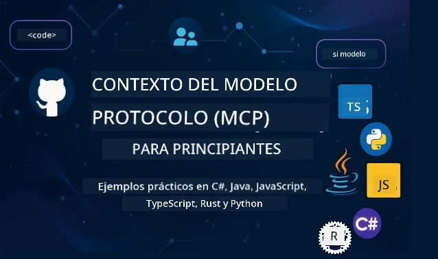

 

[](https://GitHub.com/microsoft/mcp-for-beginners/graphs/contributors)
[](https://GitHub.com/microsoft/mcp-for-beginners/issues)
[](https://GitHub.com/microsoft/mcp-for-beginners/pulls)
[](http://makeapullrequest.com)
[](https://mcptoplist.com/server/mcp.so%2Fmcp-for-beginners%2Fmicrosoft)

[](https://GitHub.com/microsoft/mcp-for-beginners/watchers)
[](https://GitHub.com/microsoft/mcp-for-beginners/fork)
[](https://GitHub.com/microsoft/mcp-for-beginners/stargazers)


[](https://discord.gg/nTYy5BXMWG)

Sigue estos pasos para comenzar a usar estos recursos:
1. **Haz un fork del repositorio**: Haz clic en [](https://GitHub.com/microsoft/mcp-for-beginners/fork)
2. **Clona el repositorio**:   `git clone https://github.com/microsoft/mcp-for-beginners.git`
3. **Únete a** [](https://discord.gg/nTYy5BXMWG)


### 🌐 Soporte Multilingüe

#### Compatible mediante GitHub Action (Automatizado y Siempre Actualizado)

<!-- CO-OP TRANSLATOR LANGUAGES TABLE START -->
[Arabic](../ar/README.md) | [Bengali](../bn/README.md) | [Bulgarian](../bg/README.md) | [Burmese (Myanmar)](../my/README.md) | [Chinese (Simplified)](../zh-CN/README.md) | [Chinese (Traditional, Hong Kong)](../zh-HK/README.md) | [Chinese (Traditional, Macau)](../zh-MO/README.md) | [Chinese (Traditional, Taiwan)](../zh-TW/README.md) | [Croatian](../hr/README.md) | [Czech](../cs/README.md) | [Danish](../da/README.md) | [Dutch](../nl/README.md) | [Estonian](../et/README.md) | [Finnish](../fi/README.md) | [French](../fr/README.md) | [German](../de/README.md) | [Greek](../el/README.md) | [Hebrew](../he/README.md) | [Hindi](../hi/README.md) | [Hungarian](../hu/README.md) | [Indonesian](../id/README.md) | [Italian](../it/README.md) | [Japanese](../ja/README.md) | [Kannada](../kn/README.md) | [Khmer](../km/README.md) | [Korean](../ko/README.md) | [Lithuanian](../lt/README.md) | [Malay](../ms/README.md) | [Malayalam](../ml/README.md) | [Marathi](../mr/README.md) | [Nepali](../ne/README.md) | [Nigerian Pidgin](../pcm/README.md) | [Norwegian](../no/README.md) | [Persian (Farsi)](../fa/README.md) | [Polish](../pl/README.md) | [Portuguese (Brazil)](../pt-BR/README.md) | [Portuguese (Portugal)](../pt-PT/README.md) | [Punjabi (Gurmukhi)](../pa/README.md) | [Romanian](../ro/README.md) | [Russian](../ru/README.md) | [Serbian (Cyrillic)](../sr/README.md) | [Slovak](../sk/README.md) | [Slovenian](../sl/README.md) | [Spanish](./README.md) | [Swahili](../sw/README.md) | [Swedish](../sv/README.md) | [Tagalog (Filipino)](../tl/README.md) | [Tamil](../ta/README.md) | [Telugu](../te/README.md) | [Thai](../th/README.md) | [Turkish](../tr/README.md) | [Ukrainian](../uk/README.md) | [Urdu](../ur/README.md) | [Vietnamese](../vi/README.md)

> **¿Prefieres clonar localmente?**
>
> Este repositorio incluye más de 50 traducciones que aumentan significativamente el tamaño de la descarga. Para clonar sin las traducciones, usa la opción de sparse checkout:
>
> **Bash / macOS / Linux:**
> ```bash
> git clone --filter=blob:none --sparse https://github.com/microsoft/mcp-for-beginners.git
> cd mcp-for-beginners
> git sparse-checkout set --no-cone '/*' '!translations' '!translated_images'
> ```
>
> **CMD (Windows):**
> ```cmd
> git clone --filter=blob:none --sparse https://github.com/microsoft/mcp-for-beginners.git
> cd mcp-for-beginners
> git sparse-checkout set --no-cone "/*" "!translations" "!translated_images"
> ```
>
> Esto te da todo lo necesario para completar el curso con una descarga mucho más rápida.
<!-- CO-OP TRANSLATOR LANGUAGES TABLE END -->

# 🚀 Curriculum del Protocolo de Contexto de Modelo (MCP) para Principiantes

## **Aprende MCP con ejemplos prácticos en C#, Java, JavaScript, Rust, Python y TypeScript**

## 🧠 Resumen del Curriculum del Protocolo de Contexto de Modelo
¡Bienvenido a tu viaje en el Protocolo de Contexto de Modelo! Si alguna vez te has preguntado cómo las aplicaciones de IA se comunican con diferentes herramientas y servicios, estás a punto de descubrir la solución elegante que está transformando la manera en que los desarrolladores crean sistemas inteligentes.

Piensa en MCP como un traductor universal para aplicaciones de IA, tal como los puertos USB te permiten conectar cualquier dispositivo a tu computadora, MCP permite que los modelos de IA se conecten a cualquier herramienta o servicio de manera estandarizada. Ya sea que estés construyendo tu primer chatbot o trabajando en flujos de trabajo complejos de IA, entender MCP te dará el poder de crear aplicaciones más capaces y flexibles.

Este currículo está diseñado con paciencia y cuidado para tu proceso de aprendizaje. Comenzaremos con conceptos simples que ya entiendes y gradualmente construiremos tu experiencia a través de práctica en tu lenguaje de programación favorito. Cada paso incluye explicaciones claras, ejemplos prácticos y mucho ánimo en el camino.

Al completar este viaje, tendrás la confianza para construir tus propios servidores MCP, integrarlos con plataformas populares de IA y entender cómo esta tecnología está transformando el futuro del desarrollo de IA. ¡Comencemos esta emocionante aventura juntos!

### Documentación y Especificaciones Oficiales

La revisión actual del protocolo es **Especificación MCP 2026-07-28**. La especificación MCP
usa versionado basado en fechas (formato AAAA-MM-DD) para hacer explícita la
compatibilidad del protocolo.

> **Nota de versión:** este currículo enseña los conceptos actuales de `2026-07-28`
> que incluyen solicitudes sin estado, el marco de Extensiones y la
> descontinuación de Roots, Sampling y Logging. Algunos ejemplos prácticos permanecen
> explícitamente versionados a `2025-11-25` mientras el soporte del SDK se actualiza. Consulta
> [Qué ha cambiado en MCP: La especificación 2026-07-28](./01-CoreConcepts/mcp-2026-07-28.md)
> para ver los cambios y la guía de migración.

Estos recursos se vuelven más valiosos a medida que aumentas tu comprensión, pero no te sientas presionado a leer todo inmediatamente. ¡Empieza por las áreas que más te interesen!
- 📘 [Documentación MCP](https://modelcontextprotocol.io/) – Este es tu recurso principal para tutoriales paso a paso y guías de usuario. La documentación está escrita para principiantes, proporcionando ejemplos claros para que sigas a tu propio ritmo.
- 📜 [Especificación MCP](https://modelcontextprotocol.io/specification/2026-07-28) – Piensa en esto como tu manual de referencia completo. Mientras avanzas en el currículo, regresarás aquí para buscar detalles específicos y explorar características avanzadas.
- 📜 [Versionado de la Especificación MCP](https://modelcontextprotocol.io/specification/versioning) – Contiene información sobre el historial de versiones del protocolo y cómo MCP usa versionado basado en fechas (formato AAAA-MM-DD).
- 🧑‍💻 [Repositorio GitHub MCP](https://github.com/modelcontextprotocol) – Aquí encontrarás SDKs, herramientas y ejemplos de código en varios lenguajes de programación. Es como un tesoro de ejemplos prácticos y componentes listos para usar.
- 🌐 [Comunidad MCP](https://github.com/orgs/modelcontextprotocol/discussions) – Únete a otros aprendices y desarrolladores experimentados en discusiones sobre MCP. Es una comunidad de apoyo donde las preguntas son bienvenidas y el conocimiento se comparte libremente.
  
## Objetivos de Aprendizaje

Al final de este currículo, te sentirás seguro y entusiasmado con tus nuevas habilidades. Esto es lo que lograrás:

• **Entender los fundamentos de MCP**: Comprenderás qué es el Protocolo de Contexto de Modelo y por qué está revolucionando la manera en que las aplicaciones de IA trabajan juntas, usando analogías y ejemplos que tienen sentido.

• **Construir tu primer servidor MCP**: Crearás un servidor MCP funcional en tu lenguaje de programación preferido, comenzando con ejemplos simples y aumentando tus habilidades paso a paso.

• **Conectar modelos de IA a herramientas reales**: Aprenderás cómo cerrar la brecha entre los modelos de IA y los servicios reales, dándole a tus aplicaciones nuevas capacidades poderosas.

• **Implementar mejores prácticas de seguridad**: Entenderás cómo mantener tus implementaciones MCP seguras, protegiendo tanto tus aplicaciones como a tus usuarios.

• **Desplegar con confianza**: Sabrás cómo llevar tus proyectos MCP desde el desarrollo hasta la producción, con estrategias prácticas de despliegue que funcionan en el mundo real.

• **Unirte a la comunidad MCP**: Formarás parte de una comunidad creciente de desarrolladores que están moldeando el futuro del desarrollo de aplicaciones de IA.

## Antecedentes Esenciales

Antes de sumergirnos en los detalles de MCP, asegurémonos de que te sientas cómodo con algunos conceptos fundamentales. ¡No te preocupes si no eres un experto en estas áreas, explicaremos todo lo que necesitas saber a medida que avanzamos!

### Entendiendo Protocolos (La Base)

Piensa en un protocolo como las reglas para una conversación. Cuando llamas a un amigo, ambos saben decir "hola" al responder, tomar turnos para hablar y decir "adiós" cuando terminan. Los programas informáticos necesitan reglas similares para comunicarse efectivamente.

MCP es un protocolo: un conjunto de reglas acordadas que ayudan a que los modelos y aplicaciones de IA tengan "conversaciones" productivas con herramientas y servicios. Así como tener reglas de conversación hace que la comunicación humana sea más fluida, tener MCP hace que la comunicación entre aplicaciones de IA sea mucho más fiable y poderosa.

### Relaciones Cliente-Servidor (Cómo los programas trabajan juntos)

Ya usas relaciones cliente-servidor todos los días. Cuando usas un navegador web (el cliente) para visitar un sitio web, te conectas a un servidor web que te envía el contenido de la página. El navegador sabe cómo pedir información y el servidor sabe cómo responder.

En MCP, tenemos una relación similar: los modelos de IA actúan como clientes que solicitan información o acciones, mientras que los servidores MCP proporcionan esas capacidades. Es como tener un asistente útil (el servidor) que la IA puede pedir para realizar tareas específicas.

### Por qué la estandarización es importante (Hacer que las cosas funcionen juntas)

Imagina que cada fabricante de autos usara bombas de gasolina de forma diferente - ¡necesitarías un adaptador diferente para cada auto! La estandarización significa ponerse de acuerdo en enfoques comunes para que las cosas funcionen juntas sin problemas.

MCP proporciona esta estandarización para aplicaciones de IA. En lugar de que cada modelo de IA necesite código personalizado para trabajar con cada herramienta, MCP crea una manera universal para que se comuniquen. Esto significa que los desarrolladores pueden construir herramientas una vez y hacer que funcionen con muchos sistemas de IA diferentes.

## 🧭 Resumen de tu Ruta de Aprendizaje

Tu viaje en MCP está cuidadosamente estructurado para construir tu confianza y habilidades progresivamente. Cada fase introduce nuevos conceptos mientras refuerza lo que ya has aprendido.

### 🌱 Fase Fundamental: Entendiendo lo Básico (Módulos 0-2)

¡Aquí es donde comienza tu aventura! Te presentaremos los conceptos de MCP usando analogías familiares y ejemplos simples. Entenderás qué es MCP, por qué existe y cómo encaja en el mundo más amplio del desarrollo de IA.


• **Módulo 0 - Introducción a MCP**: Comenzaremos explorando qué es MCP y por qué es tan importante para las aplicaciones modernas de IA. Verás ejemplos del mundo real de MCP en acción y entenderás cómo resuelve problemas comunes que enfrentan los desarrolladores.

• **Módulo 1 - Conceptos Básicos Explicados**: Aquí aprenderás los bloques de construcción esenciales de MCP. Usaremos muchas analogías y ejemplos visuales para asegurarnos de que estos conceptos se sientan naturales y comprensibles.

• **Módulo 2 - Seguridad en MCP**: La seguridad puede parecer intimidante, pero te mostraremos cómo MCP incluye funciones de seguridad integradas y te enseñaremos las mejores prácticas que protegen tus aplicaciones desde el principio.

### 🔨 Fase de Construcción: Creando Tus Primeras Implementaciones (Módulo 3)

¡Ahora comienza la verdadera diversión! Tendrás experiencia práctica construyendo servidores y clientes MCP reales. No te preocupes: comenzaremos con lo simple y te guiaremos en cada paso.

Este módulo incluye múltiples guías prácticas que te permiten practicar en tu lenguaje de programación preferido. Crearás tu primer servidor, construirás un cliente para conectarte a él e incluso integrarás con herramientas de desarrollo populares como VS Code.

Cada guía incluye ejemplos completos de código, consejos para solucionar problemas y explicaciones de por qué tomamos decisiones de diseño específicas. Al final de esta fase, tendrás implementaciones MCP funcionando de las que podrás sentirte orgulloso.

### 🚀 Fase de Crecimiento: Conceptos Avanzados y Aplicación en el Mundo Real (Módulos 4-5)

Con los conceptos básicos dominados, estarás listo para explorar características MCP más sofisticadas. Cubriremos estrategias prácticas de implementación, técnicas de depuración y temas avanzados como la integración de IA multimodal.

También aprenderás a escalar tus implementaciones MCP para uso en producción e integrarlas con plataformas en la nube como Azure. Estos módulos te preparan para construir soluciones MCP capaces de manejar demandas reales.

### 🌟 Fase de Maestría: Comunidad y Especialización (Módulos 6-11)

La fase final se centra en unirte a la comunidad MCP y especializarte en áreas que más te interesen. Aprenderás a contribuir a proyectos MCP de código abierto, a implementar patrones avanzados de autenticación y a construir soluciones integrales con bases de datos.

El Módulo 11 merece mención especial: es un camino completo de aprendizaje práctico con 13 laboratorios que te enseña a construir servidores MCP listos para producción con integración PostgreSQL. ¡Es como un proyecto final que reúne todo lo que has aprendido!

### 📚 Estructura Completa del Currículo

| Módulo | Tema | Descripción | Enlace |
|--------|-------|-------------|------|
| **Módulos 0-3: Fundamentos** | | | |
| 00 | Introducción a MCP | Visión general del Protocolo de Contexto de Modelo y su importancia en tuberías de IA | [Leer más](./00-Introduction/README.md) |
| 01 | Conceptos Básicos Explicados | Exploración en profundidad de los conceptos centrales de MCP | [Leer más](./01-CoreConcepts/README.md) |
| 1.1 | Qué ha Cambiado en MCP (2026-07-28) | Protocolo sin estado, marco de extensiones y desaprobaciones de funciones en la especificación actual | [Guía](./01-CoreConcepts/mcp-2026-07-28.md) |
| 02 | Seguridad en MCP | Amenazas de seguridad y mejores prácticas | [Leer más](./02-Security/README.md) |
| 2.1 | Autorización CIMD y DCR | Comparar registro CIMD preferido con retroceso DCR obsoleto usando un servidor MCP protegido | [Ejemplo](./02-Security/samples/cimd-dcr-auth/README.md) |
| 03 | Comenzando con MCP | Configuración del entorno, servidores/clientes básicos, integración | [Leer más](./03-GettingStarted/README.md) |
| **Módulo 3: Construyendo Tu Primer Servidor y Cliente** | | | |
| 3.1 | Primer Servidor | Crea tu primer servidor MCP | [Guía](./03-GettingStarted/01-first-server/README.md) |
| 3.2 | Primer Cliente | Desarrolla un cliente MCP básico | [Guía](./03-GettingStarted/02-client/README.md) |
| 3.3 | Cliente con LLM | Integra modelos de lenguaje grandes | [Guía](./03-GettingStarted/03-llm-client/README.md) |
| 3.4 | Integración con VS Code | Consume servidores MCP en VS Code | [Guía](./03-GettingStarted/04-vscode/README.md) |
| 3.5 | Servidor stdio | Crea servidores usando transporte stdio | [Guía](./03-GettingStarted/05-stdio-server/README.md) |
| 3.6 | Streaming HTTP | Implementa streaming HTTP en MCP | [Guía](./03-GettingStarted/06-http-streaming/README.md) |
| 3.7 | Microsoft Foundry Toolkit | Usa Microsoft Foundry Toolkit con MCP | [Guía](./03-GettingStarted/07-aitk/README.md) |
| 3.8 | Pruebas | Prueba tu implementación de servidor MCP | [Guía](./03-GettingStarted/08-testing/README.md) |
| 3.9 | Despliegue | Despliega servidores MCP en producción | [Guía](./03-GettingStarted/09-deployment/README.md) |
| 3.10 | Uso avanzado del servidor | Usa servidores avanzados para uso avanzado de funciones y mejor arquitectura | [Guía](./03-GettingStarted/10-advanced/README.md) |
| 3.11 | Autenticación simple | Un capítulo que te muestra la autenticación desde el principio y RBAC | [Guía](./03-GettingStarted/11-simple-auth/README.md) |
| 3.12 | Hosts MCP | Configura Claude Desktop, Cursor, Cline y otros hosts MCP | [Guía](./03-GettingStarted/12-mcp-hosts/README.md) |
| 3.13 | Inspector MCP | Depura y prueba servidores MCP con la herramienta Inspector | [Guía](./03-GettingStarted/13-mcp-inspector/README.md) |
| 3.14 | Muestreo | Usa muestreo para colaborar con el cliente | [Guía](./03-GettingStarted/14-sampling/README.md) |
| 3.15 | Aplicaciones MCP | Construye aplicaciones MCP | [Guía](./03-GettingStarted/15-mcp-apps/README.md) |
| **Módulos 4-5: Práctico y Avanzado** | | | |
| 04 | Implementación Práctica | SDKs, depuración, pruebas, plantillas de prompts reutilizables | [Leer más](./04-PracticalImplementation/README.md) |
| 4.1 | Paginación | Maneja grandes conjuntos de resultados con paginación basada en cursor | [Guía](./04-PracticalImplementation/pagination/README.md) |
| 05 | Temas Avanzados en MCP | IA multimodal, escalabilidad, uso empresarial | [Leer más](./05-AdvancedTopics/README.md) |
| 5.1 | Integración con Azure | Integración de MCP con Azure | [Guía](./05-AdvancedTopics/mcp-integration/README.md) |
| 5.2 | Multimodalidad | Trabajando con múltiples modalidades | [Guía](./05-AdvancedTopics/mcp-multi-modality/README.md) |
| 5.3 | Demo OAuth2 | Implementa autenticación OAuth2 | [Guía](./05-AdvancedTopics/mcp-oauth2-demo/README.md) |
| 5.4 | Contextos Raíz | Comprender e implementar contextos raíz | [Guía](./05-AdvancedTopics/mcp-root-contexts/README.md) |
| 5.5 | Enrutamiento | Estrategias de enrutamiento MCP | [Guía](./05-AdvancedTopics/mcp-routing/README.md) |
| 5.6 | Muestreo | Técnicas de muestreo en MCP | [Guía](./05-AdvancedTopics/mcp-sampling/README.md) |
| 5.7 | Escalabilidad | Escalar implementaciones MCP | [Guía](./05-AdvancedTopics/mcp-scaling/README.md) |
| 5.8 | Seguridad | Consideraciones avanzadas de seguridad | [Guía](./05-AdvancedTopics/mcp-security/README.md) |
| 5.9 | Búsqueda Web | Implementar capacidades de búsqueda web | [Guía](./05-AdvancedTopics/web-search-mcp/README.md) |
| 5.10 | Streaming en Tiempo Real | Construye funcionalidades de streaming en tiempo real | [Guía](./05-AdvancedTopics/mcp-realtimestreaming/README.md) |
| 5.11 | Búsqueda en Tiempo Real | Implementa búsqueda en tiempo real | [Guía](./05-AdvancedTopics/mcp-realtimesearch/README.md) |
| 5.12 | Autenticación Entra ID | Autenticación con Microsoft Entra ID | [Guía](./05-AdvancedTopics/mcp-security-entra/README.md) |
| 5.13 | Integración Foundry | Integración con Microsoft Foundry | [Guía](./05-AdvancedTopics/mcp-foundry-agent-integration/README.md) |
| 5.14 | Ingeniería de Contexto | Técnicas para ingeniería efectiva de contexto | [Guía](./05-AdvancedTopics/mcp-contextengineering/README.md) |
| 5.15 | Transporte Personalizado MCP | Implementaciones personalizadas de transporte | [Guía](./05-AdvancedTopics/mcp-transport/README.md) |
| 5.16 | Características del Protocolo | Notificaciones de progreso, cancelación, plantillas de recursos | [Guía](./05-AdvancedTopics/mcp-protocol-features/README.md) |
| 5.17 | Razonamiento Multi-Agente Adversarial | Dos agentes discuten lados opuestos usando herramientas MCP compartidas, evaluados por un agente juez | [Guía](./05-AdvancedTopics/mcp-adversarial-agents/README.md) |
| **Módulos 6-10: Comunidad y Mejores Prácticas** | | | |
| 06 | Contribuciones de la Comunidad | Cómo contribuir al ecosistema MCP | [Guía](./06-CommunityContributions/README.md) |
| 07 | Lecciones de la Adopción Temprana | Historias de implementación en el mundo real | [Guía](./07-LessonsfromEarlyAdoption/README.md) |
| 08 | Mejores Prácticas para MCP | Rendimiento, tolerancia a fallos, resiliencia | [Guía](./08-BestPractices/README.md) |
| 09 | Estudios de Caso MCP | Ejemplos prácticos de implementación | [Guía](./09-CaseStudy/README.md) |
| 10 | Taller Práctico | Construyendo un Servidor MCP con Microsoft Foundry Toolkit | [Laboratorio](./10-StreamliningAIWorkflowsBuildingAnMCPServerWithAIToolkit/README.md) |
| **Módulo 11: Laboratorio Práctico de Servidor MCP** | | | |
| 11 | Integración de Base de Datos en Servidor MCP | Ruta de aprendizaje práctico completa de 13 laboratorios para integración PostgreSQL | [Laboratorios](./11-MCPServerHandsOnLabs/README.md) |
| 11.1 | Introducción | Visión general de MCP con integración de base de datos y caso de uso de análisis minorista | [Lab 00](./11-MCPServerHandsOnLabs/00-Introduction/README.md) |
| 11.2 | Arquitectura Básica | Comprender arquitectura del servidor MCP, capas de base de datos y patrones de seguridad | [Lab 01](./11-MCPServerHandsOnLabs/01-Architecture/README.md) |
| 11.3 | Seguridad y Multitenencia | Seguridad a nivel de fila, autenticación y acceso a datos multitenant | [Lab 02](./11-MCPServerHandsOnLabs/02-Security/README.md) |
| 11.4 | Configuración del Entorno | Configuración de entorno de desarrollo, Docker, recursos Azure | [Lab 03](./11-MCPServerHandsOnLabs/03-Setup/README.md) |
| 11.5 | Diseño de la Base de Datos | Configuración PostgreSQL, diseño de esquema minorista y datos de muestra | [Lab 04](./11-MCPServerHandsOnLabs/04-Database/README.md) |
| 11.6 | Implementación del Servidor MCP | Construcción del servidor FastMCP con integración de base de datos | [Lab 05](./11-MCPServerHandsOnLabs/05-MCP-Server/README.md) |
| 11.7 | Desarrollo de Herramientas | Creación de herramientas para consulta de base de datos e introspección de esquemas | [Lab 06](./11-MCPServerHandsOnLabs/06-Tools/README.md) |
| 11.8 | Búsqueda Semántica | Implementación de embeddings vectoriales con Azure OpenAI y pgvector | [Lab 07](./11-MCPServerHandsOnLabs/07-Semantic-Search/README.md) |
| 11.9 | Pruebas y Depuración | Estrategias de pruebas, herramientas de depuración y enfoques de validación | [Lab 08](./11-MCPServerHandsOnLabs/08-Testing/README.md) |
| 11.10 | Integración con VS Code | Configuración de integración MCP en VS Code y uso de AI Chat | [Lab 09](./11-MCPServerHandsOnLabs/09-VS-Code/README.md) |
| 11.11 | Estrategias de Despliegue | Despliegue con Docker, Azure Container Apps y consideraciones de escalado | [Lab 10](./11-MCPServerHandsOnLabs/10-Deployment/README.md) |
| 11.12 | Monitoreo | Application Insights, registro, monitoreo de desempeño | [Lab 11](./11-MCPServerHandsOnLabs/11-Monitoring/README.md) |
| 11.13 | Mejores Prácticas | Optimización de rendimiento, fortalecimiento de seguridad y consejos para producción | [Lab 12](./11-MCPServerHandsOnLabs/12-Best-Practices/README.md) |
| **Módulo 12: Herramientas MCP** | | | |
| 12.1 | Herramientas | Uso de MCP en la aplicación Copilot | [ Guía ](./12-tooling/README.md) |

### 💻 Proyectos de Código de Ejemplo


Una de las partes más emocionantes de aprender MCP es ver cómo tus habilidades de programación se desarrollan progresivamente. Hemos diseñado nuestros ejemplos de código para comenzar simples y volverse más sofisticados a medida que tu comprensión se profundiza. Así es como presentamos los conceptos: con código fácil de entender pero que demuestra principios reales de MCP, comprenderás no solo qué hace este código, sino por qué está estructurado de esta manera y cómo encaja en aplicaciones MCP más amplias.

#### Ejemplos Básicos de Calculadora MCP

| Idioma | Descripción | Enlace |
|----------|-------------|------|
| C# | Ejemplo de Servidor MCP | [Ver Código](./03-GettingStarted/samples/csharp/README.md) |
| Java | Calculadora MCP | [Ver Código](./03-GettingStarted/samples/java/calculator/README.md) |
| JavaScript | Demo MCP | [Ver Código](./03-GettingStarted/samples/javascript/README.md) |
| Python | Servidor MCP | [Ver Código](../../03-GettingStarted/samples/python/mcp_calculator_server.py) |
| TypeScript | Ejemplo MCP | [Ver Código](./03-GettingStarted/samples/typescript/README.md) |
| Rust | Ejemplo MCP | [Ver Código](./03-GettingStarted/samples/rust/README.md) |

#### Implementaciones Avanzadas de MCP

| Idioma | Descripción | Enlace |
|----------|-------------|------|
| C# | Ejemplo Avanzado | [Ver Código](./04-PracticalImplementation/samples/csharp/README.md) |
| Java con Spring | Ejemplo de Aplicación de Contenedor | [Ver Código](./04-PracticalImplementation/samples/java/containerapp/README.md) |
| JavaScript | Ejemplo Avanzado | [Ver Código](./04-PracticalImplementation/samples/javascript/README.md) |
| Python | Implementación Compleja | [Ver Código](./04-PracticalImplementation/samples/python/README.md) |
| TypeScript | Ejemplo de Contenedor | [Ver Código](./04-PracticalImplementation/samples/typescript/README.md) |


## 🎯 Requisitos Previos para Aprender MCP

Para aprovechar al máximo este plan de estudios, deberías tener:

- Conocimientos básicos de programación en al menos uno de los siguientes lenguajes: C#, Java, JavaScript, Python o TypeScript
- Comprensión del modelo cliente-servidor y APIs
- Familiaridad con los conceptos de REST y HTTP
- (Opcional) Conocimientos de conceptos de IA/ML

- Participar en nuestras discusiones comunitarias para apoyo

## 📚 Guía de Estudio y Recursos

Este repositorio incluye varios recursos para ayudarte a navegar y aprender de manera efectiva:

### Guía de Estudio

Una completa [Guía de Estudio](./study_guide.md) está disponible para ayudarte a navegar este repositorio de manera efectiva. Este mapa curricular visual muestra cómo se conectan todos los temas y ofrece orientación sobre cómo usar los proyectos de ejemplo de manera efectiva. Es especialmente útil si eres un aprendiz visual al que le gusta ver el panorama general.

La guía incluye:
- Un mapa curricular visual que muestra todos los temas cubiertos
- Desglose detallado de cada sección del repositorio
- Orientación sobre cómo usar los proyectos de ejemplo
- Rutas de aprendizaje recomendadas para diferentes niveles de habilidad
- Recursos adicionales para complementar tu viaje de aprendizaje

### Registro de Cambios

Mantenemos un detallado [Registro de Cambios](./changelog.md) que rastrea todas las actualizaciones importantes a los materiales del plan de estudios, para que puedas estar al día con las últimas mejoras y adiciones.
- Nuevas adiciones de contenido
- Cambios estructurales
- Mejoras de funciones
- Actualizaciones de documentación

## 🛠️ Cómo Usar Este Plan de Estudios de Manera Efectiva

Cada lección en esta guía incluye:

1. Explicaciones claras de conceptos MCP  
2. Ejemplos de código en vivo en varios lenguajes  
3. Ejercicios para construir aplicaciones MCP reales  
4. Recursos adicionales para estudiantes avanzados

### Aprendamos MCP con C# - Serie Tutorial
Aprendamos sobre el Protocolo de Contexto de Modelo (MCP), un marco innovador diseñado para estandarizar las interacciones entre modelos de IA y aplicaciones cliente. A través de esta sesión para principiantes, te presentaremos MCP y te guiaremos para crear tu primer servidor MCP.
#### C#: [https://aka.ms/letslearnmcp-csharp](https://aka.ms/letslearnmcp-csharp)
#### Java: [https://aka.ms/letslearnmcp-java](https://aka.ms/letslearnmcp-java)
#### JavaScript: [https://aka.ms/letslearnmcp-javascript](https://aka.ms/letslearnmcp-javascript)
#### Python: [https://aka.ms/letslearnmcp-python](https://aka.ms/letslearnmcp-python)

## 🎓 Tu Viaje MCP Comienza

¡Felicitaciones! Acabas de dar el primer paso en un emocionante viaje que ampliará tus capacidades de programación y te conectará con la vanguardia del desarrollo de IA.

### Lo Que Ya Has Logrado

Al leer esta introducción, ya has comenzado a construir tu base de conocimiento sobre MCP. Entiendes qué es MCP, por qué es importante y cómo este plan de estudios apoyará tu viaje de aprendizaje. Eso es un logro significativo y el comienzo de tu pericia en esta importante tecnología.

### La Aventura que Tienes por Delante

A medida que avances por los módulos, recuerda que todo experto fue alguna vez un principiante. Los conceptos que ahora parecen complejos se volverán algo natural a medida que practiques y los apliques. Cada pequeño paso contribuye a desarrollar potentes habilidades que te servirán durante toda tu carrera como desarrollador.

### Tu Red de Apoyo

Te unes a una comunidad de aprendices y expertos que son apasionados por MCP y están dispuestos a ayudar a otros a tener éxito. Ya sea que estés atascado en un desafío de código o emocionado para compartir un avance, la comunidad está aquí para apoyar tu viaje.

Si te quedas atascado o tienes alguna pregunta sobre cómo construir aplicaciones de IA, únete a otros estudiantes y desarrolladores experimentados en discusiones sobre MCP. Es una comunidad de apoyo donde las preguntas son bienvenidas y el conocimiento se comparte libremente.

[](https://discord.gg/nTYy5BXMWG)

Si tienes comentarios sobre el producto o errores mientras construyes visita:

[](https://aka.ms/foundry/forum)

### ¿Listo para Comenzar?

¡Tu aventura MCP comienza ahora! Empieza con el Módulo 0 para sumergirte en tus primeras experiencias prácticas con MCP, o explora los proyectos de ejemplo para ver qué estarás construyendo. Recuerda: todo experto comenzó exactamente donde tú estás ahora, y con paciencia y práctica, te sorprenderás de lo que puedes lograr.

¡Bienvenido al mundo del desarrollo con el Protocolo de Contexto de Modelo! ¡Construyamos algo increíble juntos!

## 🤝 Contribuyendo a la Comunidad de Aprendizaje

¡Este plan de estudios se fortalece con las contribuciones de aprendices como tú! Ya sea que corrijas un error tipográfico, sugieras una explicación más clara o agregues un nuevo ejemplo, tus aportaciones ayudan a otros principiantes a tener éxito.

Gracias al Profesional Valorado de Microsoft [Shivam Goyal](https://www.linkedin.com/in/shivam2003/) por contribuir con ejemplos de código.

El proceso de contribución está diseñado para ser acogedor y de apoyo. La mayoría de las contribuciones requieren un Acuerdo de Licencia de Colaborador (CLA), pero las herramientas automatizadas te guiarán sin problemas.

## 📜 Aprendizaje de Código Abierto

Todo este plan de estudios está disponible bajo la licencia MIT [LICENSE](../../LICENSE), lo que significa que puedes usarlo, modificarlo y compartirlo libremente. Esto apoya nuestra misión de hacer que el conocimiento MCP sea accesible para desarrolladores de todo el mundo.
## 🤝 Directrices de Contribución

Este proyecto recibe contribuciones y sugerencias. La mayoría de las contribuciones requieren aceptar un
Acuerdo de Licencia de Colaborador (CLA) declarando que tienes el derecho de, y efectivamente otorgas,
los derechos para usar tu contribución. Para más detalles, visita <https://cla.opensource.microsoft.com>.

Cuando envíes una solicitud de extracción, un bot de CLA determinará automáticamente si necesitas proporcionar
un CLA y decorará la PR apropiadamente (por ejemplo, verificación de estado, comentario). Simplemente sigue las instrucciones
proporcionadas por el bot. Solo tendrás que hacer esto una vez en todos los repositorios que usan nuestro CLA.

Este proyecto ha adoptado el [Código de Conducta de Código Abierto de Microsoft](https://opensource.microsoft.com/codeofconduct/).
Para más información, consulta las [Preguntas Frecuentes del Código de Conducta](https://opensource.microsoft.com/codeofconduct/faq/) o
contacta a [opencode@microsoft.com](mailto:opencode@microsoft.com) con cualquier pregunta o comentario adicional.

---

*¿Listo para comenzar tu viaje MCP? Comienza con [Módulo 00 - Introducción a MCP](./00-Introduction/README.md) y da tus primeros pasos en el mundo del desarrollo con el Protocolo de Contexto de Modelo!*


## 🎒 Otros Cursos
¡Nuestro equipo produce otros cursos! Consulta:

<!-- CO-OP TRANSLATOR OTHER COURSES START -->
### LangChain
[](https://aka.ms/langchain4j-for-beginners)
[](https://aka.ms/langchainjs-for-beginners?WT.mc_id=m365-94501-dwahlin)
[](https://github.com/microsoft/langchain-for-beginners?WT.mc_id=m365-94501-dwahlin)
---

### Azure / Edge / MCP / Agentes
[](https://github.com/microsoft/AZD-for-beginners?WT.mc_id=academic-105485-koreyst)
[](https://github.com/microsoft/edgeai-for-beginners?WT.mc_id=academic-105485-koreyst)
[](https://github.com/microsoft/mcp-for-beginners?WT.mc_id=academic-105485-koreyst)
[](https://github.com/microsoft/ai-agents-for-beginners?WT.mc_id=academic-105485-koreyst)

---
 
### Serie de IA Generativa
[](https://github.com/microsoft/generative-ai-for-beginners?WT.mc_id=academic-105485-koreyst)
[-9333EA?style=for-the-badge&labelColor=E5E7EB&color=9333EA)](https://github.com/microsoft/Generative-AI-for-beginners-dotnet?WT.mc_id=academic-105485-koreyst)
[-C084FC?style=for-the-badge&labelColor=E5E7EB&color=C084FC)](https://github.com/microsoft/generative-ai-for-beginners-java?WT.mc_id=academic-105485-koreyst)
[-E879F9?style=for-the-badge&labelColor=E5E7EB&color=E879F9)](https://github.com/microsoft/generative-ai-with-javascript?WT.mc_id=academic-105485-koreyst)

---
 
### Aprendizaje Básico
[](https://aka.ms/ml-beginners?WT.mc_id=academic-105485-koreyst)
[](https://aka.ms/datascience-beginners?WT.mc_id=academic-105485-koreyst)

[](https://aka.ms/ai-beginners?WT.mc_id=academic-105485-koreyst)
[](https://github.com/microsoft/Security-101?WT.mc_id=academic-96948-sayoung)
[](https://aka.ms/webdev-beginners?WT.mc_id=academic-105485-koreyst)
[](https://aka.ms/iot-beginners?WT.mc_id=academic-105485-koreyst)
[](https://github.com/microsoft/xr-development-for-beginners?WT.mc_id=academic-105485-koreyst)

---
 
### Serie Copilot
[](https://aka.ms/GitHubCopilotAI?WT.mc_id=academic-105485-koreyst)
[](https://github.com/microsoft/mastering-github-copilot-for-dotnet-csharp-developers?WT.mc_id=academic-105485-koreyst)
[](https://github.com/microsoft/CopilotAdventures?WT.mc_id=academic-105485-koreyst)
<!-- CO-OP TRANSLATOR OTHER COURSES END -->

---

<!-- CO-OP TRANSLATOR DISCLAIMER START -->
**Descargo de responsabilidad**:
Este documento ha sido traducido utilizando el servicio de traducción automática [Co-op Translator](https://github.com/Azure/co-op-translator). Aunque nos esforzamos por la precisión, tenga en cuenta que las traducciones automatizadas pueden contener errores o inexactitudes. El documento original en su idioma nativo debe considerarse la fuente autorizada. Para información crítica, se recomienda una traducción profesional humana. No somos responsables de cualquier malentendido o interpretación errónea que surja del uso de esta traducción.
<!-- CO-OP TRANSLATOR DISCLAIMER END -->