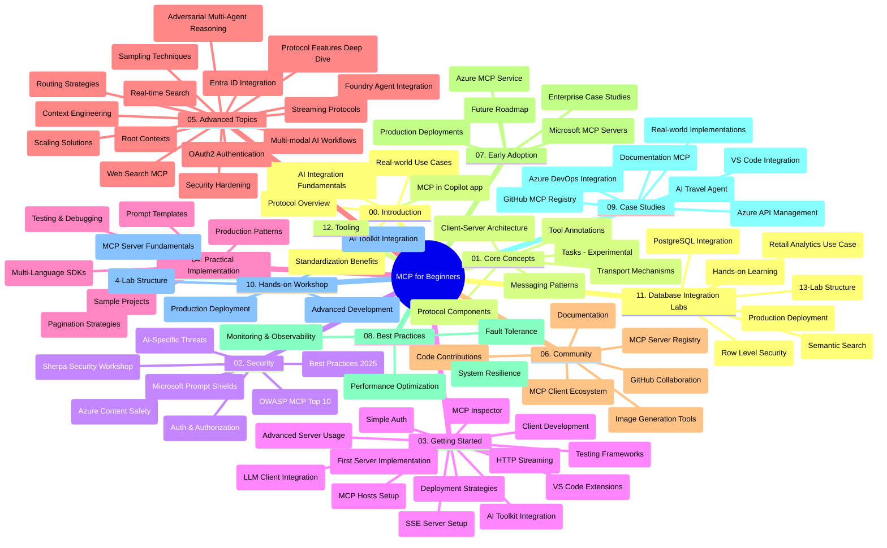

# Protocolo de Contexto de Modelo (MCP) para Principiantes - Guía de Estudio

Esta guía de estudio ofrece una visión general de la estructura y el contenido del repositorio para el plan de estudios "Protocolo de Contexto de Modelo (MCP) para Principiantes". Usa esta guía para navegar eficientemente por el repositorio y aprovechar al máximo los recursos disponibles.

## Visión General del Repositorio

El Protocolo de Contexto de Modelo (MCP) es un marco estandarizado para las interacciones entre modelos de IA y aplicaciones cliente. Inicialmente creado por Anthropic, MCP ahora es mantenido por la comunidad más amplia de MCP a través de la organización oficial de GitHub. Este repositorio ofrece un plan de estudios completo con ejemplos prácticos de código en C#, Java, JavaScript, Python y TypeScript, diseñado para desarrolladores de IA, arquitectos de sistemas e ingenieros de software.

## Mapa Visual del Plan de Estudios

## Estructura del Repositorio

El repositorio está organizado en doce secciones principales, cada una enfocada en diferentes aspectos del MCP:

1. **Introducción (00-Introduction/)**
   - Visión general del Protocolo de Contexto de Modelo
   - Por qué la estandarización es importante en las tuberías de IA
   - Casos de uso prácticos y beneficios

2. **Conceptos Básicos (01-CoreConcepts/)**
   - Arquitectura cliente-servidor
   - Componentes clave del protocolo
   - Patrones de mensajería en MCP
   - Especificación actual: [Qué ha cambiado en MCP: La especificación 2026-07-28](./01-CoreConcepts/mcp-2026-07-28.md) — el núcleo de protocolo sin estado, marco de extensiones y deprecaciones de Raíces/Muestreo/Registro

3. **Seguridad (02-Security/)**
   - Amenazas de seguridad en sistemas basados en MCP
   - Mejores prácticas para asegurar las implementaciones
   - Estrategias de autenticación y autorización
   - Ejemplo práctico de autorización [CIMD y DCR](./02-Security/samples/cimd-dcr-auth/README.md)
   - **Documentación completa de seguridad**:
     - Mejores Prácticas de Seguridad MCP
     - Guía de implementación de Azure Content Safety
     - Controles y técnicas de seguridad MCP
     - Referencia rápida de mejores prácticas MCP
   - **Temas clave de seguridad**:
     - Inyección de prompts y ataques de envenenamiento de herramientas
     - Secuestro de sesión y problemas de delegado confundido
     - Vulnerabilidades de paso de tokens
     - Permisos excesivos y control de acceso
     - Seguridad de la cadena de suministro para componentes de IA
     - Integración de Microsoft Prompt Shields

4. **Primeros Pasos (03-GettingStarted/)**
   - Configuración y preparación del entorno
   - Creación de servidores y clientes MCP básicos
   - Integración con aplicaciones existentes
   - Incluye secciones para:
     - Primera implementación de servidor
     - Desarrollo de cliente
     - Integración de cliente LLM
     - Integración en VS Code
     - Servidor de Eventos enviados por Servidor (SSE)
     - Uso avanzado de servidor
     - Streaming HTTP
     - Integración con AI Toolkit
     - Estrategias de prueba
     - Directrices para despliegue

5. **Implementación Práctica (04-PracticalImplementation/)**
   - Uso de SDKs en diferentes lenguajes de programación
   - Técnicas de depuración, pruebas y validación
   - Creación de plantillas de prompt reutilizables y flujos de trabajo
   - Proyectos de ejemplo con ejemplos de implementación

6. **Temas Avanzados (05-AdvancedTopics/)**
   - Técnicas de ingeniería de contexto
   - Integración de agente Foundry
   - Flujos de trabajo multimodales de IA
   - Demos de autenticación OAuth2
   - Capacidades de búsqueda en tiempo real
   - Streaming en tiempo real
   - Implementación de contextos raíz
   - Estrategias de enrutamiento
   - Técnicas de muestreo
   - Enfoques de escalabilidad
   - Consideraciones de seguridad
   - Integración de seguridad con Entra ID
   - Integración de búsqueda web
   - Razonamiento multiagente adversario (patrones de debate)

7. **Contribuciones de la Comunidad (06-CommunityContributions/)**
   - Cómo contribuir código y documentación
   - Colaboración vía GitHub
   - Mejoras impulsadas por la comunidad y retroalimentación
   - Uso de diversos clientes MCP (Claude Desktop, Cline, VSCode)
   - Trabajo con servidores MCP populares incluyendo generación de imágenes

8. **Lecciones de la Adopción Temprana (07-LessonsfromEarlyAdoption/)**
   - Implementaciones y casos de éxito en el mundo real
   - Construcción y despliegue de soluciones basadas en MCP
   - Tendencias y hoja de ruta futura
   - **Guía de Servidores MCP de Microsoft**: Guía completa de 10 servidores MCP de Microsoft listos para producción, incluyendo:
     - Servidor MCP Microsoft Learn Docs
     - Servidor MCP Azure (15+ conectores especializados)
     - Servidor MCP GitHub
     - Servidor MCP Azure DevOps
     - Servidor MCP MarkItDown
     - Servidor MCP SQL Server
     - Servidor MCP Playwright
     - Servidor MCP Dev Box
     - Servidor MCP Microsoft Foundry
     - Servidor MCP Microsoft 365 Agents Toolkit

9. **Mejores Prácticas (08-BestPractices/)**
   - Optimización y ajuste del desempeño
   - Diseño de sistemas MCP tolerantes a fallos
   - Estrategias de prueba y resiliencia

10. **Estudios de Caso (09-CaseStudy/)**
    - **Siete estudios de caso completos** demostrando la versatilidad de MCP en diferentes escenarios:
    - **Agentes de Viaje AI de Azure**: Orquestación multiagente con Azure OpenAI y AI Search
    - **Integración con Azure DevOps**: Automatización de procesos de flujo de trabajo con actualizaciones de datos de YouTube
    - **Recuperación de Documentación en Tiempo Real**: Cliente de consola Python con streaming HTTP
    - **Generador Interactivo de Planes de Estudio**: Aplicación web Chainlit con IA conversacional
    - **Documentación en el Editor**: Integración en VS Code con flujos de trabajo GitHub Copilot
    - **Gestión de API de Azure**: Integración de API empresarial con creación de servidor MCP
    - **Registro MCP GitHub**: Plataforma de desarrollo de ecosistema e integración agentica
    - Ejemplos de implementación que abarcan integración empresarial, productividad desarrollador y desarrollo de ecosistema

11. **Taller Práctico (10-StreamliningAIWorkflowsBuildingAnMCPServerWithAIToolkit/)**
    - Taller práctico integral que combina MCP con AI Toolkit
    - Construcción de aplicaciones inteligentes que conectan modelos de IA con herramientas del mundo real
    - Módulos prácticos que cubren fundamentos, desarrollo de servidor personalizado y estrategias de despliegue en producción
    - **Estructura del Laboratorio**:
      - Laboratorio 1: Fundamentos del Servidor MCP
      - Laboratorio 2: Desarrollo Avanzado de Servidor MCP
      - Laboratorio 3: Integración de AI Toolkit
      - Laboratorio 4: Despliegue en Producción y Escalamiento
    - Enfoque de aprendizaje basado en laboratorios con instrucciones paso a paso

12. **Laboratorios de Integración de Base de Datos para Servidor MCP (11-MCPServerHandsOnLabs/)**
    - **Ruta de aprendizaje completa de 13 laboratorios** para construir servidores MCP listos para producción con integración PostgreSQL
    - **Implementación analítica minorista del mundo real** usando el caso de uso Zava Retail
    - **Patrones de nivel empresarial** incluyendo seguridad a nivel de fila (RLS), búsqueda semántica y acceso a datos multi-inquilino
    - **Estructura completa del laboratorio**:
      - **Laboratorios 00-03: Fundamentos** - Introducción, Arquitectura, Seguridad, Configuración de entorno
      - **Laboratorios 04-06: Construcción del Servidor MCP** - Diseño de base de datos, Implementación de Servidor MCP, Desarrollo de herramientas
      - **Laboratorios 07-09: Funcionalidades Avanzadas** - Búsqueda semántica, Pruebas y depuración, Integración en VS Code
      - **Laboratorios 10-12: Producción y Mejores Prácticas** - Despliegue, Monitoreo, Optimización
    - **Tecnologías cubiertas**: Framework FastMCP, PostgreSQL, Azure OpenAI, Azure Container Apps, Application Insights
    - **Resultados de aprendizaje**: Servidores MCP listos para producción, patrones de integración de base de datos, análisis potenciado por IA, seguridad empresarial

13. **Herramientas (12-tooling/)**
    - Aprende cómo usar MCP en la app Copilot y otras herramientas

## Recursos Adicionales

El repositorio incluye recursos de apoyo:

- **Carpeta de imágenes**: Contiene diagramas e ilustraciones usadas a lo largo del plan de estudios
- **Traducciones**: Soporte multilingüe con traducciones automáticas de la documentación
- **Recursos oficiales de MCP**:
  - [Documentación MCP](https://modelcontextprotocol.io/)
  - [Especificación MCP](https://modelcontextprotocol.io/specification/2026-07-28/)
  - [Repositorio MCP en GitHub](https://github.com/modelcontextprotocol)

## Cómo Usar Este Repositorio

1. **Aprendizaje Secuencial**: Sigue los capítulos en orden (00 a 11) para una experiencia de aprendizaje estructurada.
2. **Enfoque por Lenguaje**: Si te interesa un lenguaje de programación en particular, explora los directorios de ejemplos para implementaciones en tu lenguaje preferido.
3. **Implementación Práctica**: Comienza con la sección "Primeros Pasos" para configurar tu entorno y crear tu primer servidor y cliente MCP.
4. **Exploración Avanzada**: Una vez que domines los fundamentos, profundiza en los temas avanzados para ampliar tu conocimiento.
5. **Participación Comunitaria**: Únete a la comunidad MCP a través de discusiones en GitHub y canales Discord para conectar con expertos y otros desarrolladores.

## Clientes y Herramientas MCP

El plan de estudios cubre varios clientes y herramientas MCP:

1. **Clientes Oficiales**:
   - Visual Studio Code
   - MCP en Visual Studio Code
   - Claude Desktop
   - Claude en VSCode
   - Claude API

2. **Clientes de la Comunidad**:
   - Cline (basado en terminal)
   - Cursor (editor de código)
   - ChatMCP
   - Windsurf

3. **Herramientas de Gestión MCP**:
   - MCP CLI
   - MCP Manager
   - MCP Linker
   - MCP Router

## Servidores MCP Populares

El repositorio presenta varios servidores MCP, incluyendo:

1. **Servidores MCP Oficiales de Microsoft**:
   - Servidor MCP Microsoft Learn Docs
   - Servidor MCP Azure (15+ conectores especializados)
   - Servidor MCP GitHub
   - Servidor MCP Azure DevOps
   - Servidor MCP MarkItDown
   - Servidor MCP SQL Server
   - Servidor MCP Playwright
   - Servidor MCP Dev Box
   - Servidor MCP Microsoft Foundry
   - Servidor MCP Microsoft 365 Agents Toolkit

2. **Servidores de Referencia Oficiales**:
   - Filesystem
   - Fetch
   - Memory
   - Sequential Thinking

3. **Generación de Imágenes**:
   - Azure OpenAI DALL-E 3
   - Stable Diffusion WebUI
   - Replicate

4. **Herramientas de Desarrollo**:
   - Git MCP
   - Control de Terminal
   - Asistente de Código

5. **Servidores Especializados**:
   - Salesforce
   - Microsoft Teams
   - Jira y Confluence

## Contribuciones

Este repositorio da la bienvenida a contribuciones de la comunidad. Consulta la sección Contribuciones de la Comunidad para orientación sobre cómo contribuir de manera efectiva al ecosistema MCP.

----

*Esta guía de estudio fue actualizada por última vez el 9 de septiembre de 2026. Refleja la
especificación MCP `2026-07-28`, la revisión actual del protocolo. Algunos ejemplos prácticos
permanecen explícitamente versionados a `2025-11-25` mientras sus SDKs y herramientas
adoptan las APIs del protocolo sin estado.*

---

<!-- CO-OP TRANSLATOR DISCLAIMER START -->
**Descargo de responsabilidad**:
Este documento ha sido traducido utilizando el servicio de traducción automática [Co-op Translator](https://github.com/Azure/co-op-translator). Aunque nos esforzamos por la precisión, tenga en cuenta que las traducciones automatizadas pueden contener errores o inexactitudes. El documento original en su idioma nativo debe considerarse la fuente autorizada. Para información crítica, se recomienda una traducción profesional humana. No somos responsables de cualquier malentendido o interpretación errónea que surja del uso de esta traducción.
<!-- CO-OP TRANSLATOR DISCLAIMER END -->