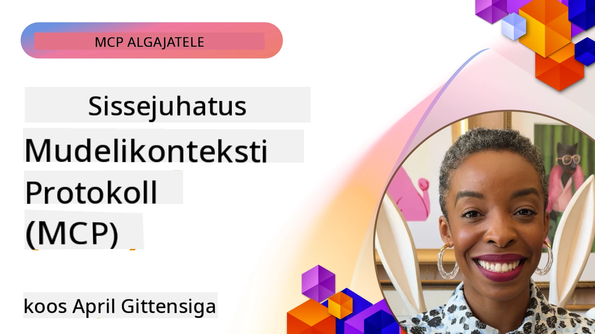
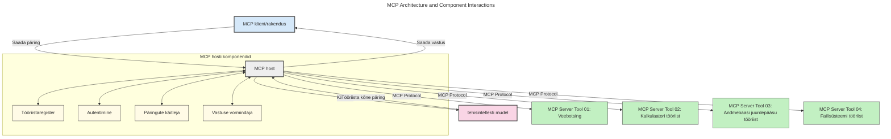
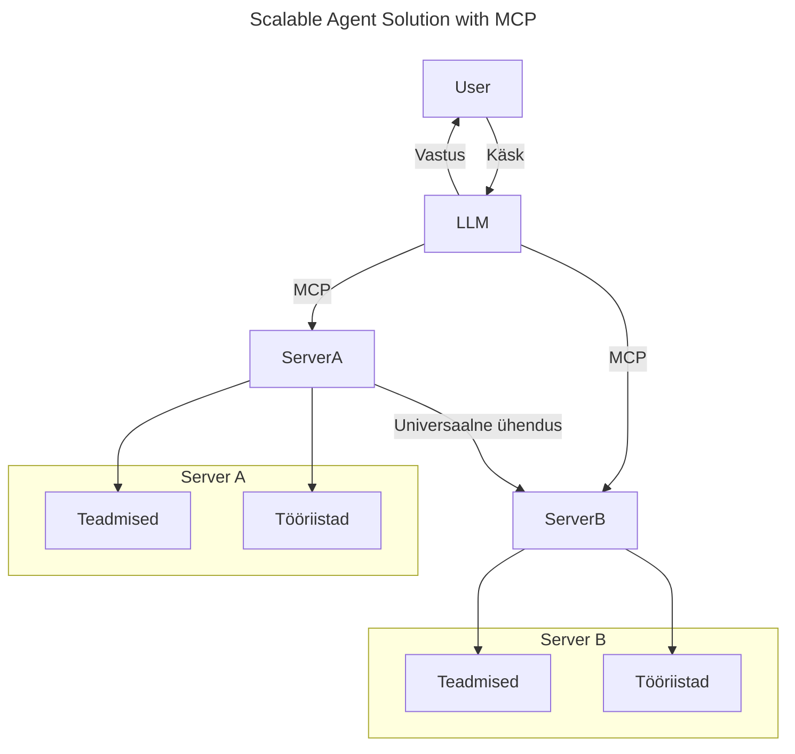
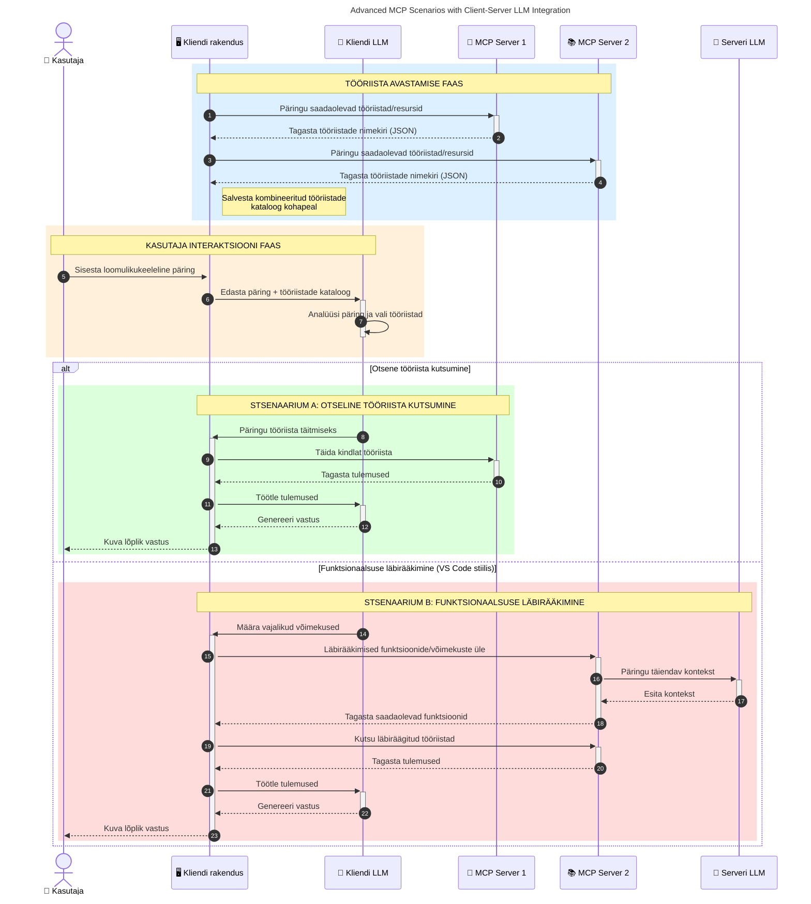

# Mudeli konteksti protokolli (MCP) sissejuhatus: miks see skaleeritavate AI rakenduste jaoks oluline on

_(Klõpsa ülal olevale pildile, et vaadata selle lõigu videot)_

Generatiivsed AI rakendused on suur samm edasi, kuna need lubavad kasutajal rakendusega suhelda loomulikus keeles esitatud käskude kaudu. Kuid kui sellesse rakendustesse investeeritakse rohkem aega ja ressursse, tahad veenduda, et funktsionaalsused ja ressursid on kerge integreerida viisil, mis võimaldab rakendust lihtsalt laiendada, toetab mitme mudeli samaaegset kasutamist ning suudab käsitleda erinevaid mudelite nüansse. Lühidalt, generatiivsete AI rakenduste loomine on alguses lihtne, kuid kui need kasvavad ja muutuvad keerukamaks, tuleb hakata määratlema arhitektuuri ning tõenäoliselt sõltuda standardist, mis tagab rakenduste järjepideva ehituse. Siin tulebki mängu MCP, mis aitab asju organiseerida ja pakub standardit.

---

## **🔍 Mis on mudeli konteksti protokoll (MCP)?**

**Mudeli konteksti protokoll (MCP)** on **avatud, standardiseeritud liides**, mis võimaldab suurte keelemudelite (LLM-id) sujuvalt suhelda väliste tööriistade, API-de ja andmeallikatega. See pakub ühtset arhitektuuri, mis laiendab AI mudelite funktsionaalsust väljaspool nende koolitusandmeid, võimaldades targemaid, skaleeritavamaid ja reageerimisvõimelisemaid AI süsteeme.

---

## **🎯 Miks AI valdkonnas standardiseerimine oluline on**

Kuna generatiivsed AI rakendused muutuvad keerukamaks, on oluline rakendada standardeid, mis tagavad **skaleeritavuse, laiendatavuse, hooldatavuse** ja **tõrjuvad sõltuvuse konkreetsetest tarnijatest**. MCP vastab neile vajadustele:

- Mudeli ja tööriista integratsioonide ühtlustamisega
- Ühekordsete, haprate kohandatud lahenduste vähendamisega
- Võimaldades ühes ökosüsteemis eksisteerida mitmel tarnija mudelil

**Märkus:** Kuigi MCP end esitleb avatud standardina, ei ole plaanis MCP standardiseerida ühegi olemasoleva standardiorgani nagu IEEE, IETF, W3C, ISO või muu standardiasutus kaudu.

---

## **📚 Õpieesmärgid**

Selle artikli lõpuks suudad:

- Määratleda **mudeli konteksti protokolli (MCP)** ja selle kasutusjuhtumeid
- Mõista, kuidas MCP standardiseerib mudeli ja tööriista vahelist kommunikatsiooni
- Tuvastada MCP arhitektuuri põhikomponente
- Uurida MCP kasutusvõimalusi ettevõtte ja arenduse kontekstis

---

## **💡 Miks on mudeli konteksti protokoll (MCP) läbimurre**

### **🔗 MCP lahendab AI interaktsioonide killustatuse**

Enne MCP-d nõudis mudelite ühendamine tööriistadega:

- Kohandatud koodi iga tööriista-mudeli paari jaoks
- Mittestandardseid API-sid iga tarnija puhul
- Sageli katkestasid uuendused ühendusi
- Halb skaleeritavus tööriistade arvu kasvu korral

### **✅ MCP standardiseerimise eelised**

| **Eelis**                 | **Kirjeldus**                                                                  |
|--------------------------|--------------------------------------------------------------------------------|
| Ühilduvus                | LLM-id töötavad sujuvalt eri tarnijate tööriistadega                           |
| Järjepidevus             | Ühtne käitumine platvormide ja tööriistade vahel                              |
| Taaskasutatavus          | Kord ehitatud tööriistu saab kasutada eri projektides ja süsteemides           |
| Arenduse kiirendus       | Vähem arendusaega, kasutades standardiseeritud, plug-and-play liideseid       |

---

## **🧱 MCP arhitektuuri ülevaade suurelt tasemelt**

MCP järgib **kliendi- ja serveri mudelit**, kus:

- **MCP Hostid** jooksutavad AI mudeleid
- **MCP kliendid** algatavad päringuid
- **MCP serverid** pakuvad konteksti, tööriistu ja võimekusi

### **Põhikomponendid:**

- **Ressursid** – staatilised või dünaamilised andmed mudelitele  
- **Päringud** – eelmääratletud töövood juhitud genereerimiseks  
- **Tööriistad** – täidetavad funktsioonid nagu otsing, arvutused  
- **Valikprotsess** – agentide käitumine rekursiivsete interaktsioonide kaudu (kehtetu alates
    MCP `2026-07-28`; uued rakendused peaksid integreeruma otse LLM
    pakkujaga)
- **Andmekorje** – serveri algatatud kasutajasisendi päringud
- **Juurdepääsupunktid** – informatiivsed failisüsteemi asukohad, mis on serverile olulised
    (kehtetu alates MCP `2026-07-28`; eelistada tööriista parameetreid, ressursside URI-sid või
    serveri konfiguratsiooni)

### **Protokolli arhitektuur:**

MCP kasutab kahekihilist arhitektuuri:
- **Andmekiht**: JSON-RPC 2.0 sõnumid, päringu metainfo, avastamine ja
    protokolli primitiivid
- **Transportkiht**: stdio kohalikele alamprotsessidele ja Streamable HTTP kaugetele serveritele.
    Streamable HTTP kasutab voogesitamiseks SSE raamimist, kuid vanem
    HTTP+SSE transport on aegunud.

---

## Kuidas MCP serverid töötavad

MCP serverid töötavad järgmiselt:

- **Päringute voog**:
    1. Päringu algatab lõppkasutaja või tema nimel tegutsev tarkvara.
    2. **MCP klient** saadab päringu **MCP hostile**, kes haldab AI mudeli tööaja keskkonda.
    3. **AI mudel** võtab kasutaja päringu vastu ja võib teha vastava tööriista kutse, et pääseda ligi välistele tööriistadele või andmetele.
    4. **MCP host**, mitte mudel ise, suhtleb vastava standardiseeritud protokolli abil õige **MCP serveriga/servertega**.
- **MCP hosti funktsioonid**:
    - **Tööriistade registri haldus**: hoiab kataloogi olemasolevatest tööriistadest ja nende võimekusest.
    - **Autentimine**: kontrollib õigusi tööriistadele ligipääsuks.
    - **Päringute haldur**: töötleb mudelilt tulevaid tööriistade päringuid.
    - **Vastuse vormindaja**: struktureerib tööriistade väljundid mudelile mõistetavas vormis.
- **MCP serveri täitmine**:
    - **MCP host** suunab tööriistade kutsed ühele või mitmele **MCP serverile**, mis pakuvad spetsialiseerunud funktsioone (nt otsing, arvutused, andmebaasi päringud).
    - **MCP serverid** teostavad vastavad toimingud ja tagastavad tulemused **MCP hostile** ühtses vormingus.
    - **MCP host** vormindab ja edastab need tulemused edasi **AI mudelile**.
- **Vastuse lõpuleviimine**:
    - **AI mudel** lisab tööriista väljundid lõplikku vastusesse.
    - **MCP host** saadab selle vastuse tagasi **MCP kliendile**, kes edastab selle lõppkasutajale või kutsuvale tarkvarale.
    

## 👨‍💻 Kuidas ehitada MCP serverit (näidete abil)

MCP serverid võimaldavad laiendada LLMide võimekusi, pakkudes andmeid ja funktsioone. 

Kas oled valmis proovima? Siin on keele- ja tehnoloogiapõhised SDK-d koos näidetega lihtsate MCP serverite loomise kohta erinevates keeltes/tehnoloogiate komplektides:

- **Python SDK**: https://github.com/modelcontextprotocol/python-sdk

- **TypeScript SDK**: https://github.com/modelcontextprotocol/typescript-sdk

- **Java SDK**: https://github.com/modelcontextprotocol/java-sdk

- **C#/.NET SDK**: https://github.com/modelcontextprotocol/csharp-sdk

## 🌍 MCP reaalse maailma kasutusjuhtumid

MCP võimaldab laia valikut rakendusi AI võimekuse laiendamiseks:

| **Rakendus**                | **Kirjeldus**                                                                 |
|----------------------------|--------------------------------------------------------------------------------|
| Ettevõtte andmeintegratsioon | Ühenda LLM-id andmebaaside, CRM-ide või sisemiste tööriistadega                 |
| Agentitaolised AI süsteemid | Võimalda autonoomsetel agentidel tööriistadele ligipääs ja otsustusvõimega töövood  |
| Mitme meedia rakendused      | Ühenda tekst, pildid ja heli üheks ühtseks AI rakenduseks                       |
| Reaalaegne andmeintegratsioon| Too AI interaktsioonidesse reaalajas andmeid täpsemate ja aktuaalsete vastuste jaoks |

### 🧠 MCP = universaalne AI interaktsioonide standard

Mudeli konteksti protokoll (MCP) toimib AI interaktsioonide universaalse standardina, sarnaselt USB-C-le, mis standardiseeris füüsilisi ühendusi seadmete vahel. AI maailmas pakub MCP ühtset liidest, mis võimaldab mudelitel (klientidel) integreeruda sujuvalt väliste tööriistade ja andmepakkujate (serverite) kaudu. See elimineerib vajaduse eraldi ja kohandatud protokollide järele iga API või andmeallika jaoks.

MCP-sõbralik tööriist (nn MCP server) järgib ühtset standardit. Need serverid saavad üles lugeda pakutavad tööriistad või tegevused ning täita neid AI agendi tellimisel. MCP-t toetavad AI agentide platvormid suudavad avastada serverite tööriistu ja kutsuda neid selle standardprotokolli kaudu.

### 💡 Lihtsustab juurdepääsu teadmistele

Lisaks tööriistade pakkumisele hõlbustab MCP juurdepääsu teadmistele. See võimaldab rakendustel anda suurtele keelemudelitele konteksti, ühendades neid eri andmeallikatega. Näiteks MCP server võib esindada ettevõtte dokumentide hoidlat, võimaldades agentidel pärida vajalikke andmeid nõudmisel. Teine server võiks hallata spetsiifilisi toiminguid nagu meilide saatmine või kirjetemuudatused. Agendi vaatenurgast on need lihtsalt kasutatavad tööriistad – mõned tagastavad andmeid (teadmuslik kontekst), teised täidavad tegevusi. MCP haldab mõlemaid tõhusalt.

Agent, kes ühendub MCP serveriga, õpib automaatselt tundma serveri võimekusi ja ligipääsetavaid andmeid standardiseeritud vormingus. See standardimine võimaldab dünaamilist tööriistade kättesaadavust. Näiteks uue MCP serveri lisamine agendi süsteemi muudab selle funktsioonid kohe kasutatavaks ilma agendi juhiste edasise kohandamiseta.

See sujuv integreeritus vastab järgmisel diagrammil kujutatud voolule, kus serverid pakuvad nii tööriistu kui teadmisi, tagades süsteemide vahelise sujuva koostöö.

### 👉 Näide: skaleeritav agentlahendus

Universaalne ühendaja võimaldab MCP serveritel omavahel suhelda ja jagada võimekusi, lubades ServerA-l delegeerida ülesandeid ServerB-le või kasutada selle tööriistu ja teadmisi. See federatsiooni formaat võimaldab tööriistade ja andmete jagamist serverite vahel, toetades skaleeritavaid ja modulaarseid agentide arhitektuure. MCP standardiseerib tööriistade kättesaadavuse, võimaldades agentidel dünaamiliselt avastada ja suunata päringuid serverite vahel ilma fikseeritud integratsioonideta.

Tööriistade ja teadmiste föderatsioon: tööriistadele ja andmetele saab ligipääsu serverite vahel, võimaldades skaleeritavamaid ja modulaarsemaid agenti arhitektuure.

### 🔄 Täiustatud MCP stsenaariumid kliendi-poolse LLM integratsiooniga

Põhi-MCP arhitektuuri kõrval on täiustatud stsenaariumid, kus nii klient kui server sisaldavad LLM-e, võimaldades keerukamaid interaktsioone. Järgmisel diagrammil võiks **kliendirakendus** olla IDE, kus on LLMi kasutamiseks kättesaadavad mitmed MCP tööriistad:

## 🔐 MCP praktilised eelised

Siin on MCP kasutamise praktilised eelised:

- **Uuenduslikkus**: mudelid pääsevad juurde ajakohasele infole väljaspool koolitusandmeid
- **Võimekuste laiendus**: mudelid saavad kasutada spetsialiseeritud tööriistu ülesannetel, milleks neid ei koolitatud
- **Hallutsinatsioonide vähendamine**: välised andmeallikad pakuvad faktipõhist alust
- **Privaatsus**: tundlikud andmed võivad jääda turvalisse keskkonda, mitte sisalduks päringutes

## 📌 Peamised järeldused

Järgnevad on MCP kasutamise peamised järeldused:

- **MCP** standardiseerib, kuidas AI mudelid suhtlevad tööriistade ja andmetega
- Edendab **laiendatavust, järjepidevust ja ühilduvust**
- MCP aitab **vähendada arendusperioodi, parandada usaldusväärsust ja laiendada mudelite võimeid**
- Kliendi-server arhitektuur **võimaldab paindlikke ja laiendatavaid AI rakendusi**

## 🧠 Harjutus

Mõtle AI rakendusele, mida sa sooviksid luua.

- Millised **välised tööriistad või andmed** võiksid selle võimeid parandada?
- Kuidas võiks MCP muuta integreerumise **lihtsamaks ja usaldusväärsemaks?**

## Täiendavad ressursid

- [MCP GitHubi hoidla](https://github.com/modelcontextprotocol)

## Mis järgmiseks

Järgmine: [Peatükk 1: Põhikontseptsioonid](../01-CoreConcepts/README.md)

---

<!-- CO-OP TRANSLATOR DISCLAIMER START -->
**Lahtiütlus**:
See dokument on tõlgitud kasutades AI tõlketeenust [Co-op Translator](https://github.com/Azure/co-op-translator). Kuigi me püüdleme täpsuse poole, palun pange tähele, et automatiseeritud tõlgetes võib esineda vigu või ebatäpsusi. Originaaldokument selle emakeeles tuleks pidada autoriteetseks allikaks. Olulise teabe puhul soovitatakse kasutada professionaalset inimtõlget. Me ei vastuta selle tõlkega seotud eksimustest või valesti mõistmistest.
<!-- CO-OP TRANSLATOR DISCLAIMER END -->