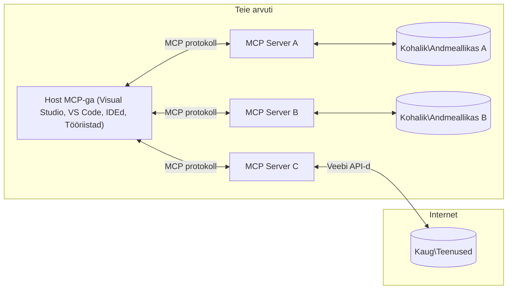

# MCP põhikontseptsioonid: mudelikontekstiprotokolli valdamine tehisintellekti integreerimiseks

[](https://youtu.be/earDzWGtE84)

_(Klõpsake ülaloleval pildil, et vaadata selle õppetunni videot)_

[Model Context Protocol (MCP)](https://github.com/modelcontextprotocol) on võimas, standardiseeritud raamistik, mis optimeerib suhtlust suurte keelemudelite (LLM-ide) ja väliste tööriistade, rakenduste ning andmeallikate vahel.  
See juhend viib teid MCP põhikontseptsioonide juurde. Õpite selle kliendi-serveri arhitektuuri, olulisi komponente, suhtlusmehhanisme ja parimaid rakendustavasid.

- **Selge kasutaja nõusolek**: Kõik andmete kasutused ja toimingud nõuavad enne täitmist kasutaja selget heakskiitu. Kasutajad peavad täpselt mõistma, milliseid andmeid kasutatakse ja milliseid toiminguid tehakse, võimaldades detailset kontrolli õiguste ja volituste üle.

- **Andmete privaatsuse kaitse**: Kasutaja andmeid avaldatakse ainult selge nõusoleku korral ning neid tuleb kaitsta tugeva juurdepääsukontrolliga kogu suhtluse elutsükli vältel. Rakendused peavad takistama volitamata andmeedastust ja hoidma ranget privaatsuspiiri.

- **Tööriistade täitmise turvalisus**: Iga tööriista kutsumine nõuab selget kasutaja nõusolekut, kus on arusaadav tööriista funktsionaalsus, parameetrid ja võimalik mõju. Tugevad turvapiirid peavad takistama tahtmatut, ohtlikku või pahatahtlikku tööriistade täitmist.

- **Transpordikihi turvalisus**: Kõik suhtluskanalid peaksid kasutama sobivaid krüpteerimis- ja autentimismehhanisme. Kaugühendused peaksid rakendama turvalisi transpordiprotokolle ja nõuetekohast volituste haldust.

#### Rakendamise juhised:

- **Õiguste haldus**: Rakendage peenhäälestatud õigussüsteeme, mis võimaldavad kasutajatel kontrollida, millised serverid, tööriistad ja ressursid on kättesaadavad  
- **Autentimine ja autoriseerimine**: Kasutage turvalisi autentimismeetodeid (OAuth, API võtmed) koos nõuetekohase tokenite halduse ja aegumisega  
- **Sisendi valideerimine**: Valideerige kõik parameetrid ja andmesisendid määratletud skeemide alusel, et vältida süstimisrünnakuid  
- **Auditilogimine**: Hoidke kõigi toimingute põhjalikke logisid turvaseire ja vastavuse tagamiseks

## Ülevaade

See õppetund uurib Model Context Protocol (MCP) ökosüsteemi põhistruktuuri ja komponente. Õpite kliendi-serveri arhitektuuri, võtmekomponente ja suhtlusmehhanisme, mis võimaldavad MCP interaktsioone.

## Peamised õpieesmärgid

Selle õppetunni lõpuks:

- Mõistate MCP kliendi-serveri arhitektuuri.  
- Tuletate meelde Hostide, klientide ja serverite rolle ja vastutust.  
- Analüüsite põhifunktsioone, mis teevad MCP-st paindliku integratsioonikihi.  
- Õpite, kuidas info voolab MCP ökosüsteemis.  
- Saate praktilisi teadmisi .NET, Java, Python ja JavaScripti koodinäidete kaudu.

## MCP arhitektuur: sügavama pilguheit

MCP ökosüsteem põhineb kliendi-serveri mudelil. See modulaarne struktuur võimaldab tehisintellekti rakendustel tõhusalt suhelda tööriistade, andmebaaside, API-de ja kontekstuaalsete ressurssidega. Vaatame selle arhitektuuri põhikomponente.

MCP põhineb kliendi-serveri arhitektuuril, kus hostrakendus saab ühendada mitme serveriga:


- **MCP Hostid**: programmid nagu VSCode, Claude Desktop, IDE-d või AI tööriistad, mis soovivad MCP kaudu andmetele ligi pääseda  
- **MCP kliendid**: protokolli kliendid, mis hoiavad 1:1 ühendusi serveritega  
- **MCP serverid**: kergekaalulised programmid, mis pakuvad standardiseeritud Model Context Protocol kaudu spetsiifilisi võimeid  
- **Kohalikud andmeallikad**: teie arvuti failid, andmebaasid ja teenused, millele MCP serverid turvaliselt ligi pääsevad  
- **Kaugteenused**: välissüsteemid, mis on interneti kaudu kättesaadavad ja millele MCP serverid saavad API-de kaudu ühenduda.

MCP protokoll on arenev standard, mis kasutab kuupõhist versioonihaldust (vormingus AAAA-KK-PP). Praegune protokolli versioon on **2025-11-25**. Viimaseid uuendusi näete [protokolli spetsifikatsioonis](https://modelcontextprotocol.io/specification/2025-11-25/)

### 1. Hostid

Model Context Protocolis (MCP) on **Hostid** tehisintellekti rakendused, mis toimivad peamise liidesena, mille kaudu kasutajad protokolliga suhtlevad. Hostid koordineerivad ja haldavad ühendusi mitme MCP serveriga, luues iga serveriühenduse jaoks pühendatud MCP kliendi. Hostide näideteks on:

- **Tehisintellekti rakendused**: Claude Desktop, Visual Studio Code, Claude Code  
- **Arenduskeskkonnad**: IDE-d ja koodiredaktorid MCP integratsiooniga  
- **Kohandatud rakendused**: spetsiaalselt loodud AI agendid ja tööriistad

**Hostid** on rakendused, mis koordineerivad tehisintellekti mudelitega suhtlemist. Nad:

- **Orkestreerivad AI mudeleid**: täidavad või suhtlevad LLM-idega, et genereerida vastuseid ja koordineerida AI töövooge  
- **Haldavad kliendiühendusi**: loovad ja hoiavad iga MCP serveriühenduse jaoks ühe MCP kliendi  
- **Kontrollivad kasutajaliidest**: juhivad vestluse kulgu, kasutajate interaktsioone ja vastuste kuvamist  
- **Tagavad turvalisuse**: kontrollivad õigusi, turvapiiranguid ja autentimist  
- **Haldavad kasutaja nõusolekut**: juhivad kasutaja heakskiitu andmete jagamiseks ja tööriistade täitmiseks

### 2. Kliendid

**Kliendid** on olulised komponendid, mis hoiavad pühendatud ühe-ühele ühendusi Hostide ja MCP serverite vahel. Iga MCP klient luuakse Host poolt, et ühendada konkreetse MCP serveriga, tagades organiseeritud ja turvalise suhtluskanali. Mitmed kliendid võimaldavad Hostidel samaaegselt ühendada mitme serveriga.

**Kliendid** on ühenduskomponendid hostrakenduses. Nad:

- **Protokolli suhtlus**: saadavad serveritele JSON-RPC 2.0 päringuid koos promptide ja juhistega  
- **Võimekuse läbirääkimine**: läbiräägivad toetatud funktsioonide ja protokolli versioonide üle serveritega initsialiseerimisel  
- **Tööriistade täitmine**: haldavad mudelitelt tulevaid tööriistade täitmispäringuid ja töötlevad vastuseid  
- **Reaalajas uuendused**: haldavad serveritelt tulevaid teavitusi ja reaalajas uuendusi  
- **Vastuste töötlemine**: töötlevad ja vormindavad serveri vastuseid kasutajale kuvamiseks

### 3. Serverid

**Serverid** on programmid, mis pakuvad MCP klientidele konteksti, tööriistu ja võimeid. Need võivad töötada lokaalselt (samal masinal kui Host) või kaugelt (välisel platvormil) ning vastutavad kliendipäringute töötlemise ja struktureeritud vastuste pakkumise eest. Serverid avaldavad spetsiifilist funktsionaalsust standardiseeritud Model Context Protocoli kaudu.

**Serverid** on teenused, mis pakuvad konteksti ja võimeid. Nad:

- **Funktsioonide registreerimine**: registreerivad ja avaldavad klientidele kättesaadavad primitiivid (ressursid, promptid, tööriistad)  
- **Päringute töötlemine**: võtavad vastu ja täidavad tööriistakutseid, ressursipäringuid ja promptipäringuid klientidelt  
- **Konteksti pakkumine**: annavad kontekstuaalset infot ja andmeid mudeli vastuste rikastamiseks  
- **Seisundi haldus**: hoiavad sessiooni seisundit ja haldavad vajadusel seisundipõhiseid interaktsioone  
- **Reaalajas teavitused**: saadavad teavitusi võimekuse muutustest ja uuendustest ühendatud klientidele

Serverid võivad olla arendatud kõigi poolt, et laiendada mudelite võimeid spetsialiseeritud funktsionaalsusega ning toetavad nii lokaalseid kui ka kaugdeploymendi stsenaariume.

### 4. Serveri primitiivid

Model Context Protocoli (MCP) serverid pakuvad kolme põhikomponenti ehk **primitiivi**, mis määratlevad rikkalike interaktsioonide aluse klientide, hostide ja keelemudelite vahel. Need primitiivid määravad, millist tüüpi kontekstuaalset infot ja toiminguid protokolli kaudu pakutakse.

MCP serverid võivad avaldada mistahes kombinatsiooni järgmistest kolmest põhikomponendist:

#### Ressursid

**Ressursid** on andmeallikad, mis pakuvad tehisintellekti rakendustele kontekstuaalset infot. Need esindavad staatilist või dünaamilist sisu, mis võib parandada mudeli mõistmist ja otsuste tegemist:

- **Kontekstuaalsed andmed**: struktureeritud info ja kontekst AI mudeli tarbeks  
- **Teadmistebaasid**: dokumendikogud, artiklid, käsiraamatud ja teadustööd  
- **Kohalikud andmeallikad**: failid, andmebaasid ja lokaalsüsteemi info  
- **Välised andmed**: API vastused, veebiteenused ja kaugemad süsteemiandmed  
- **Dünaamiline sisu**: reaalajas andmed, mis uuenevad väliste tingimuste põhjal

Ressursid identifitseeritakse URI-dega ning neid saab avastada meetoditega `resources/list` ja lugeda `resources/read` kaudu:

```text
file://documents/project-spec.md
database://production/users/schema
api://weather/current
```

#### Promptid

**Promptid** on taaskasutatavad mallid, mis aitavad struktureerida suhtlust keelemudelitega. Need pakuvad standardiseeritud suhtlusmustreid ja mallitud töövooge:

- **Mallipõhised interaktsioonid**: eelstruktureeritud sõnumid ja vestluse algatajad  
- **Töövoo mallid**: standardiseeritud järjestused tavapärasteks ülesanneteks ja suhtlusteks  
- **Mõned näited**: näidispõhised mallid mudeli juhendamiseks  
- **Süsteemi promptid**: aluspõhimõtted, mis määratlevad mudeli käitumist ja konteksti  
- **Dünaamilised mallid**: parameetriseeritud promptid, mis kohanduvad spetsiifiliste kontekstidega

Promptid toetavad muutujate asendamist ning neid saab avastada `prompts/list` ja lugeda `prompts/get` kaudu:

```markdown
Generate a {{task_type}} for {{product}} targeting {{audience}} with the following requirements: {{requirements}}
```

#### Tööriistad

**Tööriistad** on täidetavad funktsioonid, mida AI mudelid saavad kutsuda konkreetsete toimingute tegemiseks. Need on MCP ökosüsteemi "tegusõnad", võimaldades mudelitel suhelda väliste süsteemidega:

- **Täidetavad funktsioonid**: diskreetsed toimingud, mida mudelid saavad kutsuda kindlate parameetritega  
- **Väliste süsteemide integratsioon**: API kõned, andmebaasipäringud, failitoimingud, arvutused  
- **Unikaalne identiteet**: igal tööriistal on eriline nimi, kirjeldus ja parameetrite skeem  
- **Struktureeritud sisend-väljund**: tööriistad võtavad vastu valideeritud parameetreid ja tagastavad struktureeritud, tüübistatud vastuseid  
- **Toiminguvõimekus**: võimaldavad mudelitel teha reaalseid toiminguid ja hankida reaalajas andmeid

Tööriistad on defineeritud JSON skeemiga parameetrite valideerimiseks ning neid avastatakse `tools/list` ja täidetakse `tools/call` kaudu:

```typescript
server.tool(
  "search_products", 
  {
    query: z.string().describe("Search query for products"),
    category: z.string().optional().describe("Product category filter"),
    max_results: z.number().default(10).describe("Maximum results to return")
  }, 
  async (params) => {
    // Käivita otsing ja tagasta struktureeritud tulemused
    return await productService.search(params);
  }
);
```

## Kliendi primitiivid

Model Context Protocolis (MCP) võivad **kliendid** avaldada primitiive, mis võimaldavad serveritel taotleda hostrakenduselt täiendavaid võimeid. Need kliendipoolsed primitiivid võimaldavad rikkalikumaid ja interaktiivsemaid serveri rakendusi, mis pääsevad ligi AI mudeli võimekusele ja kasutajate interaktsioonidele.

### Proovivõtt

**Proovivõtt** võimaldab serveritel taotleda keelemudeli täitmisi kliendi AI rakendusest. See primitiiv võimaldab serveritel kasutada LLM võimeid ilma omaenda mudeli sõltuvusi lisamata:

- **Mudelist sõltumatu ligipääs**: serverid saavad taotleda täitmisi ilma LLM SDK-sid kaasamata või mudeli ligipääsu haldamata  
- **Serveri algatatud AI**: võimaldab serveritel iseseisvalt genereerida sisu, kasutades kliendi AI mudelit  
- **Rekursiivsed LLM interaktsioonid**: toetab keerukaid stsenaariume, kus serverid vajavad AI abi töötlemiseks  
- **Dünaamiline sisu loomine**: võimaldab serveritel luua kontekstuaalseid vastuseid, kasutades hosti mudelit

Proovivõtt algatatakse meetodi `sampling/complete` kaudu, kus serverid saadavad täitmispäringuid klientidele.

### Info pärimine

**Info pärimine** võimaldab serveritel taotleda kasutajalt täiendavat infot või kinnitust kliendi liidese kaudu:

- **Kasutaja sisendi päringud**: serverid saavad küsida täiendavat infot tööriista täitmiseks vajalike andmete saamiseks  
- **Kinnituskastid**: taotleda kasutaja heakskiitu tundlike või mõjuka toimingu jaoks  
- **Interaktiivsed töövood**: võimaldada serveritel luua samm-sammult kasutajaga suhtlemist  
- **Dünaamiline parameetrite kogumine**: koguda puuduvaid või valikulisi parameetreid tööriista täitmise ajal

Info päringu taotlused tehakse meetodi `elicitation/request` kaudu, et koguda kasutaja sisendit kliendi liidese kaudu.

### Logimine

**Logimine** võimaldab serveritel saata struktureeritud logisõnumeid klientidele silumiseks, jälgimiseks ja operatiivseks nähtavuseks:

- **Silumise tugi**: võimaldab serveritel pakkuda üksikasjalikke täitmise logisid tõrkeotsinguks  
- **Operatiivne jälgimine**: saata olekuuuendusi ja jõudlusmõõdikuid klientidele  
- **Vigade raportimine**: pakkuda üksikasjalikku veakonteksti ja diagnostilist infot  
- **Auditirajad**: luua põhjalikke logisid serveri toimingutest ja otsustest

Logisõnumid saadetakse klientidele, et tagada serveri toimingute läbipaistvus ja hõlbustada silumist.

## Info voog MCP-s

Model Context Protocol (MCP) määratleb struktureeritud info voo hostide, klientide, serverite ja mudelite vahel. Selle voo mõistmine aitab selgitada, kuidas kasutajapäringuid töödeldakse ja kuidas mudelivastustesse integreeritakse väliseid tööriistu ja andmeallikaid.

- **Host algatab ühenduse**  
  Hostrakendus (näiteks IDE või vestlusliides) loob ühenduse MCP serveriga, tavaliselt STDIO, WebSocketi või muu toetatud transpordi kaudu.

- **Võimekuse läbirääkimine**  
  Klient (hosti sees) ja server vahetavad infot oma toetatud funktsioonide, tööriistade, ressursside ja protokolli versioonide kohta. See tagab, et mõlemad pooled mõistavad, millised võimekused sessiooniks on saadaval.

- **Kasutajapäring**  
  Kasutaja suhtleb hostiga (nt sisestab prompti või käsu). Host kogub selle sisendi ja edastab selle töötlemiseks kliendile.

- **Ressursi või tööriista kasutus**  
  - Klient võib taotleda serverilt täiendavat konteksti või ressursse (nt faile, andmebaasi kirjeid või teadmistebaasi artikleid), et rikastada mudeli mõistmist.  
  - Kui mudel otsustab, et tööriist on vajalik (nt andmete hankimiseks, arvutuse tegemiseks või API kutsumiseks), saadab klient serverile tööriistakutse, määrates tööriista nime ja parameetrid.

- **Serveri täitmine**  
  Server võtab vastu ressursi- või tööriistapäringu, täidab vajalikud toimingud (nt funktsiooni käivitamine, andmebaasi päring või faili hankimine) ja tagastab tulemused kliendile struktureeritud vormis.

- **Vastuse genereerimine**  
  Klient integreerib serveri vastused (ressursiandmed, tööriistade väljundid jms) mudeli suhtlusse. Mudel kasutab seda infot, et genereerida põhjalik ja kontekstuaalselt asjakohane vastus.

- **Tulemuse esitamine**  
  Host saab kliendilt lõpliku väljundi ja kuvab selle kasutajale, sageli sisaldades nii mudeli genereeritud teksti kui ka tööriistade täitmise või ressursside otsingu tulemusi.

See voog võimaldab MCP-l toetada arenenud, interaktiivseid ja kontekstiteadlikke AI rakendusi, ühendades mudelid sujuvalt väliste tööriistade ja andmeallikatega.

## Protokolli arhitektuur ja kihid

MCP koosneb kahest eristatud arhitektuurikihist, mis töötavad koos, et pakkuda täielikku suhtlusraamistikku:

### Andmekiht

**Andmekiht** rakendab MCP protokolli põhiosas, kasutades alusena **JSON-RPC 2.0**. See kiht määratleb sõnumistruktuuri, semantika ja suhtlusmustrid:

#### Põhikompid:  

- **JSON-RPC 2.0 protokoll**: kogu suhtlus kasutab standardiseeritud JSON-RPC 2.0 sõnumivormingut meetodite kutsumiseks, vastusteks ja teavitusteks
- **Elutsükli haldus**: Haldab ühenduse algatamist, võimekuse läbirääkimisi ja sessiooni lõpetamist klientide ja serverite vahel
- **Serveri primitiivid**: Võimaldab serveritel pakkuda põhifunktsionaalsust tööriistade, ressursside ja promptide kaudu
- **Kliendi primitiivid**: Võimaldab serveritel taotleda LLM-idelt proovivõtmist, esile kutsuda kasutajasisendit ja saata logisõnumeid
- **Reaalajas teavitused**: Toetab asünkroonseid teavitusi dünaamilisteks uuendusteks ilma päringuteta

#### Peamised omadused:

- **Protokolli versiooni läbirääkimine**: Kasutab kuupõhist versioonimist (AAAA-KK-PP), et tagada ühilduvus
- **Võimekuse avastamine**: Kliendid ja serverid vahetavad toetatud funktsioonide infot algatamisel
- **Oleku säilitamine sessioonides**: Säilitab ühenduse oleku mitme suhtluse jooksul konteksti järjepidevuse tagamiseks

### Transportkiht

**Transportkiht** haldab suhtluskanaleid, sõnumite raamistamist ja autentimist MCP osalejate vahel:

#### Toetatud transpordimehhanismid:

1. **STDIO transport**:
   - Kasutab standardseid sisendi/väljundi vooge otseseks protsessidevaheliseks suhtluseks
   - Optimaalne kohalikeks protsessideks samal masinal ilma võrguülekandeta
   - Sageli kasutatav kohalike MCP serverite rakendustes

2. **Voogedastatav HTTP transport**:
   - Kasutab HTTP POST meetodit kliendilt serverile sõnumite saatmiseks  
   - Valikuline Server-Sent Events (SSE) serverilt kliendile voogedastuseks
   - Võimaldab kaugserveritega suhtlemist üle võrkude
   - Toetab standardset HTTP autentimist (bearer tokenid, API võtmed, kohandatud päised)
   - MCP soovitab turvaliseks tokenipõhiseks autentimiseks OAuthi

#### Transpordi abstraktsioon:

Transportkiht peidab suhtluse üksikasjad andmekihi eest, võimaldades kõigil transpordimehhanismidel kasutada sama JSON-RPC 2.0 sõnumiformaati. See abstraktsioon võimaldab rakendustel sujuvalt vahetada kohalike ja kaugserverite vahel.

### Turvalisuse kaalutlused

MCP rakendused peavad järgima mitmeid olulisi turvapõhimõtteid, et tagada turvalised, usaldusväärsed ja kaitstud suhtlused kõigis protokolli toimingutes:

- **Kasutaja nõusolek ja kontroll**: Kasutajad peavad andma selgesõnalise nõusoleku enne andmete kasutamist või toimingute tegemist. Neil peab olema selge kontroll, milliseid andmeid jagatakse ja millised toimingud on lubatud, mida toetavad intuitiivsed kasutajaliidesed tegevuste ülevaatamiseks ja kinnitamiseks.

- **Andmete privaatsus**: Kasutaja andmeid tohib avaldada ainult selgesõnalise nõusoleku alusel ning neid tuleb kaitsta sobivate juurdepääsukontrollidega. MCP rakendused peavad vältima volitamata andmeedastust ja tagama privaatsuse säilimise kõigi suhtluste vältel.

- **Tööriistade turvalisus**: Enne tööriista käivitamist on vajalik selgesõnaline kasutaja nõusolek. Kasutajatel peab olema selge arusaam iga tööriista funktsioonist ning tugevad turvapiirid peavad takistama soovimatut või ohtlikku tööriistade käivitamist.

Nende turvapõhimõtete järgimisega tagab MCP kasutajate usalduse, privaatsuse ja turvalisuse kõigis protokolli suhtlustes, võimaldades samal ajal võimsaid tehisintellekti integratsioone.

## Koodinäited: Peamised komponendid

Allpool on mitmes populaarse programmeerimiskeeles koodinäited, mis illustreerivad, kuidas rakendada MCP serveri põhikomponente ja tööriistu.

### .NET näide: Lihtsa MCP serveri loomine tööriistadega

Siin on praktiline .NET koodinäide, mis demonstreerib lihtsa MCP serveri loomist kohandatud tööriistadega. Näide näitab, kuidas defineerida ja registreerida tööriistu, käsitleda päringuid ning ühendada server Model Context Protocoliga.

```csharp
using System;
using System.Threading.Tasks;
using ModelContextProtocol.Server;
using ModelContextProtocol.Server.Transport;
using ModelContextProtocol.Server.Tools;

public class WeatherServer
{
    public static async Task Main(string[] args)
    {
        // Create an MCP server
        var server = new McpServer(
            name: "Weather MCP Server",
            version: "1.0.0"
        );
        
        // Register our custom weather tool
        server.AddTool<string, WeatherData>("weatherTool", 
            description: "Gets current weather for a location",
            execute: async (location) => {
                // Call weather API (simplified)
                var weatherData = await GetWeatherDataAsync(location);
                return weatherData;
            });
        
        // Connect the server using stdio transport
        var transport = new StdioServerTransport();
        await server.ConnectAsync(transport);
        
        Console.WriteLine("Weather MCP Server started");
        
        // Keep the server running until process is terminated
        await Task.Delay(-1);
    }
    
    private static async Task<WeatherData> GetWeatherDataAsync(string location)
    {
        // This would normally call a weather API
        // Simplified for demonstration
        await Task.Delay(100); // Simulate API call
        return new WeatherData { 
            Temperature = 72.5,
            Conditions = "Sunny",
            Location = location
        };
    }
}

public class WeatherData
{
    public double Temperature { get; set; }
    public string Conditions { get; set; }
    public string Location { get; set; }
}
```

### Java näide: MCP serveri komponendid

See näide demonstreerib sama MCP serverit ja tööriistade registreerimist nagu ülaltoodud .NET näites, kuid on teostatud Java keeles.

```java
import io.modelcontextprotocol.server.McpServer;
import io.modelcontextprotocol.server.McpToolDefinition;
import io.modelcontextprotocol.server.transport.StdioServerTransport;
import io.modelcontextprotocol.server.tool.ToolExecutionContext;
import io.modelcontextprotocol.server.tool.ToolResponse;

public class WeatherMcpServer {
    public static void main(String[] args) throws Exception {
        // Loo MCP server
        McpServer server = McpServer.builder()
            .name("Weather MCP Server")
            .version("1.0.0")
            .build();
            
        // Registreeri ilmatööriist
        server.registerTool(McpToolDefinition.builder("weatherTool")
            .description("Gets current weather for a location")
            .parameter("location", String.class)
            .execute((ToolExecutionContext ctx) -> {
                String location = ctx.getParameter("location", String.class);
                
                // Hangi ilmainfo (lihtsustatud)
                WeatherData data = getWeatherData(location);
                
                // Tagasta vormindatud vastus
                return ToolResponse.content(
                    String.format("Temperature: %.1f°F, Conditions: %s, Location: %s", 
                    data.getTemperature(), 
                    data.getConditions(), 
                    data.getLocation())
                );
            })
            .build());
        
        // Ühenda server stdio transpordiga
        try (StdioServerTransport transport = new StdioServerTransport()) {
            server.connect(transport);
            System.out.println("Weather MCP Server started");
            // Hoia server töös kuni protsess lõpetatakse
            Thread.currentThread().join();
        }
    }
    
    private static WeatherData getWeatherData(String location) {
        // Rakendus kutsuks ilmaprognoosi API-d
        // Lihtsustatud näite eesmärgil
        return new WeatherData(72.5, "Sunny", location);
    }
}

class WeatherData {
    private double temperature;
    private String conditions;
    private String location;
    
    public WeatherData(double temperature, String conditions, String location) {
        this.temperature = temperature;
        this.conditions = conditions;
        this.location = location;
    }
    
    public double getTemperature() {
        return temperature;
    }
    
    public String getConditions() {
        return conditions;
    }
    
    public String getLocation() {
        return location;
    }
}
```

### Python näide: MCP serveri ehitamine

See näide kasutab fastmcp raamistiku, seega palun veenduge, et see on esmalt paigaldatud:

```python
pip install fastmcp
```
Koodinäide:

```python
#!/usr/bin/env python3
import asyncio
from fastmcp import FastMCP
from fastmcp.transports.stdio import serve_stdio

# Loo FastMCP server
mcp = FastMCP(
    name="Weather MCP Server",
    version="1.0.0"
)

@mcp.tool()
def get_weather(location: str) -> dict:
    """Gets current weather for a location."""
    return {
        "temperature": 72.5,
        "conditions": "Sunny",
        "location": location
    }

# Alternatiivne lähenemine, kasutades klassi
class WeatherTools:
    @mcp.tool()
    def forecast(self, location: str, days: int = 1) -> dict:
        """Gets weather forecast for a location for the specified number of days."""
        return {
            "location": location,
            "forecast": [
                {"day": i+1, "temperature": 70 + i, "conditions": "Partly Cloudy"}
                for i in range(days)
            ]
        }

# Registreeri klassi tööriistad
weather_tools = WeatherTools()

# Käivita server
if __name__ == "__main__":
    asyncio.run(serve_stdio(mcp))
```

### JavaScript näide: MCP serveri loomine

See näide näitab MCP serveri loomist JavaScriptis ja kahe ilmaga seotud tööriista registreerimist.

```javascript
// Kasutades ametlikku Model Context Protocol SDK-d
import { McpServer } from "@modelcontextprotocol/sdk/server/mcp.js";
import { StdioServerTransport } from "@modelcontextprotocol/sdk/server/stdio.js";
import { z } from "zod"; // Parameetrite valideerimiseks

// Loo MCP server
const server = new McpServer({
  name: "Weather MCP Server",
  version: "1.0.0"
});

// Määra ilmatööriist
server.tool(
  "weatherTool",
  {
    location: z.string().describe("The location to get weather for")
  },
  async ({ location }) => {
    // Tavaliselt kutsutakse see ilmaprognoosi API-d
    // Lihtsustatud demonstratsiooniks
    const weatherData = await getWeatherData(location);
    
    return {
      content: [
        { 
          type: "text", 
          text: `Temperature: ${weatherData.temperature}°F, Conditions: ${weatherData.conditions}, Location: ${weatherData.location}` 
        }
      ]
    };
  }
);

// Määra prognoositööriist
server.tool(
  "forecastTool",
  {
    location: z.string(),
    days: z.number().default(3).describe("Number of days for forecast")
  },
  async ({ location, days }) => {
    // Tavaliselt kutsutakse see ilmaprognoosi API-d
    // Lihtsustatud demonstratsiooniks
    const forecast = await getForecastData(location, days);
    
    return {
      content: [
        { 
          type: "text", 
          text: `${days}-day forecast for ${location}: ${JSON.stringify(forecast)}` 
        }
      ]
    };
  }
);

// Abifunktsioonid
async function getWeatherData(location) {
  // Simuleeri API kõnet
  return {
    temperature: 72.5,
    conditions: "Sunny",
    location: location
  };
}

async function getForecastData(location, days) {
  // Simuleeri API kõnet
  return Array.from({ length: days }, (_, i) => ({
    day: i + 1,
    temperature: 70 + Math.floor(Math.random() * 10),
    conditions: i % 2 === 0 ? "Sunny" : "Partly Cloudy"
  }));
}

// Ühenda server stdio transpordiga
const transport = new StdioServerTransport();
server.connect(transport).catch(console.error);

console.log("Weather MCP Server started");
```

See JavaScripti näide demonstreerib, kuidas luua MCP klient, mis ühendub serveriga, saadab prompti ja töötleb vastust, sealhulgas kõiki tehtud tööriistakõnesid.

## Turvalisus ja autoriseerimine

MCP sisaldab mitmeid sisseehitatud kontseptsioone ja mehhanisme turvalisuse ja autoriseerimise haldamiseks kogu protokolli ulatuses:

1. **Tööriistade kasutusõiguste kontroll**:  
  Kliendid saavad määrata, milliseid tööriistu mudel sessiooni jooksul kasutada võib. See tagab, et ligipääs on ainult selgesõnaliselt lubatud tööriistadele, vähendades soovimatute või ohtlike toimingute riski. Õigusi saab dünaamiliselt konfigureerida kasutaja eelistuste, organisatsiooni poliitikate või suhtluse konteksti põhjal.

2. **Autentimine**:  
  Serverid võivad nõuda autentimist enne ligipääsu andmist tööriistadele, ressurssidele või tundlikele toimingutele. See võib hõlmata API võtmeid, OAuth tokeneid või muid autentimisskeeme. Õige autentimine tagab, et ainult usaldusväärsed kliendid ja kasutajad saavad serveripoolseid võimekusi kasutada.

3. **Valideerimine**:  
  Kõigi tööriistakõnede parameetrite valideerimine on kohustuslik. Iga tööriist määratleb oma parameetrite oodatud tüübid, vormingud ja piirangud ning server kontrollib saabunud päringuid vastavalt. See takistab vigaste või pahatahtlike sisendite jõudmist tööriistade rakendustesse ja aitab säilitada toimingute terviklikkust.

4. **Kiirusepiirangud**:  
  Kuritarvituste vältimiseks ja serveriressursside õiglasel kasutamisel võivad MCP serverid rakendada kiirusepiiranguid tööriistakõnedele ja ressursside kasutusele. Piirangud võivad kehtida kasutaja, sessiooni või globaalselt ning aitavad kaitsta teenusetõrgete ja liigse ressursikasutuse eest.

Nende mehhanismide kombineerimisel pakub MCP turvalist alust keelemudelite integreerimiseks väliste tööriistade ja andmeallikatega, andes kasutajatele ja arendajatele detailse kontrolli ligipääsu ja kasutuse üle.

## Protokolli sõnumid ja suhtlusvoog

MCP suhtlus kasutab struktureeritud **JSON-RPC 2.0** sõnumeid, et võimaldada selget ja usaldusväärset suhtlust hostide, klientide ja serverite vahel. Protokoll määratleb spetsiifilised sõnumimustrid erinevate toimingute jaoks:

### Põhisõnumite tüübid:

#### **Algatamise sõnumid**
- **`initialize` päring**: Loob ühenduse ja läbiräägib protokolli versiooni ning võimekused
- **`initialize` vastus**: Kinnitab toetatud funktsioonid ja serveri info  
- **`notifications/initialized`**: Teatab, et algatamine on lõpetatud ja sessioon on valmis

#### **Avastamise sõnumid**
- **`tools/list` päring**: Avastab serveri saadaval olevad tööriistad
- **`resources/list` päring**: Loetleb saadaval olevad ressursid (andmeallikad)
- **`prompts/list` päring**: Hangib saadaval olevad prompti mallid

#### **Täideviimise sõnumid**  
- **`tools/call` päring**: Käivitab konkreetse tööriista antud parameetritega
- **`resources/read` päring**: Hangib sisu konkreetsest ressursist
- **`prompts/get` päring**: Hangib prompti malli valikuliste parameetritega

#### **Kliendipoolsed sõnumid**
- **`sampling/complete` päring**: Server taotleb LLM-i täiendust kliendilt
- **`elicitation/request`**: Server taotleb kasutajasisendit kliendi liidese kaudu
- **Logisõnumid**: Server saadab struktureeritud logisõnumeid kliendile

#### **Teavitussõnumid**
- **`notifications/tools/list_changed`**: Server teavitab klienti tööriistade muutustest
- **`notifications/resources/list_changed`**: Server teavitab klienti ressursside muutustest  
- **`notifications/prompts/list_changed`**: Server teavitab klienti promptide muutustest

### Sõnumi struktuur:

Kõik MCP sõnumid järgivad JSON-RPC 2.0 formaati:
- **Päringusõnumid**: Sisaldavad `id`, `method` ja valikulisi `params`
- **Vastusõnumid**: Sisaldavad `id` ja kas `result` või `error`  
- **Teavitussõnumid**: Sisaldavad `method` ja valikulisi `params` (ilma `id` või vastuse ootamiseta)

See struktureeritud suhtlus tagab usaldusväärse, jälgitava ja laiendatava suhtluse, toetades keerukaid stsenaariume nagu reaalajas uuendused, tööriistade ahelad ja tugev veahaldus.

## Peamised järeldused

- **Arhitektuur**: MCP kasutab kliendi-serveri arhitektuuri, kus hostid haldavad mitut kliendiühendust serveritega
- **Osalejad**: Ökosüsteemi kuuluvad hostid (tehisintellekti rakendused), kliendid (protokolli ühendajad) ja serverid (võimekuse pakkujad)
- **Transpordimehhanismid**: Suhtlus toetab STDIO-d (kohalik) ja voogedastatavat HTTP-d valikulise SSE-ga (kaug)
- **Põhifunktsioonid**: Serverid pakuvad tööriistu (käivitatavad funktsioonid), ressursse (andmeallikad) ja promptisid (mallid)
- **Kliendi primitiivid**: Serverid võivad taotleda proovivõtmist (LLM täiendused), esilekutsumist (kasutajasisend) ja logimist klientidelt
- **Protokolli alus**: Põhineb JSON-RPC 2.0-l kuupõhise versioonimisega (praegune: 2025-11-25)
- **Reaalajas võimekused**: Toetab teavitusi dünaamilisteks uuendusteks ja reaalajas sünkroonimiseks
- **Turvalisus esikohal**: Selgesõnaline kasutaja nõusolek, andmete privaatsuse kaitse ja turvaline transport on põhitingimused

## Harjutus

Disaini lihtne MCP tööriist, mis oleks kasulik sinu valdkonnas. Määra:
1. Kuidas tööriista nimetatakse
2. Milliseid parameetreid see aktsepteerib
3. Millist väljundit see tagastab
4. Kuidas mudel võiks seda tööriista kasutada kasutajaprobleemide lahendamiseks


---

## Mis järgmiseks

Järgmine: [2. peatükk: Turvalisus](../02-Security/README.md)

---

<!-- CO-OP TRANSLATOR DISCLAIMER START -->
**Vastutusest loobumine**:
See dokument on tõlgitud kasutades tehisintellektil põhinevat tõlketeenust [Co-op Translator](https://github.com/Azure/co-op-translator). Kuigi püüame tagada täpsust, palun arvestage, et automaatsed tõlked võivad sisaldada vigu või ebatäpsusi. Originaaldokument selle emakeeles tuleks pidada autoriteetseks allikaks. Olulise teabe puhul soovitatakse kasutada professionaalset inimtõlget. Me ei vastuta selle tõlke kasutamisest tulenevate arusaamatuste või valesti mõistmiste eest.
<!-- CO-OP TRANSLATOR DISCLAIMER END -->