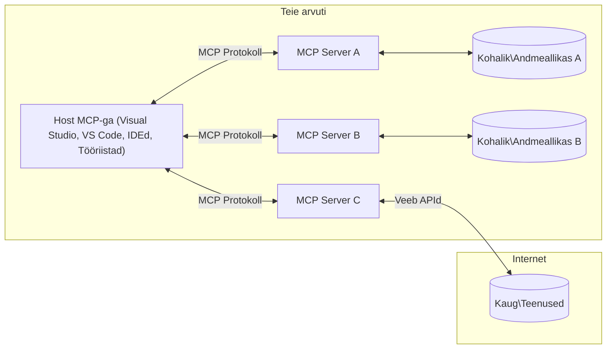

# MCP põhikontseptsioonid: mudelikontekstiprotokolli valdamine AI integreerimiseks

[](https://youtu.be/earDzWGtE84)

_(Vajuta ülalolevale pildile, et vaadata selle tunni videot)_

[Model Context Protocol (MCP)](https://github.com/modelcontextprotocol) on võimas, standardiseeritud raamistik, mis optimeerib suhtlust suurte keelemudelite (LLMide) ja väliste tööriistade, rakenduste ning andmeallikate vahel.  
See juhend tutvustab sulle MCP põhikontseptsioone. Sa õpid selle kliendi-serveri arhitektuuri, olulisi komponente, suhtlusmehhanisme ja parimaid rakenduspraktikaid.

- **Selge kasutaja nõusolek**: Kõik andmete ligipääs ja toimingud nõuavad enne täitmist kasutaja selget heakskiitu. Kasutajad peavad täpselt teadma, millistele andmetele ligi päästakse ja milliseid tegevusi tehakse, olles võimelised konkreetsetel õigustel ja volitustel rangelt kontrolli teostama.

- **Andmete privaatsuse kaitse**: Kasutaja andmed on nähtavad vaid selge nõusoleku korral ning neid tuleb kogu suhtlusprotsessi vältel tugevalt kaitsta juurdepääsupiirangutega. Rakendused peavad ära hoidma volitamata andmeside ja säilitama rangelt privaatsuserandid.

- **Tööriistade turvaline käivitamine**: Kõik tööriistade kasutamiskutsed vajavad kasutaja selget nõusolekut ning täpset arusaamist tööriista funktsionaalsusest, parameetritest ja võimalikust mõjust. Tugevad turvapiirid peavad takistama ettearvamatut, ohtlikku või pahatahtlikku tööriista käivitust.

- **Transpordikihi turvalisus**: Kõik suhtluskanalid peaksid kasutama sobivaid krüpteerimis- ja autentimismehhanisme. Kaugühenduste puhul tuleb rakendada turvalisi transpordiprotokolle ja korralikku volituste haldust.

#### Rakendusjuhised:

- **Õiguste haldus**: Rakenda peenhäälestatud õigussüsteeme, mis lubavad kasutajatel kontrollida, millised serverid, tööriistad ja ressursid on ligipääsetavad  
- **Autentimine & autoriseerimine**: Kasuta turvalisi autentimismeetodeid (OAuth, API võtmed) koos korraliku tokenite halduse ja aegumisajaga  
- **Sisendi valideerimine**: Kontrolli kõiki parameetreid ja sisendeid vastavalt määratletud skeemidele, et vältida süstimisrünnakuid  
- **Auditilogimine**: Säilita põhjalikud logid kõigi toimingute kohta turvakontrolli ja nõuetele vastavuse tagamiseks

## Ülevaade

See õppetükk uurib Model Context Protocol (MCP) ökosüsteemi põhistruktuuri ja komponente. Sa õpid kliendi-serveri arhitektuuri, põhikomponentide ja suhtlusmehhanismide kohta, mis võimaldavad MCP-d rakendada.

## Põhilised õppimise eesmärgid

Selle õppetüki lõpuks:

- Saad aru MCP kliendi-serveri arhitektuurist.
- Tuled välja Hostide, Clientide ja Serverite rollid ja vastutusalad.
- Analüüsid MCP paindlikkust tagavaid põhijooni.
- Õpid, kuidas info MCP ökosüsteemis voolab.
- Saad praktilisi teadmisi .NET, Java, Python ja JavaScripti koodinäidete kaudu.

## MCP arhitektuur: süva ülevaade

MCP ökosüsteem põhineb kliendi-serveri mudelil. Selle modulaarse struktuuri abil saavad AI rakendused tõhusalt suhelda tööriistade, andmebaaside, API-de ja kontekstuaalsete ressurssidega. Vaatame selle arhitektuuri põhikomponente.

Põhitasandil järgib MCP kliendi-serveri arhitektuuri, kus hostrakendus saab ühendada mitme serveriga:


```mermaid
flowchart LR
    subgraph "Teie arvuti"
        Host["Host MCP-ga (Visual Studio, VS Code, IDEd, Tööriistad)"]
        S1["MCP Server A"]
        S2["MCP Server B"]
        S3["MCP Server C"]
        Host <-->|"MCP Protokoll"| S1
        Host <-->|"MCP Protokoll"| S2
        Host <-->|"MCP Protokoll"| S3
        S1 <--> D1[("Kohalik\Andmeallikas A")]
        S2 <--> D2[("Kohalik\Andmeallikas B")]
    end
    subgraph "Internet"
        S3 <-->|"Veeb APId"| D3[("Kaug\Teenused")]
    end
```
- **MCP Hostid**: Programmid nagu VSCode, Claude Desktop, IDE-d või AI tööriistad, mis soovivad MCP kaudu andmetele ligi pääseda  
- **MCP kliendid**: Protokolli kliendid, mis hoiavad 1:1 ühendusi serveritega  
- **MCP serverid**: Kerged programmid, mis pakuvad kindlaid võimeid läbi standardiseeritud Model Context Protocoli  
- **Kohalikud andmeallikad**: Sinu arvuti failid, andmebaasid ja teenused, millele MCP serverid turvaliselt ligi pääsevad  
- **Kaugteenused**: Välised süsteemid interneti kaudu, millele MCP serverid saavad APIde kaudu ühendada  

MCP protokoll on arenev standard, mis kasutab kuupäevapõhist versioonihaldust (vormingus YYYY-MM-DD). Praegune protokolli versioon on **2025-11-25**. Saad vaadata uuemaid uuendusi [protokolli spetsifikatsioonis](https://modelcontextprotocol.io/specification/2025-11-25/)

### 1. Hostid

Model Context Protocolis (MCP) on **Hostid** AI rakendused, mis toimivad esmase liidesena, mille kaudu kasutajad protokolliga suhtlevad. Hostid koordineerivad ja haldavad ühendusi mitme MCP serveriga, luues iga serveri ühenduse jaoks pühendatud MCP kliendi. Hostide näideteks on:

- **AI rakendused**: Claude Desktop, Visual Studio Code, Claude Code  
- **Arenduskeskkonnad**: IDE-d ja koodiredaktorid MCP integratsiooniga  
- **Kohandatud rakendused**: Eesmärgipõhised AI agendid ja tööriistad  

**Hostid** on rakendused, mis koordineerivad AI mudelitega suhtlemist. Nad:

- **Orkestreerivad AI mudeleid**: Käivitavad või suhtlevad LLMidega vastuste genereerimiseks ja AI töövoogude koordineerimiseks  
- **Halda kliendiühendusi**: Loovad ja hoiavad iga MCP serveri ühenduse puhul ühe MCP kliendi  
- **Kontrollivad kasutajaliidest**: Haldavad vestluse voogu, kasutajate suhtlust ja vastuste esitust  
- **Tagavad turvalisuse**: Juhtivad õigusi, turvapiiranguid ja autentimist  
- **Haldavad kasutaja nõusolekut**: Korraldavad kasutaja kinnituse andmete jagamiseks ja tööriistade käivitamiseks  

### 2. Kliendid

**Kliendid** on olulised komponendid, mis hoiavad pühendatud ühekohalisi ühendusi Hostide ja MCP serverite vahel. Iga MCP klient luuakse Host'i poolt spetsiifilise MCP serveriga ühenduse loomiseks, tagades organiseeritud ja turvalise suhtluskanali. Mitmed kliendid lubavad Hostidel korraga mitme serveriga ühendada.

**Kliendid** on Host rakenduse ühenduskomponendid. Nad:

- **Protokolli suhtlus**: Saadavad JSON-RPC 2.0 päringuid serveritele koos promptide ja juhistega  
- **Võimete läbirääkimine**: Läbiräägivad serveritega toetatavad omadused ja protokolli versioonid initsialiseerimise ajal  
- **Tööriistade käivitamine**: Haldavad tööriistade käivitamise päringuid mudelitelt ja töötlevad vastuseid  
- **Reaalajas uuendused**: Töötlevad serveritelt tulevaid teavitusi ja reaalaja uuendusi  
- **Vastuste töötlemine**: Töötlevad ja vormindavad serveri vastuseid kasutajatele kuvamiseks  

### 3. Serverid

**Serverid** on programmid, mis pakuvad MCP klientidele konteksti, tööriistu ja võimeid. Need võivad töötada kohapeal (samas masinas, kus Host) või eemalt (välistel platvormidel) ning vastutavad kliendipäringute töötlemise ja struktureeritud vastuste andmise eest. Serverid pakuvad kindlat funktsionaalsust läbi standardiseeritud Model Context Protocoli.

**Serverid** on teenused, mis pakuvad konteksti ja võimeid. Nad:

- **Funktsioonide registreerimine**: Registreerivad ja pakuvad klientidele kättesaadavad primitiivid (ressursid, promptid, tööriistad)  
- **Päringute töötlemine**: Võtavad vastu ja täidavad kliendilt tulevaid tööriistakutseid, ressursipäringuid ja promptipäringuid  
- **Konteksti pakkumine**: Annavad kontekstuaalset teavet ja andmeid vastuste täiustamiseks  
- **Oleku haldus**: Säilitavad sessiooni olekut ja töötlevad vajadusel olekupõhiseid interaktsioone  
- **Reaalaja teavitused**: Saadavad teavitusi võimete muutuste ja uuenduste kohta ühendatud klientidele  

Serverid võivad olla eraldiseisvalt arendatud, et laiendada mudelite võimeid spetsialiseeritud funktsionaalsusega, toetades nii kohalikku kui ka kaugjuhtimise juurutamist.

### 4. Serveri primitiivid

Model Context Protocoli (MCP) serverid pakuvad kolme põhikomponenti ehk **primitiivi**, mis määratlevad rikkalike interaktsioonide põhilised ehitusplokid klientide, hostide ja keelemudelite vahel. Need primitiivid täpsustavad, millist tüüpi kontekstuaalne info ja toimingud on protokolli kaudu saadaval.

MCP serverid võivad avaldada järgmiste kolme põhielemendi kombinatsioone:

#### Ressursid

**Ressursid** on andmeallikad, mis pakuvad AI rakendustele kontekstuaalset infot. Need esindavad staatilist või dünaamilist sisu, mis rikastab mudelite arusaamist ja otsustusvõimet:

- **Kontekstuaalsed andmed**: Struktureeritud info ja kontekst mudelitarbimiseks  
- **Teadmistebaasid**: Dokumendirajatised, artiklid, käsiraamatud ja teadustööd  
- **Kohalikud andmeallikad**: Failid, andmebaasid ja kohalik süsteemiinfo  
- **Välised andmed**: API vastused, veebiteenused ja kaug-süsteemiandmed  
- **Dünaamiline sisu**: Reaalajas andmed, mis uuenevad väliste tingimuste põhjal  

Ressursid on identifitseeritud URI-dega ning toetavad avalikustamist meetodite kaudu `resources/list` ja andmete lugemist meetodiga `resources/read`:

```text
file://documents/project-spec.md
database://production/users/schema
api://weather/current
```

#### Promptid

**Promptid** on taaskasutatavad mallid, mis aitavad struktureerida suhtlust keelemudelitega. Need pakuvad standardiseeritud suhtlusmustreid ja mallpõhiseid töövooge:

- **Mallipõhised suhted**: Eelsalvestatud sõnumid ja vestluse algatajad  
- **Töövoo mallid**: Standardiseeritud järjendid levinud ülesannete ja interaktsioonide jaoks  
- **Näidised vähese andmega õpetamiseks**: Mallid mudeli juhistamiseks näidiste põhjal  
- **Süsteemipromptid**: Algseadistused, mis määravad mudeli käitumise ja konteksti  
- **Dünaamilised mallid**: Parameetritega promptid, mis kohanduvad spetsiifilistele kontekstidele  

Promptid toetavad muutujate asendamist ja on avastatavad `prompts/list` ning loetavad läbi `prompts/get` meetodite:

```markdown
Generate a {{task_type}} for {{product}} targeting {{audience}} with the following requirements: {{requirements}}
```

#### Tööriistad

**Tööriistad** on täidetavad funktsioonid, mida AI mudelid saavad kasutada spetsiifiliste toimingute läbiviimiseks. Need esindavad MCP ökosüsteemi "tegusid", võimaldades mudelitel suhelda väliste süsteemidega:

- **Täidetavad funktsioonid**: Erioperatsioonid, mida mudelid saavad käivitada kindlate parameetritega  
- **Välissüsteemidega integratsioon**: API kõned, andmebaasipäringud, failitoimingud, arvutused  
- **Unikaalne identiteet**: Igal tööriistal on oma nimi, kirjeldus ja parameetrite skeem  
- **Struktureeritud sisend/väljund**: Tööriistad aktsepteerivad valideeritud parameetreid ja tagastavad tüübistatud vastuseid  
- **Tegevuse võimekus**: Võimaldavad mudelitel täita maailmatoiminguid ning pärida reaalajas andmeid  

Tööriistad on defineeritud JSON skeemiga parameetrite valideerimiseks, neid avastatakse läbi `tools/list` ja kasutatakse meetodiga `tools/call`. Tööriistad võivad sisaldada **ikooni** täiendava metaandmena parema kasutajaliidese esituse jaoks.

**Tööriistade annotatsioonid**: Tööriistadele saab lisada käitumise annotatsioone (nt `readOnlyHint`, `destructiveHint`), mis kirjeldavad, kas tööriist on muutmiskindel või hävitav, aidates klientidel teha teadlikke otsuseid tööriistade käivitamise osas.

Näidis tööriista definitsioon:

```typescript
server.tool(
  "search_products", 
  {
    query: z.string().describe("Search query for products"),
    category: z.string().optional().describe("Product category filter"),
    max_results: z.number().default(10).describe("Maximum results to return")
  }, 
  async (params) => {
    // Täida otsing ja tagasta struktureeritud tulemused
    return await productService.search(params);
  }
);
```

## Kliendi primitiivid

Model Context Protocolis (MCP) saavad **kliendid** avaldada primitiive, mis lubavad serveritel hostrakenduselt täiendavaid võimeid küsida. Need kliendi poolsed primitiivid võimaldavad rikkalikumaid, interaktiivsemaid serverite rakendusi, mis pääsevad ligi AI mudelite võimetele ja kasutajate interaktsioonidele.

### Valimine

**Valimine** võimaldab serveritel küsida keelemodellilt täiendavaid täitmisi kliendi AI rakenduse kaudu. See primitiiv lubab serveritel kasutada LLM võimeid ilma, et serverid peaksid ise mudeleid manustama:

- **Mudelist sõltumatu ligipääs**: Serverid võivad küsida täitmisi ilma LLM SDK-sid manustamata või mudelile ligipääsu haldamata  
- **Serveri algatatud AI**: Serverid saavad iseseisvalt genereerida sisu, kasutades kliendi AI mudelit  
- **Rekursiivsed LLM interaktsioonid**: Toetab keerukaid stsenaariume, kus serveritel on vaja AI abi töötlemiseks  
- **Dünaamiline sisuloome**: Serverid saavad luua kontekstuaalseid vastuseid, kasutades hosti mudelit  
- **Tööriistade kutsumise tugi**: Serverid võivad lisada `tools` ja `toolChoice` parameetreid, võimaldades kliendi mudelil valimise käigus tööriistu kutsuda  

Valimine käivitatakse meetodiga `sampling/complete`, kus serverid saadavad täitmispäringuid klientidele.

### Juured

**Juured** pakuvad standardiseeritud moodust, kuidas kliendid saavad avaldada failisüsteemi piiranguid serveritele, aidates serveritel mõista, millistele kaustadele ja failidele neil ligipääs on:

- **Failisüsteemi piirid**: Määratlevad, kus serverid failisüsteemis tegutseda saavad  
- **Juurdepääsu kontroll**: Aitavad serveritel mõista, millistel kaustadel ja failidel neil on ligipääs  
- **Dünaamilised uuendused**: Kliendid võivad serveritele teatada, kui juurdepääsu juured muutuvad  
- **URI-põhine identifitseerimine**: Juured on esitatud `file://` URI-dena, mis tähistavad ligipääsetavaid kaustu ja faile  

Juured avastatakse meetodiga `roots/list`, kliendid saadavad muutuste puhul `notifications/roots/list_changed`.

### Info pärimine

**Info pärimine** võimaldab serveritel paluda kasutajalt täiendavat infot või kinnitust kliendi liidese kaudu:

- **Kasutajasisendi päringud**: Serverid võivad küsida täiendavat infot tööriista käitamiseks  
- **Kinnituse dialoogid**: Taotleda kasutaja nõusolekut tundlike või mõjukaid toimingute osas  
- **Interaktiivsed töövood**: Võimaldab serveritel luua samm-sammulisi kasutaja interaktsioone  
- **Dünaamiline parameetrite kogumine**: Koguda puuduvaid või valikulisi parameetreid tööriista täitmise ajal  

Info päringu taotlused tehakse meetodiga `elicitation/request`, et koguda kasutajasisendeid läbi kliendi liidese.

**URL-režiimi päring**: Serverid võivad samuti nõuda URL-põhist kasutajate interaktsiooni, suunates kasutajad välistele veebilehtedele autentimiseks, kinnituseks või andmete sisestamiseks.

### Logimine

**Logimine** lubab serveritel saata klientidele struktureeritud logisõnumeid silumiseks, jälgimiseks ja operatiivseks nähtavuseks:

- **Silumise tugi**: Lubab serveritel anda täpseid täitmisloke silumiseks  
- **Operatiivne jälgimine**: Saadab olekuuuendusi ja jõudlusmõõdikuid klientidele  
- **Veaaruandlus**: Tagab vigade konteksti ja diagnostilise info  
- **Auditijäljed**: Loob põhjalikke logisid serveri toimingutest ja otsustest  

Logisõnumid saadetakse klientidele, pakkudes läbipaistvust serveri tegevustele ja hõlbustades silumist.

## Info voog MCP-s

Model Context Protocol (MCP) määratleb struktureeritud infovoogude süsteemi hostide, klientide, serverite ja mudelite vahel. Selle voo mõistmine aitab selgitada, kuidas kasutajate päringuid töödeldakse ja kuidas mudelite vastustesse integreeritakse välised tööriistad ja andmed.
- **Host algatab ühenduse**  
  Hostrakendus (näiteks IDE või vestluskeskkond) loob ühenduse MCP serveriga, tavaliselt STDIO, WebSocketi või muu toetatud transpordi kaudu.

- **Võimekuse läbirääkimised**  
  Klient (mis on manustatud hosti) ja server vahetavad teavet oma toetatud funktsioonide, tööriistade, ressursside ja protokolli versioonide kohta. See tagab, et mõlemad pooled mõistavad, millised võimalused sessiooni ajal kättesaadavad on.

- **Kasutajapäring**  
  Kasutaja suhtleb hostiga (nt sisestab käsu või päringu). Host kogub selle sisendi ja edastab selle töötlemiseks kliendile.

- **Ressursi või tööriista kasutamine**  
  - Klient võib serverilt taotleda täiendavat konteksti või ressursse (nt faile, andmebaasi kirjeid või teadmistebaasi artikleid) mudeli parema arusaama rikastamiseks.  
  - Kui mudel otsustab, et on vajalik tööriist (nt andmete toomiseks, arvutuse tegemiseks või API kutsumiseks), saadab klient serverile tööriista kutsumise taotluse, täpsustades tööriista nime ja parameetrid.

- **Serveri täitmine**  
  Server võtab vastu ressursi- või tööriistataotluse, täidab vajalikud toimingud (nt funktsiooni käivitamine, andmebaasi päring või faili toomine) ja tagastab tulemused kliendile struktureeritud vormingus.

- **Vastuse genereerimine**  
  Klient integreerib serveri vastused (ressursiandmed, tööriistade väljundid jms) mudeli käimasolevasse interaktsiooni. Mudel kasutab seda teavet, et genereerida põhjalik ja kontekstitundlik vastus.

- **Tulemuste esitamine**  
  Host võtab kliendilt vastu lõpliku väljundi ja esitab selle kasutajale, sageli sisaldades nii mudeli genereeritud teksti kui ka võimalike tööriistakäivituste või ressursside otsingu tulemusi.

See voog võimaldab MCP-l toetada arenenud, interaktiivseid ja kontekstitundlikke tehisintellekti rakendusi, ühendades mudelid sujuvalt väliste tööriistade ja andmeallikatega.

## Protokolli arhitektuur ja kihid

MCP koosneb kahest eristuvast arhitektuurikihist, mis töötavad koos, et pakkuda täielikku suhtlusraamistiku:

### Andmekiht

**Andmekiht** rakendab MCP põhiprotookolli, kasutades selle aluseks **JSON-RPC 2.0** formaati. See kiht määratleb sõnumistruktuuri, semantika ja suhtlusmustrid:

#### Põhikomponendid:

- **JSON-RPC 2.0 protokoll**: Kogu suhtlus kasutab standardiseeritud JSON-RPC 2.0 sõnumiformaati meetodikõnede, vastuste ja teadete jaoks  
- **Elutsükli haldus**: Haldab ühenduse algatamist, võimekuse läbirääkimisi ja sessiooni lõpetamist klientide ning serverite vahel  
- **Serveri primitiivid**: Võimaldab serveritel pakkuda põhifunktsionaalsust tööriistade, ressursside ja promptide kaudu  
- **Kliendi primitiivid**: Võimaldab serveritel taotleda LLM-i proovivõttu, kutsuda esile kasutajasisendit ja saata logisõnumeid  
- **Reaalaegsed teated**: Toetab asünkroonseid teadet dünaamiliste värskenduste jaoks ilma pideva päringuta

#### Peamised omadused:

- **Protokolli versioonide läbirääkimine**: Kasutab kuupõhist versioonimist (AAAA-KK-PP), et tagada ühilduvus  
- **Võimekuse avastamine**: Kliendid ja serverid vahetavad algatamisel toetatud funktsioonide infot  
- **Oleku säilitamine**: Säilitab ühenduse oleku mitme interaktsiooni vältel konteksti järjepidevuse tagamiseks

### Transpordikiht

**Transpordikiht** haldab suhtluskanaleid, sõnumite põhimõistestamist ja autentimist MCP osaliste vahel:

#### Toetatud transpordimehhanismid:

1. **STDIO transport**:  
   - Kasutab standardset sisendit/väljundit protsessidevaheliseks suhtluseks  
   - Optimaalne sama masina kohalike protsesside jaoks ilma võrgukoormuseta  
   - Laialdaselt kasutatav kohalike MCP serverite rakendustes

2. **Voogedastatav HTTP transport**:  
   - Kasutab HTTP POST-päringuid kliendilt serverile  
   - Valikuline serveripoolsete sündmuste (Server-Sent Events, SSE) voogedastus serverilt kliendile  
   - Võimaldab kaugsuhtlust serverite vahel üle võrgu  
   - Toetab tavapärast HTTP autentimist (tokenid, API võtmed, kohandatud päised)  
   - MCP soovitab turvaliseks tokenipõhiseks autentimiseks OAuthi kasutamist

#### Transpordi abstraktsioon:

Transpordikiht peidab andmekihi suhtluse detailid, võimaldades sama JSON-RPC 2.0 sõnumiformaati kasutada kõigi transpordimehhanismide puhul. See abstraktsioon võimaldab rakendustel sujuvalt lülituda kohalike ja kaugsserverite vahel.

### Turvaküsimused

MCP rakendused peavad järgima mitmeid olulisi turvapõhimõtteid, et tagada turvalised, usaldusväärsed ja kaitstud suhted kõigi protokolli toimingute jooksul:

- **Kasutaja nõusolek ja kontroll**: Kasutajad peavad andma selgesõnalise nõusoleku enne, kui andmetele ligipääs või toimingud toimuvad. Neil peab olema selge kontroll jagatavate andmete ja lubatud tegevuste üle, toetatud kasutajasõbralike liidestega tegevuste läbivaatamiseks ja heakskiitmiseks.

- **Andmete privaatsus**: Kasutaja andmeid tohib avalikustada ainult selgesõnalise nõusoleku alusel ja need peavad olema kaitstud asjakohaste ligipääsukontrollidega. MCP rakendused peavad takistama volitamata andmeedastust ja tagama privaatsuse kõigi interaktsioonide vältel.

- **Tööriistade turvalisus**: Enne mis tahes tööriista kutsumist on vaja selgesõnalist kasutaja nõusolekut. Kasutajad peavad aru saama iga tööriista funktsionaalsusest ning peavad olema kehtestatud tugevad turvapiirangud, mis takistavad soovimatuid või ohtlikke tööriistade täitmisi.

Nende turvalisuse põhimõtete järgimisega tagab MCP kasutaja usalduse, privaatsuse ja turvalisuse kõigis protokolli suhtlustes, võimaldades samal ajal võimsat tehisintellekti integreerimist.

## Koodi näited: võtmekomponendid

Alljärgnevalt on näited mitmes populaarsetes programmeerimiskeeltes, mis näitavad, kuidas rakendada olulisi MCP serveri komponente ja tööriistu.

### .NET näide: lihtsa MCP serveri loomine tööriistadega

Siin on praktiline .NET koodi näide, mis demonstreerib lihtsa MCP serveri loomist kohandatud tööriistadega. Näidis näitab, kuidas defineerida ja registreerida tööriistu, käsitleda päringuid ning ühendada server Model Context Protocoliga.

```csharp
using System;
using System.Threading.Tasks;
using ModelContextProtocol.Server;
using ModelContextProtocol.Server.Transport;
using ModelContextProtocol.Server.Tools;

public class WeatherServer
{
    public static async Task Main(string[] args)
    {
        // Create an MCP server
        var server = new McpServer(
            name: "Weather MCP Server",
            version: "1.0.0"
        );
        
        // Register our custom weather tool
        server.AddTool<string, WeatherData>("weatherTool", 
            description: "Gets current weather for a location",
            execute: async (location) => {
                // Call weather API (simplified)
                var weatherData = await GetWeatherDataAsync(location);
                return weatherData;
            });
        
        // Connect the server using stdio transport
        var transport = new StdioServerTransport();
        await server.ConnectAsync(transport);
        
        Console.WriteLine("Weather MCP Server started");
        
        // Keep the server running until process is terminated
        await Task.Delay(-1);
    }
    
    private static async Task<WeatherData> GetWeatherDataAsync(string location)
    {
        // This would normally call a weather API
        // Simplified for demonstration
        await Task.Delay(100); // Simulate API call
        return new WeatherData { 
            Temperature = 72.5,
            Conditions = "Sunny",
            Location = location
        };
    }
}

public class WeatherData
{
    public double Temperature { get; set; }
    public string Conditions { get; set; }
    public string Location { get; set; }
}
```


### Java näide: MCP serveri komponendid

See näide demonstreerib sama MCP serveri ja tööriistade registreerimist nagu eelmises .NET näites, kuid on teostatud Java keeles.

```java
import io.modelcontextprotocol.server.McpServer;
import io.modelcontextprotocol.server.McpToolDefinition;
import io.modelcontextprotocol.server.transport.StdioServerTransport;
import io.modelcontextprotocol.server.tool.ToolExecutionContext;
import io.modelcontextprotocol.server.tool.ToolResponse;

public class WeatherMcpServer {
    public static void main(String[] args) throws Exception {
        // Loo MCP server
        McpServer server = McpServer.builder()
            .name("Weather MCP Server")
            .version("1.0.0")
            .build();
            
        // Registreeri ilmateenus
        server.registerTool(McpToolDefinition.builder("weatherTool")
            .description("Gets current weather for a location")
            .parameter("location", String.class)
            .execute((ToolExecutionContext ctx) -> {
                String location = ctx.getParameter("location", String.class);
                
                // Hangi ilmateavet (lihtsustatud)
                WeatherData data = getWeatherData(location);
                
                // Tagasta vormindatud vastus
                return ToolResponse.content(
                    String.format("Temperature: %.1f°F, Conditions: %s, Location: %s", 
                    data.getTemperature(), 
                    data.getConditions(), 
                    data.getLocation())
                );
            })
            .build());
        
        // Ühenda server stdio transpordiga
        try (StdioServerTransport transport = new StdioServerTransport()) {
            server.connect(transport);
            System.out.println("Weather MCP Server started");
            // Hoia server töös kuni protsess lõpetatakse
            Thread.currentThread().join();
        }
    }
    
    private static WeatherData getWeatherData(String location) {
        // Rakendus kutsuks ilmaportaalist andmed
        // Lihtsustatud näite eesmärgil
        return new WeatherData(72.5, "Sunny", location);
    }
}

class WeatherData {
    private double temperature;
    private String conditions;
    private String location;
    
    public WeatherData(double temperature, String conditions, String location) {
        this.temperature = temperature;
        this.conditions = conditions;
        this.location = location;
    }
    
    public double getTemperature() {
        return temperature;
    }
    
    public String getConditions() {
        return conditions;
    }
    
    public String getLocation() {
        return location;
    }
}
```


### Python näide: MCP serveri ehitamine

See näide kasutab fastmcp raamatukogu, seega palun paigaldage see esmalt:

```python
pip install fastmcp
```
Koodinäide:

```python
#!/usr/bin/env python3
import asyncio
from fastmcp import FastMCP
from fastmcp.transports.stdio import serve_stdio

# Loo FastMCP server
mcp = FastMCP(
    name="Weather MCP Server",
    version="1.0.0"
)

@mcp.tool()
def get_weather(location: str) -> dict:
    """Gets current weather for a location."""
    return {
        "temperature": 72.5,
        "conditions": "Sunny",
        "location": location
    }

# Alternatiivne lähenemine, kasutades klassi
class WeatherTools:
    @mcp.tool()
    def forecast(self, location: str, days: int = 1) -> dict:
        """Gets weather forecast for a location for the specified number of days."""
        return {
            "location": location,
            "forecast": [
                {"day": i+1, "temperature": 70 + i, "conditions": "Partly Cloudy"}
                for i in range(days)
            ]
        }

# Registreeri klassi tööriistad
weather_tools = WeatherTools()

# Käivita server
if __name__ == "__main__":
    asyncio.run(serve_stdio(mcp))
```


### JavaScript näide: MCP serveri loomine

See näide näitab MCP serveri loomist JavaScriptis ja kuidas registreerida kaks ilmaga seotud tööriista.

```javascript
// Kasutades ametlikku Mudeli Konteksti Protokolli SDK-d
import { McpServer } from "@modelcontextprotocol/sdk/server/mcp.js";
import { StdioServerTransport } from "@modelcontextprotocol/sdk/server/stdio.js";
import { z } from "zod"; // Parameetrite valideerimiseks

// Loo MCP server
const server = new McpServer({
  name: "Weather MCP Server",
  version: "1.0.0"
});

// Määra ilmatööriist
server.tool(
  "weatherTool",
  {
    location: z.string().describe("The location to get weather for")
  },
  async ({ location }) => {
    // Tavaliselt kutsutakse see ilmade API-d
    // Lihtsustatud demonstratsiooniks
    const weatherData = await getWeatherData(location);
    
    return {
      content: [
        { 
          type: "text", 
          text: `Temperature: ${weatherData.temperature}°F, Conditions: ${weatherData.conditions}, Location: ${weatherData.location}` 
        }
      ]
    };
  }
);

// Määra prognoosimise tööriist
server.tool(
  "forecastTool",
  {
    location: z.string(),
    days: z.number().default(3).describe("Number of days for forecast")
  },
  async ({ location, days }) => {
    // Tavaliselt kutsutakse see ilmade API-d
    // Lihtsustatud demonstratsiooniks
    const forecast = await getForecastData(location, days);
    
    return {
      content: [
        { 
          type: "text", 
          text: `${days}-day forecast for ${location}: ${JSON.stringify(forecast)}` 
        }
      ]
    };
  }
);

// Abifunktsioonid
async function getWeatherData(location) {
  // Simuleeri API kõnet
  return {
    temperature: 72.5,
    conditions: "Sunny",
    location: location
  };
}

async function getForecastData(location, days) {
  // Simuleeri API kõnet
  return Array.from({ length: days }, (_, i) => ({
    day: i + 1,
    temperature: 70 + Math.floor(Math.random() * 10),
    conditions: i % 2 === 0 ? "Sunny" : "Partly Cloudy"
  }));
}

// Ühenda server stdio transpordiga
const transport = new StdioServerTransport();
server.connect(transport).catch(console.error);

console.log("Weather MCP Server started");
```


See JavaScripti näide demonstreerib, kuidas luua MCP server, mis registreerib ilmaga seotud tööriistad ja ühendub stdio transpordi kaudu, et käsitleda sisenevaid kliendipäringuid.

## Turvalisus ja autoriseerimine

MCP sisaldab mitmeid sisseehitatud mõisteid ja mehhanisme turvalisuse ja autoriseerimise haldamiseks üle kogu protokolli:

1. **Tööriista õiguste kontroll**:  
  Kliendid saavad määrata, milliseid tööriistu mudel võib sessiooni ajal kasutada. See tagab, et ainult selgesõnalise volitusega tööriistad on saadaval, vähendades juhuslike või ohtlike toimingute riski. Õigusi saab dünaamiliselt konfigureerida vastavalt kasutus-eelistustele, organisatsiooni poliitikatele või interaktsiooni kontekstile.

2. **Autentimine**:  
  Serverid võivad nõuda autentimist enne tööriistade, ressursside või tundlike toimingute juurde pääsemist. See võib hõlmata API võtmeid, OAuth tokeneid või muid autentimise skeeme. Korralik autentimine tagab, et ainult usaldusväärsed kliendid ja kasutajad saavad serveripoolseid võimeid kasutada.

3. **Kinnitamine**:  
  Tööriistakõnede parameetrite valideerimist rakendatakse rangelt. Iga tööriist määratleb oodatud tüübid, formaadid ja piirangud oma parameetritele ning server kontrollib sissetulevaid päringuid vastavalt. See hoiab ära vigase või pahatahtliku sisendi jõudmise tööriistade implementatsioonidesse ja aitab säilitada toimingute terviklikkust.

4. **Piirangute seadmine kasutusmahule**:  
  Kuritarvituste vältimiseks ja serveri ressursside õiglasemaks kasutamiseks võivad MCP serverid rakendada tööriistakutsudele ja ressurssidele käibepiiranguid. Piirangud võivad olla kasutaja, sessiooni või globaalse tasandi peal ning aitavad kaitsta teenusetõkestusrünnakute ja liigse ressursside kasutamise eest.

Komplekteerides neid mehhanisme, pakub MCP turvalist alust keelemudelite integreerimiseks väliste tööriistade ja andmeallikatega, andes kasutajatele ja arendajatele täpse kontrolli juurdepääsu ja kasutamise üle.

## Protokolli sõnumid ja suhtlusvoog

MCP kasutab struktureeritud **JSON-RPC 2.0** sõnumeid, et toetada selget ja usaldusväärset suhtlust hostide, klientide ja serverite vahel. Protokoll määratleb kindlad sõnumimustrid erinevate toimingutüüpide jaoks:

### Põhisõnumite tüübid:

#### **Initsialiseerimise sõnumid**
- **`initialize` päring**: Loob ühenduse ja läbiräägib protokolli versiooni ning võimekusi  
- **`initialize` vastus**: Kinnitab toetatud funktsioonid ja serveriteabe  
- **`notifications/initialized`**: Märgib, et initsialiseerimine on lõpetatud ja sessioon valmis

#### **Avastussõnumid**
- **`tools/list` päring**: Avastab serverilt saadaolevad tööriistad  
- **`resources/list` päring**: Loetleb kättesaadavad ressursid (andmeallikad)  
- **`prompts/list` päring**: Võtab vastu saadaolevad prompti mallid

#### **Täitmiste sõnumid**  
- **`tools/call` päring**: Käivitab konkreetse tööriista koos antud parameetritega  
- **`resources/read` päring**: Toob sisu konkreetse ressursi kohta  
- **`prompts/get` päring**: Hangib prompti malli valikuliste parameetritega

#### **Kliendi sõnumid**
- **`sampling/complete` päring**: Server taotleb kliendilt LLM täiendust  
- **`elicitation/request`**: Server taotleb kasutajasisendit kliendi liidese kaudu  
- **Logisõnumid**: Server saadab kliendile struktureeritud logisõnumeid

#### **Teadete sõnumid**
- **`notifications/tools/list_changed`**: Server teatab tööriistade muudatustest  
- **`notifications/resources/list_changed`**: Server teatab ressursside muudatustest  
- **`notifications/prompts/list_changed`**: Server teatab promptide muudatustest

### Sõnumistruktuur:

Kõik MCP sõnumid järgivad JSON-RPC 2.0 formaati koos:  
- **Päringsõnumid**: Sisaldavad `id`, `method` ja valikulisi `params`  
- **Vastusõnumid**: Sisaldavad `id` ja kas `result` või `error`  
- **Teadete sõnumid**: Sisaldavad `method` ja valikulisi `params` (puudub `id`, vastus pole oodatud)

See struktureeritud suhtlus tagab usaldusväärsed, jälgitavad ja laiendatavad interaktsioonid, toetades keerukaid stsenaariume nagu reaaltimelised värskendused, tööriistade ahelad ja vigade tugev käsitlemine.

### Ülesanded (katsealune)

**Ülesanded** on eksperimentaalne funktsioon, mis pakub vastupidavaid täitmiskihte, võimaldades MCP päringute tulemuste edasilükatud kättesaamist ja oleku jälgimist:

- **Pikemaajalised operatsioonid**: Jälgib kallist arvutust, töövoo automatiseerimist ja partiitöötlust  
- **Tulemuste edasilükkamine**: Kontrollib ülesande olekut ja võtab tulemused vastu, kui toimingud lõpevad  
- **Olekuseire**: Jälgib ülesande edenemist määratletud elutsükli staadiumite kaudu  
- **Mitmeastmeline töövoog**: Toetab keerukaid töövooge, mis hõlmavad mitut interaktsiooni

Ülesanded katavad tavalisi MCP päringuid asünkroonsete täitmismustrite võimaldamiseks operatsioonide puhul, mida ei saa koheselt lõpetada.

## Peamised järeldused

- **Arhitektuur**: MCP kasutab kliendi-serveri arhitektuuri, kus hostid haldavad mitut kliendiühendust serveritega  
- **Osalejad**: Ökosüsteemi kuuluvad hostid (AI rakendused), kliendid (protokolli ühendajad) ja serverid (võimekuse pakkujad)  
- **Transpordimehhanismid**: Suhtlus toetab STDIO-d (kohalik) ja voogedastatavat HTTP-d koos valikulise SSE-ga (kaug)  
- **Põhiprimitivid**: Serverid avaldavad tööriistu (käivitatavad funktsioonid), ressursse (andmeallikad) ja prompte (mallid)  
- **Kliendi primitiivid**: Serverid võivad taotleda proovivõttu (LLM-i täiendused tööriistakutsedega), kasutajasisendit (sh URL-režiim), juurtesid (failisüsteemi piirid) ja logimist klientidelt  
- **Eksperimentaalsed funktsioonid**: Ülesanded pakuvad vastupidavaid täitmiskihte pikaajalistele toimingutele  
- **Protokolli alus**: Ehitatud JSON-RPC 2.0-le, kasutab kuupõhist versioonimist (kehtiv: 2025-11-25)  
- **Reaalaegsed võimalused**: Toetab teateid dünaamiliste värskenduste ja reaaltimelise sünkroonimise jaoks  
- **Turvalisus esikohal**: Selgesõnaline kasutaja nõusolek, andmete privaatsuse kaitse ja turvaline transport on põhinõuded

## Harjutus

Disaini lihtne MCP tööriist, mis võiks sinu valdkonnas kasulik olla. Määra:  
1. Kuidas tööriist kannaks nime  
2. Milliseid parameetreid see vastu võtaks  
3. Millist väljundit see tagastaks  
4. Kuidas mudel võiks seda tööriista kasutada kasutajaprobleemide lahendamiseks

---

## Mis edasi

Järgmine: [2. peatükk: Turvalisus](../02-Security/README.md)

---

<!-- CO-OP TRANSLATOR DISCLAIMER START -->
**Vastutusest loobumine**:
See dokument on tõlgitud AI tõlketeenuse [Co-op Translator](https://github.com/Azure/co-op-translator) abil. Kuigi püüame tagada täpsust, palun arvestage, et automaatsed tõlked võivad sisaldada vigu või ebatäpsusi. Originaaldokument selle algses keeles tuleks pidada autoriteetseks allikaks. Kriitilise teabe puhul soovitatakse kasutada professionaalset inimtõlget. Me ei vastuta selle tõlke kasutamisest tulenevate arusaamatuste ega valesti mõistmiste eest.
<!-- CO-OP TRANSLATOR DISCLAIMER END -->