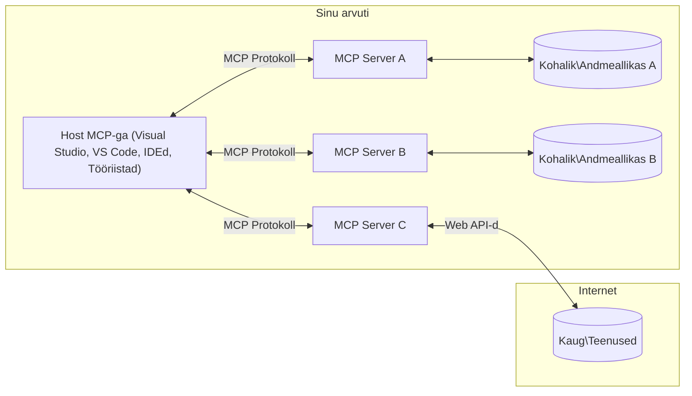

# MCP põhikontseptsioonid: Model Context Protocol'i valdamine tehisintellekti integreerimiseks

[](https://youtu.be/earDzWGtE84)

_(Klõpsake ülaloleval pildil, et vaadata selle õppetunni videot)_

[Model Context Protocol (MCP)](https://github.com/modelcontextprotocol) on võimas standardiseeritud raamistik, mis optimeerib kommunikatsiooni suurte keelemudelite (LLM-ide) ja väliste tööriistade, rakenduste ning andmeallikate vahel.  
See juhend viib teid MCP põhiliste kontseptsioonide juurde. Õpite tundma selle kliendi-serveri arhitektuuri, olulisi komponente, kommunikatsioonimehhanisme ja parimaid rakendustavasid.

- **Selge kasutaja nõusolek**: Kõik andmetele ligipääs ja toimingud nõuavad kasutaja selgesõnalist heakskiitu enne täideviimist. Kasutajad peavad olema teadlikud, milliseid andmeid käsitletakse ja milliseid toiminguid tehakse, andes peenhäälestatud kontrolli õiguste ja volituste üle.

- **Andmete privaatsuse kaitse**: Kasutaja andmeid avalikustatakse ainult selgesõnalise nõusoleku alusel ning neid tuleb kaitsta tugeva ligipääsukontrolliga kogu suhtluse jooksul. Rakendustel peab olema mehhanism jääda volitamata andmeedastustest ja hoida rangeid privaatsuspiire.

- **Tööriistade käivitamise ohutus**: Iga tööriista käivitamine nõuab selgesõnalist kasutaja nõusolekut, selget arusaamist tööriista funktsioonidest, parameetritest ja võimaliku mõju kohta. Tugevad turvapiirid peavad takistama ettenägematu, ohtliku või pahatahtliku töö käivitamist.

- **Transpordikihi turvalisus**: Kõik kommunikatsioonikanalid peavad kasutama sobivaid krüpteerimis- ja autentimismehhanisme. Kaugsidemed peavad rakendama turvalisi transpordiprotokolle ja nõuetekohast volituste haldust.

#### Rakendamisjuhised:

- **Õiguste haldus**: Rakendada peenhäälestatud õigussüsteemid, mis võimaldavad kasutajatel kontrollida, millised serverid, tööriistad ja ressursid on neile ligipääsetavad  
- **Autentimine & Volitamine**: Kasutada turvalisi autentimismeetodeid (OAuth, API võtmed) koos nõuetekohase tokenite halduse ja aegumisega  
- **Sisendi valideerimine**: Kontrollida kõiki parameetreid ja andmesisendeid määratletud skeemide järgi, et vältida süstimisrünnakuid  
- **Auditilogimine**: Säilitada põhjalikke logisid kõigist toimingutest turvaseire ja nõuetele vastavuse tagamiseks

## Ülevaade

See õppetund uurib Model Context Protocol (MCP) ökosüsteemi põhiarhitektuuri ja komponente. Õpite tundma kliendi-serveri arhitektuuri, võtmekomponeente ja kommunikatsioonimehhanisme, mis võimaldavad MCP interaktsioone.

## Peamised õpieesmärgid

Selle õppetunni lõpus:

- Mõistate MCP kliendi-serveri arhitektuuri.  
- Tuvastate Hostide, Kliendite ja Serverite rolle ja vastutusi.  
- Analüüsite põhifunktsioone, mis teevad MCP-st paindliku integratsioonikihi.  
- Õpite, kuidas info MCP ökosüsteemis voolab.  
- Saate praktilisi teadmisi .NET, Java, Python ja JavaScripti näidete kaudu.

## MCP arhitektuur: põhjalikum vaade

MCP ökosüsteem põhineb kliendi-serveri mudelil. See moodulstruktuur võimaldab tehisintellektrakendustel efektiivselt suhelda tööriistade, andmebaaside, API-de ja kontekstuaalsete ressurssidega. Vaatame selle arhitektuuri põhikomponentide kaupa lahti.

MCP põhineb kliendi-serveri arhitektuuril, kus hostrakendus saab ühendada mitme serveriga:


```mermaid
flowchart LR
    subgraph "Sinu arvuti"
        Host["Host MCP-ga (Visual Studio, VS Code, IDEd, Tööriistad)"]
        S1["MCP Server A"]
        S2["MCP Server B"]
        S3["MCP Server C"]
        Host <-->|"MCP Protokoll"| S1
        Host <-->|"MCP Protokoll"| S2
        Host <-->|"MCP Protokoll"| S3
        S1 <--> D1[("Kohalik\Andmeallikas A")]
        S2 <--> D2[("Kohalik\Andmeallikas B")]
    end
    subgraph "Internet"
        S3 <-->|"Web API-d"| D3[("Kaug\Teenused")]
    end
```

- **MCP Hostid**: Programmid nagu VSCode, Claude Desktop, IDEd või tehisintellekti tööriistad, mis soovivad MCP kaudu andmetele ligi pääseda  
- **MCP Kliendid**: Protokolli kliendid, kes hoiavad 1:1 ühendusi serveritega  
- **MCP Serverid**: Kerged programmid, mis pakuvad läbi standardiseeritud Model Context Protocol’i konkreetseid võimeid  
- **Kohalikud andmeallikad**: Teie arvuti failid, andmebaasid ja teenused, millele MCP serverid turvaliselt ligi pääsevad  
- **Kaugteenused**: Veebipõhised süsteemid, millele MCP serverid saavad interneti kaudu API-de kaudu ühenduda.

MCP protokoll on arenev standard, mis kasutab kuupäeva põhist versiooni (AAAA-KK-PP vormingus). Praegune protokolli versioon on **2025-11-25**. Viimaseid uuendusi näete [protokolli spetsifikatsioonis](https://modelcontextprotocol.io/specification/2025-11-25/).

> **Pilguheit tulevikku:** järgmise spetsifikatsiooni versiooni, **2026-07-28**, release-kandidaat kuulutati välja 2026. aasta mais ja see on planeeritud väljaandmiseks 28. juulil 2026. See muudab protokolli transpordikihis staateless’iks (eemaldades `initialize` käepigistamise ja sessiooni ID-d), formaliseerib laienduste raamistikku ning deprekeerib Roots, Sampling ja Logging uute mustrite kasuks. Täielik ülevaade on saadaval [Mis MCP-s muutub: 2026-07-28 release-kandidaat](./mcp-2026-07-28-release-candidate.md).

### 1. Hostid

Model Context Protocol’is (MCP) on **Hostid** tehisintellekti rakendused, mis toimivad peamise liidesena, mille kaudu kasutajad protokolliga suhtlevad. Hostid koordineerivad ja haldavad ühendusi mitme MCP serveriga, luues iga serveriühenduse jaoks eraldi MCP kliendi. Hostide näited on:

- **Tehisintellekti rakendused**: Claude Desktop, Visual Studio Code, Claude Code  
- **Arenduskeskkonnad**: IDEd ja koodiredaktorid, millel on MCP integratsioon  
- **Kohandatud rakendused**: Eesmärkpõhised AI agentid ja tööriistad

**Hostid** on rakendused, mis korraldavad tehisintellekti mudelitega suhtlust. Nad:

- **Juhtivad AI mudeleid**: Käivitavad või suhtlevad LLM-idega, et genereerida vastuseid ja koordineerida AI töövooge  
- **Halduvad kliendiühendusi**: Loovad ja haldavad iga MCP serveriühenduse jaoks ühte MCP klienti  
- **Juhtivad kasutajaliidest**: Hallavad vestluste voo, kasutaja suhtluse ja vastuste kuvamise  
- **Tagavad turvalisuse**: Kontrollivad õigusi, turvapiiranguid ja autentimist  
- **Haldavad kasutaja nõusolekut**: Juhivad kasutaja heakskiitu andmete jagamisel ja tööriistade käivitamisel

### 2. Kliendid

**Kliendid** on olulised komponendid, mis hoiavad Hostide ja MCP serverite vahel pühendatud üks-ühele ühendusi. Iga MCP klient luuakse Hosti poolt konkreetse MCP serveriga ühenduse loomiseks, tagades organiseeritud ja turvalise kommunikatsioonikanali. Mitmed kliendid võimaldavad Hostidel samaaegselt ühenduda mitme serveriga.

**Kliendid** on Hostrakenduse ühenduskomponendid. Nad:

- **Viivad läbi protokolli suhtlust**: Saadavad serveritele JSON-RPC 2.0 päringuid koos promptide ja juhistega  
- **Läbiräägivad võimeid**: Läbirääkimised toetatud funktsioonide ja protokolliversioonide üle serveriga initsialiseerimisel  
- **Haldavad tööriistade käivitamist**: Töötlevad mudelitelt tulnud tööriistapäringuid ja nende vastuseid  
- **Toetavad reaalaja uuendusi**: Töötlevad serverite teavitusi ja reaalajas uuendusi  
- **Töötlevad vastuseid**: Töötlevad ja vormindavad serveri vastuseid kasutajatele kuvamiseks

### 3. Serverid

**Serverid** on programmid, mis pakuvad konteksti, tööriistu ja võimeid MCP klientidele. Nad võivad töötada lokaalselt (same masina peal kui Host) või eemal (eksternaalsetel platvormidel) ning vastutavad klientide päringute töötlemise ja struktureeritud vastuste pakkumise eest. Serverid pakuvad konkreetset funktsionaalsust läbi standardiseeritud Model Context Protocol’i.

**Serverid** on teenused, mis pakuvad konteksti ja võimeid. Nad:

- **Registreerivad võimeid**: Registreerivad ja pakuvad kliendile kättesaadavaid pärismooduleid (ressursid, promptid, tööriistad)  
- **Töötlevad päringuid**: Võtavad vastu ja täidavad tööriistakutseid, ressursipäringuid ja promptipäringuid klientidelt  
- **Pakkuvad konteksti**: Esitavad kontekstuaalset infot ja andmeid, mis parandavad mudelite vastuseid  
- **Halduvad olekut**: Säilitavad sessiooni oleku ja haldavad vajadusel oleku põhiseid interaktsioone  
- **Saatvad reaalaja teavitusi**: Annavad teada võime muutustest ja uuendustest ühendatud klientidele

Servereid võib luua igaüks, et laiendada mudeli võimeid spetsialiseeritud funktsionaalsusega ning toetada nii lokaalseid kui ka kaugdeploy’d.

### 4. Serveri pärismoodulid

Model Context Protocol’i serverid pakuvad kolme põhikomponenti ehk **pärismoodulit**, mis määratlevad rikkalike interaktsioonide põhielemendid klientide, hostide ja keelemudelite vahel. Need pärismoodulid kirjeldavad, millist kontekstuaalset infot ja toiminguid protokolli kaudu pakutakse.

MCP serverid võivad pakkuda mis tahes kombinatsiooni järgmistest kolmest põhikomponendist:

#### Ressursid 

**Ressursid** on andmeallikad, mis annavad AI rakendustele kontekstuaalset teavet. Nad esindavad staatilist või dünaamilist sisu, mis aitab mudelitel paremini mõista ja otsuseid teha:

- **Kontekstuaalne info**: Struktureeritud info ja kontekst AI mudeli tarbimiseks  
- **Teadmiste baasid**: Dokumentide hoidlad, artiklid, käsiraamatud ja teadustööd  
- **Kohalikud andmeallikad**: Failid, andmebaasid ja kohalik süsteemi info  
- **Välised andmed**: API vastused, veebiteenused ja kaugsüsteemide andmed  
- **Dünaamiline sisu**: Reaalajas muutuvad andmed vastavalt välistele tingimustele

Ressursid tuvastatakse URI-dega ning neid saab avastada `resources/list` ja lugeda `resources/read` meetoditega:

```text
file://documents/project-spec.md
database://production/users/schema
api://weather/current
```

#### Promptid

**Promptid** on taaskasutatavad mallid, mis aitavad struktureerida keelemudelitega suhtlust. Nad pakuvad standardiseeritud suhtlusmustreid ja malle töövoogudes:

- **Mallipõhised suhtlused**: Eelkonstrueeritud sõnumid ja vestluse alustajad  
- **Töövoo mallid**: Standarditud sekvenseringud tavapäraste ülesannete jaoks  
- **Näidismallid**: Näidetele põhinevad juhised mudelile  
- **Süsteemi promptid**: Põhimudelid, mis määravad mudeli käitumise ja konteksti  
- **Dünaamilised mallid**: Parameetriseeritud promptid, mis kohanduvad spetsiifiliste olukordadega  

Promptide muutujate asendamine on toetatud ning neid saab avastada `prompts/list` ja hankida `prompts/get` meetoditega:

```markdown
Generate a {{task_type}} for {{product}} targeting {{audience}} with the following requirements: {{requirements}}
```

#### Tööriistad

**Tööriistad** on täidetavad funktsioonid, mida AI mudelid saavad käivitada kindlate ülesannete täitmiseks. Nad on MCP ökosüsteemi "tegusõnad", võimaldades mudelitel suhelda väliste süsteemidega:

- **Täidetavad funktsioonid**: Diskreetsed toimingud, mida mudel saab konkreetsete parameetritega kutsuda  
- **Väliste süsteemide integratsioon**: API kutsed, andmebaasi päringud, failioperatsioonid, arvutused  
- **Ainulaadne identiteet**: Igal tööriistal on erinev nimi, kirjeldus ja parameetriskeem  
- **Struktureeritud I/O**: Tööriistad võtavad vastu valideeritud parameetreid ja tagastavad struktureeritud, tüübitud vastuseid  
- **Toimingute võimekus**: Võimaldab mudelitel sooritada teist reaalse maailma toiminguid ja hankida elavaid andmeid

Tööriistu defineeritakse JSON skeemiga parameetrite valideerimiseks ning neid avastatakse `tools/list` ja käivitatakse `tools/call` meetoditega. Tööriistadel võib olla ka **ikoon** lisametaandmetena paremaks kasutajaliidese presentatsiooniks.

**Tööriista annotatsioonid**: Tööriistad toetavad käitumise annotatsioone (nt `readOnlyHint`, `destructiveHint`), mis kirjeldavad, kas tööriist on kirjutuskaitstud või hävitav, aidates klientidel teha teadlikumaid otsuseid tööriista käivitamise kohta.

Näide tööriista definitsioonist:

```typescript
server.tool(
  "search_products", 
  {
    query: z.string().describe("Search query for products"),
    category: z.string().optional().describe("Product category filter"),
    max_results: z.number().default(10).describe("Maximum results to return")
  }, 
  async (params) => {
    // Täida otsing ja tagasta struktureeritud tulemused
    return await productService.search(params);
  }
);
```

## Kliendi pärismoodulid

Model Context Protocol’is (MCP) võivad **kliendid** pakkuda pärismooduleid, mis võimaldavad serveritel taotleda rohkem võimeid hostrakenduselt. Need kliendi-poolsed pärismoodulid võimaldavad rikkalikumaid ja interaktiivsemaid serveri rakendusi, mille kaudu on võimalik ligi pääseda AI mudelivõimekusele ja kasutajate interaktsioonidele.

### Näidistamine

> **Deprekeerimisteade:** `2026-07-28` release-kandidaat märgib Sampling pärismooduli aegumist, asendades selle otsese integratsiooniga LLM pakkujate API-dega. See jääb toimima versioonis `2025-11-25` ja vähemalt ühe aasta peale deprekeerimist, kuid uued lahendused peaksid eelistama asendavat mustrit. Täiendav info: [Mis MCP-s muutub: 2026-07-28 release-kandidaat](./mcp-2026-07-28-release-candidate.md).

**Näidistamine** võimaldab serveritel taotleda keelemudeli täiendusi (completions) kliendi AI rakenduse kaudu. See pärismoodul võimaldab serveritel pääseda LLM võimekusele ilma enda mudeli sõltuvusi manustamata:

- **Mudelivaba ligipääs**: Serverid saavad taotleda täiendusi ilma LLM SDK-deta või mudeli ligipääsu haldamata  
- **Serveri algatatud AI**: Võimaldab serveritel autonoomselt genereerida sisu kliendi AI mudeli abil  
- **Rekursiivsed LLM suhtlused**: Toetab keerukaid stsenaariume, kus serverid vajavad AI abi töötlemiseks  
- **Dünaamiline sisu loomine**: Lubab serveritel luua kontekstuaalseid vastuseid hosti mudeli abil  
- **Tööriistade kutsumise tugi**: Serverid võivad saata `tools` ja `toolChoice` parameetreid, et lubada kliendi mudelil tööriistu kutsuda näidistamise ajal

Näidistamine käivitatakse `sampling/complete` meetodi kaudu, kus serverid saadavad täienduspäringud klientidele.

### Roots

> **Deprekeerimisteade:** `2026-07-28` release-kandidaat märgib Roots pärismooduli aegumist, asendades selle tööriista parameetrite, ressursside URI-de või serveri konfiguratsiooniga. See jääb toimima versioonis `2025-11-25` ja vähemalt ühe aasta peale deprekeerimist. Täpsem info: [Mis MCP-s muutub: 2026-07-28 release-kandidaat](./mcp-2026-07-28-release-candidate.md).

**Roots** pakuvad standardiseeritud viisi klientide jaoks, et näidata serveritele failisüsteemi piire, aidates serveritel mõista, millised kataloogid ja failid neile kättesaadavad on:

- **Failisüsteemi piirded**: Defineerivad piirid, kus serverid võivad failisüsteemis tegutseda  
- **Juurdepääsukontroll**: Aitavad serveritel mõista, millistele kataloogidele ja failidele neil on ligipääsu õigus  
- **Dünaamilised uuendused**: Kliendid võivad serveritele teavitada, kui Roots nimekiri muutub  
- **URI-põhine identifitseerimine**: Roots on määratletud `file://` URI-dega juurdepääsetavatele kataloogidele ja failidele

Rootse avastatakse `roots/list` meetodiga ning klient saadab muutuste korral teavitusi `notifications/roots/list_changed`.

### Küsitlemine  

**Küsitlemine** võimaldab serveritel taotleda kasutajalt lisateavet või kinnitust läbi kliendi liidese:

- **Kasutajasisendi nõudmised**: Serverid võivad küsida lisateavet, mis on vajalik tööriista käivitamiseks  
- **Kinnituskastid**: Nõuavad kasutajalt heakskiitu tundlike või mõjuvate toimingute puhul  
- **Interaktiivsed töövood**: Võimaldavad serveritel luua samm-sammulisi kasutajate interaktsioone  
- **Dünaamiline parameetrite kogumine**: Koguvad puuduvaid või valikulisi parameetreid tööriistade käivitamisel

Küsitlemispäringud tehakse `elicitation/request` meetodi kaudu, mis kogub kasutajasisendit kliendi liidese kaudu.

**URL-režiimi küsitlemine**: Serverid võivad taotleda ka URL-põhist kasutajate interaktsiooni, mis lubab suunata kasutajaid välistel veebilehtedel autentimiseks, kinnitamiseks või andmete sisestamiseks.

### Logimine
> **Hooldusest loobumise teade:** `2026-07-28` avaldamise kandidaat märgib Loggingu aegunuks `stderr` kasutamise kasuks stdio transpordi jaoks ja OpenTelemetry struktuurilise jälgitavuse jaoks. See jätkab tööd versioonis `2025-11-25` ja vähemalt aasta pärast igasugust aegumist. Vaata [Mis MCP-s muutub: 2026-07-28 avaldamise kandidaat](./mcp-2026-07-28-release-candidate.md).

**Logging** võimaldab serveritel saata klientidele struktureeritud logisõnumeid veaotsingu, jälgimise ja operatiivse nähtavuse jaoks:

- **Veaotsingu tugi**: võimaldab serveritel pakkuda üksikasjalikke täitmispäevikuid tõrkeotsinguks
- **Operatiivne jälgimine**: saadab staatusevärskendusi ja jõudlusnäitajaid klientidele
- **Vigade teatamine**: pakub üksikasjalikku veakonteksti ja diagnostilist teavet
- **Auditeerimislõigud**: loob põhjalikke logisid serveritegevustest ja otsustest

Logisõnumeid saadetakse klientidele, et tagada läbipaistvus serverite operatsioonides ja hõlbustada veaotsingut.

## Informatsioonivoog MCP-s

Model Context Protocol (MCP) määratleb struktureeritud infovoogu hostide, klientide, serverite ja mudelite vahel. Selle voo mõistmine aitab selgitada, kuidas kasutaja päringuid töödeldakse ja kuidas väliseid tööriistu ning andmeid mudeli vastustesse integreeritakse.

- **Host algatab ühenduse**  
  Hosti rakendus (näiteks IDE või vestlusliides) loob ühenduse MCP serveriga, tavaliselt STDIO, WebSocketi või muu toetatud transpordi kaudu.

- **Võimekuste läbirääkimine**  
  Klient (sisseehitatud hosti) ja server vahetavad infot oma toetatud funktsioonide, tööriistade, ressursside ja protokolli versioonide kohta. See tagab, et mõlemad pooled mõistavad, millised võimekused sessiooniks on saadaval.

- **Kasutaja päring**  
  Kasutaja suhtleb hostiga (nt sisestab käsu või päringu). Host kogub selle sisendi ja edastab selle töötlemiseks kliendile.

- **Ressursside või tööriistade kasutamine**  
  - Klient võib serverilt taotleda täiendavat konteksti või ressursse (nt faile, andmebaasi kirjeid või teadmistebaasi artikleid), et rikastada mudeli arusaama.
  - Kui mudel otsustab, et on vaja tööriista (näiteks andmete toomiseks, arvutuse tegemiseks või API kõneks), saadab klient serverile tööriista käivitamise päringu, täpsustades tööriista nime ja parameetrid.

- **Serveri täitmine**  
  Server võtab vastu ressursi- või tööriistapäringu, täidab vajalikud toimingud (näiteks käivitab funktsiooni, pärib andmebaasi või toob faili) ja tagastab tulemused struktureeritud vormingus kliendile.

- **Vastuse genereerimine**  
  Klient integreerib serveri vastused (ressursiandmed, tööriista väljund jne) käimasolevasse mudeli suhtlusse. Mudel kasutab seda infot põhjaliku ja kontekstitundliku vastuse loomiseks.

- **Tulemuste esitamine**  
  Host saab lõpliku väljundi kliendilt ning esitab selle kasutajale, tihti sisaldades nii mudeli genereeritud teksti kui tööriistade täitmise või ressursside päringu tulemusi.

See voog võimaldab MCP-l toetada arenenud, interaktiivseid ja kontekstitundlikke tehisintellekti rakendusi, ühendades sulatult mudeleid väliste tööriistade ja andmeallikatega.

## Protokolli arhitektuur ja kihid

MCP koosneb kahest eraldiseisvast arhitektuurikihist, mis töötavad koos, et pakkuda täielikku suhtluskeskkonda:

### Andmekiht

**Andmekiht** rakendab põhiosa MCP protokollist, kasutades alusena **JSON-RPC 2.0** protokolli. See kiht defineerib sõnumite ülesehituse, semantika ja suhtlemismustrid:

#### Põhikomponendid:

- **JSON-RPC 2.0 protokoll**: kogu kommunikatsioon kasutab standardiseeritud JSON-RPC 2.0 sõnumivormi meetodite kutseteks, vastusteks ja teavitusteks
- **Elutsükli haldus**: haldab ühenduse initsialiseerimist, võimekuste läbirääkimist ja sessiooni lõpetamist klientide ja serverite vahel
- **Serveri primitiivid**: võimaldab serveritel pakkuda põhifunktsionaalsust tööriistade, ressursside ja käskude kaudu
- **Kliendi primitiivid**: võimaldab serveritel taotleda LLM-i proovivõtmist, küsida kasutaja sisendit ja saata logisõnumeid
- **Reaalajas teavitused**: toetab asünkroonseid teavitusi dünaamiliste uuenduste jaoks ilma aktiivse päringuta

#### Peamised omadused:

- **Protokolliversiooni läbirääkimine**: kasutab kuupäevapõhist versioonimist (AAAA-KK-PP), et tagada ühilduvus
- **Võimekuste avastamine**: kliendid ja serverid vahetavad initsialiseerimisel toetatud funktsioonide infot
- **Seisundipõhised sessioonid**: hoiab ühenduse seisundit mitme suhtluse jooksul konteksti järjepidevuse tagamiseks

### Transpordikiht

**Transpordikiht** haldab suhtluskanaleid, sõnumite sissepakendamist ja autentimist MCP osalejate vahel:

#### Toetatud transpordimehhanismid:

1. **STDIO Transport**:  
   - Kasutab standardset sisendi/väljundi voogu otseseks protsesside vaheks suhtluseks  
   - Sobib ideaalselt lokaalsetele protsessidele samas masinas ilma võrgu lisakoormuseta  
   - Levinud kohalike MCP serverite rakendamisel

2. **Voogedastatav HTTP Transport**:  
   - Kasutab HTTP POST klient-server sõnumite edastamiseks  
   - Valikuliselt toetab Server-Sent Events (SSE) serverilt kliendile voogedastust  
   - Võimaldab kaugserveri suhtlust võrkude kaudu  
   - Toetab standardset HTTP autentimist (bearer token’id, API võtmestikud, kohandatud päised)  
   - MCP soovitab turvaliseks tokeni-põhiseks autentimiseks OAuthi

#### Transpordi abstraktsioon:

Transpordikiht peidab kommunikatsiooni üksikasjad andmekihi eest, võimaldades kasutada sama JSON-RPC 2.0 sõnumiformaati kõigi transpordimehhanismide puhul. See abstraktsioon võimaldab rakendustel sujuvalt vahetada lokaalsete ja kaugserverite vahel.

### Turvaküsimused

MCP rakendused peavad järgima mitmeid olulisi turvapõhimõtteid, et tagada turvalised, usaldusväärsed ja kaitstud suhtlused kõigil protokolli tasanditel:

- **Kasutaja nõusolek ja kontroll**: kasutajad peavad andma selgesõnalise nõusoleku enne, kui ükski andmetele juurdepääs või toiming võetakse ette. Neil peab olema selge kontroll jagatava info ja lubatud tegevuste üle, mida toetavad intuitiivsed kasutajaliidesed tegevuste ülevaatamiseks ja kinnitamiseks.

- **Andmete privaatsus**: kasutajaandmed peaksid olema avalikustatud ainult selgesõnalise nõusoleku alusel ning neid tuleb kaitsta asjakohaste juurdepääsukontrollidega. MCP rakendused peavad ära hoidma volitamata andmeside ja tagama privaatsuse kõigil suhtlustasanditel.

- **Tööriistade turvalisus**: enne tööriista käivitamist nõutakse kasutaja selgesõnalist nõusolekut. Kasutajad peaksid mõistma iga tööriista funktsionaalsust ja kehtestatama tugevaid turvapiire, et vältida tahtmatut või ohtlikku tööriista käivitust.

Nende turvapõhimõtete järgimine tagab MCP-l kasutajate usalduse, privaatsuse ja turvalisuse kogu protokolli ulatuses, võimaldades samal ajal võimsat AI integratsiooni.

## Koodinäited: peamised komponendid

Järgnevalt on toodud mitmes populaarse programmeerimiskeeles näited, mis illustreerivad, kuidas rakendada MCP serveri põhikomponente ja tööriistu.

### .NET näide: lihtsa MCP serveri loomine tööriistadega

Siin on praktiline .NET koodinäide, mis demonstreerib lihtsa MCP serveri loomist kohandatud tööriistadega. Näidis näitab, kuidas tööriistu määratleda ja registreerida, päringuid töödelda ja server ühendada Model Context Protocoliga.

```csharp
using System;
using System.Threading.Tasks;
using ModelContextProtocol.Server;
using ModelContextProtocol.Server.Transport;
using ModelContextProtocol.Server.Tools;

public class WeatherServer
{
    public static async Task Main(string[] args)
    {
        // Create an MCP server
        var server = new McpServer(
            name: "Weather MCP Server",
            version: "1.0.0"
        );
        
        // Register our custom weather tool
        server.AddTool<string, WeatherData>("weatherTool", 
            description: "Gets current weather for a location",
            execute: async (location) => {
                // Call weather API (simplified)
                var weatherData = await GetWeatherDataAsync(location);
                return weatherData;
            });
        
        // Connect the server using stdio transport
        var transport = new StdioServerTransport();
        await server.ConnectAsync(transport);
        
        Console.WriteLine("Weather MCP Server started");
        
        // Keep the server running until process is terminated
        await Task.Delay(-1);
    }
    
    private static async Task<WeatherData> GetWeatherDataAsync(string location)
    {
        // This would normally call a weather API
        // Simplified for demonstration
        await Task.Delay(100); // Simulate API call
        return new WeatherData { 
            Temperature = 72.5,
            Conditions = "Sunny",
            Location = location
        };
    }
}

public class WeatherData
{
    public double Temperature { get; set; }
    public string Conditions { get; set; }
    public string Location { get; set; }
}
```

### Java näide: MCP serveri komponendid

See näide demonstreerib sama MCP serverit ja tööriistade registreerimist nagu ülaltoodud .NET näites, kuid Java keeles.

```java
import io.modelcontextprotocol.server.McpServer;
import io.modelcontextprotocol.server.McpToolDefinition;
import io.modelcontextprotocol.server.transport.StdioServerTransport;
import io.modelcontextprotocol.server.tool.ToolExecutionContext;
import io.modelcontextprotocol.server.tool.ToolResponse;

public class WeatherMcpServer {
    public static void main(String[] args) throws Exception {
        // Loo MCP server
        McpServer server = McpServer.builder()
            .name("Weather MCP Server")
            .version("1.0.0")
            .build();
            
        // Registreeri ilmatööriist
        server.registerTool(McpToolDefinition.builder("weatherTool")
            .description("Gets current weather for a location")
            .parameter("location", String.class)
            .execute((ToolExecutionContext ctx) -> {
                String location = ctx.getParameter("location", String.class);
                
                // Hangi ilmateave (lihtsustatud)
                WeatherData data = getWeatherData(location);
                
                // Tagasta vormindatud vastus
                return ToolResponse.content(
                    String.format("Temperature: %.1f°F, Conditions: %s, Location: %s", 
                    data.getTemperature(), 
                    data.getConditions(), 
                    data.getLocation())
                );
            })
            .build());
        
        // Ühenda server stdio transpordiga
        try (StdioServerTransport transport = new StdioServerTransport()) {
            server.connect(transport);
            System.out.println("Weather MCP Server started");
            // Hoia server töös kuni protsess lõpetatakse
            Thread.currentThread().join();
        }
    }
    
    private static WeatherData getWeatherData(String location) {
        // Rakendus kasutaks ilmateenuse API-d
        // Lihtsustatud näite eesmärgil
        return new WeatherData(72.5, "Sunny", location);
    }
}

class WeatherData {
    private double temperature;
    private String conditions;
    private String location;
    
    public WeatherData(double temperature, String conditions, String location) {
        this.temperature = temperature;
        this.conditions = conditions;
        this.location = location;
    }
    
    public double getTemperature() {
        return temperature;
    }
    
    public String getConditions() {
        return conditions;
    }
    
    public String getLocation() {
        return location;
    }
}
```

### Python näide: MCP serveri loomine

See näide kasutab fastmcp-t, nii et paigaldage see esmalt:

```python
pip install fastmcp
```
Code Sample:

```python
#!/usr/bin/env python3
import asyncio
from fastmcp import FastMCP
from fastmcp.transports.stdio import serve_stdio

# Loo FastMCP server
mcp = FastMCP(
    name="Weather MCP Server",
    version="1.0.0"
)

@mcp.tool()
def get_weather(location: str) -> dict:
    """Gets current weather for a location."""
    return {
        "temperature": 72.5,
        "conditions": "Sunny",
        "location": location
    }

# Alternatiivne lähenemine kasutades klassi
class WeatherTools:
    @mcp.tool()
    def forecast(self, location: str, days: int = 1) -> dict:
        """Gets weather forecast for a location for the specified number of days."""
        return {
            "location": location,
            "forecast": [
                {"day": i+1, "temperature": 70 + i, "conditions": "Partly Cloudy"}
                for i in range(days)
            ]
        }

# Registreeri klassi tööriistad
weather_tools = WeatherTools()

# Käivita server
if __name__ == "__main__":
    asyncio.run(serve_stdio(mcp))
```

### JavaScript näide: MCP serveri loomine

See näide näitab MCP serveri loomist JavaScriptis ja kuidas registreerida kaks ilmaennustusega seotud tööriista.

```javascript
// Kasutades ametlikku Model Context Protocol SDK-d
import { McpServer } from "@modelcontextprotocol/sdk/server/mcp.js";
import { StdioServerTransport } from "@modelcontextprotocol/sdk/server/stdio.js";
import { z } from "zod"; // Parameetrite valideerimiseks

// Loo MCP server
const server = new McpServer({
  name: "Weather MCP Server",
  version: "1.0.0"
});

// Määra ilmatööriist
server.tool(
  "weatherTool",
  {
    location: z.string().describe("The location to get weather for")
  },
  async ({ location }) => {
    // See tavaliselt kutsub ilmateenuse API-d
    // Lihtsustatud näitamiseks
    const weatherData = await getWeatherData(location);
    
    return {
      content: [
        { 
          type: "text", 
          text: `Temperature: ${weatherData.temperature}°F, Conditions: ${weatherData.conditions}, Location: ${weatherData.location}` 
        }
      ]
    };
  }
);

// Määra prognoositööriist
server.tool(
  "forecastTool",
  {
    location: z.string(),
    days: z.number().default(3).describe("Number of days for forecast")
  },
  async ({ location, days }) => {
    // See tavaliselt kutsub ilmateenuse API-d
    // Lihtsustatud näitamiseks
    const forecast = await getForecastData(location, days);
    
    return {
      content: [
        { 
          type: "text", 
          text: `${days}-day forecast for ${location}: ${JSON.stringify(forecast)}` 
        }
      ]
    };
  }
);

// Abifunktsioonid
async function getWeatherData(location) {
  // Simuleeri API-kõnet
  return {
    temperature: 72.5,
    conditions: "Sunny",
    location: location
  };
}

async function getForecastData(location, days) {
  // Simuleeri API-kõnet
  return Array.from({ length: days }, (_, i) => ({
    day: i + 1,
    temperature: 70 + Math.floor(Math.random() * 10),
    conditions: i % 2 === 0 ? "Sunny" : "Partly Cloudy"
  }));
}

// Ühenda server stdio transpordiga
const transport = new StdioServerTransport();
server.connect(transport).catch(console.error);

console.log("Weather MCP Server started");
```

See JavaScripti näide demonstreerib, kuidas luua MCP server Model Context Protocol SDK abil. Näitab, kuidas registreerida tööriistad nimega `weatherTool` ja `forecastTool` ning muuta need MCP klientidele kättesaadavaks `StdioServerTransport` kaudu.

## Turvalisus ja autoriseerimine

MCP sisaldab mitmeid sisseehitatud kontseptsioone ja mehhanisme turvalisuse ja autoriseerimise haldamiseks kogu protokolli ulatuses:

1. **Tööriistade kasutusluba**:  
  Kliendid võivad sessiooni ajal täpsustada, milliseid tööriistu mudel kasutada võib. See tagab, et on ligipääs ainult selgesõnaliselt lubatud tööriistadele, vähendades ootamatute või ohtlike operatsioonide riski. Lubasid saab dünaamiliselt konfigureerida sõltuvalt kasutaja eelistustest, organisatsiooni poliitikast või suhtluse kontekstist.

2. **Autentimine**:  
  Serverid võivad nõuda autentimist, enne kui lubavad ligipääsu tööriistadele, ressurssidele või tundlikele operatsioonidele. See võib hõlmata API võtmeid, OAuth token’e või muid autentimisskeeme. Õige autentimine tagab, et ainult usaldusväärsed kliendid ja kasutajad saavad käivitada serveripoolseid funktsioone.

3. **Valideerimine**:  
  Kõikide tööriistakutsete parameetrite valideerimine on kohustuslik. Iga tööriist defineerib oodatud tüüpide, formaatide ja piirangute komplekti ning server kontrollib seda vastavalt sisse tulevate päringute puhul. See takistab valesti vormindatud või pahatahtliku sisendi jõudmist tööriista rakendusse ja aitab säilitada operatsioonide terviklikkust.

4. **Kiirusepiirangud**:  
  Kuritarvituste vältimiseks ja serveri ressursside õiglasemaks kasutamiseks võivad MCP serverid rakendada tööriistakutsete ja ressurssidele ligipääsu kiirusepiiranguid. Piirangud võivad olla kasutaja-, sessiooni- või globaalsed ning aitavad kaitsta teenusetõkestusrünnakute ja liialdatud ressursikasutuse eest.

Nende mehhanismide kombinatsioon pakub MCP-le turvalist alust keelemudelite integreerimiseks väliste tööriistade ja andmeallikatega, pakkudes kasutajatele ja arendajatele detailset ligipääsu- ja kasutusjuhtimist.

## Protokolli sõnumid ja suhtlusvoog

MCP suhtlus kasutab struktureeritud **JSON-RPC 2.0** sõnumeid, et võimaldada selget ja usaldusväärset suhtlust hostide, klientide ja serverite vahel. Protokoll määrab erinevatele toimingutele spetsiifilised sõnumimustrid:

### Põhisõnumi tüübid:

#### **Initsialiseerimise sõnumid**
- **`initialize` päring**: loob ühenduse ja läbiräägib protokolli versiooni ja võimekusi
- **`initialize` vastus**: kinnitab toetatud funktsioonid ja serveri info  
- **`notifications/initialized`**: märgib, et initsialiseerimine on lõpetatud ja sessioon valmis

#### **Avastus-sõnumid**
- **`tools/list` päring**: avastab serveris saadaval olevad tööriistad
- **`resources/list` päring**: loetleb saadaval olevad ressursid (andmeallikad)
- **`prompts/list` päring**: toob saadaolevad käsumallid

#### **Täitmisesõnumid**  
- **`tools/call` päring**: täidab konkreetse tööriista koos parameetritega
- **`resources/read` päring**: hangib sisu konkreetsest ressursist
- **`prompts/get` päring**: toob käsumalli valikuliste parameetritega

#### **Kliendipoolsed sõnumid**
- **`sampling/complete` päring**: server palub kliendil LLM täiendust
- **`elicitation/request`**: server küsib kasutajalt sisendit kliendi liidese kaudu
- **Logging sõnumid**: server saadab kliendile struktureeritud logisõnumeid

#### **Teavitussõnumid**
- **`notifications/tools/list_changed`**: server teavitab klienti tööriistade muudatustest
- **`notifications/resources/list_changed`**: server teavitab klienti ressursside muutustest  
- **`notifications/prompts/list_changed`**: server teavitab klienti käsumallide muutustest

### Sõnumi struktuur:

Kõik MCP sõnumid järgivad JSON-RPC 2.0 formaati koos:
- **Päringu sõnumid**: sisaldavad `id`, `method` ja valikulisi `params`
- **Vastus-sõnumid**: sisaldavad `id` ja kas `result` või `error`  
- **Teavitussõnumid**: sisaldavad `method` ja valikulisi `params` (ilma `id` ja vastust ootamata)

See struktureeritud suhtlus tagab usaldusväärse, jälgitava ja laiendatava kommunikatsiooni, toetades keerukaid stsenaariume nagu reaalajas uuendused, tööriistade kettimine ja tugev vigade käsitlemine.

### Ülesanded (eksperimentaalne)

> **Vaade tulevikku:** `2026-07-28` avaldamise kandidaat viib Ülesanded (Tasks) eksperimentaalsest põhispetsifikatsioonist pühendatud Ülesannete laiendusse uue elutsükliga (`tasks/get`, `tasks/update`, `tasks/cancel`; `tasks/list` eemaldatakse). Kui ehitate selle alltoodud eksperimentaalse API põhjal, planeerige migratsioon. Vaata [Mis MCP-s muutub: 2026-07-28 avaldamise kandidaat](./mcp-2026-07-28-release-candidate.md).

**Ülesanded** on eksperimentaalne funktsioon, mis võimaldab vastupidavaid täitmisümbriseid tagamaks edasilükatud tulemuste pärimise ja oleku jälgimise MCP päringute jaoks:

- **Pikaajalised toimingud**: jälgib kulukaid arvutusi, töövoo automatiseerimist ja partiitöötlust
- **Edasilükatud tulemused**: võimaldab küsida ülesande staatust ja kätte saada tulemusi operatsioonide lõpetamisel
- **Olek jälgimine**: jälgib ülesande edenemist määratletud elutsükli olekute kaudu
- **Mitme etapi operatsioonid**: toetab keerukaid töövooge, mis hõlmavad mitut suhtlust

Ülesanded ümbritsevad standardseid MCP päringuid, võimaldades asünkroonseid täitmismustreid operatsioonide jaoks, mida kohe lõpetada ei saa.

## Peamised mõtted

- **Arhitektuur**: MCP kasutab klient-server arhitektuuri, kus hostid haldavad mitut kliendiühendust serveritega
- **Osalised**: ökosüsteemi kuuluvad hostid (AI rakendused), kliendid (protokolli liidesed) ja serverid (võimekuste pakkujad)
- **Transpordimehhanismid**: suhtlus toetab STDIO-d (kohalik) ja voogedastatavat HTTP-d koos valikulise SSE-ga (kaugserver)
- **Põhiprimitid**: serverid avaldavad tööriistu (käivitatavad funktsioonid), ressursse (andmeallikad) ja käske (mallid)
- **Kliendipoolsed primitiivid**: serverid saavad taotleda proovivõttu (LLM täiendused koos tööriistakutsete toega), küsida kasutaja sisendit (sh URL režiim), juurd (failisüsteemi piirid) ja logimist klientidelt
- **Eksperimentaalsed funktsioonid**: Ülesanded pakuvad vastupidavaid täitmise ümbriseid pikaajalisteks toiminguteks
- **Protokolli alus**: põhineb JSON-RPC 2.0 ja kuupäevapõhisel versioonimisel (praegu: 2025-11-25)
- **Reaalajas võimekused**: toetab teavitusi dünaamiliste uuenduste ja reaalajas sünkroniseerimise jaoks
- **Turvalisus esikohal**: selgesõnaline kasutajanõusolek, andmete privaatsuskaitse ja turvaline transport on põhitingimused

## Harjutus

Kujunda lihtne MCP tööriist, mis oleks kasulik sinu valdkonnas. Määra:
1. Mis nime kannaks tööriist
2. Milliseid parameetreid see võtaks vastu
3. Millist väljundit see annaks
4. Kuidas mudel võiks seda tööriista kasutada kasutajaprobleemide lahendamiseks


---

## Mis järgmiseks

Järgmine: [2. peatükk: Turvalisus](../02-Security/README.md)
Uudishimulik, mis tuleb pärast `2025-11-25`? Loe [Mis MCP-s muutub: 2026-07-28 väljalaske kandidaat](./mcp-2026-07-28-release-candidate.md).

---

<!-- CO-OP TRANSLATOR DISCLAIMER START -->
**Lahtiütlus**:
See dokument on tõlgitud kasutades AI tõlketeenust [Co-op Translator](https://github.com/Azure/co-op-translator). Kuigi me püüdleme täpsuse poole, palun pange tähele, et automatiseeritud tõlgetes võib esineda vigu või ebatäpsusi. Originaaldokument selle emakeeles tuleks pidada autoriteetseks allikaks. Olulise teabe puhul soovitatakse kasutada professionaalset inimtõlget. Me ei vastuta selle tõlkega seotud eksimustest või valesti mõistmistest.
<!-- CO-OP TRANSLATOR DISCLAIMER END -->