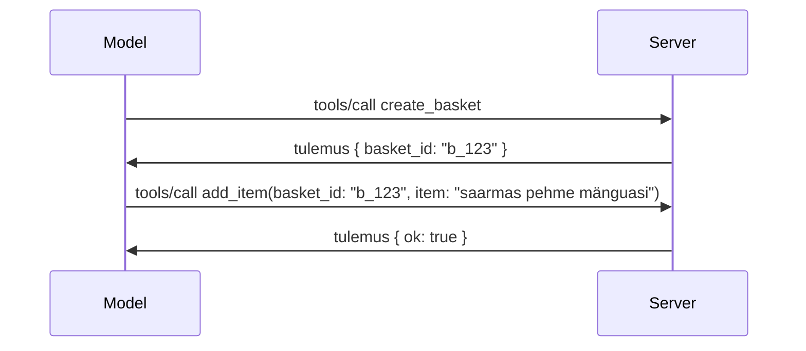

# Mis MCP-s muutub: versioonikandidaat 2026-07-28

> **Staatus:** versioonikandidaat. Spetsifikatsioon `2026-07-28` ei ole kirjutamise ajal lõplik. See kuulutati välja 21. mail 2026 ja on plaanis avaldada 28. juulil 2026. Kõik selles õppetükis kirjeldatu puudutab versioonikandidaati; kõige värskema seisundi saamiseks enne selle põhjal ehitamist vaata [eloomispõhjaka](https://modelcontextprotocol.io/specification/draft) ja selle [muudatuslugusid](https://modelcontextprotocol.io/specification/draft/changelog). Ülejäänud see õppekava on kirjutatud praeguse stabiilse versiooni, **MCP Specification 2025-11-25**, alusel ning seda uuendatakse, kui `2026-07-28` välja tuleb.

## Ülevaade

`2026-07-28` on suurim MCP ümbertegemine alates selle käivitamisest. Kuus Spetsifikatsiooni Täiustamise Ettepanekut (SEP) kaotavad protokollitasandi sessioonid ja muudavad MCP transpordikihil olekuvabaks, laiendused saavad esmaklassiliseks, versioonideks mehhanismiks ning mitmed varasemad selles õppekavas õpitud funktsioonid (Roots, Sampling, Logging) märgitakse uue elutsükli poliitika raames aegunuks. See õppetükk võtab kokku, mis muutub, miks see oluline on ja mida see tähendab sinu kirjutatud koodi jaoks, mis põhineb `2025-11-25`-l.

Allikas: [2026-07-28 MCP spetsifikatsiooni versioonikandidaat](https://blog.modelcontextprotocol.io/posts/2026-07-28-release-candidate/) (Model Context Protocoli blogi, David Soria Parra ja Den Delimarsky).

## Õpieesmärgid

Selle õppetüki lõpuks suudad:

- Selgitada, miks MCP liigub olekuvaba protokolli südamiku poole ja millise probleemi see horisontaalselt skaleeruvatel juurutustel lahendab.
- Kirjeldada, kuidas `initialize`/`initialized` kättesaamiskäepigistus ja `Mcp-Session-Id` päis asendatakse.
- Tuvastada uued `Mcp-Method` ja `Mcp-Name` päised ning `ttlMs`/`cacheScope` vahemälu metaandmed.
- Tunda ära Laienduste raamistik ja kaks selle versiooniga kaasasolevat laiendust: MCP Apps ja Tasks.
- Loetleda kuus autoriseerimise SEPd, mis tugevdavad OAuth 2.0 / OIDC vastavust.
- Tuvastada, millised põhifunktsioonid (Roots, Sampling, Logging) on nüüd aegunud ja mida see praktikas tähendab.
- Selgitada tööriistade `inputSchema`/`outputSchema` täieliku JSON Schema 2020-12 muudatusi.

## Olekuvaba protokoll

Peamine muudatus: MCP saab protokollitasandil olekuvabaks.

### Enne (2025-11-25): sessioonid siduvad sind ühe serveriga

Tööriista kutsumine üle Streamable HTTP algab `initialize` kättesaamiskäepigistusega. Server vastab `Mcp-Session-Id` päisega, mida tuleb kanda igas järgnevates taotlustes:

```http
POST /mcp HTTP/1.1
Mcp-Session-Id: 1868a90c-3a3f-4f5b
Content-Type: application/json

{"jsonrpc":"2.0","id":2,"method":"tools/call",
 "params":{"name":"search","arguments":{"q":"otters"}}}
```

Kuna sessioon on seotud selle serveri eksemplariga, mis selle välja andis, vajavad horisontaalselt skaleeritud juurutused **kindlast reitingut** (sticky routing) koormuse tasakaalustajal ja **jagatud sessioonisalvestust** eksemplaride vahel.

### Pärast (2026-07-28): iga päring on iseseisev

```http
POST /mcp HTTP/1.1
MCP-Protocol-Version: 2026-07-28
Mcp-Method: tools/call
Mcp-Name: search
Content-Type: application/json

{"jsonrpc":"2.0","id":1,"method":"tools/call",
 "params":{"name":"search","arguments":{"q":"otters"},
           "_meta":{"io.modelcontextprotocol/clientInfo":{"name":"my-app","version":"1.0"}}}}
```

Iga server saab selle taotluse käsitleda. Peamised muudatused:

- **`initialize`/`initialized` käepigistus kaob** ([SEP-2575](https://github.com/modelcontextprotocol/modelcontextprotocol/pull/2575)). Protokolli versioon, kliendi info ja võimekus liiguvad iga taotluse `_meta` alla. Uus `server/discover` meetod võimaldab kliendil eelnevalt serveri võimekusi pärida, kui need on vajalikud.
- **`Mcp-Session-Id` päis ja protokollitasandi sessioon kaovad** ([SEP-2567](https://github.com/modelcontextprotocol/modelcontextprotocol/pull/2567)). Kindel reiting ja jagatud sessioonisalvestus ei ole enam protokollitasandil vajalikud.

### Olekuvaba protokoll, olekuga rakendused

Protokollitasandi sessiooni kaotamine ei tähenda, et server ei võiks endiselt olla olekuga. Soovitatav muster on sama, mida HTTP API-d on alati kasutanud: genereerida väljaspoolt selge käepide (näiteks `basket_id`, `browser_id`) ühe tööriistakõne põhjal ja lasta mudelil see käepide hilisematel kõnedele tavalise argumendina edasi anda.



See teeb oleku mudelile nähtavaks ja mõistlikuks, mitte ei peida seda transpordimetaandmete sees, ning võimaldab iga serveri instantsil igat kõnet töödelda.

### Serverilt kliendile päringud ümberstruktureeritud

Olekuvaba protokoll vajab siiski võimalust, et server võiks kliendilt midagi küsida kõne keskel (näiteks küsitluse viip):

- **Serveri initsieeritud päringuid võib teha ainult siis, kui server on aktiivselt kliendi päringut töötlemas** ([SEP-2260](https://github.com/modelcontextprotocol/modelcontextprotocol/pull/2260)) — varem oli see soovitus, nüüd kohustus. Kasutajat ei kutsuta kunagi juhuslikult välja.
- **Mitme ringireisiga päringud** ([SEP-2322](https://github.com/modelcontextprotocol/modelcontextprotocol/pull/2322)) asendavad avatud SSE voo hoidmist. Selle asemel tagastab server `InputRequiredResult`:

  ```json
  {
    "resultType": "inputRequired",
    "inputRequests": {
      "confirm": {
        "type": "elicitation",
        "message": "Delete 3 files?",
        "schema": { "type": "boolean" }
      }
    },
    "requestState": "eyJzdGVwIjoxLCJmaWxlcyI6WyJhIiwiYiIsImMiXX0="
  }
  ```

  Klient kogub vastused ja teeb algse kõne uuesti koos `inputResponses` ja kajastatud `requestState`-ga. Iga serveri eksemplar saab seda uuesti katsetamist vastu võtta, sest kõik vajalik on koormuses.

### Suunatav, vahemällu salvestatav, jälgitav

Kolm väiksemat muudatust teevad olekuvaba liikluse kasutamise lihtsamaks:

- **`Mcp-Method` ja `Mcp-Name` päised on kohustuslikud Streamable HTTP-s** ([SEP-2243](https://github.com/modelcontextprotocol/modelcontextprotocol/pull/2243)), nii et koormuse tasakaalustajad, väravad ja kvantpiirajad saavad operatsiooni ilma JSON keha uurimata suunata. Serverid keelduvad taotlustest, kus päised ja keha ei ühti.
- **`tools/list` ja ressursi lugemise tulemused kannavad `ttlMs` ja `cacheScope` väärtusi** ([SEP-2549](https://github.com/modelcontextprotocol/modelcontextprotocol/pull/2549)), mis on kujundatud HTTP `Cache-Control` põhjal. Kliendid teavad, kui kaua loenditulemus on värske ja kas seda võib ohutult kasutajate vahel jagada, ilma et peaks kauakestvat SSE voogu muudatuste õppimiseks hoidma.
- **W3C Trace Context levik `_meta` sees on dokumenteeritud** ([SEP-414](https://github.com/modelcontextprotocol/modelcontextprotocol/pull/414)), määrates kindlaks `traceparent`, `tracestate` ja `baggage` võtmete nimed, et hajutatud jälg saaks kutsestikes järgida kliendilt MCP serveri ja edasiste süsteemide OpenTelemetry-ga ühilduvas taustas.

## Laiendused saavad esmaklassilisteks

Laiendused olid olemas ebavormiliselt versioonis `2025-11-25`. [SEP-2133](https://github.com/modelcontextprotocol/modelcontextprotocol/pull/2133) vormistab need:

- Laiendused identifitseeritakse pööratud DNS-i ID-dega.
- Neid läbiräägitakse `extensions` kaardina kliendi ja serveri võimekustes.
- Need elavad oma `ext-*` hoidlate all, kus on volitatud haldajad ja versioonid on südamikust sõltumatud.
- Uus Laienduste rada SEP protsessis annab neile tee eksperimentaalsest ametlikuks.

See versioon sisaldab kahte ametlikku laiendust.

### MCP Apps: serveri genereeritud kasutajaliidesed

[MCP Apps](https://blog.modelcontextprotocol.io/posts/2026-01-26-mcp-apps/) ([SEP-1865](https://github.com/modelcontextprotocol/modelcontextprotocol/pull/1865)) võimaldab serveritel tarnida interaktiivseid HTML-liideseid, mida hostid kuvavad liivakastitud iframe'is. Tööriistad deklareerivad oma kasutajaliidese mallid ette, et hostid saaksid neid eelduplikeerida, vahemällu salvestada ja turvakontrollida enne käivitumist. Selle põhialused läksid sul juba läbi [Õppetükk 15: MCP Apps](../03-GettingStarted/15-mcp-apps/README.md) — Laienduste raamistikus on MCP Apps nüüd ametlik laiendus, mitte eksperimentaalne südamiku funktsioon.

### Tasks saab laienduseks

Tasks eksisteeris eksperimentaalse südamiku funktsioonina versioonis `2025-11-25`. Tootmiskasutus tõi välja piisavalt ümberkujundamist, et õige koht on laienduses: [Tasks laiendus](https://github.com/modelcontextprotocol/modelcontextprotocol/pull/2663) muudab elutsükli olekuvaba mudeli ümber — server võib vastata `tools/call`-iga tööülesande käepidemega ja klient ajab seda edasi `tasks/get`, `tasks/update` ja `tasks/cancel` abil. Ülesande loomine on serveripoolne: klient teatab laiendusest ja server otsustab, millal kõne sooritatakse ülesandena. `tasks/list` eemaldatakse täielikult, sest seda ei saa sessioonideta turvaliselt skaleerida.

> **Migratsioonimärkus:** kui oled kasutanud eksperimentaalset `2025-11-25` Tasks API-d, tuleb sul migratsioon teha uue laienduste elutsüklisse — see ei ole tagurpidi ühilduv.

## Autoriseerimise tugevdamine

Kuus SEPd tugevdavad [autoriseerimise spetsifikatsiooni](https://modelcontextprotocol.io/specification/draft/basic/authorization), muutes selle rohkem kooskõlaliseks pärismaailma OAuth 2.0 / OpenID Connect juurutustega:

| SEP | Muudatus |
|---|---|
| [SEP-2468](https://github.com/modelcontextprotocol/modelcontextprotocol/pull/2468) | Kliendid peavad kontrollima `iss` parameetrit autoriseerimisvastustes vastavalt [RFC 9207-le](https://www.rfc-editor.org/rfc/rfc9207), vältides MCP ühe kliendi-paljude serverite mustri segadusrünnakuid. Tulevane versioon nõuab `iss` puudumisega vastuste tagasilükkamist. |
| [SEP-837](https://github.com/modelcontextprotocol/modelcontextprotocol/pull/837) | Kliendid esitavad OpenID Connect `application_type` dünaamilise kliendiregistreerimise ajal, vältides autoriseerimisserverite vaikimisi seadistust töölauakliendi puhul `"web"` ja selle localhost suunamise tagasilükkamist. |
| [SEP-2352](https://github.com/modelcontextprotocol/modelcontextprotocol/pull/2352) | Kliendid seovad registreeritud volitused autoriseerimisserveri `issuer`-iga ja registreerivad uuesti, kui ressurss liigub serverite vahel. |
| [SEP-2207](https://github.com/modelcontextprotocol/modelcontextprotocol/pull/2207) | Kirjeldab, kuidas taotleda värskendustokenid OpenID Connect tüüpi autoriseerimisserveritelt. |
| [SEP-2350](https://github.com/modelcontextprotocol/modelcontextprotocol/pull/2350) | Selgitab skoopide kogunemist „step-up“ autoriseerimise ajal. |
| [SEP-2351](https://github.com/modelcontextprotocol/modelcontextprotocol/pull/2351) | Selgitab `.well-known` avastamise suffiksi. |

Kui sa ehitad täna MCP autoriseerimisserverit, alusta kohe `iss` edastamisest autoriseerimisvastustes — vaata [02-Security](../02-Security/README.md) praegust autoriseerimissoovitust, millele see tugineb.

## Roots, Sampling ja Logging on aegunud

Uue [funktsioonide elutsükli poliitika](https://github.com/modelcontextprotocol/modelcontextprotocol/pull/2577) ([SEP-2577](https://github.com/modelcontextprotocol/modelcontextprotocol/pull/2577)) kohaselt liiguvad kolm põhikliendiprimitiivi, millest õppisid [Core Concepts](./README.md#roots) osas, **Aegunud** staatusse:

| Funktsioon | Soovitatud asendus |
|---|---|
| Roots | Tööriistaparametrid, ressursside URI-d või serverikonfiguratsioon |
| Sampling | Otsene integreerimine LLM-pakkujate API-dega |
| Logging | `stderr` stdio transpordi jaoks; OpenTelemetry struktureeritud jälgitavuse jaoks |

Need on **ainult annotatsioonipõhised aegumised**: meetodid, tüübid ja võimekuslipud töötavad endiselt selles versioonis ja kõigis sama aasta jooksul avaldatud versioonides. Järgnevate täielike eemalduste jaoks on tarvis eraldi SEP-d elutsükli poliitika alusel — seega su olemasolevad [Sampling](../03-GettingStarted/14-sampling/README.md) näited töötavad tänaseni katkematult, aga uued serverid peaks eelistama ülaltoodud asendusmustreid.

## Tööriistade täielik JSON Schema 2020-12

Tööriistade `inputSchema` ja `outputSchema` on nihutatud täieliku [JSON Schema 2020-12](https://json-schema.org/draft/2020-12) tasemele ([SEP-2106](https://github.com/modelcontextprotocol/modelcontextprotocol/pull/2106)):

- Sisendi skeemid säilitavad juurtüübina `type: "object"` piirangu, kuid lubavad nüüd kompositsiooni (`oneOf`, `anyOf`, `allOf`), tingimuslauset ja viiteid (`$ref`, `$defs`).
- Väljundi skeemid on piiranguteta ja `structuredContent` võib nüüd olla mis tahes JSON väärtus, mitte ainult objekt.
- Rakendused ei tohi automaatselt derefereerida väliseid `$ref` URIsid ja peaksid piirama skeemi sügavust ja valideerimise kestust (teenuse keelamise rünnaku kaalutlus serveripoolsele valideerimisele).

Eraldi muutub puuduva ressursi veakood MCP spetsiaalsest `-32002` koodist JSON-RPC standardiks `-32602` (Invalid Params) ([SEP-2164](https://github.com/modelcontextprotocol/modelcontextprotocol/pull/2164)). Kui su klient otsib täpset `-32002` väärtust, tuleb see uuendada.

## Kuidas protokoll edasi areneb

See versioon sisaldab katkestavaid muudatusi, mida MCP hooldajad ei soovi edaspidi normiks pidada. Kolm haldus-SEPd püüavad selle kordumist vältida:

- **Funktsioonide elutsükli poliitika** annab igale funktsioonile teekonna Aktiivnena → Aegunult → Eemaldatuna vähemalt kaheteistkümne kuu vahega aegumisest esimese võimaliku eemaldamiseni.
- **Laienduste raamistik** võimaldab uutel võimekustel ilmuda valikuliste laiendustena ja seal stabiilseks saada enne (kui üldse) südamikku viimist.

- Standardteekonna SEP ei saa enam lõppstaatuseni jõuda, kuni vastav stsenaarium jõuab [nõuetele vastavuse komplekti](https://github.com/modelcontextprotocol/conformance) ([SEP-2484](https://github.com/modelcontextprotocol/modelcontextprotocol/pull/2484)) — sama komplekti, mille vastu [SDK taseme süsteem](https://github.com/modelcontextprotocol/modelcontextprotocol/pull/1777) ametlikke SDKsid hindab.

## Väljalaske ajakava ja valideerimine

- Väljalaske kandidaat lukustati 21. mail 2026.
- Lõplik spetsifikatsioon on planeeritud 28. juuliks 2026.
- Kümne nädala pikkune periood kahe kuupäeva vahel annab SDK hooldajatele ja kliendi rakendajatele võimaluse muudatusi reaalses töökoormuses valideerida; taseme 1 SDK-delt oodatakse selle perioodi jooksul toe tarnimist vastavalt [SDK taseme süsteemile](https://modelcontextprotocol.io/docs/sdk).
- Jälgi kõiki muudatusi [eelnõu spetsifikatsioonis](https://modelcontextprotocol.io/specification/draft) ja selle [muudatuste logis](https://modelcontextprotocol.io/specification/draft/changelog).

## Mida see tähendab selle õppekava jaoks

Kõik, mida selle kursuse jooksul siiani õppinud oled, on mõeldud **2025-11-25** kuupäevaks, mis jääb kuni `2026-07-28` väljaandmiseni kehtivaks stabiilseks spetsifikatsiooniks. Konkreetsemalt:

- **Sessioonid ja `initialize` kättesaamise protsess** (kaetud [Põhikontseptsioonides](./README.md) ja [Õppetund 6: HTTP voogesitus](../03-GettingStarted/06-http-streaming/README.md)) töötavad endiselt nagu dokumenteeritud, kuid oota, et need asendatakse ülaltoodud olekuta taotlusmudeliga, kui uuendad `2026-07-28`-iga ühilduvaks SDKdeks.
- **Proovi võtmine ja juured** (samuti kaetud [Põhikontseptsioonides](./README.md)) jäävad täielikult toimima, kuid on aegunud — uued lahendused peaksid eelistama ülaltoodud asendusmustreid.
- **Eksperimentaalne Tasks (ülesanded) funktsioon**, kui oled seda kasutanud, tuleb üle viia Tasks laienduse uude elutsüklisse.
- **MCP rakendused** ([Õppetund 15](../03-GettingStarted/15-mcp-apps/README.md)) ei muutu praktikas; need lihtsalt liigutatakse ametliku Laienduste raamistikku alla.

## Täiendavad ressursid

- [2026-07-28 MCP spetsifikatsiooni väljalaske kandidaat (blogipostitus)](https://blog.modelcontextprotocol.io/posts/2026-07-28-release-candidate/)
- [MCP transpordi tulevik](https://blog.modelcontextprotocol.io/posts/2025-12-19-mcp-transport-future/)
- [MCP eelnõu spetsifikatsioon](https://modelcontextprotocol.io/specification/draft)
- [MCP eelnõu muudatuste logi](https://modelcontextprotocol.io/specification/draft/changelog)
- [SEP juhendid](https://modelcontextprotocol.io/community/sep-guidelines)
- [MCP SDK tasemete süsteem](https://modelcontextprotocol.io/docs/sdk)

## Järgmised sammud

Mine tagasi [Põhikontseptsioonidesse](./README.md) või jätka [Turvalisusega](../02-Security/README.md), et näha, kuidas tänane `2025-11-25` juhend vastab tuleviku arengutele.

---

<!-- CO-OP TRANSLATOR DISCLAIMER START -->
**Lahtiütlus**:
See dokument on tõlgitud kasutades AI tõlketeenust [Co-op Translator](https://github.com/Azure/co-op-translator). Kuigi me püüdleme täpsuse poole, palun pange tähele, et automatiseeritud tõlgetes võib esineda vigu või ebatäpsusi. Originaaldokument selle emakeeles tuleks pidada autoriteetseks allikaks. Olulise teabe puhul soovitatakse kasutada professionaalset inimtõlget. Me ei vastuta selle tõlkega seotud eksimustest või valesti mõistmistest.
<!-- CO-OP TRANSLATOR DISCLAIMER END -->