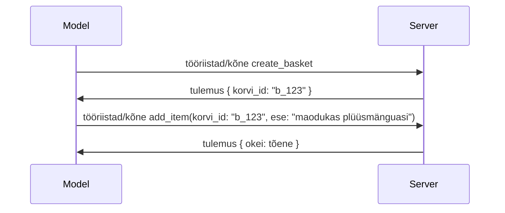

# Mis MCP-s muutus: spetsifikatsioon 2026-07-28

> **Staatus:** Lõplik. MCP spetsifikatsioon `2026-07-28` avaldati 28. juulil 2026
> ja on praegune protokolli versioon. See õppetund kirjeldab lõplikku
> spetsifikatsiooni. Mõned õppekavade näited on selgesõnaliselt märgistatud versioonile
> `2025-11-25`, sest nende SDK-d pole veel uut olekuta API-t omaks võtnud;
> käsitle neid näiteid kui vananenud ühilduvussuuna juhiseid.

## Ülevaade

`2026-07-28` on suurim MCP uuendus alates selle lansseerimisest. Kuus
spetsifikatsiooni täiendusettepanekut (SEP) eemaldavad protokollitasandil sessioonid ja
muudavad MCP transporditasandil olekutuks, laiendused muutuvad esimese klassi,
versioonitud mehhanismiks ning mitmed selle õppekava varasemad funktsioonid
(Roots, Sampling, Logging) deaktiveeritakse uue elutsükli poliitika alusel. See
õppetund võtab kokku, mis muutus, miks see on oluline ja mida see tähendab
koodile, mis on kirjutatud versiooni `2025-11-25` alusel.

Allikas: [The 2026-07-28 MCP Specification Release Candidate](https://blog.modelcontextprotocol.io/posts/2026-07-28-release-candidate/) (Model Context Protocol Blog, David Soria Parra ja Den Delimarsky).

## Õpieesmärgid

Selle õppetunni lõpuks oskad sa:

- Selgitada, miks MCP liigub olekuta protokolli südamikuni ja missuguse probleemi see lahendab horisontaalselt skaleeritud juurutustes.
- Kirjeldada, kuidas asendatakse `initialize`/`initialized` käepigistust ja `Mcp-Session-Id` päist.
- Tuua välja uued `Mcp-Method` ja `Mcp-Name` päised ning `ttlMs`/`cacheScope` vahemällu salvestamise metaandmed.
- Tunnustada Laienduste raamistiku ja kahe selle väljaandega kaasneva laienduse olemasolu: MCP Apps ja Tasks.
- Kokku võtta autoriseerimise tugevdamine ja dünaamilise kliendiregistreerimise
  vananemine.
- Määratleda, millised põhifunktsioonid (Roots, Sampling, Logging) on nüüd deaktiveeritud ja mida see praktikas tähendab.
- Selgitada tööriista `inputSchema`/`outputSchema` täielikku JSON skeemi 2020-12 muutust.

## Olekuta protokoll

Peamine muudatus: MCP muutub protokollitasandil olekuta.

### Enne (2025-11-25): sessioonid seovad sind ühe serveri instantsiga

Tööriista kutsumine Streamable HTTP kaudu algab `initialize` käepigistusega. Server vastab päisega `Mcp-Session-Id`, mida peab kandma iga järgmine päring:

```http
POST /mcp HTTP/1.1
Mcp-Session-Id: 1868a90c-3a3f-4f5b
Content-Type: application/json

{"jsonrpc":"2.0","id":2,"method":"tools/call",
 "params":{"name":"search","arguments":{"q":"otters"}}}
```

Kuna sessioon on seotud selle serveri instantsiga, mis selle väljastas, vajavad horisontaalselt skaleeritud juurutused koormuse tasakaalustajal **kleepuvat marsruutimist** ja instantside vahel **jagatud sessioonipoodi**.

### Pärast (2026-07-28): iga päring on iseseisev

```http
POST /mcp HTTP/1.1
MCP-Protocol-Version: 2026-07-28
Mcp-Method: tools/call
Mcp-Name: search
Content-Type: application/json

{"jsonrpc":"2.0","id":1,"method":"tools/call",
 "params":{"name":"search","arguments":{"q":"otters"},
           "_meta":{"io.modelcontextprotocol/protocolVersion":"2026-07-28",
                    "io.modelcontextprotocol/clientInfo":{"name":"my-app","version":"1.0"},
                    "io.modelcontextprotocol/clientCapabilities":{}}}}
```

Igas serveri instantsis saab seda päringut töödelda. Peamised muudatused:

- **`initialize`/`initialized` käepigistus eemaldatakse** ([SEP-2575](https://github.com/modelcontextprotocol/modelcontextprotocol/pull/2575)). Protokolli versioon, kliendi info ja klientide võimalused liiguvad `_meta` objekti igas päringus. Uus meetod `server/discover` võimaldab kliendil kohe alguses serveri võimeid pärida, kui ta neid vajab.
- **`Mcp-Session-Id` päis ja protokollitasandi sessioon eemaldatakse** ([SEP-2567](https://github.com/modelcontextprotocol/modelcontextprotocol/pull/2567)). Kleepuv marsruutimine ja jagatud sessioonipood ei ole protokollitasandil enam vajalikud.

### Olekuta protokoll, olekuga rakendused

Protokollitasandi sessiooni eemaldamine ei tähenda, et su server ei võiks olla olekuga. Soovitatav muster on see, mida HTTP API-d on alati kasutanud: väljastada terminal (nt `basket_id`, `browser_id`) ühelt tööriistakõnelt ja lasta mudelil see terminal hilisematel kõnnetel argumendina kaasa anda.



See teeb oleku mudelile nähtavaks ja mõistlikuks, selle asemel et peita seda transpordimetaandmetesse, ning võimaldab mistahes serveri instantsil iga kõne töödelda.

### Serveri poolt kliendile suunatud päringud, ümber korraldatud

Olekuta protokoll vajab ikkagi võimalust, et server saaks kliendilt mid-kõne ajal midagi pärida (näiteks küsimise viibi):

- **Serveri algatatud päringuid tohib esitada ainult siis, kui server aktiivselt klientpäringut töötleb** ([SEP-2260](https://github.com/modelcontextprotocol/modelcontextprotocol/pull/2260)) — varem soovitus, nüüd kohustus. Kasutajat ei paluta äkitselt midagi teha.
- **Mitme-ringiline päring** ([SEP-2322](https://github.com/modelcontextprotocol/modelcontextprotocol/pull/2322)) asendab pidevalt avatuna hoitud SSE voo. Selle asemel tagastab server `InputRequiredResult` objekt:

  ```json
  {
    "resultType": "input_required",
    "inputRequests": {
      "confirm": {
        "type": "elicitation",
        "message": "Delete 3 files?",
        "schema": { "type": "boolean" }
      }
    },
    "requestState": "eyJzdGVwIjoxLCJmaWxlcyI6WyJhIiwiYiIsImMiXX0="
  }
  ```

  Klient kogub vastused ja esitab algse kõne uuesti koos `inputResponses` ja korduva `requestState` objektiga. Igas serveri instantsis võib uuendust töödelda, sest kõik vajalik on pakendi sees.

### Marsruuditav, vahemällu salvestatav, jälgitav

Kolm väiksemat muudatust teevad olekuta liiklust lihtsamini hallatavaks:

- **`Mcp-Method` ja `Mcp-Name` päised on kohustuslikud Streamable HTTP puhul** ([SEP-2243](https://github.com/modelcontextprotocol/modelcontextprotocol/pull/2243)), et koormuse tasakaalustajad, väravad ja kiirusepiirajad saaksid toimingut marsruutida ilma JSON keha uurimata. Serverid tagasilükkavad päringud, kus päised ja keha ei klapi.
- **`tools/list` ja ressursi lugemise tulemused kannavad `ttlMs` ja `cacheScope` metaandmeid** ([SEP-2549](https://github.com/modelcontextprotocol/modelcontextprotocol/pull/2549)), mis on modelleeritud HTTP `Cache-Control` järgi. Kliendid teavad, kui kaua on listitulemused värsked ja kas neid võib kasutajate vahel jagada, ilma et nad vajaksid muutuste jälgimiseks pikaajalist SSE voogu.
- **W3C jälgimiskonteksti levitamine `_meta` sees on dokumenteeritud** ([SEP-414](https://github.com/modelcontextprotocol/modelcontextprotocol/pull/414)), parandades võtmenimesid nagu `traceparent`, `tracestate` ja `baggage`, et hajutatud jälgimine saaks kõnet jälgida kliendi SDK-st MCP serverisse ja alam-süsteemidesse OpenTelemetry-ga ühilduvas taustasüsteemis.

## Laiendused muutuvad esimese klassi objektideks

Laiendused eksisteerisid mitteametlikult juba `2025-11-25`. [SEP-2133](https://github.com/modelcontextprotocol/modelcontextprotocol/pull/2133) formaliseerib need:

- Laiendusi tuvastatakse pööratud DNS ID-dega.
- Nende suhtlus toimub kliendi ja serveri võimete `extensions` kaardi kaudu.
- Need elavad omaette `ext-*` repositooriumites koos volitatud hooldajatega ning versioonitakse iseseisvalt põhispetsifikatsioonist.
- SEP protsessis on uus Laienduste rada, mis annab neile tee eksperimentaalsest ametlikuks.

See väljaanne toob kaasa kaks ametlikku laiendust.


### MCP rakendused: serveripoolselt renderdatud kasutajaliidesed

[MCP rakendused](https://blog.modelcontextprotocol.io/posts/2026-01-26-mcp-apps/) ([SEP-1865](https://github.com/modelcontextprotocol/modelcontextprotocol/pull/1865)) võimaldavad serveritel saata interaktiivseid HTML-liideseid, mida hostid kuvavad sandboxitud iframe'is. Tööriistad deklareerivad oma kasutajaliidese mallid ette, nii et hostid saavad need eel-laadida, vahemällu salvestada ja turvakontrolli teha enne, kui midagi käivitub. Sa juba käsitlesid selle põhialuseid [Õppetund 15: MCP rakendused](../03-GettingStarted/15-mcp-apps/README.md) all — laienduste raamistikus on MCP rakendused nüüd ametlikult laiendus, mitte enam eksperimentaalne põhifunktsioon.

### Tööülesanded saavad laienduseks

Tööülesanded anti välja eksperimentaalse põhifunktsioonina `2025-11-25`. Tootmiskasutus tõi esile nii palju ümberkujundamist, et õige koht on nüüd laiendus: [Tööülesannete laiendus](https://github.com/modelcontextprotocol/modelcontextprotocol/pull/2663) kujundab elutsükli ümber olekuta mudeli — server saab vastata `tools/call` päringule tööülesande käepidemega ning klient jätkab seda edasi `tasks/get`, `tasks/update` ja `tasks/cancel` kaudu. Tööülesande loomine on serveripõhine: klient reklaamib laiendust ja server otsustab, millal kõne peaks olema käivitatav tööülesandena. `tasks/list` on täielikult eemaldatud, sest seda ei saa sessioonideta turvaliselt piiritleda.

> **Migreerimise märkus:** kui sa rakendasid eksperimentaalse `2025-11-25` Tööülesannete API, pead migreerima uue laienduse elutsüklile — see ei ole tagurpidi ühilduv.

## Autoriseerimise tugevdus

Mitmed SEPid tugevdavad
[autoriseerimise spetsifikatsiooni](https://modelcontextprotocol.io/specification/2026-07-28/basic/authorization)
, et olla reaalse maailma OAuth 2.0 / OpenID Connect juurutustega paremini kooskõlas:

| SEP | Muudatus |
|---|---|
| [SEP-2468](https://github.com/modelcontextprotocol/modelcontextprotocol/pull/2468) | Kliendid peavad valideerima `iss` parameetri autoriseerimisvastustes vastavalt [RFC 9207](https://www.rfc-editor.org/rfc/rfc9207), mis vähendab segaduse rünnakuid, mis on tavalised MCP ühe-kliendi, paljude serverite mustris. Tulevikus nõutakse `iss` puuduvate vastuste tagasilükkamist. |
| [SEP-837](https://github.com/modelcontextprotocol/modelcontextprotocol/pull/837) | Ainult ühilduvuse tagamiseks mõeldud dünaamilised kliendiregistratsioonid deklareerivad oma OpenID Connect `application_type`, vältides valesti määratud vaikimisi `"web"` tüüpi töölaua ja käsurea klientidele. |
| [SEP-2352](https://github.com/modelcontextprotocol/modelcontextprotocol/pull/2352) | Ainult ühilduvuse tagamiseks registreeritud volikirjad on seotud väljastava autoriseerimisserveri `issuer`-iga; kliendid registreerivad end uuesti, kui ressurss liigub. |
| [SEP-2207](https://github.com/modelcontextprotocol/modelcontextprotocol/pull/2207) | Dokumenteerib, kuidas taotleda värskendustokeneid OpenID Connect stiilis autoriseerimisserveritelt. |
| [SEP-2350](https://github.com/modelcontextprotocol/modelcontextprotocol/pull/2350) | Selgitab volituste ehk õiguste kuhjumist taseme tõstmise (step-up authorization) puhul. |
| [SEP-2351](https://github.com/modelcontextprotocol/modelcontextprotocol/pull/2351) | Selgitab `.well-known` avastamise lõpp-punkti (sufiksit). |

Kui ehitad MCP jaoks autoriseerimisserverit, lisa `iss`

autoriseerimisvastused ja järgivad lõplikku autoriseerimise spetsifikatsiooni. Rakenduse juhendamiseks vaadake
[02-Security](../02-Security/README.md).

Dünaamiline kliendi registreerimine jääb ühilduvuse tagamiseks saadavali, kuid on ka
vananenud alates `2026-07-28`. Uued rakendused peaksid kasutama kliendi ID metaandmete
dokumente.

## Vana nenud funktsioonid

Uue
[funktsioonide elutsükli poliitika](https://github.com/modelcontextprotocol/modelcontextprotocol/pull/2577) kohaselt
on Roots, Sampling, Logging ja Dünaamiline kliendi registreerimine **vana nenud**:

| Funktsioon | Soovitatud asendus |
|---|---|
| Roots | Tööriista parameetrid, ressursi URI-d või serveri konfiguratsioon |
| Sampling | Otsene integreerimine LLM-i pakkuja API-dega |
| Logging | `stderr` stdio transpordil; OpenTelemetry struktuurse jälgitavuse jaoks |
| Dünaamiline kliendi registreerimine | Kliendi ID metaandmete dokumendid |

Need funktsioonid jäävad kehtima kuni `2026-07-28` ühilduvuse tagamiseks. Need võivad
eemaldamisele minna esmase spetsifikatsiooni muudatusena, mis avaldatakse või pärast 28. juulit 2027;
tegelik eemaldamine võib toimuda hiljem. Uued rakendused peaksid kasutama
eespool nimetatud asendusmustreid.

## Tööriistade täielik JSON skeem 2020-12

Tööriista `inputSchema` ja `outputSchema` on tõstetud täielikuks [JSON Schema 2020-12](https://json-schema.org/draft/2020-12) ([SEP-2106](https://github.com/modelcontextprotocol/modelcontextprotocol/pull/2106)):

- Sisendskeemid säilitavad juurena `type: "object"` piirangu, kuid lubavad nüüd koostamist (`oneOf`, `anyOf`, `allOf`), tingimuslauseid ja viiteid (`$ref`, `$defs`).
- Väljundskeemid on piiranguteta ja `structuredContent` võib nüüd olla mis tahes JSON väärtus, mitte ainult objekt.
- Rakendused ei tohi automaatselt derefereerida väliseid `$ref` URI-sid ning peaksid piirama skeemi sügavust ja valideerimise aega (teenuse keelamise kaitseks, kui skeeme serveripoolselt valideeritakse).

Eraldi muutub puuduva ressursi veakood MCP kohandatud `-32002` pealt JSON-RPC standardile `-32602` (Vigased parameetrid) ([SEP-2164](https://github.com/modelcontextprotocol/modelcontextprotocol/pull/2164)). Kui teie klient otsib täpset `-32002` väärtust, tuleb see uuendada.

## Kuidas protokoll siit edasi areneb

See väljaanne sisaldab murdepunkte, mida MCP haldajad ei soovi tulevikus reeglina näha. Kolm juhtimisseadust (SEP-i) takistavad kordumist:

- **Funktsioonide elutsükli poliitika** annab igale funktsioonile aktiivne → vananenud → eemaldatud tee, kus on vähemalt kaksteist kuud vananemise ja varaseima võimaliku eemaldamise vahel.
- **Laienduste raamistik** võimaldab uusi funktsionaalsusi käitada valikuliste laiendustena, kus need stabiliseeruvad enne (või kui üldse) tuuakse põhispetsifikatsiooni.
- Standardite rada SEP ei saa enam saavutanud lõplikku staatust, kuni sobiv stseen ei ilmu [konformantsuse komplektis](https://github.com/modelcontextprotocol/conformance) ([SEP-2484](https://github.com/modelcontextprotocol/modelcontextprotocol/pull/2484)) — sama komplekti, milles [SDK taseme süsteem](https://github.com/modelcontextprotocol/modelcontextprotocol/pull/1777) hindab ametlikke SDK-sid.

## Väljalaske ajakava ja valideerimine

- Väljalaske kandidaat lukustati 21. mail 2026.
- Lõplik spetsifikatsioon avaldati 28. juulil 2026.

- SDK tugi võib jääda spetsifikatsioonist maha. Enne näite migreerimist kontrollige
  [SDK dokumentatsiooni](https://modelcontextprotocol.io/docs/sdk) ja SDK
  versioonimärkusi.
- Jälgige lõplikke muudatusi
  [2026-07-28 spetsifikatsioonis](https://modelcontextprotocol.io/specification/2026-07-28/)
  ja selle
  [muudatuste logis](https://modelcontextprotocol.io/specification/2026-07-28/changelog).

## Mida see tähendab selle õppekava jaoks

Õppekava läbib üleminekut `2025-11-25` näidetelt praegusele
`2026-07-28` spetsifikatsioonile. Täpsemalt:

- **Sessioonid ja `initialize` käepigistus** näidetes, mis on otseselt suunatud
  `2025-11-25`-le, on aegunud käitumine. Protokoll `2026-07-28` asendab need
  ülaltoodud olekuta päringumudeliga.
- **Võtmise ja juurte mustrid** on endiselt saadaval kompaktstsiooni huvides, kuid on aegunud.
  Uued lahendused peaksid kasutama ülaltoodud asendusmustreid.
- **Eksperimentaalne Tasks funktsioon**, kui seda kasutatud on, vajab üleminekut Tasks laienduse uuele elutsüklile.
- **MCP rakendused** ([Õppetund 15](../03-GettingStarted/15-mcp-apps/README.md)) pole tegelikkuses mõjutatud; need liiguvad lihtsalt ametliku Laienduste raamistikku alla.

## Täiendavad ressursid

- [MCP spetsifikatsioon 2026-07-28](https://modelcontextprotocol.io/specification/2026-07-28/)
- [2026-07-28 muudatuste logi](https://modelcontextprotocol.io/specification/2026-07-28/changelog)
- [2026-07-28 MCP spetsifikatsiooni vabastamise kandidaat (ajalooline blogipostitus)](https://blog.modelcontextprotocol.io/posts/2026-07-28-release-candidate/)
- [MCP transpordi tulevik](https://blog.modelcontextprotocol.io/posts/2025-12-19-mcp-transport-future/)
- [SEP juhised](https://modelcontextprotocol.io/community/sep-guidelines)
- [MCP SDK tasemete süsteem](https://modelcontextprotocol.io/docs/sdk)

## Järgmised sammud

Minge tagasi [Põhikontseptsioonide](./README.md) juurde või jätkake
[Turvalisuse](../02-Security/README.md) juurde, et rakendada praegust `2026-07-28` juhendit.

---

<!-- CO-OP TRANSLATOR DISCLAIMER START -->
**Lahtiütlus**:
See dokument on tõlgitud kasutades AI tõlketeenust [Co-op Translator](https://github.com/Azure/co-op-translator). Kuigi me püüdleme täpsuse poole, palun pange tähele, et automatiseeritud tõlgetes võib esineda vigu või ebatäpsusi. Originaaldokument selle emakeeles tuleks pidada autoriteetseks allikaks. Olulise teabe puhul soovitatakse kasutada professionaalset inimtõlget. Me ei vastuta selle tõlkega seotud eksimustest või valesti mõistmistest.
<!-- CO-OP TRANSLATOR DISCLAIMER END -->