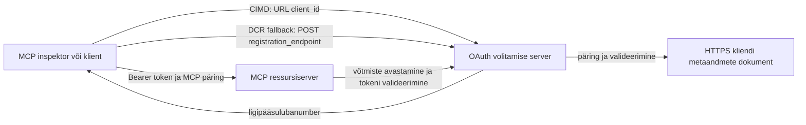

# CIMD ja DCR autoriseerimise näidis

See TypeScript näidis võrdleb kahte viisi, kuidas OAuth klient võib identiteedi hankida
enne kaitstud MCP serverile juurdepääsu:

- **Kliendi ID metadokumendid (CIMD)** kasutavad stabiilset HTTPS URL-i
  `client_id` väärtusena. See on eelistatud mehhanism klientidele ja autoriseerimisteenustele,
  kellel puudub eelnev suhe.
- **Dünaamiline kliendi registreerimine (DCR)** palub autoriseerimisteenusel
  jooksvalt luua läbipaistmatu kliendi ID. MCP `2026-07-28` säilitab DCR ainult tagurpidi
  ühilduvuse huvides.

Näidis kasutab stabiilset MCP TypeScript SDK v2 ja staatusevaba
MCP `2026-07-28` päringumudelit. See toimib välise OAuth 2.1/OpenID
Connect autoriseerimisteenusega nagu Auth0. MCP server on ressursiserver:
see valideerib juurdepääsutokeneid, kuid ei autentiseeri kasutajaid ega vali
tokeneid välja.

## Õpieesmärgid

Selle näidise lõpetamisega saad osata:

- Selgitada, miks CIMD on eelistatud uute MCP klientide puhul DCR üle.
- Avaldada kehtiv CIMD dokument avaliku natiivse kliendi jaoks.
- Konfigureerida MCP ressursiserver OAuth avastamiseks ja JWT valideerimiseks.
- Kasutada CIMD ja DCR sama MCP serveri ja autoriseerimisteenuse juures.
- Rakendada OAuth skoop MCP tööriista sees.
- Tuua välja, millised vastutused kuuluvad kliendile, ressursiserverile ja
  autoriseerimisteenusele.

## Arhitektuur



Autoriseerimisteenus valib ja valideerib registreerimismehhanismi.
MCP server näeb ainult kontrollitud `client_id` tunnistust. HTTPS URL koos
teega identifitseerib CIMD. Läbipaistev ID ei ole piisav DCR tõendamiseks, sest
eelregistreeritud klient võib samuti kasutada läbipaistmatut ID-d; vabatahtlik
`DCR_CLIENT_ID_PREFIX` seade annab pakkuja-spetsiifilise demo vihje.

## Registreerimise prioriteet

MCP kliendid, mis toetavad kõiki mehhanisme, peaksid kasutama järgmises järjekorras:

1. Kasutada eelregistreeritud kliendiandmeid, kui need on juba olemas.
2. Kasutada CIMD, kui autoriseerimisteenus reklaamib
   `client_id_metadata_document_supported: true`.
3. Kasutada DCR ainult tagavarana, kui server avaldab
   `registration_endpoint`.
4. Küsida kasutajalt eelregistreeritud kliendiinfo, kui eelnevad pole
   saadaval.

## Projekti paigutus

```text
src/
  config.ts          Environment validation
  dcr.ts             DCR compatibility request
  mcp.ts             MCP tools and scope checks
  oauth.ts           Authorization metadata and JWT verification
  register-dcr.ts    DCR command-line helper
  registration.ts    CIMD document and mechanism classification
  server.ts          Express, OAuth discovery, and MCP endpoint
test/
  dcr.test.ts
  oauth.test.ts
  registration.test.ts
  server.test.ts
```

## Eeltingimused

- Node.js versioon 20.6 või uuem. Skriptid kasutavad `--env-file` ja `--import`.
- OAuth 2.1/OpenID Connect autoriseerimisteenus, mis toetab:
  - Autoriseerimiskoodi voogu koos S256 PKCE-ga.
  - OAuth kaitstud ressursi metadokumenti ja ressursinäitajaid.
  - JWT juurdepääsutokeneid ja JWKS lõpp-punkti.
  - CIMD, ning lisaks DCR, kui soovid võrdlust vana tagavara jaoks.
- MCP Inspector või mõni teine MCP `2026-07-28` klient.
- Avalik HTTPS URL CIMD dokumendi jaoks. Arendustunneli kasutamine on sobiv
  laboris; tootmiskeskkonnas kasuta stabiilset domeeni.

## Paigalda ja testi

```bash
npm install
npm run build
npm test
```

Kaksteist testi kasutavad kohalikku võtit ja vale HTTP lõpp-punkte. Need ei nõua
autoriseerimisteenuse kontot. Nad kontrollivad:

- CIMD dokumendi kuju ja URL piiranguid.
- Ausat kliendi ID-de ja läbipaistmatute ID-de klassifikatsiooni.
- DCR päringu- ja vastuse käsitlemist.
- Ebaturvaliste mitte-loopback DCR lõpp-punktide tagasilükkamist.
- JWT allkirja, väljaandja, sihtrühma, aegumise, kliendi ID ja skoopi valideerimist.
- MCP `2026-07-28` protsessisisest kõnet `registration-info`.

## Konfigureeri autoriseerimisteenus

Kontrolleenimused varieeruvad pakkujate lõikes. Konfigureeri need võimed:

1. Loo API või ressursiserver, mille identifikaator on täpselt sama mis su MCP URL,
   sealhulgas `/mcp`, näiteks `http://127.0.0.1:3001/mcp`.
2. Kasuta RS256 juurdepääsutokeneid ja lisa `client_id` või `azp` tunnistus.
3. Lisa luba või skoop `tool:greet`.
4. Luba avalikele natiivsetele klientidele autoriseerimiskoodi voog koos S256 PKCE-ga.
5. Luba Kliendi ID metadokumentide kasutamine.
6. Võrdluseks ainult, luba Dünaamiline kliendi registreerimine.
7. Veendu, et autoriseerimisteenuse metaandmed reklaamiksid:
   - `issuer`
   - `authorization_endpoint`
   - `token_endpoint`
   - `jwks_uri`
   - `client_id_metadata_document_supported: true`
   - `registration_endpoint` kui DCR on lubatud

### Auth0 näide

Auth0 puhul luba Kliendi ID metadokumendi registreerimine, OIDC dünaamiline
rakenduse registreerimine ja Ressursiparameetri ühilduvus. Loo API,
mille identifikaator on täpselt MCP URL ja lisa luba `tool:greet`.
Luba testkasutajal ja kolmandate osapoolte klientidel see luba taotleda.

Pakkujate armatuurlauad ja funktsioonide kättesaadavus muutuvad ajas. Kontrolli
pakkuja dokumentatsiooni enne nende seadete kasutamist väljaspool seda õpituba.

## Konfigureeri näidisprogramm

Loo `.env` näidise põhjal:

```powershell
Copy-Item .env.example .env
```

Bash-sarnastes kestades:

```bash
cp .env.example .env
```

Sea järgmised väärtused:

```dotenv
MCP_SERVER_URL=http://127.0.0.1:3001/mcp
AUTHORIZATION_SERVER_ISSUER=https://your-tenant.example.com/
AUTHORIZATION_SERVER_METADATA_URL=https://your-tenant.example.com/.well-known/openid-configuration
CLIENT_METADATA_URL=https://your-public-host.example.com/client-metadata.json
OAUTH_REDIRECT_URIS=http://127.0.0.1:6274/oauth/callback
DCR_CLIENT_ID_PREFIX=tpc_
```

Olulised üksikasjad:

- `AUTHORIZATION_SERVER_ISSUER` peab täpselt vastama autoriseerimisteenuse
  metaandmetes leitud `issuer` väärtusele, sealhulgas lõpp-kaldkriipsuga.
- `MCP_SERVER_URL` peab vastama juurdepääsutokeni sihtrühmale.
- `CLIENT_METADATA_URL` peab kasutama HTTPS-i, sisaldama mittejuurtasandit ja olema
  avalik URL, mis serveerib metadokumendi marsruuti. Päringustringid ja lõigud
  lükatakse tagasi, et marsruut ja `client_id` jääksid identsed.
- `OAUTH_REDIRECT_URIS` on komaga eraldatud lubatud loend. Vaikeväärtus on MCP
  Inspectori loopback tagasikõne.
- `DCR_CLIENT_ID_PREFIX` on valikuline ja pakkujaspetsiifiline. Jäta see tühjaks, kui
  sinu pakkujal pole usaldusväärset DCR prefiksit.

## Avalda CIMD dokument

Käivita tunnel, mis suunab oma avaliku HTTPS alguse aadressile `127.0.0.1:3001`.
Sea `CLIENT_METADATA_URL` sellele algusele pluss `/client-metadata.json`, seejärel käivita:

```bash
npm run build
npm start
```

Kontrolli mõlemaid avastamise dokumente:

```bash
curl http://127.0.0.1:3001/health
curl http://127.0.0.1:3001/client-metadata.json
curl http://127.0.0.1:3001/.well-known/oauth-protected-resource/mcp
```

Avalikust HTTPS metadokumendi URL-ist tagastatud `client_id` peab olema baitidena identselt
vaste selle URL-iga. Autoriseerimisteenus peab dokumendi ja selle suunamise URL-i valideerima
enne tokeni väljastamist.

> [!NOTE]
> Näidis majutab kliendi dokumendi ja MCP ressursiserveri ühes protsessis,
> et õpituba oleks kompaktne. Tootmises omab ja majutab MCP klient oma CIMD
> dokumenti iseseisvalt ressursiserverist.

## Võrdle CIMD ja DCR

Käivita MCP Inspector:

```bash
npx @modelcontextprotocol/inspector
```

Kasuta Streamable HTTP protokolli ja ühenda `http://127.0.0.1:3001/mcp`.

### CIMD (Eelistatud)

1. Sisesta avalik `CLIENT_METADATA_URL` OAuth kliendi ID-na.
2. Taotle `tool:greet` lubasid ja kõiki pakkuja nõutud identiteedi skoope.
3. Lõpeta sisselogimine ja nõusoleku andmine.
4. Kutsu `registration-info`. See tagastab `mechanism: "cimd"`.
5. Kutsu `greet`, et kontrollida skoopi rakendamist.

### DCR (Ühilduvuse tagavara)

1. Kustuta Inspectori salvestatud OAuth olek.
2. Jäta OAuth kliendi ID tühjaks, et Inspector saaks kasutada reklaamitud
   `registration_endpoint`-i.
3. Lõpeta sisselogimine ja nõusolek.
4. Kutsu `registration-info`.
5. Kui `DCR_CLIENT_ID_PREFIX` vastab pakkuja loodud ID-dele, teatab tööriist
   `mechanism: "dcr"`; vastasel juhul teatab õigesti
   `opaque-client-id`.

Võid ka otse demonstreerida registreerimispäringut:

```bash
npm run build
npm run register:dcr
```

Abiline prindib tagastatud kliendi ID, kuid ei väljasta kunagi kliendi saladust.
Kohtle kõiki tagastatud saladusi tundlikult ja säilita neid adekvaatses salvestusruumis.

## Tööriistad

| Tööriist | Nõutav skoop | Eesmärk |
| --- | --- | --- |
| `registration-info` | Kinnitatud klient | Teatab kliendi ID tüübi |
| `greet` | `tool:greet` | Demonstreerib tööriista-põhist autoriseerimist |

## Turvanõuanded

- Valideeri JWT allkirju läbi autoriseerimisteenuse JWKS lõpp-punkti.
- Nõua täpset väljaandja ja sihtgrupi vastavust.
- Nõua aegumise ja kliendi ID tunnistusi.
- Ära kunagi aktsepteeri tokenit, mis on väljastatud teisele ressursile.
- Ära kunagi edasta MCP tokenit allavoolevale API-le.
- Hoia DCR mandaadid seotud väljaandjaga, kes need lõi.
- Valideeri CIMD suunamised täpselt vastavalt täpsusele.
- Rakenda SSRF kontrollid, kui autoriseerimisteenus laeb CIMD URL-e.
- Kasuta HTTPS-i autoriseerimise ja metaandmete lõpp-punktide puhul väljaspool
  loopback arengut.
- Ära järeldage DCR-t läbipaistmatust kliendi ID-st, kui pakkuja ei dokumenteeri
  usaldusväärset identifikaatori käitumist.

## Viited

- [MCP autoriseerimise spetsifikatsioon](https://modelcontextprotocol.io/specification/2026-07-28/basic/authorization)
- [MCP kliendi registreerimine](https://modelcontextprotocol.io/specification/2026-07-28/basic/authorization/client-registration)
- [MCP turbe parimad praktikad](https://modelcontextprotocol.io/specification/2026-07-28/basic/security_best_practices)
- [MCP TypeScript SDK v2 autoriseerimisjuhend](https://ts.sdk.modelcontextprotocol.io/v2/serving/authorization)
- [OAuth dünaamiline kliendi registreerimine (RFC 7591)](https://datatracker.ietf.org/doc/html/rfc7591)
- [OAuth Kliendi ID metadokumendi arendusdokument](https://datatracker.ietf.org/doc/html/draft-ietf-oauth-client-id-metadata-document-00)

## Tänuavaldus

Kõrvuti õpetamise lähenemist inspireeris
[Sambego/auth0-xmcp-cimd](https://github.com/Sambego/auth0-xmcp-cimd). See
näidis on originaalne, pakkujast sõltumatu teostus, mis on ehitatud ametliku
MCP TypeScript SDK v2 abil selle õppekava jaoks.

---

<!-- CO-OP TRANSLATOR DISCLAIMER START -->
**Lahtiütlus**:
See dokument on tõlgitud kasutades AI tõlketeenust [Co-op Translator](https://github.com/Azure/co-op-translator). Kuigi me püüdleme täpsuse poole, palun pange tähele, et automatiseeritud tõlgetes võib esineda vigu või ebatäpsusi. Originaaldokument selle emakeeles tuleks pidada autoriteetseks allikaks. Olulise teabe puhul soovitatakse kasutada professionaalset inimtõlget. Me ei vastuta selle tõlkega seotud eksimustest või valesti mõistmistest.
<!-- CO-OP TRANSLATOR DISCLAIMER END -->