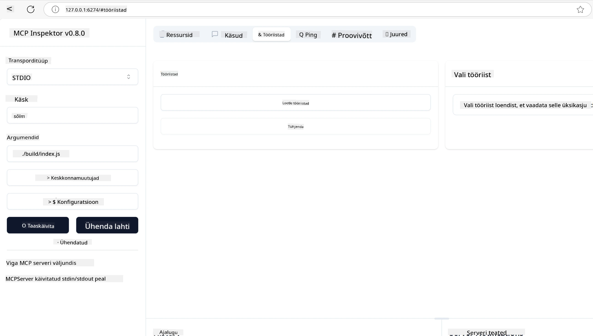
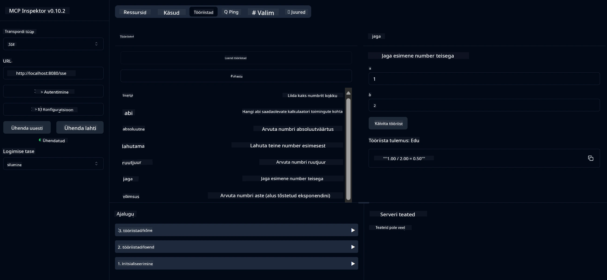
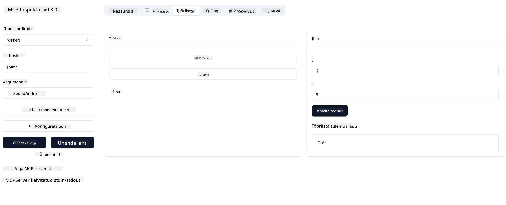

# MCP-ga alustamine

> [!NOTE]
> Selle õppetüki Java HTTP näide kasutab pärandatud HTTP+SSE transporti ja
> sihib MCP-ga ühilduvat SDK-d `2025-11-25`. Uute kaugserverite puhul kasutage
> `2026-07-28` Streamable HTTP transporti ja kontrollige tugi oma SDK-s.

Tere tulemast oma esimestesse sammudesse Model Context Protocoli (MCP) kasutamisel! Olenemata sellest, kas olete MCP-s uus või soovite oma teadmisi süvendada, juhendab see juhend teid olulise seadistuse ja arendusprotsessi kaudu. Avastate, kuidas MCP võimaldab sujuvat integreerimist AI mudelite ja rakenduste vahel ning õpite kiiresti valmis seadistama oma keskkonda MCP-põhiste lahenduste ehitamiseks ja testimiseks.

> TLDR; Kui ehitate AI-rakendusi, siis teate, et saate lisada tööriistu ja muid ressursse oma LLM-ile (suurkeele mudelile), et teha LLM rohkem teadlikuks. Kuid kui paigutate need tööriistad ja ressursid serverisse, saavad rakendus ja serveri võimalused olla kasutatavad iga kliendi poolt, kellel on või ei ole LLM-i.

## Ülevaade

See õppetükk annab praktilisi juhiseid MCP keskkondade seadistamiseks ja esimest MCP rakenduste ehitamiseks. Õpite, kuidas seadistada vajalikke tööriistu ja raamistikke, ehitada lihtsaid MCP servereid, luua hostrakendusi ja testida oma rakendusi.

Model Context Protocol (MCP) on avatud protokoll, mis standardiseerib, kuidas rakendused annavad LLM-idele konteksti. Mõelge MCP-le nagu AI rakenduste USB-C pordile – see pakub standardiseeritud viisi AI mudelite ühendamiseks erinevate andmeallikate ja tööriistadega.

## Õpieesmärgid

Selle õppetüki lõpuks suudate:

- Seadistada arenduskeskkonnad MCP jaoks C#, Java, Python, TypeScript ja Rust keeltes
- Ehita ja juuruta põhilised MCP serverid kohandatud funktsioonidega (ressursid, promptid ja tööriistad)
- Luua hostrakendused, mis ühenduvad MCP serveritega
- Testida ja siluda MCP rakendusi

## MCP keskkonna seadistamine

Enne MCP-ga töötamise alustamist on oluline ette valmistada oma arenduskeskkond ja mõista põhilist töövoogu. See jaotis juhendab teid algsete seadistusetappide kaudu, et MCP-ga sujuvalt alustada.

### Eeltingimused

Enne MCP arendusse sukeldumist veenduge, et teil oleks:

- **Arenduskeskkond**: valitud keeltele (C#, Java, Python, TypeScript või Rust)
- **IDE/Toimetaja**: Visual Studio, Visual Studio Code, IntelliJ, Eclipse, PyCharm või mõni kaasaegne koodiredaktor
- **Paketihaldurid**: NuGet, Maven/Gradle, pip, npm/yarn või Cargo
- **API võtmed**: mis tahes AI teenuste jaoks, mida plaanite oma hostrakendustes kasutada

## Põhiline MCP serveri struktuur

MCP server sisaldab tavaliselt:

- **Serveri konfiguratsioon**: port, autentimine ja muud seaded
- **Ressursid**: andmed ja kontekst, mida tehakse LLM-idele kättesaadavaks
- **Tööriistad**: funktsioonid, mida mudelid saavad kutsuda
- **Promptid**: tekstiloomise või struktuuri mallid

Siin on lihtsustatud näide TypeScriptis:

```typescript
import { McpServer, ResourceTemplate } from "@modelcontextprotocol/sdk/server/mcp.js";
import { StdioServerTransport } from "@modelcontextprotocol/sdk/server/stdio.js";
import { z } from "zod";

// Loo MCP server
const server = new McpServer({
  name: "Demo",
  version: "1.0.0"
});

// Lisa lisatööriist
server.tool("add",
  { a: z.number(), b: z.number() },
  async ({ a, b }) => ({
    content: [{ type: "text", text: String(a + b) }]
  })
);

// Lisa dünaamiline tervituse ressurss
server.resource(
  "file",
  // Parameeter 'list' kontrollib, kuidas ressurss saadavalolevaid faile loetleb. Selle väärtuse määramine undefined-iks keelab selle ressurssi puhul failide loetelu.
  new ResourceTemplate("file://{path}", { list: undefined }),
  async (uri, { path }) => ({
    contents: [{
      uri: uri.href,
      text: `File, ${path}!`
    }]
  })
);

// Lisa failiresurss, mis loeb faili sisu
server.resource(
  "file",
  new ResourceTemplate("file://{path}", { list: undefined }),
  async (uri, { path }) => {
    let text;
    try {
      text = await fs.readFile(path, "utf8");
    } catch (err) {
      text = `Error reading file: ${err.message}`;
    }
    return {
      contents: [{
        uri: uri.href,
        text
      }]
    };
  }
);

server.prompt(
  "review-code",
  { code: z.string() },
  ({ code }) => ({
    messages: [{
      role: "user",
      content: {
        type: "text",
        text: `Please review this code:\n\n${code}`
      }
    }]
  })
);

// Alusta sõnumite vastuvõtmist stdin-ist ja sõnumite saatmist stdout-i
const transport = new StdioServerTransport();
await server.connect(transport);
```

Eelnevas koodis me:

- Impordime vajalikud klassid MCP TypeScript SDK-st.
- Loome ja konfigureerime uue MCP serveri instantsi.
- Registreerime kohandatud tööriista (`calculator`) käsitlejafunktsiooniga.
- Käivitame serveri MCP päringute vastuvõtmiseks.

## Testimine ja silumine

Enne MCP serveri testimise alustamist on oluline mõista saadaval olevaid tööriistu ja parimaid lähenemisviise silumiseks. Tõhus testimine tagab, et teie server käitub ootuspäraselt ja aitab kiiresti tuvastada ning lahendada võimalikke probleeme. Järgmine jaotis kirjeldab soovitatud lähenemisi MCP rakenduse valideerimiseks.

MCP pakub tööriistu, mis aitavad teil servereid testida ja siluda:

- **Inspector tööriist**, selle graafilise kasutajaliidese abil saate ühendada serveriga ja testida tööriistu, promptide ja ressursse.
- **curl**, samuti saate serveriga ühenduda käsureatööriistaga nagu curl või teiste klientidega, mis suudavad luua ja käivitada HTTP käske.

### MCP Inspector kasutamine

[MCP Inspector](https://github.com/modelcontextprotocol/inspector) on visuaalne testimise tööriist, mis aitab teil:

1. **Avastada serveri võimalusi**: automaatselt tuvastada saadaolevad ressursid, tööriistad ja promptid
2. **Testida tööriista täitmist**: proovida erinevaid parameetreid ja näha vastuseid reaalajas
3. **Vaadata serveri metaandmeid**: uurida serveri infot, skeeme ja konfiguratsioone

```bash
# nt TypeScript, MCP Inspectori installimine ja käitamine
npx @modelcontextprotocol/inspector node build/index.js
```

Kui käivitate ülaltoodud käsud, avab MCP Inspector teie brauseris kohaliku veebiliidese. Te näete armatuurlaua vaadet, kus on registreeritud teie MCP serverid koos nende tööriistade, ressursside ja promptidega. Liides võimaldab interaktiivselt testida tööriistade kasutamist, uurida serveri metaandmeid ja jälgida vastuseid reaalajas, mis lihtsustab MCP serveri rakenduste valideerimist ja silumist.

Siin on ekraanipilt sellest, kuidas see võib välja näha:



## Levinud seadistamisprobleemid ja lahendused

| Probleem | Võimalik lahendus |
|-------|-------------------|
| Ühendus keelatud | Kontrollige, kas server töötab ja port on õige |
| Tööriista täitmise vead | Kontrollige parameetrite valideerimist ja veahaldust |
| Autentimise tõrked | Kinnitage API võtmed ja õigused |
| Skeemi valideerimise vead | Veenduge, et parameetrid vastavad määratletud skeemile |
| Server ei käivitu | Kontrollige pordikonflikte või puuduvad sõltuvused |
| CORS vead | Konfigureerige õiged CORS päised ristallikate päringuteks |
| Autentimise probleemid | Kontrollige tokeni kehtivust ja õiguseid |

## Kohalik arendus

Kohalikuks arenduseks ja testimiseks saate MCP servereid jooksutada otse oma masinas:

1. **Käivita serveri protsess**: Käivita oma MCP serveri rakendus
2. **Seadista võrk**: Veenduge, et serverile pääseb ligi oodataval pordil
3. **Ühenda kliendid**: Kasutage kohaliku ühenduse URL-e nagu `http://localhost:3000`

```bash
# Näide: TypeScript MCP serveri lokaalne käivitamine
npm run start
# Server töötab aadressil http://localhost:3000
```

## Oma esimese MCP serveri ehitamine

Oleme eelnevas õppetükis käsitlenud [Põhimõisteid](../../01-CoreConcepts/README.md), nüüd on aeg seda teadmist rakendada.

### Mida server suudab teha

Enne koodi kirjutamist tuletame meelde, mida server suudab teha:

MCP server võib näiteks:

- Ligipääs kohalikele failidele ja andmebaasidele
- Ühendus kaug-API-dega
- Teha arvutusi
- Integreeruda teiste tööriistade ja teenustega
- Pakkuda kasutajaliidest suhtlemiseks

Suurepärane, nüüd kui teame, mida me teha saame, alustame koodi kirjutamist.

## Harjutus: serveri loomine

Serveri loomiseks peate järgima neid samme:

- Paigaldama MCP SDK.
- Loome projekti ja seadistama projekti struktuuri.
- Kirjutama serveri koodi.
- Testima serverit.

### -1- Projekti loomine

#### TypeScript

```sh
# Loo projekti kataloog ja algata npm projekt
mkdir calculator-server
cd calculator-server
npm init -y
```

#### Python

```sh
# Loo projekti kaust
mkdir calculator-server
cd calculator-server
# Ava kaust Visual Studio Code'is - Jäta see vahele, kui kasutad mõnda teist IDE-d
code .
```

#### .NET

```sh
dotnet new console -n McpCalculatorServer
cd McpCalculatorServer
```

#### Java

Java jaoks loo Spring Boot projekt:

```bash
curl https://start.spring.io/starter.zip \
  -d dependencies=web \
  -d javaVersion=21 \
  -d type=maven-project \
  -d groupId=com.example \
  -d artifactId=calculator-server \
  -d name=McpServer \
  -d packageName=com.microsoft.mcp.sample.server \
  -o calculator-server.zip
```

Paki lahti zip-fail:

```bash
unzip calculator-server.zip -d calculator-server
cd calculator-server
# valikuline eemaldada kasutamata test
rm -rf src/test/java
```

Lisa järgmine täielik konfiguratsioon oma *pom.xml* faili:

```xml
<?xml version="1.0" encoding="UTF-8"?>
<project xmlns="http://maven.apache.org/POM/4.0.0"
    xmlns:xsi="http://www.w3.org/2001/XMLSchema-instance"
    xsi:schemaLocation="http://maven.apache.org/POM/4.0.0 http://maven.apache.org/xsd/maven-4.0.0.xsd">
    <modelVersion>4.0.0</modelVersion>
    
    <!-- Spring Boot parent for dependency management -->
    <parent>
        <groupId>org.springframework.boot</groupId>
        <artifactId>spring-boot-starter-parent</artifactId>
        <version>3.5.0</version>
        <relativePath />
    </parent>

    <!-- Project coordinates -->
    <groupId>com.example</groupId>
    <artifactId>calculator-server</artifactId>
    <version>0.0.1-SNAPSHOT</version>
    <name>Calculator Server</name>
    <description>Basic calculator MCP service for beginners</description>

    <!-- Properties -->
    <properties>
        <java.version>21</java.version>
        <maven.compiler.source>21</maven.compiler.source>
        <maven.compiler.target>21</maven.compiler.target>
    </properties>

    <!-- Spring AI BOM for version management -->
    <dependencyManagement>
        <dependencies>
            <dependency>
                <groupId>org.springframework.ai</groupId>
                <artifactId>spring-ai-bom</artifactId>
                <version>1.0.0-SNAPSHOT</version>
                <type>pom</type>
                <scope>import</scope>
            </dependency>
        </dependencies>
    </dependencyManagement>

    <!-- Dependencies -->
    <dependencies>
        <dependency>
            <groupId>org.springframework.ai</groupId>
            <artifactId>spring-ai-starter-mcp-server-webflux</artifactId>
        </dependency>
        <dependency>
            <groupId>org.springframework.boot</groupId>
            <artifactId>spring-boot-starter-actuator</artifactId>
        </dependency>
        <dependency>
         <groupId>org.springframework.boot</groupId>
         <artifactId>spring-boot-starter-test</artifactId>
         <scope>test</scope>
      </dependency>
    </dependencies>

    <!-- Build configuration -->
    <build>
        <plugins>
            <plugin>
                <groupId>org.springframework.boot</groupId>
                <artifactId>spring-boot-maven-plugin</artifactId>
            </plugin>
            <plugin>
                <groupId>org.apache.maven.plugins</groupId>
                <artifactId>maven-compiler-plugin</artifactId>
                <configuration>
                    <release>21</release>
                </configuration>
            </plugin>
        </plugins>
    </build>

    <!-- Repositories for Spring AI snapshots -->
    <repositories>
        <repository>
            <id>spring-milestones</id>
            <name>Spring Milestones</name>
            <url>https://repo.spring.io/milestone</url>
            <snapshots>
                <enabled>false</enabled>
            </snapshots>
        </repository>
        <repository>
            <id>spring-snapshots</id>
            <name>Spring Snapshots</name>
            <url>https://repo.spring.io/snapshot</url>
            <releases>
                <enabled>false</enabled>
            </releases>
        </repository>
    </repositories>
</project>
```

#### Rust

```sh
mkdir calculator-server
cd calculator-server
cargo init
```

### -2- Sõltuvuste lisamine

Nüüd, kui sul on projekt loodud, lisame järgmise sammuna sõltuvused:

#### TypeScript

```sh
# Kui pole veel installitud, paigalda TypeScript globaalsetena
npm install typescript -g

# Paigalda MCP SDK ja Zod skeemi valideerimiseks
npm install @modelcontextprotocol/sdk zod
npm install -D @types/node typescript
```

#### Python

```sh
# Loo virtuaalne keskkond ja paigalda sõltuvused
python -m venv venv
venv\Scripts\activate
pip install "mcp[cli]"
```

#### Java

```bash
cd calculator-server
./mvnw clean install -DskipTests
```

#### Rust

```sh
cargo add rmcp --features server,transport-io
cargo add serde
cargo add tokio --features rt-multi-thread
```

### -3- Projekti failide loomine

#### TypeScript

Ava *package.json* fail ja asenda selle sisu alljärgnevaga, et kindlustada serveri ehitus ja käivitamine:

```json
{
  "name": "calculator-server",
  "version": "1.0.0",
  "main": "index.js",
  "type": "module",
  "scripts": {
    "build": "tsc",
    "start": "npm run build && node ./build/index.js",
  },
  "keywords": [],
  "author": "",
  "license": "ISC",
  "description": "A simple calculator server using Model Context Protocol",
  "dependencies": {
    "@modelcontextprotocol/sdk": "^1.16.0",
    "zod": "^3.25.76"
  },
  "devDependencies": {
    "@types/node": "^24.0.14",
    "typescript": "^5.8.3"
  }
}
```

Loo fail *tsconfig.json* järgmise sisuga:

```json
{
  "compilerOptions": {
    "target": "ES2022",
    "module": "Node16",
    "moduleResolution": "Node16",
    "outDir": "./build",
    "rootDir": "./src",
    "strict": true,
    "esModuleInterop": true,
    "skipLibCheck": true,
    "forceConsistentCasingInFileNames": true
  },
  "include": ["src/**/*"],
  "exclude": ["node_modules"]
}
```

Loo kataloog oma lähtekoodile:

```sh
mkdir src
touch src/index.ts
```

#### Python

Loo fail *server.py*

```sh
touch server.py
```

#### .NET

Paigalda vajalikud NuGet paketid:

```sh
dotnet add package ModelContextProtocol --prerelease
dotnet add package Microsoft.Extensions.Hosting
```

#### Java

Java Spring Boot projektide jaoks luuakse projektistruktuur automaatselt.

#### Rust

Rustil luuakse *src/main.rs* fail vaikimisi kui käivitad `cargo init`. Ava see fail ja kustuta vaikimisi kood.

### -4- Serveri koodi loomine

#### TypeScript

Loo fail *index.ts* ja lisa järgmine kood:

```typescript
import { McpServer, ResourceTemplate } from "@modelcontextprotocol/sdk/server/mcp.js";
import { StdioServerTransport } from "@modelcontextprotocol/sdk/server/stdio.js";
import { z } from "zod";
 
// Loo MCP server
const server = new McpServer({
  name: "Calculator MCP Server",
  version: "1.0.0"
});
```

Nüüd on sul server olemas, kuid see ei tee palju, parandame selle.

#### Python

```python
# server.py
from mcp.server.fastmcp import FastMCP

# Loo MCP server
mcp = FastMCP("Demo")
```

#### .NET

```csharp
using Microsoft.Extensions.DependencyInjection;
using Microsoft.Extensions.Hosting;
using Microsoft.Extensions.Logging;
using ModelContextProtocol.Server;
using System.ComponentModel;

var builder = Host.CreateApplicationBuilder(args);
builder.Logging.AddConsole(consoleLogOptions =>
{
    // Configure all logs to go to stderr
    consoleLogOptions.LogToStandardErrorThreshold = LogLevel.Trace;
});

builder.Services
    .AddMcpServer()
    .WithStdioServerTransport()
    .WithToolsFromAssembly();
await builder.Build().RunAsync();

// add features
```

#### Java

Java jaoks loo põhiserveri komponendid. Esmalt muuda põhirakenduse klassi:

*src/main/java/com/microsoft/mcp/sample/server/McpServerApplication.java*:

```java
package com.microsoft.mcp.sample.server;

import org.springframework.ai.tool.ToolCallbackProvider;
import org.springframework.ai.tool.method.MethodToolCallbackProvider;
import org.springframework.boot.SpringApplication;
import org.springframework.boot.autoconfigure.SpringBootApplication;
import org.springframework.context.annotation.Bean;
import com.microsoft.mcp.sample.server.service.CalculatorService;

@SpringBootApplication
public class McpServerApplication {

    public static void main(String[] args) {
        SpringApplication.run(McpServerApplication.class, args);
    }
    
    @Bean
    public ToolCallbackProvider calculatorTools(CalculatorService calculator) {
        return MethodToolCallbackProvider.builder().toolObjects(calculator).build();
    }
}
```

Loo kalkulaatori teenus *src/main/java/com/microsoft/mcp/sample/server/service/CalculatorService.java*:

```java
package com.microsoft.mcp.sample.server.service;

import org.springframework.ai.tool.annotation.Tool;
import org.springframework.stereotype.Service;

/**
 * Service for basic calculator operations.
 * This service provides simple calculator functionality through MCP.
 */
@Service
public class CalculatorService {

    /**
     * Add two numbers
     * @param a The first number
     * @param b The second number
     * @return The sum of the two numbers
     */
    @Tool(description = "Add two numbers together")
    public String add(double a, double b) {
        double result = a + b;
        return formatResult(a, "+", b, result);
    }

    /**
     * Subtract one number from another
     * @param a The number to subtract from
     * @param b The number to subtract
     * @return The result of the subtraction
     */
    @Tool(description = "Subtract the second number from the first number")
    public String subtract(double a, double b) {
        double result = a - b;
        return formatResult(a, "-", b, result);
    }

    /**
     * Multiply two numbers
     * @param a The first number
     * @param b The second number
     * @return The product of the two numbers
     */
    @Tool(description = "Multiply two numbers together")
    public String multiply(double a, double b) {
        double result = a * b;
        return formatResult(a, "*", b, result);
    }

    /**
     * Divide one number by another
     * @param a The numerator
     * @param b The denominator
     * @return The result of the division
     */
    @Tool(description = "Divide the first number by the second number")
    public String divide(double a, double b) {
        if (b == 0) {
            return "Error: Cannot divide by zero";
        }
        double result = a / b;
        return formatResult(a, "/", b, result);
    }

    /**
     * Calculate the power of a number
     * @param base The base number
     * @param exponent The exponent
     * @return The result of raising the base to the exponent
     */
    @Tool(description = "Calculate the power of a number (base raised to an exponent)")
    public String power(double base, double exponent) {
        double result = Math.pow(base, exponent);
        return formatResult(base, "^", exponent, result);
    }

    /**
     * Calculate the square root of a number
     * @param number The number to find the square root of
     * @return The square root of the number
     */
    @Tool(description = "Calculate the square root of a number")
    public String squareRoot(double number) {
        if (number < 0) {
            return "Error: Cannot calculate square root of a negative number";
        }
        double result = Math.sqrt(number);
        return String.format("√%.2f = %.2f", number, result);
    }

    /**
     * Calculate the modulus (remainder) of division
     * @param a The dividend
     * @param b The divisor
     * @return The remainder of the division
     */
    @Tool(description = "Calculate the remainder when one number is divided by another")
    public String modulus(double a, double b) {
        if (b == 0) {
            return "Error: Cannot divide by zero";
        }
        double result = a % b;
        return formatResult(a, "%", b, result);
    }

    /**
     * Calculate the absolute value of a number
     * @param number The number to find the absolute value of
     * @return The absolute value of the number
     */
    @Tool(description = "Calculate the absolute value of a number")
    public String absolute(double number) {
        double result = Math.abs(number);
        return String.format("|%.2f| = %.2f", number, result);
    }

    /**
     * Get help about available calculator operations
     * @return Information about available operations
     */
    @Tool(description = "Get help about available calculator operations")
    public String help() {
        return "Basic Calculator MCP Service\n\n" +
               "Available operations:\n" +
               "1. add(a, b) - Adds two numbers\n" +
               "2. subtract(a, b) - Subtracts the second number from the first\n" +
               "3. multiply(a, b) - Multiplies two numbers\n" +
               "4. divide(a, b) - Divides the first number by the second\n" +
               "5. power(base, exponent) - Raises a number to a power\n" +
               "6. squareRoot(number) - Calculates the square root\n" + 
               "7. modulus(a, b) - Calculates the remainder of division\n" +
               "8. absolute(number) - Calculates the absolute value\n\n" +
               "Example usage: add(5, 3) will return 5 + 3 = 8";
    }

    /**
     * Format the result of a calculation
     */
    private String formatResult(double a, String operator, double b, double result) {
        return String.format("%.2f %s %.2f = %.2f", a, operator, b, result);
    }
}
```

**Vabatahtlikud komponendid tootmisvalmis teenusele:**

Loo käivitamiskonfiguratsioon *src/main/java/com/microsoft/mcp/sample/server/config/StartupConfig.java*:

```java
package com.microsoft.mcp.sample.server.config;

import org.springframework.boot.CommandLineRunner;
import org.springframework.context.annotation.Bean;
import org.springframework.context.annotation.Configuration;

@Configuration
public class StartupConfig {
    
    @Bean
    public CommandLineRunner startupInfo() {
        return args -> {
            System.out.println("\n" + "=".repeat(60));
            System.out.println("Calculator MCP Server is starting...");
            System.out.println("SSE endpoint: http://localhost:8080/sse");
            System.out.println("Health check: http://localhost:8080/actuator/health");
            System.out.println("=".repeat(60) + "\n");
        };
    }
}
```

Loo terviseturvajaga *src/main/java/com/microsoft/mcp/sample/server/controller/HealthController.java*:

```java
package com.microsoft.mcp.sample.server.controller;

import org.springframework.http.ResponseEntity;
import org.springframework.web.bind.annotation.GetMapping;
import org.springframework.web.bind.annotation.RestController;
import java.time.LocalDateTime;
import java.util.HashMap;
import java.util.Map;

@RestController
public class HealthController {
    
    @GetMapping("/health")
    public ResponseEntity<Map<String, Object>> healthCheck() {
        Map<String, Object> response = new HashMap<>();
        response.put("status", "UP");
        response.put("timestamp", LocalDateTime.now().toString());
        response.put("service", "Calculator MCP Server");
        return ResponseEntity.ok(response);
    }
}
```

Loo erandite käsitleja *src/main/java/com/microsoft/mcp/sample/server/exception/GlobalExceptionHandler.java*:

```java
package com.microsoft.mcp.sample.server.exception;

import org.springframework.http.HttpStatus;
import org.springframework.http.ResponseEntity;
import org.springframework.web.bind.annotation.ExceptionHandler;
import org.springframework.web.bind.annotation.RestControllerAdvice;

@RestControllerAdvice
public class GlobalExceptionHandler {

    @ExceptionHandler(IllegalArgumentException.class)
    public ResponseEntity<ErrorResponse> handleIllegalArgumentException(IllegalArgumentException ex) {
        ErrorResponse error = new ErrorResponse(
            "Invalid_Input", 
            "Invalid input parameter: " + ex.getMessage());
        return new ResponseEntity<>(error, HttpStatus.BAD_REQUEST);
    }

    public static class ErrorResponse {
        private String code;
        private String message;

        public ErrorResponse(String code, String message) {
            this.code = code;
            this.message = message;
        }

        // Getid
        public String getCode() { return code; }
        public String getMessage() { return message; }
    }
}
```

Loo kohandatud bänner *src/main/resources/banner.txt*:

```text
_____      _            _       _             
 / ____|    | |          | |     | |            
| |     __ _| | ___ _   _| | __ _| |_ ___  _ __ 
| |    / _` | |/ __| | | | |/ _` | __/ _ \| '__|
| |___| (_| | | (__| |_| | | (_| | || (_) | |   
 \_____\__,_|_|\___|\__,_|_|\__,_|\__\___/|_|   
                                                
Calculator MCP Server v1.0
Spring Boot MCP Application
```

</details>

#### Rust

Lisa järgmine kood *src/main.rs* faili algusesse. See impordib vajalikud teegid ja moodulid sinu MCP serveri jaoks.

```rust
use rmcp::{
    handler::server::{router::tool::ToolRouter, tool::Parameters},
    model::{ServerCapabilities, ServerInfo},
    schemars, tool, tool_handler, tool_router,
    transport::stdio,
    ServerHandler, ServiceExt,
};
use std::error::Error;
```

Kalkulaatori server on lihtne, mis lisab kaks arvu kokku. Loo struktuur kalkulaatori päringu esitamiseks.

```rust
#[derive(Debug, serde::Deserialize, schemars::JsonSchema)]
pub struct CalculatorRequest {
    pub a: f64,
    pub b: f64,
}
```

Järgmisena loo struktuur kalkulaatori serveri esitamiseks. See struktuur hoiab tööriista marsruuterit, mida kasutatakse tööriistade registreerimiseks.

```rust
#[derive(Debug, Clone)]
pub struct Calculator {
    tool_router: ToolRouter<Self>,
}
```

Nüüd saame rakendada `Calculator` struktuuri, et luua uus serveri instants ja rakendada serveri käitlejat serveri info pakkumiseks.

```rust
#[tool_router]
impl Calculator {
    pub fn new() -> Self {
        Self {
            tool_router: Self::tool_router(),
        }
    }
}

#[tool_handler]
impl ServerHandler for Calculator {
    fn get_info(&self) -> ServerInfo {
        ServerInfo {
            instructions: Some("A simple calculator tool".into()),
            capabilities: ServerCapabilities::builder().enable_tools().build(),
            ..Default::default()
        }
    }
}
```

Lõpuks peame rakendama põhifunktsiooni serveri käivitamiseks. See funktsioon loob `Calculator` struktuuri instantsi ja teenindab seda standardse sisendi/väljundi kaudu.

```rust
#[tokio::main]
async fn main() -> Result<(), Box<dyn Error>> {
    let service = Calculator::new().serve(stdio()).await?;
    service.waiting().await?;
    Ok(())
}
```

Server on nüüd seadistatud pakkuma enda kohta põhiteavet. Järgmiseks lisame tööriista, mis teeb liitmise.

### -5- Tööriista ja ressursi lisamine

Lisa tööriist ja ressurss, lisades järgmise koodi:

#### TypeScript

```typescript
server.tool(
  "add",
  { a: z.number(), b: z.number() },
  async ({ a, b }) => ({
    content: [{ type: "text", text: String(a + b) }]
  })
);

server.resource(
  "greeting",
  new ResourceTemplate("greeting://{name}", { list: undefined }),
  async (uri, { name }) => ({
    contents: [{
      uri: uri.href,
      text: `Hello, ${name}!`
    }]
  })
);
```

Sinu tööriist võtab parameetrid `a` ja `b` ning käivitab funktsiooni, mis loob vastuse vormil:

```typescript
{
  contents: [{
    type: "text", content: "some content"
  }]
}
```

Sinu ressursile pääseb ligi stringi "greeting" kaudu, võtab parameetri `name` ja loob sarnase vastuse tööriistale:

```typescript
{
  uri: "<href>",
  text: "a text"
}
```

#### Python

```python
# Lisa liitmistööriist
@mcp.tool()
def add(a: int, b: int) -> int:
    """Add two numbers"""
    return a + b


# Lisa dünaamiline tervitusrakendus
@mcp.resource("greeting://{name}")
def get_greeting(name: str) -> str:
    """Get a personalized greeting"""
    return f"Hello, {name}!"
```

Ülaltoodud koodis me:

- Määratlesime tööriista `add`, mis võtab parameetrid `a` ja `b`, mõlemad täisarvud.
- Lõime ressursi nimega `greeting`, mis võtab parameetri `name`.

#### .NET

Lisa see oma Program.cs faili:

```csharp
[McpServerToolType]
public static class CalculatorTool
{
    [McpServerTool, Description("Adds two numbers")]
    public static string Add(int a, int b) => $"Sum {a + b}";
}
```

#### Java

Tööriistad on juba eelnevas sammus loodud.

#### Rust

Lisa uus tööriist `impl Calculator` plokki:

```rust
#[tool(description = "Adds a and b")]
async fn add(
    &self,
    Parameters(CalculatorRequest { a, b }): Parameters<CalculatorRequest>,
) -> String {
    (a + b).to_string()
}
```

### -6- Lõplik kood

Lisame viimase koodi, mida serveri käivitamiseks vaja on:

#### TypeScript

```typescript
// Alusta sõnumite vastuvõtmist stdin-lt ja sõnumite saatmist stdout-ile
const transport = new StdioServerTransport();
await server.connect(transport);
```

Siin on kogu kood:

```typescript
// index.ts
import { McpServer, ResourceTemplate } from "@modelcontextprotocol/sdk/server/mcp.js";
import { StdioServerTransport } from "@modelcontextprotocol/sdk/server/stdio.js";
import { z } from "zod";

// Loo MCP server
const server = new McpServer({
  name: "Calculator MCP Server",
  version: "1.0.0"
});

// Lisa liitmistetööriist
server.tool(
  "add",
  { a: z.number(), b: z.number() },
  async ({ a, b }) => ({
    content: [{ type: "text", text: String(a + b) }]
  })
);

// Lisa dünaamiline tervituse ressurss
server.resource(
  "greeting",
  new ResourceTemplate("greeting://{name}", { list: undefined }),
  async (uri, { name }) => ({
    contents: [{
      uri: uri.href,
      text: `Hello, ${name}!`
    }]
  })
);

// Alusta sõnumite vastuvõtmist stdinist ja sõnumite saatmist stdoutisse
const transport = new StdioServerTransport();
server.connect(transport);
```

#### Python

```python
# server.py
from mcp.server.fastmcp import FastMCP

# Loo MCP server
mcp = FastMCP("Demo")


# Lisa liitmiskomplekt
@mcp.tool()
def add(a: int, b: int) -> int:
    """Add two numbers"""
    return a + b


# Lisa dünaamiline tervitusressurss
@mcp.resource("greeting://{name}")
def get_greeting(name: str) -> str:
    """Get a personalized greeting"""
    return f"Hello, {name}!"

# Peamine täitmine - see on vajalik serveri käivitamiseks
if __name__ == "__main__":
    mcp.run()
```

#### .NET

Loo Program.cs fail järgmise sisuga:

```csharp
using Microsoft.Extensions.DependencyInjection;
using Microsoft.Extensions.Hosting;
using Microsoft.Extensions.Logging;
using ModelContextProtocol.Server;
using System.ComponentModel;

var builder = Host.CreateApplicationBuilder(args);
builder.Logging.AddConsole(consoleLogOptions =>
{
    // Configure all logs to go to stderr
    consoleLogOptions.LogToStandardErrorThreshold = LogLevel.Trace;
});

builder.Services
    .AddMcpServer()
    .WithStdioServerTransport()
    .WithToolsFromAssembly();
await builder.Build().RunAsync();

[McpServerToolType]
public static class CalculatorTool
{
    [McpServerTool, Description("Adds two numbers")]
    public static string Add(int a, int b) => $"Sum {a + b}";
}
```

#### Java

Sinu täielik põhirakenduse klass peaks välja nägema selline:

```java
// McpServerApplication.java
package com.microsoft.mcp.sample.server;

import org.springframework.ai.tool.ToolCallbackProvider;
import org.springframework.ai.tool.method.MethodToolCallbackProvider;
import org.springframework.boot.SpringApplication;
import org.springframework.boot.autoconfigure.SpringBootApplication;
import org.springframework.context.annotation.Bean;
import com.microsoft.mcp.sample.server.service.CalculatorService;

@SpringBootApplication
public class McpServerApplication {

    public static void main(String[] args) {
        SpringApplication.run(McpServerApplication.class, args);
    }
    
    @Bean
    public ToolCallbackProvider calculatorTools(CalculatorService calculator) {
        return MethodToolCallbackProvider.builder().toolObjects(calculator).build();
    }
}
```

#### Rust

Rust serveri lõplik kood peaks välja nägema selline:

```rust
use rmcp::{
    ServerHandler, ServiceExt,
    handler::server::{router::tool::ToolRouter, tool::Parameters},
    model::{ServerCapabilities, ServerInfo},
    schemars, tool, tool_handler, tool_router,
    transport::stdio,
};
use std::error::Error;

#[derive(Debug, serde::Deserialize, schemars::JsonSchema)]
pub struct CalculatorRequest {
    pub a: f64,
    pub b: f64,
}

#[derive(Debug, Clone)]
pub struct Calculator {
    tool_router: ToolRouter<Self>,
}

#[tool_router]
impl Calculator {
    pub fn new() -> Self {
        Self {
            tool_router: Self::tool_router(),
        }
    }
    
    #[tool(description = "Adds a and b")]
    async fn add(
        &self,
        Parameters(CalculatorRequest { a, b }): Parameters<CalculatorRequest>,
    ) -> String {
        (a + b).to_string()
    }
}

#[tool_handler]
impl ServerHandler for Calculator {
    fn get_info(&self) -> ServerInfo {
        ServerInfo {
            instructions: Some("A simple calculator tool".into()),
            capabilities: ServerCapabilities::builder().enable_tools().build(),
            ..Default::default()
        }
    }
}

#[tokio::main]
async fn main() -> Result<(), Box<dyn Error>> {
    let service = Calculator::new().serve(stdio()).await?;
    service.waiting().await?;
    Ok(())
}
```

### -7- Serveri testimine

Käivita server järgmise käsuga:

#### TypeScript

```sh
npm run build
```

#### Python

```sh
mcp run server.py
```

> MCP Inspector'i kasutamiseks kasuta `mcp dev server.py`, mis automaatselt käivitab Inspectori ja annab vajaliku proksiseansi tokeni. Kui kasutad `mcp run server.py`, pead Inspectori käsitsi käivitama ja ühenduse seadistama.

#### .NET

Veendu, et oled oma projekti kataloogis:

```sh
cd McpCalculatorServer
dotnet run
```

#### Java

```bash
./mvnw clean install -DskipTests
java -jar target/calculator-server-0.0.1-SNAPSHOT.jar
```

#### Rust

Käivita järgmised käsud, et vormindada ja käivitada server:

```sh
cargo fmt
cargo run
```

### -8- Käivita Inspectori abil

Inspector on suurepärane tööriist, mis käivitab su serveri ja võimaldab sellega suhelda, et testida selle töökorda. Alustame:

> [!NOTE]
> "käsu" väli võib välja näha erinev, kuna selles on käsk serveri käivitamiseks sinu spetsiifilise runtime'iga.

#### TypeScript

```sh
npx @modelcontextprotocol/inspector node build/index.js
```

või lisa see *package.json* faili selliselt: `"inspector": "npx @modelcontextprotocol/inspector node build/index.js"` ja seejärel käivita `npm run inspector`

#### Python

Python kasutab Node.js tööriista inspector. Seda saab käivitada nii:

```sh
mcp dev server.py
```


Kuid see ei rakenda kõiki tööriista saadaolevaid meetodeid, seega soovitatakse käivitada Node.js tööriista otse alljärgnevalt:

```sh
npx @modelcontextprotocol/inspector mcp run server.py
```

Kui kasutad tööriista või IDE-d, mis võimaldab seadistada skriptide käivitamiseks käske ja argumente, 
veendu, et `Command` väljale on seatud `python` ja `Arguments` väljal `server.py`. See tagab, et skript töötab korrektselt.

#### .NET

Veendu, et oled oma projekti kaustas:

```sh
cd McpCalculatorServer
npx @modelcontextprotocol/inspector dotnet run
```

#### Java

Veendu, et sinu kalkulaatori server töötab
Käivita seejärel inspector:

```cmd
npx @modelcontextprotocol/inspector
```

Inspektori veebiliideses:

1. Vali transporditüübiks "SSE"
2. Sea URL-iks: `http://localhost:8080/sse`
3. Klõpsa "Connect"



**Oled nüüd ühendatud serveriga**
**Java serveri testimise sektsioon on nüüd lõpetatud**

Järgmine sektsioon käsitleb suhtlemist serveriga.

Sa peaksid nägema järgmist kasutajaliidest:


1. Ühendu serveriga, valides nupu Connect
  Kui oled serveriga ühenduse loonud, peaksid nüüd nägema järgmist:

  

1. Vali "Tools" ja "listTools", peaksid nägema "Add" valikut, vali "Add" ja täida parameetrite väärtused.

  Peaksid nägema järgmist vastust, st. tulemust "add" tööriistast:

  

Palju õnne, oled edukalt loonud ja käivitanud oma esimese serveri!

#### Rust

Rust serveri käivitamiseks MCP Inspector CLI-ga kasuta järgmist käsku:

```sh
npx @modelcontextprotocol/inspector cargo run --cli --method tools/call --tool-name add --tool-arg a=1 b=2
```

### Ametlikud SDK-d

MCP pakub ametlikke SDK-sid mitmele keelele:

- [C# SDK](https://github.com/modelcontextprotocol/csharp-sdk) - Hooldatud koostöös Microsoftiga
- [Java SDK](https://github.com/modelcontextprotocol/java-sdk) - Hooldatud koostöös Spring AI-ga
- [TypeScript SDK](https://github.com/modelcontextprotocol/typescript-sdk) - Ametlik TypeScripti teostus
- [Python SDK](https://github.com/modelcontextprotocol/python-sdk) - Ametlik Python teostus
- [Kotlin SDK](https://github.com/modelcontextprotocol/kotlin-sdk) - Ametlik Kotlin teostus
- [Swift SDK](https://github.com/modelcontextprotocol/swift-sdk) - Hooldatud koostöös Loopwork AI-ga
- [Rust SDK](https://github.com/modelcontextprotocol/rust-sdk) - Ametlik Rust teostus

## Peamised järeldused

- MCP arenduskeskkonna seadistamine on lihtne tänu keelespetsiifilistele SDK-dele
- MCP serverite ülesehitamine tähendab tööriistade loomist ja registreerimist selgete skeemidega
- Testimine ja silumine on usaldusväärsete MCP teostuste jaoks hädavajalikud

## Näited

- [Java Calculator](../samples/java/calculator/README.md)
- [.NET Calculator](../../../../03-GettingStarted/samples/csharp)
- [JavaScript Calculator](../samples/javascript/README.md)
- [TypeScript Calculator](../samples/typescript/README.md)
- [Python Calculator](../../../../03-GettingStarted/samples/python)
- [Rust Calculator](../../../../03-GettingStarted/samples/rust)

## Ülesanne

Loo lihtne MCP server tööriistaga, mida ise valid:

1. Rakenda tööriist oma eelistatud keeles (.NET, Java, Python, TypeScript või Rust).
2. Määra sisendparameetrid ja tagastatavad väärtused.
3. Käivita inspector tööriist, et veenduda serveri korrektses tööes.
4. Testi rakendust erinevate sisenditega.

## Lahendus

[Lahendus](./solution/README.md)

## Täiendavad ressursid

- [Ehita agendid Model Context Protocoliga Azure’is](https://learn.microsoft.com/azure/developer/ai/intro-agents-mcp)
- [Kaug-MCP Azure Container Appsiga (Node.js/TypeScript/JavaScript)](https://learn.microsoft.com/samples/azure-samples/mcp-container-ts/mcp-container-ts/)
- [.NET OpenAI MCP Agent](https://learn.microsoft.com/samples/azure-samples/openai-mcp-agent-dotnet/openai-mcp-agent-dotnet/)

## Mis järgmiseks

Järgmine: [MCP klientidega alustamine](../02-client/README.md)

---

<!-- CO-OP TRANSLATOR DISCLAIMER START -->
**Lahtiütlus**:
See dokument on tõlgitud kasutades AI tõlketeenust [Co-op Translator](https://github.com/Azure/co-op-translator). Kuigi me püüdleme täpsuse poole, palun pange tähele, et automatiseeritud tõlgetes võib esineda vigu või ebatäpsusi. Originaaldokument selle emakeeles tuleks pidada autoriteetseks allikaks. Olulise teabe puhul soovitatakse kasutada professionaalset inimtõlget. Me ei vastuta selle tõlkega seotud eksimustest või valesti mõistmistest.
<!-- CO-OP TRANSLATOR DISCLAIMER END -->