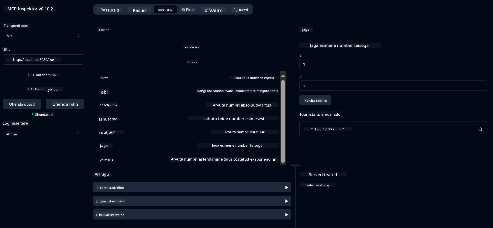

# Lihtne kalkulaator MCP teenus

> [!NOTE]
> See Java lahendus kasutab pärandatud HTTP+SSE transpordimeetodit ja sihib SDK-d,
> mis on MCP `2025-11-25` ühilduv. Seda hoitakse kursuse koodi vastavuseks;
> uued kaugserverid peaksid kasutama `2026-07-28` Streamable HTTP tuge.

See teenus pakub põhikalkulaatori toiminguid Model Context Protocoli (MCP) kaudu, kasutades Spring Booti koos WebFlux transpordiga. See on loodud lihtsaks näiteks algajatele, kes õpivad MCP rakendusi.

Lisateabe saamiseks vaadake [MCP Server Boot Starter](https://docs.spring.io/spring-ai/reference/api/mcp/mcp-server-boot-starter-docs.html) viitedokumentatsiooni.


## Teenuse kasutamine

Teenus pakub järgmisi API otspunktide kaudu MCP protokolli:

- `add(a, b)`: Liida kaks arvu
- `subtract(a, b)`: Lahuta teine arv esimesest
- `multiply(a, b)`: Korruta kaks arvu
- `divide(a, b)`: Jaga esimene arv teisega (nulli kontrolliga)
- `power(base, exponent)`: Arvuta arvu astendaja
- `squareRoot(number)`: Arvuta ruutjuur (negatiivsete arvude kontrolliga)
- `modulus(a, b)`: Arvuta jagamise jääk
- `absolute(number)`: Arvuta absoluutväärtus

## Sõltuvused

Projekt vajab järgmisi põhisisendeid:

```xml
<dependency>
    <groupId>org.springframework.ai</groupId>
    <artifactId>spring-ai-starter-mcp-server-webflux</artifactId>
</dependency>
```

## Projekti ehitamine

Ehita projekt Maveniga:
```bash
./mvnw clean install -DskipTests
```

## Serveri käivitamine

### Java kasutamine

```bash
java -jar target/calculator-server-0.0.1-SNAPSHOT.jar
```

### MCP Inspectori kasutamine

MCP Inspector on kasulik tööriist MCP teenustega suhtlemiseks. Selle kalkulaatori teenuse jaoks:

1. **Paigalda ja käivita MCP Inspector** uues terminaliaknas:
   ```bash
   npx @modelcontextprotocol/inspector
   ```

2. **Juurdepääs veebiliidesele** klõpsates rakenduse kuvamisel olevale URL-ile (tavaliselt http://localhost:6274)

3. **Sea ühendus**:
   - Sea transporditüübiks "SSE"
   - Määra URL jooksva serveri SSE otspunktile: `http://localhost:8080/sse`
   - Klõpsa "Connect"

4. **Kasuta tööriistu**:
   - Klõpsa "List Tools", et näha saadaolevaid kalkulaatori funktsioone
   - Vali tööriist ja klõpsa "Run Tool", et toimingut täita



---

<!-- CO-OP TRANSLATOR DISCLAIMER START -->
**Lahtiütlus**:
See dokument on tõlgitud kasutades AI tõlketeenust [Co-op Translator](https://github.com/Azure/co-op-translator). Kuigi me püüdleme täpsuse poole, palun pange tähele, et automatiseeritud tõlgetes võib esineda vigu või ebatäpsusi. Originaaldokument selle emakeeles tuleks pidada autoriteetseks allikaks. Olulise teabe puhul soovitatakse kasutada professionaalset inimtõlget. Me ei vastuta selle tõlkega seotud eksimustest või valesti mõistmistest.
<!-- CO-OP TRANSLATOR DISCLAIMER END -->