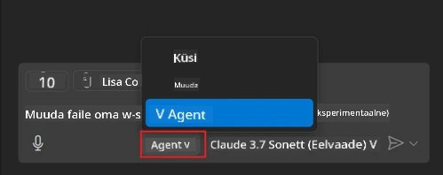
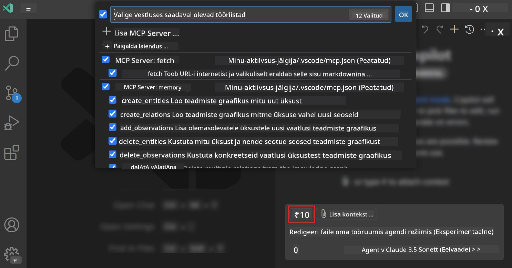
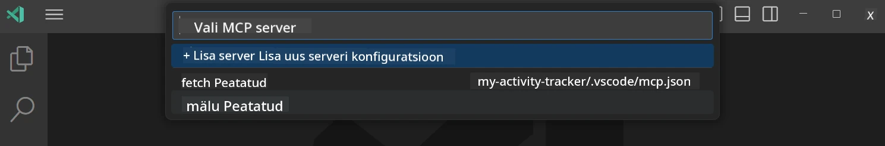
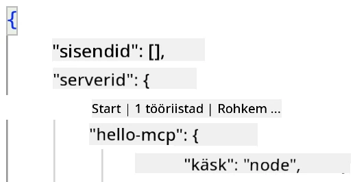
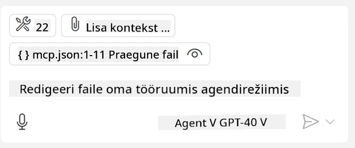
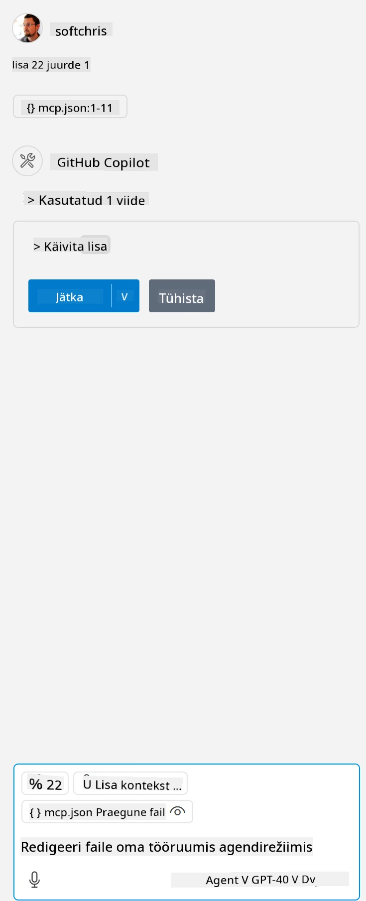

# Serveri kasutamine GitHub Copilot Agendi režiimist

Visual Studio Code ja GitHub Copilot võivad toimida kliendina ning tarbida MCP serverit. Miks me seda tahaksime? See tähendab, et kõiki MCP serveri funktsioone saab nüüd kasutada otse teie IDEst. Kujutage ette, et lisate näiteks GitHubi MCP serveri – see võimaldaks GitHubi juhtimist promptide abil ilma, et peaks terminalis konkreetseid käske tippima. Või kujutage ette üldiselt midagi, mis võiks teie arendajakogemust loomuliku keelega juhtides parandada. Nüüd hakkate võitu nägema, eks?

## Ülevaade

See õppetund käsitleb, kuidas kasutada Visual Studio Code'i ja GitHub Copiloti Agendi režiimi kliendina teie MCP serveri tarbimiseks.

## Õpieesmärgid

Selle õppetunni lõpuks oskate:

- Tarbida MCP serverit Visual Studio Code abil.
- Käivitada funktsioone nagu tööriistu GitHub Copiloti kaudu.
- Konfigureerida Visual Studio Code leidmaks ja haldamaks teie MCP serverit.

## Kasutamine

Saate oma MCP serverit kontrollida kahel viisil:

- Kasutajaliides, näete hiljem peatükis kuidas see täpselt toimub.
- Terminal, võimalik on kontrollida terminalist `code` käsutäitjaga:

  MCP serveri lisamiseks oma kasutajaprofiilile kasutage käsurea valikut --add-mcp ja esitage JSON serveri konfiguratsioon kujul {\"name\":\"server-name\",\"command\":...}.

  ```
  code --add-mcp "{\"name\":\"my-server\",\"command\": \"uvx\",\"args\": [\"mcp-server-fetch\"]}"
  ```

### Ekraanipildid





Räägime nüüd rohkem, kuidas me visuaalset liidest järgmistes peatükkides kasutame.

## Lähenemine

Siin on, kuidas me peame seda kõrgtasemel käsitlema:

- Konfigureerida fail, et leida meie MCP server.
- Käivitada/ühendada nimetatud serveriga, et saada selle funktsioonide nimekiri.
- Kasutada nimetatud funktsioone GitHub Copiloti Chati liidese kaudu.

Suurepärane, nüüd kui me mõistame protsessi, proovime MCP serverit Visual Studio Code'i kaudu kasutada harjutuse abil.

## Harjutus: serveri kasutamine

Selles harjutuses konfigureerime Visual Studio Code'i leidmaks teie MCP serverit, et seda saaks kasutada GitHub Copiloti Chati liidesest.

### -0- Eeltingimus, MCP serveri avastamise lubamine

Võib olla vajalik MCP serverite avastamise lubamine.

1. Minge Visual Studio Codes menüüsse `File -> Preferences -> Settings`.

1. Otsige "MCP" ja lubage `chat.mcp.discovery.enabled` sättetes failis settings.json.

### -1- Konfiguratsioonifaili loomine

Alustage konfiguratsioonifaili loomisega oma projekti juurkataloogis, teil on vaja faili nimega MCP.json ja see tuleb paigutada kausta nimega .vscode. Selle sisu peaks olema selline:

```text
.vscode
|-- mcp.json
```

Järgmine, vaatame kuidas serveri kirjet lisada.

### -2- Serveri konfigureerimine

Lisage järgmine sisu faili *mcp.json*:

```json
{
    "inputs": [],
    "servers": {
       "hello-mcp": {
           "command": "node",
           "args": [
               "build/index.js"
           ]
       }
    }
}
```

Ülaltoodud on lihtne näide, kuidas Node.js server käivitada, teiste jooksutamiste puhul märkige sobiv käsklus kasutades `command` ja `args`.

### -3- Serveri käivitamine

Nüüd, kui olete kirje lisanud, alustame serveri käivitamisega:

1. Leidke oma kirje failist *mcp.json* ja veenduge, et näete "play" ikooni:

    

1. Klõpsake "play" ikoonil, GitHub Copiloti Chati tööriistade ikoonis peaks ilmnema rohkem tööriistu. Kui klõpsate sellel tööriistade ikoonil, näete registreeritud tööriistade nimekirja. Saate iga tööriista valida või tühistada, olenevalt sellest, kas soovite, et GitHub Copilot neid kasutaks kontekstina:

  

1. Tööriista käivitamiseks tippige prompt, mis vastab ühe tööriista kirjeldusele, näiteks prompt "add 22 to 1":

  

  Peaks ilmuma vastus 23.

## Ülesanne

Proovige lisada serveri kirje oma *mcp.json* faili ja veenduge, et saate serveri käivitada/peatada. Veenduge ka, et saate GitHub Copiloti Chati liidese kaudu serveri tööriistadega suhelda.

## Lahendus

[Lahendus](./solution/README.md)

## Peamised õppetunnid

Selle peatüki peamised õppetunnid on järgmised:

- Visual Studio Code on suurepärane klient, mis võimaldab tarbida mitut MCP serverit ja nende tööriistu.
- GitHub Copiloti Chati liides on see, kuidas te serveritega suhtlete.
- Saate kasutajalt küsida sisendeid, näiteks API võtmeid, mida saab MCP serverile edasi anda, määrates need serveri kirjes failis *mcp.json*.

## Näited

- [Java Kalkulaator](../samples/java/calculator/README.md)
- [.Net Kalkulaator](../../../../03-GettingStarted/samples/csharp)
- [JavaScript Kalkulaator](../samples/javascript/README.md)
- [TypeScript Kalkulaator](../samples/typescript/README.md)
- [Python Kalkulaator](../../../../03-GettingStarted/samples/python)

## Lisamaterjalid

- [Visual Studio dokumentatsioon](https://code.visualstudio.com/docs/copilot/chat/mcp-servers)

## Mis järgmiseks

- Järgmine: [stdio serveri loomine](../05-stdio-server/README.md)

---

<!-- CO-OP TRANSLATOR DISCLAIMER START -->
**Lahtiütlus**:
See dokument on tõlgitud kasutades AI tõlketeenust [Co-op Translator](https://github.com/Azure/co-op-translator). Kuigi me püüdleme täpsuse poole, palun pange tähele, et automatiseeritud tõlgetes võib esineda vigu või ebatäpsusi. Originaaldokument selle emakeeles tuleks pidada autoriteetseks allikaks. Olulise teabe puhul soovitatakse kasutada professionaalset inimtõlget. Me ei vastuta selle tõlkega seotud eksimustest või valesti mõistmistest.
<!-- CO-OP TRANSLATOR DISCLAIMER END -->