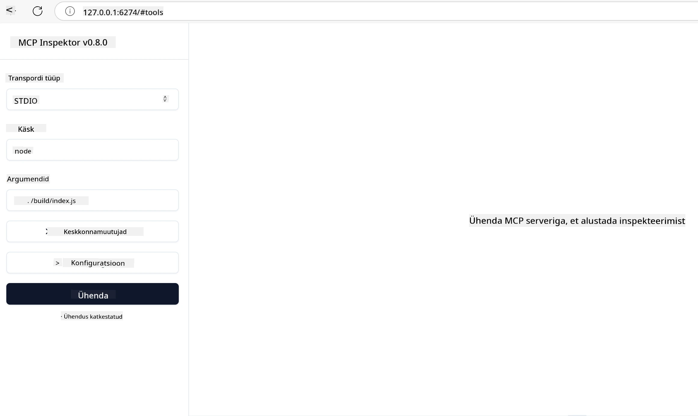

## Testimine ja silumine

Enne kui alustate MCP serveri testimist, on oluline mõista saadaolevaid tööriistu ja parimaid praktikaid silumiseks. Tõhus testimine tagab, et teie server käitub ootuspäraselt ning aitab teil kiiresti tuvastada ja lahendada probleeme. Järgmine jaotis kirjeldab soovitatud lähenemisviise teie MCP rakenduse valideerimiseks.

## Ülevaade

See õppetükk käsitleb, kuidas valida õige testimislähenemine ja kõige tõhusam testimise tööriist.

## Õpieesmärgid

Selle õppetüki lõpuks oskate:

- Kirjeldada erinevaid testimislähenemisviise.
- Kasutada erinevaid tööriistu koodi tõhusaks testimiseks.


## MCP serverite testimine

MCP pakub tööriistu, mis aitavad teil serverite testimisel ja silumisel:

- **MCP Inspector**: käsurea tööriist, mida saab käivitada nii CLI kui visuaalsel tööriistana.
- **Käsitsi testimine**: võite kasutada tööriista nagu curl veebipäringute tegemiseks, kuid sobib iga tööriist, mis saab käitada HTTP päringuid.
- **Ühiktestimine**: saate kasutada oma eelistatud testimismehhanismi nii serveri kui kliendi funktsioonide testimiseks.

### MCP Inspectori kasutamine

Oleme selle tööriista kasutamist varasemates õppetükkides kirjeldanud, kuid räägime sellest üldjoontes natuke. See on Node.js-is loodud tööriist ja saate seda kasutada, kutsudes käivitust käsuga `npx`, mis laadib tööriista ajutiselt alla ja installib ning pärast päringu täitmist puhastab ennast.

[MCP Inspector](https://github.com/modelcontextprotocol/inspector) aitab teil:

- **Avastada serveri võimeid**: automaatselt tuvastada saadaolevad ressursid, tööriistad ja päringud
- **Testida tööriista täitmist**: proovida erinevaid parameetreid ja vaadata vastuseid reaalajas
- **Vaadata serveri metaandmeid**: uurida serveri infot, skeeme ja konfiguratsioone

Tavapärane tööriista käivitus näeb välja selline:

```bash
npx @modelcontextprotocol/inspector node build/index.js
```

Ülaltoodud käsk käivitab MCP ja selle visuaalse liidese ning avab teie brauseris lokaalse veebiliidese. Võite eeldada, et näete armatuurlaua, mis kuvab teie registreeritud MCP serverid, nende saadaolevad tööriistad, ressursid ja päringud. Liides võimaldab teil interaktiivselt testida tööriista käivitamist, uurida serveri metaandmeid ja näha hetkelisi vastuseid, muutes MCP serveri rakenduste valideerimise ja silumise lihtsamaks.

Nii see võib välja näha: 

Samuti saate käivitada selle tööriista CLI režiimis, lisades `--cli` atribuudi. Siin on näide tööriista käivitamisest "CLI" režiimis, mis loetleb kõik serveri tööriistad:

```sh
npx @modelcontextprotocol/inspector --cli node build/index.js --method tools/list
```

### Käsitsi testimine

Peale inspectori tööriista käivitamist serveri võimete testimiseks on teine sarnane lähenemisviis käitada klienti, mis suudab kasutada HTTP-d, näiteks curl.

Curliga saate MCP servereid otse HTTP päringute abil testida:

```bash
# Näide: Testserveri metaandmed
curl http://localhost:3000/v1/metadata

# Näide: Teostada tööriist
curl -X POST http://localhost:3000/v1/tools/execute \
  -H "Content-Type: application/json" \
  -d '{"name": "calculator", "parameters": {"expression": "2+2"}}'
```

Nagu näete curl'i kasutamisest ülal, kasutatakse tööriista käivitamiseks POST-päringut koos koormusega, mis sisaldab tööriista nime ja selle parameetreid. Kasutage endale kõige paremini sobivat lähenemist. Üldiselt on käsurea tööriistad kiired ja neid saab skriptida, mis võib olla kasulik CI/CD keskkonnas.

### Ühiktestimine

Looge oma tööriistade ja ressursside jaoks ühikutestid, et veenduda nende ootuspärases töös. Siin on mõned näidiskoodid testimiseks.

```python
import pytest

from mcp.server.fastmcp import FastMCP
from mcp.shared.memory import (
    create_connected_server_and_client_session as create_session,
)

# Märgi kogu moodul asünkroonsete testide jaoks
pytestmark = pytest.mark.anyio


async def test_list_tools_cursor_parameter():
    """Test that the cursor parameter is accepted for list_tools.

    Note: FastMCP doesn't currently implement pagination, so this test
    only verifies that the cursor parameter is accepted by the client.
    """

 server = FastMCP("test")

    # Loo paar testimisvahendit
    @server.tool(name="test_tool_1")
    async def test_tool_1() -> str:
        """First test tool"""
        return "Result 1"

    @server.tool(name="test_tool_2")
    async def test_tool_2() -> str:
        """Second test tool"""
        return "Result 2"

    async with create_session(server._mcp_server) as client_session:
        # Testi ilma kursoriparameetrita (jäetud välja)
        result1 = await client_session.list_tools()
        assert len(result1.tools) == 2

        # Testi kursor=None väärtusega
        result2 = await client_session.list_tools(cursor=None)
        assert len(result2.tools) == 2

        # Testi kursoriga stringina
        result3 = await client_session.list_tools(cursor="some_cursor_value")
        assert len(result3.tools) == 2

        # Testi tühja stringi kursoriga
        result4 = await client_session.list_tools(cursor="")
        assert len(result4.tools) == 2
    
```

Eelnev kood teeb järgmist:

- Kasutab pytest raamistiku, mis võimaldab luua teste funktsioonidena ja kasutada assert-lauseid.
- Loob MCP serveri kahe erineva tööriistaga.
- Kasutab `assert` lauset tingimuste täitmise kontrollimiseks.

Vaadake [täisfaili siit](https://github.com/modelcontextprotocol/python-sdk/blob/main/tests/client/test_list_methods_cursor.py)

Antud faili põhjal saate testida oma serverit, et veenduda võimete nõuetekohases loomises.

Kõik peamised SDKd sisaldavad sarnaseid testimise jaotisi, nii et saate oma valitud runtime'i jaoks kohandada.

## Näited 

- [Java Kalkulaator](../samples/java/calculator/README.md)
- [.Net Kalkulaator](../../../../03-GettingStarted/samples/csharp)
- [JavaScript Kalkulaator](../samples/javascript/README.md)
- [TypeScript Kalkulaator](../samples/typescript/README.md)
- [Python Kalkulaator](../../../../03-GettingStarted/samples/python) 

## Täiendavad ressursid

- [Python SDK](https://github.com/modelcontextprotocol/python-sdk)

## Mis järgmiseks

- Järgmine: [Juhtimine](../09-deployment/README.md)

---

<!-- CO-OP TRANSLATOR DISCLAIMER START -->
**Lahtiütlus**:
See dokument on tõlgitud kasutades AI tõlketeenust [Co-op Translator](https://github.com/Azure/co-op-translator). Kuigi me püüdleme täpsuse poole, palun pange tähele, et automatiseeritud tõlgetes võib esineda vigu või ebatäpsusi. Originaaldokument selle emakeeles tuleks pidada autoriteetseks allikaks. Olulise teabe puhul soovitatakse kasutada professionaalset inimtõlget. Me ei vastuta selle tõlkega seotud eksimustest või valesti mõistmistest.
<!-- CO-OP TRANSLATOR DISCLAIMER END -->