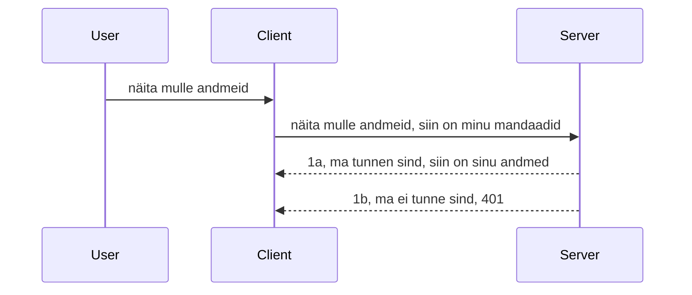

# Lihtne autentimine

MCP SDK-d toetavad OAuth 2.1 kasutamist, mis ausalt öeldes on üsna keerukas protsess, mis hõlmab mõisteid nagu autentimiserver, ressurserver, volikirjade postitamine, koodi saamine, koodi vahetamine bearer-token'iks, kuni lõpuks ressursiandmete kättesaamiseni. Kui sa pole OAuthiga harjunud, mis on suurepärane asi rakendada, on hea mõte alustada mõningase põhitaseme autentimisega ja edasi ehitada üha parema turvalisuse suunas. Sellepärast see peatükk eksisteerib, et aidata sul jõuda edasi arenenuma autentimiseni.

## Autentimine, mida mõtleme?

Autentimine tähendab lühidalt autentimist ja autoriseerimist. Idee on, et meil on vaja teha kahte asja:

- **Autentimine**, mis on protsess, mille käigus selgitame välja, kas me lubame inimesel meie majja siseneda, et tal on õigus olla "siin", st tal on juurdepääs meie ressursiserverile, kus meie MCP Serveri funktsioonid asuvad.
- **Autoriseerimine**, on protsess, mille käigus uurime välja, kas kasutajal peaks olema juurdepääs neile konkreetsetele ressurssidele, mida ta küsib, näiteks need tellimused või need tooted või kas tal on lubatud sisu lugeda, kuid mitte kustutada, nagu näiteks näide.

## Volikirjad: kuidas me süsteemile ütleme, kes me oleme

Enamik veebiarendajaid hakkab mõtlema serverile volikirja esitamise mõttes, tavaliselt saladust, mis ütleb, kas neil on lubatud siin olla ("Autentimine"). See volikiri on tavaliselt base64 kodeeritud kasutajanime ja parooli versioon või API võti, mis identifitseerib konkreetse kasutaja ainulaadselt.

See hõlmab selle saatmist päises nimega "Authorization" nii:

```json
{ "Authorization": "secret123" }
```

Seda nimetatakse tavaliselt baasautentimiseks. Kuidas üldine voog siis töötab, on järgmine:


Nüüd, kui me mõistame, kuidas see voona töötab, kuidas seda rakendada? Enamikul veebi serveritel on mõiste nimega middleware, koodilõik, mis jookseb päringu osana ja saab kontrollida volikirju ning kui volikirjad on kehtivad, laseb päringu läbi minna. Kui päringul pole kehtivaid volikirju, saad autentimisvea. Vaatame, kuidas seda saab rakendada:

**Python**

```python
class AuthMiddleware(BaseHTTPMiddleware):
    async def dispatch(self, request, call_next):

        has_header = request.headers.get("Authorization")
        if not has_header:
            print("-> Missing Authorization header!")
            return Response(status_code=401, content="Unauthorized")

        if not valid_token(has_header):
            print("-> Invalid token!")
            return Response(status_code=403, content="Forbidden")

        print("Valid token, proceeding...")
       
        response = await call_next(request)
        # lisa kliendi päised või muuda vastust mingil moel
        return response


starlette_app.add_middleware(CustomHeaderMiddleware)
```

Siin me:

- Loodud middleware nimega `AuthMiddleware`, mille `dispatch` meetodit kutsub veebi server.
- Lisanud middleware veebi serverile:

    ```python
    starlette_app.add_middleware(AuthMiddleware)
    ```

- Kirjutanud valideerimisloogika, mis kontrollib, kas Authorization päis on olemas ja kas saadetud saladus on kehtiv:

    ```python
    has_header = request.headers.get("Authorization")
    if not has_header:
        print("-> Missing Authorization header!")
        return Response(status_code=401, content="Unauthorized")

    if not valid_token(has_header):
        print("-> Invalid token!")
        return Response(status_code=403, content="Forbidden")
    ```

    kui saladus on olemas ja kehtiv, lubame päringu läbipääsu, kutsudes `call_next` ja tagastades vastuse.

    ```python
    response = await call_next(request)
    # lisa mis tahes kliendi päised või muuda mingil moel vastust
    return response
    ```

Kuidas see töötab, on see, et kui päring serverile tehakse, siis middleware kutsutakse ja antud rakenduse korral laseb päringu läbi või tagastab vea, mis näitab, et kliendil pole lubatud jätkata.

**TypeScript**

Siin loome middleware populaarses Express raamistikus ja peame päringu kinni enne, kui see jõuab MCP Serverisse. Kood näeb välja selline:

```typescript
function isValid(secret) {
    return secret === "secret123";
}

app.use((req, res, next) => {
    // 1. Kas autoriseerimispäis on olemas?
    if(!req.headers["Authorization"]) {
        res.status(401).send('Unauthorized');
    }
    
    let token = req.headers["Authorization"];

    // 2. Kontrolli kehtivust.
    if(!isValid(token)) {
        res.status(403).send('Forbidden');
    }

   
    console.log('Middleware executed');
    // 3. Edastab päringu järgmisse sammu päringu torujuhtmes.
    next();
});
```

Selles koodis:

1. Kontrollime esmalt, kas Authorization päis on olemas, kui ei ole, saadame 401 vea.
2. Veendume, et volikiri/token on kehtiv, kui mitte, saadame 403 vea.
3. Lõpuks edastame päringu päringu torujuhtmes ja tagastame küsitud ressursi.

## Harjutus: rakenda autentimine

Võtame oma teadmise ja proovime seda rakendada. Plaan on järgmine:

Server

- Loo veebi server ja MCP instants.
- Rakenda serverile middleware.

Klient

- Saada veebi päring, volikirjaga, päise kaudu.

### -1- Loo veebi server ja MCP instants

Esimeses sammus peame looma veebi serveri instantsi ja MCP Serveri.

**Python**

Siin loome MCP serveri instantsi, loob starlette veebi rakenduse ja hostime selle uvicorniga.

```python
# MCP serveri loomine

app = FastMCP(
    name="MCP Resource Server",
    instructions="Resource Server that validates tokens via Authorization Server introspection",
    host=settings["host"],
    port=settings["port"],
    debug=True
)

# starlette veebirakenduse loomine
starlette_app = app.streamable_http_app()

# rakenduse teenindamine uvicorni kaudu
async def run(starlette_app):
    import uvicorn
    config = uvicorn.Config(
            starlette_app,
            host=app.settings.host,
            port=app.settings.port,
            log_level=app.settings.log_level.lower(),
        )
    server = uvicorn.Server(config)
    await server.serve()

run(starlette_app)
```

Selles koodis:

- Loome MCP Serveri.
- Loome starlette veebi rakenduse MCP Serverilt, `app.streamable_http_app()`.
- Hostime ja serverime veebi rakenduse uvicorniga `server.serve()`.

**TypeScript**

Siin loome MCP Serveri instantsi.

```typescript
const server = new McpServer({
      name: "example-server",
      version: "1.0.0"
    });

    // ... seadista serveri ressursid, tööriistad ja käsud ...
```

See MCP Serveri loomine toimub meie POST /mcp marsruutide definitsioonis, nii et võtame ülaltoodud koodi ja liigutame nii:

```typescript
import express from "express";
import { randomUUID } from "node:crypto";
import { McpServer } from "@modelcontextprotocol/sdk/server/mcp.js";
import { StreamableHTTPServerTransport } from "@modelcontextprotocol/sdk/server/streamableHttp.js";
import { isInitializeRequest } from "@modelcontextprotocol/sdk/types.js"

const app = express();
app.use(express.json());

// Kaart transpordivahendite salvestamiseks sessiooni ID alusel
const transports: { [sessionId: string]: StreamableHTTPServerTransport } = {};

// Töötle POST-päringuid kliendilt serverile suhtlemiseks
app.post('/mcp', async (req, res) => {
  // Kontrolli olemasolevat sessiooni ID-d
  const sessionId = req.headers['mcp-session-id'] as string | undefined;
  let transport: StreamableHTTPServerTransport;

  if (sessionId && transports[sessionId]) {
    // Taaskasutada olemasolevat transpordivahendit
    transport = transports[sessionId];
  } else if (!sessionId && isInitializeRequest(req.body)) {
    // Uus initsialiseerimise päring
    transport = new StreamableHTTPServerTransport({
      sessionIdGenerator: () => randomUUID(),
      onsessioninitialized: (sessionId) => {
        // Salvesta transpordivahend sessiooni ID järgi
        transports[sessionId] = transport;
      },
      // DNS-i ümberseadistamise kaitse on vaikimisi tagasiühilduvuse huvides keelatud. Kui käivitate selle serveri
      // lokaalselt, veenduge, et oleksite seadistanud:
      // enableDnsRebindingProtection: true,
      // allowedHosts: ['127.0.0.1'],
    });

    // Korista transpordivahend sulgemisel
    transport.onclose = () => {
      if (transport.sessionId) {
        delete transports[transport.sessionId];
      }
    };
    const server = new McpServer({
      name: "example-server",
      version: "1.0.0"
    });

    // ... seadista serveri ressursid, tööriistad ja käsud ...

    // Ühenda MCP serveriga
    await server.connect(transport);
  } else {
    // Vigane päring
    res.status(400).json({
      jsonrpc: '2.0',
      error: {
        code: -32000,
        message: 'Bad Request: No valid session ID provided',
      },
      id: null,
    });
    return;
  }

  // Töötle päringut
  await transport.handleRequest(req, res, req.body);
});

// Taaskasutatav töötleja GET ja DELETE päringute jaoks
const handleSessionRequest = async (req: express.Request, res: express.Response) => {
  const sessionId = req.headers['mcp-session-id'] as string | undefined;
  if (!sessionId || !transports[sessionId]) {
    res.status(400).send('Invalid or missing session ID');
    return;
  }
  
  const transport = transports[sessionId];
  await transport.handleRequest(req, res);
};

// Töötle GET-päringuid serverist kliendile teadete jaoks SSE kaudu
app.get('/mcp', handleSessionRequest);

// Töötle DELETE-päringuid sessiooni lõpetamiseks
app.delete('/mcp', handleSessionRequest);

app.listen(3000);
```

Nüüd näed, kuidas MCP Serveri loomine liiguti `app.post("/mcp")` sisse.

Jätkame järgmise sammuga, milleks on middleware loomine, et saaksime sisse tulevat volikirja valideerida.

### -2- Rakenda serverile middleware

Liigume nüüd middleware osa juurde. Siin loome middleware, mis otsib `Authorization` päisest volikirja ja valideerib selle. Kui see on vastuvõetav, liigub päring edasi oma tegevuse tegemiseks (nt tööriistade loend, ressursi lugemine või mis iganes MCP funktsionaalsus klient küsis).

**Python**

Middleware loomiseks peame looma klassi, mis pärib `BaseHTTPMiddleware`-st. Huvi pakuvad kaks osa:

- Päring `request`, millest loeme päise infot.
- `call_next` tagasihelistus, mida peame kutsuma, kui kliendil on sobiv volikiri.

Esmalt peame käsitlema olukorda, kui `Authorization` päis puudub:

```python
has_header = request.headers.get("Authorization")

# päist pole, ebaõnnestu koodi 401-ga, muidu jätka.
if not has_header:
    print("-> Missing Authorization header!")
    return Response(status_code=401, content="Unauthorized")
```

Siin saadame 401 volitamata sõnumi, kuna klient ebaõnnestub autentimisel.

Järgmine, kui volikiri esitati, peame kontrollima selle kehtivust järgmiselt:

```python
 if not valid_token(has_header):
    print("-> Invalid token!")
    return Response(status_code=403, content="Forbidden")
```

Pane tähele, kuidas me ülal saadame 403 keelatud sõnumi. Vaatame tervet middleware allpool, mis rakendab kõike eelmainitut:

```python
class AuthMiddleware(BaseHTTPMiddleware):
    async def dispatch(self, request, call_next):

        has_header = request.headers.get("Authorization")
        if not has_header:
            print("-> Missing Authorization header!")
            return Response(status_code=401, content="Unauthorized")

        if not valid_token(has_header):
            print("-> Invalid token!")
            return Response(status_code=403, content="Forbidden")

        print("Valid token, proceeding...")
        print(f"-> Received {request.method} {request.url}")
        response = await call_next(request)
        response.headers['Custom'] = 'Example'
        return response

```

Suurepärane, aga mis siis on `valid_token` funktsioon? Siin see allpool:

```python
# ÄRA kasuta tootmises - paranda see !!
def valid_token(token: str) -> bool:
    # eemalda "Bearer " prefiks
    if token.startswith("Bearer "):
        token = token[7:]
        return token == "secret-token"
    return False
```

See vajab loomulikult parandamist.

[!IMPORTANT] Sa ei tohiks KUNAGI hoida selliseid salasid koodis. Ideaalis peaksid selle võrdlusväärtuse hankima andmeallikast või IDP-st (identiteediteenuse pakkujast) või veel parem, lase IDP-l validatsioon teha.

**TypeScript**

Expressiga rakendamiseks peame kutsuma meetodi `use`, mis võtab vastu middleware funktsioone.

Peame:

- Töötlema päringut, et kontrollida `Authorization` omaduses saadetud volikirja.
- Valideerima volikirja ja kui see on kehtiv, lubama päringul jätkuda ning kliendi MCP päringul teha, mida ta peab (nt tööriistade loend, ressursi lugemine või muu MCP-ga seonduv).

Siin kontrollime, kas `Authorization` päis on olemas ja kui ei ole, peatame päringu läbipääsu:

```typescript
if(!req.headers["authorization"]) {
    res.status(401).send('Unauthorized');
    return;
}
```

Kui päist ei saadeta, saate 401.

Seejärel kontrollime, kas volikiri on kehtiv, kui ei ole, peatame päringu uuesti, kuid pisut teistsuguse sõnumiga:

```typescript
if(!isValid(token)) {
    res.status(403).send('Forbidden');
    return;
} 
```

Nüüd saate 403 vea.

Siin on kogu kood:

```typescript
app.use((req, res, next) => {
    console.log('Request received:', req.method, req.url, req.headers);
    console.log('Headers:', req.headers["authorization"]);
    if(!req.headers["authorization"]) {
        res.status(401).send('Unauthorized');
        return;
    }
    
    let token = req.headers["authorization"];

    if(!isValid(token)) {
        res.status(403).send('Forbidden');
        return;
    }  

    console.log('Middleware executed');
    next();
});
```

Oleme seadistanud veebi serveri, et see aktsepteeriks middleware, mis kontrollib kliendi saadetud volikirja. Aga mis saab kliendist?

### -3- Saada veebi päring volikirjaga päises

Peame tagama, et klient edastab volikirja päise kaudu. Kuna kasutame MCP klienti seda tegemiseks, peame välja uurima, kuidas seda teha.

**Python**

Kliendi jaoks peame saatma päise koos meie volikirjaga nii:

```python
# ÄRA kõvenda väärtust, hoia see vähemalt keskkonnamuutujas või turvalisemal andmekandjal
token = "secret-token"

async with streamablehttp_client(
        url = f"http://localhost:{port}/mcp",
        headers = {"Authorization": f"Bearer {token}"}
    ) as (
        read_stream,
        write_stream,
        session_callback,
    ):
        async with ClientSession(
            read_stream,
            write_stream
        ) as session:
            await session.initialize()
      
            # TEGEMATA, mida sa kliendil teha soovid, nt tööriistade nimekiri, tööriistade kutsumine jms.
```

Pane tähele, kuidas me täidame `headers` omaduse nii ` headers = {"Authorization": f"Bearer {token}"}`.

**TypeScript**

Seda saab lahendada kahes etapis:

1. Täida konfiguratsiooni objekt oma volikirjaga.
2. Edasta konfiguratsioon objekti transpordile.

```typescript

// ÄRGE kodeerige väärtust otse selliselt nagu siin näidatud. Vähemalt hoidke see keskkonnamuutujana ja kasutage midagi nagu dotenv (arendusrežiimis).
let token = "secret123"

// määratlege kliendi transpordi valikute objekt
let options: StreamableHTTPClientTransportOptions = {
  sessionId: sessionId,
  requestInit: {
    headers: {
      "Authorization": "secret123"
    }
  }
};

// edastage valikute objekt transpordile
async function main() {
   const transport = new StreamableHTTPClientTransport(
      new URL(serverUrl),
      options
   );
```

Siin näed ülal, kuidas me pidime looma `options` objekti ja panema oma päised `requestInit` omadusse.

[!IMPORTANT] Kuidas seda edasi parandada? Praegusel rakendusel on mõningaid probleeme. Esiteks on volikirja selline edastamine üsna riskantne, kui sul vähemalt pole HTTPS-ühendust. Isegi siis võib volikiri varastada, nii et vajad süsteemi, kus tokenit saab hõlpsalt tagasi võtta ja lisada muid kontrolle, näiteks kust maailmast see pärineb, kas päringuid tehakse liiga tihti (botilaadne käitumine), lühidalt öeldes on murekohti palju.

Siiski tuleb öelda, et väga lihtsate API-de jaoks, kus sa ei taha, et keegi sinu API-d ilma autentimiseta kasutaks, on siin esitatud lahendus hea algus.

Sellele lisaks proovime veidi turvalisust tugevdada, kasutades standardiseeritud vormingut nagu JSON Web Token ehk JWT või "JOT" tokenid.

## JSON Web Tokendid, JWT

Proovime seega parandada väga lihtsate volikirjade saatmist. Millised on kohesed eelised JWT kasutamisel?

- **Turvalisuse paranemine**. Baasautentimises saadad kasutajanime ja parooli base64 kodeeritud tokenina (või API võtmena) ikka ja jälle, mis suurendab riski. JWT puhul saad kasutajanime ja parooli ning vastu saad tokeni, mis on ajaliselt piiratud, st aegub. JWT võimaldab hõlpsasti kasutada peenhäälestatud juurdepääsukontrolli rollide, ulatuste ja õiguste alusel.
- **Seisunditu ja skaleeritavus**. JWT-d on isevad, nad kannavad kogu kasutajainfot ja välistavad serveripoolse sessiooni salvestamise vajaduse. Tokenit saab ka lokaalselt valideerida.
- **Ühilduvus ja liitumine**. JWT on Open ID Connecti keskne osa ja seda kasutatakse tuntud identiteedipakkujatega nagu Entra ID, Google Identity ja Auth0. Nad võimaldavad kasutajakonto ühiskasutust (single sign on) ja muud ettevõtteklassi funktsionaalsust.
- **Moodulaarne ja paindlik**. JWT-d saab kasutada API väravate (API Gateway) nagu Azure API Management, NGINX ja muu kaudu. Toetab autentimisstsenaariume ja serverite vahelist suhtlust, sealhulgas esindamist ja volitamist.
- **Tõhusus ja vahemälu**. JWT-sid saab dešifreerimise järel vahemällu panna, mis vähendab vajadust pidevalt neid töödelda. See aitab eriti suuri liiklusmahtusid tekkivate rakenduste puhul, parandades läbilaskevõimet ja vähendades koormust infrastruktuurile.
- **Täpsemad funktsioonid**. Toetab ka introspektsiooni (serveripoolne kehtivuse kontroll) ja tagasi võtmist (tokeni kehtetuks muutmine).

Kõigi nende eelistega vaatame, kuidas võime oma rakenduse järgmisele tasemele viia.

## Baasautentimisest JWT-ks

Kõrgetasemeliselt peame tegema järgmised muudatused:

- **Õppima JWT tokeni konstrueerimist** ja tegema selle valmis kliendilt serverisse saatmiseks.
- **JWT tokeni valideerimine**, ja kui see läbib, lubame kliendil kasutada meie ressursse.
- **Turvaline tokeni salvestamine**. Kuidas me seda tokenit hoiame.
- **Marsruutide kaitsmine**. Peame kaitsma marsruute, meie puhul MCP funktsioonidega seonduvaid marsruute.
- **Värskendustokenite lisamine**. Kindlustama, et loome lühiajalisi tokeneid, aga ka pikaajalisi värskendustokeneid, mida saab kasutada uute tokenite saamiseks kui need aeguvad. Samuti peab olema värskendus-lõpp-punkt ja rotatsiooni strateegia.

### -1- Konstrueeri JWT token

Esiteks koosneb JWT token järgmistest osadest:

- **päis (header)**, kasutatud algoritm ja tokeni tüüp.
- **payload**, nõuded, nt sub (kasutaja või subjekt, keda token esindab. Autentimisstsenaariumis tavaliselt kasutaja ID), exp (aegumistähtaeg), role (roll).
- **signatuur**, allkirjastatud saladuse või privaatvõtmega.

Selleks peame konstrueerima päise, payloadi ja kodeeritud tokeni.

**Python**

```python

import jwt
import jwt
from jwt.exceptions import ExpiredSignatureError, InvalidTokenError
import datetime

# Salajane võti JWT allkirjastamiseks
secret_key = 'your-secret-key'

header = {
    "alg": "HS256",
    "typ": "JWT"
}

# kasutaja info, selle nõuded ja aegumisaeg
payload = {
    "sub": "1234567890",               # Teema (kasutaja ID)
    "name": "User Userson",                # Kohandatud nõue
    "admin": True,                     # Kohandatud nõue
    "iat": datetime.datetime.utcnow(),# Väljaandmise aeg
    "exp": datetime.datetime.utcnow() + datetime.timedelta(hours=1)  # Aegumisaeg
}

# kodeeri see
encoded_jwt = jwt.encode(payload, secret_key, algorithm="HS256", headers=header)
```

Ülaltoodud koodis:

- Määratlesime päise HS256 algoritmiga ja tüübiga JWT.
- Konstrueerisime payloadi, mis sisaldab subjekti ehk kasutaja ID-d, kasutajanime, rolli, väljastamise aega ja aegumistähtaega, mis rakendab mainitud ajalise piirangu aspekti.

**TypeScript**

Siin vajame mõningaid sõltuvusi, mis aitavad meil JWT tokeni konstrueerida.

Sõltuvused

```sh

npm install jsonwebtoken
npm install --save-dev @types/jsonwebtoken
```

Kui see on paigas, loome päise, payloadi ja selle kaudu kodeeritud tokeni.

```typescript
import jwt from 'jsonwebtoken';

const secretKey = 'your-secret-key'; // Kasutage tootmises keskkonnamuutujaid

// Määratlege andmepakett
const payload = {
  sub: '1234567890',
  name: 'User usersson',
  admin: true,
  iat: Math.floor(Date.now() / 1000), // Väljastatud ajas
  exp: Math.floor(Date.now() / 1000) + 60 * 60 // Aegub 1 tunni pärast
};

// Määratlege päis (valikuline, jsonwebtoken seab vaikimisi väärtused)
const header = {
  alg: 'HS256',
  typ: 'JWT'
};

// Looge token
const token = jwt.sign(payload, secretKey, {
  algorithm: 'HS256',
  header: header
});

console.log('JWT:', token);
```

See token on:

Allkirjastatud HS256-ga  
Kehtib 1 tund  
Sisaldab nõudeid nagu sub, name, admin, iat, exp.

### -2- Valideeri token

Samuti peame tokeni valideerima, seda peaks tegema server tagamaks, et klient saadab tõepoolest kehtiva tokeni. Siin on palju kontrollpunkte, struktuuri valideerimisest kuni kehtivuseni. Samuti julgustatakse lisama muid kontrolle, näiteks kas kasutaja on meie süsteemis ja muu sarnane.

Tokeni valideerimiseks dekrüpteerime selle, et seda lugeda ja seejärel kontrollida kehtivust:

**Python**

```python

# Dekodeeri ja kontrolli JWT
try:
    decoded = jwt.decode(token, secret_key, algorithms=["HS256"])
    print("✅ Token is valid.")
    print("Decoded claims:")
    for key, value in decoded.items():
        print(f"  {key}: {value}")
except ExpiredSignatureError:
    print("❌ Token has expired.")
except InvalidTokenError as e:
    print(f"❌ Invalid token: {e}")

```

Selles koodis kutsume `jwt.decode`, kasutades sisendina tokenit, saladusvõtit ja valitud algoritmi. Pane tähele, et kasutatakse try-catch konstruktsiooni, kuna ebaõnnestunud valideerimine tõstab vea.

**TypeScript**

Siin peame kutsuma `jwt.verify`, et saada dekrüpteeritud token, mida saame edasi analüüsida. Kui kutsumine ebaõnnestub, tähendab see, et tokeni struktuur on vale või see ei kehti enam.

```typescript

try {
  const decoded = jwt.verify(token, secretKey);
  console.log('Decoded Payload:', decoded);
} catch (err) {
  console.error('Token verification failed:', err);
}
```

MÄRKUS: nagu eelnevalt mainitud, peaksime tegema lisakontrolle, et kindlad token suunab kasutajale meie süsteemis ja kasutajal on õigused, mida ta väidab omavat.

Järgmine teema on rollipõhine juurdepääsukontroll ehk RBAC.
## Rollipõhise juurdepääsu kontrolli lisamine

Mõte on selles, et me tahame väljendada, et erinevatel rollidel on erinevad õigused. Näiteks eeldame, et administraator saab kõike teha, tavakasutaja saab lugeda/kirjutada ja külaline saab ainult lugeda. Seetõttu on siin mõned võimalikud õiguste tasemed:

- Admin.Write  
- User.Read  
- Guest.Read  

Vaatame, kuidas sellist kontrolli saab rakendada vahendustarkvara (middleware) abil. Vahendustarkvara saab lisada nii iga marsruudi jaoks kui ka kõigile marsruutidele.

**Python**

```python
from starlette.middleware.base import BaseHTTPMiddleware
from starlette.responses import JSONResponse
import jwt

# ÄRA hoia saladust koodis, see on ainult demonstratsiooni eesmärkidel. Loe seda turvalisest kohast.
SECRET_KEY = "your-secret-key" # pane see keskkonnamuutujasse
REQUIRED_PERMISSION = "User.Read"

class JWTPermissionMiddleware(BaseHTTPMiddleware):
    async def dispatch(self, request, call_next):
        auth_header = request.headers.get("Authorization")
        if not auth_header or not auth_header.startswith("Bearer "):
            return JSONResponse({"error": "Missing or invalid Authorization header"}, status_code=401)

        token = auth_header.split(" ")[1]
        try:
            decoded = jwt.decode(token, SECRET_KEY, algorithms=["HS256"])
        except jwt.ExpiredSignatureError:
            return JSONResponse({"error": "Token expired"}, status_code=401)
        except jwt.InvalidTokenError:
            return JSONResponse({"error": "Invalid token"}, status_code=401)

        permissions = decoded.get("permissions", [])
        if REQUIRED_PERMISSION not in permissions:
            return JSONResponse({"error": "Permission denied"}, status_code=403)

        request.state.user = decoded
        return await call_next(request)


```
  
On mitmeid erinevaid viise, kuidas vahendustarkvara lisada nagu allpool:

```python

# Alt 1: lisa vahendustarkvara starlette rakenduse koostamise ajal
middleware = [
    Middleware(JWTPermissionMiddleware)
]

app = Starlette(routes=routes, middleware=middleware)

# Alt 2: lisa vahendustarkvara pärast starlette rakenduse koostamist
starlette_app.add_middleware(JWTPermissionMiddleware)

# Alt 3: lisa vahendustarkvara iga marsruudi kohta
routes = [
    Route(
        "/mcp",
        endpoint=..., # käsitleja
        middleware=[Middleware(JWTPermissionMiddleware)]
    )
]
```
  
**TypeScript**

Saame kasutada `app.use` ja vahendustarkvara, mis käivitub kõigi päringute puhul.

```typescript
app.use((req, res, next) => {
    console.log('Request received:', req.method, req.url, req.headers);
    console.log('Headers:', req.headers["authorization"]);

    // 1. Kontrolli, kas autoriseerimispealkiri on saadetud

    if(!req.headers["authorization"]) {
        res.status(401).send('Unauthorized');
        return;
    }
    
    let token = req.headers["authorization"];

    // 2. Kontrolli, kas token on kehtiv
    if(!isValid(token)) {
        res.status(403).send('Forbidden');
        return;
    }  

    // 3. Kontrolli, kas tokeniga kasutaja eksisteerib meie süsteemis
    if(!isExistingUser(token)) {
        res.status(403).send('Forbidden');
        console.log("User does not exist");
        return;
    }
    console.log("User exists");

    // 4. Kontrolli, kas tokenil on õiged õigused
    if(!hasScopes(token, ["User.Read"])){
        res.status(403).send('Forbidden - insufficient scopes');
    }

    console.log("User has required scopes");

    console.log('Middleware executed');
    next();
});

```
  
Me võime lubada oma vahendustarkvaral teha mitmeid asju ja see PEAB neid tegema, nimelt:

1. Kontrollida, kas autoriseerimis päis on olemas  
2. Kontrollida, kas token on kehtiv, kutsume `isValid` meetodit, mille me kirjutasime, et kontrollida JWT tokeni terviklikkust ja kehtivust.  
3. Kontrollida, kas kasutaja eksisteerib meie süsteemis, seda peaksime kontrollima.  

   ```typescript
    // kasutajad andmebaasis
   const users = [
     "user1",
     "User usersson",
   ]

   function isExistingUser(token) {
     let decodedToken = verifyToken(token);

     // TODO, kontrolli, kas kasutaja on andmebaasis olemas
     return users.includes(decodedToken?.name || "");
   }
   ```
  
   Ülal oleme loonud väga lihtsa `users` nimekirja, mis peaks loomulikult andmebaasis olema.

4. Lisaks peaksime kontrollima, kas tokenil on õiged õigused.

   ```typescript
   if(!hasScopes(token, ["User.Read"])){
        res.status(403).send('Forbidden - insufficient scopes');
   }
   ```
  
   Ülaltoodud vahendustarkvara koodis kontrollime, et token sisaldab User.Read õigust, kui ei, saadame 403 vea. Allpool on `hasScopes` abimeetod.

   ```typescript
   function hasScopes(scope: string, requiredScopes: string[]) {
     let decodedToken = verifyToken(scope);
    return requiredScopes.every(scope => decodedToken?.scopes.includes(scope));
  }  
   ```

Have a think which additional checks you should be doing, but these are the absolute minimum of checks you should be doing.

Using Express as a web framework is a common choice. There are helpers library when you use JWT so you can write less code.

- `express-jwt`, helper library that provides a middleware that helps decode your token.
- `express-jwt-permissions`, this provides a middleware `guard` that helps check if a certain permission is on the token.

Here's what these libraries can look like when used:

```typescript
const express = require('express');
const jwt = require('express-jwt');
const guard = require('express-jwt-permissions')();

const app = express();
const secretKey = 'your-secret-key'; // put this in env variable

// Decode JWT and attach to req.user
app.use(jwt({ secret: secretKey, algorithms: ['HS256'] }));

// Check for User.Read permission
app.use(guard.check('User.Read'));

// multiple permissions
// app.use(guard.check(['User.Read', 'Admin.Access']));

app.get('/protected', (req, res) => {
  res.json({ message: `Welcome ${req.user.name}` });
});

// Error handler
app.use((err, req, res, next) => {
  if (err.code === 'permission_denied') {
    return res.status(403).send('Forbidden');
  }
  next(err);
});

```
  
Nüüd olete näinud, kuidas vahendustarkvara saab kasutada nii autentimiseks kui autoriseerimiseks, aga kuidas on lood MCP-ga, kas see muudab meie autentimist? Vaatame järgmises osas.

### -3- Lisa RBAC MCP-le

Olete juba näinud, kuidas RBAC-i saab lisada vahendustarkvara kaudu, kuid MCP jaoks ei ole lihtsat viisi lisada RBAC-i iga MCP funktsiooni jaoks eraldi, mida me siis teeme? Me lihtsalt lisame sellise koodi, mis kontrollib, kas klientil on õigus kutsuda kindlat tööriista:

Teil on mitmeid erinevaid võimalusi, kuidas funktsiooni kohta RBAC-i rakendada, siin on mõned:

- Lisada kontroll iga tööriista, ressursi või prompti jaoks, kus on vaja õiguste taset kontrollida.  

   **python**

   ```python
   @tool()
   def delete_product(id: int):
      try:
          check_permissions(role="Admin.Write", request)
      catch:
        pass # kliendi autoriseerimine ebaõnnestus, tõsta autoriseerimisviga
   ```
  
   **typescript**

   ```typescript
   server.registerTool(
    "delete-product",
    {
      title: Delete a product",
      description: "Deletes a product",
      inputSchema: { id: z.number() }
    },
    async ({ id }) => {
      
      try {
        checkPermissions("Admin.Write", request);
        // tee, saada id productService'ile ja kaugpunktile
      } catch(Exception e) {
        console.log("Authorization error, you're not allowed");  
      }

      return {
        content: [{ type: "text", text: `Deletected product with id ${id}` }]
      };
    }
   );
   ```


- Kasutada täiustatud serveripõhist lähenemist ja päringute käsitlejaid, et vähendada kohtade arvu, kus peate kontrolli tegema.

   **Python**

   ```python
   
   tool_permission = {
      "create_product": ["User.Write", "Admin.Write"],
      "delete_product": ["Admin.Write"]
   }

   def has_permission(user_permissions, required_permissions) -> bool:
      # user_permissions: kasutaja õiguste nimekiri
      # required_permissions: tööriista jaoks vajalikud õiguste nimekiri
      return any(perm in user_permissions for perm in required_permissions)

   @server.call_tool()
   async def handle_call_tool(
     name: str, arguments: dict[str, str] | None
   ) -> list[types.TextContent]:
    # Oletame, et request.user.permissions on kasutaja õiguste nimekiri
     user_permissions = request.user.permissions
     required_permissions = tool_permission.get(name, [])
     if not has_permission(user_permissions, required_permissions):
        # Tõsta viga "Teil pole õigust tööriista {name} kutsumiseks"
        raise Exception(f"You don't have permission to call tool {name}")
     # jätka ja kutsu tööriista
     # ...
   ```   
   

   **TypeScript**

   ```typescript
   function hasPermission(userPermissions: string[], requiredPermissions: string[]): boolean {
       if (!Array.isArray(userPermissions) || !Array.isArray(requiredPermissions)) return false;
       // Tagastab tõene, kui kasutajal on vähemalt üks nõutav õigustus
       
       return requiredPermissions.some(perm => userPermissions.includes(perm));
   }
  
   server.setRequestHandler(CallToolRequestSchema, async (request) => {
      const { params: { name } } = request;
  
      let permissions = request.user.permissions;
  
      if (!hasPermission(permissions, toolPermissions[name])) {
         return new Error(`You don't have permission to call ${name}`);
      }
  
      // jätka..
   });
   ```
  
   Märkus, peaksite tagama, et teie vahendustarkvara omistab dekrüpteeritud tokeni päringu user omadusele, et ülaltoodud kood oleks lihtne.

### Kokkuvõte

Nüüd, kui oleme arutanud, kuidas lisada toetust RBAC-ile üldiselt ja MCP-le eriti, on aeg proovida ise turvalisust rakendada, et veenduda, et mõistsite teile tutvustatud mõisteid.

## Ülesanne 1: Ehita MCP server ja MCP klient, kasutades baastaseme autentimist

Siin kasutate seda, mida olete õppinud, et saata mandaate päiste kaudu.

## Lahendus 1

[Lahendus 1](./code/basic/README.md)

## Ülesanne 2: Täienda lahendus 1, kasutades JWT-d

Võtke esimene lahendus, kuid sel korral parandame seda.

Basic Auth asemel kasutame JWT-d.

## Lahendus 2

[Lahendus 2](./solution/jwt-solution/README.md)

## Väljakutse

Lisa RBAC iga tööriista kohta, nagu on kirjeldatud jaotises "Lisa RBAC MCP-le".

## Kokkuvõte

Loodetavasti olete selles peatükis palju õppinud, alates turvalisuse puudumisest kuni baastaseme turvalisuse, JWT ja selle lisamiseni MCP-le.

Oleme loonud tugeva aluse kohandatud JWT-dega, kuid kui me kasvame, liigume standardipõhise identiteedimudeli suunas. IdP nagu Entra või Keycloak kasutuselevõtt võimaldab meil usaldusväärsele platvormile delegeerida tokenite väljastamise, valideerimise ja elutsükli haldamise — mis vabastab meid keskenduma rakenduse loogikale ja kasutajakogemusele.

Selleks on meil põhjalikum [edasijõudnutele mõeldud peatükk Entrast](../../05-AdvancedTopics/mcp-security-entra/README.md)

## Mis järgmiseks

- Järgmine: [MCP hostide seadistamine](../12-mcp-hosts/README.md)

---

<!-- CO-OP TRANSLATOR DISCLAIMER START -->
**Vastutusest loobumine**:
See dokument on tõlgitud kasutades tehisintellekti tõlke teenust [Co-op Translator](https://github.com/Azure/co-op-translator). Kuigi püüame täpsust, palun arvestage, et automatiseeritud tõlked võivad sisaldada vigu või ebatäpsusi. Originaaldokument selle emakeeles tuleks pidada autoriteetseks allikaks. Olulise teabe korral soovitame kasutada professionaalset inimtõlget. Me ei vastuta selle tõlke kasutamisest põhjustatud arusaamatuste või valesti mõistmiste eest.
<!-- CO-OP TRANSLATOR DISCLAIMER END -->