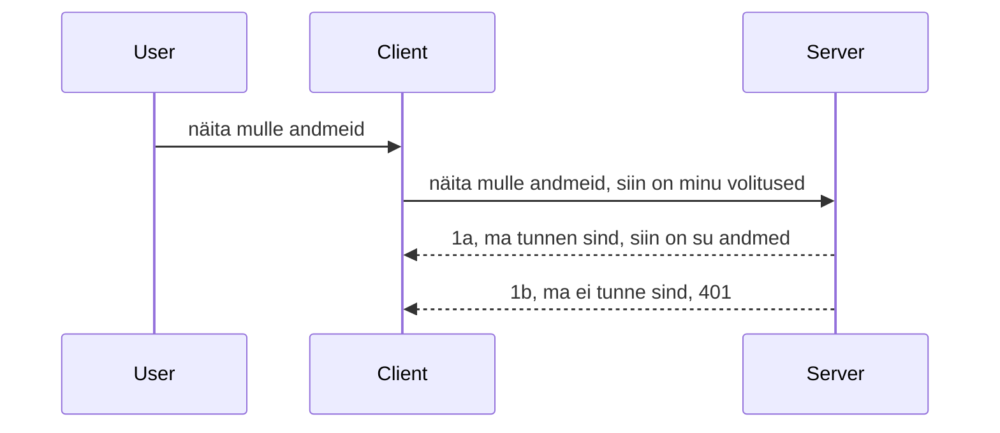

# Lihtne autentimine

MCP SDK-d toetavad OAuth 2.1 kasutamist, mis ausalt öeldes on üsna keerukas protsess, hõlmates selliseid mõisteid nagu autentimisserver, ressursside server, mandaadi saatmine, koodi saamine, koodi vahetamine bearer-tokeni vastu, kuni lõpuks saame oma ressursiandmed. Kui sa pole OAuth-iga harjunud, mis on suurepärane asi, mida rakendada, on hea mõte alustada mõne põhitaseme autentimisega ja edasi liikuda järjest parema turvalisuse suunas. Seetõttu eksisteerib see peatükk, et aidata sul jõuda edasijõudnuma autentimiseni.

## Autentimine, mida me mõtleme?

Autentimine on lühend autentimisest ja autoriseerimisest. Idee on selles, et peame tegema kahte asja:

- **Autentimine**, mis on protsess, kus selgitatakse välja, kas lubame inimesel meie majja siseneda, kas tal on õigus "siin olla" ehk kas neil on juurdepääs meie MCP Serveri funktsioonidega ressursside serverile.
- **Autoriseerimine**, mis on protsess, kus kontrollitakse, kas kasutajal peaks olema juurdepääs neile konkreetsetele ressurssidele, mida nad küsivad, näiteks need tellimused või tooted, või kas neil on lubatud sisu lugeda, kuid mitte kustutada, näiteks.

## Mandaat: kuidas me süsteemile ütleme, kes me oleme

Enamik veebiarendajaid hakkab mõtlema mandaadi esitamisele serverile, tavaliselt on see saladus, mis ütleb, kas neil on lubatud siin olla ("Autentimine"). See mandaat on tavaliselt baaskoodiga kodeeritud kasutajanime ja parooli versioon või API võti, mis unikaalselt identifitseerib konkreetse kasutaja.

Seda edastatakse tavaliselt päises nimega "Authorization" nii:

```json
{ "Authorization": "secret123" }
```

Seda nimetatakse tavaliselt baasauthentimiseks. Kuidas kogu voog siis töötab, on järgnev:


```mermaid
sequenceDiagram
   participant User
   participant Client
   participant Server

   User->>Client: näita mulle andmeid
   Client->>Server: näita mulle andmeid, siin on minu volitused
   Server-->>Client: 1a, ma tunnen sind, siin on su andmed
   Server-->>Client: 1b, ma ei tunne sind, 401 
```

Nüüd kui me mõistame, kuidas see vooluna töötab, kuidas seda rakendada? Enamik veebiservereid kasutab mõistet middleware, mis on koodilõik, mis jookseb päringu osana ja saab kontrollida mandaati ning kui mandaat on kehtiv, lubada päringul läbi minna. Kui päringul pole kehtivat mandaati, saad autentimisvea. Vaatame, kuidas seda saab rakendada:

**Python**

```python
class AuthMiddleware(BaseHTTPMiddleware):
    async def dispatch(self, request, call_next):

        has_header = request.headers.get("Authorization")
        if not has_header:
            print("-> Missing Authorization header!")
            return Response(status_code=401, content="Unauthorized")

        if not valid_token(has_header):
            print("-> Invalid token!")
            return Response(status_code=403, content="Forbidden")

        print("Valid token, proceeding...")
       
        response = await call_next(request)
        # lisa mis tahes kliendi päised või muuda vastust mingil moel
        return response


starlette_app.add_middleware(CustomHeaderMiddleware)
```

Siin me:

- Lõime middleware nimega `AuthMiddleware`, kus selle `dispatch` meetodit kutsub veebiserver.
- Lisatud middleware veebiserverile:

    ```python
    starlette_app.add_middleware(AuthMiddleware)
    ```

- Kirjutasime valideerimise loogika, mis kontrollib, kas Authorization päis on olemas ja kas saadetud saladus on kehtiv:

    ```python
    has_header = request.headers.get("Authorization")
    if not has_header:
        print("-> Missing Authorization header!")
        return Response(status_code=401, content="Unauthorized")

    if not valid_token(has_header):
        print("-> Invalid token!")
        return Response(status_code=403, content="Forbidden")
    ```

    Kui saladus on olemas ja kehtiv, siis lubame päringu läbipääsu, kutsudes `call_next` ja tagastades vastuse.

    ```python
    response = await call_next(request)
    # lisa kliendipoolseid päiseid või muuda vastust mingil moel
    return response
    ```

Tööpõhimõte on see, et kui tehakse veebipäring serverile, kutsutakse middleware ning selle rakenduse põhjal kas lubab päringu läbipääsu või tagastab vea, mis näitab, et klient ei tohi jätkata.

**TypeScript**

Siin loome middleware'i populaarse Express raamistikuga ning püüame päringu kinni enne kui see MCP Serverini jõuab. Siin on selle kood:

```typescript
function isValid(secret) {
    return secret === "secret123";
}

app.use((req, res, next) => {
    // 1. Kas autoriseerimis päis on olemas?
    if(!req.headers["Authorization"]) {
        res.status(401).send('Unauthorized');
    }
    
    let token = req.headers["Authorization"];

    // 2. Kontrolli kehtivust.
    if(!isValid(token)) {
        res.status(403).send('Forbidden');
    }

   
    console.log('Middleware executed');
    // 3. Edastab päringu järgmisesse sammusse päringu töövoos.
    next();
});
```

Selles koodis:

1. Kontrollime esmalt, kas Authorization päis on olemas, kui pole, saadame 401 vea.
2. Kontrollime, kas mandaat/token on kehtiv, kui pole, saadame 403 vea.
3. Lõpuks lubame päringu edasipääsu päringu torus ja tagastame soovitud ressursi.

## Harjutus: Rakenda autentimine

Võtame oma teadmised ja proovime autentimist rakendada. Plaan on järgmine:

Server

- Loo veebiserver ja MCP instants.
- Rakenda serverile middleware.

Klient

- Saada veebipäring, koos mandaadiga, päise kaudu.

### -1- Loo veebiserver ja MCP instants

> [!WARNING]
> Alljärgnev TypeScript näide on mõeldud MCP `2025-11-25` jaoks. See jälgib transpordid
> `mcp-session-id` järgi ja ei ole praegune `2026-07-28` transpordi näide. MCP
> `2026-07-28` kaotab `initialize` kättesaamisprotokolli ja sessiooni ID; uued
> rakendused kasutavad iseendaga kaasas käivaid päringuid. Vaata
> [Mida MCP-s on muudetud: 2026-07-28 spetsifikatsioon](../../01-CoreConcepts/mcp-2026-07-28.md).

Esimeses etapis peame looma veebiserveri instantsi ja MCP Serveri.

**Python**

Siin loome MCP serveri instantsi, teeme starlette veebirakenduse ja majutame selle uvicorniga.

```python
# MCP serveri loomine

app = FastMCP(
    name="MCP Resource Server",
    instructions="Resource Server that validates tokens via Authorization Server introspection",
    host=settings["host"],
    port=settings["port"],
    debug=True
)

# starlette veebirakenduse loomine
starlette_app = app.streamable_http_app()

# rakenduse teenindamine uvicorni kaudu
async def run(starlette_app):
    import uvicorn
    config = uvicorn.Config(
            starlette_app,
            host=app.settings.host,
            port=app.settings.port,
            log_level=app.settings.log_level.lower(),
        )
    server = uvicorn.Server(config)
    await server.serve()

run(starlette_app)
```

Selles koodis:

- Loome MCP Serveri.
- Koostame starlette veebirakenduse MCP Serverist, `app.streamable_http_app()`.
- Majutame ja serverime veebirakenduse uvicorniga `server.serve()`.

**TypeScript**

Siin loome MCP Serveri instantsi.

```typescript
const server = new McpServer({
      name: "example-server",
      version: "1.0.0"
    });

    // ... seadista serveri ressursid, tööriistad ja käsud ...
```

See MCP Serveri loomine peab toimuma POST /mcp marsruudis, niisiis võtame ülaltoodud koodi ja liigutame selle nii:

```typescript
import express from "express";
import { randomUUID } from "node:crypto";
import { McpServer } from "@modelcontextprotocol/sdk/server/mcp.js";
import { StreamableHTTPServerTransport } from "@modelcontextprotocol/sdk/server/streamableHttp.js";
import { isInitializeRequest } from "@modelcontextprotocol/sdk/types.js"

const app = express();
app.use(express.json());

// Seotud kaart transpordivahendite salvestamiseks sessiooni ID järgi
const transports: { [sessionId: string]: StreamableHTTPServerTransport } = {};

// Töötle klient-serveri suhtluse POST-päringuid
app.post('/mcp', async (req, res) => {
  // Kontrolli olemasolevat sessiooni ID-d
  const sessionId = req.headers['mcp-session-id'] as string | undefined;
  let transport: StreamableHTTPServerTransport;

  if (sessionId && transports[sessionId]) {
    // Taaskasutada olemasolevat transporti
    transport = transports[sessionId];
  } else if (!sessionId && isInitializeRequest(req.body)) {
    // Uus initsialiseerimisnõue
    transport = new StreamableHTTPServerTransport({
      sessionIdGenerator: () => randomUUID(),
      onsessioninitialized: (sessionId) => {
        // Salvesta transport sessiooni ID järgi
        transports[sessionId] = transport;
      },
      // DNS-i ümberseadistamise kaitse on tagurpidi ühilduvuse tõttu vaikimisi keelatud. Kui käitate seda serverit
      // lokaalselt, veenduge, et oleks määratud:
      // enableDnsRebindingProtection: true,
      // allowedHosts: ['127.0.0.1'],
    });

    // Puhastage transport sulgemisel
    transport.onclose = () => {
      if (transport.sessionId) {
        delete transports[transport.sessionId];
      }
    };
    const server = new McpServer({
      name: "example-server",
      version: "1.0.0"
    });

    // ... seadistage serveri ressursid, tööriistad ja viited ...

    // Ühenda MCP serveriga
    await server.connect(transport);
  } else {
    // Vigane päring
    res.status(400).json({
      jsonrpc: '2.0',
      error: {
        code: -32000,
        message: 'Bad Request: No valid session ID provided',
      },
      id: null,
    });
    return;
  }

  // Töötle päringut
  await transport.handleRequest(req, res, req.body);
});

// Taaskasutatav töötleja GET ja DELETE päringutele
const handleSessionRequest = async (req: express.Request, res: express.Response) => {
  const sessionId = req.headers['mcp-session-id'] as string | undefined;
  if (!sessionId || !transports[sessionId]) {
    res.status(400).send('Invalid or missing session ID');
    return;
  }
  
  const transport = transports[sessionId];
  await transport.handleRequest(req, res);
};

// Töötle GET päringuid serveri-klient teadete jaoks SSE kaudu
app.get('/mcp', handleSessionRequest);

// Töötle DELETE päringuid sessiooni lõpetamiseks
app.delete('/mcp', handleSessionRequest);

app.listen(3000);
```

Nüüd näed, kuidas MCP Serveri loomine viidi `app.post("/mcp")` sisse.

Liigume järgmise sammu juurde, middleware loomiseni, et saaksime saabuvat mandaati valideerida.

### -2- Rakenda middleware serverile

Järgmine osa on middleware. Loome middleware, mis otsib `Authorization` päisest mandaati ja valideerib selle. Kui see on sobiv, liigub päring edasi, et teha vajalikud toimingud (nt tööriistade nimekiri, ressurssi lugemine või muu MCP funktsionaalsus, mida klient küsib).

**Python**

Middleware loomiseks tuleb luua klass, mis pärib `BaseHTTPMiddleware`. On kaks huvitavat osa:

- Päring `request`, kust loeme päise infot.
- `call_next`, callback, mida tuleb kutsuda kui klient toob mandaadi, mida me aktsepteerime.

Esiteks käsitleme juhtumit, kui `Authorization` päis puudub:

```python
has_header = request.headers.get("Authorization")

# päist pole olemas, nurju koodiga 401, muidu jätka.
if not has_header:
    print("-> Missing Authorization header!")
    return Response(status_code=401, content="Unauthorized")
```

Siin saadame 401 loa keelamise sõnumi, kuna klient ebaõnnestub autentimisel.

Järgmine, kui mandaat on esitatud, peame kontrollima selle kehtivust nii:

```python
 if not valid_token(has_header):
    print("-> Invalid token!")
    return Response(status_code=403, content="Forbidden")
```

Märka, et ülal saadetakse 403 keelatud sõnum. Vaatame täielikku middleware allpool, mis implementeerib kõike ülalmainitut:

```python
class AuthMiddleware(BaseHTTPMiddleware):
    async def dispatch(self, request, call_next):

        has_header = request.headers.get("Authorization")
        if not has_header:
            print("-> Missing Authorization header!")
            return Response(status_code=401, content="Unauthorized")

        if not valid_token(has_header):
            print("-> Invalid token!")
            return Response(status_code=403, content="Forbidden")

        print("Valid token, proceeding...")
        print(f"-> Received {request.method} {request.url}")
        response = await call_next(request)
        response.headers['Custom'] = 'Example'
        return response

```

Suurepärane, aga mis saab `valid_token` funktsioonist? Siin on see:

```python
# ÄRA kasuta tootmises - paranda see !!
def valid_token(token: str) -> bool:
    # eemalda "Bearer " prefiks
    if token.startswith("Bearer "):
        token = token[7:]
        return token == "secret-token"
    return False
```

See võiks muidugi parem olla.

OLULINE: Selliseid salasõnu ei tohiks KUNAGI koodis hoida. Need väärtused tuleks pigem saada andmeallikast või IDP-st (identiteediteenuse pakkuja) või veel parem, lasta IDP-l valideerimine teha.

**TypeScript**

Expressi puhul peame kasutama `use` meetodit, mis võtab middleware funktsioone.

Me peame:

- Kasutama päringu objekti, et kontrollida `Authorization` omadust (mandaati).
- Valideerima mandaati ja kui sobib, lubama päringul jätkata ja lasta kliendi MCP päringul teha oma töö (nt tööriistade nimekiri, ressursi lugemine või muu MCP-ga seotud).

Siin kontrollime, kas `Authorization` päis on olemas ja kui pole, peatame päringu läbimise:

```typescript
if(!req.headers["authorization"]) {
    res.status(401).send('Unauthorized');
    return;
}
```

Kui päis puudub, saad 401.

Järgmine, kontrollime mandaadi kehtivust, kui ei sobi, peatame päringu uuesti, kuid veidi erineva sõnumiga:

```typescript
if(!isValid(token)) {
    res.status(403).send('Forbidden');
    return;
} 
```

Nüüd saad 403 vea.

Siin on kogu kood:

```typescript
app.use((req, res, next) => {
    console.log('Request received:', req.method, req.url, req.headers);
    console.log('Headers:', req.headers["authorization"]);
    if(!req.headers["authorization"]) {
        res.status(401).send('Unauthorized');
        return;
    }
    
    let token = req.headers["authorization"];

    if(!isValid(token)) {
        res.status(403).send('Forbidden');
        return;
    }  

    console.log('Middleware executed');
    next();
});
```

Kohandasime veebiserveri nii, et see aktsepteerib middleware’i mandaadi kontrollimiseks, mida klient loodetavasti saadab. Aga mis saab kliendist endast?

### -3- Saada veebipäring koos mandaadiga päise kaudu

Peame veenduma, et klient edastab mandaadi päise kaudu. Kuna kasutame MCP klienti, peame välja selgitama, kuidas seda tehakse.

**Python**

Kliendi jaoks peame edastama päise koos mandaadiga nii:

```python
# ÄRGE kodeerige väärtust kõvaketastele, hoidke see vähemalt keskkonnamuutujas või turvalisemas salvestusruumis
token = "secret-token"

async with streamablehttp_client(
        url = f"http://localhost:{port}/mcp",
        headers = {"Authorization": f"Bearer {token}"}
    ) as (
        read_stream,
        write_stream,
        session_callback,
    ):
        async with ClientSession(
            read_stream,
            write_stream
        ) as session:
            await session.initialize()
      
            # TODO, mida soovite kliendis teha, nt tööriistade nimekirja koostamine, tööriistade kutsumine jne.
```

Näed, kuidas täidame `headers` atribuuti nii: ` headers = {"Authorization": f"Bearer {token}"}`.

**TypeScript**

Saab selle lahendada kahes etapis:

1. Täida konfiguratsioon objekt oma mandaadiga.
2. Edasta konfiguratsioonobjekt transpordile.

```typescript

// Ära pane väärtust siia koodi sisse täpselt nii nagu näidatud. Vähemalt hoia see keskkonnamuutujana ja kasuta midagi sellist nagu dotenv (arendusrežiimis).
let token = "secret123"

// määra kliendi transpordi valikute objekt
let options: StreamableHTTPClientTransportOptions = {
  sessionId: sessionId,
  requestInit: {
    headers: {
      "Authorization": "secret123"
    }
  }
};

// saada valikute objekt transpordile üle
async function main() {
   const transport = new StreamableHTTPClientTransport(
      new URL(serverUrl),
      options
   );
```

Nüüd näed, kuidas loomulikult tuli luua `options` objekt ja panna päised `requestInit` omaduse alla.

OLULINE: Kuidas seda paremaks teha? Praegusel rakendusel on probleeme. Esiteks on mandaadi edastamine nii riskantne kui sul pole vähemalt HTTPS. Isegi siis võib mandaat varastada, seega vajad süsteemi, kus saab lihtsalt tokeni tühistada ja lisada täiendavaid kontrolle nagu asukoht maailmas, kõne sagedus (roboti käitumine) jne, lühidalt, palju probleeme, mis vajavad lahendust.

Tuleb öelda, et väga lihtsate API-de puhul, kus sa ei taha, et keegi sinu API-d kutsub ilma autentimiseta, on see hea algus.

Sellega seoses proovime turvalisust veidi tugevdada, kasutades standardset formaati, nagu JSON Web Token, tuntud ka kui JWT või "JOT" tokenid.

## JSON Web Tokenid, JWT

Proovime parandada lihtsaid mandaate edasijõudnuma lahendusega JWT abil. Millised on kohesed paranemised JWT kasutamisel?

- **Turvalisuse paranemine**. Baasauth-is saadad kasutajanime ja parooli base64 kodeeritud tokenina (või API võtmena) ikka ja jälle, mis suurendab riski. JWT puhul saad kasutajanime ja parooli ning saad tokeni vastu, mis on ajaliselt piiratud ja aegub. JWT võimaldab hõlpsasti kasutada täpsemaid juurdepääsukontrolle nagu rollid, ulatused ja õigused.
- **Olemitus ja skaleeritavus**. JWT-d on iseseisvad, kannavad kogu kasutaja informatsiooni ja välistavad vajaduse serveripoolse sessioonisalvestuse järele. Tokenit saab valideerida lokaalselt.
- **Ühilduvus ja föderatsioon**. JWT-d on OpenID Connect keskmes ja neid kasutatakse tuntud identiteediteenuse pakkujatega nagu Entra ID, Google Identity ja Auth0. Nad võimaldavad ühe sisselogimise (SSO) ja palju muud, tehes selle ettevõtteklassi lahenduseks.
- **Moodulaarsus ja paindlikkus**. JWT-d saab kasutada ka API Gateway-dega nagu Azure API Management, NGINX ja teised. Need toetavad kasutaja autentimist ja serveri-teenuse suhtlust, sh esindamise ja volitamise stsenaariume.
- **Jõudlus ja vahemälu**. JWT-sid saab pärast dekodeerimist vahemällu panna, mis vähendab vajadust iga kord parsimiseks. See aitab eriti suure liiklusega rakendustes, parandades läbilaskevõimet ja vähendades infrastruktuurikoormust.
- **Täiustatud omadused**. Toetab introspektiooni (kehtivuse kontroll serveris) ja tühistamist (tokeni kehtetuks muutmist).

Kõik need eelised arvesse võttes vaatame, kuidas võtta meie rakendus järgmisele tasemele.

## Muutame baasauth-i JWT-ks

Peamised muudatused on:

- **Õppida JWT tokeni koostamist** ja teha see valmis saatmiseks kliendilt serverile.
- **JWT tokeni valideerimine**, ja kui kehtib, lubada kliendil juurdepääs meie ressurssidele.
- **Tokeni turvaline hoidmine**. Kuidas seda tokenit salvestada.
- **Marsruutide kaitsmine**. Peame kaitsma marsruute ning konkreetseid MCP funktsioone.
- **Lisada värskendustokenid**. Tagada, et loome lühikese kehtivusajaga tokenid, aga ka pikema kehtivusajaga värskendustokenid, mida saab kasutada uute tokenite saamiseks kui vanad aeguvad. Samuti peab olema värskenduspunkt ja rotatsioonistrateegia.

### -1- Koosta JWT token

JWT token koosneb järgmistest osadest:

- **Päis**, algoritm ja tokeni tüüp.
- **Koorem**, väited, nagu sub (kasutaja või üksus, keda token esindab, tavaliselt kasutaja ID), exp (aegumistähtaeg), roll (rolli nimi).
- **Allkiri**, allkirjastatud saladuse või privaatvõtmega.

Selleks vajame päise, koorma ja kodeeritud tokeni koostamist.

**Python**

```python

import jwt
import jwt
from jwt.exceptions import ExpiredSignatureError, InvalidTokenError
import datetime

# Salajane võti, mida kasutatakse JWT allkirjastamiseks
secret_key = 'your-secret-key'

header = {
    "alg": "HS256",
    "typ": "JWT"
}

# kasutaja info, selle nõuded ja aegumisaeg
payload = {
    "sub": "1234567890",               # Teema (kasutaja ID)
    "name": "User Userson",                # Kohandatud nõue
    "admin": True,                     # Kohandatud nõue
    "iat": datetime.datetime.utcnow(),# Väljaandmise aeg
    "exp": datetime.datetime.utcnow() + datetime.timedelta(hours=1)  # Aegumine
}

# kodeeri see
encoded_jwt = jwt.encode(payload, secret_key, algorithm="HS256", headers=header)
```

Ülaltoodud koodis me:

- Määratlesime päise, kasutades algoritmiks HS256 ja tüübiks JWT.
- Koostasime koorma, mis sisaldab teemat või kasutaja ID-d, kasutajanime, rolli, väljastamise aega ja aegumisaega, implementeerides sellega mainitud ajaga piiratud aspekti.

**TypeScript**

Selle jaoks vajame sõltuvusi, mis aitavad meil JWT tokeni koostada.

Sõltuvused

```sh

npm install jsonwebtoken
npm install --save-dev @types/jsonwebtoken
```

Nüüd loome päise, koorma ja nende põhjal kodeeritud tokeni.

```typescript
import jwt from 'jsonwebtoken';

const secretKey = 'your-secret-key'; // Kasuta tootmises keskkonnamuutujaid

// Määra sisu
const payload = {
  sub: '1234567890',
  name: 'User usersson',
  admin: true,
  iat: Math.floor(Date.now() / 1000), // Väljastatud
  exp: Math.floor(Date.now() / 1000) + 60 * 60 // Aegub 1 tunni pärast
};

// Määra päis (valikuline, jsonwebtoken seab vaikimisi)
const header = {
  alg: 'HS256',
  typ: 'JWT'
};

// Loo token
const token = jwt.sign(payload, secretKey, {
  algorithm: 'HS256',
  header: header
});

console.log('JWT:', token);
```

See token on:

Allkirjastatud HS256-ga
Kehtib 1 tund
Sisaldab väiteid nagu sub, name, admin, iat ja exp.

### -2- Valideeri token

Peame ka tokeni valideerima, mida tuleb teha serveris, et veenduda, et klient saadab meile kehtiva tokeni. Peaksime kontrollima nii selle struktuuri kui kehtivust. Soovitatav on lisada ka muud kontrollid, nt kas kasutaja on sinu süsteemis jne.

Tokeni valideerimiseks peame selle dekodeerima, et lugeda ja siis kontrollida kehtivust:

**Python**

```python

# Dekodeeri ja kontrolli JWT-d
try:
    decoded = jwt.decode(token, secret_key, algorithms=["HS256"])
    print("✅ Token is valid.")
    print("Decoded claims:")
    for key, value in decoded.items():
        print(f"  {key}: {value}")
except ExpiredSignatureError:
    print("❌ Token has expired.")
except InvalidTokenError as e:
    print(f"❌ Invalid token: {e}")

```


Selles koodis kutsume `jwt.decode` kasutades sisendina tokenit, salajast võtit ja valitud algoritmi. Pange tähele, et kasutame try-catch konstruktsiooni, kuna ebaõnnestunud valideerimine toob kaasa vea tekkimise.

**TypeScript**

Siin peame kutsuma `jwt.verify`, et saada tokeni dekrüpteeritud versioon, mida saame edasi analüüsida. Kui see väljakutse ebaõnnestub, tähendab see, et tokeni struktuur on vale või see pole enam kehtiv.

```typescript

try {
  const decoded = jwt.verify(token, secretKey);
  console.log('Decoded Payload:', decoded);
} catch (err) {
  console.error('Token verification failed:', err);
}
```

MÄRKUS: nagu varem mainitud, peaksime tegema täiendavaid kontrolle, et veenduda, et see token viitab meie süsteemis olevale kasutajale ning et kasutajal on õigused, mida ta väidab omavat.

Järgmisena vaatleme rollipõhist juurdepääsukontrolli, tuntud ka kui RBAC.

## Rollipõhise juurdepääsukontrolli lisamine

Mõte on selles, et me tahame väljendada, et erinevatel rollidel on erinevad õigused. Näiteks eeldame, et administraator saab kõike teha, tavaline kasutaja saab lugeda/kirjutada ja külaline saab ainult lugeda. Seega mõned võimalikud õigustasemed on:

- Admin.Write
- User.Read
- Guest.Read

Vaatame, kuidas saame sellise kontrolli rakendada vahevara (middleware) abil. Vahevara saab lisada nii teekonna (route) kaupa kui ka kõikidele teekondadele.

**Python**

```python
from starlette.middleware.base import BaseHTTPMiddleware
from starlette.responses import JSONResponse
import jwt

# ÄRA hoia saladust koodis nagu see, see on ainult demonstratsioonieesmärkidel. Loe seda turvalisest kohast.
SECRET_KEY = "your-secret-key" # pane see keskkonnamuutujasse
REQUIRED_PERMISSION = "User.Read"

class JWTPermissionMiddleware(BaseHTTPMiddleware):
    async def dispatch(self, request, call_next):
        auth_header = request.headers.get("Authorization")
        if not auth_header or not auth_header.startswith("Bearer "):
            return JSONResponse({"error": "Missing or invalid Authorization header"}, status_code=401)

        token = auth_header.split(" ")[1]
        try:
            decoded = jwt.decode(token, SECRET_KEY, algorithms=["HS256"])
        except jwt.ExpiredSignatureError:
            return JSONResponse({"error": "Token expired"}, status_code=401)
        except jwt.InvalidTokenError:
            return JSONResponse({"error": "Invalid token"}, status_code=401)

        permissions = decoded.get("permissions", [])
        if REQUIRED_PERMISSION not in permissions:
            return JSONResponse({"error": "Permission denied"}, status_code=403)

        request.state.user = decoded
        return await call_next(request)


```

On mõned erinevad viisid, kuidas vahevara lisada järgmiselt:

```python

# Variant 1: lisa vahevara Starlette rakenduse loomisel
middleware = [
    Middleware(JWTPermissionMiddleware)
]

app = Starlette(routes=routes, middleware=middleware)

# Variant 2: lisa vahevara pärast Starlette rakenduse loomist
starlette_app.add_middleware(JWTPermissionMiddleware)

# Variant 3: lisa vahevara iga marsruudi jaoks
routes = [
    Route(
        "/mcp",
        endpoint=..., # töötleja
        middleware=[Middleware(JWTPermissionMiddleware)]
    )
]
```

**TypeScript**

Võime kasutada `app.use` ja vahevara, mis jookseb kõigi päringute jaoks.

```typescript
app.use((req, res, next) => {
    console.log('Request received:', req.method, req.url, req.headers);
    console.log('Headers:', req.headers["authorization"]);

    // 1. Kontrolli, kas autoriseerimise päis on saadetud

    if(!req.headers["authorization"]) {
        res.status(401).send('Unauthorized');
        return;
    }
    
    let token = req.headers["authorization"];

    // 2. Kontrolli, kas token on kehtiv
    if(!isValid(token)) {
        res.status(403).send('Forbidden');
        return;
    }  

    // 3. Kontrolli, kas tokeni kasutaja eksisteerib meie süsteemis
    if(!isExistingUser(token)) {
        res.status(403).send('Forbidden');
        console.log("User does not exist");
        return;
    }
    console.log("User exists");

    // 4. Kontrolli, kas tokenil on õiged load
    if(!hasScopes(token, ["User.Read"])){
        res.status(403).send('Forbidden - insufficient scopes');
    }

    console.log("User has required scopes");

    console.log('Middleware executed');
    next();
});

```

On mitmeid asju, mida meie vahevara saab ja PEAB tegema, nimelt:

1. Kontrollima, kas autoriseerimise päis on olemas
2. Kontrollima, kas token on kehtiv, kutsume `isValid` meetodit, mille me kirjutasime, et kontrollida JWT tokeni terviklikkust ja kehtivust.
3. Kontrollima, kas kasutaja eksisteerib meie süsteemis, seda peaksime kontrollima.

   ```typescript
    // kasutajad andmebaasis
   const users = [
     "user1",
     "User usersson",
   ]

   function isExistingUser(token) {
     let decodedToken = verifyToken(token);

     // TEGEMISSE, kontrolli, kas kasutaja eksisteerib andmebaasis
     return users.includes(decodedToken?.name || "");
   }
   ```

   Ülal oleme loonud väga lihtsa `users` nimekirja, mis peaks loomulikult olema andmebaasis.

4. Lisaks peaksime kontrollima, et tokenil on õiged õigused.

   ```typescript
   if(!hasScopes(token, ["User.Read"])){
        res.status(403).send('Forbidden - insufficient scopes');
   }
   ```

   Ülaltoodud koodis vahevarast kontrollime, et token sisaldab User.Read õigust, kui mitte, saadame 403 vea. Allpool on `hasScopes` abimeetod.

   ```typescript
   function hasScopes(scope: string, requiredScopes: string[]) {
     let decodedToken = verifyToken(scope);
    return requiredScopes.every(scope => decodedToken?.scopes.includes(scope));
  }
   ```

Have a think which additional checks you should be doing, but these are the absolute minimum of checks you should be doing.

Using Express as a web framework is a common choice. There are helpers library when you use JWT so you can write less code.

- `express-jwt`, helper library that provides a middleware that helps decode your token.
- `express-jwt-permissions`, this provides a middleware `guard` that helps check if a certain permission is on the token.

Here's what these libraries can look like when used:

```typescript
const express = require('express');
const jwt = require('express-jwt');
const guard = require('express-jwt-permissions')();

const app = express();
const secretKey = 'your-secret-key'; // put this in env variable

// Decode JWT and attach to req.user
app.use(jwt({ secret: secretKey, algorithms: ['HS256'] }));

// Check for User.Read permission
app.use(guard.check('User.Read'));

// multiple permissions
// app.use(guard.check(['User.Read', 'Admin.Access']));

app.get('/protected', (req, res) => {
  res.json({ message: `Welcome ${req.user.name}` });
});

// Error handler
app.use((err, req, res, next) => {
  if (err.code === 'permission_denied') {
    return res.status(403).send('Forbidden');
  }
  next(err);
});

```

Nüüd, kui olete näinud, kuidas vahevara saab kasutada nii autentimiseks kui ka autoriseerimiseks, siis kuidas on lood MCP-ga? Kas see muudab, kuidas auth toimub? Vaatame järgmises jaotises.

### -3- Lisa RBAC MCP-le

Olete seni näinud, kuidas saab RBAC-i lisada vahevara kaudu, kuid MCP puhul pole lihtsat võimalust lisada RBAC-i iga MCP funktsiooni jaoks eraldi, mida me siis teeme? Peame lihtsalt lisama sellise koodi, mis kontrollib, kas klientil on õigus kutsuda konkreetset tööriista:

Teil on mitu erinevat valikut, kuidas teostada RBAC iga funktsiooni kohta, siin on mõned:

- Lisa kontroll iga tööriista, ressursi, prompti jaoks, kus on vaja kontrollida õigustaset.

   **python**

   ```python
   @tool()
   def delete_product(id: int):
      try:
          check_permissions(role="Admin.Write", request)
      catch:
        pass # klient ebaõnnestus autoriseerimisel, tõsta autoriseerimisviga
   ```

   **typescript**

   ```typescript
   server.registerTool(
    "delete-product",
    {
      title: Delete a product",
      description: "Deletes a product",
      inputSchema: { id: z.number() }
    },
    async ({ id }) => {
      
      try {
        checkPermissions("Admin.Write", request);
        // teha, saata id productService'ile ja kaugreale
      } catch(Exception e) {
        console.log("Authorization error, you're not allowed");  
      }

      return {
        content: [{ type: "text", text: `Deletected product with id ${id}` }]
      };
    }
   );
   ```


- Kasuta arenenud serveri lähenemist ja päringute käitlejaid, et minimeerida kohtade arvu, kus tuleb kontroll läbi viia.

   **Python**

   ```python
   
   tool_permission = {
      "create_product": ["User.Write", "Admin.Write"],
      "delete_product": ["Admin.Write"]
   }

   def has_permission(user_permissions, required_permissions) -> bool:
      # user_permissions: nimekiri kasutaja õigustest
      # required_permissions: nimekiri tööriista jaoks vajaminevatest õigustest
      return any(perm in user_permissions for perm in required_permissions)

   @server.call_tool()
   async def handle_call_tool(
     name: str, arguments: dict[str, str] | None
   ) -> list[types.TextContent]:
    # Oletame, et request.user.permissions on nimekiri kasutaja õigustest
     user_permissions = request.user.permissions
     required_permissions = tool_permission.get(name, [])
     if not has_permission(user_permissions, required_permissions):
        # Viska viga "Teil puudub luba tööriista {name} kutsumiseks"
        raise Exception(f"You don't have permission to call tool {name}")
     # Jätka ja kutsu tööriista
     # ...
   ```   
   

   **TypeScript**

   ```typescript
   function hasPermission(userPermissions: string[], requiredPermissions: string[]): boolean {
       if (!Array.isArray(userPermissions) || !Array.isArray(requiredPermissions)) return false;
       // Tagasta true, kui kasutajal on vähemalt üks nõutav õigused
       
       return requiredPermissions.some(perm => userPermissions.includes(perm));
   }
  
   server.setRequestHandler(CallToolRequestSchema, async (request) => {
      const { params: { name } } = request;
  
      let permissions = request.user.permissions;
  
      if (!hasPermission(permissions, toolPermissions[name])) {
         return new Error(`You don't have permission to call ${name}`);
      }
  
      // jätka...
   });
   ```

   Pane tähele, et sul tuleb tagada, et su vahevara omistab dekrüpteeritud tokeni päringu user atribuudile, et ülaltoodud kood oleks lihtsustatud.

### Kokkuvõtteks

Nüüd, kui oleme arutanud, kuidas üldiselt ja eriti MCP puhul lisada toetust RBAC-ile, on aeg proovida ise turvalisust rakendada, et veenduda, et mõisted on selged.

## Ülesanne 1: Ehita MCP server ja MCP klient kasutades lihtsat autentimist

Siin kasutad seda, mida oled õppinud, kuidas edastada mandaate päiste kaudu.

## Lahendus 1

[Lahendus 1](./code/basic/README.md)

## Ülesanne 2: Täienda ülesande 1 lahendust kasutamaks JWT-d

Võta esimene lahendus, kuid seekord parendame seda.

Kasutame Basic Auth asemel JWT-d.

## Lahendus 2

[Lahendus 2](./solution/jwt-solution/README.md)

## Väljakutse

Lisa RBAC iga tööriista jaoks, nagu on kirjeldatud jaotises "Lisa RBAC MCP-le".

## Kokkuvõte

Loodetavasti oled selles peatükis palju õppinud: alustades turvata midagi, põhikaitsega, JWT-st ja kuidas see MCP-le lisada.

Oleme loonud tugeva aluse kohandatud JWT-dega, kuid kui me skaleerume, liigume standarditel põhineva identiteedimudeli poole. Sellise IdP nagu Entra või Keycloak kasutuselevõtt võimaldab meil tokenite väljastamise, valideerimise ja elutsükli halduse usaldusväärsele platvormile üle anda — vabastades meid keskendumast rakenduse loogikale ja kasutajakogemusele.

Selle jaoks on meil põhjalikum [edasijõudnute peatükk Entra kohta](../../05-AdvancedTopics/mcp-security-entra/README.md)

## Mis järgmiseks

- Järgmine: [MCP hostide seadistamine](../12-mcp-hosts/README.md)

---

<!-- CO-OP TRANSLATOR DISCLAIMER START -->
**Lahtiütlus**:
See dokument on tõlgitud kasutades AI tõlketeenust [Co-op Translator](https://github.com/Azure/co-op-translator). Kuigi me püüdleme täpsuse poole, palun pange tähele, et automatiseeritud tõlgetes võib esineda vigu või ebatäpsusi. Originaaldokument selle emakeeles tuleks pidada autoriteetseks allikaks. Olulise teabe puhul soovitatakse kasutada professionaalset inimtõlget. Me ei vastuta selle tõlkega seotud eksimustest või valesti mõistmistest.
<!-- CO-OP TRANSLATOR DISCLAIMER END -->