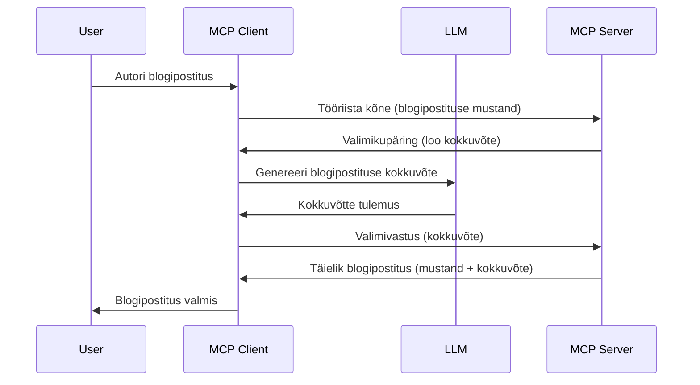

> [!WARNING]
> Valimi võtmine on MCP-s `2026-07-28` aegunud. See õppetund on säilitatud
> varasemate rakenduste jaoks. Uued serverid peaksid integreerima otse LLM-i
> pakkuja API-ga.

# Valimi võtmine – funktsioonide delegeerimine kliendile

> Valimi võtmine on säilinud `2026-07-28` spetsifikatsioonis ühilduvuse tõttu ning see on
> eemaldamiseks esimese ülevaatuse ajal, mis avaldatakse 28. juulil 2027 või hiljem.
> Selle õppetunni näited võivad kasutada SDK API-sid, mis rakendavad `2025-11-25`.
> Vaata [Mis on MCP-s muutunud: 2026-07-28 spetsifikatsioon](../../01-CoreConcepts/mcp-2026-07-28.md).

Varasemates rakendustes võimaldab valimi võtmine MCP serveril paluda abi kliendi hallatavalt LLM-ilt.
Uute rakenduste puhul kutsu valitud LLM-i pakkujat otse.


## Ülevaade

Selles õppetükis keskendume seletamisele, millal ja kus valimi võtmist kasutada ning kuidas seda seadistada.

## Õpieesmärgid

Selles peatükis:

- Selgitame, mis on valimi võtmine ja millal seda kasutada.
- Näitame, kuidas MCP-s valimi võtmist seadistada.
- Anname näiteid valimi võtmisest tegevuses.

## Mis on valimi võtmine ja miks seda kasutada?

Valimi võtmine on täiustatud funktsioon, mis töötab järgmiselt:



### Valimi taotlus

Okei, nüüd on meil üldine ülevaade usutavast stsenaariumist, räägime serveri kliendile tagastatavast valimi taotlusest. Siin on, kuidas selline taotlus võib JSON-RPC vormingus välja näha:

```json
{
  "jsonrpc": "2.0",
  "id": 1,
  "method": "sampling/createMessage",
  "params": {
    "messages": [
      {
        "role": "user",
        "content": {
          "type": "text",
          "text": "Create a blog post summary of the following blog post: <BLOG POST>"
        }
      }
    ],
    "modelPreferences": {
      "hints": [
        {
          "name": "claude-3-sonnet"
        }
      ],
      "intelligencePriority": 0.8,
      "speedPriority": 0.5
    },
    "systemPrompt": "You are a helpful assistant.",
    "maxTokens": 100
  }
}
```

Siin on mõned tähelepanuväärsed punktid:

- Taust, sisu -> tekst, on meie juhis, mis annab LLM-ile ülesande kokku võtta blogipostituse sisu.

- **mudeliEelistused**. See osa on eelistus, soovitus, millist seadistust LLM-iga kasutada. Kasutaja saab valida, kas järgida neid soovitusi või neid muuta. Selles näites on soovitused mudeli, kiiruse ja intelligentsuse prioriteedi kohta.
- **süsteemiJuhis**, see on tavapärane süsteemi juhis, mis annab Sinu LLM-ile isikupära ja sisaldab juhiseid.
- **maxTokenid**, see on veel üks omadus, mis ütleb, mitu tokenit on selle ülesande jaoks soovitatav kasutada.

### Valimi vastus

See vastus on see, mida MCP klient lõpuks MCP serverile tagastab ning on tulemus kliendi LLM-i kutsumisest, selle vastuse ootamisest ja sõnumi koostamisest. Siin on, kuidas see JSON-RPC-s välja näeb:

```json
{
  "jsonrpc": "2.0",
  "id": 1,
  "result": {
    "role": "assistant",
    "content": {
      "type": "text",
      "text": "Here's your abstract <ABSTRACT>"
    },
    "model": "gpt-5",
    "stopReason": "endTurn"
  }
}
```

Pane tähele, et vastus on blogipostituse kokkuvõte, nagu me palusime. Samuti pane tähele, et kasutatud mudel pole see, mida me palusime, vaid "gpt-5" "claude-3-sonnet" asemel. See illustreerib, et kasutaja võib oma meelt muuta ja valimi taotlus on soovitus.

Okei, nüüd kui mõistame põhilist protsessi ja kasulikku ülesannet "blogipostituse loomine + kokkuvõte", vaatame, mida peame tegema, et see töötaks.

### Sõnumi tüübid

Valimi sõnumid ei piirdu ainult tekstiga, vaid saadetakse ka pilte ja heli. Siin on, kuidas JSON-RPC erineb:

**Tekst**

```json
{
  "type": "text",
  "text": "The message content"
}
```

**Pildisisu**

```json
{
  "type": "image",
  "data": "base64-encoded-image-data",
  "mimeType": "image/jpeg"
}
```

**Helisisu**

```json
{
  "type": "audio",
  "data": "base64-encoded-audio-data",
  "mimeType": "audio/wav"
}
```

> MÄRKUS: Praeguse staatuse ja migratsioonijuhiste jaoks vaata
> [aegunud valimi võtmise dokumentatsiooni](https://modelcontextprotocol.io/specification/2026-07-28/client/sampling).

## Kuidas seadistada valimi võtmist kliendis

> Märkus: kui Sa ehitad ainult serverit, pole siin palju vaja teha.

Kliendis pead määrama järgmise funktsiooni järgmiselt:

```json
{
  "capabilities": {
    "sampling": {}
  }
}
```

See võetakse seejärel arvesse, kui valitud klient serveriga algatatakse.

## Näide valimi võtmisest tegevuses – loo blogipostitus

Koodime koos valimi serveri, teeme järgmised sammud:

1. Loo tööriist serveris.
1. See tööriist peaks looma valimi taotluse.
1. Tööriist peaks ootama kliendi valimi taotluse vastust.
1. Seejärel peaks tööriista tulemus valmima.

Vaatame koodi samm-sammult:

### -1- Loo tööriist

**python**

```python
@mcp.tool()
async def create_blog(title: str, content: str, ctx: Context[ServerSession, None]) -> str:
    """Create a blog post and generate a summary"""

```

### -2- Loo valimi taotlus

Lisa tööriistale järgmine kood:

**python**

```python
post = BlogPost(
        id=len(posts) + 1,
        title=title,
        content=content,
        abstract=""
    )

prompt = f"Create an abstract of the following blog post: title: {title} and draft: {content} "

result = await ctx.session.create_message(
        messages=[
            SamplingMessage(
                role="user",
                content=TextContent(type="text", text=prompt),
            )
        ],
        max_tokens=100,
)

```

### -3- Oota vastust ja tagasta see

**python**

```python
post.abstract = result.content.text

posts.append(post)

# tagasta täielik toode
return json.dumps({
    "id": post.title,
    "abstract": post.abstract
})
```

### -4- Täiskood

**python**

```python
from starlette.applications import Starlette
from starlette.routing import Mount, Host

from mcp.server.fastmcp import Context, FastMCP

from mcp.server.session import ServerSession
from mcp.types import SamplingMessage, TextContent

import json


from uuid import uuid4
from typing import List
from pydantic import BaseModel


mcp = FastMCP("Blog post generator")

# app = FastAPI()

posts = []

class BlogPost(BaseModel):
    id: int
    title: str
    content: str
    abstract: str

posts: List[BlogPost] = []

@mcp.tool()
async def create_blog(title: str, content: str, ctx: Context[ServerSession, None]) -> str:
    """Create a blog post and generate a summary"""

    post = BlogPost(
        id=len(posts) + 1,
        title=title,
        content=content,
        abstract=""
    )

    prompt = f"Create an abstract of the following blog post: title: {title} and draft: {content} "

    result = await ctx.session.create_message(
        messages=[
            SamplingMessage(
                role="user",
                content=TextContent(type="text", text=prompt),
            )
        ],
        max_tokens=100,
    )

    post.abstract = result.content.text

    posts.append(post)

    # tagasta täielik blogipostitus
    return json.dumps({
        "id": post.title,
        "abstract": post.abstract
    })

if __name__ == "__main__":
    print("Starting server...")
    # mcp.run()
    mcp.run(transport="streamable-http")

# käivita rakendus käsuga: python server.py
```

### -5- Testimine Visual Studio Code'is

Selle testimiseks Visual Studio Code'is tee järgmist:

1. Käivita server terminalis.
1. Lisa see *mcp.json*-i (ja veendu, et see oleks käivitatud), näiteks nii:

   ```json
   "servers": {
      "blog-server": {
        "type": "http",
        "url": "http://localhost:8000/mcp"
      }
   }
   ```

1. Sisesta päring:

   ```text
   create a blog post named "Where Python comes from", the content is "Python is actually named after Monty Python Flying Circus"
   ```

1. Luba valimi võtmise toimimine. Esmakordsel testimisel esitatakse Sulle täiendav dialoog, mille pead aktsepteerima, seejärel näed tavalist dialoogi tööriista käivitamiseks.

1. Kontrolli tulemusi. Näed tulemusi nii GitHub Copilot Chat'is ilusti kujundatult kui ka saad uurida toore JSON vastust.

**Boonus**. Visual Studio Code tööriistad toetavad valimi võtmist suurepäraselt. Sa saad seadistada valimi võtmise ligipääsu oma paigaldatud serveris, navigeerides nii:

1. Mine laienduste sektsiooni.
1. Vali hammasratta ikoon oma paigaldatud serveri juures jaotises "MCP SERVERID – PAIGALDATUD".
1. Vali "Konfigureeri mudeli ligipääsu", siin saad valida, milliseid mudeleid GitHub Copilot tohib valimi võtmisel kasutada. Saad ka vaadata kõiki hiljutisi valimi taotlusi, valides "Näita valimi taotlusi".

## Ülesanne

Selles ülesandes ehitad veidi erineva valimi võtmise integratsiooni, mis toetab toote kirjelduse genereerimist. Siin on Sinu stsenaarium:

**Stsenaarium**: E-kaubanduse back office töötaja vajab abi, toodete kirjelduste genereerimine võtab liiga kaua aega. Seetõttu pead looma lahenduse, kus saad tööriista "create_product" kutsuda parameetritega "title" ja "keywords" ja see peaks tootma täieliku toote, sealhulgas välja "description", mille täidab kliendi LLM.

NÕUANNE: kasuta varasematest õppetundidest õpitud teadmisi, et konstrueerida see server ja tööriist valimi taotlust kasutades.

## Lahendus

[Lahendus](./solution/README.md)

## Peamised järeldused

Valimi võtmine on võimas funktsioon, mis võimaldab serveril delegeerida ülesandeid kliendile, kui on vaja LLM-i abi.

## Mis järgmiseks

- [Peatükk 4 – Praktiline rakendus](../../04-PracticalImplementation/README.md)

---

<!-- CO-OP TRANSLATOR DISCLAIMER START -->
**Lahtiütlus**:
See dokument on tõlgitud kasutades AI tõlketeenust [Co-op Translator](https://github.com/Azure/co-op-translator). Kuigi me püüdleme täpsuse poole, palun pange tähele, et automatiseeritud tõlgetes võib esineda vigu või ebatäpsusi. Originaaldokument selle emakeeles tuleks pidada autoriteetseks allikaks. Olulise teabe puhul soovitatakse kasutada professionaalset inimtõlget. Me ei vastuta selle tõlkega seotud eksimustest või valesti mõistmistest.
<!-- CO-OP TRANSLATOR DISCLAIMER END -->