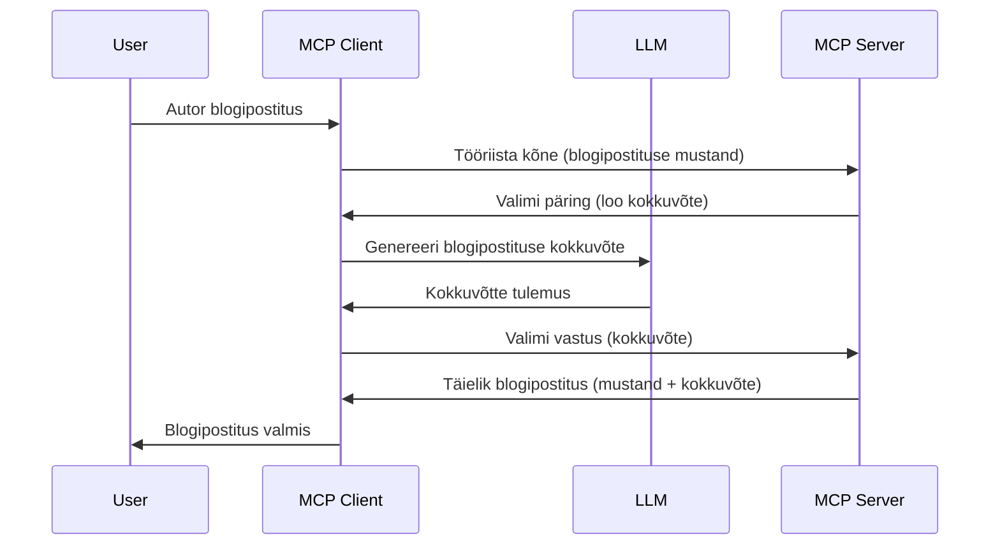

# Proovivõtt – delegeeri funktsioonid kliendile

> **Sobivuse lõppemise teade:** MCP spetsifikatsiooni „2026-07-28“ väljaandmise katseväljaanne märgib proovivõtu aegunuks eelistatava otsepöörde LLM-i pakkujate API-dega integreerimiseks. Proovivõtt töötab endiselt versioonis `2025-11-25` ning vähemalt aasta pärast ametlikku aegumist, seega on selles õppetükis toodud info endiselt kehtiv — kuid uued serveri kujundused peaksid hindama asendusmustrid. Vaata lähemalt: [MCP-s toimuvad muudatused: 2026-07-28 väljaandmise katseväljaanne](../../01-CoreConcepts/mcp-2026-07-28-release-candidate.md).

Mõnikord on vaja, et MCP klient ja MCP server teeksid koostööd ühise eesmärgi saavutamiseks. Võib juhtuda, et serveril on vaja abi kliendis olevast LLM-ist. Sellisel juhul tuleks kasutada proovivõttu.

Vaatame mõningaid kasutusjuhtumeid ja kuidas proovivõtuga lahendust üles ehitada.

## Ülevaade

Selles õppetükis keskendume proovivõtu kasutamise aegadele ja kohtadele ning selle seadistamisele.

## Õpieesmärgid

Selles peatükis:

- Selgitame, mis on proovivõtt ja millal seda kasutada.
- Näitame, kuidas MCP-s proovivõttu seadistada.
- Anname näiteid proovivõtu rakendamisest.

## Mis on proovivõtt ja miks seda kasutada?

Proovivõtt on täiustatud funktsioon, mis töötab järgmiselt:



### Proovivõtu päring

Ok, nüüd on meil üldine ülevaade usaldusväärsest stsenaariumist, räägime proovivõtu päringust, mille server kliendile tagasi saadab. Selline päring võib JSON-RPC vormingus välja näha järgmiselt:

```json
{
  "jsonrpc": "2.0",
  "id": 1,
  "method": "sampling/createMessage",
  "params": {
    "messages": [
      {
        "role": "user",
        "content": {
          "type": "text",
          "text": "Create a blog post summary of the following blog post: <BLOG POST>"
        }
      }
    ],
    "modelPreferences": {
      "hints": [
        {
          "name": "claude-3-sonnet"
        }
      ],
      "intelligencePriority": 0.8,
      "speedPriority": 0.5
    },
    "systemPrompt": "You are a helpful assistant.",
    "maxTokens": 100
  }
}
```

Märkimist väärivad mõned aspektid:

- Tekstipõhine prompt, sees sisus -> tekst, on meie LLM-ile suunatud juhis, et kokku võtta blogipostituse sisu.

- **modelPreferences**. See sektsioon ongi see – eelistus, soovitus, millist konfiguratsiooni LLM-iga kasutada. Kasutaja võib otsustada, kas neid soovitusi järgida või muuta. Siin on soovitatud mudel, kiirus ja intelligentsuse prioriteet.
- **systemPrompt**, see on tavaline süsteemi prompt, mis annab Sinu LLM-ile isiksuse ja sisaldab juhiseid.
- **maxTokens**, see on teine omadus, mis näitab, mitu tokenit antud ülesande jaoks on soovitatav kasutada.

### Proovivõtu vastus

See vastus on see, mida MCP klient lõpuks MCP serverile tagasi saadab ning see tekib siis, kui klient kutsub LLM-i, ootab vastust ja koostab selle sõnumi. JSON-RPC vormingus võib see välja näha nii:

```json
{
  "jsonrpc": "2.0",
  "id": 1,
  "result": {
    "role": "assistant",
    "content": {
      "type": "text",
      "text": "Here's your abstract <ABSTRACT>"
    },
    "model": "gpt-5",
    "stopReason": "endTurn"
  }
}
```

Pane tähele, et vastus on blogipostituse kokkuvõte, täpselt nagu küsisime. Samuti märka, kuidas kasutatud mudeliks on „gpt-5“, mitte "claude-3-sonnet", nagu palusime. See näitab, et kasutaja võib soovid muuta ning Sinu proovivõtu päring on soovitus.

Nüüd, kui peamine töövoog on selge ja kasulik ülesanne "blogipostituse loomine + kokkuvõte" on teada, vaatame, mida on vaja selle töölepanekuks.

### Sõnumitüübid

Proovivõtuga sõnumeid ei pea piirduma ainult tekstiga, saad saata ka pilte ja heli. Näiteks näeb JSON-RPC välja nii:

**Tekst**

```json
{
  "type": "text",
  "text": "The message content"
}
```

**Pildisisu**

```json
{
  "type": "image",
  "data": "base64-encoded-image-data",
  "mimeType": "image/jpeg"
}
```

**Helisisu**

```json
{
  "type": "audio",
  "data": "base64-encoded-audio-data",
  "mimeType": "audio/wav"
}
```

> MÄRKUS: proovivõtu kohta täpsema info saamiseks vaata [ametlikku dokumentatsiooni](https://modelcontextprotocol.io/specification/2025-11-25/client/sampling)

## Kuidas seadistada proovivõttu kliendis

> Märkus: kui ehitad ainult serverit, siis siin suurt midagi tegema ei pea.

Kliendis pead määrama järgmise funktsiooni nii:

```json
{
  "capabilities": {
    "sampling": {}
  }
}
```

See tuvastatakse, kui valitud klient serveriga alustab.

## Näide proovivõtu rakendamisest – loo blogipostitus

Kirjutame koos proovivõtu serveri, peame tegema järgmist:

1. Loome serveris tööriista.
2. See tööriist peaks looma proovivõtu päringu.
3. Tööriist ootab kliendi vastust proovivõtu päringule.
4. Seejärel tuleb tööriista tulemus valmis.

Vaatame koodi samm-sammult:

### -1- Loo tööriist

**python**

```python
@mcp.tool()
async def create_blog(title: str, content: str, ctx: Context[ServerSession, None]) -> str:
    """Create a blog post and generate a summary"""

```

### -2- Loo proovivõtu päring

Täienda tööriista järgmise koodiga:

**python**

```python
post = BlogPost(
        id=len(posts) + 1,
        title=title,
        content=content,
        abstract=""
    )

prompt = f"Create an abstract of the following blog post: title: {title} and draft: {content} "

result = await ctx.session.create_message(
        messages=[
            SamplingMessage(
                role="user",
                content=TextContent(type="text", text=prompt),
            )
        ],
        max_tokens=100,
)

```

### -3- Oota vastust ja tagasta see

**python**

```python
post.abstract = result.content.text

posts.append(post)

# tagasta täielik toode
return json.dumps({
    "id": post.title,
    "abstract": post.abstract
})
```

### -4- Täiskood

**python**

```python
from starlette.applications import Starlette
from starlette.routing import Mount, Host

from mcp.server.fastmcp import Context, FastMCP

from mcp.server.session import ServerSession
from mcp.types import SamplingMessage, TextContent

import json


from uuid import uuid4
from typing import List
from pydantic import BaseModel


mcp = FastMCP("Blog post generator")

# app = FastAPI()

posts = []

class BlogPost(BaseModel):
    id: int
    title: str
    content: str
    abstract: str

posts: List[BlogPost] = []

@mcp.tool()
async def create_blog(title: str, content: str, ctx: Context[ServerSession, None]) -> str:
    """Create a blog post and generate a summary"""

    post = BlogPost(
        id=len(posts) + 1,
        title=title,
        content=content,
        abstract=""
    )

    prompt = f"Create an abstract of the following blog post: title: {title} and draft: {content} "

    result = await ctx.session.create_message(
        messages=[
            SamplingMessage(
                role="user",
                content=TextContent(type="text", text=prompt),
            )
        ],
        max_tokens=100,
    )

    post.abstract = result.content.text

    posts.append(post)

    # tagasta kogu blogipostitus
    return json.dumps({
        "id": post.title,
        "abstract": post.abstract
    })

if __name__ == "__main__":
    print("Starting server...")
    # mcp.run()
    mcp.run(transport="streamable-http")

# käivita rakendus käsuga: python server.py
```

### -5- Testimine Visual Studio Code'is

Seda testimiseks tee Visual Studio Code'is järgmist:

1. Käivita server terminalis
2. Lisa see *mcp.json*-i (ja veendu, et see käivitub) näiteks nii:

   ```json
   "servers": {
      "blog-server": {
        "type": "http",
        "url": "http://localhost:8000/mcp"
      }
   }
   ```

3. Kirjuta prompt:

   ```text
   create a blog post named "Where Python comes from", the content is "Python is actually named after Monty Python Flying Circus"
   ```

4. Luba proovivõtt toimuda. Esimest korda testides kuvatakse täiendav dialoog, mida tuleb kinnitada, seejärel näed tavapärast dialoogi, mis küsib tööriista käivitamist

5. Kontrolli tulemusi. Näed tulemused nii GitHub Copilot Chats ilusasti kuvatuna kui ka saad vaadata toorteksti JSON vastust.

**Boonus**. Visual Studio Code tööriistad toetavad proovivõttu suurepäraselt. Saad proovivõtu ligipääsu seadistada paigaldatud serveris nii:

1. Ava laienduste osakond.
2. Vali "MCP SERVERS - INSTALLED" sektsioonis paigaldatud serveri hammasratta ikoon.
3. Vali "Configure Model Access", kus saad valida, milliseid mudeleid GitHub Copilot proovivõtu tegemisel kasutada saab. Samuti saad vaadata kõiki hiljutisi proovivõtu päringuid, valides "Show Sampling requests".

## Kodune ülesanne

Selles ülesandes ehitad veidi teistsuguse proovivõtu – proovivõtu integratsiooni, mis toetab tootekirjelduse genereerimist. Sinu stsenaarium:

**Stsenaarium**: e-poe tagaoffice töötaja vajab abi, kuna tootekirjelduste genereerimine võtab liiga palju aega. Seetõttu lood lahenduse, kus saad tööriista „create_product“ kutsuda argumendiga „title“ ja „keywords“, ning see peaks looma täieliku toote, sealhulgas „description“ väljaga, mida klientide LLM täidab.

NIPP: kasuta eelnevalt õpitut, et ehitada see server ja selle tööriist proovivõtu päringu abil.

## Lahendus

[Lahendus](./solution/README.md)

## Peamised õppetunnid

Proovivõtt on võimas funktsioon, mis võimaldab serveril ülesandeid kliendile delegeerida, kui ta vajab abi LLM-ilt.

## Mis järgmiseks

- [4. peatükk – praktiline rakendus](../../04-PracticalImplementation/README.md)

---

<!-- CO-OP TRANSLATOR DISCLAIMER START -->
**Lahtiütlus**:
See dokument on tõlgitud kasutades AI tõlketeenust [Co-op Translator](https://github.com/Azure/co-op-translator). Kuigi me püüdleme täpsuse poole, palun pange tähele, et automatiseeritud tõlgetes võib esineda vigu või ebatäpsusi. Originaaldokument selle emakeeles tuleks pidada autoriteetseks allikaks. Olulise teabe puhul soovitatakse kasutada professionaalset inimtõlget. Me ei vastuta selle tõlkega seotud eksimustest või valesti mõistmistest.
<!-- CO-OP TRANSLATOR DISCLAIMER END -->