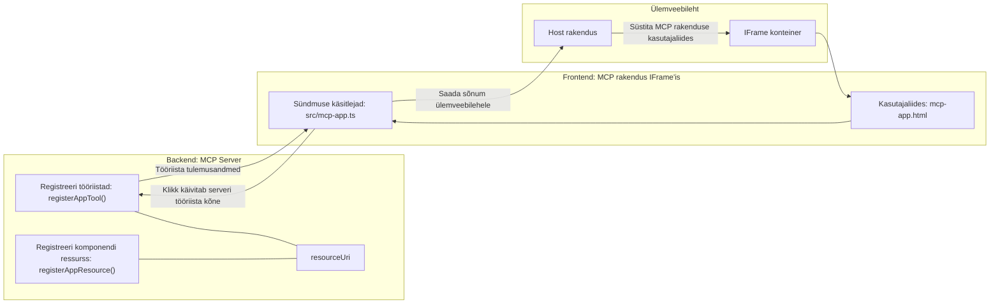
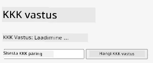
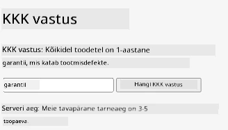
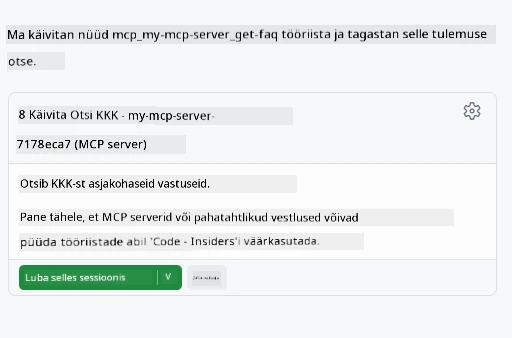
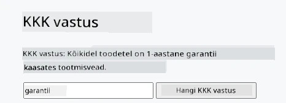

# MCP rakendused

MCP rakendused on MCP uus paradigmäär. Idee on selles, et mitte ainult ei vastata tööriista kõne andmetega, vaid antakse ka teavet selle kohta, kuidas selle info kasutajaliidesega suhelda tuleks. See tähendab, et tööriista tulemused võivad nüüd sisaldada kasutajaliidese informatsiooni. Miks me seda tahaksime? Mõtle, kuidas sa tänapäeval asju teed. Sa tõenäoliselt tarbid MCP serveri tulemusi, pannes ette mingi kasutajaliidese, mille koodi pead ise kirjutama ja hooldama. Mõnikord on see just see, mida soovid, aga mõnikord oleks tore lihtsalt tuua sisse iseseisev info tükk, mis sisaldab kõike alates andmetest kuni kasutajaliideseni.

## Ülevaade

See õppetund annab praktilisi juhiseid MCP rakenduste kohta, kuidas nendega alustada ja kuidas neid oma olemasolevatesse veebi rakendustesse integreerida. MCP rakendused on MCP standardi väga uus lisandus.

## Õpieesmärgid

Selle õppetunni lõpuks oskad:

- Selgitada, mis on MCP rakendused.
- Millal kasutada MCP rakendusi.
- Ehita ja integreeri oma MCP rakendused.

## MCP rakendused – kuidas see töötab

MCP rakenduste idee on pakkuda vastust, mis on sisuliselt renderdatav komponent. Sellisel komponendil võivad olla nii visuaalid kui ka interaktiivsus, näiteks nupuvajutused, kasutaja sisend ja palju muud. Alustame serveri poolest ja meie MCP serverist. MCP rakenduse komponendi loomiseks pead looma nii tööriista kui ka rakenduse ressursi. Need kaks osa on ühendatud resourceUri kaudu.

Siin on näide. Proovime visualiseerida, mis on asja sees ja mis osa tegeleb millega:

```text
server.ts -- responsible for registering tools and the component as a UI component
src/
  mcp-app.ts -- wiring up event handlers
mcp-app.html -- the user interface
```

See visuaal kirjeldab komponendi loomise arhitektuuri ja selle loogikat.


Proovime järgmiseks kirjeldada vastutusalasid backendi ja frontendi jaoks.

### Backend

Siin peame saavutama kaks asja:

- Registreerima tööriistad, millega soovime suhelda.
- Definleerima komponendi.

**Tööriista registreerimine**

```typescript
registerAppTool(
    server,
    "get-time",
    {
      title: "Get Time",
      description: "Returns the current server time.",
      inputSchema: {},
      _meta: { ui: { resourceUri } }, // Sidub selle tööriista selle kasutajaliidese ressursiga
    },
    async () => {
      const time = new Date().toISOString();
      return { content: [{ type: "text", text: time }] };
    },
  );

```

Ülalolev kood kirjeldab käitumist, kus avalikustatakse tööriist nimega `get-time`. See ei võta sisendeid, aga annab välja praeguse aja. Meil on võimalus defineerida `inputSchema` tööriistade jaoks, kus peame aktsepteerima kasutaja sisendi.

**Komponendi registreerimine**

Samas failis peame registreerima ka komponendi:

```typescript
const resourceUri = "ui://get-time/mcp-app.html";

// Registreeri ressurss, mis tagastab UI jaoks pakitud HTML/JavaScripti.
registerAppResource(
  server,
  resourceUri,
  resourceUri,
  { mimeType: RESOURCE_MIME_TYPE },
  async () => {
    const html = await fs.readFile(path.join(DIST_DIR, "mcp-app.html"), "utf-8");

    return {
    contents: [
        { uri: resourceUri, mimeType: RESOURCE_MIME_TYPE, text: html },
    ],
    };
  },
);
```

Pange tähele, kuidas mainime `resourceUri`, mis ühendab komponendi selle tööriistadega. Huvi pakub ka tagasikutsumisfunktsioon, kus loeme kasutajaliidese faili ja tagastame komponendi.

### Komponendi kasutajaliides

Nii nagu backendis, on siin kaks osa:

- Puhtas HTML-is kirjutatud front-end.
- Kood, mis tegeleb sündmuste ja tegevustega, näiteks tööriistade kutsumine või vanema aknaga suhtlemine.

**Kasutajaliides**

Vaatame kasutajaliidest.

```html
<!-- mcp-app.html -->
<!DOCTYPE html>
<html lang="en">
  <head>
    <meta charset="UTF-8" />
    <title>Get Time App</title>
  </head>
  <body>
    <p>
      <strong>Server Time:</strong> <code id="server-time">Loading...</code>
    </p>
    <button id="get-time-btn">Get Server Time</button>
    <script type="module" src="/src/mcp-app.ts"></script>
  </body>
</html>
```

**Sündmuste sidumine**

Viimane osa on sündmuste sidumine. See tähendab, et tuvastame, millises UI osas on sündmuse käsitlejad ja mida teha, kui sündmused vallanduvad:

```typescript
// mcp-app.ts

import { App } from "@modelcontextprotocol/ext-apps";

// Võta elementide viited
const serverTimeEl = document.getElementById("server-time")!;
const getTimeBtn = document.getElementById("get-time-btn")!;

// Loo rakenduse eksemplar
const app = new App({ name: "Get Time App", version: "1.0.0" });

// Töötle tööriista tulemusi serverist. Pane enne `app.connect()`, et vältida
// algse tööriista tulemuse puudumist.
app.ontoolresult = (result) => {
  const time = result.content?.find((c) => c.type === "text")?.text;
  serverTimeEl.textContent = time ?? "[ERROR]";
};

// Seo nupu klikk
getTimeBtn.addEventListener("click", async () => {
  // `app.callServerTool()` lubab kasutajaliidesel serverist värskeid andmeid küsida
  const result = await app.callServerTool({ name: "get-time", arguments: {} });
  const time = result.content?.find((c) => c.type === "text")?.text;
  serverTimeEl.textContent = time ?? "[ERROR]";
});

// Ühenda hostiga
app.connect();
```

Nagu näed ülalolevast, on see tavaline kood DOM elementide ja sündmuste ühendamiseks. Tasub välja tuua kutse `callServerTool`, mis lõppkokkuvõttes kutsub backendis tööriista.

## Kasutaja sisendiga tegelemine

Siiani oleme näinud komponenti, kus on nupp, mille klõpsamisel kutsutakse tööriista. Vaatame, kas saame lisada rohkem kasutajaliidese elemente nagu sisendväli ja saata argumente tööriistale. Rakendame KKK funktsionaalsuse. Nii see peaks toimima:

- Peab olema nupp ja sisendelement, kuhu kasutaja tippib märksõna otsinguks, näiteks "Shipping". See kutsub backendis tööriista, mis teeb otsingu KKK andmetes.
- Tööriist, mis toetab nimetatud KKK otsingut.

Lisame esmalt vajaliku toe backendis:

```typescript
const faq: { [key: string]: string } = {
    "shipping": "Our standard shipping time is 3-5 business days.",
    "return policy": "You can return any item within 30 days of purchase.",
    "warranty": "All products come with a 1-year warranty covering manufacturing defects.",
  }

registerAppTool(
    server,
    "get-faq",
    {
      title: "Search FAQ",
      description: "Searches the FAQ for relevant answers.",
      inputSchema: zod.object({
        query: zod.string().default("shipping"),
      }),
      _meta: { ui: { resourceUri: faqResourceUri } }, // Seob selle tööriista selle kasutajaliidese ressursiga
    },
    async ({ query }) => {
      const answer: string = faq[query.toLowerCase()] || "Sorry, I don't have an answer for that.";
      return { content: [{ type: "text", text: answer }] };
    },
  );
```

Siin näeme, kuidas täidame `inputSchema` ja anname sellele `zod` skeemi järgmiselt:

```typescript
inputSchema: zod.object({
  query: zod.string().default("shipping"),
})
```

Ülaltoodud skeemis deklareerime sisendparameetri nimega `query` ja et see on valikuline, vaikimisi väärtusega "shipping".

Hea, liigume edasi failile *mcp-app.html*, et vaadata, millist kasutajaliidest peame looma:

```html
<div class="faq">
    <h1>FAQ response</h1>
    <p>FAQ Response: <code id="faq-response">Loading...</code></p>
    <input type="text" id="faq-query" placeholder="Enter FAQ query" />
    <button id="get-faq-btn">Get FAQ Response</button>
  </div>
```

Suurepärane, nüüd on meil sisendelement ja nupp. Järgmiseks läheme *mcp-app.ts* failile, et siduda need sündmused:

```typescript
const getFaqBtn = document.getElementById("get-faq-btn")!;
const faqQueryInput = document.getElementById("faq-query") as HTMLInputElement;

getFaqBtn.addEventListener("click", async () => {
  const query = faqQueryInput.value;
  const result = await app.callServerTool({ name: "get-faq", arguments: { query } });
  const faq = result.content?.find((c) => c.type === "text")?.text;
  faqResponseEl.textContent = faq ?? "[ERROR]";
});
```

Ülaltoodud koodis me:

- Loome viited huvipakkuvatele UI elementidele.
- Käsitleme nupuvajutust, et parsida sisendvälja väärtus ja kutsume ka `app.callServerTool()` koos `name` ja `arguments` parameetritega, kus teine edastab `query` väärtusena.

Tegelikult saadab `callServerTool` sõnumi vanema aknale, mis omakorda kutsub MCP serverit.

### Proovi järgi

Proovides peaksime nüüd nägema järgmist:



ja siin proovime sisendiga nagu "warranty"



Selle koodi käivitamiseks mine jaotisse [Code section](./code/README.md)

## Testimine Visual Studio Code's

Visual Studio Code'il on suurepärane tugi MVP rakendustele ja see on tõenäoliselt üks lihtsamaid viise oma MCP rakenduste testimiseks. Visual Studio Code'i kasutamiseks lisa serveri kirje faili *mcp.json* järgmiselt:

```json
"my-mcp-server-7178eca7": {
    "url": "http://localhost:3001/mcp",
    "type": "http"
  }
```

Seejärel alusta serverit, peaksid saama suhelda oma MVP rakendusega läbi vestluseaknaga, eeldusel, et sul on GitHub Copilot installitud.

käivitades näiteks promptist, näiteks "#get-faq":



ja nii nagu veebibrauseris, renderdab ta samamoodi:



## Kodune ülesanne

Loo kivi-paber-käärid mäng. See peaks koosnema järgmistest komponentidest:

UI:

- rippmenüü valikutega
- nupp valiku esitamiseks
- silt, mis näitab, kes mida valis ja kes võitis

Server:

- peaks olema tööriist kivi-paber-käärid, mis võtab sisendiks "choice". See peaks ka genereerima arvuti valiku ja määrama võitja

## Lahendus

[Lahendus](./assignment/README.md)

## Kokkuvõte

Õppisime selle uue paradigmaina MCP rakendustest. See uus paradigma võimaldab MCP serveritel väljendada arvamust mitte ainult andmete üle, vaid ka selle üle, kuidas neid andmeid esitada tuleks.

Lisaks õppisime, et MCP rakendused majutatakse IFrame'sse ja MCP serveritega suhtlemiseks tuleb saata sõnumeid vanemveebi rakendusele. Selleks on olemas mitmeid raamistikke nii puhta JavaScripti kui Reacti jaoks ja rohkem, mis muudavad suhtlemise lihtsamaks.

## Peamised teadmised

Siin on, mida õppisid:

- MCP rakendused on uus standard, mis võib olla kasulik, kui soovid tarnida nii andmeid kui kasutajaliidese funktsioone.
- Sellised rakendused jooksevad turvalisuse huvides IFrame'is.

## Mis järgmiseks

- [4. peatükk](../../04-PracticalImplementation/README.md)

---

<!-- CO-OP TRANSLATOR DISCLAIMER START -->
**Vastutusest loobumine**:
See dokument on tõlgitud AI tõlketeenuse [Co-op Translator](https://github.com/Azure/co-op-translator) abil. Kuigi püüame tagada täpsust, palun arvestage, et automaatsed tõlked võivad sisaldada vigu või ebatäpsusi. Originaaldokument selle emakeeles tuleks pidada usaldusväärseks allikaks. Tähtsa teabe puhul soovitatakse professionaalset inimtõlget. Me ei vastuta selle tõlke kasutamisest tulenevate arusaamatuste või valesti tõlgendamise eest.
<!-- CO-OP TRANSLATOR DISCLAIMER END -->