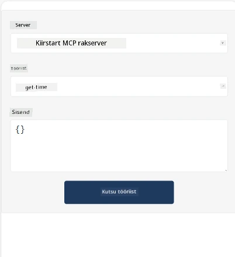
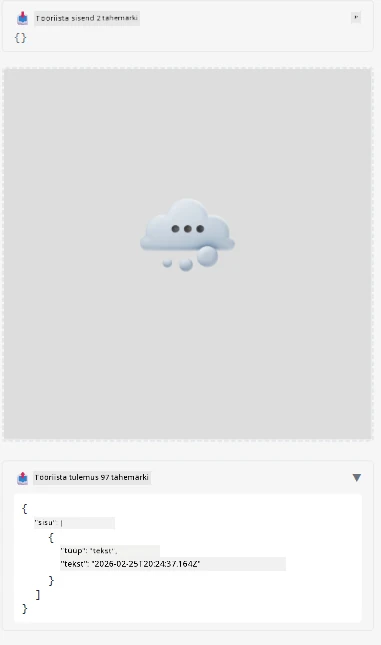

Siin on näide, mis demonstreerib MCP rakendust

## Paigalda

1. Liigu *mcp-app* kausta
1. Käivita `npm install`, see peaks paigaldama frontendi ja backendi sõltuvused

Kontrolli backendi kompileerimist, käivitades:

```sh
npx tsc --noEmit
```

Kui kõik on korras, ei tohiks mingit väljundit tulla.

## Käivita backend

> Windows arvutis nõuab see natuke lisatööd, sest MCP rakenduste lahendus kasutab `concurrently` raamatukogu, mille asemele pead leidma alternatiivi. Siin on süüdlane rida *package.json* failis MCP rakenduses:

    ```json
    "start": "concurrently \"cross-env NODE_ENV=development INPUT=mcp-app.html vite build --watch\" \"tsx watch main.ts\""
    ```

Sellel rakendusel on kaks osa, backend osa ja host osa.

Käivita backend käsuga:

```sh
npm start
```

See peaks käivitama backendi aadressil `http://localhost:3001/mcp`.

> Märkus, kui sa töötad Codespace keskkonnas, võid pärast vajada pordi nähtavuse seadistamist avalikuks. Kontrolli, kas saad brauseris endpointsi kätte aadressilt https://<name of Codespace>.app.github.dev/mcp

## Valik -1 Testi rakendust Visual Studio Code’is

Lahenduse testimiseks Visual Studio Code’is tee järgmist:

- Lisa serveri kirje `mcp.json` faili nii:

    ```json
    {
        "servers": {
            "my-mcp-server-7178eca7": {
                "url": "http://localhost:3001/mcp",
                "type": "http"
            }
        },
        "inputs": []
    }
    ```

1. Vajuta "start" nuppu *mcp.json* failis
1. Veendu, et vestlusaken on avatud ja tipi `get-faq`, peaksid nägema tulemust nagu allpool:

    

## Valik -2- Testi rakendust hostiga

Repo <https://github.com/modelcontextprotocol/ext-apps> sisaldab mitmeid erinevaid hoste, mida saad kasutada oma MVP rakenduste testimiseks.

Siin tutvustame kahte erinevat võimalust:

### Kohalik masin

- Liigu *ext-apps* kausta pärast repositooriumi kloonimist.

- Paigalda sõltuvused

   ```sh
   npm install
   ```

- Teises terminaliaknas liigu *ext-apps/examples/basic-host* kausta

    > Kui kasutad Codespace’i, pead minema serve.ts faili reale 27 ja asendama http://localhost:3001/mcp oma Codespace URL-iga backendile, näiteks https://psychic-xylophone-657rpjgvxpc5g64-3001.app.github.dev/mcp

- Käivita host:

    ```sh
    npm start
    ```

    See peaks ühendama hosti backendiga ja sa peaksid nägema rakenduse töös järgmiselt:

    

### Codespace

Codespace keskkonna tööle saamine nõuab veidi lisatööd. Host’i kasutamiseks läbi Codespace’i:

- Mine *ext-apps* kausta ja sealt *examples/basic-host* alla. 
- Käivita `npm install`, et paigaldada sõltuvused
- Käivita `npm start`, et käivitada host.

## Testi rakendust

Proovi rakendust järgmiselt:

- Vali "Call Tool" nupp ja peaksid nägema tulemusi nagu allpool:

    

Suurepärane, kõik töötab.

---

<!-- CO-OP TRANSLATOR DISCLAIMER START -->
**Vastutusest loobumine**:
See dokument on tõlgitud kasutades tehisintellekti tõlketeenust [Co-op Translator](https://github.com/Azure/co-op-translator). Kuigi püüame tagada täpsust, palun arvestage, et automaatsed tõlked võivad sisaldada vigu või ebatäpsusi. Originaaldokument selle emakeeles tuleks pidada autoriteetseks allikaks. Tähtsa teabe puhul soovitatakse kasutada professionaalset inimtõlget. Me ei vastuta ühegi arusaamatuse või valesti mõistmise eest, mis võivad tekkida selle tõlke kasutamisest.
<!-- CO-OP TRANSLATOR DISCLAIMER END -->