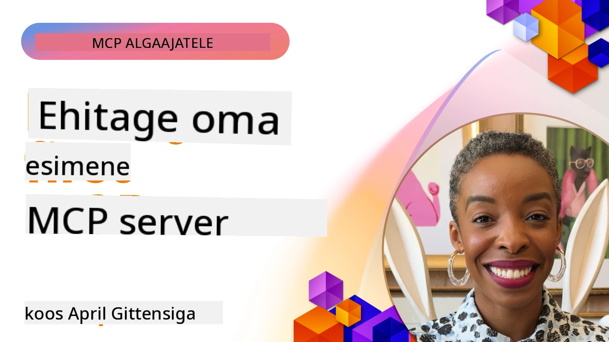

## Alustamine  

_(Klõpsa ülaloleval pildil, et vaadata selle õppetunni videot)_

See osa koosneb mitmest õppetunnist:

- **1 Sinu esimene server**, selles esimeses õppetunnis õpid, kuidas luua oma esimene server ja vaadata seda inspector tööriista abil, mis on väärtuslik viis serveri testimiseks ja silumiseks, [õppetunni juurde](01-first-server/README.md)

- **2 Klient**, selles õppetunnis õpid, kuidas kirjutada klient, kes suudab su serveriga ühenduda, [õppetunni juurde](02-client/README.md)

- **3 Klient koos LLM-iga**, veel parem viis kliendi kirjutamiseks on lisada sellele LLM, nii et ta saab "läbirääkimisi pidada" sinu serveriga selle üle, mida teha, [õppetunni juurde](03-llm-client/README.md)

- **4 Serveri GitHub Copilot Agent režiimi kasutamine Visual Studio Code’is**. Siin vaatame, kuidas käivitada meie MCP server Visual Studio Code keskkonnas, [õppetunni juurde](04-vscode/README.md)

- **5 stdio transport server** stdio transport on soovitatud standard kohalikuks MCP serveri ja kliendi vaheliseks suhtluseks, pakkudes turvalist alamhulgi-põhist suhtlust koos sisseehitatud protsessi isoleerimisega [õppetunni juurde](05-stdio-server/README.md)

- **6 HTTP voogedastus MCP-ga (Voogedastatav HTTP)**. Õpi kaasaegse HTTP voogedastusprotsessi kohta (soovitatud lähenemine kaugete MCP serverite puhul vastavalt [MCP spetsifikatsioonile 2025-11-25](https://spec.modelcontextprotocol.io/specification/2025-11-25/basic/transports/#streamable-http)), edenemiseteavitusi ning kuidas rakendada skaleeritavaid reaalajas MCP servereid ja kliente, kasutades Voogedastatavat HTTP-d. [õppetunni juurde](06-http-streaming/README.md)

- **7 AI tööriistakomplekti kasutamine VSCode jaoks** oma MCP klientide ja serverite tarbimiseks ning testimiseks [õppetunni juurde](07-aitk/README.md)

- **8 Testimine**. Siin keskendume eelkõige sellele, kuidas saame oma serverit ja klienti erinevat moodi testida, [õppetunni juurde](08-testing/README.md)

- **9 Haldus ja paigaldus**. See peatükk vaatleb erinevaid viise, kuidas oma MCP lahendusi juurutada, [õppetunni juurde](09-deployment/README.md)

- **10 Täiustatud serverikasutus**. See peatükk käsitleb serveri täiustatud kasutamist, [õppetunni juurde](./10-advanced/README.md)

- **11 Autentimine**. See peatükk käsitleb lihtsa autentimise lisamist, alates Basic Auth-ist kuni JWT ja RBAC kasutamiseni. Soovitame alustada siit ja seejärel vaadata edasi Täiustatud teemadesse peatükis 5 ning tugevdada turvalisust vastavalt soovitustele peatükis 2, [õppetunni juurde](./11-simple-auth/README.md)

- **12 MCP Hostid**. Konfigureeri ja kasuta populaarseid MCP hostikliente, sealhulgas Claude Desktop, Cursor, Cline ja Windsurf. Õpi transporditüüpe ja tõrkeotsingut, [õppetunni juurde](./12-mcp-hosts/README.md)

- **13 MCP Inspector**. Silu ja testi oma MCP servereid interaktiivselt, kasutades MCP Inspector tööriista. Õpi tõrkeotsingutööriistu, ressursse ja protokollo sõnumeid, [õppetunni juurde](./13-mcp-inspector/README.md)

- **14 Valimi koostamine**. Loo MCP servereid, mis teevad koostööd MCP klientidega LLM-iga seotud ülesannetes. [õppetunni juurde](./14-sampling/README.md)

- **15 MCP Rakendused**. Ehita MCP servereid, mis vastavad ka kasutajaliidese juhistega, [õppetunni juurde](./15-mcp-apps/README.md)

Model Context Protocol (MCP) on avatud protokoll, mis standardiseerib, kuidas rakendused pakuvad konteksti LLM-idele. Mõtle MCP-le nagu USB-C port AI rakenduste jaoks – see pakub standardiseeritud viisi, kuidas ühendada AI mudeleid erinevate andmeallikate ja tööriistadega.

## Õpieesmärgid

Selle õppetunni lõpuks suudad:

- Häälestada arenduskeskkonnad MCP jaoks C#, Java, Python, TypeScript ja JavaScript keeltes
- Ehita ja juuruta põhikujul MCP servereid kohandatud omadustega (ressursid, promptid ja tööriistad)
- Loo hostrakendusi, mis ühenduvad MCP serveritega
- Testida ja siluda MCP rakendusi
- Mõista tavalisi häälestusväljakutseid ja nende lahendusi
- Ühendada oma MCP rakendused populaarsete LLM teenustega

## MCP keskkonna seadistamine

Enne MCP-ga töötamist on oluline valmistada ette oma arenduskeskkond ja mõista põhivoogu. See osa juhendab sind esialgsete seadistamisetappide kaudu, et tagada sujuv algus MCP-ga.

### Nõuded

Enne MCP arendusse sukeldumist veendu, et sul on olemas:

- **Arenduskeskkond**: valitud programmeerimiskeele jaoks (C#, Java, Python, TypeScript või JavaScript)
- **IDE/Editorr**: Visual Studio, Visual Studio Code, IntelliJ, Eclipse, PyCharm või mõni moodne tekstiredaktor
- **Pakihaldurid**: NuGet, Maven/Gradle, pip või npm/yarn
- **API Võtmed**: mis tahes AI teenustele, mida plaanid oma hostrakendustes kasutada

### Ametlikud SDK-d

Järgmistes peatükkides näed lahendusi, mis on ehitatud Pythoniga, TypeScriptiga, Javaga ja .NETiga. Siin on kõik ametlikult toetatud SDK-d.

MCP pakub ametlikke SDK-sid mitmetes keeltes (vastavalt [MCP spetsifikatsioonile 2025-11-25](https://spec.modelcontextprotocol.io/specification/2025-11-25/)):
- [C# SDK](https://github.com/modelcontextprotocol/csharp-sdk) - Hooldatakse koostöös Microsoftiga
- [Java SDK](https://github.com/modelcontextprotocol/java-sdk) - Hooldatakse koostöös Spring AI-ga
- [TypeScript SDK](https://github.com/modelcontextprotocol/typescript-sdk) - Ametlik TypeScripti teostus
- [Python SDK](https://github.com/modelcontextprotocol/python-sdk) - Ametlik Python teostus (FastMCP)
- [Kotlin SDK](https://github.com/modelcontextprotocol/kotlin-sdk) - Ametlik Kotlin teostus
- [Swift SDK](https://github.com/modelcontextprotocol/swift-sdk) - Hooldatakse koostöös Loopwork AI-ga
- [Rust SDK](https://github.com/modelcontextprotocol/rust-sdk) - Ametlik Rusti teostus
- [Go SDK](https://github.com/modelcontextprotocol/go-sdk) - Ametlik Go teostus

## Olulised õppetunnid

- MCP arenduskeskkonna seadistamine on lihtne keelspetsiifiliste SDK-de abil
- MCP serverite ehitamine hõlmab tööriistade loomist ja registreerimist selgete skeemidega
- MCP kliendid ühenduvad serverite ja mudelitega, et kasutada laiendatud võimekusi
- Testimine ja silumine on hädavajalikud usaldusväärsete MCP rakenduste jaoks
- Paigaldusvõimalused ulatuvad kohalikust arendusest pilvepõhiste lahendusteni

## Harjutamine

Meil on hulk näiteid, mis täiendavad kõigis selle jao peatükkides näidatud harjutusi. Lisaks on igal peatükil ka oma harjutused ja ülesanded.

- [Java kalkulaator](./samples/java/calculator/README.md)
- [.Net kalkulaator](../../../03-GettingStarted/samples/csharp)
- [JavaScript kalkulaator](../../../03-GettingStarted/samples/javascript)
- [TypeScript kalkulaator](./samples/typescript/README.md)
- [Python kalkulaator](../../../03-GettingStarted/samples/python)

## Täiendavad ressursid

- [Agentide loomine Model Context Protocol abil Azure’is](https://learn.microsoft.com/azure/developer/ai/intro-agents-mcp)
- [Kaug-MCP Azure konteinerirakendustega (Node.js/TypeScript/JavaScript)](https://learn.microsoft.com/samples/azure-samples/mcp-container-ts/mcp-container-ts/)
- [.NET OpenAI MCP agent](https://learn.microsoft.com/samples/azure-samples/openai-mcp-agent-dotnet/openai-mcp-agent-dotnet/)

## Mis edasi

Alusta esimesest õppetunnist: [Sinu esimese MCP serveri loomine](01-first-server/README.md)

Kui oled selle mooduli lõpule viinud, jätka: [Moodul 4: Praktiline rakendamine](../04-PracticalImplementation/README.md)

---

<!-- CO-OP TRANSLATOR DISCLAIMER START -->
**Vastutusest loobumine**:
See dokument on tõlgitud tehisintellekti tõlketeenuse [Co-op Translator](https://github.com/Azure/co-op-translator) abil. Kuigi püüame tagada täpsust, olge teadlikud, et automaatsed tõlked võivad sisaldada vigu või ebatäpsusi. Originaaldokument selle emakeeles tuleks pidada autoriteetseks allikaks. Kritilise teabe puhul soovitatakse kasutada professionaalset inimtõlget. Me ei vastuta selle tõlke kasutamisest tulenevate arusaamatuste või valesti tõlgenduste eest.
<!-- CO-OP TRANSLATOR DISCLAIMER END -->