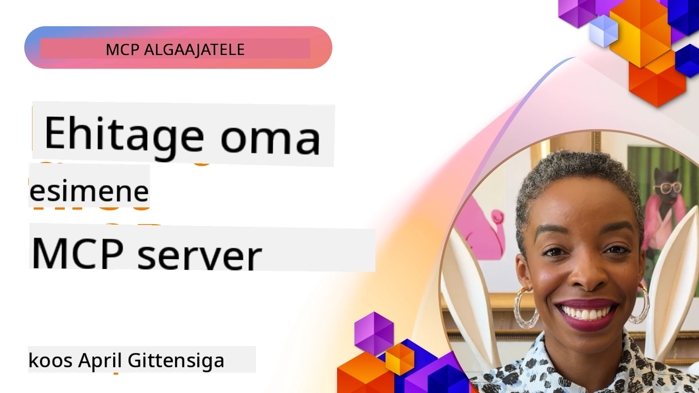

## Alustamine  

_(Vajuta ülalolevale pildile, et vaadata selle õppetunni videot)_

See jaotis koosneb mitmest õppetunnist:

- **1 Sinu esimene server**, selles esimeses õppetunnis õpid, kuidas luua oma esimene server ja seda inspektoriga uurida, mis on väärtuslik viis oma serveri testimiseks ja silumiseks, [õppetundi](01-first-server/README.md)

- **2 Klient**, selles õppetunnis õpid, kuidas kirjutada klient, kes saab sinu serveriga ühenduda, [õppetundi](02-client/README.md)

- **3 Klient koos LLM-iga**, veel parem viis kliendi kirjutamiseks on lisada juurde LLM, et see saaks oma serveriga "läbirääkimisi pidada", mida teha, [õppetundi](03-llm-client/README.md)

- **4 GitHub Copiloti agendi režiimi kasutamine MCP serveris Visual Studio Code'is**. Siin vaatame meie MCP serveri käivitamist Visual Studio Code'i sees, [õppetundi](04-vscode/README.md)

- **5 stdio transpordiserver** stdio transport on soovitatud standard kohalikuks MCP serveri ja kliendi vaheliseks suhtluseks, pakkudes turvalist alamprotsessipõhist kommunikatsiooni sisseehitatud protsessi isoleerimisega [õppetundi](05-stdio-server/README.md)

- **6 HTTP voogedastus MCP-ga (voogedastatav HTTP)**. Õpi standardist
	aadressi kaugtransporti [MCP spetsifikatsioonis 2026-07-28](https://modelcontextprotocol.io/specification/2026-07-28/basic/transports/streamable-http),
	ja vana istungipõhist teostust, mis on säilinud õppetunnis.
	[õppetundi](06-http-streaming/README.md)

- **7 Tehisintellekti tööriistakomplekti kasutamine VSCode jaoks** MCP klientide ja serverite tarbimiseks ja testimiseks [õppetundi](07-aitk/README.md)

- **8 Testimine**. Siin keskendume peamiselt sellele, kuidas saame oma serverit ja klienti erinevalt testida, [õppetundi](08-testing/README.md)

- **9 Juurutamine**. See peatükk vaatleb erinevaid võimalusi oma MCP lahenduste juurutamiseks, [õppetundi](09-deployment/README.md)

- **10 Täiustatud serveri kasutamine**. See peatükk käsitleb täiustatud serveri kasutust, [õppetundi](./10-advanced/README.md)

- **11 Autentimine**. See peatükk käsitleb lihtsa autentimise lisamist, alates Basic Auth-st kuni JWT ja RBAC kasutamiseni. Sind julgustatakse alustama siit ja seejärel vaatama Täiustatud teemasid 5. peatükis ning täiendavalt tugevdama turvalisust soovituste järgi 2. peatükis, [õppetundi](./11-simple-auth/README.md)

- **12 MCP hostid**. Konfigureeri ja kasuta populaarseid MCP hostikliente nagu Claude Desktop, Cursor, Cline ja Windsurf. Õpi transporditüüpe ja tõrkeotsingut, [õppetundi](./12-mcp-hosts/README.md)

- **13 MCP Inspector**. Silu ja testi oma MCP servereid interaktiivselt, kasutades MCP inspektori tööriista. Õpi tõrkeotsingu tööriistu, ressursse ja protokollisõnumeid, [õppetundi](./13-mcp-inspector/README.md)

- **14 Proovivõtt**. Õpi vana proovivõtu primitiivi `2025-11-25` ja
	kuidas uus disain üle viia otsepöördumiseks LLM pakkuja integratsiooni. Proovivõtt
	on MCP `2026-07-28`-s aegunud. [õppetundi](./14-sampling/README.md)

- **15 MCP rakendused**. Ehita MCP servereid, mis vastavad UI juhistega, [õppetundi](./15-mcp-apps/README.md)

Model Context Protocol (MCP) on avatud protokoll, mis standardiseerib, kuidas rakendused annavad konteksti LLM-idele. Mõtle MCP-le nagu USB-C pordile tehisintellekti rakendustele - see annab standardse viisi, kuidas ühendada tehisintellekti mudeleid erinevate andmeallikate ja tööriistadega.

## Õpieesmärgid

Selle õppetunni lõpuks saad:

- Seadistada MCP arenduskeskkonnad C#, Java, Python, TypeScript ja JavaScript jaoks
- Ehita ja juuruta lihtsaid MCP servereid kohandatud funktsioonidega (ressursid, juhised ja tööriistad)
- Loo hostrakendusi, mis ühenduvad MCP serveritega
- Testi ja silu MCP rakendusi
- Mõista tavalisi seadistusprobleeme ja nende lahendusi
- Ühenda oma MCP rakendused populaarsete LLM teenustega

## Oma MCP keskkonna seadistamine

Enne MCP-ga töötama asumist on oluline ette valmistada oma arenduskeskkond ja mõista põhilist töövoogu. See jaotis juhendab sind algseadistuse sammude kaudu, et alustada MCP-ga sujuvalt.

### Eelteadmised

Enne MCP arendusse süvenemist veendu, et sul on:

- **Arenduskeskkond**: Sinu valitud keel (C#, Java, Python, TypeScript või JavaScript)
- **IDE/Tekstiredaktor**: Visual Studio, Visual Studio Code, IntelliJ, Eclipse, PyCharm või mõni kaasaegne koodiredaktor
- **Paketihaldurid**: NuGet, Maven/Gradle, pip või npm/yarn
- **API võtmed**: Mis tahes tehisintellekti teenustele, mida plaanid oma hostrakendustes kasutada

### Ametlikud SDK-d

Järgmistes peatükkides näed lahendusi, mis on tehtud Pythonis, TypeScript'is,
Javas ja .NET-is. Siin on ametlikud SDK-d.

SDK tugi MCP `2026-07-28` jaoks ilmub keelepõhiselt iseseisvalt.
Enne näite käivitamist kontrolli selle paketiversiooni ja SDK väljaandmismärkmikke,
et näha, millised protokolli muudatused on toetatud. Vaata
[ametlikku SDK nimekirja](https://modelcontextprotocol.io/docs/sdk):
- [C# SDK](https://github.com/modelcontextprotocol/csharp-sdk) - Hooldatud koostöös Microsoftiga
- [Java SDK](https://github.com/modelcontextprotocol/java-sdk) - Hooldatud koostöös Spring AI-ga
- [TypeScript SDK](https://github.com/modelcontextprotocol/typescript-sdk) - Ametlik TypeScript'i teostus
- [Python SDK](https://github.com/modelcontextprotocol/python-sdk) - Ametlik Python'i teostus (FastMCP)
- [Kotlin SDK](https://github.com/modelcontextprotocol/kotlin-sdk) - Ametlik Kotlin'i teostus
- [Swift SDK](https://github.com/modelcontextprotocol/swift-sdk) - Hooldatud koostöös Loopwork AI-ga
- [Rust SDK](https://github.com/modelcontextprotocol/rust-sdk) - Ametlik Rust'i teostus
- [Go SDK](https://github.com/modelcontextprotocol/go-sdk) - Ametlik Go teostus

## Peamised järeldused

- MCP arenduskeskkonna seadistamine on lihtne keelespetsiifiliste SDK-dega
- MCP serverite ehitamine hõlmab tööriistade loomist ja registreerimist selgete skeemidega
- MCP kliendid ühenduvad serverite ja mudelitega, et kasutada pikendatud võimalusi
- Testimine ja silumine on usaldusväärsete MCP teostuste jaoks olulised
- Juurutusvõimalused ulatuvad kohalikust arengust pilvepõhiste lahendusteni

## Harjutamine

Meil on komplekt näidiseid, mis täiendab harjutusi, mida näed selles jaotises kõigis peatükkides. Lisaks on igal peatükil ka oma harjutused ja ülesanded.

- [Java Kalkulaator](./samples/java/calculator/README.md)
- [.NET Kalkulaator](../../../03-GettingStarted/samples/csharp)
- [JavaScript Kalkulaator](./samples/javascript/README.md)
- [TypeScript Kalkulaator](./samples/typescript/README.md)
- [Python Kalkulaator](../../../03-GettingStarted/samples/python)

## Täiendavad ressursid

- [Automaatide ehitamine Model Context Protocol'i abil Azure'is](https://learn.microsoft.com/azure/developer/ai/intro-agents-mcp)
- [MCP kaugjuhtimine Azure Container Appsiga (Node.js/TypeScript/JavaScript)](https://learn.microsoft.com/samples/azure-samples/mcp-container-ts/mcp-container-ts/)
- [.NET OpenAI MCP agent](https://learn.microsoft.com/samples/azure-samples/openai-mcp-agent-dotnet/openai-mcp-agent-dotnet/)

## Järgmised sammud

Alusta esimesest õppetunnist: [Sinu esimese MCP serveri loomine](01-first-server/README.md)

Kui oled selle mooduli lõpetanud, jätka: [Moodul 4: Praktiline rakendamine](../04-PracticalImplementation/README.md)

---

<!-- CO-OP TRANSLATOR DISCLAIMER START -->
**Lahtiütlus**:
See dokument on tõlgitud kasutades AI tõlketeenust [Co-op Translator](https://github.com/Azure/co-op-translator). Kuigi me püüdleme täpsuse poole, palun pange tähele, et automatiseeritud tõlgetes võib esineda vigu või ebatäpsusi. Originaaldokument selle emakeeles tuleks pidada autoriteetseks allikaks. Olulise teabe puhul soovitatakse kasutada professionaalset inimtõlget. Me ei vastuta selle tõlkega seotud eksimustest või valesti mõistmistest.
<!-- CO-OP TRANSLATOR DISCLAIMER END -->