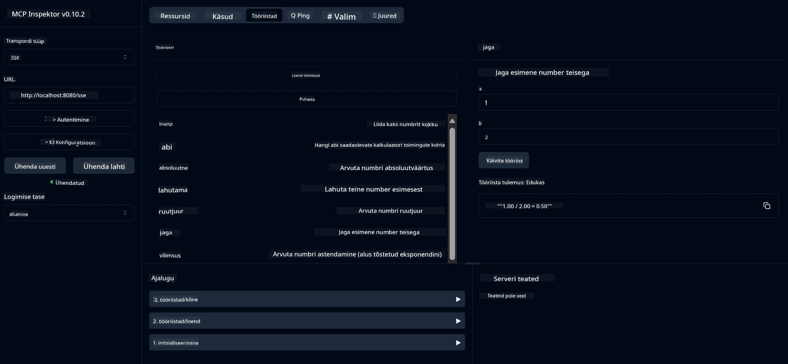

# Põhiline kalkulaatori MCP teenus

> [!NOTE]
> See näidis kasutab pärandatud HTTP+SSE transporti ja on suunatud SDK-le, mis on ühilduv
> MCP `2025-11-25` versiooniga. Uued kaugserverid peaksid kasutama `2026-07-28` Streamable
> HTTP tugi.

See teenus pakub põhilisi kalkulaatori operatsioone Model Context Protocoli (MCP) kaudu, kasutades Spring Boot'i koos WebFlux transpordiga. See on loodud lihtsaks näiteks MCP rakendustega alustavatele kasutajatele.

Lisainfo saamiseks vt [MCP Server Boot Starter](https://docs.spring.io/spring-ai/reference/api/mcp/mcp-server-boot-starter-docs.html) viitedokumentatsiooni.

## Ülevaade

Teenus tutvustab:
- Toetust SSE-le (Server-Sent Events)
- Automaatset tööriistade registreerimist Spring AI `@Tool` annotatsiooni abil
- Põhilisi kalkulaatori funktsioone:
  - Liitmine, lahutamine, korrutamine, jagamine
  - Astendamine ja ruutjuur
  - Modulus (jääk) ja absoluutväärtus
  - Abifunktsioon operatsioonide kirjeldamiseks

## Funktsioonid

See kalkulaatori teenus pakub järgmisi võimalusi:

1. **Põhilised arvutustegevused**:
   - Kahe arvu liitmine
   - Ühe arvu lahutamine teisest
   - Kahe arvu korrutamine
   - Ühe arvu jagamine teisega (nulliga jagamise kontrolliga)

2. **Täiustatud operatsioonid**:
   - Astendamine (põhja tõstmine astendajale)
   - Ruutjuure arvutamine (negatiivse arvu kontrolliga)
   - Modulus (jäägi) arvutamine
   - Absoluutväärtuse arvutamine

3. **Abisüsteem**:
   - Sisseehitatud abifunktsioon, mis selgitab kõiki saadaolevaid operatsioone

## Teenuse kasutamine

Teenus pakub järgmisi API lõpp-punkte MCP protokolli kaudu:

- `add(a, b)`: Kahe arvu liitmine
- `subtract(a, b)`: Teise arvu lahutamine esimesest
- `multiply(a, b)`: Kahe arvu korrutamine
- `divide(a, b)`: Esimese arvu jagamine teisega (nulli kontrolliga)
- `power(base, exponent)`: Arvu astendamine
- `squareRoot(number)`: Ruutjuure arvutamine (negatiivse arvu kontrolliga)
- `modulus(a, b)`: Jäägi arvutamine jagamisel
- `absolute(number)`: Absoluutväärtuse arvutamine
- `help()`: Teave saadaolevate operatsioonide kohta

## Testkliendi kasutamine

Lihtne testklient on kaasas pakendis `com.microsoft.mcp.sample.client`. Klass `SampleCalculatorClient` demonstreerib kalkulaatori teenuse olemasolevaid operatsioone.

## LangChain4j kliendi kasutamine

Projektis on näidiseks LangChain4j klient `com.microsoft.mcp.sample.client.LangChain4jClient`, mis näitab, kuidas integreerida kalkulaatori teenust LangChain4j ja GitHubi mudelitega:

### Eeltingimused

1. **GitHubi tokeni seadistamine**:
   
   GitHubi AI mudelite (näiteks phi-4) kasutamiseks on vaja GitHubi isikliku ligipääsu tokenit:

   a. Mine GitHubi konto seadistustesse: https://github.com/settings/tokens
   
   b. Klikka "Generate new token" → "Generate new token (classic)"
   
   c. Anna tokenile kirjeldav nimi
   
   d. Vali järgmised õigused:
      - `repo` (täielik juurdepääs privaatsetele hoidlatele)
      - `read:org` (era- ja meeskonnaliikmete ning organisatsiooni projektide lugemine)
      - `gist` (gistide loomine)

      - `user:email` (Kasutaja e-posti aadresside lugemise juurdepääs (ainult lugemisõigus))
   
   e. Klõpsake "Generate token" ja kopeerige oma uus token
   
   f. Määrake see keskkonnamuutujana:
      
      Windowsis:
      ```
      set GITHUB_TOKEN=your-github-token
      ```
      
      macOS/Linuxis:
      ```bash
      export GITHUB_TOKEN=your-github-token
      ```

   g. Püsiva seadistuse jaoks lisage see süsteemi seadete kaudu oma keskkonnamuutujatesse

2. Lisage LangChain4j GitHubi sõltuvus oma projekti (juba kaasatud pom.xml-i):
   ```xml
   <dependency>
       <groupId>dev.langchain4j</groupId>
       <artifactId>langchain4j-github</artifactId>
       <version>${langchain4j.version}</version>
   </dependency>
   ```

3. Veenduge, et kalkulaatori server töötab aadressil `localhost:8080`

### LangChain4j kliendi käivitamine

See näide demonstreerib:
- Ühendumist kalkulaatori MCP serveriga SSE transpordi kaudu
- LangChain4j kasutamist vestlusboti loomiseks, mis kasutab kalkulaatori toiminguid
- Integreerimist GitHubi AI mudelitega (praegu kasutatakse phi-4 mudelit)

Klient saadab järgmised näidispäringud funktsionaalsuse demonstreerimiseks:
1. Kahe arvutamise summa leidmine
2. Arvu ruutjuure leidmine
3. Abiinfo saamine saadaolevate kalkulaatori toimingute kohta

Käivitage näide ja vaadake konsooli väljundit, et näha, kuidas AI mudel kasutab kalkulaatori tööriistu päringutele vastamiseks.

### GitHubi mudeli seadistus

LangChain4j klient on seadistatud kasutama GitHubi phi-4 mudelit järgmiste sätetega:

```java
ChatLanguageModel model = GitHubChatModel.builder()
    .apiKey(System.getenv("GITHUB_TOKEN"))
    .timeout(Duration.ofSeconds(60))
    .modelName("phi-4")
    .logRequests(true)
    .logResponses(true)
    .build();
```

Erinevate GitHubi mudelite kasutamiseks muutke lihtsalt `modelName` parameeter mõneks teiseks toetatud mudeliks (nt "claude-3-haiku-20240307", "llama-3-70b-8192" jne).

## Sõltuvused

Projekt nõuab järgmisi peamisi sõltuvusi:

```xml
<!-- For MCP Server -->
<dependency>
    <groupId>org.springframework.ai</groupId>
    <artifactId>spring-ai-starter-mcp-server-webflux</artifactId>
</dependency>

<!-- For LangChain4j integration -->
<dependency>
    <groupId>dev.langchain4j</groupId>
    <artifactId>langchain4j-mcp</artifactId>
    <version>${langchain4j.version}</version>
</dependency>

<!-- For GitHub models support -->
<dependency>
    <groupId>dev.langchain4j</groupId>
    <artifactId>langchain4j-github</artifactId>
    <version>${langchain4j.version}</version>
</dependency>
```

## Projekti ehitamine

Ehitage projekt Maveniga:
```bash
./mvnw clean install -DskipTests
```

## Serveri käivitamine

### Java kasutamine

```bash
java -jar target/calculator-server-0.0.1-SNAPSHOT.jar
```

### MCP Inspektori kasutamine

MCP Inspektor on kasulik tööriist MCP teenustega suhtlemiseks. Kalkulaatori teenusega kasutamiseks:

1. **Installige ja käivitage MCP Inspektor** uues terminali aknas:
   ```bash
   npx @modelcontextprotocol/inspector
   ```

2. **Juurdepääs veebiliidesesse** klõpsates rakenduse kuvamiseks nähtaval URL-il (tavaliselt http://localhost:6274)

3. **Ühenduse seadistamine**:
   - Määrake transporditüübiks "SSE"
   - Määrake URL oma käivitunud serveri SSE lõpp-punktile: `http://localhost:8080/sse`
   - Klõpsake "Connect"

4. **Tööriistade kasutamine**:
   - Klõpsake "List Tools", et näha saadaolevaid kalkulaatori toiminguid
   - Valige tööriist ja klõpsake "Run Tool", et käivitada toiming



### Dockeri kasutamine

Projekt sisaldab konteineri juurutamiseks Dockerfile'i:

1. **Ehitage Dockeri image**:
   ```bash
   docker build -t calculator-mcp-service .
   ```

2. **Käivitage Dockeri konteiner**:
   ```bash
   docker run -p 8080:8080 calculator-mcp-service
   ```

See teeb järgmist:
- Ehita mitmeastmeline Dockeri image Maven 3.9.9 ja Eclipse Temurin 24 JDK-ga
- Loo optimeeritud konteineripilt
- Ava teenus pordil 8080
- Käivita MCP kalkulaatori teenus konteineri sees

Teenusele pääseb konteineri tööle hakkamisel ligi aadressil `http://localhost:8080`.

## Veaotsing

### Üldised probleemid GitHubi tokeniga


1. **Tokeni õiguste probleemid**: Kui saate 403 Keelatud vea, kontrollige, kas teie tokenil on õiged õigused vastavalt eeltingimustele.

2. **Tokenit ei leitud**: Kui saate vea "API võtit ei leitud", veenduge, et GITHUB_TOKEN keskkonnamuutuja oleks õigesti määratud.

3. **Kiirusepiirang**: GitHub API-l on kiirusepiirangud. Kui saate kiirusepiirangu vea (staatuskood 429), oodake paar minutit ja proovige uuesti.

4. **Tokeni aegumine**: GitHubi tokenid võivad aeguda. Kui mõne aja pärast saate autentimisvead, genereerige uus token ja uuendage oma keskkonnamuutuja.

Kui teil on vaja täiendavat abi, vaadake [LangChain4j dokumentatsiooni](https://github.com/langchain4j/langchain4j) või [GitHub API dokumentatsiooni](https://docs.github.com/en/rest).

---

<!-- CO-OP TRANSLATOR DISCLAIMER START -->
**Lahtiütlus**:
See dokument on tõlgitud kasutades AI tõlketeenust [Co-op Translator](https://github.com/Azure/co-op-translator). Kuigi me püüdleme täpsuse poole, palun pange tähele, et automatiseeritud tõlgetes võib esineda vigu või ebatäpsusi. Originaaldokument selle emakeeles tuleks pidada autoriteetseks allikaks. Olulise teabe puhul soovitatakse kasutada professionaalset inimtõlget. Me ei vastuta selle tõlkega seotud eksimustest või valesti mõistmistest.
<!-- CO-OP TRANSLATOR DISCLAIMER END -->