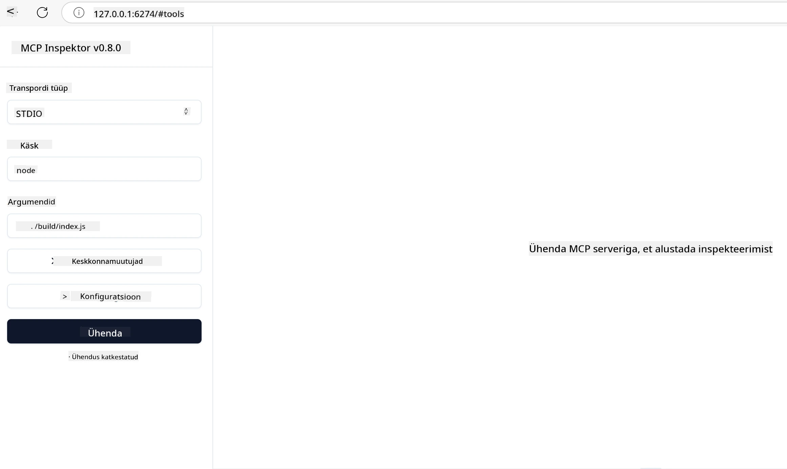

# Praktiline rakendamine

[](https://youtu.be/vCN9-mKBDfQ)

_(Klõpsa ülalolevale pildile, et vaadata selle tunni videot)_

Praktiline rakendamine on koht, kus Model Context Protocoli (MCP) jõud muutub käegakatsutavaks. Kuigi on oluline mõista MCP teooriat ja arhitektuuri, ilmneb tegelik väärtus siis, kui rakendad neid kontseptsioone lahenduste ehitamiseks, testimiseks ja juurutamiseks, mis lahendavad reaalseid probleeme. See peatükk ühendab kontseptuaalse teadmise ja praktilise arenduse, juhendades sind MCP-põhiste rakenduste elluviimise protsessis.

Olgu sul eesmärgiks arendada intelligentseid assistente, integreerida tehisintellekti äriprotsessidesse või ehitada kohandatud tööriistu andmetöötluseks – MCP pakub paindlikku alust. Selle keeleagnostiline disain ja ametlikud SDK-d populaarsetele programmeerimiskeeltele teevad selle ligipääsetavaks laiale arendajate ringile. Nende SDK-de abil saad kiiresti prototüübid luua, lahendusi iteratiivselt arendada ja erinevatel platvormidel ning keskkondades skaleerida.

Järgmistes peatükkides leiad praktilisi näiteid, koodinäiteid ja juurutamisstrateegiaid, mis demonstreerivad, kuidas MCP-d kasutada C#, Java Springi, TypeScripti, JavaScripti ja Pythoni keeles. Sa õpid ka MCP serverite silumisest ja testimisest, API-de haldamisest ning lahenduste pilve juurutamisest Azure’i abil. Need praktilised ressursid kiirendavad sinu õppimist ja aitavad sul enesekindlalt ehitada tugevaid, tootmises kasutamiseks valmis MCP rakendusi.

## Ülevaade

See õppetund keskendub MCP praktilisele rakendamisele mitmes programmeerimiskeeles. Uurime, kuidas kasutada MCP SDK-sid C#, Java Springi, TypeScripti, JavaScripti ja Pythoni puhul, et ehitada töökindlaid rakendusi, siluda ja testida MCP servereid ning luua taaskasutatavaid ressursse, prompt'e ja tööriistu.

## Õpieesmärgid

Selle tunni lõpuks oskad:

- Rakendada MCP lahendusi ametlike SDK-de abil erinevates programmeerimiskeeltes
- Süsteemselt siluda ja testida MCP servereid
- Luua ja kasutada serveri funktsioone (Ressursid, Promptid ja Tööriistad)
- Kujundada tõhusaid MCP töövooge keerukate ülesannete jaoks
- Optimeerida MCP rakendusi jõudluse ja töökindluse tagamiseks

## Ametlikud SDK ressursid

Model Context Protocol pakub ametlikke SDK-sid mitmele keelele (kooskõlas [MCP spetsifikatsiooniga 2025-11-25](https://spec.modelcontextprotocol.io/specification/2025-11-25/)):

- [C# SDK](https://github.com/modelcontextprotocol/csharp-sdk)
- [Java koos Springiga SDK](https://github.com/modelcontextprotocol/java-sdk) **Märkus:** nõuab sõltuvust [Project Reactor](https://projectreactor.io). (Vaata [arutelu teemat 246](https://github.com/orgs/modelcontextprotocol/discussions/246).)
- [TypeScript SDK](https://github.com/modelcontextprotocol/typescript-sdk)
- [Python SDK](https://github.com/modelcontextprotocol/python-sdk)
- [Kotlin SDK](https://github.com/modelcontextprotocol/kotlin-sdk)
- [Go SDK](https://github.com/modelcontextprotocol/go-sdk)

## Töötamine MCP SDK-dega

See peatükk pakub praktilisi näiteid MCP rakendustest mitmes keeles. Näidiskood asub `samples` kataloogis, organiseeritud keele kaupa.

### Saadaval näited

Repositoorium sisaldab [näidisrakendusi](../../../04-PracticalImplementation/samples) järgmistes keeltes:

- [C#](./samples/csharp/README.md)
- [Java koos Springiga](./samples/java/containerapp/README.md)
- [TypeScript](./samples/typescript/README.md)
- [JavaScript](./samples/javascript/README.md)
- [Python](./samples/python/README.md)

Iga näidis demonstreerib MCP peamisi kontseptsioone ja rakendusmustreid antud keeles ja ökosüsteemis.

### Praktilised juhendid

Lisajuhendid MCP praktiliseks rakendamiseks:

- [Leheküljestamine ja suured tulemuste kogumid](./pagination/README.md) – Käsitle kursori-põhist leheküljestamist tööriistade, ressursside ja suurte andmekogumite puhul

## Põhifunktsioonid serveris

MCP serverid võivad rakendada ükskõik millist järgmistest funktsioonidest:

### Ressursid

Ressursid pakuvad kasutajale või AI mudelile konteksti ja andmeid:

- Dokumendihaldus
- Teadmiste baasid
- Struktureeritud andmeallikad
- Failisüsteemid

### Promptid

Promptid on kasutajatele mõeldud mallitud sõnumid ja töövood:

- Eeldefineeritud vestlusmallid
- Juhitud interaktsioonimustrid
- Spetsialiseeritud dialoogistruktuurid

### Tööriistad

Tööriistad on funktsioonid AI mudeli täitmiseks:

- Andmetöötluse utiliidid
- Välised API integratsioonid
- Arvutusvõimsus
- Otsingufunktsionaalsus

## Näidisrakendused: C# rakendamine

Ametlik C# SDK repositoorium sisaldab mitmeid näidisrakendusi, mis demonstreerivad erinevaid MCP aspekte:

- **Põhiline MCP klient**: Lihtne näide MCP kliendi loomisest ja tööriistade kutsumisest
- **Põhiline MCP server**: Minimaalne serveri rakendus koos tööriistade registreerimisega
- **Täpsem MCP server**: Täisfunktsionaalne server koos tööriistade registreerimise, autentimise ja vigade käsitlusega
- **ASP.NET integreerimine**: Näited ASP.NET Core integratsioonist
- **Tööriistade rakendamise mustrid**: Erinevad mustrid tööriistade rakendamiseks erineva keerukusega

MCP C# SDK on eelvaates ja API-d võivad muutuda. Selle blogi sisu uuendatakse SDK arenguga pidevalt.

### Peamised omadused

- [C# MCP Nuget ModelContextProtocol](https://www.nuget.org/packages/ModelContextProtocol)
- Ehita oma [esimest MCP serverit](https://devblogs.microsoft.com/dotnet/build-a-model-context-protocol-mcp-server-in-csharp/)

Täielike C# rakendusnäidete jaoks külasta [ametliku C# SDK näidiste repositooriumit](https://github.com/modelcontextprotocol/csharp-sdk)

## Näidisrakendus: Java Springiga rakendamine

Java Spring SDK pakub tugeva MCP rakenduse võimalusi ettevõtte tasemel funktsioonidega.

### Peamised omadused

- Spring Framework integratsioon
- Tugev tüübikindlus
- Reaktiivne programmeerimise tugi
- Ulatuslik vigade käsitlus

Täieliku Java Springiga rakendusnäite jaoks vaata [Java Spring näidet](samples/java/containerapp/README.md) näidiskataloogis.

## Näidisrakendus: JavaScripti rakendamine

JavaScripti SDK pakub kerget ja paindlikku lähenemist MCP rakendamisel.

### Peamised omadused

- Node.js ja brauseri tugi
- Lubade-põhine API
- Lihtne integratsioon Expressi ja teiste raamistikega
- WebSocket tugi voogedastuseks

Täieliku JavaScripti rakendusnäite jaoks vaata [JavaScript näidet](samples/javascript/README.md) näidiskataloogis.

## Näidisrakendus: Pythoni rakendamine

Pythoni SDK pakub pythonilikku lähenemist MCP rakendamisel koos suurepäraste ML raamistiku integratsioonidega.

### Peamised omadused

- Async/await tugi asyncio abil
- FastAPI integratsioon
- Lihtne tööriistade registreerimine
- Natiivne tugi populaarsetele ML teekidele

Täieliku Pythoni rakendusnäite jaoks vaata [Python näidet](samples/python/README.md) näidiskataloogis.

## API haldus

Azure API Management on suurepärane lahendus MCP serverite turvamiseks. Mõte on panna Azure API Managementi instants oma MCP serveri ette ja lasta tal hallata sulle vajalikke funktsioone nagu:

- kiirusepiirang
- tokenite haldus
- jälgimine
- koormuse tasakaalustamine
- turvalisus

### Azure näidis

Siin on Azure näide, mis teeb täpselt seda, st [loob MCP serveri ja kaitseb seda Azure API Managementiga](https://github.com/Azure-Samples/remote-mcp-apim-functions-python).

Vaata, kuidas autoriseerimisteekond alloleval pildil toimub:


Eelmisel pildil toimub järgnev:

- Autentimine/autoriseerimine toimub Microsoft Entraga.
- Azure API Management toimib väravana ja kasutab poliitikaid liikluse suunamiseks ja haldamiseks.
- Azure Monitor logib kõik päringud edasiseks analüüsiks.

#### Autoriseerimise voog

Vaata autoriseerimise protsessi detailsemalt:


#### MCP autoriseerimise spetsifikatsioon

Loe lisaks [MCP autoriseerimise spetsifikatsioonist](https://spec.modelcontextprotocol.io/specification/2025-11-25/basic/authorization/)

## Kaug-MCP serveri juurutamine Azure’i

Vaatame, kas saame varem mainitud näidist juurutada:

1. Klooni repositoorium

    ```bash
    git clone https://github.com/Azure-Samples/remote-mcp-apim-functions-python.git
    cd remote-mcp-apim-functions-python
    ```

1. Registreeri `Microsoft.App` ressursside pakkuja.

   - Kui kasutad Azure CLI-d, käivita `az provider register --namespace Microsoft.App --wait`.
   - Kui kasutad Azure PowerShelli, käivita `Register-AzResourceProvider -ProviderNamespace Microsoft.App`. Mõne aja pärast kontrolli registreerimise olekut käsuga `(Get-AzResourceProvider -ProviderNamespace Microsoft.App).RegistrationState`.

1. Käivita see [azd](https://aka.ms/azd) käsk, et luua API haldusteenus, funktsioonirakendus (koos koodiga) ja kõik muud vajalikud Azure ressursid

    ```shell
    azd up
    ```

    See käsk peaks juurutama kõik pilveressursid Azure’is

### Oma serveri testimine MCP Inspectoriga

1. Avage **uus terminali aken**, installi ja käivita MCP Inspector

    ```shell
    npx @modelcontextprotocol/inspector
    ```

    Peaksid nägema liidest, mis näeb välja nagu:

    

1. CTRL-klõps URL-il, mille rakendus kuvab, et avada MCP Inspectori veebiapp (näiteks [http://127.0.0.1:6274/#resources](http://127.0.0.1:6274/#resources))
1. Sea transporditüübiks `SSE`
1. Sisesta URL oma jooksva API Management SSE lõpp-punkti aadress, mis kuvatakse pärast `azd up` käsku, ja **ühendu**:

    ```shell
    https://<apim-servicename-from-azd-output>.azure-api.net/mcp/sse
    ```

1. **Tööriistade nimekiri**. Klõpsa tööriistal ja vali **Run Tool**.

Kui kõik sammud on õnnestunud, peaksid nüüd olema ühendatud MCP serveriga ja suutnud tööriista kutsuda.

## MCP serverid Azure jaoks

[Remote-mcp-functions](https://github.com/Azure-Samples/remote-mcp-functions-dotnet): See kogu repositoorium on kiireks alustamiseks mõeldud mall kohandatud kaug-MCP (Model Context Protocol) serverite ehitamiseks ja juurutamiseks Azure Functions abil Pythonis, C# .NET-s või Node/TypeScriptis.

Näidised pakuvad täielikku lahendust, mis võimaldab arendajatel:

- Arendada ja jooksutada lokaalselt: Arenda ja silu MCP serverit kohalikus masinas
- Juurutada Azure’i: Lihtne pilve juurutamine ühe `azd up` käsuga
- Ühenduda klientidelt: Ühenda MCP serveriga erinevatest klientidest, sealhulgas VS Code Copilot agenti režiimist ja MCP Inspector tööriistast

### Peamised omadused

- Turvalisus disaini järgi: MCP server on kaitstud võtmete ja HTTPS-iga
- Autentimisvõimalused: Tugi OAuth-ile sisseehitatud autentimise ja/või API Managementi kaudu
- Võrgu isoleerimine: Võimaldab võrgu isoleerimist Azure Virtual Networks (VNET) abil
- Serverita arhitektuur: Kasutab Azure Functions skaleeritava ja sündmuspõhise täitmise jaoks
- Kohalik arendus: Täielik tugi kohalikuks arenduseks ja silumiseks
- Lihtne juurutamine: Lihtsustatud juurutamisprotsess Azure’i

Repositoorium sisaldab kõiki vajalikke konfiguratsiooni faile, lähtekoodi ja infrastruktuuri definitsioone, et kiiresti alustada tootmiskõlbuliku MCP serveri rakendusega.

- [Azure Remote MCP Functions Python](https://github.com/Azure-Samples/remote-mcp-functions-python) – MCP näidisrakendus Azure Functionsiga Pythonis

- [Azure Remote MCP Functions .NET](https://github.com/Azure-Samples/remote-mcp-functions-dotnet) – MCP näidisrakendus Azure Functionsiga C# .NET-is

- [Azure Remote MCP Functions Node/Typescript](https://github.com/Azure-Samples/remote-mcp-functions-typescript) – MCP näidisrakendus Azure Functionsiga Node/TypeScriptis.

## Peamised järeldused

- MCP SDK-d pakuvad keel-spetsiifilisi tööriistu tugeva MCP lahenduste loomiseks
- Silumise ja testimise protsess on usaldusväärsete MCP rakenduste jaoks kriitiline
- Taaskasutatavad prompti mallid võimaldavad järjepidevaid AI interaktsioone
- Hästi kujundatud töövood võimaldavad orkestreerida keerukaid ülesandeid mitmete tööriistadega
- MCP lahenduste rakendamisel tuleb arvestada turvalisuse, jõudluse ja vigade käsitlust

## Harjutus

Kujunda praktiline MCP töövoog, mis lahendab sinu valdkonnas reaalse probleemi:

1. Määra 3-4 tööriista, mis aitaksid selle probleemi lahendada
2. Loo töövoo diagramm, mis näitab nende tööriistade omavahelist suhtlust
3. Rakenda põhiline versioon ühest tööriistast oma eelistatud keeles
4. Loo prompti mall, mis aitaks mudelil efektiivselt sinu tööriista kasutada

## Lisamaterjalid

---

## Mis edasi

Järgmine: [Täpsemad teemad](../05-AdvancedTopics/README.md)

---

<!-- CO-OP TRANSLATOR DISCLAIMER START -->
**Vastutusest loobumine**:
See dokument on tõlgitud kasutades tehisintellektil põhinevat tõlke teenust [Co-op Translator](https://github.com/Azure/co-op-translator). Kuigi püüame tagada täpsust, tuleb arvestada, et automaatsed tõlked võivad sisaldada vigu või ebatäpsusi. Algne dokument selle emakeeles on määrav ja autoriteetne allikas. Olulise info puhul soovitame kasutada professionaalset inimtõlget. Me ei vastuta ühegi arusaamatuse või valesti mõistmise eest, mis võib selle tõlke kasutamisest tekkida.
<!-- CO-OP TRANSLATOR DISCLAIMER END -->