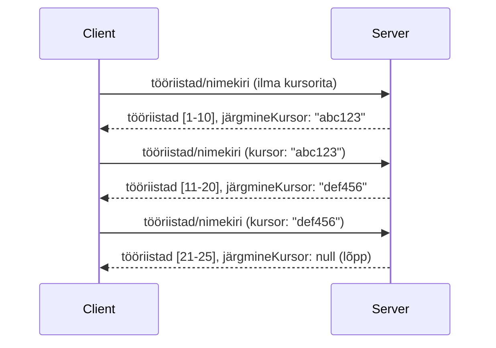

# Leheküljendus ja suured tulemuste hulgad MCP-s

Kui teie MCP server töötleb suuri andmekogumeid - olgu see siis tuhandete failide, andmebaasi kirjetega või otsingutulemustega - vajate mäluefektiivseks haldamiseks ja reageerimisvõimelise kasutajakogemuse tagamiseks leheküljendust. See juhend hõlmab kuidas MCP-s leheküljendust rakendada ja kasutada.

## Miks leheküljendus on oluline

Ilma leheküljenduseta võivad suured vastused põhjustada:

- **Mälu ammendumine** - miljonite kirjete ühekordne laadimine 
- **Aeglane vastus** - kasutajad ootavad kogu andmete laadimist
- **Ajalõpu vead** - päringud ületavad ajalõpu piirid
- **Halb tehisintellekti jõudlus** - LLM-idel on raske massiivse kontekstiga toime tulla

MCP kasutab tulemuste komplektide usaldusväärseks ja järjepidevaks leheküljendamiseks **kursoripõhist leheküljendust**.

---

## Kuidas MCP leheküljendus töötab

### Kursori mõiste

**Kursor** on läbipaistev string, mis märgib teie positsiooni tulemuste komplektis. Mõelge sellele nagu järjehoidjale pikast raamatust.



### Leheküljendus MCP meetodites

Järgnevad MCP meetodid toetavad leheküljendust:

| Meetod | Tagastab | Kursori tugi |
|--------|---------|----------------|
| `tools/list` | Tööriistade definitsioonid | ✅ |
| `resources/list` | Ressursside definitsioonid | ✅ |
| `prompts/list` | Käsureate definitsioonid | ✅ |
| `resources/templates/list` | Ressursside mallid | ✅ |

---

## Serveri teostus

### Python (FastMCP)

```python
from mcp.server import Server
from mcp.types import Tool, ListToolsResult
import math

app = Server("paginated-server")

# Simuleeritud suur andmekogu
ALL_TOOLS = [
    Tool(name=f"tool_{i}", description=f"Tool number {i}", inputSchema={})
    for i in range(100)
]

PAGE_SIZE = 10

@app.list_tools()
async def list_tools(cursor: str | None = None) -> ListToolsResult:
    """List tools with pagination support."""
    
    # Dekodeeri kursor algindeksi saamiseks
    start_index = 0
    if cursor:
        try:
            start_index = int(cursor)
        except ValueError:
            start_index = 0
    
    # Hangi tulemuste lehekülg
    end_index = min(start_index + PAGE_SIZE, len(ALL_TOOLS))
    page_tools = ALL_TOOLS[start_index:end_index]
    
    # Arvuta järgmine kursor
    next_cursor = None
    if end_index < len(ALL_TOOLS):
        next_cursor = str(end_index)
    
    return ListToolsResult(
        tools=page_tools,
        nextCursor=next_cursor
    )
```

### TypeScript

```typescript
import { Server } from "@modelcontextprotocol/sdk/server/index.js";
import { ListToolsResultSchema } from "@modelcontextprotocol/sdk/types.js";

const server = new Server({
  name: "paginated-server",
  version: "1.0.0"
});

// Simuleeritud suur andmekogum
const ALL_TOOLS = Array.from({ length: 100 }, (_, i) => ({
  name: `tool_${i}`,
  description: `Tool number ${i}`,
  inputSchema: { type: "object", properties: {} }
}));

const PAGE_SIZE = 10;

server.setRequestHandler(ListToolsResultSchema, async (request) => {
  // Dekodeeri kursori
  let startIndex = 0;
  if (request.params?.cursor) {
    startIndex = parseInt(request.params.cursor, 10) || 0;
  }
  
  // Hangi tulemuste leht
  const endIndex = Math.min(startIndex + PAGE_SIZE, ALL_TOOLS.length);
  const pageTools = ALL_TOOLS.slice(startIndex, endIndex);
  
  // Arvuta järgmine kursor
  const nextCursor = endIndex < ALL_TOOLS.length ? String(endIndex) : undefined;
  
  return {
    tools: pageTools,
    nextCursor
  };
});
```

### Java (Spring MCP)

```java
@Service
public class PaginatedToolService {
    
    private static final int PAGE_SIZE = 10;
    private final List<Tool> allTools;
    
    public PaginatedToolService() {
        // Initsialiseeri suur andmekogu
        this.allTools = IntStream.range(0, 100)
            .mapToObj(i -> new Tool("tool_" + i, "Tool number " + i, Map.of()))
            .collect(Collectors.toList());
    }
    
    @McpMethod("tools/list")
    public ListToolsResult listTools(@Param("cursor") String cursor) {
        // Dekodeeri kursor
        int startIndex = 0;
        if (cursor != null && !cursor.isEmpty()) {
            try {
                startIndex = Integer.parseInt(cursor);
            } catch (NumberFormatException e) {
                startIndex = 0;
            }
        }
        
        // Hangi tulemuste lehekülg
        int endIndex = Math.min(startIndex + PAGE_SIZE, allTools.size());
        List<Tool> pageTools = allTools.subList(startIndex, endIndex);
        
        // Arvuta järgmine kursor
        String nextCursor = endIndex < allTools.size() ? String.valueOf(endIndex) : null;
        
        return new ListToolsResult(pageTools, nextCursor);
    }
}
```

---

## Kliendi teostus

### Python klient

```python
from mcp import ClientSession

async def get_all_tools(session: ClientSession) -> list:
    """Fetch all tools using pagination."""
    all_tools = []
    cursor = None
    
    while True:
        result = await session.list_tools(cursor=cursor)
        all_tools.extend(result.tools)
        
        if result.nextCursor is None:
            break
        cursor = result.nextCursor
    
    return all_tools

# Kasutus
async with client_session as session:
    tools = await get_all_tools(session)
    print(f"Found {len(tools)} tools")
```

### TypeScript klient

```typescript
import { Client } from "@modelcontextprotocol/sdk/client/index.js";

async function getAllTools(client: Client): Promise<Tool[]> {
  const allTools: Tool[] = [];
  let cursor: string | undefined = undefined;
  
  do {
    const result = await client.listTools({ cursor });
    allTools.push(...result.tools);
    cursor = result.nextCursor;
  } while (cursor);
  
  return allTools;
}

// Kasutus
const tools = await getAllTools(client);
console.log(`Found ${tools.length} tools`);
```

### Udune laadimisstrateegia

Väga suurte andmekogumite puhul laadige lehed vajadusel:

```python
class PaginatedToolIterator:
    """Lazily iterate through paginated tools."""
    
    def __init__(self, session: ClientSession):
        self.session = session
        self.cursor = None
        self.buffer = []
        self.exhausted = False
    
    async def __anext__(self):
        # Tagasta vahemälust, kui see on saadaval
        if self.buffer:
            return self.buffer.pop(0)
        
        # Kontrolli, kas oleme kõik lehed läbi käinud
        if self.exhausted:
            raise StopAsyncIteration
        
        # Hangi järgmine leht
        result = await self.session.list_tools(cursor=self.cursor)
        self.buffer = list(result.tools)
        self.cursor = result.nextCursor
        
        if self.cursor is None:
            self.exhausted = True
        
        if not self.buffer:
            raise StopAsyncIteration
        
        return self.buffer.pop(0)
    
    def __aiter__(self):
        return self

# Kasutus - mälusäästlik suurte andmekogumite puhul
async for tool in PaginatedToolIterator(session):
    process_tool(tool)
```

---

## Leheküljendus ressursside jaoks

Ressurssid vajavad sageli leheküljendust kataloogide või suurte andmekogumite puhul:

```python
from mcp.server import Server
from mcp.types import Resource, ListResourcesResult
import os

app = Server("file-server")

@app.list_resources()
async def list_resources(cursor: str | None = None) -> ListResourcesResult:
    """List files in directory with pagination."""
    
    directory = "/data/files"
    all_files = sorted(os.listdir(directory))
    
    # Dekodeeri kursor (faili indeks)
    start_index = int(cursor) if cursor else 0
    page_size = 20
    end_index = min(start_index + page_size, len(all_files))
    
    # Loo selle lehe jaoks ressursinimekiri
    resources = []
    for filename in all_files[start_index:end_index]:
        filepath = os.path.join(directory, filename)
        resources.append(Resource(
            uri=f"file://{filepath}",
            name=filename,
            mimeType="application/octet-stream"
        ))
    
    # Arvuta järgmine kursor
    next_cursor = str(end_index) if end_index < len(all_files) else None
    
    return ListResourcesResult(
        resources=resources,
        nextCursor=next_cursor
    )
```

---

## Kursori disaini strateegiad

### Strateegia 1: Indeksipõhine (lihtne)

```python
# Kursor on lihtsalt indeks
cursor = "50"  # Alusta elemendist 50
```

**Eelised:** Lihtne, olekuta
**Puudused:** Tulemused võivad nihkuda, kui esemeid lisatakse või eemaldatakse

### Strateegia 2: ID-põhine (stabiilne)

```python
# Kursor on viimane nähtud ID
cursor = "item_abc123"  # Alusta pärast seda elementi
```

**Eelised:** Stabiilne ka muutuvate elementide korral
**Puudused:** Nõuab järjestatud ID-sid

### Strateegia 3: Kodeeritud olek (keeruline)

```python
import base64
import json

def encode_cursor(state: dict) -> str:
    return base64.b64encode(json.dumps(state).encode()).decode()

def decode_cursor(cursor: str) -> dict:
    return json.loads(base64.b64decode(cursor).decode())

# Kursor sisaldab mitut olekuvälja
cursor = encode_cursor({
    "offset": 50,
    "filter": "active",
    "sort": "name"
})
```

**Eelised:** Võimaldab kodeerida keerulisi olekuid
**Puudused:** Keerulisem, suuremad kursorite stringid

---

## Parimad tavad

### 1. Valige sobivad lehekülje suurused

```python
# Arvesta andmete suurusega
PAGE_SIZE_SMALL_ITEMS = 100   # Lihtne metaandmed
PAGE_SIZE_MEDIUM_ITEMS = 20   # Rikkalikud objektid
PAGE_SIZE_LARGE_ITEMS = 5     # Keeruline sisu
```

### 2. Käidelge vigased kursoreid sujuvalt

```python
@app.list_tools()
async def list_tools(cursor: str | None = None) -> ListToolsResult:
    try:
        start_index = int(cursor) if cursor else 0
        if start_index < 0 or start_index >= len(ALL_TOOLS):
            start_index = 0  # Lähtesta algusesse
    except (ValueError, TypeError):
        start_index = 0  # Sobimatu kursor, alusta värskelt
    # ...
```

### 3. Lisage koguarv (valikuline)

```python
return ListToolsResult(
    tools=page_tools,
    nextCursor=next_cursor,
    # Mõned rakendused sisaldavad UI edenemise kogusummat
    _meta={"total": len(ALL_TOOLS)}
)
```

### 4. Testige äärmusjuhtumeid

```python
async def test_pagination():
    # Tühi tulemuste hulk
    result = await session.list_tools()
    assert result.tools == []
    assert result.nextCursor is None
    
    # Üks lehekülg
    result = await session.list_tools()
    assert len(result.tools) <= PAGE_SIZE
    
    # Vigane kursor
    result = await session.list_tools(cursor="invalid")
    assert result.tools  # Tuleks tagastada esimene lehekülg
```

---

## Levinud lõkse

### ❌ Kõigi tulemuste tagastamine ja seejärel kliendipoolne leheküljendus

```python
# HALB: Laadib kõik mällu
@app.list_tools()
async def list_tools() -> ListToolsResult:
    all_tools = load_all_tools()  # 1 miljon tööriista!
    return ListToolsResult(tools=all_tools)
```

### ✅ Leheküljendamine andmeallikal

```python
# HEA: Laadib ainult vajaliku
@app.list_tools()
async def list_tools(cursor: str | None = None) -> ListToolsResult:
    offset = int(cursor) if cursor else 0
    tools = await db.query_tools(offset=offset, limit=PAGE_SIZE)
    return ListToolsResult(tools=tools, nextCursor=...)
```

---

## Järgmised sammud

- [Moodul 5.14 - Konteksti inseneriteadus](../../05-AdvancedTopics/mcp-contextengineering/README.md)
- [Moodul 8 - Parimad tavad](../../08-BestPractices/README.md)
- [3.8 - Testi oma MCP serverit](../../03-GettingStarted/08-testing/README.md)

---

## Täiendavad ressursid

- [MCP spetsifikatsioon - Leheküljendus](https://modelcontextprotocol.io/specification/2026-07-28/)
- [Kursoripõhine leheküljendus selgitatud](https://slack.engineering/evolving-api-pagination-at-slack/)
- [Python SDK leheküljenduse testid](https://github.com/modelcontextprotocol/python-sdk/blob/main/tests/client/test_list_methods_cursor.py)

---

<!-- CO-OP TRANSLATOR DISCLAIMER START -->
**Lahtiütlus**:
See dokument on tõlgitud kasutades AI tõlketeenust [Co-op Translator](https://github.com/Azure/co-op-translator). Kuigi me püüdleme täpsuse poole, palun pange tähele, et automatiseeritud tõlgetes võib esineda vigu või ebatäpsusi. Originaaldokument selle emakeeles tuleks pidada autoriteetseks allikaks. Olulise teabe puhul soovitatakse kasutada professionaalset inimtõlget. Me ei vastuta selle tõlkega seotud eksimustest või valesti mõistmistest.
<!-- CO-OP TRANSLATOR DISCLAIMER END -->