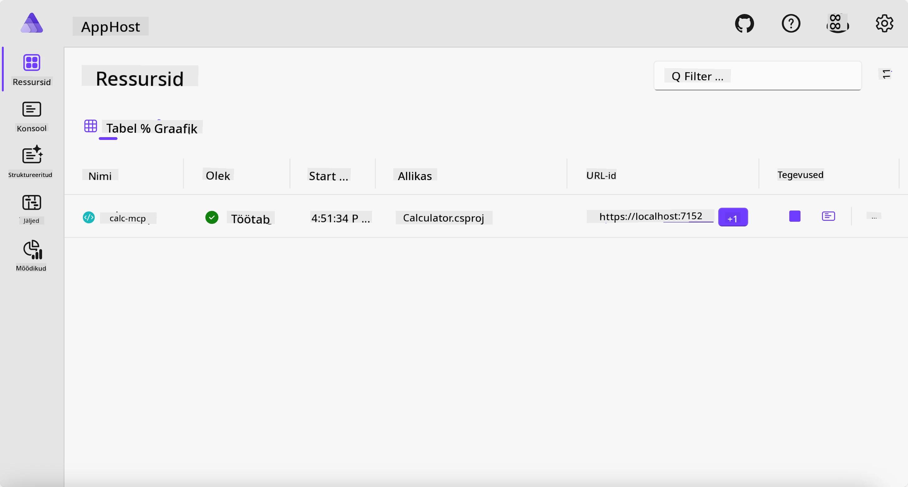
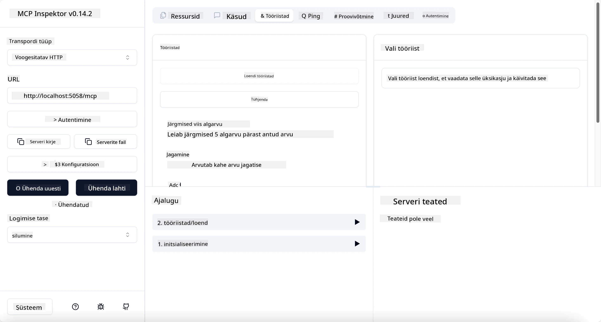
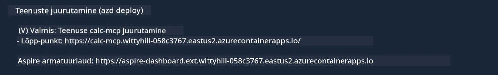

# Näidis

Eelmine näide näitab, kuidas kasutada lokaalset .NET projekti tüübi `stdio` abil. Ja kuidas käivitada server lokaalselt konteineris. See on paljudes olukordades hea lahendus. Kuid võib olla kasulik, kui server töötab kaugjuhtimisel, näiteks pilvekeskkonnas. Siin tuleb mängu `http` tüüp.

Vaadates lahendust kaustas `04-PracticalImplementation`, võib see tunduda palju keerulisem kui eelmine. Kuid tegelikult see nii ei ole. Kui vaatate tähelepanelikult projekti `src/Calculator`, näete, et see on enamasti sama kood nagu eelnevas näites. Ainus erinevus on see, et me kasutame teist raamatukogu `ModelContextProtocol.AspNetCore` HTTP päringute käsitlemiseks. Ja me muudame meetodi `IsPrime` privaatseks, lihtsalt selleks, et näidata, et koodis võib olla privaatseid meetodeid. Ülejäänud kood on sama mis varem.

Teised projektid on pärit [Aspire](https://aspire.dev/get-started/what-is-aspire/). Aspire lisamine lahendusse parandab arendaja kogemust arendamise ja testimise käigus ning aitab nähtavusega. Serveri käivitamiseks see ei ole vajalik, kuid on hea tava hoida see oma lahenduses.

## Käivita server lokaalselt

1. Minge VS Code's (C# DevKit laiendusega) kataloogi `04-PracticalImplementation/samples/csharp`.
1. Käivitage järgmine käsk serveri käivitamiseks:

   ```bash
    dotnet watch run --project ./src/AppHost
   ```

1. Kui veebibrauser avab Aspire juhtpaneeli, pange tähele `http` URL-i. See peaks olema midagi sellist nagu `http://localhost:5058/`.

   

## Testi voogedastuse HTTP-tüüpi koos MCP Inspectoriga

Kui teil on Node.js versioon 22.7.5 või uuem, saate MCP Inspectoriga oma serverit testida.

Käivitage server ja käivitage terminalis järgmine käsk:

```bash
npx @modelcontextprotocol/inspector http://localhost:5058
```



- Valige Transport tüübi alt `Streamable HTTP`.
- Sisestage Url väljale eelnevalt märgitud serveri URL ja lisage lõppu `/mcp`. See peaks olema `http` (mitte `https`), midagi sellist nagu `http://localhost:5058/mcp`.
- valige Connect nupp.

Inspektori hea omadus on, et see annab hea ülevaate sellest, mis toimub.

- Proovige saada nimekiri olemasolevatest tööriistadest
- Proovige mõnda neist, see peaks toimima sama moodi nagu varem.

## Testi MCP serverit GitHub Copilot Chatiga VS Code’is

Streamable HTTP transpordi kasutamiseks GitHub Copilot Chatiga muutke varem loodud `calc-mcp` serveri konfiguratsioon järgmiselt:

```jsonc
// .vscode/mcp.json
{
  "servers": {
    "calc-mcp": {
      "type": "http",
      "url": "http://localhost:5058/mcp"
    }
  }
}
```

Tehke mõned testid:

- Paluge "3 algarvu pärast 6780". Märkige, kuidas Copilot kasutab uues tööriistas `NextFivePrimeNumbers` ja tagastab ainult esimesed 3 algarvu.
- Paluge "7 algarvu pärast 111", et näha, mis juhtub.
- Paluge "Johnil on 24 kommi ja ta tahab need kolm päeva jagada, mitu kommi saab iga laps?", et näha, mis juhtub.

## Paigaldage server Azure'i

Paigaldame serveri Azure'i, et rohkem inimesed saaksid seda kasutada.

Terminalis navigeerige kausta `04-PracticalImplementation/samples/csharp` ja käivitage järgmine käsk:

```bash
azd up
```

Kui paigaldamine on lõppenud, peaksite nägema sellist teadet:



Haarake URL ja kasutage seda MCP Inspectoris ja GitHub Copilot Chat'is.

```jsonc
// .vscode/mcp.json
{
  "servers": {
    "calc-mcp": {
      "type": "http",
      "url": "https://calc-mcp.gentleriver-3977fbcf.australiaeast.azurecontainerapps.io/mcp"
    }
  }
}
```

## Mis edasi?

Me proovime erinevaid transporditüüpe ja testimisvahendeid. Me paigaldame ka teie MCP serveri Azure'i. Aga mis siis, kui meie serveril on vaja ligipääsu privaatsetele ressurssidele? Näiteks andmebaasile või privaatsele API-le? Järgmises peatükis vaatame, kuidas saame oma serveri turvalisust parandada.

---

<!-- CO-OP TRANSLATOR DISCLAIMER START -->
**Lahtiütlus**:
See dokument on tõlgitud kasutades AI tõlketeenust [Co-op Translator](https://github.com/Azure/co-op-translator). Kuigi me püüdleme täpsuse poole, palun pange tähele, et automatiseeritud tõlgetes võib esineda vigu või ebatäpsusi. Originaaldokument selle emakeeles tuleks pidada autoriteetseks allikaks. Olulise teabe puhul soovitatakse kasutada professionaalset inimtõlget. Me ei vastuta selle tõlkega seotud eksimustest või valesti mõistmistest.
<!-- CO-OP TRANSLATOR DISCLAIMER END -->