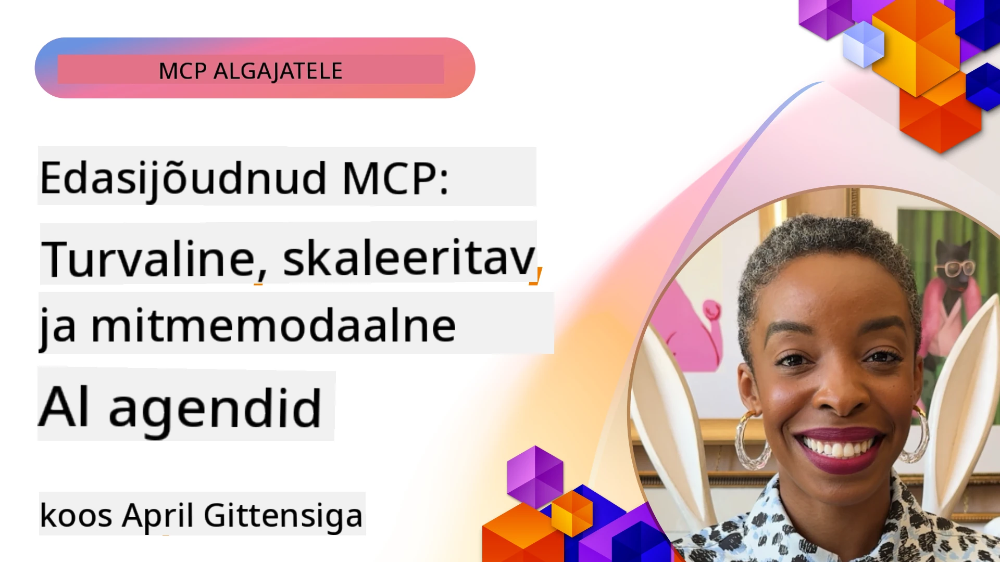

# Täiustatud teemad MCPs

_(Klõpsake ülaloleval pildil, et vaadata selle õppetunni videot)_

See peatükk käsitleb valikut täiustatud teemasid Model Context Protocoli (MCP) rakendamises, sealhulgas multimodaalset integratsiooni, skaleeritavust, turvalisuse parimaid tavasid ja ettevõtte integreerimist. Need teemad on olulised tugeva ja tootmiskõlbuliku MCP rakenduse loomisel, mis suudab vastata kaasaegsete tehisintellekti süsteemide nõudmistele.

## Ülevaade

See õppetund uurib Model Context Protocoli rakendamise keerukamaid kontseptsioone, keskendudes multimodaalsele integratsioonile, skaleeritavusele, turvalisuse parimatele tavadele ja ettevõtte integreerimisele. Need teemad on olulised tootmistasemel MCP rakenduste loomiseks, mis suudavad käsitleda keerukaid nõudmisi ettevõtte keskkondades.

> **Vaade tulevikku:** mitmed allpool käsitletavad teemad on mõjutatud `2026-07-28` MCP spetsifikatsiooni vabastusversiooni kandidaadist — Root Contexts (5.4) ja Sampling (5.6) põhinevad primitiividel, mida vabastusversiooni kandidaat märgib vananenuks, ning eksperimentaalne Tasks funktsioon, mida mainitakse Protocol Features (5.16), liigub pühendatud Tasks laiendusse. Täpsemat teavet leiate jaotisest [Mis muutub MCPs: 2026-07-28 vabastusversiooni kandidaat](../01-CoreConcepts/mcp-2026-07-28-release-candidate.md).

## Õpieesmärgid

Selle õppetunni lõpuks oskad:

- Rakendada multimodaalseid võimalusi MCP raamistikus
- Kujundada skaleeritavaid MCP arhitektuure suure nõudlusega stsenaariumiteks
- Rakendada turvalisuse parimaid tavasid MCP turvapõhimõtetega kooskõlas
- Integreerida MCP ettevõtte tehisintellekti süsteemide ja raamistikuga
- Optimeerida jõudlust ja töökindlust tootmiskeskkondades

## Õppetunnid ja näidistööd

| Link | Pealkiri | Kirjeldus |
|------|----------|-----------|
| [5.1 Integratsioon Azurega](./mcp-integration/README.md) | Integratsioon Azurega | Õpi, kuidas integreerida oma MCP server Azure keskkonda |
| [5.2 Multimodaalne näidis](./mcp-multi-modality/README.md) | MCP multimodaalsed näited | Näited heli-, pildi- ja multimodaalsetele vastustele |
| [5.3 MCP OAuth2 näidis](../../../05-AdvancedTopics/mcp-oauth2-demo) | MCP OAuth2 demo | Väike Spring Boot rakendus, mis demonstreerib OAuth2 kasutamist MCP-ga nii autoriseerimis- kui ka ressursiserverina. Näitab turvalist tokenite väljastamist, kaitstud lõpp-punkte, Azure Container Apps juurutamist ja API halduse integreerimist. |
| [5.4 Root Contexts](./mcp-root-contexts/README.md) | Põhikontekstid | Õpi rohkem põhikonteksti kohta ja kuidas neid rakendada |
| [5.5 Reiting](./mcp-routing/README.md) | Reiting | Õpi erinevaid reitingutüüpe |
| [5.6 Valimine](./mcp-sampling/README.md) | Valimine | Õpi, kuidas töötada valimisega |
| [5.7 Skaleerimine](./mcp-scaling/README.md) | Skaleerimine | Õpi skaleerimisest |
| [5.8 Turvalisus](./mcp-security/README.md) | Turvalisus | Turvata oma MCP server |
| [5.9 Veebipõhine otsing MCP-ga](./web-search-mcp/README.md) | Veebipõhine otsing MCP-ga | Python MCP server ja klient, mis on integreeritud SerpAPI-ga reaalajas veebipõhise, uudiste, toodete otsingu ja Q&A jaoks. Demonstreerib mitme tööriista orkestreerimist, väliseid API integratsioone ja tugevat veahaldust. |
| [5.10 Reaalajas voogedastus](./mcp-realtimestreaming/README.md) | Voogedastus | Reaalajas andmevoog on tänapäeva andmepõhises maailmas hädavajalik, kus ettevõtted ja rakendused vajavad informatsioonile viivitamatut ligipääsu õigeaegsete otsuste tegemiseks. |
| [5.11 Reaalaja veebipõhine otsing](./mcp-realtimesearch/README.md) | Veebipõhine otsing | Kuidas MCP muudab reaalajas veebipõhist otsingut, pakkudes AI mudelite, otsingumootorite ja rakenduste konteksti juhtimise standardset lähenemist. |
| [5.12 Entra ID autentimine Model Context Protocol serveritele](./mcp-security-entra/README.md) | Entra ID autentimine | Microsoft Entra ID pakub võimsat pilvepõhist identiteedi- ja juurdepääsuhaldust, aidates tagada, et ainult volitatud kasutajad ja rakendused saavad suhelda sinu MCP serveriga. |
| [5.13 Microsoft Foundry agendi integratsioon](./mcp-foundry-agent-integration/README.md) | Microsoft Foundry integratsioon | Õpi, kuidas integreerida Model Context Protocol serverid Microsoft Foundry agentidega, mis võimaldab võimsaid tööriistade orkestreerimise ja ettevõtte tehisintellekti võimekusi standardiseeritud väliste andmeallikate ühenduste abil. |
| [5.14 Konteksti inseneriteadus](./mcp-contextengineering/README.md) | Konteksti inseneriteadus | MCP serverite konteksti inseneritehnika tulevikuvõimalused, kaasa arvatud konteksti optimeerimine, dünaamiline konteksti haldamine ja tõhusate päringuinsenerimistehnikate strateegiad MCP raamistikus. |
| [5.15 Kohandatud transport](./mcp-transport/README.md) | Kohandatud transport | Õpi, kuidas rakendada kohandatud transpordimehhanisme spetsiaalseteks MCP suhtlusstsenaariumiteks. |
| [5.16 Protokolli funktsioonide süvitsi uurimine](./mcp-protocol-features/README.md) | Protokolli funktsioonid | Valda täiustatud protokolli funktsioone, sealhulgas edenemise teavitusi, päringu tühistamist, ressursimallid ja veakäsitluse mustreid. |
| [5.17 Vaatluslik mitmeagendi mõtlemine](./mcp-adversarial-agents/README.md) | Konkurentsivõimelised agendid | Kasuta kahte vastandlike seisukohtadega agenti, jagades üht MCP tööriistakomplekti, et tabada hallutsinatsioone, tuua esile äärmusjuhtumeid ja toota paremini kalibreeritud väljundeid struktureeritud arutelu kaudu. |

> **Uuendus MCP spetsifikatsioonis 2025-11-25**: spetsifikatsioon sisaldab nüüd eksperimentaalset tuge **Ülesannetele** (pikaajalised toimingud edenemise jälgimisega), **Tööriistade annotatsioonidele** (tööriista käitumise metadata ohutuse tagamiseks), **URL-režiimi väljakutsumisele** (spetsiifiliste URL-i sisu päring klientidelt) ja täiustatud **Roots** (tööruumi konteksti haldamiseks). Täpsemalt vt [MCP spetsifikatsiooni muudatuste logi](https://spec.modelcontextprotocol.io/).

## Täiendavad viited

Kõige värskema teabe saamiseks täiustatud MCP teemadel vaata:
- [MCP dokumentatsioon](https://modelcontextprotocol.io/)
- [MCP spetsifikatsioon (2025-11-25)](https://spec.modelcontextprotocol.io/specification/2025-11-25/)
- [GitHubi hoidla](https://github.com/modelcontextprotocol)
- [OWASP MCP Top 10](https://microsoft.github.io/mcp-azure-security-guide/mcp/) – turvariskid ja leevendused
- [MCP turvasumma töökoda (Sherpa)](https://azure-samples.github.io/sherpa/) - praktiline turvakoolitus

## Peamised järeldused

- Multi-modaalsed MCP rakendused laiendavad tehisintellekti võimeid tekstiprotsessimise kõrval
- Skaleeritavus on hädavajalik ettevõtte juurutustes ja seda saab tagada horisontaalse ning vertikaalse skaleerimisega
- Põhjalikud turvameetmed kaitsevad andmeid ja tagavad korrektsed ligipääsuõigused
- Ettevõtte integreerimine platvormidega nagu Azure OpenAI ja Microsoft AI Foundry tugevdab MCP võimekust
- Täiustatud MCP rakendused saavad kasu optimeeritud arhitektuuridest ja hoolikast ressursside haldusest

## Harjutus

Kavanda ettevõtte tasemel MCP rakendus konkreetse kasutusjuhtumi jaoks:

1. Tuvasta oma kasutusjuhtumi multimodaalsed nõuded
2. Tööta välja turvakontrollid tundlike andmete kaitseks
3. Kujunda skaleeritav arhitektuur, mis suudab handleerida muutuvat koormust
4. Plaani integreerimispunktid ettevõtte tehisintellekti süsteemidega
5. Dokumenteeri potentsiaalsed jõudluse kitsaskohad ja leevendusstrateegiad

## Täiendavad ressursid

- [Azure OpenAI dokumentatsioon](https://learn.microsoft.com/en-us/azure/ai-services/openai/)
- [Microsoft AI Foundry dokumentatsioon](https://learn.microsoft.com/en-us/ai-services/)

---

## Mis järgmiseks

Uuri selle mooduli õppetunde, alustades: [5.1 MCP integratsioon](./mcp-integration/README.md)

Pärast selle mooduli läbimist jätka: [Moodul 6: kogukonna panused](../06-CommunityContributions/README.md)

---

<!-- CO-OP TRANSLATOR DISCLAIMER START -->
**Lahtiütlus**:
See dokument on tõlgitud kasutades AI tõlketeenust [Co-op Translator](https://github.com/Azure/co-op-translator). Kuigi me püüdleme täpsuse poole, palun pange tähele, et automatiseeritud tõlgetes võib esineda vigu või ebatäpsusi. Originaaldokument selle emakeeles tuleks pidada autoriteetseks allikaks. Olulise teabe puhul soovitatakse kasutada professionaalset inimtõlget. Me ei vastuta selle tõlkega seotud eksimustest või valesti mõistmistest.
<!-- CO-OP TRANSLATOR DISCLAIMER END -->