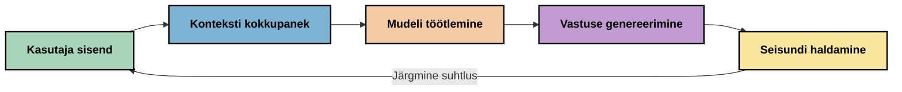
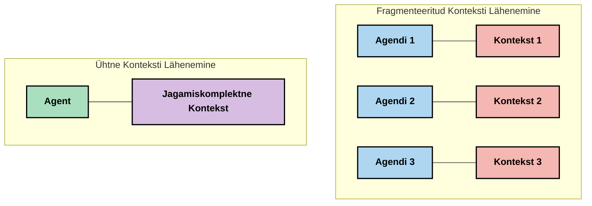
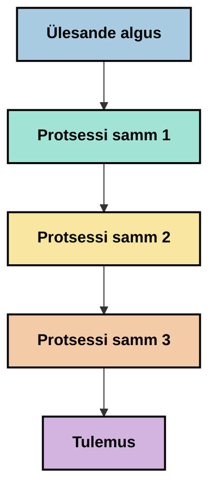
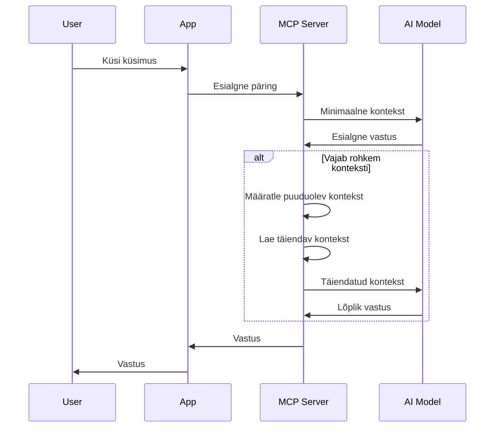
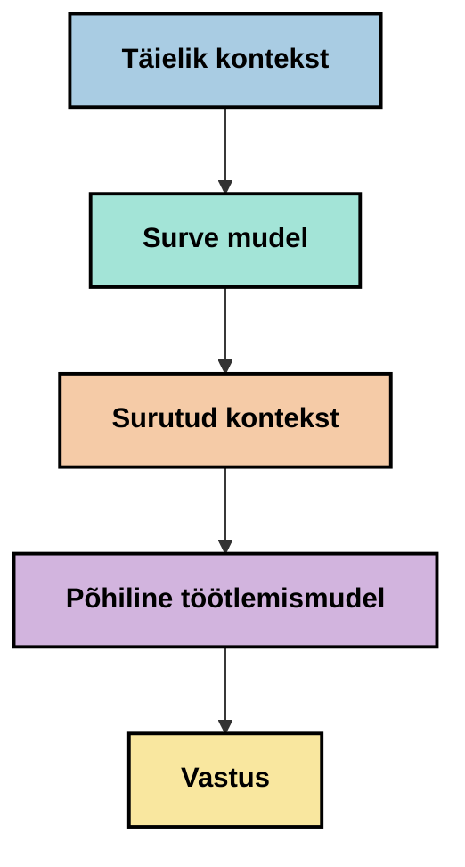
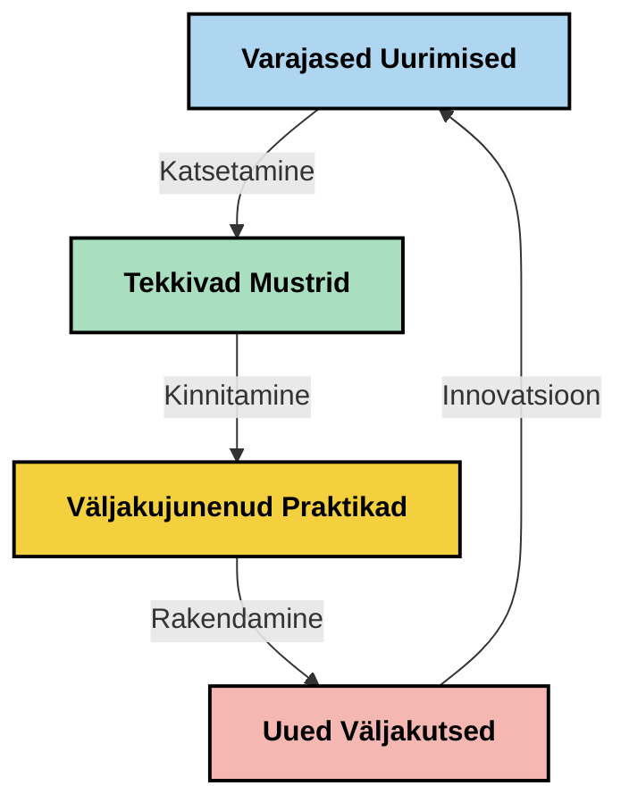

# Kontekstitöötlus: uus kontseptsioon MCP ökosüsteemis

## Ülevaade

Kontekstitöötlus on tehisintellekti valdkonnas tekkiv kontseptsioon, mis uurib, kuidas teave on struktureeritud, edastatud ja hoitud suhtluses klientide ja tehisintellektiteenuste vahel. Nagu Model Context Protocoli (MCP) ökosüsteem areneb, muutub konteksti tõhus haldamine üha olulisemaks. See moodul tutvustab kontekstitöötluse kontseptsiooni ja uurib selle võimalikke rakendusi MCP kasutuselevõtus.

## Õpieesmärgid

Selle mooduli lõpuks oskad sa:

- Mõista tekkivat kontekstitöötluse kontseptsiooni ja selle potentsiaalset rolli MCP rakendustes
- Tuvastada peamisi konteksti haldamise väljakutseid, mida MCP protokolli disain käsitleb
- Uurida tehnikaid mudeli jõudluse parandamiseks parema kontekstitöötluse kaudu
- Mõelda lähenemisviisidele konteksti tõhususe mõõtmiseks ja hindamiseks
- Rakendada need tekkivad kontseptsioonid AI kogemuste parendamiseks MCP raamistiku kaudu

## Tutvustus kontekstitöötlusse

Kontekstitöötlus on tekkiv kontseptsioon, mis keskendub kasutajate, rakenduste ja AI mudelite vahelise info voolu sihipärasele kujundamisele ja haldamisele. Erinevalt väljakujunenud valdkondadest nagu prompti inseneriteadus on kontekstitöötlus alles praktikutest lähtuv ja seda defineeritakse alles, kuna nad lahendavad unikaalseid väljakutseid pakkuda AI mudelitele õiget teavet õigel ajal.

Kui suured keelemudelid (LLMid) on arenenud, on konteksti tähtsus muutunud üha ilmsemaks. Meile antava konteksti kvaliteet, asjakohasus ja struktuur mõjutab otseselt mudeli väljundeid. Kontekstitöötlus uurib seda suhet ja püüab välja töötada põhimõtteid tõhusaks konteksti haldamiseks.

> "Aastal 2025 on mudelid väga nutikad. Kuid isegi kõige targem inimene ei suuda oma tööd tõhusalt teha ilma kontekstita selle kohta, mida temalt nõutakse... ‘Kontekstitöötlus’ on järkjärguline tase prompti inseneriteaduses. See tähendab selle automaatset tegemist dünaamilises süsteemis." — Walden Yan, Cognition AI

Kontekstitöötlus võib hõlmata:

1. **Konteksti valik**: otsustamine, milline info on antud ülesande jaoks asjakohane
2. **Konteksti struktureerimine**: info organiseerimine mudeli mõistmise maksimeerimiseks
3. **Konteksti edastamine**: optimeerimine, kuidas ja millal info mudelile saadetakse
4. **Konteksti hooldamine**: oleku ja konteksti arengu haldamine aja jooksul
5. **Konteksti hindamine**: konteksti tõhususe mõõtmine ja parandamine

Need fookusvaldkonnad on eriti olulised MCP ökosüsteemis, mis pakub standardiseeritud viisi rakendustele konteksti pakkumiseks LLMidele.

## Konteksti teekonna vaade

Üks võimalus kontekstitöötlust visualiseerida on jälgida, kuidas info liigub läbi MCP süsteemi:



### Konteksti teekonna peamised etapid:

1. **Kasutaja sisend**: kasutajalt tulev tooraine (tekst, pildid, dokumendid)
2. **Konteksti koostamine**: kasutaja sisendi kombineerimine süsteemi konteksti, vestlustaajaga ja muu hangitud infoga
3. **Mudeli töötlemine**: AI mudel töötleb koostatud konteksti
4. **Vastuse genereerimine**: mudel toodab antud konteksti põhjal väljundid
5. **Olekute haldamine**: süsteem värskendab sisemist olekut vastavalt suhtlusele

See vaade rõhutab konteksti dünaamilist olemust AI süsteemides ja esitab olulisi küsimusi, kuidas iga etapi info parimal viisil hallata.

## Tekkivad põhimõtted kontekstitöötluses

Kasutajate seas kontekstitöötluse valdkonna kujunedes on hakanud ilmuma mõned esialgsed põhimõtted. Need põhimõtted võivad aidata MCP rakenduste valikutes:

### Põhimõte 1: Jaga konteksti täielikult

Kontekst tuleks jagada tervikuna kogu süsteemi komponentide vahel, mitte killustatult mitme agendi või protsessi vahel. Kui kontekst on hajutatud, võivad ühe süsteemi osa otsused konflikti minna teistega.



MCP rakendustes tähendab see süsteemide kujundamist, kus kontekst voolab sujuvalt kogu töövoogu, mitte ei ole eraldi sektorisse jagatud.

### Põhimõte 2: Tee teadlikuks, et tegevused sisaldavad implitsiitseid otsuseid

Iga mudeli tegevus sisaldab varjatud otsuseid, kuidas konteksti tõlgendada. Kui mitu komponenti tegutseb erineva kontekstiga, võivad need implitsiitsed otsused vastuollu minna, põhjustades ebajärjekindlaid tulemusi.

Sellel põhimõttel on MCP rakenduste jaoks olulised järeldused:
- Eelista keeruliste ülesannete lineaarset töötlemist paralleelse täitmise asemel killustatud kontekstiga
- Tagada, et kõigil otsustemomentidel oleks ligipääs samale kontekstuaalsele infole
- Kujundada süsteemid nii, et hilisemad sammud näeksid varasemate otsuste täielikku konteksti

### Põhimõte 3: Tasakaalusta konteksti sügavust akna piirangutega

Nii nagu vestlused ja protsessid pikenevad, täituvad kontekstiaknad lõpuks. Tõhus kontekstitöötlus uurib võimalusi hallata seda pinget kõikehõlmava konteksti ja tehniliste piirangute vahel.

Võimalikud uuritud lähenemised hõlmavad:
- Konteksti kokkusurumine, mis säilitab olulise info, vähendades samas tokenite kasutust
- Konteksti progressiivne laadimine vastavalt praegusele asjakohasusele
- Eelmiste interaktsioonide kokkuvõtete tegemine, säilitades võtmeotsused ja faktid

## Konteksti väljakutsed ja MCP protokolli disain

Model Context Protocol (MCP) on disainitud unikaalsete konteksti haldamise väljakutsete mõistmise põhjal. Nende väljakutsete mõistmine aitab selgitada MCP protokolli disaini olulisemaid aspekte:

### Väljakutse 1: Konteksti akna piirangud  
Enamik AI mudeleid on fikseeritud konteksti aknasuurusega, mis piirab seda, kui palju teavet saab korraga töödelda.

**MCP disaini vastus:**  
- Protokoll toetab struktureeritud, ressurssidel põhinevat konteksti, mida saab tõhusalt viidata  
- Ressursse saab lehekülgedeks jagada ja progressiivselt laadida  

### Väljakutse 2: Asjakohasuse määramine  
On keeruline otsustada, milline info on konteksti kaasamiseks kõige asjakohasem.

**MCP disaini vastus:**  
- Paindlikud tööriistad võimaldavad dünaamilist info hankimist vastavalt vajadusele  
- Struktureeritud promptid võimaldavad konteksti järjepidevat organiseerimist  

### Väljakutse 3: Konteksti püsivus  
Olekute haldamine suhtluse vältel nõuab konteksti hoolikat jälgimist.

**MCP disaini vastus:**  
- Standardiseeritud sessioonihaldus  
- Selgelt määratletud interaktsioonimustrid konteksti arenguks  

### Väljakutse 4: Mitmekesine kontekst  
Erinevad andmetüübid (tekst, pildid, struktureeritud andmed) vajavad erinevat käsitlust.

**MCP disaini vastus:**  
- Protokolli disain toetab erinevate sisutüüpide kasutamist  
- Mitmemodaalse info standardiseeritud esitamine  

### Väljakutse 5: Turvalisus ja privaatsus  
Kontekst sisaldab sageli tundlikku teavet, mida tuleb kaitsta.

**MCP disaini vastus:**  
- Selged piirid kliendi ja serveri vastutusalades  
- Kohalikud töötlemisvõimalused andmete lekkimise minimeerimiseks  

Nende väljakutsete mõistmine ja MCP lahendused pakuvad alust keerukamate kontekstitöötluse tehnikate uurimiseks.

## Tekkivad lähenemised kontekstitöötluses

Kontekstitöötluse valdkonna arenedes tekib mitmeid paljulubavaid lähenemisi. Need peegeldavad pigem praeguseid mõtteid kui väljakujunenud häid tavasid ja tõenäoliselt arenevad edaspidi koos MCP kogemuste suurenemisega.

### 1. Üheteljelise lineaarse töötlemise lähenemine

Mitmeagentsete arhitektuuride asemel, mis killustavad konteksti, leiavad mõned praktikud, et üheteljelise lineaarse töötlemise lähenemine annab järjekindlamaid tulemusi. See vastab ühtse konteksti säilitamise põhimõttele.


  
Kuigi see lähenemine võib tunduda vähem efektiivne kui paralleeltöötlus, annab see sageli koherentsemaid ja usaldusväärsemaid tulemusi, sest iga samm põhineb täielikul arusaamisel varasematest otsustest.

### 2. Konteksti tükkideks jagamine ja prioriseerimine

Suure konteksti jagamine hallatavateks osadeks ja olulise prioriseerimine.

```python
# Kontseptuaalne näide: konteksti lõhestamine ja prioriseerimine
def process_with_chunked_context(documents, query):
    # 1. Jagage dokumendid väiksemateks osadeks
    chunks = chunk_documents(documents)
    
    # 2. Arvutage iga osa asjakohasuse skoor
    scored_chunks = [(chunk, calculate_relevance(chunk, query)) for chunk in chunks]
    
    # 3. Sorteerige osad asjakohasuse skoori järgi
    sorted_chunks = sorted(scored_chunks, key=lambda x: x[1], reverse=True)
    
    # 4. Kasutage kõige asjakohasemaid osi kontekstina
    context = create_context_from_chunks([chunk for chunk, score in sorted_chunks[:5]])
    
    # 5. Töötlege prioriseeritud kontekstiga
    return generate_response(context, query)
```
  
Ülaltoodud kontseptsioon illustreerib, kuidas võiks suuri dokumente lõigata hallatavaks osadeks ja valida konteksti jaoks ainult asjakohasemaid osi. See aitab töötada konteksti akna piirangute raames, kasutades samas suuri teadmistebaase.

### 3. Konteksti järkjärguline laadimine

Konteksti laadimine vajadusel järk-järgult, mitte kõike korraga.


  
Järkjärguline konteksti laadimine algab minimaalse kontekstiga ja laieneb ainult vajaduse korral. See võib oluliselt vähendada tokenite kasutust lihtsate päringute puhul, säilitades võimaluse keerukamate küsimuste käsitlemiseks.

### 4. Konteksti kokkusurumine ja kokkuvõtete tegemine

Konteksti suuruse vähendamine, säilitades samas olulise info.


  
Konteksti kokkusurumine keskendub:  
- Korduva info eemaldamisele  
- Pikemate sisuosade kokkuvõtetele  
- Oluliste faktide ja detailide väljavõtmisele  
- Kriitiliste konteksti elementide säilitamisele  
- Tokenite tõhusaks optimeerimisele  

See võib olla eriti väärtuslik pika vestluse konteksti pidamisel akna piires või suurte dokumentide efektiivsel töötlemisel. Mõned praktikud kasutavad spetsiaalseid mudeleid just vestluse ajaloo kokkusurumiseks ja kokkuvõtmiseks.

## Uurimisvaldkonna kaalutlused kontekstitöötluses

Kontekstitöötluse valdkonda uurides on mõningaid kaalutlusi, mida tasub MCP rakendustega töötades meeles pidada. Need ei ole normatiivsed parimad praktikad, vaid uurimisvaldkonnad, mis võivad konkreetse kasutuse puhul anda paranemisi.

### Mõtle oma konteksti eesmärkidele

Enne keerukate konteksti haldamise lahenduste rakendamist sõnasta selgelt, mida soovid saavutada:  
- Millist konkreetset infot mudel vajab edu saavutamiseks?  
- Milline info on hädavajalik võrreldes lisateabega?  
- Millised on sinu jõudluspiirangud (latentsus, tokeni piirangud, kulud)?

### Uuri kihilist konteksti lähenemisi

Mõned praktikud on leidnud edu konteksti organiseerimisel kontseptuaalsetesse kihtidesse:  
- **Tuumikiht**: Mudeli jaoks alati vajalik põhiinfo  
- **Situatsioonikiht**: Praeguse suhtluse spetsiifiline kontekst  
- **Toetav kiht**: Täiendav info, mis võib olla kasulik  
- **Varukiht**: Info, mida kasutatakse vaid vajadusel  

### Uuri teabe hankimise strateegiaid

Sinu konteksti tõhusus sõltub sageli sellest, kuidas sa infot hangid:  
- Semantiline otsing ja manused kontseptuaalse asjakohasuse leidmiseks  
- Märksõnapõhine otsing konkreetsete faktide jaoks  
- Hübriidlahendused, mis kombineerivad mitut meetodit  
- Metainfo filtrid, et kitsendada ulatust kategooriate, kuupäevade või allikate järgi  

### Katseta konteksti kiredusega

Konteksti struktuur ja voog võivad mõjutada mudeli mõistmist:  
- Seotud info grupeerimine koos  
- Järjepidev vormindamine ja organiseerimine  
- Loogiline või kronoloogiline järjestus, kus sobib  
- Vältida vastuolulist infot  

### Mõtle mituagendi arhitektuuride kompromissidele

Kuigi mitu agenti arhitektuurid on paljude AI raamistikute seas populaarsed, tekitavad need konteksti haldamises olulisi probleeme:  
- Konteksti killustatus võib viia ebajärjekindlate otsusteni erinevate agentide vahel  
- Paralleeltöötlus võib põhjustada raskesti lahendatavaid konflikte  
- Agentide vaheline suhtluskulu võib katta jõudluse paranemise  
- Koherentsuse säilitamiseks on vaja keerukat oleku haldamist  

Paljudel juhtudel võib üheteljelise agenti õige konteksti haldusega lähenemine anda usaldusväärsemaid tulemusi kui mitme spetsialiseeritud agendi killustatud kontekstiga.

### Arenda hindamismeetodeid

Kontekstitöötluse parandamiseks mõtle, kuidas oma edusamme mõõdad:  
- A/B testimine erinevate konteksti struktuuride vahel  
- Tokenite kasutuse ja reageerimisaegade jälgimine  
- Kasutajate rahulolu ja ülesannete täitmise määrade jälgimine  
- Juhtumite analüüs, kus konteksti strateegiad ebaõnnestuvad  

Need kaalutlused on aktiivsed uurimisvaldkonnad kontekstitöötluses. Valdkonna küpsemisel tõenäoliselt ilmuvad rohkem kindlad mustrid ja praktikud.

## Konteksti tõhususe mõõtmine: arenev raamistik

Kuna kontekstitöötlus on alles kontseptsioonina kujunemas, on praktikutel alanud katsetused selle tõhususe mõõtmiseks. Tõhusat raamistikku pole veel, kuid kaalutakse mitmeid mõõdikuid, mis võiksid tulevasi töid suunata.

### Võimalikud mõõtmisdimensioonid

#### 1. Sisendi tõhususe kaalutlused

- **Konteksti ja vastuse suhe**: kui palju konteksti on vastuse suuruse suhtes vaja?  
- **Tokenite kasutus**: kui suur osa antud kontekstist mõjutab vastust?  
- **Konteksti vähendamine**: kui efektiivselt suudame toornaine kokku suruda?  

#### 2. Jõudluse kaalutlused

- **Latentsuse mõju**: kuidas konteksti haldus mõjutab vastuse aega?  
- **Tokeni majandus**: kas kasutame tokenit tõhusalt?  
- **Informatsiooni täpsus**: kui asjakohane on hangitud info?  
- **Ressursside kasutus**: millist arvutusvõimsust on vaja?  

#### 3. Kvaliteedi kaalutlused

- **Vastuse asjakohasus**: kui hästi vastus päringut käsitleb?  
- **Faktitäpsus**: kas konteksti haldus parandab faktide täpsust?  
- **Järjepidevus**: kas vastused on sarnaste päringute puhul ühtsed?  
- **Hallutsinatsioonide määr**: kas parem kontekst vähendab mudeli vigu?  

#### 4. Kasutajakogemuse kaalutlused

- **Järjepärase küsimuse määr**: kui sageli kasutajad vajavad täpsustamist?  
- **Ülesannete täitmine**: kas kasutajad saavutavad edukalt oma eesmärgid?  
- **Rahulolu näitajad**: kuidas kasutajad hindavad kogemust?  

### Uurimuslikud mõõtmislähenemised

Kontekstitöötlusega MCP rakendustes katsetades kaaluda järgmisi uurimuslikke lähenemisi:

1. **Võrdlemine baasnäitajatega**: Sea baasnäitaja lihtsate konteksti lähenemistega, enne keerukamate testimist  
2. **Järkjärguline muutmine**: Muuda ühte konteksti haldamise aspekti korraga mõju eristamiseks  
3. **Kasutajakeskne hindamine**: Kombineeri kvantitatiivseid näitajaid kvalitatiivse kasutajate tagasisidega  
4. **Ebaõnnestumiste analüüs**: Uuri juhtumeid, kus konteksti strateegiad ei toimi, et leida parendusi  
5. **Mitmemõõtmeline hinnang**: Tasakaalusta tõhusust, kvaliteeti ja kasutajakogemust  

See katsetav ja mitmetahuline lähenemine sobib hästi areneva kontekstitöötluse olemusega.

## Lõppmõtted

Kontekstitöötlus on tekkiv uurimisvaldkond, mis võib osutuda keskseks tõhusate MCP rakenduste jaoks. Mõeldes hoolikalt, kuidas info süsteemis liigub, võib luua AI kogemusi, mis on tõhusamad, täpsemad ja kasutajatele väärtuslikumad.

Selles moodulis kirjeldatud tehnikad ja lahendused on varajane mõtlemine selles valdkonnas, mitte väljakujunenud praktikad. Kontekstitöötlus võib areneda täpsemaks distsipliiniks, kui AI võimed arenevad ja meie arusaam süveneb. Praegu tundub katsetamine koos hoolika mõõtmisega olevat kõige tootlikum tee.

## Võimalikud tulevased suunad

Kontekstitöötluse valdkond on alles algusjärgus, kuid mõningad paljulubavad suunad tulevad esile:

- Kontekstitöötluse põhimõtetel võib olla märkimisväärne mõju mudeli jõudlusele, tõhususele, kasutajakogemusele ja usaldusväärsusele  
- Üheteljelised lähenemised tervikliku konteksti haldusega võivad paljudes kasutusjuhtudes ületada mitme-agentse arhitektuuri  
- Spetsiaalsed konteksti kokkusurumise mudelid võivad saada AI töövoogude standardseteks komponentideks  
- Konteksti täiuslikkuse ja tokenite piirangute pinged ajendavad tõenäoliselt uuendusi konteksti haldamises  
- Kuna mudelid muutuvad võimekamaks tõhusal inimlaadses suhtluses, võib tegelik mitu-agentne koostöö saada teostatavamaks  
- MCP rakendused võivad areneda standardiseerimaks konteksti haldamise mustreid, mis praegusest katsetusest välja kooruvad  


  
## Ressursid

### Ametlikud MCP ressursid  
- [Model Context Protocol veebisait](https://modelcontextprotocol.io/)  
- [Model Context Protocol spetsifikatsioon](https://github.com/modelcontextprotocol/modelcontextprotocol)
- [MCP dokumentatsioon](https://modelcontextprotocol.io/docs)
- [MCP C# SDK](https://github.com/modelcontextprotocol/csharp-sdk)
- [MCP Python SDK](https://github.com/modelcontextprotocol/python-sdk)
- [MCP TypeScript SDK](https://github.com/modelcontextprotocol/typescript-sdk)
- [MCP Inspector](https://github.com/modelcontextprotocol/inspector) - Visualiseerimise testimise tööriist MCP serveritele

### Konteksti inseneri artiklid
- [Ära ehita mitmeagente: konteksti inseneri põhimõtted](https://cognition.ai/blog/dont-build-multi-agents) - Walden Yani vaated konteksti inseneri põhimõtetele
- [Praktiline juhend agentide loomisel](https://cdn.openai.com/business-guides-and-resources/a-practical-guide-to-building-agents.pdf) - OpenAI juhend tõhusa agendi kujundamiseks
- [Tõhusate agentide loomine](https://www.anthropic.com/engineering/building-effective-agents) - Anthropicu lähenemine agentide arendamisele

### Seotud uurimistööd
- [Dünaamiline otsingu täiendus suurte keelemudelite jaoks](https://arxiv.org/abs/2310.01487) - Uurimus dünaamiliste otsingumeetodite kohta
- [Kadunud keskel: kuidas keelemudelid kasutavad pikki kontekste](https://arxiv.org/abs/2307.03172) - Oluline uurimus konteksti töötlemise mustritest
- [Hierarhiline tekstipõhine pildigeneratsioon CLIP-i latentsustega](https://arxiv.org/abs/2204.06125) - DALL-E 2 artikkel konteksti struktuurimisega seotud vaadetega
- [Konteksti rolli uurimine suurte keelemudelite arhitektuuris](https://aclanthology.org/2023.findings-emnlp.124/) - Viimane uurimus konteksti käsitlemisel
- [Mitmeagendilise koostöö ülevaade](https://arxiv.org/abs/2304.03442) - Uurimus mitmeagentide süsteemide ja nende väljakutsete kohta

### Täiendavad ressursid
- [Kontekstiakna optimeerimise tehnikad](https://learn.microsoft.com/en-us/azure/ai-services/openai/concepts/context-window)
- [Täiustatud RAG-tehnikad](https://www.microsoft.com/en-us/research/blog/retrieval-augmented-generation-rag-and-frontier-models/)
- [Semantic Kernel dokumentatsioon](https://github.com/microsoft/semantic-kernel)
- [Tehisintellekti tööriistakomplekt konteksti haldamiseks](https://github.com/microsoft/aitoolkit)

## Mis järgmiseks

- [5.15 MCP kohandatud transport](../mcp-transport/README.md)

---

<!-- CO-OP TRANSLATOR DISCLAIMER START -->
**Lahtiütlus**:
See dokument on tõlgitud kasutades AI tõlketeenust [Co-op Translator](https://github.com/Azure/co-op-translator). Kuigi me püüdleme täpsuse poole, palun pange tähele, et automatiseeritud tõlgetes võib esineda vigu või ebatäpsusi. Originaaldokument selle emakeeles tuleks pidada autoriteetseks allikaks. Olulise teabe puhul soovitatakse kasutada professionaalset inimtõlget. Me ei vastuta selle tõlkega seotud eksimustest või valesti mõistmistest.
<!-- CO-OP TRANSLATOR DISCLAIMER END -->