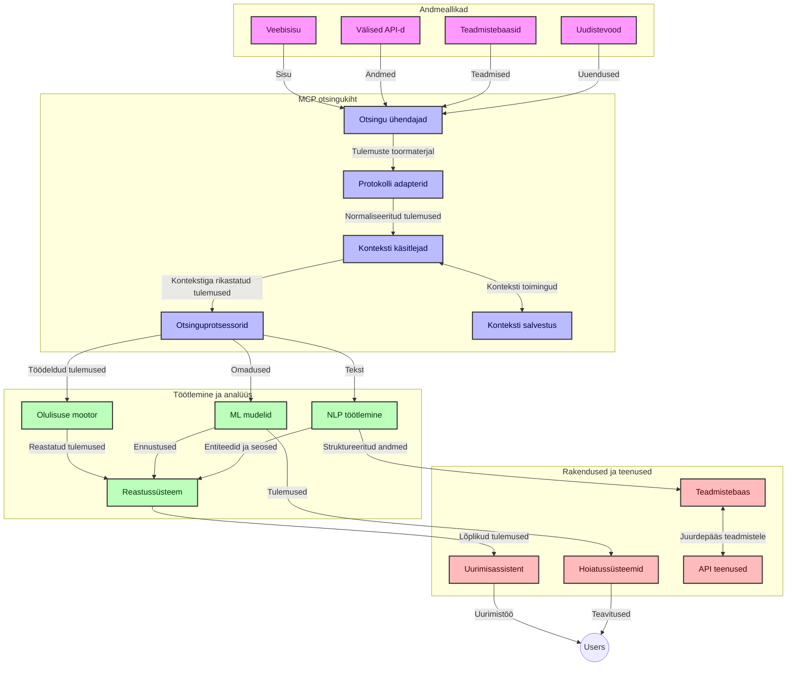
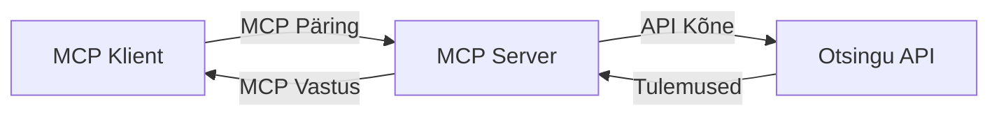
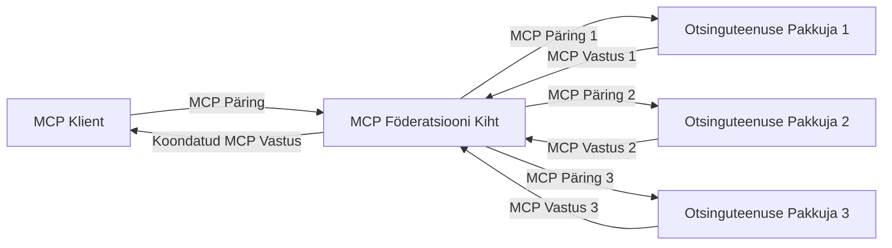
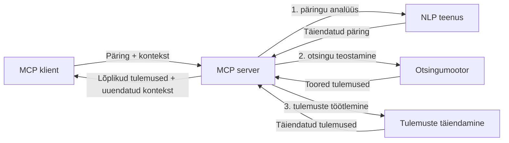

# Mudeli konteksti protokoll reaalajas veebipõhiseks otsinguks

## Ülevaade

Reaalajas veebipõhine otsing on tänapäeva infokeskses keskkonnas muutunud hädavajalikuks, kus rakendustel on vaja kohest ligipääsu internetis olevatele ajakohastele andmetele, et pakkuda asjakohaseid ja õigeaegseid vastuseid. Mudeli konteksti protokoll (MCP) tähistab olulist edasiminekut nende reaalajas otsingu protsesside optimeerimisel, parandades otsingu tõhusust, säilitades kontekstuaalse terviklikkuse ning täiustades süsteemi üldist toimivust.

Käesolev moodul uurib, kuidas MCP muudab reaalajas veebipõhist otsingut, pakkudes standardiseeritud lähenemist kontekstihaldusele AI mudelite, otsingumootorite ja rakenduste vahel.

### Mida sa õpid

Käesolevast põhjalikust juhendist leiad:

- Kuidas MCP loob sujuva silla AI mudelite ja reaalajas veebipõhiste otsinguvõimaluste vahel
- Arhitektuurilised mustrid tõhusate ja skaleeritavate otsingulahenduste rakendamiseks MCP abil
- Tehnikad otsingukonteksti säilitamiseks mitme päringu ja interaktsiooni jooksul
- Praktilised koodinäited Pythonis ja JavaScriptis erinevates otsingustsenaariumides
- Meetodid asjakohasuse, uuenduse järjekorra ja jõudluse tasakaalustamiseks MCP-toega otsingusüsteemides

## Sissejuhatus reaalajas veebipõhisesse otsingusse

Reaalajas veebipõhine otsing on tehnoloogiline lähenemine, mis võimaldab pidevat veebipõhise informatsiooni päringut, töötlemist ja analüüsi selle avaldamisel või uuendamisel, võimaldades süsteemidel pakkuda värsket ja asjakohast teavet minimaalset latentsust kasutades. Erinevalt traditsioonilistest otsingusüsteemidest, mis töötavad indekseeritud andmete alusel, mis võivad olla tunde või päevi vanad, kasutab reaalajas otsing veebist live-andmeid, pakkudes teavet ja teadmisi, mis kajastavad veebisisu hetkeseisu.

### Reaalajas veebipõhise otsingu põhimõisted:

- **Pidev päringute töötlemine**: Otsingupäringud töötatakse läbi pidevalt uuenevate andmeallikate alusel
- **UUenduse suurendamine**: Süsteemid on loodud eelistama värsket teavet
- **Asjakohasuse tasakaalustamine**: Tasakaalu hoidmine asjakohasuse ja uuenduse vahel
- **Skaleeritav arhitektuur**: Süsteemid peavad suutma käsitleda muutuvaid päringukoormuseid ja andmahulkasid
- **Kontekstuaalne mõistmine**: Kasutaja konteksti säilitamine otsingutsüklite vahel on oluline tähenduslike tulemuste saamiseks
- **Dünaamiline päringute ümberkujundamine**: Päringute kohandamine konteksti ja eelmiste tulemustega
- **Mitme allika integreerimine**: Mitme otsinguteenuse ja veebiallika tulemuste kombineerimine
- **Semantiline mõistmine**: Päringute ja sisu töötlemine tähenduse põhjal, mitte ainult märksõnade alusel
- **Reaalajas järjestamine**: Tulemuste järjestuse pidev kohandamine uue teabe saabumisel

### Mudeli konteksti protokoll ja reaalajas veebipõhine otsing

Mudeli konteksti protokoll (MCP) lahendab mitmeid olulisi väljakutseid reaalajas veebipõhises otsingukeskkonnas:

1. **Otsingukonteksti säilitamine**: MCP standardiseerib, kuidas konteksti hoitakse hajutatud otsingukomponentide vahel, tagades, et AI mudelid ja töötlemissõlmed pääsevad ligi asjakohasele päringuajaloo ja kasutajapreferentsidele.

2. **Tõhus päringute haldamine**: Pakkudes struktuurseid mehhanisme konteksti edastamiseks, vähendab MCP korduva konteksti töötlemise üldkulusid iga otsingutsükli jooksul.

3. **Koostalitlusvõime**: MCP loob ühise keele kontekstijagamiseks erinevate otsingutehnoloogiate ja AI mudelite vahel, võimaldades paindlikumaid ja laiendatavamaid arhitektuure.

4. **Otsinguks optimeeritud kontekst**: MCP rakendused saavad prioriseerida, millised konteksti elemendid on kõige olulisemad tõhusaks otsinguks, optimeerides nii jõudlust kui täpsust.

5. **Kohanduv otsingutöötlus**: Õige konteksti halduse abil MCP kaudu saavad otsingusüsteemid dünaamiliselt kohandada töötlemist vastavalt kasutaja muutuvale vajadusele ja infosüvasti.

Kaasaegsetes rakendustes, alates uudiste kogumisest kuni uurimistoetajateni, võimaldab MCP integreerimine veebipõhiste otsingutehnoloogiatega teadlikuma ja kontekstiteadlikuma otsingu, mis jätkuvalt kasutajate interaktsioonide edenedes pakub järjest asjakohasemaid tulemusi.

## Õpieesmärgid

Selle õppetunni lõpuks suudad:

- Mõista reaalajas veebipõhise otsingu põhimõtteid ja selle väljakutseid kaasaegsetes rakendustes
- Selgitada, kuidas mudeli konteksti protokoll (MCP) täiustab reaalajas veebipõhiseid otsinguvõimalusi
- Rakendada MCP-põhiseid otsingulahendusi populaarsete raamistikude ja API-de abil
- Kujundada ja juurutada MCP-ga skaleeritavaid kõrge jõudlusega otsinguarhitektuure
- Rakendada MCP kontseptsioone erinevatel kasutusjuhtudel, sealhulgas semantiline otsing, uurimistugi ja AI täiustatud sirvimine
- Hinnata MCP-põhiste otsingutehnoloogiate tekkivaid suundumusi ja tulevikulahendusi
- Arendada kontekstiteadlikke otsingusüsteeme, mis õpivad kasutajate interaktsioonidest
- Integreerida veebipõhised otsinguvõimalused AI assistentidesse, kasutades standardiseeritud MCP protokolle
- Luua mitmeastmelisi otsingutorusid, mis järk-järgult täiendavad tulemusi konteksti alusel
- Optimeerida otsingujõudlust säilitades samal ajal põhjaliku kontekstiteadlikkuse

### Definitsioon ja tähtsus

Reaalajas veebipõhine otsing hõlmab veebipõhise teabe pidevat pärimist, toomist ja edastamist minimaalset latentsust rakendades. Erinevalt traditsioonilistest otsingumootoritest, mis perioodiliselt veebis kopeerivad ja indekseerivad, püüab reaalajas otsing tuua esile infot kohe kui see kättesaadavaks saab, võimaldades vahetut ligipääsu kõige värskematele sisudele.

Reaalajas veebipõhise otsingu peamised tunnused on:

- **Värskus**: Eelistatakse hiljutisi sisuuuendusi
- **Pidev töötlemine**: Uue teabe pidev jälgimine
- **Päringute kohandamine**: Otsingupäringute täpsustamine konteksti ja tagasiside alusel
- **Viipeaja minimaalne**: Otsingutulemuste kiire esitamine
- **Konteksti säilitamine**: Eelnevate päringute kasutamine asjakohasuse parandamiseks

### Traditsioonilise veebipõhise otsingu väljakutsed

Traditsioonilise veebipõhise otsingu lähenemised puutuvad reaalajas stsenaariumites kokku mitmete piirangutega:

1. **Konteksti killustumine**: Otsingukonteksti säilitamise raskused mitme päringu vahel
2. **Teabe värskus**: Värskeima infole ligipääsu ja eelistamise väljakutsed
3. **Integreerimise keerukus**: Koostalitlusvõime probleemid otsingusüsteemide ja rakenduste vahel
4. **Latentsusprobleemid**: Tulemuste põhjalikkuse ja reageerimisaja nõuete tasakaalustamine
5. **Asjakohasuse häälestamine**: Täpsuse ja asjakohasuse tagamine uuenduse järjekorda eelistades

## Mudeli konteksti protokolli (MCP) mõistmine otsingus

### Mis on MCP otsingukontekstis?

Mudeli konteksti protokoll (MCP) on standardiseeritud kommunikatsiooniprotokoll, mis on loodud tõhusaks suhtluseks AI mudelite ja rakenduste vahel. Reaalajas veebipõhise otsingu kontekstis pakub MCP raamistiku:

- Otsingukonteksti säilitamiseks päringute jadade jooksul
- Otsingupäringu ja tulemuste vormingute standardiseerimiseks
- Otsinguparameetrite ja tulemuste edastamise optimeerimiseks
- Mudelite ja otsingumootorite tõhusamaks kommunikatsiooniks

### Põhikomponendid ja arhitektuur

MCP arhitektuur reaalajas veebipõhiseks otsinguks koosneb mitmetest võtmekomponentidest:

1. **Päringukonteksti haldurid**: Halduse ja konteksti säilitamine mitmete päringute vahel
2. **Otsingu töötlejad**: Tulevate otsingupäringute töötlemine kontekstiteadliku lähenemisega
3. **Protokolli adapterid**: Erinevate otsingu API-de konverteerimine konteksti säilitades
4. **Konteksti hoidla**: Otsinguajaloo ja eelistuste tõhus salvestamine ja päring
5. **Otsingu ühendajad**: Ühendus erinevate otsingumootorite ja veebipõhiste API-dega



### Kuidas MCP parandab reaalajas veebipõhist otsingut

MCP lahendab traditsiooniliste veebipõhiste otsingute piiranguid järgmistel viisidel:

- **Kontekstuaalne jätkusuutlikkus**: Päringutevaheliste suhete hoidmine kogu otsingsessiooni jooksul
- **Optimeeritud edastamine**: Otsinguparameetrite liigse kordamise vähendamine nutika kontekstihaldusega
- **Standardiseeritud liidesed**: Ühtsete API-de pakkumine otsingukomponentidele
- **Vähendatud latentsus**: Töötlemiskulude minimeerimine efektiivse kontekstitöötluse kaudu
- **Parem asjakohasus**: Otsingu asjakohasuse tõstmine, säilitades kasutajate kavatsused mitme päringu jooksul

## Integratsioon ja rakendamine

Reaalajas veebipõhised otsingusüsteemid nõuavad hoolikat arhitektuurilist planeerimist ja rakendamist, et hoida nii jõudlust kui konteksti terviklikkust. Mudeli konteksti protokoll pakub standardiseeritud lähenemist AI mudelite ja otsingutehnoloogiate integreerimiseks, võimaldades luua keerukamaid ja kontekstiteadlikumaid otsingutorusid.

### MCP integreerimise ülevaade otsingu arhitektuurides

MCP rakendamine reaalajas veebipõhises otsingukeskkonnas hõlmab mitmeid võtmeküsimusi:

1. **Otsingukonteksti serialiseerimine**: MCP pakub tõhusaid mehhanisme kontekstiteabe kodeerimiseks otsingupäringutes, tagades olulise konteksti alaletoomise päringu kogu töötlemistorus. See hõlmab standardiseeritud serialiseerimisvorminguid, mis on optimeeritud otsinguga seotud metainformatsiooni jaoks.

2. **Seisundipõhine otsingutöötlus**: MCP võimaldab nutikamat seisundipõhist töötlemist, säilitades järjepideva konteksti esituse otsingsilmuste vahel. See on eriti väärtuslik mitmeastmelistes otsingutorudes, kus konteksti täiustamine parandab tulemusi.

3. **Päringute laiendamine ja täpsustamine**: MCP rakendused otsingusüsteemides võivad hõlbustada keerukaid päringute laiendusi ja täpsustusi kogunenud konteksti alusel, võimaldades otsingsessiooni edenedes järjest asjakohasemaid tulemusi.

4. **Tulemuste vahemällu salvestamine ja prioriseerimine**: Standardiseeritud kontekstitöötluse abil aitab MCP hallata tulemuste vahemällu salvestamist ja prioriseerimist, võimaldades komponentidel kohaneda muutuvate otsingukontekstidega.

5. **Otsingu föderatsioon ja agregatsioon**: MCP võimaldab keerukamat otsingute föderatsiooni mitme serveri vahel, pakkudes struktuurseid konteksti esitlusi, mis võimaldavad tähenduslikumat tulemuste kombineerimist erinevatest allikatest.

MCP rakendamine erinevate otsingutehnoloogiate vahel loob ühtse lähenemise konteksti haldusele, vähendades kohandatud integratsioonikoodi vajadust ning parandades süsteemi võimet hoida mõtestatud konteksti, kui otsingupäringud arenevad.

### MCP erinevates veebipõhise otsingu rakendustes

Järgnevad näited järgivad kehtivat MCP spetsifikatsiooni, mis keskendub JSON-RPC baasil protokollile koos eristuvate transpordimehhanismidega. Kood näitab, kuidas saab kohandada otsingute integratsioone, säilitades täieliku MCP protokolli ühilduvuse.


<details>
<summary>Python'i rakendus koos üldise otsingu API-ga</summary>

```python
import asyncio
import json
import aiohttp
from typing import Dict, Any, Optional, List
from contextlib import asynccontextmanager
from collections.abc import AsyncIterator

# Impordi standardsed MCP teegid
from mcp.client.session import ClientSession
from mcp.client.streamable_http import streamablehttp_client
from mcp.types import TextContent, CreateMessageRequestParams, CreateMessageResult
from mcp.server.fastmcp import FastMCP

# Loo FastMCP server veebiotsinguks
search_server = FastMCP("WebSearch")

# Klass veebiotsingu toimingute haldamiseks
class WebSearchHandler:
    def __init__(self, api_endpoint: str, api_key: str):
        self.api_endpoint = api_endpoint
        self.api_key = api_key
        self.session = None
        
    async def initialize(self):
        """Initialize the HTTP session"""
        self.session = aiohttp.ClientSession(
            headers={"Authorization": f"Bearer {self.api_key}"}
        )
    
    async def close(self):
        """Close the HTTP session"""
        if self.session:
            await self.session.close()
            
    async def perform_search(self, query: str, max_results: int = 5, 
                           include_domains: List[str] = None, 
                           exclude_domains: List[str] = None,
                           time_period: str = "any") -> Dict[str, Any]:
        """Perform web search using the search API"""
        # Koosta otsingupäringu parameetrid
        search_params = {
            "q": query,
            "limit": max_results,
            "time": time_period
        }
        
        if include_domains:
            search_params["site"] = ",".join(include_domains)
            
        if exclude_domains:
            search_params["exclude_site"] = ",".join(exclude_domains)
        
        # Täida otsingupäring
        try:
            async with self.session.get(
                self.api_endpoint,
                params=search_params
            ) as response:
                if response.status != 200:
                    error_text = await response.text()
                    raise Exception(f"Search API error: {response.status} - {error_text}")
                
                search_data = await response.json()
                
                # Muuda API-spetsiifiline vastus standardseks vorminguks
                results = []
                for item in search_data.get("results", []):
                    results.append({
                        "title": item.get("title", ""),
                        "url": item.get("url", ""),
                        "snippet": item.get("snippet", ""),
                        "date": item.get("published_date", ""),
                        "source": item.get("source", "")
                    })
                
                return {
                    "query": query,
                    "totalResults": len(results),
                    "results": results
                }
        except Exception as e:
            print(f"Search API request error: {e}")
            raise

# Algata otsingu käsitleja
search_handler = WebSearchHandler(
    api_endpoint="https://api.search-service.example/search",
    api_key="your-api-key-here"
)

# Sea eluea haldus otsingu käsitleja jaoks
@asyncio.asynccontextmanager
async def app_lifespan(server: FastMCP):
    """Manage application lifecycle"""
    await search_handler.initialize()
    try:
        yield {"search_handler": search_handler}
    finally:
        await search_handler.close()

# Sea serveri eluea haldus
search_server = FastMCP("WebSearch", lifespan=app_lifespan)

# Registreeri veebiotsingu tööriist
@search_server.tool()
async def web_search(query: str, max_results: int = 5, 
                   include_domains: List[str] = None,
                   exclude_domains: List[str] = None,
                   time_period: str = "any") -> Dict[str, Any]:
    """
    Search the web for information
    
    Args:
        query: The search query
        max_results: Maximum number of results to return (default: 5)
        include_domains: List of domains to include in search results
        exclude_domains: List of domains to exclude from search results
        time_period: Time period for results ("day", "week", "month", "any")
        
    Returns:
        Dictionary containing search results
    """
    ctx = search_server.get_context()
    search_handler = ctx.request_context.lifespan_context["search_handler"]
    
    results = await search_handler.perform_search(
        query=query,
        max_results=max_results,
        include_domains=include_domains,
        exclude_domains=exclude_domains,
        time_period=time_period
    )
    
    return results

# Näide kliendi kasutamisest
async def client_example():
    # Ühenda otsinguserveriga kasutades Streamable HTTP transpordimeetodit
    async with streamablehttp_client("http://localhost:8000/mcp") as (read, write, _):
        async with ClientSession(read, write) as session:
            # Algata ühendus
            await session.initialize()
            
            # Kutsu välja web_search tööriist
            search_results = await session.call_tool(
                "web_search", 
                {
                    "query": "latest developments in AI and Model Context Protocol",
                    "max_results": 5,
                    "time_period": "day",
                    "include_domains": ["github.com", "microsoft.com"]
                }
            )
            
            print(f"Search results: {search_results}")

# Serveri käivitamise näide
if __name__ == "__main__":
    # Käivita server kasutades Streamable HTTP transporti
    search_server.run(transport="streamable-http")
```
</details> 

<details>
<summary>JavaScript'i rakendus brauseripõhise otsinguga</summary>


```javascript
// MCP serveri rakendus veebipäringu jaoks
import { McpServer, ResourceTemplate } from '@modelcontextprotocol/sdk/server/mcp.js';
import { StreamableHTTPServerTransport } from '@modelcontextprotocol/sdk/server/streamableHttp.js';
import { z } from 'zod';

// Loo MCP server veebipäringu jaoks
const searchServer = new McpServer({
    name: "BrowserSearch",
    description: "A server that provides web search capabilities"
});

// Otsinguteenuse klass
class SearchService {
    constructor(searchApiUrl, apiKey) {
        this.searchApiUrl = searchApiUrl;
        this.apiKey = apiKey;
    }

    async performSearch(parameters) {
        const {
            query = '',
            maxResults = 5,
            includeDomains = [],
            excludeDomains = [],
            timePeriod = 'any'
        } = parameters;
        
        // Koosta otsingu URL parameetritega
        const url = new URL(this.searchApiUrl);
        url.searchParams.append('q', query);
        url.searchParams.append('limit', maxResults);
        url.searchParams.append('time', timePeriod);
        
        if (includeDomains.length > 0) {
            url.searchParams.append('site', includeDomains.join(','));
        }
        
        if (excludeDomains.length > 0) {
            url.searchParams.append('exclude_site', excludeDomains.join(','));
        }
        
        try {
            const response = await fetch(url.toString(), {
                method: 'GET',
                headers: {
                    'Authorization': `Bearer ${this.apiKey}`,
                    'Content-Type': 'application/json'
                }
            });
            
            if (!response.ok) {
                const errorText = await response.text();
                throw new Error(`Search API error: ${response.status} - ${errorText}`);
            }
            
            const searchData = await response.json();
            
            // Muuda API-spetsiifiline vastus standardseks vorminguks
            const results = searchData.results?.map(item => ({
                title: item.title || '',
                url: item.url || '',
                snippet: item.snippet || '',
                date: item.published_date || '',
                source: item.source || ''
            })) || [];
            
            return {
                query,
                totalResults: results.length,
                results
            };
        } catch (error) {
            console.error('Search API request error:', error);
            throw error;
        }
    }
}

// Alusta otsinguteenust
const searchService = new SearchService(
    'https://api.search-service.example/search',
    'your-api-key-here'
);

// Määra serveri konteksti pakkuja
searchServer.setContextProvider(() => {
    return {
        searchService
    };
});

// Registreeri veebipäringu tööriist
searchServer.tool({
    name: 'web_search',
    description: 'Search the web for information',
    parameters: {
        type: 'object',
        properties: {
            query: {
                type: 'string',
                description: 'The search query'
            },
            maxResults: {
                type: 'integer',
                description: 'Maximum number of results to return',
                default: 5
            },
            includeDomains: {
                type: 'array',
                items: { type: 'string' },
                description: 'List of domains to include in search results'
            },
            excludeDomains: {
                type: 'array',
                items: { type: 'string' },
                description: 'List of domains to exclude from search results'
            },
            timePeriod: {
                type: 'string',
                description: 'Time period for results',
                enum: ['day', 'week', 'month', 'any'],
                default: 'any'
            }
        },
        required: ['query']
    },
    handler: async (params, context) => {
        const { searchService } = context;
        return await searchService.performSearch(params);
    }
});

// Näidis kliendikood ühenduse loomiseks otsinguserveriga
import { Client } from '@modelcontextprotocol/sdk/client/index.js';
import { StreamableHTTPClientTransport } from '@modelcontextprotocol/sdk/client/streamableHttp.js';

async function connectToSearchServer() {
    // Ühenda otsinguserveriga
    const transport = new StreamableHTTPClientTransport(
        new URL('http://localhost:8000/mcp')
    );
    
    const client = new Client({
        name: 'search-client',
        version: '1.0.0'
    });
    
    await client.connect(transport);
    
    // Käivita otsingutööriist
    const searchResults = await client.callTool({
        name: 'web_search',
        arguments: {
            query: 'Model Context Protocol implementation examples',
            maxResults: 10,
            timePeriod: 'week',
            includeDomains: ['github.com', 'docs.microsoft.com']
        }
    });
    
    console.log('Search results:', searchResults);
    
    // Puhasta
    await client.disconnect();
}

// Käivita server
const transport = new StreamableHTTPServerTransport();
await searchServer.connect(transport);
console.log('Search server running at http://localhost:8000/mcp');

// Eraldi protsessis või pärast serveri käivitamist
// connectToSearchServer().catch(console.error);
```
</details> 


## Koodi näidiste vastutusest loobumine

> **Oluline märkus**: Alljärgnevad koodinäited demonstreerivad Mudeli konteksti protokolli (MCP) integreerimist veebipõhise otsingutööga. Kuigi need järgivad ametlike MCP SDK-de mustreid ja struktuure, on need hariduslikel eesmärkidel lihtsustatud.
> 
> Need näited illustreerivad:
> 
> 1. **Python'i rakendus**: FastMCP serveri rakendus, mis pakub veebipõhist otsinguvahendit ja ühendub välise otsingu API-ga. Näide demonstreerib eluaja haldust, kontekstitöötlust ja tööriista rakendamist, järgides [ametliku MCP Python SDK](https://github.com/modelcontextprotocol/python-sdk) mustreid. Server kasutab soovitatud Streamable HTTP transpordimehhanismi, mis on asendanud vanema SSE transpordi tootmiskeskkondades.
> 
> 2. **JavaScript'i rakendus**: TypeScript/JavaScript rakendus, kasutades FastMCP mustrit [ametliku MCP TypeScript SDK](https://github.com/modelcontextprotocol/typescript-sdk) raames, et luua otsinguserver koos korrektsete tööriistade määratlustega ja kliendiühendustega. See järgib viimaseid soovitatud sessioonihalduse ja konteksti säilitamise mustreid.
> 
> Need näited vajaksid täiendavat vigade käsitlemist, autentimist ja spetsiifilist API integreerimiskoodi tootmiskeskkonnas kasutamiseks. Kuvatud otsingu API lõpp-punktid (`https://api.search-service.example/search`) on kohatäitjad ja tuleks asendada päris otsinguteenuste lõpp-punktidega.
> 
> Täielike rakenduse üksikasjade ja ajakohaste lähenemiste jaoks vaata [ametlikku MCP spetsifikatsiooni](https://spec.modelcontextprotocol.io/) ja SDK dokumentatsiooni.

## Põhikontseptsioonid

### Mudeli konteksti protokolli (MCP) raamistik

Mudeli konteksti protokoll pakub AI mudelitele, rakendustele ja teenustele standardiseeritud viisi konteksti vahetamiseks. Reaalajas veebipõhises otsingus on see raamistik hädavajalik sidusate, mitmekordsete otsinguvõimaluste loomiseks. Peamised komponendid on:

1. **Kliendi- ja serveriarhitektuur**: MCP loob selge eristuse otsingukliendi (pärija) ja otsinguserveri (pakkuja) vahel, võimaldades paindlikke juurutusmudeleid.

2. **JSON-RPC kommunikatsioon**: Protokoll kasutab sõnumite vahetuseks JSON-RPC-d, muutes selle ühilduvaks veebitehnoloogiatega ning hõlpsasti rakendatavaks erinevatel platvormidel.

3. **Konteksti haldus**: MCP määratleb struktureeritud meetodid otsingukonteksti säilitamiseks, uuendamiseks ja rakendamiseks mitme interaktsiooni jooksul.

4. **Tööriistade määratlused**: Otsinguvõimalused eksponeeritakse standardiseeritud tööriistadena, millel on hästi määratletud parameetrid ja tagastatavad väärtused.

5. **Jooksva voo toetus**: Protokoll toetab tulemuste voogesitust, mis on vajalik reaalajas otsinguks, kus tulemused võivad saabuda järk-järgult.

### Veebipõhise otsingu integreerimise mustrid

MCP integreerimisel veebipõhise otsinguga ilmnevad mitmed mustrid:

#### 1. Otsingu pakkuja otsene integratsioon



Selles mustris suhtleb MCP server otseselt ühe või mitme otsingu API-ga, teisendades MCP päringud API-spetsiifilisteks kõnedeks ja vormindades tulemused MCP vastusteks.

#### 2. Kontexti säilitava föderatiivse otsingu lahendus



See muster jaotab otsingupäringud mitme MCP-ühilduva otsinguteenuse pakkuja vahel, kellel võib olla spetsiifilisi sisutüüpe või otsinguvõimalusi, säilitades samal ajal ühtse konteksti.

#### 3. Kontekstiga täiustatud otsinguahel



Selles mustris jaguneb otsinguprotsess mitmeks etapiks, kus igal sammul rikastatakse konteksti, tulemuseks järjest asjakohasemad tulemused.

### Otsingukonteksti komponendid

MCP-põhises veebipõhises otsingus sisaldab kontekst tavaliselt:

- **Päringu ajalugu**: Eelmisel päringud sessioonis
- **Kasutaja eelistused**: Keel, piirkond, turvalise otsingu seaded
- **Interaktsiooni ajalugu**: Milliseid tulemusi klikiti, tulemuste vaatamiseks kulutatud aeg
- **Otsingu parameetrid**: Filtrid, sortimisjärjestused ja muud otsingu modifikaatorid
- **Domeeniteadmised**: Otsingule relevantsed teemaspetsiifilised kontekstid
- **Ajutine kontekst**: Aega arvestavad asjakohasusfaktorid
- **Allika eelistused**: Usaldusväärsed või eelistatud teabeallikad

## Kasutusjuhud ja rakendused

### Uurimine ja info kogumine

MCP täiustab uurimistöövooge järgmiselt:

- Säilitades uurimiskonteksti otsingsessioonide vahel
- Võimaldades keerukamaid ja kontekstuaalselt asjakohasemaid päringuid
- Toetades mitme allika otsingu föderatsiooni
- Võimaldades teadmiste eraldamist otsingutulemustest

### Reaalajas uudiste ja trendide jälgimine

MCP-toega otsing pakub eeliseid uudiste jälgimisel:

- Peaaegu reaalajas tekkivate uudislugude avastamine
- Kontekstuaalne filtreerimine asjakohase informatsiooni leidmiseks
- Teemade ja üksuste jälgimine mitmest allikast
- Isikupärastatud uudiste teavitused kasutajapõhise konteksti põhjal

### AI-ga täiustatud sirvimine ja uurimistöö

MCP loob uusi võimalusi AI-ga täiustatud sirvimiseks:

- Kontekstipõhised otsingusoovitused praeguse brauseri tegevuse põhjal
- Veatu integreerimine veebipõhise otsingu ja LLM-toega assistentidega
- Mitme-käigu otsingutäpsustus konteksti säilitamisega
- Täiustatud faktikontroll ja infoverifitseerimine

## Tuleviku trendid ja uuendused

### MCP areng veebipõhises otsingus

Tulevikku vaadates ootame MCP arenemist järgmistes suundades:


- **Multimodaalne otsing**: Teksti, pildi, heli ja video otsingu integreerimine koos konteksti säilitamisega
- **Detsentraliseeritud otsing**: Toetades hajutatud ja föderaalseid otsingusüsteeme
- **Otsingu privaatsus**: Kontekstitundlikud privaatsust säilitavad otsingumehhanismid
- **Päringu mõistmine**: Loomuliku keele otsingupäringute sügav semantiline analüüs

### Võimalikud tehnoloogilised arengud

Uued tehnoloogiad, mis kujundavad MCP otsingu tulevikku:

1. **Neuraalsed otsingu arhitektuurid**: MCP jaoks optimeeritud sisestuspõhised otsingusüsteemid
2. **Isikupärastatud otsingu kontekst**: Individuaalsete kasutajate otsimismustrite õppimine aja jooksul
3. **Teadmusgraafiku integratsioon**: Kontextipõhine otsing domeenispetsiifiliste teadmusgraafikutega täiustatud
4. **Ristmodaalne kontekst**: Konteksti säilitamine erinevate otsingumoodalite vahel

## Praktilised harjutused

### Harjutus 1: Põhjaliku MCP otsingupipeline seadistamine

Selles harjutuses õpid:
- Põhjaliku MCP otsingukeskkonna seadistamist
- Veebipõhise otsingu konteksti haldurite rakendamist
- Konteksti säilitamise testimist ja valideerimist erinevate otsingutsüklite jooksul

### Harjutus 2: Uurimisabilise loomine MCP otsinguga

Loo täielik rakendus, mis:
- Töötleb loomuliku keele uurimisküsimusi
- Teostab kontekstitundlikke veebipõhiseid otsinguid
- Sünteesib informatsiooni mitmest allikast
- Esitab organiseeritud uurimistulemused

### Harjutus 3: Mitme allika otsinguföderatsiooni rakendamine MCP-ga

Täiustatud harjutus hõlmates:
- Kontextipõhist päringute suunamist mitmele otsingumootorile
- Tulemuste järjestamist ja agregatsiooni
- Kontekstipõhine tulemuste dubleerimise vältimine
- Allikaspetsiifiliste metainfo töötlemist

## Lisamaterjalid

- [Model Context Protocol Specification](https://spec.modelcontextprotocol.io/) - MCP ametlik spetsifikatsioon ja üksikasjalik protokolli dokumentatsioon
- [Model Context Protocol Documentation](https://modelcontextprotocol.io/) - Üksikasjalikud juhendid ja rakendusmaterjalid
- [MCP Python SDK](https://github.com/modelcontextprotocol/python-sdk) - MCP protokolli ametlik Python'i teostus
- [MCP TypeScript SDK](https://github.com/modelcontextprotocol/typescript-sdk) - MCP protokolli ametlik TypeScripti teostus
- [MCP Reference Servers](https://github.com/modelcontextprotocol/servers) - MCP serverite viideteostused
- [Bing Web Search API Documentation](https://learn.microsoft.com/en-us/bing/search-apis/bing-web-search/overview) - Microsofti veebipõhise otsingu API
- [Google Custom Search JSON API](https://developers.google.com/custom-search/v1/overview) - Google'i programmeeritav otsingumootor
- [SerpAPI Documentation](https://serpapi.com/search-api) - Otsingumootori tulemuste lehe API
- [Meilisearch Documentation](https://www.meilisearch.com/docs) - Avatud lähtekoodiga otsingumootor
- [Elasticsearch Documentation](https://www.elastic.co/guide/index.html) - Hajutatud otsingu- ja analüütikamootor
- [LangChain Documentation](https://python.langchain.com/docs/get_started/introduction) - LLM-idega rakenduste loomine

## Õpitulemused

Selle mooduli läbimisel suudad:

- Mõista reaalajas veebipõhise otsingu aluseid ja selle väljakutseid
- Selgitada, kuidas Model Context Protocol (MCP) parandab reaalajas veebipõhist otsinguvõimalust
- Rakendada MCP-põhiseid otsingulahendusi populaarsete raamistikude ja API-de abil
- Kujundada ja juurutada skaleeritavaid, kõrge jõudlusega otsingu arhitektuure MCP abil
- Rakendada MCP kontseptsioone erinevates kasutusjuhtudes nagu semantiline otsing, uurimisabi ja tehisintellektist toetatud sirvimine
- Hinnata MCP-põhiste otsingutehnoloogiate tekkivaid trende ja tuleviku uuendusi


### Usaldus ja turvalisus

MCP-põhiste veebipõhiste otsingulahenduste juurutamisel mäleta MCP spetsifikatsioonist järgmisi olulisi põhimõtteid:

1. **Kasutaja nõusolek ja kontroll**: Kasutajad peavad selgesõnaliselt andma nõusoleku ja mõistma kogu andmete juurde pääsemist ja tegevusi. See on eriti oluline veebipõhiste otsingulahenduste puhul, mis võivad juurde pääseda välistele andmeallikatele.

2. **Andmete privaatsus**: Tagada asjakohane käsitlemine otsingupäringute ja -tulemuste puhul, eriti siis, kui need võivad sisaldada tundlikku teavet. Rakendada asjakohaseid ligipääsuriske kasutajate andmete kaitseks.

3. **Tööriistade turvalisus**: Rakendada tööriistade korralik autoriseerimine ja valideerimine, kuna need võivad kujutada turvariski juhusliku koodi käivitamise kaudu. Tööriistade käitumise kirjeldusi tuleks pidada mittetruusteks, välja arvatud juhul, kui need pärinevad usaldusväärsest serverist.

4. **Selge dokumentatsioon**: Pakkuda selget dokumentatsiooni oma MCP-põhise otsingu rakenduse võimekuse, piirangute ja turvalisuse kaalutluste kohta, järgides MCP spetsifikatsiooni juurutamisjuhiseid.

5. **Tugevad nõusolekuvood**: Luua tugevad nõusoleku- ja autoriseerimisprotsessid, mis selgelt selgitavad, mida iga tööriist teeb enne selle kasutuse lubamist, eriti tööriistade puhul, mis suhtlevad väliste veebiallikatega.

MCP turvalisuse ja usalduslike kaalutluste täielike üksikasjade saamiseks vaata [ametlikku dokumentatsiooni](https://modelcontextprotocol.io/specification/2025-11-25/basic/security_best_practices).

## Mis järgmiseks

- [5.12 Entra ID autentimine Model Context Protocol serveritele](../mcp-security-entra/README.md)

---

<!-- CO-OP TRANSLATOR DISCLAIMER START -->
**Lahtiütlus**:
See dokument on tõlgitud kasutades AI tõlketeenust [Co-op Translator](https://github.com/Azure/co-op-translator). Kuigi me püüdleme täpsuse poole, palun pange tähele, et automatiseeritud tõlgetes võib esineda vigu või ebatäpsusi. Originaaldokument selle emakeeles tuleks pidada autoriteetseks allikaks. Olulise teabe puhul soovitatakse kasutada professionaalset inimtõlget. Me ei vastuta selle tõlkega seotud eksimustest või valesti mõistmistest.
<!-- CO-OP TRANSLATOR DISCLAIMER END -->