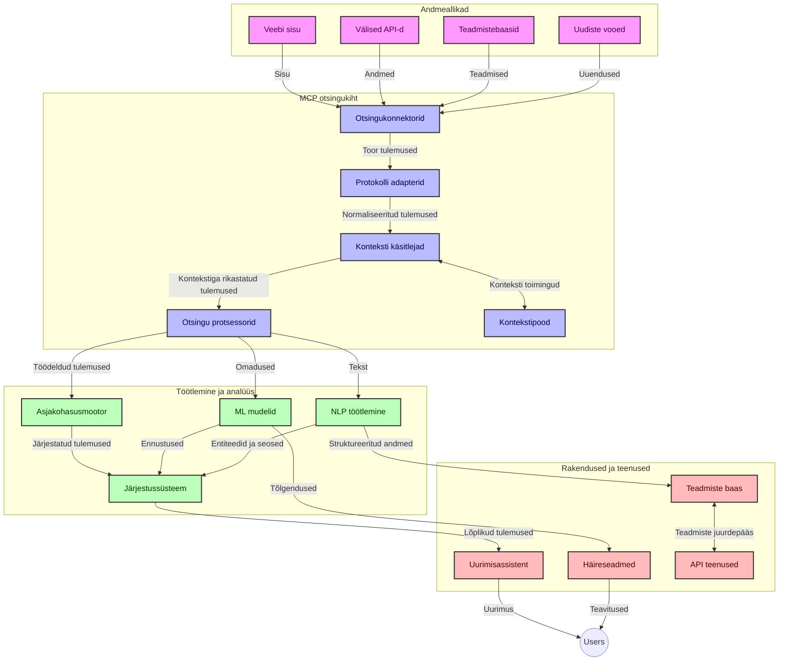
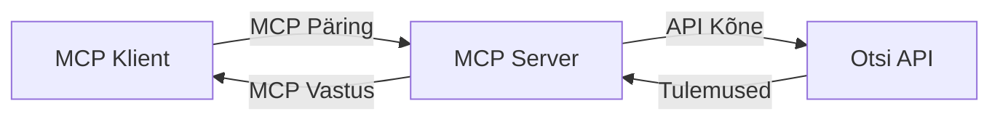
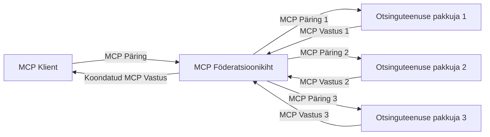
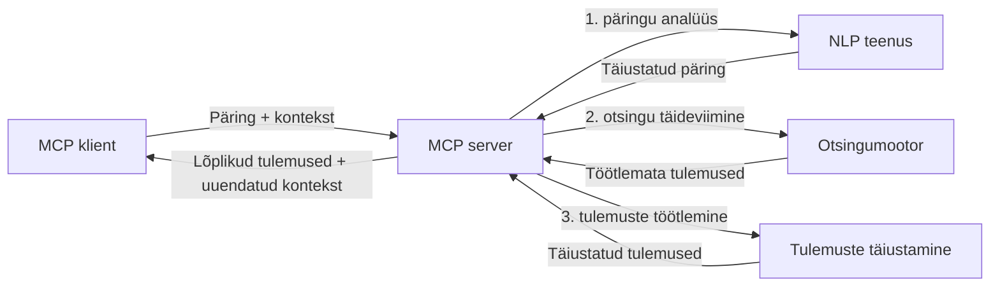

# Mudeli konteksti protokoll reaalajas veebipäringutes

## Ülevaade

Reaalajas veebipäringud on tänapäeva infoajastul muutunud hädavajalikuks, kus rakendused vajavad internetist värskeima teabe kohest juurdepääsu, et pakkuda asjakohaseid ja õigeaegseid vastuseid. Mudeli konteksti protokoll (MCP) tähistab olulist edasiminekuid nende reaalajas päringute protsesside optimeerimisel, parandades päringu tõhusust, säilitades konteksti terviklikkust ja suurendades kogu süsteemi jõudlust.

See moodul uurib, kuidas MCP muudab reaalajas veebipäringuid, pakkudes standardiseeritud lähenemist konteksti haldamiseks AI mudelite, päringu mootorite ja rakenduste vahel.

### Mida te õpite

Selle põhjaliku juhendi käigus avastate:

- Kuidas MCP loob sujuva silla AI mudelite ja reaalajas veebipäringu võimekuse vahel
- Arhitektuurimustrid tõhusate ja skaleeritavate päringulahenduste rakendamiseks MCP abil
- Tehnikaid päringukonteksti säilitamiseks mitmete päringute ja interaktsioonide vältel
- Praktilisi koodinäiteid Pythonis ja JavaScriptis erinevates päringustsenaariumides
- Meetodeid asjakohasuse, värskuse ja jõudluse tasakaalustamiseks MCP-põhistes päringusüsteemides

## Sissejuhatus reaalajas veebipäringutesse

Reaalajas veebipäring on tehnoloogiline lähenemine, mis võimaldab pidevalt veebipõhiseid andmeid pärida, töödelda ja analüüsida kohe pärast nende avaldamist või värskendamist, võimaldades süsteemidel pakkuda värsket ja asjakohast teavet minimaalse viivisega. Erinevalt traditsioonilistest otsingusüsteemidest, mis töötlevad vaid indekseeritud, tihti tundide või päevade vanust andmeid, töötleb reaalajas päring elusaid andmeid veebist ning pakub teavet, mis peegeldab veebisisu praegust seisundit.

### Reaalajas veebipäringu põhikontseptsioonid:

- **Pidev päringute töötlemine**: Päringuid töödeldakse pidevalt värskenevate andmeallikate vastu
- **Värskuse prioriteet**: Süsteemid on üles ehitatud värskeima info eelistamiseks
- **Asjakohasuse tasakaalustamine**: Säilitada tasakaal asjakohasuse ja värskuse vahel
- **Skaleeritav arhitektuur**: Süsteemid peavad toime tulema muutuva päringukoormuse ja andmemahtudega
- **Kontekstipõhine mõistmine**: Kasutaja konteksti hoidmine päringute vahel on oluline tähenduslike tulemuste jaoks
- **Dünaamiline päringu reformuleerimine**: Päringute kohandamine konteksti ja varasemate tulemustega
- **Mitme allika integreerimine**: Tulemite kombineerimine mitmest otsinguteenuse pakkujast ja veebiallikast
- **Semantiline mõistmine**: Päringute ja sisu töötlemine tähenduse, mitte ainult märksõnade põhjal
- **Reaalajas järjestamine**: Tulemuste järjestuse pidev kohandamine uue teabe saabumisel

### Mudeli konteksti protokoll ja reaalajas veebipäring

Mudeli konteksti protokoll (MCP) lahendab mitmeid olulisi väljakutseid reaalajas veebipäringu keskkondades:

1. **Päringu konteksti säilitamine**: MCP standardiseerib, kuidas konteksti hoitakse ja jagatakse jaotatud päringukomponentide vahel, tagades, et AI mudelitel ja töötlemissõlmedel oleks ligipääs asjakohasele päringu ajaloole ja kasutajapõhistele eelistustele.

2. **Tõhus päringu haldus**: Struktureeritud konteksti edastamise mehhanismide abil vähendab MCP konteksti kordamise koormust igas uues päringutsüklis.

3. **Võimalus koostalitlusvõimeks**: MCP loob ühise keele konteksti jagamiseks erinevate otsingutehnoloogiate ja AI mudelite vahel, võimaldades paindlikumaid ja laiendatavamaid arhitektuure.

4. **Päringuhaldus optimeeritud kontekstiga**: MCP rakendused saavad prioriseerida, millised konteksti elemendid on kõige olulisemad efektiivseks päringu toimimiseks, optimeerides nii jõudlust kui täpsust.

5. **Kohanduv päringutöötlus**: Olles MCP abil konteksti nõuetekohaselt haldades, saavad otsingusüsteemid dünaamiliselt töödelda vastavalt kasutaja vajaduste ja info maastiku muutumisele.

Tänapäeva rakendustes, ulatudes uudiste kogumisest uurimisabimeesteni, võimaldab MCP integreerimine veebipäringu tehnoloogiatega luua targemaid, kontekstiteadlikke otsinguid, mis pakuvad järjest asjakohasemaid tulemusi kasutaja interaktsiooni jätkudes.

## Õpieesmärgid

Selle õppetüki lõpuks oskate:

- Mõista reaalajas veebipäringu põhialuseid ja selle väljakutseid kaasaegsetes rakendustes
- Selgitada, kuidas Mudeli konteksti protokoll (MCP) täiustab reaalajas veebipäringu võimekust
- Rakendada MCP-põhiseid päringulahendusi populaarsete raamistike ja API-de abil
- Kujundada ja juurutada MCP-ga skaleeritavaid, suure jõudlusega otsingu arhitektuure
- Rakendada MCP kontseptsioone erinevates kasutusjuhtudes, sealhulgas semantiline otsing, uurimisabi ja AI-ga täiustatud sirvimine
- Hinnata MCP-põhise otsingutehnoloogia tekkivaid suundumusi ja tuleviku uuendusi
- Arendada konteksti-teadlikke otsingusüsteeme, mis õpivad kasutaja interaktsioonidest
- Integreerida veebipäringu võimekust AI assistentidega, kasutades standardiseeritud MCP protokolle
- Luua mitmetasandilisi otsingutorusid, mis samm-sammult konteksti põhjal tulemusi täiendavad
- Optimeerida päringu jõudlust, säilitades põhjaliku konteksti teadlikkuse

### Mõiste ja tähtsus

Reaalajas veebipäring tähendab veebipõhise info pidevat pärimist, toomist ja edastamist minimaalse viivitusega. Erinevalt traditsioonilistest otsingumootoritest, mis perioodiliselt veebisaite järjendavad ja indekseerivad, on reaalajas otsingu eesmärk kuvada infot kohe selle kättesaadavaks muutudes, võimaldades kohest juurdepääsu kõige uuemale sisule.

Reaalajas veebipäringu põhijooned hõlmavad:

- **Värskus**: Eelistatakse viimaseid uuendusi ja sisu
- **Pidev töötlemine**: Uue info pidev jälgimine
- **Päringu kohandamine**: Otsinguparameetrite täiustamine konteksti ja tagasiside põhjal
- **Kohene edastamine**: Päringu tulemuste pakkumine minimaalse viivitusega
- **Konteksti säilitamine**: Eelmiste päringute põhjal asjakohasuse parandamine

### Traditsioonilise veebipäringu väljakutsed

Traditsioonilise veebipäringu lähenemisviisid on piiratud reaalajas stsenaariumites mitmel moel:

1. **Konteksti killustumine**: Raskused konteksti säilitamisel mitmete päringute vahel
2. **Info värskus**: Värskeima teabe kättesaadavuse ja prioriteedi küsimused
3. **Integreerimise keerukus**: Probleemid süsteemide ja rakenduste vahelistes koostalitluses
4. **Viivituse probleemid**: Täieliku otsingu ja reageerimisaja nõuete tasakaalustamine
5. **Asjakohasuse häälestamine**: Täpsuse ja asjakohasuse tagamine, säilitades värskuse prioriteedi

## Mudeli konteksti protokolli (MCP) mõistmine päringutes

### Mis on MCP päringu kontekstis?

Mudeli konteksti protokoll (MCP) on standardiseeritud suhtlusprotokoll, mis on loodud tõhusaks suhtluseks AI mudelite ja rakenduste vahel. Reaalajas veebipäringu kontekstis pakub MCP raamistiku:

- Päringu konteksti säilitamiseks kogu päringute jada vältel
- Päringute ja tulemuste vormindamiseks ühtlustatud viisil
- Otsingu parameetrite ja tulemuste edastamise optimeerimiseks
- Mudeli ja otsingumootori vahelise kommunikatsiooni parandamiseks

### Põhikomponendid ja arhitektuur

MCP arhitektuur reaalaajas veebipäringuil koosneb mitmest põhikomponendist:

1. **Päringu konteksti haldurid**: Halda ja säilita otsingukontekst mitmete päringute ajal
2. **Päringutöötlejad**: Töötle saabunud päringuid kontekstiteadlike meetoditega
3. **Protokolli adapterid**: Muuda eri otsingu API vahel vastavalt säilitades konteksti
4. **Kontekstihoidla**: Tõhusalt salvesta ja taasta päringu ajalugu ning kasutaja eelistusi
5. **Päringukonktraktorid**: Ühenda mitmete otsingumootorite ja veebipõhiste API-dega



### Kuidas MCP parandab reaalajas veebipäringuid

MCP lahendab traditsioonilise veebipäringu väljakutseid järgmiselt:

- **Konteksti järjepidevus**: Säilitada päringutevahelised seosed kogu otsingusessiooni vältel
- **Optimeeritud edastus**: Vähendada päringupäringute kordusi nutika konteksti halduse abil
- **Standardiseeritud liidesed**: Pakkuda ühtseid API-sid päringukomponentidele
- **Vähendatud viivitus**: Minimeerida töötlemiskoormust tõhusa konteksti haldamise kaudu
- **Täiustatud asjakohasus**: Parandada otsingu asjakohasust, säilitades kasutaja kavatsused mitmete päringute jooksul

## Integratsioon ja rakendamine

Reaalajas veebipäringusüsteemid vajavad hoolikat arhitektuurset disaini ja rakendamist, et säilitada nii jõudlus kui ka konteksti terviklikkus. Mudeli konteksti protokoll pakub standardiseeritud lähenemist AI mudelite ja otsingutehnoloogiate integreerimiseks, võimaldades arenenumaid, kontekstiteadlikke otsingutorusid.

### Ülevaade MCP integreerimisest otsingu arhitektuuridesse

MCP rakendamine reaalajas veebipäringu keskkondades hõlmab mitmeid võtmeküsimusi:

1. **Päringu konteksti serialiseerimine**: MCP pakub tõhusaid meetodeid kontekstiteabe kodeerimiseks päringutes, tagades, et oluline kontekst järgneb päringule kogu töötlemistorus. See hõlmab standardiseeritud serialiseerimisvorminguid, mis on optimeeritud päringu metadata jaoks.

2. **Oleku teadlik päringutöötlus**: MCP võimaldab intelligentsemat olekulist töötlemist, säilitades järjepideva konteksti esinduse päringutsüklite vahel. See on eriti kasulik mitmeastmelistes päringutorus, kus konteksti täiustamine parandab tulemusi.

3. **Päringu laiendamine ja täiustamine**: MCP rakendused otsingusüsteemides võivad hõlbustada keerukaid päringu laiendusi ja täiustusi kogutud konteksti põhjal, võimaldades üha asjakohasemaid tulemusi otsingusessiooni edenedes.

4. **Tulemuste vahemällu salvestamine ja prioriteetimine**: Standardiseerides konteksti haldamist aitab MCP hallata tulemuste vahemällu salvestamist ja prioriteetimist, võimaldades komponentidel kohaneda muutuva otsingukontekstiga.

5. **Otsingu ühendamine ja koondamine**: MCP lihtsustab otsingute mitme tagapõhja vahel SPF-federatsiooni, pakkudes struktureeritud konteksti esitlusi, mis võimaldavad mõistlikumat tulemuste koondamist eri allikatest.

MCP rakendamine eri otsingutehnoloogiates loob ühtse lähenemise konteksti haldamiseks, vähendades kohandatud integreerimiskoodi vajadust ja parandades süsteemi võimet säilitada tähenduslikku konteksti päringute arenedes.

### MCP mitmetes veebipäringu rakendustes

Alljärgnevad näited järgivad praegust MCP spetsifikatsiooni, mis keskendub JSON-RPC baasil protokollile ja eristub transportmehhanismidega. Kood tutvustab, kuidas saate rakendada kohandatud otsingute integratsioone, säilitades samal ajal täisühilduvuse MCP protokolliga.


<details>
<summary>Python'i rakendus üldise otsing API-ga</summary>

```python
import asyncio
import json
import aiohttp
from typing import Dict, Any, Optional, List
from contextlib import asynccontextmanager
from collections.abc import AsyncIterator

# Impordi standardsed MCP teegid
from mcp.client.session import ClientSession
from mcp.client.streamable_http import streamablehttp_client
from mcp.types import TextContent, CreateMessageRequestParams, CreateMessageResult
from mcp.server.fastmcp import FastMCP

# Loo FastMCP server veebipäringu jaoks
search_server = FastMCP("WebSearch")

# Klass veebipäringute toimingute haldamiseks
class WebSearchHandler:
    def __init__(self, api_endpoint: str, api_key: str):
        self.api_endpoint = api_endpoint
        self.api_key = api_key
        self.session = None
        
    async def initialize(self):
        """Initialize the HTTP session"""
        self.session = aiohttp.ClientSession(
            headers={"Authorization": f"Bearer {self.api_key}"}
        )
    
    async def close(self):
        """Close the HTTP session"""
        if self.session:
            await self.session.close()
            
    async def perform_search(self, query: str, max_results: int = 5, 
                           include_domains: List[str] = None, 
                           exclude_domains: List[str] = None,
                           time_period: str = "any") -> Dict[str, Any]:
        """Perform web search using the search API"""
        # Koosta päringu parameetrid
        search_params = {
            "q": query,
            "limit": max_results,
            "time": time_period
        }
        
        if include_domains:
            search_params["site"] = ",".join(include_domains)
            
        if exclude_domains:
            search_params["exclude_site"] = ",".join(exclude_domains)
        
        # Täida päringu sooritus
        try:
            async with self.session.get(
                self.api_endpoint,
                params=search_params
            ) as response:
                if response.status != 200:
                    error_text = await response.text()
                    raise Exception(f"Search API error: {response.status} - {error_text}")
                
                search_data = await response.json()
                
                # Muuda API-spetsiifiline vastus standardseks vorminguks
                results = []
                for item in search_data.get("results", []):
                    results.append({
                        "title": item.get("title", ""),
                        "url": item.get("url", ""),
                        "snippet": item.get("snippet", ""),
                        "date": item.get("published_date", ""),
                        "source": item.get("source", "")
                    })
                
                return {
                    "query": query,
                    "totalResults": len(results),
                    "results": results
                }
        except Exception as e:
            print(f"Search API request error: {e}")
            raise

# Initsialiseeri päringu haldaja
search_handler = WebSearchHandler(
    api_endpoint="https://api.search-service.example/search",
    api_key="your-api-key-here"
)

# Sea elutsükkel päringu haldaja haldamiseks
@asyncio.asynccontextmanager
async def app_lifespan(server: FastMCP):
    """Manage application lifecycle"""
    await search_handler.initialize()
    try:
        yield {"search_handler": search_handler}
    finally:
        await search_handler.close()

# Sea serveri elutsükkel
search_server = FastMCP("WebSearch", lifespan=app_lifespan)

# Registreeri veebipäringu tööriist
@search_server.tool()
async def web_search(query: str, max_results: int = 5, 
                   include_domains: List[str] = None,
                   exclude_domains: List[str] = None,
                   time_period: str = "any") -> Dict[str, Any]:
    """
    Search the web for information
    
    Args:
        query: The search query
        max_results: Maximum number of results to return (default: 5)
        include_domains: List of domains to include in search results
        exclude_domains: List of domains to exclude from search results
        time_period: Time period for results ("day", "week", "month", "any")
        
    Returns:
        Dictionary containing search results
    """
    ctx = search_server.get_context()
    search_handler = ctx.request_context.lifespan_context["search_handler"]
    
    results = await search_handler.perform_search(
        query=query,
        max_results=max_results,
        include_domains=include_domains,
        exclude_domains=exclude_domains,
        time_period=time_period
    )
    
    return results

# Klientnäite kasutamine
async def client_example():
    # Ühenda päringuserveriga kasutades voogesitatavat HTTP transporti
    async with streamablehttp_client("http://localhost:8000/mcp") as (read, write, _):
        async with ClientSession(read, write) as session:
            # Algatage ühendus
            await session.initialize()
            
            # Kutsu veebipäringu tööriist
            search_results = await session.call_tool(
                "web_search", 
                {
                    "query": "latest developments in AI and Model Context Protocol",
                    "max_results": 5,
                    "time_period": "day",
                    "include_domains": ["github.com", "microsoft.com"]
                }
            )
            
            print(f"Search results: {search_results}")

# Serveri käivitamise näide
if __name__ == "__main__":
    # Käivita server voogesitatava HTTP transpordiga
    search_server.run(transport="streamable-http")
```
</details> 

<details>
<summary>JavaScripti rakendus brauseripõhise otsinguga</summary>


```javascript
// MCP serveri teostus veebipõhiseks otsinguks
import { McpServer, ResourceTemplate } from '@modelcontextprotocol/sdk/server/mcp.js';
import { StreamableHTTPServerTransport } from '@modelcontextprotocol/sdk/server/streamableHttp.js';
import { z } from 'zod';

// Loo MCP server veebipõhiseks otsinguks
const searchServer = new McpServer({
    name: "BrowserSearch",
    description: "A server that provides web search capabilities"
});

// Otsinguteenuse klass
class SearchService {
    constructor(searchApiUrl, apiKey) {
        this.searchApiUrl = searchApiUrl;
        this.apiKey = apiKey;
    }

    async performSearch(parameters) {
        const {
            query = '',
            maxResults = 5,
            includeDomains = [],
            excludeDomains = [],
            timePeriod = 'any'
        } = parameters;
        
        // Ehita otsingu URL koos parameetritega
        const url = new URL(this.searchApiUrl);
        url.searchParams.append('q', query);
        url.searchParams.append('limit', maxResults);
        url.searchParams.append('time', timePeriod);
        
        if (includeDomains.length > 0) {
            url.searchParams.append('site', includeDomains.join(','));
        }
        
        if (excludeDomains.length > 0) {
            url.searchParams.append('exclude_site', excludeDomains.join(','));
        }
        
        try {
            const response = await fetch(url.toString(), {
                method: 'GET',
                headers: {
                    'Authorization': `Bearer ${this.apiKey}`,
                    'Content-Type': 'application/json'
                }
            });
            
            if (!response.ok) {
                const errorText = await response.text();
                throw new Error(`Search API error: ${response.status} - ${errorText}`);
            }
            
            const searchData = await response.json();
            
            // Muuda API-spetsiifiline vastus standardkujule
            const results = searchData.results?.map(item => ({
                title: item.title || '',
                url: item.url || '',
                snippet: item.snippet || '',
                date: item.published_date || '',
                source: item.source || ''
            })) || [];
            
            return {
                query,
                totalResults: results.length,
                results
            };
        } catch (error) {
            console.error('Search API request error:', error);
            throw error;
        }
    }
}

// Algata otsinguteenuse initsialiseerimine
const searchService = new SearchService(
    'https://api.search-service.example/search',
    'your-api-key-here'
);

// Sea üles kontekstipakkuja serveri jaoks
searchServer.setContextProvider(() => {
    return {
        searchService
    };
});

// Registreeri veebipõhine otsingutööriist
searchServer.tool({
    name: 'web_search',
    description: 'Search the web for information',
    parameters: {
        type: 'object',
        properties: {
            query: {
                type: 'string',
                description: 'The search query'
            },
            maxResults: {
                type: 'integer',
                description: 'Maximum number of results to return',
                default: 5
            },
            includeDomains: {
                type: 'array',
                items: { type: 'string' },
                description: 'List of domains to include in search results'
            },
            excludeDomains: {
                type: 'array',
                items: { type: 'string' },
                description: 'List of domains to exclude from search results'
            },
            timePeriod: {
                type: 'string',
                description: 'Time period for results',
                enum: ['day', 'week', 'month', 'any'],
                default: 'any'
            }
        },
        required: ['query']
    },
    handler: async (params, context) => {
        const { searchService } = context;
        return await searchService.performSearch(params);
    }
});

// Näidiskliendi kood ühendamiseks otsinguserveriga
import { Client } from '@modelcontextprotocol/sdk/client/index.js';
import { StreamableHTTPClientTransport } from '@modelcontextprotocol/sdk/client/streamableHttp.js';

async function connectToSearchServer() {
    // Ühendu otsinguserveriga
    const transport = new StreamableHTTPClientTransport(
        new URL('http://localhost:8000/mcp')
    );
    
    const client = new Client({
        name: 'search-client',
        version: '1.0.0'
    });
    
    await client.connect(transport);
    
    // Käivita otsingutööriist
    const searchResults = await client.callTool({
        name: 'web_search',
        arguments: {
            query: 'Model Context Protocol implementation examples',
            maxResults: 10,
            timePeriod: 'week',
            includeDomains: ['github.com', 'docs.microsoft.com']
        }
    });
    
    console.log('Search results:', searchResults);
    
    // Puhasta ressursid
    await client.disconnect();
}

// Käivita server
const transport = new StreamableHTTPServerTransport();
await searchServer.connect(transport);
console.log('Search server running at http://localhost:8000/mcp');

// Eraldi protsessis või pärast serveri käivitamist
// connectToSearchServer().catch(console.error);
```
</details> 


## Koodi näidiste vastutusest loobumine

> **Oluline märkus**: Alljärgnevad näited demonstreerivad Mudeli konteksti protokolli (MCP) integreerimist veebipäringu funktsionaalsusega. Kuigi need järgivad ametlike MCP SDK-de mustreid ja struktuure, on need lihtsustatud hariduslikel eesmärkidel.
> 
> Need näited tutvustavad:
> 
> 1. **Python'i rakendus**: FastMCP serveri rakendus, mis pakub veebipäringu tööriista ja ühendub välise otsingu API-ga. Näide demonstreerib õiget eluea haldust, konteksti käsitlemist ja tööriista rakendamist vastavalt ametliku MCP Python SDK mustritele. Server kasutab soovitatud Streamable HTTP transporti, mis on vanema SSE transpordi tootmiskeskkondades asendanud.
> 
> 2. **JavaScripti rakendus**: TypeScript/JavaScripti rakendus, kasutades FastMCP mustrit ametlikust MCP TypeScript SDK-st, et luua otsinguserver koos asjakohaste tööriista definitsioonide ja kliendiühendustega. Järgib uusimaid soovitatud mustreid sessioonihalduses ja konteksti säilitamises.
> 
> Need näited vajaksid tootmiskasutuseks täiendavat veahaldust, autentimist ja konkreetset API integreerimiskoodi. Näidatud otsingu API otsapunktid (`https://api.search-service.example/search`) on kohatäited ja vajaksid asendamist tegelike otsinguteenuste aadressidega.
> 
> Täieliku rakenduse detailide ning kõige uuemate lähenemiste jaoks,
> vaadake [ametlikku MCP spetsifikatsiooni](https://modelcontextprotocol.io/specification/2026-07-28/)
> ja SDK dokumentatsiooni.

## Põhikontseptsioonid

### Mudeli konteksti protokolli (MCP) raamistik

Mudeli konteksti protokoll pakub standardiseeritud viisi AI mudelite, rakenduste ja teenuste vaheliseks konteksti vahetamiseks. Reaalajas veebipäringutes on see raamistik hädavajalik koherentsete, mitme vooruga otsingukogemuste loomiseks. Põhikomponentideks on:

1. **Klient-serveri arhitektuur**: MCP loob selge eristuse päringu klientide (taotlejate) ja serverite (pakkujate) vahel, võimaldades paindlikke juurutusmudeleid.

2. **JSON-RPC kommunikatsioon**: Protokoll kasutab sõnumite vahetamiseks JSON-RPC-d, muutes selle ühilduvaks veebitehnoloogiatega ja lihtsasti rakendatavaks erineva platvormide vahel.

3. **Konteksti haldamine**: MCP määratleb struktureeritud meetodid otsingukonteksti säilitamiseks, uuendamiseks ja kasutamiseks mitmete interaktsioonide vältel.

4. **Tööriistade definitsioonid**: Otsingu võimekus esitatakse standardiseeritud tööriistadena koos selgete parameetrite ja tulemuste väärtustega.

5. **Voostamise tugi**: Protokoll toetab tulemuste voogedastust, mis on oluline reaalajas otsingus, kus tulemused võivad saabuda järk-järgult.

### Veebipäringu integreerimismustrid

MCP veebipäringuga integreerimisel on mitmeid mustreid:

#### 1. Otseotsingu pakkuja integratsioon



Sellises mustris suheldakse MCP serveri kaudu otse ühe või mitme otsingu API-ga, tõlkides MCP päringud API-spetsiifilisteks kõnedeks ja vormindades tulemused MCP vastusteks.

#### 2. Konteksti säilitamisega federatiivne otsing



See muster jaotab otsingu päringud mitme MCP ühilduva otsingupakkuja vahel, millest igaüks võib olla spetsialiseerunud erinevatele sisutüüpidele või otsingu võimekustele, samal ajal säilitades ühtse konteksti.

#### 3. Kontekstiga täiustatud otsinguahel



Sellises mustris on otsinguprotsess jagatud mitmeks etapiks, kus iga samm täiendab konteksti, tulemuseks üha asjakohasemad otsingutulemused.

### Päringu konteksti komponendid

MCP-põhises veebipäringus hõlmab kontekst tavaliselt:

- **Päringu ajalugu**: Eelmised otsingupäringud sessiooni vältel
- **Kasutaja eelistused**: Keel, regioon, turvalise otsingu seaded
- **Interaktsiooni ajalugu**: Milliseid tulemusi klikiti, aeg, mis kulus tulemuste vaatamiseks
- **Otsingu parameetrid**: Filtrid, sorteerimisjärjestused ja muud päringu muutjad
- **Domeeniteadmised**: Otsinguga seotud valdkonnapõhine kontekst
- **Ajaline kontekst**: Ajal põhinevad asjakohasuse tegurid
- **Allikate eelistused**: Usaldusväärsed või eelistatud infoallikad

## Kasutusjuhtumid ja rakendused

### Uurimine ja info kogumine

MCP parandab uurimistöövooge, pakkudes:

- Uurimiskonteksti säilitamist kogu otsingusessiooni vältel
- Võimalust teha keerukamaid ja kontekstuaalselt asjakohasemaid päringuid
- Toetab mitme allika otsingufederatsiooni
- Lihtsustab teadmiste äravõtmist otsingutulemustest

### Reaalajas uudiste ja trendide jälgimine

MCP-põhine otsing pakub uudiste jälgimisel eeliseid:

- Peaaegu reaalajas uute uudislugude avastamine
- Asjakohase info kontekstuaalne filtreerimine
- Teemade ja üksuste jälgimine mitmest allikast
- Kasutaja konteksti põhised isikupärastatud uudiste teated

### AI-ga täiustatud sirvimine ja uurimine

MCP loob uusi võimalusi AI-ga täiustatud sirvimiseks:

- Sirvimistoimingu põhised kontekstuaalsed otsingusoovitused
- Sujuv veebipäringu integreerimine LLM-põhiste assistentidega
- Mitme vooru päringute täiustamine konteksti säilitades
- Täiustatud faktikontroll ja info kinnitamine

## Tuleviku suundumused ja uuendused

### MCP areng veebipäringus

Tuleviku perspektiivis ootame MCP areneb, et lahendada:


- **Mitmemodaalne otsing**: teksti, pildi, heli ja video otsingu integreerimine säilitatud kontekstiga
- **Detsentraliseeritud otsing**: toetades hajutatud ja föderatiivseid otsingusüsteeme
- **Otsingu privaatsus**: kontekstitundlikud privaatsust säilitavad otsingumehhanismid
- **Päringu mõistmine**: loomuliku keele otsingupäringute sügav semantiline järeltöötlus

### Võimalikud tehnoloogilised arengud

Tõusvad tehnoloogiad, mis kujundavad MCP otsingu tulevikku:

1. **Neuraalsed otsingu arhitektuurid**: MCP jaoks optimeeritud põimitud otsingusüsteemid
2. **Isikupärastatud otsingukontekst**: üksikute kasutajate otsingumustrite õppimine aja jooksul
3. **Teadmusgraafiku integratsioon**: domeenispetsiifiliste teadmusgraafikute toel täiustatud kontekstuaalne otsing
4. **Ristmoodaalne kontekst**: konteksti säilitamine erinevate otsingumodaalsuste vahel

## Praktilised harjutused

### Harjutus 1: Põhjaliku MCP otsingutorustiku seadistamine

Selles harjutuses õpid:
- Põhjaliku MCP otsingukeskkonna konfigureerimist
- Veebipõhise otsingu konteksti töötlejate rakendamist
- Otsingutsüklite jooksul konteksti säilitamise testimist ja valideerimist

### Harjutus 2: Uurimisabilise loomine MCP otsinguga

Loo terve rakendus, mis:
- Töötleb loomuliku keele uurimisküsimusi
- Teostab kontekstitundlikke veebipõhiseid otsinguid
- Süntesiseerib teavet mitmest allikast
- Esitab organiseeritud uurimistulemused

### Harjutus 3: Mitme allikaga otsinguföderatsiooni rakendamine MCP-ga

Täiustatud harjutus hõlmab:
- Kontekstitundlikku päringute suunamist mitmele otsingumootorile
- Tulemite järjestamist ja agregatsiooni
- Otsingutulemuste kontekstuaalset duplikaatide eemaldamist
- Allikapõhise metainfo töötlemist

## Lisamaterjalid

- [Model Context Protocol Spetsifikatsioon](https://modelcontextprotocol.io/specification/2026-07-28/) - MCP ametlik spetsifikatsioon ja detailne protokolli dokumentatsioon
- [Model Context Protocol Dokumentatsioon](https://modelcontextprotocol.io/) - Üksikasjalikud juhendid ja rakendamisjuhised
- [MCP Python SDK](https://github.com/modelcontextprotocol/python-sdk) - MCP protokolli ametlik Python'i teostus
- [MCP TypeScript SDK](https://github.com/modelcontextprotocol/typescript-sdk) - MCP protokolli ametlik TypeScripti teostus
- [MCP Refereerivad serverid](https://github.com/modelcontextprotocol/servers) - MCP serverite refereerivad rakendused
- [Bing Web Search API Dokumentatsioon](https://learn.microsoft.com/en-us/bing/search-apis/bing-web-search/overview) - Microsofti veebipõhine otsingu API
- [Google Custom Search JSON API](https://developers.google.com/custom-search/v1/overview) - Google'i programmeeritav otsingumootor
- [SerpAPI Dokumentatsioon](https://serpapi.com/search-api) - Otsingumootori tulemuste lehe API
- [Meilisearch Dokumentatsioon](https://www.meilisearch.com/docs) - Avatud lähtekoodiga otsingumootor
- [Elasticsearch Dokumentatsioon](https://www.elastic.co/guide/index.html) - Hajutatud otsingu ja analüütika mootor
- [LangChain Dokumentatsioon](https://python.langchain.com/docs/get_started/introduction) - Rakenduste loomine LLMidega

## Õpitulemused

Selle mooduli lõpetamisel suudad:

- Mõista reaalajas veebipõhise otsingu põhialuseid ja selle väljakutseid
- Selgitada, kuidas Model Context Protocol (MCP) parandab reaalajas veebipõhise otsingu suutlikkust
- Rakendada MCP-põhiseid otsingulahendusi populaarsete raamistikude ja API-de abil
- Kavandada ja juurutada skaleeritavaid, kõrge jõudlusega otsingu arhitektuure MCP-ga
- Rakendada MCP kontseptsioone erinevates kasutusjuhtumites, sealhulgas semantiline otsing, uurimisabiline ja tehisintellektiga täiustatud sirvimine
- Hinnata MCP-põhiste otsingutehnoloogiate tekkivaid trende ja tuleviku uuendusi


### Usaldus ja turvalisuse kaalutlused

MCP-põhiste veebipõhiste otsingulahenduste rakendamisel pea meeles MCP spetsifikatsioonist tulenevaid olulisi põhimõtteid:

1. **Kasutaja nõusolek ja kontroll**: Kasutajad peavad andma otsese nõusoleku ja mõistma kõiki andmete juurdepääse ja toiminguid. See on eriti oluline veebipõhiste otsingulahenduste puhul, mis võivad ligi pääseda välistele andmeallikatele.

2. **Andmete privaatsus**: Tagada otsingupäringute ja tulemuste asjakohane käsitlemine, eriti kui need võivad sisaldada tundlikku teavet. Rakenda nõuetekohaseid juurdepääsukontrolle kasutajaandmete kaitsmiseks.

3. **Tööriistade turvalisus**: Rakenda adekvaatset autoriseerimist ja valideerimist otsingutööriistadele, kuna need võivad esindada turvariske meelevaldse koodi täitmise kaudu. Tööriistade käitumise kirjeldused tuleks lugeda usaldamatuteks, välja arvatud juhul kui need pärinevad usaldusväärsest serverist.

4. **Selge dokumentatsioon**: Paku selget dokumentatsiooni oma MCP-põhise otsingurakenduse võimekuste, piirangute ja turvakaalutluste kohta, järgides MCP spetsifikatsiooni rakendusjuhiseid.

5. **Tugevad nõusoleku protsessid**: Ehita tugevad nõusoleku ja autoriseerimise protsessid, mis selgelt selgitavad iga tööriista toimimist enne selle kasutamise lubamist, eriti tööriistade puhul, mis suhtlevad välistingimustega veebiallikatega.

Täielikud MCP turvalisuse ja usalduskaalutluste detailid leiad
[ametlikust dokumentatsioonist](https://modelcontextprotocol.io/specification/2026-07-28/basic/security_best_practices).

## Mis järgmiseks

- [5.12 Entra ID autentimine Model Context Protocol serverite jaoks](../mcp-security-entra/README.md)

---

<!-- CO-OP TRANSLATOR DISCLAIMER START -->
**Lahtiütlus**:
See dokument on tõlgitud kasutades AI tõlketeenust [Co-op Translator](https://github.com/Azure/co-op-translator). Kuigi me püüdleme täpsuse poole, palun pange tähele, et automatiseeritud tõlgetes võib esineda vigu või ebatäpsusi. Originaaldokument selle emakeeles tuleks pidada autoriteetseks allikaks. Olulise teabe puhul soovitatakse kasutada professionaalset inimtõlget. Me ei vastuta selle tõlkega seotud eksimustest või valesti mõistmistest.
<!-- CO-OP TRANSLATOR DISCLAIMER END -->