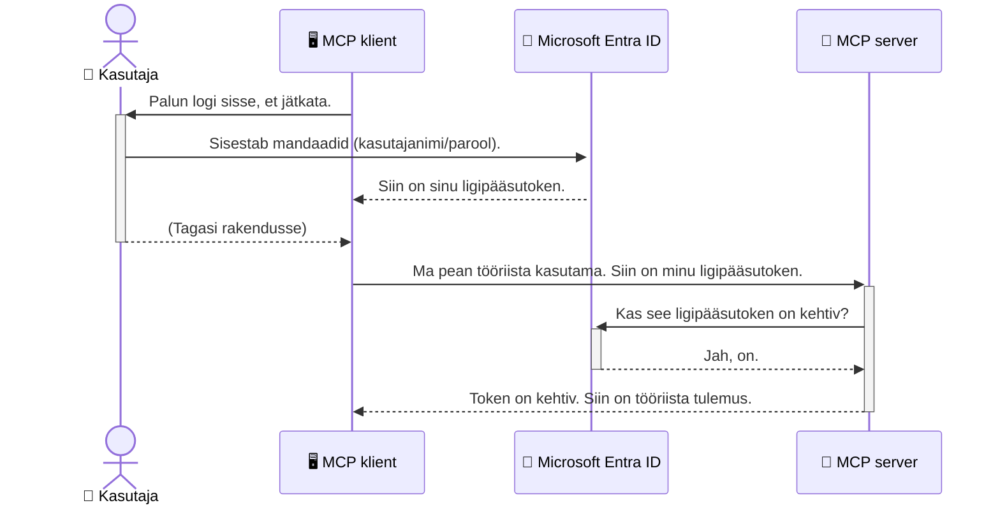

# AI-töövoogude turvamine: Entra ID autentimine mudeli konteksti protokolli serveritele

> [!NOTE]
> Selle õppetüki kaugserveri kood kaitseb pärand `/sse` ja `/message`
> lõpp-punkte ning sihib MCP `2025-11-25`. Säilita selle identiteedi- ja tokeni valideerimise
> meetodid, kuid uute rakenduste puhul kasuta `2026-07-28`-ühilduvat Streamable HTTP transporti.


## Sissejuhatus
Mudeli konteksti protokolli (MCP) serveri turvamine on sama oluline kui oma maja esiukse lukustamine. Kui jätta oma MCP server avatud, on su tööriistad ja andmed volitamata juurdepääsuks avatud, mis võib viia turvarikkumisteni. Microsoft Entra ID pakub tugevat pilvepõhist identiteedi ja juurdepääsu haldamise lahendust, aidates tagada, et ainult volitatud kasutajad ja rakendused suudavad MCP serveriga suhelda. Selles peatükis õpid, kuidas kaitsta oma AI töövooge Entra ID autentimise abil.

## Õpieesmärgid
Selle peatüki lõpus saad:

- Mõista MCP serverite turvamise tähtsust.
- Selgitada Microsoft Entra ID ja OAuth 2.0 autentimise põhialuseid.
- Teadvustada avaliku ja konfidentsiaalse kliendi erinevust.
- Rakendada Entra ID autentimist nii lokaalsel (avalik klient) kui ka kaugserveri (konfidentsiaalne klient) MCP serveri stsenaariumis.
- Kasutada turvalisuse parimaid tavasid AI töövoogude arendamisel.

## Turvalisus ja MCP

Nii nagu sa ei jätaks oma maja esiuks lukustamata, ei tohiks sa jätta oma MCP serverit inimestele vaba ligipääsuga. AI töövoogude turvamine on hädavajalik usaldusväärsete, turvaliste ja tugeva rakenduste ehitamiseks. See peatükk tutvustab sulle, kuidas kasutada Microsoft Entra ID-d MCP serverite turvamiseks, tagades, et ainult volitatud kasutajad ja rakendused saavad sinu tööriistade ja andmetega suhelda.

## Miks MCP serverite turvalisus on oluline

Kujuta ette, et su MCP serveril on tööriist, mis saab saata e-kirju või pääseda ligi kliendi andmebaasile. Turvamata server tähendaks, et igaüks võiks seda tööriista kasutada, mis viib volitamata andmete juurde pääsemise, rämpsposti või muude pahatahtlike tegevusteni.

Autentimise rakendamisel tagad, et iga serverile esitatud päring on kontrollitud, kinnitades päringu tegija kasutaja või rakenduse identiteedi. See on esimene ja kõige olulisem samm AI töövoogude turvamisel.

## Tutvustus Microsoft Entra ID-le

[**Microsoft Entra ID**](https://adoption.microsoft.com/microsoft-security/entra/) on pilvepõhine identiteedi ja juurdepääsu haldamise teenus. Mõtle sellele kui universaalsele turvamehhanismile oma rakenduste jaoks. See haldab keerulist protsessi, kus kontrollitakse kasutajate identiteete (autentimine) ja määratakse, mida neile lubatakse teha (autoriseerimine).

Entra ID kasutamisel saad:

- Lubada kasutajate turvalist sisselogimist.
- Kaitsta API-sid ja teenuseid.
- Hallata juurdepääsupoliitikaid tsentraalselt.

MCP serverite puhul pakub Entra ID tugevat ja laialdaselt usaldatavat lahendust, kes saab sinu serveri võimeid kasutada.

---

## Selle maagia mõistmine: kuidas Entra ID autentimine töötab

Entra ID kasutab autentimiseks avatud standardeid nagu **OAuth 2.0**. Kuigi detailid võivad olla keerukad, on põhimõte lihtne ja seda saab mõista võrdluse kaudu.

### Õrn sissejuhatus OAuth 2.0: Valeti võti

Mõtle OAuth 2.0-le nagu valetiteenusele auto juures. Kui jõuad restorani, ei anna sa valetile oma peamist võtit. Selle asemel annad talle **valeti võtme**, millel on piiratud õigused — see võib autot käivitada ja uksi lukustada, aga ei saa avada pagasnikku ega kindalaegast.

Selles võrdluses:

- **Sina** oled **kasutaja**.
- **Sinu auto** on **MCP server** oma väärtuslike tööriistade ja andmetega.
- **Valet** on **Microsoft Entra ID**.
- **Parkla teenindaja** on **MCP klient** (rakendus, mis proovib serverile ligi pääseda).
- **Valetivõti** on **juurdepääsu token**.

Juurdepääsu token on turvaline tekstijada, mille MCP klient saab Entra ID-lt pärast sinu sisselogimist. Klient esitab selle tokeni iga päringu juures MCP serverile. Server saab tokeni valideerida, veendumaks, et päring on õiguspärane ja et kliendil on vajalikud õigused — kõik see ilma sinu tegelikke mandaate (nt parooli) käsitlemata.

### Autentimise voog

Protsess töötab praktikas järgmiselt:



### Microsoft Authentication Library (MSAL) tutvustus

Enne koodi vaatamist on oluline tutvustada võtmekomponenti, mida näed näidetes: **Microsoft Authentication Library (MSAL)**.

MSAL on Microsofti arendatud raamatukogu, mis teeb autentimise haldamise arendajatele palju lihtsamaks. Selle asemel, et sa peaksid kirjutama kogu keeruka koodi, mis haldab turvatoekeneid, sisselogimisi ja sessioonide uuendamist, teeb MSAL selle töö sinu eest ära.

MSAL kasutamise soovitused põhinevad järgmisel:

- **See on turvaline:** Rakendab tööstusharu standardprotokolle ja parimaid turbetavasid, vähendades koodi haavatavusi.
- **Lihtsustab arendust:** Abstraktiseerib OAuth 2.0 ja OpenID Connect protokollide keerukuse, võimaldades lisada autentimist mõne koodireaga.
- **See on hooldatud:** Microsoft uuendab MSAL-i aktiivselt, vastates uutele turvaohtudele ja platvormimuudatustele.

MSAL toetab mitmeid programmeerimiskeeli ja raamistikuid nagu .NET, JavaScript/TypeScript, Python, Java, Go ja mobiiliplatvormid (iOS ja Android). See võimaldab sul kasutada ühtseid autentimismustreid kogu tehnoloogiast kui virnas.

Rohkem infot MSAL-i kohta leiad ametlikust [MSAL ülevaate dokumentatsioonist](https://learn.microsoft.com/entra/identity-platform/msal-overview).

---

## MCP serveri turvamine Entra ID-ga: samm-sammuline juhend

Käime nüüd üle, kuidas turvata lokaalne MCP server (`stdio` suhtlusega) Entra ID abil. Näites kasutatakse **avatud klienti**, mis sobib rakendustele, mis töötavad kasutaja masinas, nt töölauarakendus või kohalik arenduse server.

### Stsenaarium 1: Lokaalse MCP serveri turvamine (avatud klient)

Selle stsenaariumi puhul vaatame MCP serverit, mis töötab kohapeal, suhtleb üle `stdio` ja kasutab Entra ID-d kasutaja autentimiseks enne tööriistade kasutamist. Serveril on üks tööriist, mis hangib Microsoft Graph API kaudu kasutaja profiiliandmed.

#### 1. Rakenduse registreerimine Entra ID-s

Enne koodi kirjutamist pead registreerima oma rakenduse Microsoft Entra ID-s. See annab Entra ID-le informatsiooni sinu rakendusest ja lubab autentimisteenuse kasutamise.

1. Mine **[Microsoft Entra portaali](https://entra.microsoft.com/)**.
2. Vali **App registrations** ja kliki **New registration**.
3. Anna oma rakendusele nimi (nt "My Local MCP Server").
4. **Supported account types** juures vali **Accounts in this organizational directory only**.
5. Selle näite puhul võid **Redirect URI** tühjaks jätta.
6. Kliki **Register**.

Pärast registreerimist märgi üles **Application (client) ID** ja **Directory (tenant) ID**, mida vajad koodis.

#### 2. Kood: ülevaade

Vaatame koodi peamisi osi, mis tegelevad autentimisega. Selle näite täieliku koodi leiad [Entra ID - Local - WAM](https://github.com/Azure-Samples/mcp-auth-servers/tree/main/src/entra-id-local-wam) kaustast [mcp-auth-servers GitHubi hoidlas](https://github.com/Azure-Samples/mcp-auth-servers).

**`AuthenticationService.cs`**

Klass tegeleb Entra ID-ga suhtlemisega.

- **`CreateAsync`**: Meetod initsialiseerib MSAL-i `PublicClientApplication` objekti, kasutades rakenduse `clientId` ja `tenantId`.
- **`WithBroker`**: Võimaldab kasutada vahendajat (nt Windows Web Account Manager), pakkudes turvalisemat ja sujuvamat ühtse sisselogimise kogemust.
- **`AcquireTokenAsync`**: Põhimeetod. Esiteks proovib hankida tokeni vaikselt (kasutajalt sisselogimist nõudmata, kui kehtiv sessioon on olemas). Kui vaikne tokeni hankimine ebaõnnestub, kutsub see kasutaja interaktiivselt sisse logima.

```csharp
// Simplified for clarity
public static async Task<AuthenticationService> CreateAsync(ILogger<AuthenticationService> logger)
{
    var msalClient = PublicClientApplicationBuilder
        .Create(_clientId) // Your Application (client) ID
        .WithAuthority(AadAuthorityAudience.AzureAdMyOrg)
        .WithTenantId(_tenantId) // Your Directory (tenant) ID
        .WithBroker(new BrokerOptions(BrokerOptions.OperatingSystems.Windows))
        .Build();

    // ... cache registration ...

    return new AuthenticationService(logger, msalClient);
}

public async Task<string> AcquireTokenAsync()
{
    try
    {
        // Try silent authentication first
        var accounts = await _msalClient.GetAccountsAsync();
        var account = accounts.FirstOrDefault();

        AuthenticationResult? result = null;

        if (account != null)
        {
            result = await _msalClient.AcquireTokenSilent(_scopes, account).ExecuteAsync();
        }
        else
        {
            // If no account, or silent fails, go interactive
            result = await _msalClient.AcquireTokenInteractive(_scopes).ExecuteAsync();
        }

        return result.AccessToken;
    }
    catch (Exception ex)
    {
        _logger.LogError(ex, "An error occurred while acquiring the token.");
        throw; // Optionally rethrow the exception for higher-level handling
    }
}
```

**`Program.cs`**

Siin määratletakse MCP server ja liidetakse autentimisteenus.

- **`AddSingleton<AuthenticationService>`**: Registreerib `AuthenticationService` sõltuvuste konteineris, nii et teised komponendid (nt tööriist) saavad seda kasutada.
- **`GetUserDetailsFromGraph` tööriist**: See tööriist vajab `AuthenticationService` eksemplari. Enne tööriista kasutamist kutsub see `authService.AcquireTokenAsync()`, et saada kehtiv juurdepääsu token. Kui autentimine õnnestub, kasutab tokenit Microsoft Graph API kutsumiseks ja kasutaja andmete hankimiseks.

```csharp
// Simplified for clarity
[McpServerTool(Name = "GetUserDetailsFromGraph")]
public static async Task<string> GetUserDetailsFromGraph(
    AuthenticationService authService)
{
    try
    {
        // This will trigger the authentication flow
        var accessToken = await authService.AcquireTokenAsync();

        // Use the token to create a GraphServiceClient
        var graphClient = new GraphServiceClient(
            new BaseBearerTokenAuthenticationProvider(new TokenProvider(authService)));

        var user = await graphClient.Me.GetAsync();

        return System.Text.Json.JsonSerializer.Serialize(user);
    }
    catch (Exception ex)
    {
        return $"Error: {ex.Message}";
    }
}
```

#### 3. Kuidas see kõik koos töötab

1. Kui MCP klient kutsub `GetUserDetailsFromGraph` tööriista, helistab tööriist esmalt `AcquireTokenAsync`-le.
2. `AcquireTokenAsync` käivitab MSAL-i tokeni kehtivuse kontrollimise.
3. Kui tokeni ei leita, palub MSAL vahendaja abil kasutajal logida sisse oma Entra ID kontoga.
4. Pärast kasutaja sisselogimist väljastab Entra ID juurdepääsu tokeni.
5. Tööriist saab selle tokeni ja kasutab seda turvaliseks kõneks Microsoft Graph API-le.
6. Kasutaja andmed tagastatakse MCP kliendile.

See protsess tagab, et tööriista saavad kasutada ainult autentitud kasutajad, turvates efektiivselt sinu lokaalset MCP serverit.

### Stsenaarium 2: Kaug-MCP serveri turvamine (konfidentsiaalne klient)

Kui su MCP server töötab kaugmasinal (nt pilveserver) ja suhtleb HTTP streaming protokolli kaudu, siis on turvanõuded erinevad. Sel juhul peaksid kasutama **konfidentsiaalset klienti** ja **Authorization Code Flow** meetodit. See on turvalisem, kuna rakenduse saladused ei avaldu brauserile.

Näiteks kasutatakse TypeScript-il põhinevat MCP serverit, mis haldab HTTP päringuid Express.js abil.

#### 1. Rakenduse seadistamine Entra ID-s

Seadistus Entra ID-s on sarnane avaliku kliendi omaga, kuid ühe olulise erinevusega — pead looma **kliendi saladuse**.

1. Mine **[Microsoft Entra portaali](https://entra.microsoft.com/)**.
2. Oma rakenduse registreeringus mine vahekaardile **Certificates & secrets**.
3. Kliki **New client secret**, anna sellele kirjeldus ja vajuta **Add**.
4. **Tähtis:** Kopeeri saladuse väärtus kohe üles. Seda ei nähta enam hiljem.
5. Konfigureeri **Redirect URI**. Mine **Authentication** vahekaardile, kliki **Add a platform**, vali **Web** ja sisesta oma rakenduse suunav URI (nt `http://localhost:3001/auth/callback`).

> **⚠️ Turvalisuse oluline märkus:** Tootearenduses soovitab Microsoft tugevalt kasutada **saladustevaba autentimist** meetodeid, nagu **hallatud identiteet** või **töökoormuste identiteedi föderatsioon**, mitte kliendi saladusi. Kliendi saladused on turvaoht, kuna neid võib lekkida või rünnata. Hallatud identiteedid pakuvad turvalisemat lähenemist, elimineerides vajaduse hoida mandaate koodis või seadistuses.
>
> Rohkem infot hallatud identiteetide ja nende rakendamise kohta leiad lehelt [Managed identities for Azure resources overview](https://learn.microsoft.com/entra/identity/managed-identities-azure-resources/overview).

#### 2. Kood: ülevaade

Selles näites kasutatakse sessioonipõhist lähenemist. Pärast kasutaja autentimist salvestab server juurdepääsu ja värskendamise tokeni sessiooni ning annab kasutajale sessiooni tokeni. Seda sessioonitokenit kasutatakse edasistes päringutes. Näite täieliku koodi leiad [Entra ID - Confidential client](https://github.com/Azure-Samples/mcp-auth-servers/tree/main/src/entra-id-cca-session) kaustast [mcp-auth-servers GitHubi hoidlas](https://github.com/Azure-Samples/mcp-auth-servers).

**`Server.ts`**

Fail seadistab Express serveri ja MCP transpordikihi.

- **`requireBearerAuth`**: Vahevara, mis kaitseb `/sse` ja `/message` lõpp-punkte. Kontrollib `Authorization` päises kehtiva kandja-tokeni olemasolu.
- **`EntraIdServerAuthProvider`**: Kohandatud klass, mis rakendab `McpServerAuthorizationProvider` liidest. Vastutab OAuth 2.0 voo haldamise eest.
- **`/auth/callback`**: Lõpp-punkt, mis käsitleb Entra ID-st tulevat suunamist pärast kasutaja autentimist. Vahetab autoriseerimiskoodi juurdepääsu- ja värskendustokeni vastu.

```typescript
// Selguse huvides lihtsustatud
const app = express();
const { server } = createServer();
const provider = new EntraIdServerAuthProvider();

// Kaitse SSE lõpp-punkti
app.get("/sse", requireBearerAuth({
  provider,
  requiredScopes: ["User.Read"]
}), async (req, res) => {
  // ... ühenda transpordiga ...
});

// Kaitse sõnumite lõpp-punkti
app.post("/message", requireBearerAuth({
  provider,
  requiredScopes: ["User.Read"]
}), async (req, res) => {
  // ... käitle sõnumit ...
});

// Käitle OAuth 2.0 tagasihelistust
app.get("/auth/callback", (req, res) => {
  provider.handleCallback(req.query.code, req.query.state)
    .then(result => {
      // ... käitle edu või ebaõnnestumist ...
    });
});
```

**`Tools.ts`**

Fail määratleb tööriistad, mida MCP server pakub. `getUserDetails` tööriist sarnaneb eelneva näitega, kuid kasutab sessioonist juurdepääsutokenit.

```typescript
// Selguse huvides lihtsustatud
server.setRequestHandler(CallToolRequestSchema, async (request) => {
  const { name } = request.params;
  const context = request.params?.context as { token?: string } | undefined;
  const sessionToken = context?.token;

  if (name === ToolName.GET_USER_DETAILS) {
    if (!sessionToken) {
      throw new AuthenticationError("Authentication token is missing or invalid. Ensure the token is provided in the request context.");
    }

    // Hangi Entra ID token sessioonipõhisest salvestusest
    const tokenData = tokenStore.getToken(sessionToken);
    const entraIdToken = tokenData.accessToken;

    const graphClient = Client.init({
      authProvider: (done) => {
        done(null, entraIdToken);
      }
    });

    const user = await graphClient.api('/me').get();

    // ... tagasta kasutaja andmed ...
  }
});
```

**`auth/EntraIdServerAuthProvider.ts`**

Klass haldab järgmist loogikat:

- Kasutaja suunamine Entra ID sisselogimislehele.
- Autoriseerimiskoodi vahetamine juurdepääsu tokeni vastu.
- Tokenite salvestamine `tokenStore`-i.
- Juurdepääsu tokeni värskendamine aegumisel.


#### 3. Kuidas see kõik koos toimib

1. Kui kasutaja üritab esimest korda MCP serveriga ühendust luua, näeb `requireBearerAuth` vahemüür, et tal ei ole kehtivat seanssi, ja suunab ta ümber Entra ID sisselogimislehele.
2. Kasutaja logib sisse oma Entra ID kontoga.
3. Entra ID suunab kasutaja tagasi `/auth/callback` lõpp-punkti koos autoriseerimiskoodiga.
4. Server vahetab selle koodi juurdepääsutokeni ja värskendustokeni vastu, salvestab need ja loob seanssistokeni, mis saadetakse kliendile.
5. Klient saab nüüd seda seanssistokenit kasutada `Authorization` päises kõigi tulevaste MCP serveri päringute puhul.
6. Kui kutsutakse tööriista `getUserDetails`, kasutab see seanssistokenit Entra ID juurdepääsutokeni leidmiseks ja seejärel kasutab seda Microsoft Graph API kutsumiseks.

See protsess on keerukam kui avaliku kliendi protsess, kuid on vajalik internetipõhiste lõpp-punktide jaoks. Kuna kaug-MCP serverid on avaliku interneti kaudu kättesaadavad, vajavad nad tugevamaid turvameetmeid, et kaitsta volitamata juurdepääsu ja võimalike rünnakute eest.


## Turbe parimad tavad

- **Kasuta alati HTTPS-i**: krüpteeri side kliendi ja serveri vahel, et kaitsta tokeneid pealtkuulamise eest.
- **Rakenda rollipõhine juurdepääsu kontroll (RBAC)**: ära kontrolli ainult *kas* kasutaja on autentitud, vaid ka *mida* ta on volitatud tegema. Saad määratleda rolle Entra ID-s ja neid MCP serveris kontrollida.
- **Jälgi ja auditeeri**: logi kõik autentimisüritused, et saaksid kahtlast tegevust tuvastada ja sellele reageerida.
- **Käsitle määramispiiranguid ja piiranguid**: Microsoft Graph ja muud API-d rakendavad määramispiiranguid kuritarvitamise vältimiseks. Rakenda MCP serveris eksponentsiaalset tagasiminekut ja korduskatseid HTTP 429 (liiga palju päringuid) vastuste korral. Mõtle sageli kasutatava andmevahemälu kasutamisele, et vähendada API-kõnesid.
- **Turvaline tokendite salvestamine**: hoia juurdepääsu- ja värskendustokeneid turvaliselt. Kohalike rakenduste puhul kasuta süsteemi turvalisi salvestusmehhanisme. Serveri rakenduste puhul kaalu krüpteeritud salvestust või turvalisi võtmehaldusteenuseid, näiteks Azure Key Vault’i.
- **Tokeni aegumise haldamine**: juurdepääsutokenitel on piiratud kehtivus. Rakenda automaatne tokendi värskendamine värskendustokeneid kasutades, et tagada sujuv kasutajakogemus ilma uuesti autentimiseta.
- **Kaalu Azure API Management'i kasutamist**: Kuigi otse MCP serveris turvalisuse rakendamine annab sulle peene juhtimise, suudavad API lüüsid nagu Azure API Management käsitleda paljusid turbeküsimusi automaatselt, sealhulgas autentimist, autoriseerimist, määramispiiranguid ja jälgimist. Need pakuvad tsentraliseeritud turbekihi, mis asub sinu klientide ja MCP serverite vahel. Rohkem infot API lüüside kasutamise kohta MCP-ga leiad meie [Azure API Management Your Auth Gateway For MCP Servers](https://techcommunity.microsoft.com/blog/integrationsonazureblog/azure-api-management-your-auth-gateway-for-mcp-servers/4402690) artiklist.


## Peamised järeldused

- MCP serveri turvamine on hädavajalik andmete ja tööriistade kaitsmiseks.
- Microsoft Entra ID pakub tugevat ja skaleeritavat lahendust autentimiseks ja autoriseerimiseks.
- Kasuta **avatud klienti** kohalike rakenduste jaoks ja **usaldusväärset klienti** kaugserverite jaoks.
- **Autoriseerimiskoodi protsess** on veebirakenduste jaoks kõige turvalisem valik.


## Harjutus

1. Mõtle MCP serverile, mida võid ehitada. Kas see oleks kohalik server või kaugserver?
2. Vastavalt sellele, kas kasutaksid avatud või usaldusväärset klienti?
3. Milliste õigustega taotleks su MCP server Microsoft Grapphi vastu tegutsemiseks?


## Praktilised harjutused

### Harjutus 1: Registreeri rakendus Entra ID-s
Mine Microsoft Entra portaali.
Registreeri uus rakendus oma MCP serveri jaoks.
Kirjuta üles Rakenduse (klient) ID ja Kataloogi (üürniku) ID.

### Harjutus 2: Turvalise kohaliku MCP serveri seadistamine (avalik klient)
- Järgi koodinäidet, et integreerida MSAL (Microsoft Authentication Library) kasutaja autentimiseks.
- Testi autentimisvoogu, kutsudes MCP tööriista, mis toob kasutajaandmed Microsoft Graphist.

### Harjutus 3: Turvalise kaug-MCP serveri seadistamine (usaldusväärne klient)
- Registreeri usaldusväärne klient Entra ID-s ja loo kliendi saladus.
- Konfigureeri oma Express.js MCP server kasutama autoriseerimiskoodi protsessi.
- Testi kaitstud lõpp-punktid ja kinnita tokendipõhist juurdepääsu.

### Harjutus 4: Rakenda turbe parimaid tavasid
- Luba HTTPS-i kasutamine nii kohalikus kui kaugses serveris.
- Rakenda rollipõhist juurdepääsu kontrolli (RBAC) oma serveri loogikas.
- Lisa tokendi aegumise haldamine ja turvaline tokendite salvestamine.

## Ressursid

1. **MSAL ülevaate dokumentatsioon**  
   Õpi, kuidas Microsoft Authentication Library (MSAL) võimaldab turvalist tokendi hankimist platvormide vahel:  
   [MSAL Overview on Microsoft Learn](https://learn.microsoft.com/en-gb/entra/msal/overview)

2. **Azure-Samples/mcp-auth-servers GitHub hoidla**  
   MCP serverite näidete jaotused, mis demonstreerivad autentimisvoogusid:  
   [Azure-Samples/mcp-auth-servers on GitHub](https://github.com/Azure-Samples/mcp-auth-servers)

3. **Hallatud identiteedid Azure ressursside jaoks ülevaade**  
   Saa aru, kuidas elimineerida saladusi, kasutades süsteemi- või kasutajapõhiseid hallatud identiteete:  
   [Managed Identities Overview on Microsoft Learn](https://learn.microsoft.com/en-us/entra/identity/managed-identities-azure-resources/)

4. **Azure API Management: Sinu autentimislüüs MCP serveritele**  
   Põhjalik ülevaade APIM kasutamisest kui turvalisest OAuth2 lüüsi MCP serveritele:  
   [Azure API Management Your Auth Gateway For MCP Servers](https://techcommunity.microsoft.com/blog/integrationsonazureblog/azure-api-management-your-auth-gateway-for-mcp-servers/4402690)

5. **Microsoft Graphi õiguste viide**  
   Põhjalik loetelu volitatud ja rakenduse õigustest Microsoft Graphi jaoks:  
   [Microsoft Graph Permissions Reference](https://learn.microsoft.com/zh-tw/graph/permissions-reference)


## Õpitulemused
Selle lõigu lõpetamisel suudad:

- Selgitada, miks autentimine on MCP serverite ja AI töövoogude jaoks kriitilise tähtsusega.
- Seadistada ja konfigureerida Entra ID autentimist nii kohalike kui kaug-MCP serverite stsenaariumites.
- Valida oma serveri paigalduse põhjal sobiv klienditüüp (avaldatud või usaldusväärne).
- Rakendada turvalisi programmeerimistavasid, sealhulgas tokendite salvestamist ja rollipõhist autoriseerimist.
- Kaitsta oma MCP serverit ja selle tööriistu volitamata juurdepääsu eest enesekindlalt.

## Järgmised sammud 

- [5.13 Mudeli kontekstiprotokolli (MCP) integratsioon Microsoft Foundryga](../mcp-foundry-agent-integration/README.md)

---

<!-- CO-OP TRANSLATOR DISCLAIMER START -->
**Lahtiütlus**:
See dokument on tõlgitud kasutades AI tõlketeenust [Co-op Translator](https://github.com/Azure/co-op-translator). Kuigi me püüdleme täpsuse poole, palun pange tähele, et automatiseeritud tõlgetes võib esineda vigu või ebatäpsusi. Originaaldokument selle emakeeles tuleks pidada autoriteetseks allikaks. Olulise teabe puhul soovitatakse kasutada professionaalset inimtõlget. Me ei vastuta selle tõlkega seotud eksimustest või valesti mõistmistest.
<!-- CO-OP TRANSLATOR DISCLAIMER END -->