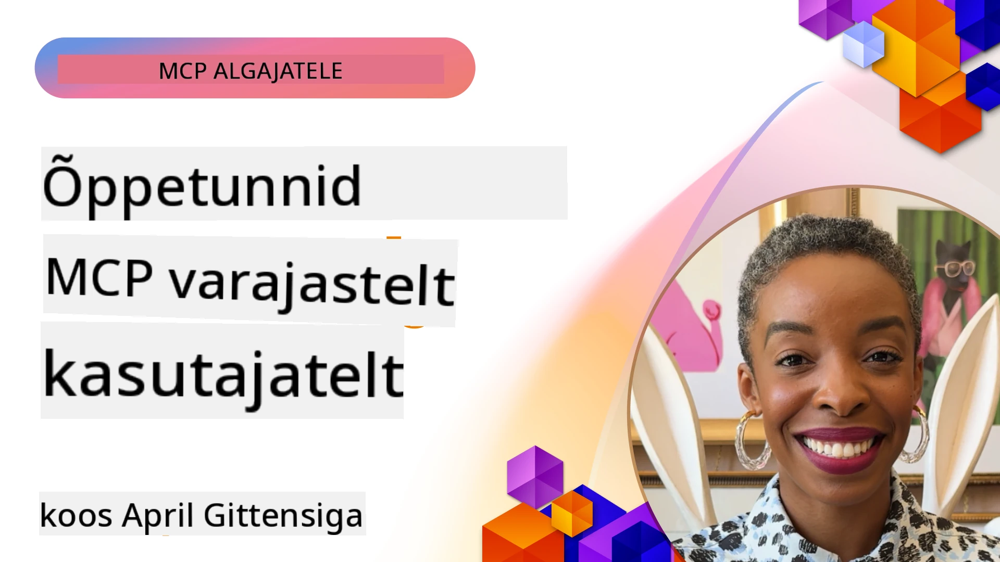

# 🌟 Õppetunnid varajastelt kasutajatelt

[](https://youtu.be/jds7dSmNptE)

_(Klõpsake ülaloleval pildil, et vaadata selle tunni videot)_

## 🎯 Mida see moodul käsitleb

See moodul uurib, kuidas tõelised organisatsioonid ja arendajad kasutavad Model Context Protocoli (MCP), et lahendada tegelikke väljakutseid ja edendada innovatsiooni. Läbi põhjalike juhtumiuuringute, praktiliste projektide ja näidete avastate, kuidas MCP võimaldab turvalist, skaleeritavat tehisintellekti integratsiooni, mis ühendab keelemudelid, tööriistad ja äriandmed.

### 📚 Vaadake MCP töötamas

Kas soovite näha nende põhimõtete rakendamist tootmisvalmis tööriistadele? Vaadake meie [**10 Microsofti MCP serverit, mis muudavad arendajate tootlikkust**](microsoft-mcp-servers.md), mis tutvustab reaalseid Microsofti MCP servereid, mida saate täna kasutada.

## Ülevaade

See tund käsitleb, kuidas varajased kasutajad on kasutanud Model Context Protocoli (MCP), et lahendada reaalse maailma probleeme ja edendada innovatsiooni erinevates tööstusharudes. Läbi põhjalike juhtumiuuringute ja praktiliste projektide näete, kuidas MCP võimaldab standardiseeritud, turvalist ja skaleeritavat tehisintellekti integratsiooni — ühendades suuri keelemudeleid, tööriistu ja ettevõtte andmeid ühtses raamistikus. Saate praktilist kogemust MCP-põhiste lahenduste disainimisel ja loomisel, õpite tõestatud rakendamise mustritest ja avastate parimaid tavasid MCP juurutamiseks tootmiskeskkondades. Tund toob esile ka tekkivad trendid, tuleviku suunad ja avatud lähtekoodiga ressursid, mis aitavad teil püsida MCP tehnoloogia ja selle areneva ökosüsteemi eesliinil.

## Õpieesmärgid

- Analüüsida reaalse maailma MCP rakendusi erinevates tööstusharudes
- Disainida ja ehitada täielikke MCP-põhiseid rakendusi
- Uurida tekkivaid trende ja tuleviku suundi MCP tehnoloogias
- Rakendada parimaid tavasid tegelikes arendussituatsioonides

## Reaalse maailma MCP rakendused

### Juhtumiuuring 1: Ettevõtte klienditoe automatiseerimine

Mitmepoolne korporatsioon rakendas MCP-põhise lahenduse, et standardiseerida tehisintellekti suhtlusi oma klienditoe süsteemides. See võimaldas neil:

- Luua ühtne liides mitme LLM-i pakkuja jaoks
- Säilitada ühtne promptihaldus osakondade vahel
- Rakendada tugevaid turva- ja vastavuskontrolle
- Lihtsalt vahetada erinevate AI mudelite vahel vastavalt konkreetsetele vajadustele

**Tehniline rakendus:**

```python
# Pythoni MCP serveri teostus klienditoeks
import logging
import asyncio
from modelcontextprotocol import create_server, ServerConfig
from modelcontextprotocol.server import MCPServer
from modelcontextprotocol.transports import create_http_transport
from modelcontextprotocol.resources import ResourceDefinition
from modelcontextprotocol.prompts import PromptDefinition
from modelcontextprotocol.tool import ToolDefinition

# Logimise seadistamine
logging.basicConfig(level=logging.INFO)

async def main():
    # Serveri konfiguratsiooni loomine
    config = ServerConfig(
        name="Enterprise Customer Support Server",
        version="1.0.0",
        description="MCP server for handling customer support inquiries"
    )
    
    # MCP serveri initsialiseerimine
    server = create_server(config)
    
    # Teadmusbaasi ressursside registreerimine
    server.resources.register(
        ResourceDefinition(
            name="customer_kb",
            description="Customer knowledge base documentation"
        ),
        lambda params: get_customer_documentation(params)
    )
    
    # Kasutusmallide registreerimine
    server.prompts.register(
        PromptDefinition(
            name="support_template",
            description="Templates for customer support responses"
        ),
        lambda params: get_support_templates(params)
    )
    
    # Tugivahendite registreerimine
    server.tools.register(
        ToolDefinition(
            name="ticketing",
            description="Create and update support tickets"
        ),
        handle_ticketing_operations
    )
    
    # Serveri käivitamine HTTP transpordiga
    transport = create_http_transport(port=8080)
    await server.run(transport)

if __name__ == "__main__":
    asyncio.run(main())
```

**Tulemused:** Mudelikulud vähenesid 30%, vastuse järjepidevus paranes 45% ning globaalsete operatsioonide vastavus tõusis.

### Juhtumiuuring 2: Terviseteenuste diagnostiline assistent

Tervishoiuteenuse pakkuja arendas MCP infrastruktuuri, et integreerida mitu erialast meditsiinilist AI mudelit, tagades samal ajal tundlike patsiendiandmete kaitse:

- Sujuv ümberlülitumine üldistel ja spetsialistide meditsiinilistel mudelitel
- Range privaatsuskontroll ja auditeerimistrajektoorid
- Integreerimine olemasolevate elektrooniliste tervisekandeloogide (EHR) süsteemidega
- Ühtlane promptide modelleerimine meditsiinilise terminoloogia jaoks

**Tehniline rakendus:**

```csharp
// C# MCP host application implementation in healthcare application
using Microsoft.Extensions.DependencyInjection;
using ModelContextProtocol.SDK.Client;
using ModelContextProtocol.SDK.Security;
using ModelContextProtocol.SDK.Resources;

public class DiagnosticAssistant
{
    private readonly MCPHostClient _mcpClient;
    private readonly PatientContext _patientContext;
    
    public DiagnosticAssistant(PatientContext patientContext)
    {
        _patientContext = patientContext;
        
        // Configure MCP client with healthcare-specific settings
        var clientOptions = new ClientOptions
        {
            Name = "Healthcare Diagnostic Assistant",
            Version = "1.0.0",
            Security = new SecurityOptions
            {
                Encryption = EncryptionLevel.Medical,
                AuditEnabled = true
            }
        };
        
        _mcpClient = new MCPHostClientBuilder()
            .WithOptions(clientOptions)
            .WithTransport(new HttpTransport("https://healthcare-mcp.example.org"))
            .WithAuthentication(new HIPAACompliantAuthProvider())
            .Build();
    }
    
    public async Task<DiagnosticSuggestion> GetDiagnosticAssistance(
        string symptoms, string patientHistory)
    {
        // Create request with appropriate resources and tool access
        var resourceRequest = new ResourceRequest
        {
            Name = "patient_records",
            Parameters = new Dictionary<string, object>
            {
                ["patientId"] = _patientContext.PatientId,
                ["requestingProvider"] = _patientContext.ProviderId
            }
        };
        
        // Request diagnostic assistance using appropriate prompt
        var response = await _mcpClient.SendPromptRequestAsync(
            promptName: "diagnostic_assistance",
            parameters: new Dictionary<string, object>
            {
                ["symptoms"] = symptoms,
                patientHistory = patientHistory,
                relevantGuidelines = _patientContext.GetRelevantGuidelines()
            });
            
        return DiagnosticSuggestion.FromMCPResponse(response);
    }
}
```

**Tulemused:** Paranenud diagnostilised soovitused arstidele, samas kui säilitati täielik HIPAA vastavus ja vähendati oluliselt süsteemide vahelist kontekstivahetust.

### Juhtumiuuring 3: Finantsteenuste riskianalüüs

Finantsasutus rakendas MCP, et standardiseerida oma riskianalüüsi protsessid erinevates osakondades:

- Loodud ühtne liides krediidiriski, pettuste tuvastamise ja investeeringuriskide mudelite jaoks
- Rakendatud ranged juurdepääsukontrollid ja mudeliversioonide haldus
- Tagatud kõikide AI soovituste auditivõime
- Säilitati ühtne andmete vormindamine mitmesugustes süsteemides

**Tehniline rakendus:**

```java
// Java MCP server finantsriski hindamiseks
import org.mcp.server.*;
import org.mcp.security.*;

public class FinancialRiskMCPServer {
    public static void main(String[] args) {
        // Loo MCP server finantsalaste vastavusfunktsioonidega
        MCPServer server = new MCPServerBuilder()
            .withModelProviders(
                new ModelProvider("risk-assessment-primary", new AzureOpenAIProvider()),
                new ModelProvider("risk-assessment-audit", new LocalLlamaProvider())
            )
            .withPromptTemplateDirectory("./compliance/templates")
            .withAccessControls(new SOCCompliantAccessControl())
            .withDataEncryption(EncryptionStandard.FINANCIAL_GRADE)
            .withVersionControl(true)
            .withAuditLogging(new DatabaseAuditLogger())
            .build();
            
        server.addRequestValidator(new FinancialDataValidator());
        server.addResponseFilter(new PII_RedactionFilter());
        
        server.start(9000);
        
        System.out.println("Financial Risk MCP Server running on port 9000");
    }
}
```

**Tulemused:** Suurenenud regulatiivne vastavus, mudelite juurutamise tsüklid kiirenesid 40%, ja paranenud riskihindamise järjepidevus osakondade vahel.

### Juhtumiuuring 4: Microsoft Playwright MCP server brauseriautomaatikaks

Microsoft arendas [Playwright MCP serveri](https://github.com/microsoft/playwright-mcp), et võimaldada turvalist ja standardiseeritud brauseriautomaati Model Context Protocoli kaudu. See tootmisvalmis server võimaldab AI agentidel ja LLMidel suhelda veebibrauseritega kontrollitud, auditeeritavas ja laiendatavas viisis — võimaldades kasutusjuhtumeid nagu automatiseeritud veebitestimine, andmeekstraktsioon ja otsast lõpuni töövood.

> **🎯 Tootmisvalmis tööriist**
> 
> See juhtumiuuring tutvustab reaalse MCP serveri, mida saate täna kasutada! Lisateavet Playwright MCP Serveri ja teiste 9 tootmisvalmis Microsoft MCP serveri kohta leiate meie [**Microsoft MCP Serverite juhendist**](microsoft-mcp-servers.md#8--playwright-mcp-server).

**Peamised omadused:**
- Avaldab brauseriautomaatika võimalusi (navigatsioon, vormide täitmine, ekraanipiltide tegemine jne) MCP tööriistadena
- Rakendab ranged juurdepääsu kontrollid ja liivakasti kaitse volitamata toimingute vältimiseks
- Pakub üksikasjalikke auditilogisid kõigi brauseri interaktsioonide kohta
- Toetab integreerimist Azure OpenAI ja teiste LLM pakkujatega agendipõhiseks automatiseerimiseks
- Toidab GitHub Copiloti kodeerimisagenti veebibrauseri võimekusega

**Tehniline rakendus:**

```typescript
// TypeScript: Playwright'i brauseri automatiseerimistööriistade registreerimine MCP serveris
import { createServer, ToolDefinition } from 'modelcontextprotocol';
import { launch } from 'playwright';

const server = createServer({
  name: 'Playwright MCP Server',
  version: '1.0.0',
  description: 'MCP server for browser automation using Playwright'
});

// Registreeri tööriist URL-ile navigeerimiseks ja ekraanipildi tegemiseks
server.tools.register(
  new ToolDefinition({
    name: 'navigate_and_screenshot',
    description: 'Navigate to a URL and capture a screenshot',
    parameters: {
      url: { type: 'string', description: 'The URL to visit' }
    }
  }),
  async ({ url }) => {
    const browser = await launch();
    const page = await browser.newPage();
    await page.goto(url);
    const screenshot = await page.screenshot();
    await browser.close();
    return { screenshot };
  }
);

// Käivita MCP server
server.listen(8080);
```

**Tulemused:**

- Võimaldas turvalise ja programmeeritud brauseriautomaatika AI agentidele ja LLMidele
- Vähendas käsitsi testimise pingutust ja parandas veebirakenduste testide katvust
- Pakub taaskasutatavat ja laiendatavat raamistiku brauseripõhiste tööriistade integreerimiseks ettevõttes
- Toidab GitHub Copiloti veebibrauseri võimekust

**Viited:**

- [Playwright MCP Server GitHubi hoidla](https://github.com/microsoft/playwright-mcp)
- [Microsoft AI ja automatiseerimislahendused](https://azure.microsoft.com/en-us/products/ai-services/)

### Juhtumiuuring 5: Azure MCP – Ettevõtte tasemel Model Context Protocol teenusena

Azure MCP Server ([https://aka.ms/azmcp](https://aka.ms/azmcp)) on Microsofti hallatav ettevõtte tasemel Model Context Protocoli rakendus, mis on loodud pakkuma skaleeritavaid, turvalisi ja vastavuskõlblikke MCP serveri võimeid pilveteenusena. Azure MCP võimaldab organisatsioonidel kiiresti juurutada, hallata ja integreerida MCP servereid Azure AI, andmete ja turvateenustega, vähendades tegevuskulusid ja kiirendades AI kasutuselevõttu.

> **🎯 Tootmisvalmis tööriist**
> 
> See on tõeline MCP server, mida saate täna kasutada! Lisateavet Microsoft Foundry MCP serveri kohta leiate meie [**Microsoft MCP Serverite juhendist**](microsoft-mcp-servers.md).


- Täisautomatiseeritud MCP serveri majutamine sisseehitatud skaleerimise, jälgimise ja turvalisusega
- Looduslik integratsioon Azure OpenAI, Azure AI Searchi ja teiste Azure teenustega
- Ettevõtte autentimine ja autoriseerimine Microsoft Entra ID kaudu
- Toetus kohandatud tööriistadele, prompti mallidele ja ressursi ühendustele
- Vastavus ettevõtte turva- ja regulatiivsetele nõuetele

**Tehniline rakendus:**

```yaml
# Example: Azure MCP server deployment configuration (YAML)
apiVersion: mcp.microsoft.com/v1
kind: McpServer
metadata:
  name: enterprise-mcp-server
spec:
  modelProviders:
    - name: azure-openai
      type: AzureOpenAI
      endpoint: https://<your-openai-resource>.openai.azure.com/
      apiKeySecret: <your-azure-keyvault-secret>
  tools:
    - name: document_search
      type: AzureAISearch
      endpoint: https://<your-search-resource>.search.windows.net/
      apiKeySecret: <your-azure-keyvault-secret>
  authentication:
    type: EntraID
    tenantId: <your-tenant-id>
  monitoring:
    enabled: true
    logAnalyticsWorkspace: <your-log-analytics-id>
```

**Tulemused:**  
- Vähenes ettevõtte AI projektide väärtuse tekkimiseks kuluv aeg pakkudes kasutusvalmis, vastav MCP serveri platvormi
- Lihtsustatud LLMide, tööriistade ja ettevõtte andmeallikate integratsioon
- Paranenud turvalisus, jälgitavus ja tegevuslik tõhusus MCP töökoormuste jaoks
- Paranenud koodikvaliteet Azure SDK parimate tavade ja praeguste autentimismustritega

**Viited:**  
- [Azure MCP dokumentatsioon](https://aka.ms/azmcp)
- [Azure MCP Server GitHub hoidla](https://github.com/Azure/azure-mcp)
- [Azure AI teenused](https://azure.microsoft.com/en-us/products/ai-services/)
- [Microsoft MCP Keskus](https://mcp.azure.com)

## Juhtumiuuring 6: NLWeb 
MCP (Model Context Protocol) on tekkiv protokoll vestlusrobotite ja tehisintellekti assistentide jaoks tööriistadega suhtlemiseks. Iga NLWeb eksemplar on ka MCP server, mis toetab ühte põhimeetodit, ask, mida kasutatakse veebisaidilt loomulikus keeles küsimise jaoks. Tagastatud vastus kasutab schema.org-i, laialdaselt kasutatud sõnastikku veebandmete kirjeldamiseks. Rääkimaks vabalt, on MCP NLWeb suhtes sama, mis HTTP HTML suhtes. NLWeb ühendab protokollid, schema.org vormingud ja näitekoodi, et aidata saitidel kiiresti luua neid lõpp-punkte, mis pakuvad kasu nii inimestele konversatsiooniliste liideste kaudu kui masinatele loomuliku agentidevahelise suhtluse kaudu.

NLWel on kaks eraldiseisvat komponenti.
- Protokoll, mis on alguses väga lihtne, saidiga loomulikus keeles suhtlemiseks ja vorming, mis kasutab vastuseks json-i ja schema.org-i. Vaadake REST API dokumentatsiooni täpsemate üksikasjade jaoks.
- Lihtne rakendus (1) jaoks, mis kasutab olemasolevat märgistust saitidele, mida saab esitada üksuste nimekirjadena (tooted, retseptid, vaatamisväärsused, arvustused jt). Koos kasutajaliidese vidinate komplektiga saavad saidid lihtsalt pakkuda oma sisule konversatsioonilisi liideseid. Vaadake dokumentatsiooni vestluskäsu elutsükli kohta täpsema info saamiseks selle töö kohta.
 
**Viited:**  
- [Azure MCP dokumentatsioon](https://aka.ms/azmcp)
- [NLWeb](https://github.com/microsoft/NlWeb)

### Juhtumiuuring 7: Microsoft Foundry MCP server – ettevõtte AI agendi integratsioon

Microsoft Foundry MCP serverid demonstreerivad, kuidas MCP-d saab kasutada AI agentide ja töövoogude koordineerimiseks ning haldamiseks ettevõtte keskkondades. MCP integreerimine Microsoft Foundryga võimaldab organisatsioonidel standardiseerida agentide suhtlusi, kasutada Foundry töövoogude haldust ning tagada turvalised ja skaleeritavad juurutused.

> **🎯 Tootmisvalmis tööriist**
> 
> See on tõeline MCP server, mida saate täna kasutada! Lisateavet Microsoft Foundry MCP serveri kohta leiate meie [**Microsoft MCP Serverite juhendist**](microsoft-mcp-servers.md#9--microsoft-foundry-mcp-server).

**Peamised omadused:**
- Täielik juurdepääs Azure AI ökosüsteemile, sealhulgas mudelikataloogidele ja juurutuse haldusele
- Teadmiste indekseerimine Azure AI Searchiga RAG rakenduste jaoks
- AI mudeli jõudluse ja kvaliteedi hindamise tööriistad
- Integratsioon Microsoft Foundry kataloogi ja labidega tipptasemel teadusmudelite jaoks
- Agendi haldus- ja hindamisvõimalused tootmissituatsioonides

**Tulemused:**
- Kiire prototüüpimine ja AI agentide töövoogude tugev jälgimine
- Sujuv integreerimine Azure AI teenustega keerukate stsenaariumite jaoks
- Ühtne liides agentide torujuhtmete loomisel, juurutamisel ja jälgimisel
- Paranenud turvalisus, vastavus ja tegevuse efektiivsus ettevõtetes
- Kiirendatud AI kasutuselevõtt hoides samal ajal kontrolli keerukate agentide juhtimiste üle

**Viited:**
- [Microsoft Foundry MCP serveri GitHubi hoidla](https://github.com/azure-ai-foundry/mcp-foundry)
- [Azure AI agentide integreerimine MCP-ga (Microsoft Foundry blogi)](https://devblogs.microsoft.com/foundry/integrating-azure-ai-agents-mcp/)

### Juhtumiuuring 8: Foundry MCP mänguväljak – katsetamine ja prototüüpimine

Foundry MCP mänguväljak pakub valmis keskkonda MCP serverite ja Microsoft Foundry integratsioonidega katsetamiseks. Arendajad saavad kiiresti prototüüpida, testida ja hinnata AI mudeleid ning agendi töövooge, kasutades Microsoft Foundry kataloogi ja labide ressursse. Mänguväljak lihtsustab seadistust, pakub näidendeid ja toetab koostööl põhinevat arengut, muutes lihtsaks parimate tavade ja uute stsenaariumite uurimise minimaalse koormusega. See on eriti kasulik meeskondadele, kes soovivad ideid valideerida, eksperimente jagada ja õppimist kiirendada ilma keeruka infrastruktuurita. Madaldades sisenemisbarjääri aitab mänguväljak soodustada innovatsiooni ja kogukonna panustamist MCP ja Microsoft Foundry ökosüsteemis.

**Viited:**

- [Foundry MCP mänguväljaku GitHubi hoidla](https://github.com/azure-ai-foundry/foundry-mcp-playground)

### Juhtumiuuring 9: Microsoft Learn Docs MCP server – tehisintellekti abil juhitud dokumentatsiooniläbipääs

Microsoft Learn Docs MCP Server on pilvepõhine teenus, mis pakub AI assistentidele reaalajas juurdepääsu ametlikule Microsofti dokumentatsioonile Model Context Protocoli kaudu. See tootmisvalmis server ühendub ulatusliku Microsoft Learn ökosüsteemiga ja võimaldab semantilist otsingut kõigis ametlikes Microsofti allikates.

> **🎯 Tootmisvalmis tööriist**
> 
> See on tõeline MCP server, mida saate täna kasutada! Lisateavet Microsoft Learn Docs MCP serveri kohta leiate meie [**Microsoft MCP Serverite juhendist**](microsoft-mcp-servers.md#1--microsoft-learn-docs-mcp-server).

**Peamised omadused:**
- Reaalajas juurdepääs ametlikule Microsofti dokumentatsioonile, Azure dokumentidele ja Microsoft 365 dokumentatsioonile
- Täiustatud semantilised otsingu võimalused, mis mõistavad konteksti ja kavatsust
- Alati värske info, kuna Microsoft Learn sisu avaldatakse jooksvalt
- Ulatuslik katvus Microsoft Learn, Azure ning Microsoft 365 allikates
- Tagastab kuni 10 kõrgekvaliteedilist sisutükki koos artikli pealkirjade ja URLidega

**Miks see on ülioluline:**
- Lahendab Microsofti tehnoloogiate "vanu AI teadmisi" probleemi
- Tagab, et AI assistentidel on juurdepääs uusimatele .NET, C#, Azure ja Microsoft 365 funktsioonidele
- Pakub autoriteetset, esmase allika teavet täpseks koodigeneratsiooniks
- Hädavajalik arendajatele, kes töötavad kiiresti arenevate Microsofti tehnoloogiatega

**Tulemused:**
- Märkimisväärselt paranenud AI loodud koodi täpsus Microsofti tehnoloogiate jaoks
- Vähendanud dokumentatsiooni ja parimate tavade otsimise aega
- Tõhustatud arendaja tootlikkus kontekstipõhise dokumentatsioonitoetusega
- Sujuv integreerimine arendustöövoogudesse ilma IDE-st lahkumata

**Viited:**
- [Microsoft Learn Docs MCP Serveri GitHubi hoidla](https://github.com/MicrosoftDocs/mcp)
- [Microsoft Learn dokumentatsioon](https://learn.microsoft.com/)

## Praktikalised projektid

### Projekt 1: Mitme pakkuja MCP serveri loomine

**Eesmärk:** Loo MCP server, mis suudab suunata päringuid mitmele AI mudelipakkujale konkreetsete kriteeriumide alusel.

**Nõuded:**

- Toetada vähemalt kolme erinevat mudelipakkujat (nt OpenAI, Anthropic, kohalikud mudelid)
- Rakendada suunamismehhanismi päringu metaandmete põhjal
- Luua konfiguratsioonisüsteem pakkujate volituste haldamiseks
- Lisada vahemälu jõudluse ja kulude optimeerimiseks
- Ehitada lihtne armatuurlaud kasutuse jälgimiseks

**Rakendamise sammud:**

1. Põhistruktuuri loomine MCP serverile
2. Pakkujate adapterite rakendamine iga AI mudliteenuse jaoks
3. Suunamisloogika loomine päringu omaduste alusel
4. Vahemälumehhanismide lisamine sagedaste päringute jaoks
5. Jälgimisarmatuuri arendamine
6. Testimine erinevate päringumustritega

**Tehnoloogiad:** Valige Python (.NET/Java/Python vastavalt eelistusele), Redis vahemäluks ja lihtne veebiraamistik armatuuri jaoks.

### Projekt 2: Ettevõtte promptihalduse süsteem

**Eesmärk:** Arendada MCP-põhine süsteem promptimallide haldamiseks, versioonimiseks ja juurutamiseks organisatsiooni ulatuses.

**Nõuded:**


- Loo keskne hoidla promptide mallide jaoks
- Rakenda versioonihaldust ja kinnitamise töövooge
- Ehita mallide testimise võimalused näidisandmete abil
- Arenda rollipõhised juurdepääsukontrollid
- Loo mallide pärimiseks ja juurutamiseks API

**Rakendusetapid:**

1. Disaini andmebaasi skeem mallide salvestamiseks
2. Loo põhineb API mallide CRUD-operatsioonide jaoks
3. Rakenda versioonisüsteem
4. Ehita kinnitamise töövoog
5. Arenda testimise raamistik
6. Loo lihtne veebiliides haldamiseks
7. Integreeri MCP serveriga

**Tehnoloogiad:** Sinu valitud backend-raamistik, SQL või NoSQL andmebaas ja frontend-raamistik haldusliidese jaoks.

### Projekt 3: MCP-põhine sisugeneratsiooni platvorm

**Eesmärk:** Ehita sisugeneratsiooni platvorm, mis kasutab MCP-d, et pakkuda järjepidevaid tulemusi erinevate sisutüüpide puhul.

**Nõuded:**

- Toeta mitut sisutüüpi (blogipostitused, sotsiaalmeedia, turundustekstid)
- Rakenda mallipõhist genereerimist kohandamisvõimalustega
- Loo sisu ülevaatamise ja tagasiside süsteem
- Jälgi sisu tulemuslikkuse mõõdikuid
- Toeta sisu versioonihaldust ja iteratsiooni

**Rakendusetapid:**

1. Loo MCP kliendi infrastruktuur
2. Loo mallid erinevate sisutüüpide jaoks
3. Ehita sisugeneratsiooni torujuhe
4. Rakenda ülevaatussüsteem
5. Arenda mõõdikute jälgimissüsteem
6. Loo kasutajaliides mallide haldamiseks ja sisu genereerimiseks

**Tehnoloogiad:** Sinu eelistatud programmeerimiskeel, veebiraamistik ja andmebaasisüsteem.

## MCP tehnoloogia tulevikusuunad

### Tärkavad trendid

1. **Mitmemodaalne MCP**
   - MCP laiendamine pildimudelite, heli- ja videomudelitega suhtlemise standardimiseks
   - Ristmodaalse arutlemise võimekuse arendamine
   - Erinevate modalityde standardiseeritud promptformaadid

2. **Federatiivne MCP infrastruktuur**
   - Hajutatud MCP võrgud, mis suudavad jagada ressursse organisatsioonide vahel
   - Turvalise mudelite jagamise standardiseeritud protokollid
   - Privaatsust kaitsvad arvutusmeetodid

3. **MCP turud**
   - Ökosüsteemid MCP mallide ja pistikprogrammide jagamiseks ja rahastamiseks
   - Kvaliteedi tagamise ja sertifitseerimise protsessid
   - Integratsioon mudeliturgudega

4. **MCP servarvutusele**
   - MCP standardite kohandamine ressursspiiratud servaseadmetele
   - Optimeeritud protokollid vähese ribalaiusega keskkondadele
   - Spetsialiseeritud MCP rakendused IoT ökosüsteemide jaoks

5. **Regulatiivsed raamistikud**
   - MCP laienduste arendamine regulatiivseks vastavuseks
   - Standardiseeritud auditeerimislõigud ja seletatavuse liidesed
   - Integratsioon tärkavate tehisintellekti valitsemisraamistikudega

### MCP lahendused Microsoftilt

Microsoft ja Azure on arendanud mitmeid avatud lähtekoodiga hoidlaid, et aidata arendajatel MCP-d erinevates stsenaariumites rakendada:

#### Microsofti organisatsioon

1. [playwright-mcp](https://github.com/microsoft/playwright-mcp) - Playwright MCP server brauseri automatiseerimiseks ja testimiseks
2. [files-mcp-server](https://github.com/microsoft/files-mcp-server) - OneDrive MCP serveri rakendus kohaliku testimise ja kogukonna panuse jaoks
3. [NLWeb](https://github.com/microsoft/NlWeb) - NLWeb on avatud protokollide ja sellega seotud avatud lähtekoodiga tööriistade kogumik. Peamine keskpunkt on AI-veebi alustala loomine

#### Azure-Samples organisatsioon

1. [mcp](https://github.com/Azure-Samples/mcp) - Näited, tööriistad ja ressursid MCP serverite loomise ja integreerimise jaoks Azure'is mitmes keeles
2. [mcp-auth-servers](https://github.com/Azure-Samples/mcp-auth-servers) - Näitelised MCP serverid, mis demonstreerivad autentimist Model Context Protocoli spetsifikatsiooniga
3. [remote-mcp-functions](https://github.com/Azure-Samples/remote-mcp-functions) - Koduleht kaug-MCP serveri rakendusteks Azure Functions'is koos keelespetsiifiliste hoidlate linkidega
4. [remote-mcp-functions-python](https://github.com/Azure-Samples/remote-mcp-functions-python) - Kiirkaart mall kohandatud kaug-MCP serverite loomiseks ja juurutamiseks Pythoniga Azure Functions'is
5. [remote-mcp-functions-dotnet](https://github.com/Azure-Samples/remote-mcp-functions-dotnet) - Kiirkaart mall kohandatud kaug-MCP serverite loomiseks ja juurutamiseks .NET/C# keeles Azure Functions'is
6. [remote-mcp-functions-typescript](https://github.com/Azure-Samples/remote-mcp-functions-typescript) - Kiirkaart mall kohandatud kaug-MCP serverite loomiseks ja juurutamiseks TypeScriptiga Azure Functions'is
7. [remote-mcp-apim-functions-python](https://github.com/Azure-Samples/remote-mcp-apim-functions-python) - Azure API haldus AI väravana kaug-MCP serveritele Pythoniga
8. [AI-Gateway](https://github.com/Azure-Samples/AI-Gateway) - APIM ❤️ AI eksperimendid, sealhulgas MCP võimekused, integratsioon Azure OpenAI ja AI Foundry-ga

Need hoidlad pakuvad mitmesuguseid rakendusi, malle ja ressursse Model Context Protocoliga erinevates programmeerimiskeeltes ja Azure teenustes töötamiseks. Katavad kasutusjuhtumid alates põhilistest serverirakendustest kuni autentimise, pilvejuurutuse ja ettevõtte integreerimise stsenaariumiteni.

#### MCP ressursside kataloog

Microsofti ametlikus MCP hoidlas asuv [MCP Resources kataloog](https://github.com/microsoft/mcp/tree/main/Resources) pakub kureeritud valikut näidisressursse, promptide malle ja tööriistade definitsioone, mida kasutada Model Context Protocol serveritega. See kataloog on mõeldud aitamaks arendajatel kiiresti MCP-ga alustada, pakkudes taaskasutatavaid ehitusplaate ja parimate tavade näiteid:

- **Promptide mallid:** Kasutamisvalmis promptide mallid tavapäraste AI ülesannete ja stsenaariumide jaoks, mida saab kohandada oma MCP serveri rakendustes.
- **Tööriistade definitsioonid:** Näidismallid ja metaandmed tööriistade integreerimise ja käivitamise standardiseerimiseks erinevate MCP serverite vahel.
- **Ressursside näidised:** Näidised resursside definitsioonidest, mis võimaldavad ühendusi andmeallikate, API-de ja välistoimingutega MCP raamistikus.
- **Võtmekohtade näited:** Praktilised näidised, mis demonstreerivad, kuidas struktureerida ja organiseerida ressursse, prompt'e ja tööriistu tegelikes MCP projektides.

Need ressursid kiirendavad arendust, soodustavad standardiseerimist ja aitavad tagada parimad tavad MCP-põhiste lahenduste loomisel ja juurutamisel.

#### MCP ressursside kataloog

- [MCP Resources (näidis-promptid, tööriistad ja ressurside definitsioonid)](https://github.com/microsoft/mcp/tree/main/Resources)

### Uurimisvõimalused

- Tõhusad promptide optimeerimise tehnikad MCP raamistikus
- Turvamudelid mitme kasutajaga MCP juurutusteks
- Tulemuslikkuse võrdlus erinevate MCP rakenduste vahel
- MCP serverite formaalsed verifitseerimismeetodid

## Kokkuvõte

Model Context Protocol (MCP) kujundab kiiresti standardiseeritud, turvalise ja ühilduva tehisintellekti integratsiooni tulevikku erinevates tööstusharudes. Selle õppetunni juhtumiuuringute ja praktiliste projektide kaudu oled näinud, kuidas varajased kasutajad, sealhulgas Microsoft ja Azure, kasutavad MCP-d, et lahendada reaalseid probleeme, kiirendada AI vastuvõttu ning tagada vastavus, turvalisus ja skaleeritavus. MCP modulaarne lähenemine võimaldab organisatsioonidel ühendada suuri keelemudeleid, tööriistu ja ettevõtte andmeid ühtsesse, auditeeritavasse raamistikku. MCP jätkuval arenemisel on võtmetähtsusega ühenduses püsimine kogukonnaga, avatud lähtekoodi ressursside uurimine ja parimate tavade rakendamine tugevate, tulevikukindlate AI lahenduste ehitamiseks.

## Täiendavad ressursid

- [MCP Foundry GitHub hoidla](https://github.com/azure-ai-foundry/mcp-foundry)
- [Foundry MCP mänguväljak](https://github.com/azure-ai-foundry/foundry-mcp-playground)
- [Azure AI agentide integreerimine MCP-ga (Microsoft Foundry blogi)](https://devblogs.microsoft.com/foundry/integrating-azure-ai-agents-mcp/)
- [MCP GitHub hoidla (Microsoft)](https://github.com/microsoft/mcp)
- [MCP ressursside kataloog (näidis-promptid, tööriistad ja ressursi definitsioonid)](https://github.com/microsoft/mcp/tree/main/Resources)
- [MCP kogukond ja dokumentatsioon](https://modelcontextprotocol.io/introduction)
- [MCP spetsifikatsioon (2026-07-28)](https://modelcontextprotocol.io/specification/2026-07-28/)
- [Azure MCP dokumentatsioon](https://aka.ms/azmcp)
- [OWASP MCP Top 10](https://microsoft.github.io/mcp-azure-security-guide/mcp/) - Turvalisuse parimad praktikad
- [Playwright MCP serveri GitHub hoidla](https://github.com/microsoft/playwright-mcp)
- [Files MCP server (OneDrive)](https://github.com/microsoft/files-mcp-server)
- [Azure-Samples MCP](https://github.com/Azure-Samples/mcp)
- [MCP autentimiserverid (Azure-Samples)](https://github.com/Azure-Samples/mcp-auth-servers)
- [Remote MCP funktsioonid (Azure-Samples)](https://github.com/Azure-Samples/remote-mcp-functions)
- [Remote MCP funktsioonid Python (Azure-Samples)](https://github.com/Azure-Samples/remote-mcp-functions-python)
- [Remote MCP funktsioonid .NET (Azure-Samples)](https://github.com/Azure-Samples/remote-mcp-functions-dotnet)
- [Remote MCP funktsioonid TypeScript (Azure-Samples)](https://github.com/Azure-Samples/remote-mcp-functions-typescript)
- [Remote MCP APIM funktsioonid Python (Azure-Samples)](https://github.com/Azure-Samples/remote-mcp-apim-functions-python)
- [AI Gateway (Azure-Samples)](https://github.com/Azure-Samples/AI-Gateway)
- [Microsoft AI ja automatisatsiooni lahendused](https://azure.microsoft.com/en-us/products/ai-services/)

## Harjutused

1. Analüüsi ühte juhtumiuuringut ja tee ettepanek alternatiivseks rakenduslähenemiseks.
2. Vali üks projektidee ja loo selle põhjal detailne tehniline spetsifikatsioon.
3. Uuri sektorit, mida juhtumiuuringutes ei kajastatud, ja kirjuta, kuidas MCP võiks selle spetsiifilisi väljakutseid lahendada.
4. Uuri ühte tulevikusuunda ja loo kontseptsioon uue MCP laienduse toeks.

## Mis edasi

Uuri rohkem: [Microsofti MCP serverid](./microsoft-mcp-servers.md)

Jätka: [Moodul 8: Parimad tavad](../08-BestPractices/README.md)

---

<!-- CO-OP TRANSLATOR DISCLAIMER START -->
**Lahtiütlus**:
See dokument on tõlgitud kasutades AI tõlketeenust [Co-op Translator](https://github.com/Azure/co-op-translator). Kuigi me püüdleme täpsuse poole, palun pange tähele, et automatiseeritud tõlgetes võib esineda vigu või ebatäpsusi. Originaaldokument selle emakeeles tuleks pidada autoriteetseks allikaks. Olulise teabe puhul soovitatakse kasutada professionaalset inimtõlget. Me ei vastuta selle tõlkega seotud eksimustest või valesti mõistmistest.
<!-- CO-OP TRANSLATOR DISCLAIMER END -->