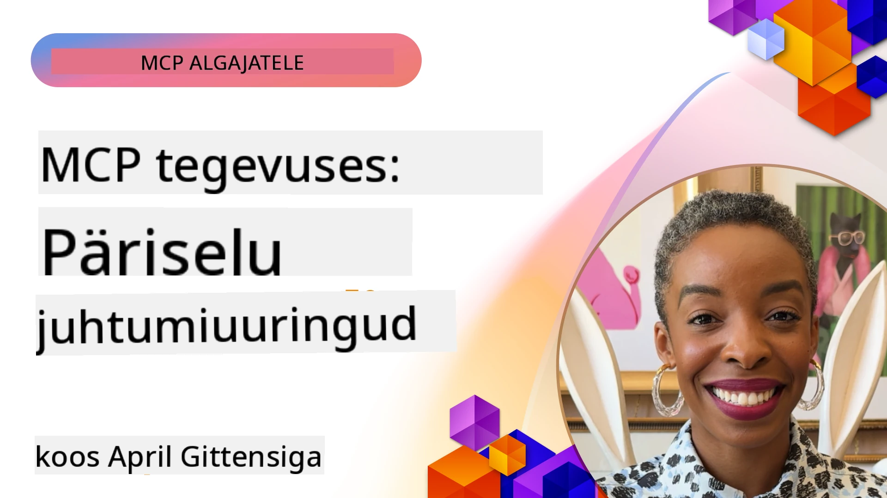

# MCP tegevuses: reaalsed juhtumiuuringud

_(Klõpsake ülaloleval pildil, et vaadata selle õppetunni videot)_

Mudelikonteksti protokoll (MCP) muudab, kuidas tehisintellekti rakendused suhtlevad andmete, tööriistade ja teenustega. See jaotis tutvustab reaalse maailma juhtumiuuringuid, mis demonstreerivad MCP praktilisi rakendusi erinevates ettevõtlusstsenaariumides.

## Ülevaade

Selles jaotises on näidatud MCP rakenduste konkreetseid näiteid, rõhutades, kuidas organisatsioonid kasutavad seda protokolli keerukate äriliste väljakutsete lahendamiseks. Nende juhtumiuuringute uurimisel saate ülevaate MCP mitmekülgsusest, skaleeritavusest ja praktilistest eelistest reaalses maailmas.

## Peamised õpieesmärgid

Nende juhtumiuuringute uurimise kaudu saate:

- Mõista, kuidas MCP-d saab rakendada konkreetsete äriprobleemide lahendamiseks
- Õppida erinevaid integreerimismustreid ja arhitektuurilisi lähenemisviise
- Tuvastada MCP juurutamise parimaid tavasid ettevõtte keskkonnas
- Saada ülevaadet reaalse elu juurutamisel esinevatest väljakutsetest ja lahendustest
- Tuvastada võimalusi sarnaste mustrite rakendamiseks oma projektides

## Esile toodud juhtumiuuringud

### 1. [Azure AI reisibürood – viitamise näidis](./travelagentsample.md)

See juhtumiuuring käsitleb Microsofti põhjalikku viitenäidislahendust, mis demonstreerib, kuidas ehitada mitmeagendiline, AI-toitega reisiplaanimise rakendus, kasutades MCP-d, Azure OpenAI-d ja Azure AI Searchi. Projekt tutvustab:

- Mitmeagendilist orkestreerimist MCP kaudu
- Ettevõtte andmete integreerimist Azure AI Searchiga
- Turvalist, skaleeritavat arhitektuuri Azure teenustega
- Laiendatavaid tööriistu taaskasutatavate MCP komponentidega
- Konversatsioonipõhist kasutajakogemust Azure OpenAI toel

Arhitektuuri ja teostuse üksikasjad pakuvad väärtuslikku ülevaadet selle kohta, kuidas ehitada keerulisi mitmeagendilisi süsteeme, kasutades MCP-d kui koordineerivat kihti.

### 2. [Azure DevOpsi üksuste uuendamine YouTube andmetest](./UpdateADOItemsFromYT.md)

See juhtumiuuring demonstreerib MCP praktilist rakendust töövoo protsesside automatiseerimiseks. See näitab, kuidas MCP tööriistu saab kasutada:

- Andmete väljavõtmiseks veebiplatvormidelt (YouTube)
- Tööülesannete uuendamiseks Azure DevOpsi süsteemides
- Korduvate automatiseeritud töövoogude loomiseks
- Andmete integreerimiseks erinevate süsteemide vahel

See näide illustreerib, kuidas isegi suhteliselt lihtsatel MCP rakendustel võib olla märkimisväärne efektiivsuse kasv, automatiseerides rutiinseid ülesandeid ja parandades andmete järjepidevust süsteemides.

### 3. [Reaalajas dokumentatsiooni hankimine MCP-ga](./docs-mcp/README.md)

See juhtumiuuring juhendab teid läbi Python konsolikliendi ühendamise Model Context Protocol (MCP) serveriga reaalajas kontekstiteadliku Microsofti dokumentatsiooni hankimiseks ja logimiseks. Õpite, kuidas:

- Ühenduda MCP serveriga, kasutades Python klienti ja ametlikku MCP SDK-d
- Kasutada efitsiensete andmevoogude saamiseks voogedastuse HTTP kliente
- Kutsuda serveri dokumentatsioonitööriistu ja logida vastused otse konsooli
- Integreerida värskendatud Microsofti dokumentatsiooni oma töövoogu ilma terminali jätmata

Kapitel sisaldab praktilist ülesannet, minimaalset toimivat koodinäidet ja linke täiendavatele ressurssidele sügavama õppimise jaoks. Vaadake täielikku juhendit ja koodi seotud peatükis, et mõista, kuidas MCP saab muuta dokumentatsiooni ligipääsu ja arendajate tootlikkust konsoolipõhistes keskkondades.

### 4. [Interaktiivne õppekava generaator veebirakendus MCP-ga](./docs-mcp/README.md)

See juhtumiuuring demonstreerib, kuidas ehitada interaktiivne veebirakendus, kasutades Chainlit ja Model Context Protocoli (MCP), et genereerida isikupärastatud õppekavu mis tahes teema jaoks. Kasutajad saavad määrata teema (näiteks "AI-900 sertifikaat") ja õppimise kestuse (nt 8 nädalat), ning rakendus pakub nädalapõhise soovitatava sisu jaotuse. Chainlit võimaldab konversatsioonipõhist chat-liidest, muutes kogemuse kaasahaaravaks ja kohanduvaks.

- Konversatsioonipõhine veebirakendus, mida toetab Chainlit
- Kasutaja juhitud teemade ja kestuse päringud
- Nädalapõhised sisusoovitused MCP abil
- Reaalajas, kohanduvad vastused chat-liideses

Projekt illustreerib, kuidas konversatsiooniline AI ja MCP saavad kokku luua dünaamilisi, kasutajakeskseid hariduslike tööriistu moodsas veebikeskkonnas.

### 5. [Toimetajasisene dokumentatsioon MCP serveriga VS Code'is](./docs-mcp/README.md)

See juhtumiuuring näitab, kuidas tuua Microsoft Learn Docs otse oma VS Code'i keskkonda, kasutades MCP serverit — pole enam vaja brauseri vahekaarte vahetada! Näete, kuidas:

- Koheselt otsida ja lugeda dokumente otse VS Code'is, kasutades MCP paneeli või käsu paletti
- Viidata dokumentatsioonile ja lisada linke otse oma README või kursuse markdown-failidesse
- Kasutada GitHub Copiloti ja MCP-d sujuvate, AI-toeliste dokumentatsiooni ja koodi töövoogude jaoks
- Kontrollida ja täiustada dokumentatsiooni reaalajas tagasiside ning Microsofti usaldusväärsuse abil
- Integreerida MCP GitHubi töövoogudega pidevaks dokumentatsiooni valideerimiseks

Juurutusse kuulub:

- Näidis `.vscode/mcp.json` konfiguratsioon lihtsaks seadistuseks
- Ekraanipõhised samm-sammult juhendid toimetajakogemuse kohta
- Näpunäiteid Copiloti ja MCP maksimaalseks tootlikkuseks kombineerimiseks

See stsenaarium sobib ideaalselt kursuse autoritele, dokumentatsioonikirjutajatele ja arendajatele, kes soovivad oma toimetajas keskenduda samal ajal dokumentide, Copiloti ja valideerimistööriistade kasutamisele — kõike MCP toel.

### 6. [APIM MCP serveri loomine](./apimsample.md)

See juhtumiuuring annab samm-sammulise juhendi, kuidas luua MCP server, kasutades Azure API haldust (APIM). Käsitletakse:

- MCP serveri seadistamine Azure API halduses
- API toimingute eksponeerimine MCP tööriistadena
- Tõkete ja turvapoliitikate konfigureerimine
- MCP serveri testimine Visual Studio Code'i ja GitHub Copilotiga

See näide illustreerib, kuidas kasutada Azure võimalusi, et luua vastupidav MCP server, mida saab kasutada erinevates rakendustes, parandades AI süsteemide integreerimist ettevõtte API-dega.

### 7. [GitHub MCP registratuur — agentikorralduse kiirendamine](https://github.com/mcp)

See juhtumiuuring käsitleb, kuidas GitHubi MCP registratuur, mis käivitati 2025. aasta septembris, lahendab kriitilise väljakutse AI ökosüsteemis: mudelikonteksti protokolli (MCP) serverite killustatust leitud ja juurutatud ressursside seas.

#### Ülevaade
**MCP registratuur** lahendab kasvava probleemi, kus MCP serverid on killustatud erinevates hoidlates ja registrites, mis varem muutis integreerimise aeglaseks ja vigaderohuks. Need serverid võimaldavad AI agentidel suhelda väliste süsteemidega nagu API-d, andmebaasid ja dokumentatsiooniallikad.

#### Probleemi kirjeldus
Agentidel töötavate töövoogude arendajad seisid silmitsi mitmete väljakutsetega:
- **MCP serverite halb leiduvus** erinevatel platvormidel
- **Korduvad häälestusküsimused** hajutatud foorumites ja dokumentatsioonis
- **Turvariskid** kontrollimata ja usaldamata allikatest
- **Standardi puudumine** serveri kvaliteedi ja ühilduvuse osas

#### Lahenduse arhitektuur
GitHubi MCP registratuur tsentraliseerib usaldusväärsed MCP serverid järgmiste põhifunktsioonidega:
- **Ühe-klõpsuga installimine** integratsioon VS Code’i kaudu lihtsaks seadistuseks
- **Signaali-kära sorteerimine** tähtede, aktiivsuse ja kogukonna valideerimise alusel
- **Otsene integratsioon** GitHub Copiloti ja teiste MCP ühilduvate tööriistadega
- **Avatud panuse mudel**, mis võimaldab panustada nii kogukonnal kui ka ettevõtete partneritel

#### Äriline mõju
Registratuur on toonud mõõdetavaid täiustusi:
- **Kiirem juurdepääs** arendajatele, kasutades tööriistu nagu Microsoft Learn MCP Server, mis voogedastab ametliku dokumentatsiooni otse agentidele
- **Paranenud tootlikkus** spetsialiseeritud serverite kaudu nagu `github-mcp-server`, mis võimaldab loomuliku keele GitHubi automatiseerimist (PR loomine, CI kordusjooksud, koodi skannimine)
- **Tugevam ökosüsteemi usaldus** kureeritud nimekirjade ja läbipaistvate konfiguratsioonistandardite kaudu

#### Strateegiline väärtus
Agentide elutsükli juhtimise ja korduvate töövoogude valdkonnas spetsialiseerujatele pakub MCP registratuur:
- **Modulaarseid agentide juurutamise võimalusi** standardiseeritud komponentidega
- **Registripõhiseid hindamisliine** järjepidevaks testimiseks ja valideerimiseks
- **Tööriistadevahelist ühilduvust**, mis võimaldab sujuvat integratsiooni erinevate AI platvormide vahel

See juhtumiuuring näitab, et MCP registratuur ei ole pelgalt kataloog — see on alusplatvorm skaleeritavate, reaalse maailma mudelintegreerimise ja agentikesksete süsteemide juurutamise jaoks.

### 8. [Postitamine sotsiaalvõrgustikele agendi kaudu](./publora-social-publishing.md)

See juhtumiuuring tutvustab **kirjutamisvõimelist kauget MCP serverit** — seda, mille tööriistad teevad kasutaja nimel pöördumatuid toiminguid — kasutades näitena sotsiaalse postitamise protsessi. Agent koostab postituse, inimene heaks kiidab selle ja server ajastab selle võrkudes.

Huvitavad on disainipiirangud, mida avaldamine seab, mis kehtivad igale serverile, mis kirjutab, mitte ei loe:

- **Avatud avastamine, autentitud täitmine** — `tools/list` vastab ilma volitusteta, et registrid ja kliendid saaksid uurida, samas kui iga `tools/call` nõuab märki ja muidu tagastab `401` koos `WWW-Authenticate` päisega
- **OAuth registreerimine ilma väljaspool riba toiminguta** — dünaamiline kliendi registreerimine täna, kus kliendi ID metadokumendid on suund, kuhu `2026-07-28` spetsifikatsioon suunab
- **Tööriistade anotatsioonid** (`readOnlyHint`, `destructiveHint`, `idempotentHint`), mida kliendid kasutavad otsustamaks, mida kinnitada — vihjed, mitte sundused, mida ühenduste kataloogid nüüd oodatult läbivaatusel küsivad
- **Mitteleiutatud identifikaatorid**, nii et hallutsineeritud väärtus ebaõnnestub valjusti, mitte ei tegutse plausiilse välimusega väärtuse alusel
- **Idempotentsusvõtmed postitusi loovatel tööriistadel**, nii et agendi taaskäivitamine ei loo duplikaatväljaannet
- **Null-operatsiooni sihtmärk, mis on kirjeldatud tööriista skeemis**, mis läbib kogu kirjutamisprotsessi ega avalda midagi, ülevaatajate ja CI jaoks

Kapitel lõpeb lühikese kontrollnimekirjaga, mida saate kasutada enda ehitatava serveri puhul.

## Kokkuvõte

Need kaheksa põhjalikku juhtumiuuringut demonstreerivad mudelikonteksti protokolli tähelepanuväärset mitmekülgsust ja praktilisi rakendusi erinevates reaalse maailma stsenaariumides. Alates keerukatest mitmeagendilistest reisiplaanisüsteemidest ja ettevõtte API haldusest kuni sujuvate dokumentatsiooni töövoogudeni ning revolutsioonilise GitHub MCP registratuurini – need näited näitavad, kuidas MCP pakub standardiseeritud, skaleeritavat viisi ühendada AI süsteemid vajalike tööriistade, andmete ja teenustega erakordse väärtuse loomiseks.

Juhtumiuuringud hõlmavad MCP rakendamise mitut mõõdet:
- **Ettevõtte integreerimine**: Azure API haldus ja Azure DevOpsi automatiseerimine
- **Mitme agendi orkestreerimine**: koordineeritud AI agentidega reisiplaanimine
- **Arendajate tootlikkus**: VS Code integreerimine ja reaalajas dokumentatsiooni ligipääs
- **Ökosüsteemi areng**: GitHubi MCP registratuur alusplatvormina
- **Hariduslikud rakendused**: interaktiivsed õppekavade generaatorid ja konversatsioonilised liidesed

Nende rakenduste uurimise kaudu saate kriitilisi teadmisi:
- **Arhitektuurimustrid** erinevatele ulatustele ja kasutusjuhtudele
- **Teostusstrateegiad**, mis tasakaalustavad funktsionaalsust ja hooldatavust
- **Turvalisuse ja skaleeritavuse** kaalutlused tootmiskeskkonnas
- **Parimad tavad** MCP serveri arendamiseks ja kliendi integreerimiseks
- **Ökosüsteemi mõtlemine** ühendatud AI-toeliste lahenduste loomiseks

Need näited tõestavad koos, et MCP ei ole lihtsalt teoreetiline raamistik, vaid küps, tootmiskõlbulik protokoll, mis võimaldab praktilisi lahendusi keerulistele ärilistele väljakutsetele. Ükskõik, kas ehitate lihtsaid automatiseerimistööriistu või keerukaid mitmeagendilisi süsteeme, pakuvad siin illustreeritud mustrid ja lähenemisviisid tugevat alust teie enda MCP projektidele.

## Täiendavad ressursid

- [Azure AI reisibüroode GitHubi hoidla](https://github.com/Azure-Samples/azure-ai-travel-agents)
- [Azure DevOps MCP tööriist](https://github.com/microsoft/azure-devops-mcp)
- [Playwright MCP tööriist](https://github.com/microsoft/playwright-mcp)
- [Microsoft Docs MCP server](https://github.com/MicrosoftDocs/mcp)
- [GitHub MCP registratuur — agentikorralduse kiirendamine](https://github.com/mcp)
- [MCP kogukonna näited](https://github.com/microsoft/mcp)

## Mis järgmiseks

- Eelmine: [Moodul 8: Parimad tavad](../08-BestPractices/README.md)
- Järgmine: [Moodul 10: AI töövoogude lihtsustamine: MCP serveri ehitamine AI tööriistakomplektiga](../10-StreamliningAIWorkflowsBuildingAnMCPServerWithAIToolkit/README.md)

---

<!-- CO-OP TRANSLATOR DISCLAIMER START -->
**Lahtiütlus**:
See dokument on tõlgitud kasutades AI tõlketeenust [Co-op Translator](https://github.com/Azure/co-op-translator). Kuigi me püüdleme täpsuse poole, palun pange tähele, et automatiseeritud tõlgetes võib esineda vigu või ebatäpsusi. Originaaldokument selle emakeeles tuleks pidada autoriteetseks allikaks. Olulise teabe puhul soovitatakse kasutada professionaalset inimtõlget. Me ei vastuta selle tõlkega seotud eksimustest või valesti mõistmistest.
<!-- CO-OP TRANSLATOR DISCLAIMER END -->