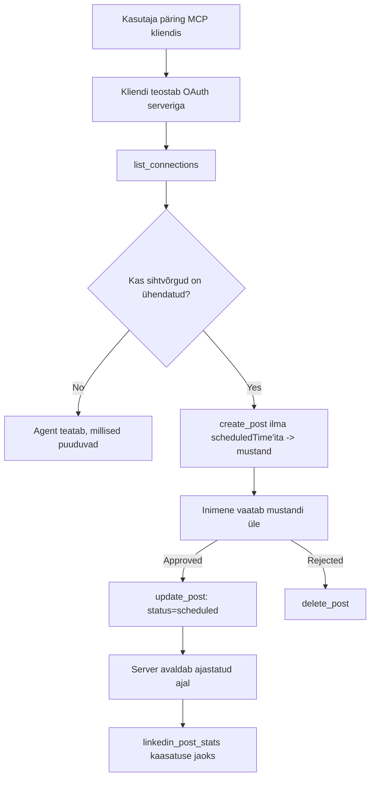

# Juhtumiuuring: avaldamine sotsiaalvõrgustikes agendi ja kaug-MCP-serveri abil

> **Vastutusest loobumine:** Mitmed teenused ja avatud lähtekoodiga projektid suudavad avaldada sotsiaalvõrgustikes ning meeskond võib integreerida ka iga võrgu API-d otse. Järgmine stsenaarium on esitatud kui üks töötav näide sellest, kuidas saab disainida ja kasutada **kirjutamisvõimelist kaug-MCP-serverit**. Publora on kaubanduslik teenus tasuta tasemega; siin kirjeldatud mustrid kehtivad kõigi MCP-serverite kohta, mis teevad kasutaja nimel pöördumatuid toiminguid.

## Ülevaade

Agendid on head sisu koostamisel, kuid kehvad selle edastamisel. Mudel suudab sekunditega kirjutada pressiteate ning siis töö lõppeb: selle avaldamiseks on vaja iga võrgu API-d, iga võrgu OAuth-rakendust ja igal ühel erinevat meediaeskirjade kogumit. Enamik meeskondi lahendab selle, kopeerides teksti käsitsi brauserisse.

See juhtumiuuring vaatleb, kuidas see viimane samm tehakse ühe kaug-MCP-serveri abil ning — kasulikult kõigile, kes serverit ehitavad — milliseid disainivalikuid **kirjutamisvõimeline** server peab õigesti tegema. Andmete lugemine on andestav. Avaldamine mitte: vale tööriista kutsumine on publikule nähtav ja seda ei saa tagasi võtta.

## Stsenaarium

Väike arendajasuhete meeskond koostab postitusi agendi sees (Claude, VS Code, Cursor — klient ei ole oluline). Nad tahavad, et agent:

- näeks, millised sotsiaalkontod on meeskonnal ühendatud,
- koostaks postituse ja hoiaks seda mustandina inimluba ootamas,
- lisaks pildi,
- ajastaks selle mitmesse võrku valitud ajal,
- ja hiljem annaks aru selle tulemusest.

Oluliselt tahavad nad, et agent ei saaks ekslikult avaldada, kuni nad katsetavad.

## Kasutatavad tööriistad

- [Publora MCP Server](https://github.com/publora/mcp-server) — kaug-MCP-server (`streamable-http`), mis pakub avaldamise, ajastamise, meedia ja LinkedIni analüütika tööriistu. Registreeritud ametlikus MCP registris kui `com.publora/mcp-server`.

## Samm-sammult töövoog

1. **Ühenda serveriga.** OAuth-klientidel lõpetatakse volituskoodi protsess PKCE-ga serveri enda lõppkasutaja nõusoleku ekraanil; ilma OAuth-ta kliendid, näiteks käsurea tööriistad, kasutavad Publora API-võtit päises. Mõlemad teed on toetatud ning kumb valitakse, sõltub kliendist, mitte serverist.
2. **Nimeta ühendused.** Agent kutsub `list_connections` ja saab ühendatud kontode identifikaatorid.
3. **Koosta mustand.** Agent kutsub `create_post` *ilma* ajastatud ajata. Postitus salvestatakse mustandina — midagi ei avaldata.
4. **Lisa meedia.** Avalikud pildi URL-id antakse samas kõnes; server laeb need alla ja valideerib.
5. **Ajasta.** Kui inimene kinnitab, seab `update_post` oleku "ajastatud" ISO 8601 ajaga.
6. **Mõõda.** LinkedIni puhul tagastab `linkedin_post_stats` kaasatuse kui postitus on avaldatud.

## Näidiskäsk

```text
Which social accounts do I have connected?
Draft a post announcing our new changelog page, attach the screenshot at
https://example.com/changelog.png, and keep it as a draft — do not publish it.
Once I approve, schedule it to LinkedIn and Bluesky for tomorrow at 09:00 UTC.
```

## Mermaidi vooskeem



## Tehniline rakendus

Järgnevad õppetunnid on selle juhtumiuuringu ülekantav osa.

### Avatud avastamine, autentitud täitmine

`tools/list` on kättesaadav ilma mandaatideta; iga `tools/call` nõuab tokenit ja vastasel juhul tagastab `401` koos `WWW-Authenticate` päisega, mis suunab kaitstud ressursi metaandmetele. (Server vastab ka autentimata `initialize`-le, mis on oluline ainult klientidele protokolliversioonides enne `2026-07-28`; see muudatus eemaldas kogu käepigistuse.)

See jagunemine on praktikas oluline. Registrid, kataloogid ja kliendid saavad tööriistapinna – nimed, skeemid, annotatsioonid – läbi uurida ilma saladust omamata, aga midagi ei saa *täita* anonüümselt. Server, mis nõuab `initialize` jaoks tokenit, on tööriistade jaoks praktiliselt nähtamatu; server, mis lubab anonüümset `tools/call`-i, on riski allikas.

### Registreerimine: dünaamiline kliendiregistreerimine ja selle asendus

Server avaldab `/.well-known/oauth-protected-resource` ja `/.well-known/oauth-authorization-server` ning toetab volituskoodi voogu PKCE (`S256`), värskendustokenit ja **dünaamilist kliendiregistreerimist**.

Dünaamiline registreerimine eemaldab käsitsi sammu: ilma selleta vajab iga klient eelnevalt antud `client_id`-d, mis tähendab iga uue kliendi puhul väljaspool süsteemi päringut müüjale.

Seda tuleks pidada ühilduvuskäitumiseks, mitte kopeeritavaks disainiks. Spetsifikatsiooni `2026-07-28` muudatus deprekeerib dünaamilise kliendiregistreerimise kliendi-ID metaandmedokumentide kasuks, kus klient majutab metaandmed dokumendi stabiilse HTTPS-URL-i all ja see URL *on* `client_id`. DCR töötab veel, kuid täna ehitatav server peaks plaanima CIMD-d ja hoidma DCR-i ainult vanematele klientidele.

### Tööriistade annotatsioonid ei ole kaunistused

Igal tööriistal on `title` ja kohaldatavad vihjed: `readOnlyHint`, `destructiveHint`, `idempotentHint`, `openWorldHint`.

Kaheks põhjuseks nendesse investeerimiseks. Esiteks kasutavad kliendid vihjeid, et otsustada, mida kasutajalt kinnitust küsida — klient võib lugemiseks andmeid automaatselt küsida ja enne kustutamist peatumiseks loa oodata. Spetsifikatsioon täpsustab, et annotatsioonid on ebausaldusväärsed vihjed, mitte autoriseerimismehhanismid: need kujundavad, mida klient pakub teha, aga server ei peatu millelgi nende alusel, server peab omalt poolt reegleid rakendama. Teiseks nõuavad suured pistikprogrammi kataloogid nüüd hinde läbivaatuseks neid; server, mille tööriistadel puuduvad nimed ja vihjed, saadetakse tagasi ükskõik kui hästi see ka ei töötaks.

### Muuda identifikaatorid äraarvamatuks

Platvormi identifikaatorid on opaktsed stringid, mis tagastatakse `list_connections` kaudu ning skeemi kirjeldus ütleb selgelt, et need tuleb täpselt kopeerida ega tohi ära arvata. Server lükkab muu tagasi.

Mudelid on vilunud arvamise tegijad. Kõik kirjutamisvõimelised serverid peaksid eeldama, et identifikaator võib lõpuks olla hallutsinatsioon ja las see tee ebaõnnestub valjult ja varakult, mitte ei tegutse usutava väärtusega.

### Ebaõnnestu enne avaldamist, toimiva sõnumiga

Mõned võrgustikud keelduvad ainult tekstipostitustest ja nõuavad pilti või videot. See valideeritakse siis, kui postitus ajastatakse, ja veateates nimetatakse platvorm ja puuduolev nõue.

Agent saab taastuda veast "Instagram nõuab meediat — lisa pilt või video" ilma uue ringita. Ei saa taastuda üldisest `400` veast.

### Tee taasalustused ohutuks

Kaks sisu loovat tööriista, `create_post` ja `update_post`, aktsepteerivad idempotentsuse võtit: selle taaskasutamine identses päringus kordab algse vastuse, mitte ei loo uut postitust. Agentide tööajad kordavad aegumistel; ilma idempotentsuseta muutub aeglane vastus topeltavalduseks. Teised kirjutamistööriistad — kustutused, meediastepid, LinkedIni reaktsioonid ja kommentaarid — ei võta seda võtme, nii et seal pole taasalustus automaatselt ohutu. Tasub teada, millised sinu endi muutused on kaitstud ja millised mitte.

### Paku võimalus testida, mis ei avalda midagi

Server aktsepteerib reserveeritud sihtpunkti, `publora-playground`, mis valideeritakse ja kinnitatakse nagu tõeline sihtkoht, kuid visatakse siis ära — midagi ei jõua elukontole. See on kirjas tööriista skeemis endas, mida iga klient saab lugeda ilma mandaatideta: `create_post` `platforms` väli kirjeldab seda kui „ühenduse testimise sihtmärk, mis ei vaja tegelikku ühendust — postitus on kinnitatud ja ära visatud, midagi ei avaldata”. Käivita see, pannes selle ainukese kirjena: `platforms: ["publora-playground"]`.

See osutus üheks kõige kasulikumaks detailiks kogu pinnal. Pistikprogrammi kataloogide ülevaatajad, kaasautorid ja CI saavad kogu kirjutamistee lõpuni läbi teha ilma riski reaalsele publikule. Igal MCP-serveril, mis teeb pöördumatuid toiminguid, on kasu dokumenteeritud mitteoperatiivse sihtmärgi olemasolust.

## Tulemused ja mõju

- Avaldamise samm liikus brauserist samasse vestlusesse, kus sisu kirjutatakse, ning mustandi-eelistus hoiab inimese tsüklis sees. Ole täpne, mis see on: mustand on kokkulepe, mitte piir. Sama mandaadiga saab ajastada või avaldada, nii et tõelise kinnituse värav peab toimima väljaspool tööriistapinda — eraldi volitused või serveri ees poliitikakiht.
- Iga võrgu erinevused — meedianõuded, teemad, vastusekontrollid — käsitletakse serveris ühekordselt, mitte iga serveriga suhtleva agendi sees eraldi.
- Sama server teenindab mitut MCP klienti ilma klientide lõikes tööd tegemata, sest avastamine on avatud ja registreerimine dünaamiline.
- Ülaltoodud disaini piirangud töötati välja nii pistikprogrammide kataloogide ülevaatuste kui ka kasutajate poolt: annotatsioonid, OAuth ja ohutu testimiskohad olid igaühe poolt vähemalt üks kord nõutud.

## Viited

- [Publora MCP Server (allikas)](https://github.com/publora/mcp-server)
- [Publora API ja MCP dokumentatsioon](https://docs.publora.com)
- [MCP registri kirje: `com.publora/mcp-server`](https://registry.modelcontextprotocol.io/v0/servers?search=com.publora/mcp-server)
- [MCP spetsifikatsioon — Autoriseerimine](https://modelcontextprotocol.io/specification/draft/basic/authorization)
- [MCP spetsifikatsioon — Tööriistade annotatsioonid](https://modelcontextprotocol.io/docs/concepts/tools)

## Mis järgmiseks

- Võta välja MCP-server, mida ehitad, ja kontrolli kolme odavaimat võitu siin: annotatsioonid igal tööriistal, idempotentsuse võti igal kirjutamisel ja dokumenteeritud mitteoperatiivne sihtkoht.
- Proovi avatud avastuse jagunemist: kutsu `tools/list` avaliku kaugserveri vastu ilma mandaatideta, seejärel kõne tööriistale ja vaata `401` väljakutset.
- Mõtle, mida tähendab sinu valdkonnas “tagasi pööramine”. Avaldamisel on mustandid ja kustutamine; kui sul pole ekvivalenti neile, siis kinnitused peavad olema tööriista disainis, mitte käsus.

---

<!-- CO-OP TRANSLATOR DISCLAIMER START -->
**Lahtiütlus**:
See dokument on tõlgitud kasutades AI tõlketeenust [Co-op Translator](https://github.com/Azure/co-op-translator). Kuigi me püüdleme täpsuse poole, palun pange tähele, et automatiseeritud tõlgetes võib esineda vigu või ebatäpsusi. Originaaldokument selle emakeeles tuleks pidada autoriteetseks allikaks. Olulise teabe puhul soovitatakse kasutada professionaalset inimtõlget. Me ei vastuta selle tõlkega seotud eksimustest või valesti mõistmistest.
<!-- CO-OP TRANSLATOR DISCLAIMER END -->