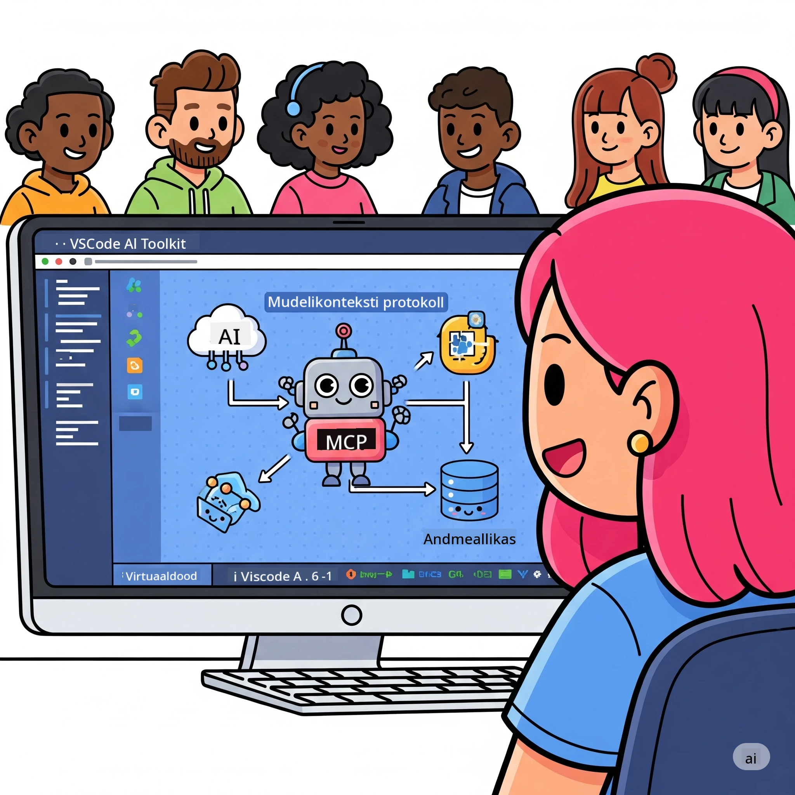
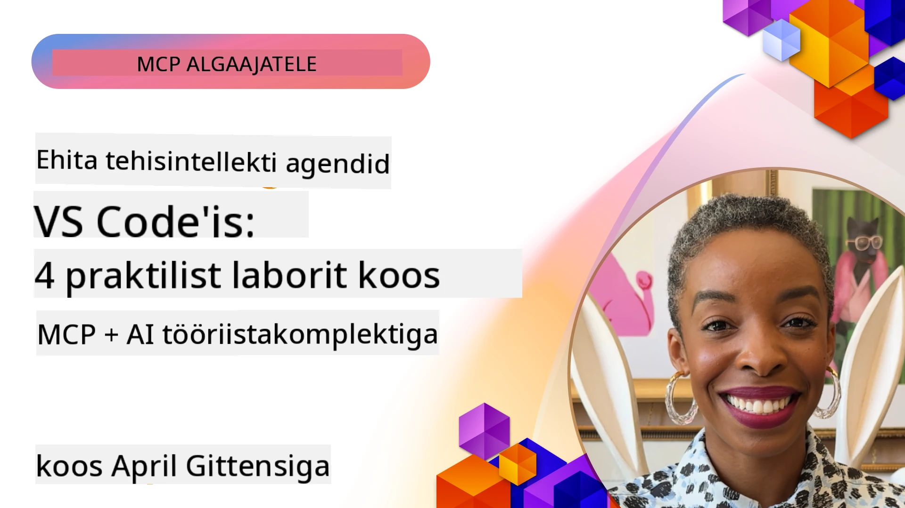

# AI-töövoogude sujuvamaks muutmine: MCP-serveri ehitamine Microsoft Foundry Toolkitiga

## 🎯 Ülevaade

_(Klõpsa ülaloleval pildil, et vaadata selle õppetunni videot)_

Tere tulemast **Model Context Protocol (MCP) töötoase**! See põhjalik praktiline töötuba ühendab kaks tipptasemel tehnoloogiat, et muuta AI-rakenduste arendamine revolutsiooniliseks:

> **Ühilduvuse märkus:** töötoa kood on ehitatud ja testitud MCP
> `2025-11-25` järgi, nagu näitab üleval olev märk. Kasuta
> [kehtivat `2026-07-28` spetsifikatsiooni](https://modelcontextprotocol.io/specification/2026-07-28/)
> uute protokollide rakendamiseks ja tutvu SDK versioonimärkmetega enne
> laborite migreerimist.

- **🔗 Model Context Protocol (MCP)**: Avatud standard sujuvate AI-tööriistade integreerimiseks
- **🛠️ Microsoft Foundry Toolkit Extension VS Code'ile**: Microsofti võimas AI arenduse laiendus

### 🎓 Mida sa õpid

Selle töötoa lõpuks valdad nutikate rakenduste loomise kunsti, mis ühendavad AI mudelid pärismaailma tööriistade ja teenustega. Alates automatiseeritud testimisest kuni kohandatud API integratsioonideni saad praktilised oskused keerukate äriliste väljakutsete lahendamiseks.

## 🏗️ Tehnoloogiline virnastus

### 🔌 Model Context Protocol (MCP)

MCP on **"USB-C AI jaoks"** – universaalne standard, mis ühendab AI mudelid väliste tööriistade ja andmeallikatega.

**✨ Peamised omadused:**

- 🔄 **Standardiseeritud integratsioon**: Universaalne liides AI-tööriistade ühendamiseks
- 🏛️ **Paindlik arhitektuur**: Kohalikud ja kaugserverid stdio/SSE transpordiga
- 🧰 **Rohke ökosüsteem**: Tööriistad, käsud ja ressursid ühes protokollis
- 🔒 **Ettevõttesisene valmidus**: Sisseehitatud turvalisus ja töökindlus

**🎯 Miks MCP on oluline:**
Nii nagu USB-C kõrvaldas kaablisegaduse, kõrvaldab MCP AI integratsioonide keerukuse. Üks protokoll, lõputud võimalused.

### 🤖 Microsoft Foundry Toolkit Extension VS Code'ile

Microsofti lipulaeva AI arenduslaiendus, mis muudab VS Code'i AI jõujaamaks.

**🚀 Põhioskused:**

- 📦 **Mudeliloend**: Juurdepääs mudelitele Azure AI-st, GitHubist, Hugging Face'ist, Ollamast
- ⚡ **Kohalik järeldamine**: ONNX-optimiseeritud CPU/GPU/NPU täitmine
- 🏗️ **Agendi ehitaja**: Visuaalne AI agendi arendus MCP integratsiooniga
- 🎭 **Mitmemodaalne**: Teksti, nägemise ja struktureeritud väljundi tugi

**💡 Arenduse eelised:**

- Nullkonfiguratsiooniga mudelite juurutus
- Visuaalne käsu inseneritöö
- Reaalajas testimise mänguväljak
- Sujuv MCP serveri integratsioon

## 📚 Õppimise teekond

### [🚀 Moodul 1: Microsoft Foundry Toolkit Põhitõed](./lab1/README.md)

**Kestus**: 15 minutit

- 🛠️ Installi ja seadista Microsoft Foundry Toolkit VS Code'i jaoks
- 🗂️ Uuri mudeliloendit (100+ mudelit GitHubist, ONNX-ist, OpenAI-st, Anthropic-ist, Google'st)
- 🎮 Valda interaktiivset mänguväljakut reaalajas mudelitestimiseks
- 🤖 Ehita oma esimene AI agent Agent Builderiga
- 📊 Hinda mudeli jõudlust sisseehitatud mõõdikutega (F1, asjakohasus, sarnasused, sidusus)
- ⚡ Õpi hulgipõhist töötlemist ja mitmemodaalse toe võimalusi

**🎯 Õpitulemus**: Loo funktsionaalne AI agent koos põhjaliku arusaamisega Microsoft Foundry Toolkit võimalustest

### [🌐 Moodul 2: MCP Microsoft Foundry Toolkitiga Põhitõed](./lab2/README.md)

**Kestus**: 20 minutit

- 🧠 Valda Model Context Protocol (MCP) arhitektuuri ja mõisteid
- 🌐 Uuri Microsofti MCP serveri ökosüsteemi
- 🤖 Ehita brauseri automatiseerimise agent Playwright MCP serveri abil
- 🔧 Integreeri MCP serverid Microsoft Foundry Toolkit Agent Builderisse
- 📊 Seadista ja testi MCP tööriistu oma agentides
- 🚀 Eksporti ja juuruta MCP jõul töötavaid agente tootmiskeskkonnas

**🎯 Õpitulemus**: Juuruta AI agent, mida toetavad välised tööriistad MCP kaudu

### [🔧 Moodul 3: Täiustatud MCP Arendus Microsoft Foundry Toolkitiga](./lab3/README.md)

**Kestus**: 20 minutit

- 💻 Loo kohandatud MCP servereid Microsoft Foundry Toolkitiga
- 🐍 Sea sisse ja kasuta uusimat MCP Python SDK-d (v1.9.3)
- 🔍 Sea üles ja kasuta MCP Inspectorit silumiseks
- 🛠️ Ehita Ilmateate MCP server professionaalse silumisprotsessiga
- 🧪 Silu MCP servereid nii Agent Builderis kui Inspectoris

**🎯 Õpitulemus**: Arenda ja silu kohandatud MCP servereid kaasaegsete tööriistadega

### [🐙 Moodul 4: Praktiline MCP Arendus - Kohandatud GitHubi kloonimise server](./lab4/README.md)

**Kestus**: 30 minutit

- 🏗️ Ehita pärismaailma GitHubi klooni MCP server arendusprotsesside jaoks
- 🔄 Rakenda nutikat repositooriumi kloonimist valideerimise ja vigade käsitlemisega
- 📁 Loo nutikas kataloogihaldus ja VS Code integreerimine
- 🤖 Kasuta GitHub Copilot agentimoodi kohandatud MCP tööriistadega
- 🛡️ Rakenda tootmisvalmis töökindlust ja platvormideülest ühilduvust

**🎯 Õpitulemus**: Juuruta tootmisvalmis MCP server, mis sujuvamaks muudab päris arendusvooge

## 💡 Pärismaailma rakendused ja mõju

### 🏢 Ettevõtete kasutusjuhtumid

#### 🔄 DevOps automatiseerimine

Muuda oma arendusvoog nutika automatiseerimisega:

- **Nutikas repositooriumihaldus**: AI-põhine koodi ülevaatus ja liitmise otsused
- **Intelligentne CI/CD**: Automatiseeritud torujuhtme optimeerimine koodimuudatuste alusel
- **Probleemide triaaž**: Automaatne vigade klassifitseerimine ja määramine

#### 🧪 Kvaliteedi tagamise revolutsioon

Tõsta testimise taset AI-automaatikaga:

- **Intelligentne testi genereerimine**: Loo automaatselt põhjalikke testikomplekte
- **Visuaalne regressiooni testimine**: AI-põhine kasutajaliidese muutuste tuvastus
- **Jõudluse jälgimine**: Proaktiivne probleemide avastamine ja lahendamine

#### 📊 Andmevoo intelligentsus

Ehita targemaid andmetöötluse töövooge:

- **Adaptiivsed ETL protsessid**: Iseoptimeeruvad andmetransformatsioonid
- **Anomaaliate tuvastamine**: Reaalajas andmekvaliteedi jälgimine
- **Intelligentne suunamine**: Nutikas andmevoo haldus

#### 🎧 Kliendikogemuse parandamine

Loo erakordsed kliendisuhted:

- **Kontekstitundlik tugi**: AI agendid kliendiajaloo ligipääsuga
- **Proaktiivne probleemide lahendus**: Ennustav klienditeenindus
- **Mitmekanaliline integreerimine**: Ühtne AI kogemus eri platvormidel

## 🛠️ Eeltingimused ja seadistamine

### 💻 Süsteeminõuded

| Komponent | Nõue | Märkused |
|-----------|-------------|-------|
| **Operatsioonisüsteem** | Windows 10+, macOS 10.15+, Linux | Iga kaasaegne OS |
| **Visual Studio Code** | Viimane stabiilne versioon | Nõutav Microsoft Foundry Toolkit jaoks |
| **Node.js** | v18.0+ ja npm | MCP serveri arendamiseks |
| **Python** | 3.10+ | Valikuline Python MCP serverite jaoks |
| **Mälu** | Vähemalt 8GB RAM | 16GB soovitatav kohalike mudelite jaoks |

### 🔧 Arenduskeskkond

#### Soovitatavad VS Code laiendused

- **Microsoft Foundry Toolkit** (ms-windows-ai-studio.windows-ai-studio)
- **Python** (ms-python.python)
- **Python Debugger** (ms-python.debugpy)
- **GitHub Copilot** (GitHub.copilot) - Valikuline, aga kasulik

#### Valikuliselt tööriistad

- **uv**: Moodne Python pakettide haldur
- **MCP Inspector**: Visuaalne silumisvahend MCP serveritele
- **Playwright**: Veebiautomaatika näidete jaoks

## 🎖️ Õpitulemused ja sertifitseerimisrada

### 🏆 Oskuste valdamise kontrollnimekiri

Selle töötoa lõpetamisel valdad:

#### 🎯 Tuumikkompetentsid

- [ ] **MCP protokolli valdamine**: Sügav arhitektuuri ja rakenduse mustrite mõistmine
- [ ] **Microsoft Foundry Toolkit oskus**: Eksperttase Microsoft Foundry Toolkitiga kiireks arenduseks
- [ ] **Kohandatud serveri arendus**: Tootmisserverite loomine, juurutamine ja haldus MCP jaoks
- [ ] **Tööriistade integreerimise tipptase**: Sujuv AI ühendamine olemasolevate arendusvoogudega
- [ ] **Probleemide lahendamise rakendus**: Õpitud oskuste rakendamine ärilistele väljakutsetele

#### 🔧 Tehnilised oskused

- [ ] Microsoft Foundry Toolkiti seadistamine ja konfigureerimine VS Code'is
- [ ] Kohandatud MCP serverite projekteerimine ja rakendamine
- [ ] GitHub mudelite integreerimine MCP arhitektuuriga
- [ ] Automatiseeritud testimisvoogude loomine Playwrightiga
- [ ] AI agentide juurutamine tootmiskeskkonnas
- [ ] MCP serveri jõudluse silumine ja optimeerimine

#### 🚀 Edasijõudnud võimed

- [ ] Ettevõtteulatuslike AI integratsioonide arhitektuuri loomine
- [ ] AI rakenduste turvapraktikate rakendamine
- [ ] Skaleeritavate MCP serveri arhitektuuride projekteerimine
- [ ] Spetsiifiliste domeenide jaoks kohandatud tööriistade ketid
- [ ] Juhendada teisi AI-põhise arenduse alal

## 📖 Lisamaterjalid

- [MCP spetsifikatsioon (2026-07-28)](https://modelcontextprotocol.io/specification/2026-07-28/)
- [Microsoft Foundry Toolkit GitHubi hoidla](https://github.com/microsoft/vscode-ai-toolkit)
- [MCP serverite näidiskogu](https://github.com/modelcontextprotocol/servers)
- [Parimate praktikate juhend](https://modelcontextprotocol.io/docs/best-practices)
- [OWASP MCP Top 10](https://microsoft.github.io/mcp-azure-security-guide/mcp/) - turvalisuse parimad tavad

---

**🚀 Oled valmis oma AI arendusvoo revolutsiooniliseks muutmiseks?**

Loome koos tuleviku intelligentseid rakendusi MCP ja Microsoft Foundry Toolkitiga!

## Mis saab edasi

Jätka: [Moodul 11: MCP serveri praktilised laborid](../11-MCPServerHandsOnLabs/README.md)

---

<!-- CO-OP TRANSLATOR DISCLAIMER START -->
**Lahtiütlus**:
See dokument on tõlgitud kasutades AI tõlketeenust [Co-op Translator](https://github.com/Azure/co-op-translator). Kuigi me püüdleme täpsuse poole, palun pange tähele, et automatiseeritud tõlgetes võib esineda vigu või ebatäpsusi. Originaaldokument selle emakeeles tuleks pidada autoriteetseks allikaks. Olulise teabe puhul soovitatakse kasutada professionaalset inimtõlget. Me ei vastuta selle tõlkega seotud eksimustest või valesti mõistmistest.
<!-- CO-OP TRANSLATOR DISCLAIMER END -->