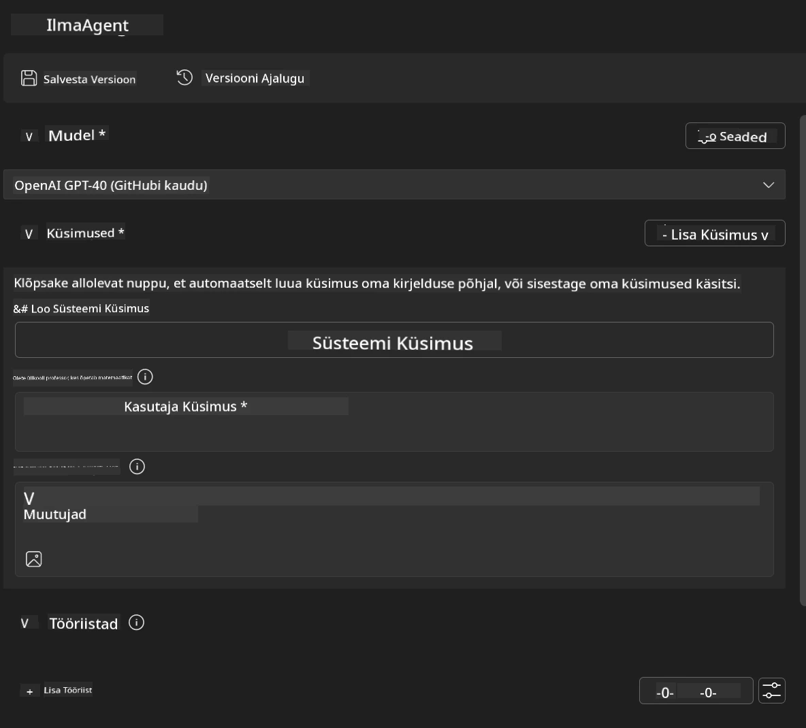
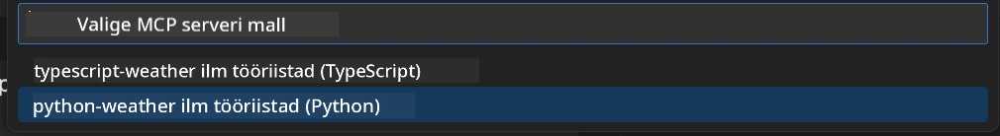
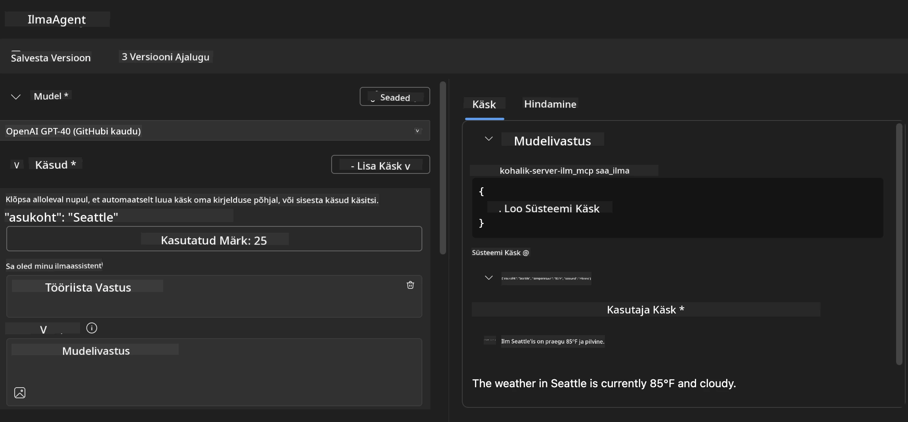
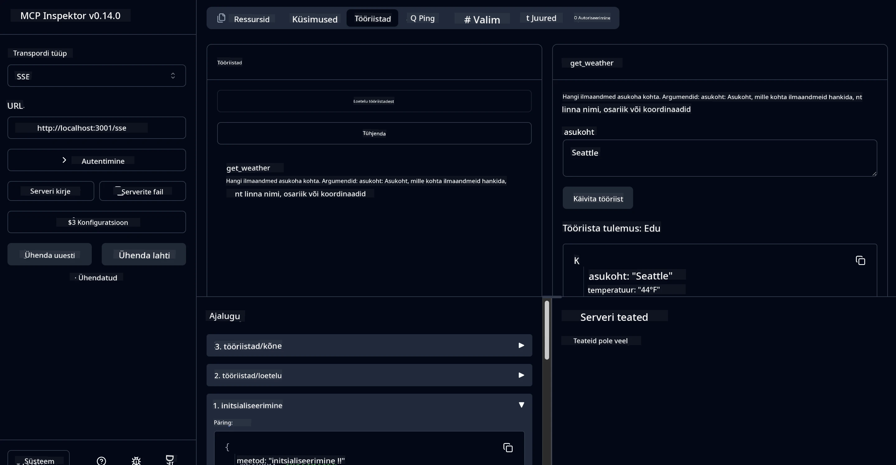

# 🔧 Moodul 3: Täiustatud MCP arendus Microsoft Foundry Tööriistakomplektiga

> [!NOTE]
> Selle labori Inspector URL-id kasutavad pärandunud `/sse` lõpp-punkti ja sihivad
> fikseeritud MCP SDK `1.9.3` ja Inspector `0.14.0` sõltuvusi. Need ei ole
> praegused `2026-07-28` Streamable HTTP näited.


## 🎯 Õpieesmärgid

Selle töötoa lõpuks suudate:

- ✅ Luua kohandatud MCP servereid Microsoft Foundry Tööriistakomplekti abil
- ✅ Konfigureerida ja kasutada uusimat MCP Python SDK-t (v1.9.3)
- ✅ Seadistada ja kasutada MCP Inspectorit silumiseks
- ✅ Siluda MCP servereid nii Agent Builderis kui Inspectoris
- ✅ Mõista täiustatud MCP serveri arenduse töövooge

## 📋 Eelteadmised

- 2. labori (MCP alused) lõpetamine
- VS Code koos Microsoft Foundry Tööriistakomplekti laiendusega
- Python 3.10+ keskkond
- Node.js ja npm Inspectori paigaldamiseks

## 🏗️ Mida ehitate

Selles töös loote **Ilma MCP serveri**, mis demonstreerib:
- Kohandatud MCP serveri rakendust
- Integratsiooni Microsoft Foundry Tööriistakomplekti Agent Builderiga
- Professionaalseid silumisprotsesse
- Moodsaid MCP SDK kasutusmustreid

---

## 🔧 Põhikompontentide ülevaade

### 🐍 MCP Python SDK
Model Context Protocol Python SDK annab aluse kohandatud MCP serverite ehitamiseks. Kasutate versiooni 1.9.3 koos täiustatud silumisvõimalustega.

### 🔍 MCP Inspector
Võimas silumistööriist, mis pakub:
- Reaalajas serveri jälgimist
- Tööriistade käivitamise visualiseerimist
- Võrgu päringute/vastuste kontrolli
- Interaktiivset testikeskkonda

---

## 📖 Samm-sammuline juhend

### Samm 1: Loo WeatherAgent Agent Builderis

1. **Käivita Agent Builder** VS Codes Microsoft Foundry Tööriistakomplekti laienduse kaudu
2. **Loo uus agent** järgmise konfiguratsiooniga:
   - Agendi nimi: `WeatherAgent`



### Samm 2: Initsialiseeri MCP serveri projekt

1. **Mine Tools** → **Add Tool** Agent Builderis
2. **Vali "MCP Server"** saadaolevate valikute seast
3. **Vali "Create A new MCP Server"**
4. **Vali mall `python-weather`**
5. **Nimeta oma server:** `weather_mcp`



### Samm 3: Ava ja administreeri projekti

1. **Ava genereeritud projekt** VS Codes
2. **Vaata üle projekti struktuur:**
   ```
   weather_mcp/
   ├── src/
   │   ├── __init__.py
   │   └── server.py
   ├── inspector/
   │   ├── package.json
   │   └── package-lock.json
   ├── .vscode/
   │   ├── launch.json
   │   └── tasks.json
   ├── pyproject.toml
   └── README.md
   ```

### Samm 4: Uuenda uusimale MCP SDK-le

> **🔍 Miks uuendada?** Tahame kasutada uusimat MCP SDK-d (v1.9.3) ja Inspector teenust (0.14.0), mis pakuvad rohkem funktsioone ja paremat silumist.

#### 4a. Uuenda Python sõltuvused

**Muuda `pyproject.toml`:** uuenda [./code/weather_mcp/pyproject.toml](../../../../10-StreamliningAIWorkflowsBuildingAnMCPServerWithAIToolkit/lab3/code/weather_mcp/pyproject.toml)


#### 4b. Uuenda Inspector konfiguratsiooni

**Muuda `inspector/package.json`:** uuenda [./code/weather_mcp/inspector/package.json](../../../../10-StreamliningAIWorkflowsBuildingAnMCPServerWithAIToolkit/lab3/code/weather_mcp/inspector/package.json)

#### 4c. Uuenda Inspector sõltuvused

**Muuda `inspector/package-lock.json`:** uuenda [./code/weather_mcp/inspector/package-lock.json](../../../../10-StreamliningAIWorkflowsBuildingAnMCPServerWithAIToolkit/lab3/code/weather_mcp/inspector/package-lock.json)

> **📝 Märkus:** See fail sisaldab laialdasi sõltuvuste määratlusi. Allpool on põhistruktuur - täielik sisu tagab nõuetekohase sõltuvuste lahendamise.


> **⚡ Täielik Package Lock:** Täielik package-lock.json sisaldab umbes 3000 rida sõltuvuste määratlusi. Ülal näidatud põhistruktuur - kasuta antud faili täielikuks sõltuvuste lahendamiseks.

### Samm 5: Konfigureeri VS Code silumine

*Märkus: Palun kopeeri fail määratud teele, et asendada vastav kohalik fail*

#### 5a. Uuenda Launch konfiguratsiooni

**Muuda `.vscode/launch.json`:**

```json
{
  "version": "0.2.0",
  "configurations": [
    {
      "name": "Attach to Local MCP",
      "type": "debugpy",
      "request": "attach",
      "connect": {
        "host": "localhost",
        "port": 5678
      },
      "presentation": {
        "hidden": true
      },
      "internalConsoleOptions": "neverOpen",
      "postDebugTask": "Terminate All Tasks"
    },
    {
      "name": "Launch Inspector (Edge)",
      "type": "msedge",
      "request": "launch",
      "url": "http://localhost:6274?timeout=60000&serverUrl=http://localhost:3001/sse#tools",
      "cascadeTerminateToConfigurations": [
        "Attach to Local MCP"
      ],
      "presentation": {
        "hidden": true
      },
      "internalConsoleOptions": "neverOpen"
    },
    {
      "name": "Launch Inspector (Chrome)",
      "type": "chrome",
      "request": "launch",
      "url": "http://localhost:6274?timeout=60000&serverUrl=http://localhost:3001/sse#tools",
      "cascadeTerminateToConfigurations": [
        "Attach to Local MCP"
      ],
      "presentation": {
        "hidden": true
      },
      "internalConsoleOptions": "neverOpen"
    }
  ],
  "compounds": [
    {
      "name": "Debug in Agent Builder",
      "configurations": [
        "Attach to Local MCP"
      ],
      "preLaunchTask": "Open Agent Builder",
    },
    {
      "name": "Debug in Inspector (Edge)",
      "configurations": [
        "Launch Inspector (Edge)",
        "Attach to Local MCP"
      ],
      "preLaunchTask": "Start MCP Inspector",
      "stopAll": true
    },
    {
      "name": "Debug in Inspector (Chrome)",
      "configurations": [
        "Launch Inspector (Chrome)",
        "Attach to Local MCP"
      ],
      "preLaunchTask": "Start MCP Inspector",
      "stopAll": true
    }
  ]
}
```

**Muuda `.vscode/tasks.json`:**

```
{
  "version": "2.0.0",
  "tasks": [
    {
      "label": "Start MCP Server",
      "type": "shell",
      "command": "python -m debugpy --listen 127.0.0.1:5678 src/__init__.py sse",
      "isBackground": true,
      "options": {
        "cwd": "${workspaceFolder}",
        "env": {
          "PORT": "3001"
        }
      },
      "problemMatcher": {
        "pattern": [
          {
            "regexp": "^.*$",
            "file": 0,
            "location": 1,
            "message": 2
          }
        ],
        "background": {
          "activeOnStart": true,
          "beginsPattern": ".*",
          "endsPattern": "Application startup complete|running"
        }
      }
    },
    {
      "label": "Start MCP Inspector",
      "type": "shell",
      "command": "npm run dev:inspector",
      "isBackground": true,
      "options": {
        "cwd": "${workspaceFolder}/inspector",
        "env": {
          "CLIENT_PORT": "6274",
          "SERVER_PORT": "6277",
        }
      },
      "problemMatcher": {
        "pattern": [
          {
            "regexp": "^.*$",
            "file": 0,
            "location": 1,
            "message": 2
          }
        ],
        "background": {
          "activeOnStart": true,
          "beginsPattern": "Starting MCP inspector",
          "endsPattern": "Proxy server listening on port"
        }
      },
      "dependsOn": [
        "Start MCP Server"
      ]
    },
    {
      "label": "Open Agent Builder",
      "type": "shell",
      "command": "echo ${input:openAgentBuilder}",
      "presentation": {
        "reveal": "never"
      },
      "dependsOn": [
        "Start MCP Server"
      ],
    },
    {
      "label": "Terminate All Tasks",
      "command": "echo ${input:terminate}",
      "type": "shell",
      "problemMatcher": []
    }
  ],
  "inputs": [
    {
      "id": "openAgentBuilder",
      "type": "command",
      "command": "ai-mlstudio.agentBuilder",
      "args": {
        "initialMCPs": [ "local-server-weather_mcp" ],
        "triggeredFrom": "vsc-tasks"
      }
    },
    {
      "id": "terminate",
      "type": "command",
      "command": "workbench.action.tasks.terminate",
      "args": "terminateAll"
    }
  ]
}
```


---

## 🚀 MCP serveri käivitamine ja testimine

### Samm 6: Sõltuvuste paigaldamine

Pärast konfiguratsiooni muudatusi käivitage järgmised käsud:

**Paigalda Python sõltuvused:**
```bash
uv sync
```

**Paigalda Inspector sõltuvused:**
```bash
cd inspector
npm install
```

### Samm 7: Silumine Agent Builderis

1. **Vajuta F5** või kasuta **"Debug in Agent Builder"** konfiguratsiooni
2. **Vali debug-paneelist koosnev konfiguratsioon**
3. **Oota serveri käivitumist** ja Agent Builderi avanemist
4. **Testi oma ilma MCP serverit** loomuliku keele päringutega

Sisendi prompt nagu allpool

SYSTEM_PROMPT

```
You are my weather assistant
```

USER_PROMPT

```
How's the weather like in Seattle
```



### Samm 8: Silumine MCP Inspectoris

1. **Kasuta "Debug in Inspector"** konfiguratsiooni (Edge või Chrome)
2. **Ava Inspector liides** aadressil `http://localhost:6274`
3. **Uuri interaktiivset testikeskkonda:**
   - Vaata saadaolevaid tööriistu
   - Testi tööriistade käivitamist
   - Jälgi võrgupäringuid
   - Silu serveri vastuseid



---

## 🎯 Peamised õpitulemused

Selle töötoa lõpetamisega oled:

- [x] **Kohanud kohandatud MCP serveri** Microsoft Foundry Tööriistakomplekti mallide abil
- [x] **Uuendanud uusimale MCP SDK-le** (v1.9.3) paremate funktsioonide jaoks
- [x] **Konfigureerinud professionaalsed silumisprotsessid** nii Agent Builderis kui Inspectoris
- [x] **Seadistanud MCP Inspectori** interaktiivseks serveri testimiseks
- [x] **Õppinud masterdama VS Code silumiskonfiguratsioone** MCP arenduseks

## 🔧 Täiustatud omadused, mida uuriti

| Omadus | Kirjeldus | Kasutusjuhtum |
|---------|-------------|----------|
| **MCP Python SDK v1.9.3** | Viimase protokolli rakendus | Moodne serveriarendus |
| **MCP Inspector 0.14.0** | Interaktiivne silumistööriist | Reaalajas serveri testimine |
| **VS Code silumine** | Integreeritud arenduskeskkond | Professionaalne silumisvoog |
| **Agent Builderi integratsioon** | Otsene Microsoft Foundry Tööriistakomplekti ühendus | Täislahenduse agendi testimine |

## 📚 Täiendavad ressursid

- [MCP Python SDK dokumentatsioon](https://modelcontextprotocol.io/docs/sdk/python)
- [Microsoft Foundry Tööriistakomplekti juhend](https://code.visualstudio.com/docs/ai/ai-toolkit)
- [VS Code silumise dokumentatsioon](https://code.visualstudio.com/docs/editor/debugging)
- [Model Context Protocol spetsifikatsioon](https://modelcontextprotocol.io/docs/concepts/architecture)

---

**🎉 Palju õnne!** Oled edukalt lõpetanud 3. labori ja saad nüüd luua, siluda ja juurutada kohandatud MCP servereid professionaalsete arendustöövoogude abil.

### 🔜 Jätka järgmisse moodulisse

Kas oled valmis rakendama oma MCP oskusi pärismaailma arendustöövoos? Jätka **[Moodul 4: Praktiline MCP arendus - Kohandatud GitHubi klooni server](../lab4/README.md)**, kus sa:
- Ehitate tootmisvalmis MCP serveri, mis automatiseerib GitHubi reposi haldamise ülesandeid
- Rakendad GitHubi reposi kloonimise funktsionaalsust MCP kaudu
- Integreerid kohandatud MCP serverid VS Code ja GitHub Copilot Agent režiimiga
- Testid ja juurutad kohandatud MCP servereid tootmiskeskkondades
- Õpid praktilisi töövoo automatiseerimise meetodeid arendajatele

---

<!-- CO-OP TRANSLATOR DISCLAIMER START -->
**Lahtiütlus**:
See dokument on tõlgitud kasutades AI tõlketeenust [Co-op Translator](https://github.com/Azure/co-op-translator). Kuigi me püüdleme täpsuse poole, palun pange tähele, et automatiseeritud tõlgetes võib esineda vigu või ebatäpsusi. Originaaldokument selle emakeeles tuleks pidada autoriteetseks allikaks. Olulise teabe puhul soovitatakse kasutada professionaalset inimtõlget. Me ei vastuta selle tõlkega seotud eksimustest või valesti mõistmistest.
<!-- CO-OP TRANSLATOR DISCLAIMER END -->