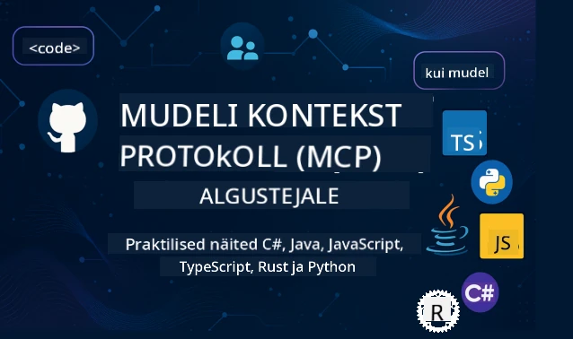

 

[](https://GitHub.com/microsoft/mcp-for-beginners/graphs/contributors)
[](https://GitHub.com/microsoft/mcp-for-beginners/issues)
[](https://GitHub.com/microsoft/mcp-for-beginners/pulls)
[](http://makeapullrequest.com)

[](https://GitHub.com/microsoft/mcp-for-beginners/watchers)
[](https://GitHub.com/microsoft/mcp-for-beginners/fork)
[](https://GitHub.com/microsoft/mcp-for-beginners/stargazers)


[](https://discord.gg/nTYy5BXMWG)

Järgige neid samme, et alustada nende ressursside kasutamist:
1. **Kahvli tegemine**: Klõpsake [](https://GitHub.com/microsoft/mcp-for-beginners/fork)
2. **Reaally repo kloonimine**:   `git clone https://github.com/microsoft/mcp-for-beginners.git`
3. **Liituge** [](https://discord.gg/nTYy5BXMWG)


### 🌐 Mitmekeelne tugi

#### Toetatud GitHub Actioni kaudu (automatiseeritud ja alati värske)

<!-- CO-OP TRANSLATOR LANGUAGES TABLE START -->
[Araabia](../ar/README.md) | [Bengali](../bn/README.md) | [Bulgaaria](../bg/README.md) | [Burma (Myanmar)](../my/README.md) | [Hiina (lihtsustatud)](../zh-CN/README.md) | [Hiina (traditsiooniline, Hongkong)](../zh-HK/README.md) | [Hiina (traditsiooniline, Macao)](../zh-MO/README.md) | [Hiina (traditsiooniline, Taiwan)](../zh-TW/README.md) | [Horvaadi](../hr/README.md) | [Tšehhi](../cs/README.md) | [Taani](../da/README.md) | [Hollandi](../nl/README.md) | [Eesti](./README.md) | [Soome](../fi/README.md) | [Prantsuse](../fr/README.md) | [Saksa](../de/README.md) | [Kreeka](../el/README.md) | [Heebrea](../he/README.md) | [Hindi](../hi/README.md) | [Ungari](../hu/README.md) | [Indoneesia](../id/README.md) | [Itaalia](../it/README.md) | [Jaapani](../ja/README.md) | [Kannada](../kn/README.md) | [Korea](../ko/README.md) | [Leedu](../lt/README.md) | [Malai](../ms/README.md) | [Malajalami](../ml/README.md) | [Marathi](../mr/README.md) | [Nepali](../ne/README.md) | [Nigeeria pidžin](../pcm/README.md) | [Norra](../no/README.md) | [Pärsia (Farsi)](../fa/README.md) | [Poola](../pl/README.md) | [Portugali (Brasiilia)](../pt-BR/README.md) | [Portugali (Portugal)](../pt-PT/README.md) | [Pandžabi (Gurmukhi)](../pa/README.md) | [Rumeenia](../ro/README.md) | [Vene](../ru/README.md) | [Serbia (kirillitsa)](../sr/README.md) | [Slovaki](../sk/README.md) | [Sloveeni](../sl/README.md) | [Hispaania](../es/README.md) | [Suahiili](../sw/README.md) | [Rootsi](../sv/README.md) | [Tagalogi (Filipino)](../tl/README.md) | [Tamili](../ta/README.md) | [Telugu](../te/README.md) | [Tai](../th/README.md) | [Türgi](../tr/README.md) | [Ukraina](../uk/README.md) | [Urdu](../ur/README.md) | [Vietnami](../vi/README.md)

> **Eelistate kloonimist lokaalselt?**

> See hoidla sisaldab üle 50 keele tõlke, mis suurendab oluliselt allalaadimise suurust. Tõlgete ilma kloonimiseks kasutage sparsilist kontrolli:
> ```bash
> git clone --filter=blob:none --sparse https://github.com/microsoft/mcp-for-beginners.git
> cd mcp-for-beginners
> git sparse-checkout set --no-cone '/*' '!translations' '!translated_images'
> ```
> See annab teile kõik, mida vajate kursuse läbimiseks, kuid palju kiirema allalaadimisega.
<!-- CO-OP TRANSLATOR LANGUAGES TABLE END -->

# 🚀 Mudeli konteksti protokolli (MCP) õppekava algajatele

## **Õppige MCP-d praktiliste koodi näidete abil C#, Java, JavaScripti, Rusti, Pythoni ja TypeScripti keeltes**

## 🧠 Mudeli konteksti protokolli õppekava ülevaade
Tere tulemast oma teekonnale Mudeli konteksti protokolli maailma! Kui olete kunagi mõelnud, kuidas tehisintellekti rakendused suhtlevad erinevate tööriistade ja teenustega, olete nüüd avastamas elegantset lahendust, mis muudab arendajate viisi, kuidas nad loovad intelligentseid süsteeme.

Mõelge MCP-le kui universaalsele tõlkijale tehisintellekti rakenduste jaoks – täpselt nagu USB-pordid võimaldavad ühendada mis tahes seadme arvutiga, võimaldab MCP tehisintellekti mudelitel suhelda mis tahes tööriista või teenusega standardiseeritud viisil. Olgu teil tegemist esimese vestlusroboti loomisega või keerukate tehisintellekti töövoogude ehitamisega, MCP mõistmine annab teile võimaluse luua võimsamaid ja paindlikumaid rakendusi.

See õppekava on loodud kannatlikkuse ja hoolivusega teie õppimise toetamiseks. Alustame lihtsate kontseptidega, mida te juba mõistate, ja kasvatame järk-järgult teie oskusi praktilise praktika abil teie lemmikprogramme keeles. Iga samm sisaldab selgeid selgitusi, praktilisi näiteid ja palju julgustust teekonna ajal.

Kui olete selle teekonna läbinud, on teil enesekindlus ehitada oma MCP-servereid, integreerida neid populaarsete tehisintellekti platvormidega ning mõista, kuidas see tehnoloogia muudab tehisintellekti arendamise tulevikku. Alustame seda põnevat seiklust koos!

### Ametlik dokumentatsioon ja spetsifikatsioonid

Need ressursid muutuvad väärtuslikumaks, kui teie arusaamine kasvab, kuid ärge tunnege survet kõike kohe lugeda. Alustage teemadest, mis teid enim huvitavad!
- 📘 [MCP dokumentatsioon](https://modelcontextprotocol.io/) – See on teie samm-sammult juhendite ja kasutusjuhendite peamine allikas. Dokumentatsioon on kirjutatud algajatele arusaadavalt, pakkudes selgeid näiteid, mida saate oma tempos järgida.
- 📜 [MCP spetsifikatsioon](https://modelcontextprotocol.io/docs/) – Mõelge sellele kui teie põhjalikule viitamisjuhendile. Õppekava käigus leiate, et pöördute tagasi siia, et otsida konkreetseid üksikasju ja uurida edasijõudnud funktsioone.
- 📜 [Originaalne MCP spetsifikatsioon](https://modelcontextprotocol.io/specification/versioning) – See sisaldab täiendavaid tehnilisi üksikasju, mis võivad olla kasulikud edasijõudnutele rakenduste loomiseks. See on olemas siis, kui vajate, kuid ärge muretsege selle pärast, kui alustate.
- 🧑‍💻 [MCP GitHubi hoidla](https://github.com/modelcontextprotocol) – Siit leiate SDK-d, tööriistad ja koodinäited mitmetes programmeerimiskeeltes. See on nagu aardelaegas praktilistest näidetest ja kasutusvalmis komponentidest.
- 🌐 [MCP kogukond](https://github.com/orgs/modelcontextprotocol/discussions) – Liituge teiste õppijate ja kogenud arendajatega MCP teemalistel aruteludel. See on toetav kogukond, kus küsimused on teretulnud ja teadmisi jagatakse vabalt.
  
## Õpieesmärgid

Selle õppekava lõpuks tunnete end kindla ja põnevana oma uute oskuste osas. Siin on, mida saavutate:

• **Mõistke MCP põhialuseid**: Saate aru, mis on Mudeli konteksti protokoll ja miks see muudab õhku, kuidas tehisintellekti rakendused töötavad koos, kasutades analoogiaid ja näiteid, mis seda selgitavad.

• **Looge oma esimene MCP server**: Loote toimiva MCP-serveri oma eelistatud programmeerimiskeeles, alustades lihtsatest näidetest ja kasvatades oskusi samm-sammult.

• **Ühendage AI-mudelid päristööriistadega**: Õpite, kuidas sillutada lõhet AI mudelite ja tegelike teenuste vahel, andes oma rakendustele võimsad uued võimekused.

• **Rakendage turvalisuse parimaid tavasid**: Saate aru, kuidas hoida oma MCP-rakendusi turvalisena, kaitstes nii oma rakendusi kui ka kasutajaid.

• **Juhtige juurutamist enesekindlalt**: Teate, kuidas viia oma MCP-projektid arendusest tootmisesse, praktiliste juurutamisstrateegiatega, mis töötavad pärismaailmas.

• **Liituge MCP kogukonnaga**: Saate osaks kasvavast arendajate kogukonnast, kes kujundavad tehisintellekti rakenduste arendamise tulevikku. 

## Oluline taust

Enne kui sukeldume MCP üksikasjadesse, veendume, et tunnete end mugavalt mõne põhimõistega. Ärge muretsege, kui te pole nendes valdkondades ekspert – me selgitame kõike, mida peate teadma, samal ajal kui õpite!

### Protokollide mõistmine (Alus)

Mõelge protokollile kui reeglitele vestluses. Kui helistate sõbrale, te mõlemad teate, et tuleb öelda "tere", kui vastate, rääkida kordamööda ja öelda "head aega", kui vestlus lõpeb. Arvutiprogrammid vajavad sarnaseid reegleid tõhusaks suhtlemiseks.

MCP on protokoll – lepitakse kokku reeglite kogumis, mis aitavad tehisintellekti mudelitel ja rakendustel pidada viljakaid "vestlusi" tööriistade ja teenustega. Nii nagu vestlusreeglid muudavad inimeste kommunikatsiooni sujuvamaks, teeb MCP AI-rakenduste kommunikatsiooni palju usaldusväärsemaks ja võimsamaks.

### Kliendi ja serveri suhe (Kuidas programmid töötavad koos)

Te kasutate kliendi-serveri suhteid iga päev! Kui kasutate veebibrauserit (klient) veebisaidi külastamiseks, ühendate end veebiserveriga, mis saadab teile lehe sisu. Brauser teab, kuidas teavet pärida, ja server teab, kuidas vastata.

MCP-s on meil sarnane suhe: tehisintellekti mudelid toimivad klientidena, kes pärivad teavet või tegevusi, MCP-serverid aga pakuvad neid võimeid. See on nagu abivalmis assistent (server), keda AI võib paluda konkreetseid ülesandeid teha.

### Miks standardiseerimine on oluline (Asjade ühilduvuse tagamine)

Kujutage ette, kui iga autotootja kasutaks erinevate kujude bensiinipumpasid – peate iga auto jaoks hankima erineva adapteri! Standardiseerimine tähendab kokkulepet ühtsetes lähenemistes, et asjad töötaksid sujuvalt koos.

MCP tagab selle standardiseerimise AI-rakendustele. Selle asemel, et iga AI mudel vajaks kohandatud koodi iga tööriistaga töötamiseks, loob MCP universaalse vestlusviisi. See tähendab, et arendajad saavad ehitada tööriistu ühekordselt ja lasta neil töötada paljude erinevate AI süsteemidega.

## 🧭 Teie õppeteekonna ülevaade

Teie MCP teekond on hoolikalt üles ehitatud, et järk-järgult suurendada teie enesekindlust ja oskusi. Iga etapp tutvustab uusi kontseptsioone, tugevdades samal ajal juba õpitud teadmisi.

### 🌱 Alusfaas: Põhitõdede mõistmine (Moodulid 0-2)

Siit algab teie seiklus! Tutvustame teile MCP kontseptsioone tuttavate analoogiate ja lihtsate näidete abil. Mõistate, mis on MCP, miks see eksisteerib ja kuidas see sobitub tehisintellekti arendamise laiemasse maailma.

• **Moodul 0 - Sissejuhatus MCP-sse**: Alustame MCP mõistest ja sellest, miks see on tänapäevaste tehisintellekti rakenduste jaoks nii oluline. Näitame MCP reaalelulisi näiteid ja mõistate, kuidas see lahendab arendajate tavapäraseid probleeme.

• **Moodul 1 - Põhikontseptsioonide selgitus**: Siin õpite MCP olulisi ehituskive. Kasutame palju analoogiaid ja visuaalseid näiteid, et need kontseptsioonid tunduksid loomulikud ja arusaadavad.

• **Moodul 2 - Turvalisus MCP-s**: Turvalisus võib tunduda hirmutav, kuid näitame teile, kuidas MCP sisaldab sisseehitatud turvaeeskirju ning õpetame parimaid tavasid, mis kaitsevad teie rakendusi algusest peale.

### 🔨 Ehitusetapp: Esimeste rakenduste loomine (Moodul 3)

Nüüd algab tõeline lõbu! Saate käed külge panna, ehitades tegelikke MCP servereid ja kliente. Ärge muretsege – alustame lihtsast ja juhendame teid läbi iga sammu.

See moodul sisaldab mitmeid praktilisi juhendeid, mis võimaldavad teil harjutada teie eelistatud programmeerimiskeeles. Loote oma esimese serveri, ehitate kliendi selle ühendamiseks ja integreerite selle isegi populaarsete arendustööriistadega, nagu VS Code.
Iga juhend sisaldab täielikke koodinäiteid, tõrkeotsingu näpunäiteid ja selgitusi, miks me teeme konkreetseid disainiotsuseid. Selle etapi lõpuks on sul töökorras MCP rakendused, mille üle võid uhke olla!

### 🚀 Kasvufaasil: Täiustatud kontseptsioonid ja reaalse maailma rakendused (Moodulid 4-5)

Põhitõdede valdamise järel oled valmis uurima keerukamaid MCP funktsioone. Me käsitleme praktilisi rakendamisstrateegiaid, silumistõrkeid ja täiustatud teemasid nagu mitmemodaalne tehisintellekti integratsioon.

Õpid ka, kuidas MCP rakendusi tootmiseks skaleerida ja integreerida pilveplatvormidega nagu Azure. Need moodulid valmistavad sind ette looma MCP lahendusi, mis suudavad toime tulla reaalse maailma nõudmistega.

### 🌟 Valdamisfaas: Kogukond ja spetsialiseerumine (Moodulid 6-11)

Viimane faas keskendub MCP kogukonnaga liitumisele ja erialadel süvenemisele, mis sind enim huvitavad. Õpid, kuidas panustada avatud lähtekoodiga MCP projektidesse, rakendada täiustatud autentimispatju ja ehitada terviklikke andmebaasiga integreeritud lahendusi.

Moodul 11 väärib erilist mainimist – see on täielik 13-labortöö praktiline õppeprogramm, mis õpetab ehitama tootmisvalmis MCP servereid koos PostgreSQL integratsiooniga. See on nagu lõputöö, mis koondab kokku kõik, mida oled õppinud!

### 📚 Täielik õppekava struktuur

| Moodul | Teema | Kirjeldus | Link |
|--------|-------|-------------|------|
| **Moodul 1-3: Põhitõed** | | | |
| 00 | Sissejuhatus MCP-sse | Ülevaade Mudelikonteksti protokollist ja selle tähtsusest tehisintellekti voogudes | [Loe lähemalt](./00-Introduction/README.md) |
| 01 | Tuumikkontseptsioonide selgitus | Tuumik MCP kontseptsioonide põhjalik uurimine | [Loe lähemalt](./01-CoreConcepts/README.md) |
| 02 | Turvalisus MCP-s | Turvaohtude ja parimate tavade käsitlus | [Loe lähemalt](./02-Security/README.md) |
| 03 | MCP-ga alustamine | Keskkonna sätted, lihtsad serverid/kliendid, integratsioonid | [Loe lähemalt](./03-GettingStarted/README.md) |
| **Moodul 3: Esimese serveri ja kliendi loomine** | | | |
| 3.1 | Esimene server | Loo oma esimene MCP server | [Juhend](./03-GettingStarted/01-first-server/README.md) |
| 3.2 | Esimene klient | Arenda lihtne MCP klient | [Juhend](./03-GettingStarted/02-client/README.md) |
| 3.3 | Klient LLM-iga | Integreeri suured keelemudelid | [Juhend](./03-GettingStarted/03-llm-client/README.md) |
| 3.4 | VS Code integratsioon | Kasuta MCP servereid VS Code’is | [Juhend](./03-GettingStarted/04-vscode/README.md) |
| 3.5 | stdio server | Loo servereid stdio transpordi abil | [Juhend](./03-GettingStarted/05-stdio-server/README.md) |
| 3.6 | HTTP voogedastus | Rakenda HTTP voogedastust MCP-s | [Juhend](./03-GettingStarted/06-http-streaming/README.md) |
| 3.7 | AI tööriistakomplekt | Kasuta AI tööriistu MCP-ga | [Juhend](./03-GettingStarted/07-aitk/README.md) |
| 3.8 | Testimine | Testi oma MCP serveri rakendust | [Juhend](./03-GettingStarted/08-testing/README.md) |
| 3.9 | Juhtimine | Juhi MCP serverid tootmiskeskkonda | [Juhend](./03-GettingStarted/09-deployment/README.md) |
| 3.10 | Täiustatud serveri kasutus | Kasuta täiustatud servereid täiustatud funktsioonide ja paremaks arhitektuuriks | [Juhend](./03-GettingStarted/10-advanced/README.md) |
| 3.11 | Lihtne autentimine | Peatükk, mis näitab autentimist algusest peale ja RBAC-i | [Juhend](./03-GettingStarted/11-simple-auth/README.md) |
| **Moodul 4-5: Praktiline & täiustatud** | | | |
| 04 | Praktiline rakendamine | SDK-d, silumine, testimine, taaskasutatavad prompti mallid | [Loe lähemalt](./04-PracticalImplementation/README.md) |
| 05 | Täiustatud teemad MCP-s | Mitmemodaalne AI, skaleerimine, ettevõtluse kasutus | [Loe lähemalt](./05-AdvancedTopics/README.md) |
| 5.1 | Azure integratsioon | MCP integreerimine Azure'iga | [Juhend](./05-AdvancedTopics/mcp-integration/README.md) |
| 5.2 | Mitmemodaalsus | Töötamine erinevate modaalitega | [Juhend](./05-AdvancedTopics/mcp-multi-modality/README.md) |
| 5.3 | OAuth2 demo | OAuth2 autentimise rakendamine | [Juhend](./05-AdvancedTopics/mcp-oauth2-demo/README.md) |
| 5.4 | Juurekontekstid | Juurekontekstide mõistmine ja rakendamine | [Juhend](./05-AdvancedTopics/mcp-root-contexts/README.md) |
| 5.5 | Marsruutimine | MCP marsruutimisstrateegiad | [Juhend](./05-AdvancedTopics/mcp-routing/README.md) |
| 5.6 | Valimine | Valimistehnikad MCP-s | [Juhend](./05-AdvancedTopics/mcp-sampling/README.md) |
| 5.7 | Skaleerimine | MCP rakenduste skaleerimine | [Juhend](./05-AdvancedTopics/mcp-scaling/README.md) |
| 5.8 | Turvalisus | Täiustatud turvakaalutlused | [Juhend](./05-AdvancedTopics/mcp-security/README.md) |
| 5.9 | Veebipäring | Veebipäringu võimaluste rakendamine | [Juhend](./05-AdvancedTopics/web-search-mcp/README.md) |
| 5.10 | Reaalaegne voogedastus | Reaalaegse voogedastuse funktsionaalsuse loomine | [Juhend](./05-AdvancedTopics/mcp-realtimestreaming/README.md) |
| 5.11 | Reaalaegne otsing | Reaalaegse otsingu rakendamine | [Juhend](./05-AdvancedTopics/mcp-realtimesearch/README.md) |
| 5.12 | Entra ID autentimine | Microsoft Entra ID-ga autentimine | [Juhend](./05-AdvancedTopics/mcp-security-entra/README.md) |
| 5.13 | Foundry integratsioon | Integratsioon Azure AI Foundry’ga | [Juhend](./05-AdvancedTopics/mcp-foundry-agent-integration/README.md) |
| 5.14 | Konteksti inseneritehnika | Efektiivse konteksti inseneritehnika tehnikad | [Juhend](./05-AdvancedTopics/mcp-contextengineering/README.md) |
| 5.15 | MCP kohandatud transport | Kohandatud transpordirakendused | [Juhend](./05-AdvancedTopics/mcp-transport/README.md) |
| **Moodul 6-10: Kogukond & parimad praktikad** | | | |
| 06 | Kogukonna panused | Kuidas panustada MCP ökosüsteemi | [Juhend](./06-CommunityContributions/README.md) |
| 07 | Õppetunnid varajasest kasutuselevõtust | Reaalse maailma rakendamislugusid | [Juhend](./07-LessonsFromEarlyAdoption/README.md) |
| 08 | Parimad praktikad MCP jaoks | Jõudlus, veakindlus, vastupidavus | [Juhend](./08-BestPractices/README.md) |
| 09 | MCP juhtumiuuringud | Praktilised rakendamise näited | [Juhend](./09-CaseStudy/README.md) |
| 10 | Praktikum | MCP serveri loomine AI tööriistakomplektiga | [Labor](./10-StreamliningAIWorkflowsBuildingAnMCPServerWithAIToolkit/README.md) |
| **Moodul 11: MCP serveri praktilised laborid** | | | |
| 11 | MCP serveri andmebaasi integratsioon | Üksikasjalik 13-labori praktiline õppeprogramm PostgreSQL integratsiooniks | [Laborid](./11-MCPServerHandsOnLabs/README.md) |
| 11.1 | Sissejuhatus | Ülevaade MCP-st andmebaasi integratsiooni ja jaekaubanduse analüütika näitel | [Labor 00](./11-MCPServerHandsOnLabs/00-Introduction/README.md) |
| 11.2 | Tuumikarhitektuur | MCP serveri arhitektuuri, andmebaasikihte ja turvapattu mõistmine | [Labor 01](./11-MCPServerHandsOnLabs/01-Architecture/README.md) |
| 11.3 | Turvalisus & mitme rentnikuga juurdepääs | Reatasandi turvalisus, autentimine, mitme rentnikuga andmejuurdepääs | [Labor 02](./11-MCPServerHandsOnLabs/02-Security/README.md) |
| 11.4 | Keskkonna seadistamine | Arenduskeskkonna, Dockeri, Azure ressursside seadistamine | [Labor 03](./11-MCPServerHandsOnLabs/03-Setup/README.md) |
| 11.5 | Andmebaasi kujundus | PostgreSQL seadistamine, jaekaubanduse skeemi kujundus ja näidandmed | [Labor 04](./11-MCPServerHandsOnLabs/04-Database/README.md) |
| 11.6 | MCP serveri rakendamine | FastMCP serveri ehitamine koos andmebaasi integratsiooniga | [Labor 05](./11-MCPServerHandsOnLabs/05-MCP-Server/README.md) |
| 11.7 | Tööriistade arendus | Andmebaasi päringutööriistade ja skeemi introspektsiooni loomine | [Labor 06](./11-MCPServerHandsOnLabs/06-Tools/README.md) |
| 11.8 | Semantiline otsing | Vektoripõhiste manuste rakendamine Azure OpenAI ja pgvector abil | [Labor 07](./11-MCPServerHandsOnLabs/07-Semantic-Search/README.md) |
| 11.9 | Testimine & silumine | Testimisstrateegiad, silumistööriistad ja valideerimisvõtted | [Labor 08](./11-MCPServerHandsOnLabs/08-Testing/README.md) |
| 11.10 | VS Code integratsioon | VS Code MCP integratsiooni ja AI vestluse kasutuse seadistamine | [Labor 09](./11-MCPServerHandsOnLabs/09-VS-Code/README.md) |
| 11.11 | Juhtimisstrateegiad | Dockeri juurutus, Azure Container Apps ja skaleerimiskaalutlused | [Labor 10](./11-MCPServerHandsOnLabs/10-Deployment/README.md) |
| 11.12 | Jälgimine | Application Insights, logimine, jõudluse jälgimine | [Labor 11](./11-MCPServerHandsOnLabs/11-Monitoring/README.md) |
| 11.13 | Parimad praktikad | Jõudluse optimeerimine, turvalisuse tugevdamine ja tootmise nõuanded | [Labor 12](./11-MCPServerHandsOnLabs/12-Best-Practices/README.md) |

### 💻 Näidiskoodiprojektid

Üks põnevamaid osi MCP õppimises on näha, kuidas sinu koodioskused järk-järgult arenevad. Oleme kujundanud oma koodinäited nii, et need algavad lihtsast ja muutuvad arenenumaks, kui sinu arusaam süveneb. Siin on, kuidas me kontseptsioone tutvustame – kood, mis on lihtne mõista, kuid näitab tõelisi MCP põhimõtteid, aitab sul mõista mitte ainult seda, mida see kood teeb, vaid miks see on selliselt üles ehitatud ja kuidas see sobitub suuremate MCP rakendustega.

#### Lihtsad MCP kalkulaatori näited

| Keel | Kirjeldus | Link |
|----------|-------------|------|
| C# | MCP serveri näide | [Vaata koodi](./03-GettingStarted/samples/csharp/README.md) |
| Java | MCP kalkulaator | [Vaata koodi](./03-GettingStarted/samples/java/calculator/README.md) |
| JavaScript | MCP demo | [Vaata koodi](./03-GettingStarted/samples/javascript/README.md) |
| Python | MCP server | [Vaata koodi](../../03-GettingStarted/samples/python/mcp_calculator_server.py) |
| TypeScript | MCP näide | [Vaata koodi](./03-GettingStarted/samples/typescript/README.md) |
| Rust | MCP näide | [Vaata koodi](./03-GettingStarted/samples/rust/README.md) |

#### Täiustatud MCP rakendused

| Keel | Kirjeldus | Link |
|----------|-------------|------|
| C# | Täiustatud näide | [Vaata koodi](./04-PracticalImplementation/samples/csharp/README.md) |
| Java Springiga | Container App näide | [Vaata koodi](./04-PracticalImplementation/samples/java/containerapp/README.md) |
| JavaScript | Täiustatud näide | [Vaata koodi](./04-PracticalImplementation/samples/javascript/README.md) |
| Python | Kompleksne rakendus | [Vaata koodi](../../04-PracticalImplementation/samples/python/READMEmd) |
| TypeScript | Container näide | [Vaata koodi](./04-PracticalImplementation/samples/typescript/README.md) |

## 🎯 Eeldused MCP õppimiseks

Selle õppekava maksimaalseks kasutamiseks peaks sul olema:

- Põhilised programmeerimise teadmised vähemalt ühes järgmistest keeltest: C#, Java, JavaScript, Python või TypeScript
- Arusaam kliendi-serveri mudelist ja API-dest
- Tutvumine REST-i ja HTTP kontseptsioonidega
- (Valikuline) Taust teadmised tehisintellekti / masinõppe kontseptsioonidest

- Osalemine meie kogukonna aruteludes toe saamiseks

## 📚 Õpi juhend ja ressursid

See hoidla sisaldab mitmeid ressursse, mis aitavad sul navigeerida ja õppida tõhusalt:

### Õpi juhend

Käärukas [Õpi juhend](./study_guide.md) on olemas, et aidata sul selles hoidlas tõhusalt orienteeruda. See visuaalne õppekava kaart näitab, kuidas kõik teemad on omavahel seotud ja annab juhiseid, kuidas näidiskodusid tõhusalt kasutada. See on eriti kasulik visuaalsele õppijale, kes soovib näha suurt pilti.

Juhend sisaldab:
- Visuaalne õppekava kaart, mis näitab kõiki käsitletud teemasid
- Iga hoidla osa põhjalik jaotus
- Juhised näidiskodude kasutamiseks
- Soovitatud õppeteed erinevate oskustasemete jaoks
- Täiendavad ressursid, mis toetavad sinu õppeprotsessi

### Muudatuste logi

Me hoiame detailset [Muudatuste logi](./changelog.md), mis jälgib kõiki olulisi uuendusi õppekava materjalides, nii et saad olla kursis uusimate täiustuste ja lisandustega.
- Uued sisulised täiendused
- Struktuursed muudatused
- Funktsioonide parendused
- Dokumentatsiooni värskendused

## 🛠️ Kuidas seda õppekava tõhusalt kasutada

Iga selle juhendi õppetund sisaldab:
1. Selged selgitused MCP kontseptsioonidest  
2. Reaalajas koodinäited mitmes keeles  
3. Harjutused, et luua päris MCP rakendusi  
4. Täiendavad ressursid edasijõudnutele

## Nõudmisel sisu

### [MCP Dev Days juuli 2025](https://developer.microsoft.com/en-us/reactor/series/S-1563/)
#### [➡️Vaata nõudmisel - MCP Dev Days](https://developer.microsoft.com/en-us/reactor/series/S-1563/)
Valmistu kahele päevasele süvatehnilisele teadmiste, kogukonnaga suhtlemise ja praktilise õppimise üritusele MCP Dev Days, mis on Model Context Protocoli (MCP) pühendatud virtuaalne sündmus — uus standard, mis ühendab AI mudeleid ja tööriistu, mida nad kasutavad.  
Võid vaadata MCP Dev Days registreerides meie sündmuse lehel: https://aka.ms/mcpdevdays.

#### [1. päev: MCP tootlikkus, arendusvahendid ja kogukond:](https://developer.microsoft.com/en-us/reactor/series/S-1563/)

See päev keskendub arendajate võimestamisele MCP kasutamiseks oma arendusprotsessis ja suurepärase MCP kogukonna tähistamisele. Meiega liituvad kogukonna liikmed ja partnerid nagu Arcade, Block, Okta ja Neon, kes näitavad, kuidas nad Microsoftiga koostööd teevad, et kujundada avatud ja laiendatav MCP ökosüsteem.  
Reaalmaailma demosid VS Code’is, Visual Studios, GitHub Copilot'is ja populaarsetes kogukonna tööriistades  
Praktilised, kontekstipõhised arendusworkflow’d  
Kogukonna juhtimisel toimuvad sessioonid ja teadmised  
Kas oled MCP-ga just alustamas või juba sellega töötamas, 1. päev annab inspiratsiooni ja praktilisi teadmisi.

#### [2. päev: MCP serverite ehitamine enesekindlalt](https://developer.microsoft.com/en-us/reactor/series/S-1563/)

See päev on mõeldud MCP arendajatele. Süüvime sügavale rakendamisstrateegiatesse ja parimatesse tavadesse MCP serverite loomiseks ning MCP integreerimiseks AI töövoogudesse.

#### Teemad hõlmavad:

- MCP serverite ehitamine ja integreerimine agendi kogemustega  
- Põhijuhistega arendus  
- Turvalisuse parimad tavad  
- Ehitusplokkide kasutamine nagu Functions, ACA ja API haldus  
- Registri joondamine ja tööriistad (1P + 3P)

Kui oled arendaja, tööriistaarendaja või AI tootestrateegia ekspert, on see päev täis teadmisi, mida vajad skaleeritavate, turvaliste ja tulevikukindlate MCP lahenduste loomiseks.

### MCP laager august 2025  
Õpi intensiivsetes videosessioonides, kuidas luua MCP servereid, integreerida VS Code’iga ning professionaalselt Azure’i juurutada, tuginedes algajatele mõeldud MCP õppekavale. Omasta praktilisi oskusi tehnoloogias, mida juba suured ettevõtted kasutavad.

#### [➡️Vaata nõudmisel MCP laager | Inglise keeles](https://developer.microsoft.com/en-us/reactor/series/s-1568/)
#### [➡️Vaata nõudmisel MCP laager | Brasiilia keeles](https://developer.microsoft.com/en-us/reactor/series/S-1566/)
#### [➡️Vaata nõudmisel MCP laager | Hispaania keeles](https://developer.microsoft.com/en-us/reactor/series/S-1567/)

### Õpime MCP-d C#-ga – Õppesari  
Õpime tundma Model Context Protocoli (MCP), tipptasemel raamistikku, mis standardiseerib suhtlust AI mudelite ja kliendirakenduste vahel. Selle algajasõbraliku sessiooni käigus tutvustame MCP-d ja juhendame sind esimese MCP serveri loomise juures.  
#### C#: [https://aka.ms/letslearnmcp-csharp](https://aka.ms/letslearnmcp-csharp)  
#### Java: [https://aka.ms/letslearnmcp-java](https://aka.ms/letslearnmcp-java)  
#### JavaScript: [https://aka.ms/letslearnmcp-javascript](https://aka.ms/letslearnmcp-javascript)  
#### Python: [https://aka.ms/letslearnmcp-python](https://aka.ms/letslearnmcp-python)  

## 🎓 Sinu MCP teekond algab

Palju õnne! Sa oled astunud esimese sammu põneval teekonnal, mis laiendab sinu programmeerimisvõimeid ja ühendab sind AI arenduse tipuga.

### Mida oled juba saavutanud

Selle sissejuhatuse lugemisega oled juba hakanud ehitama oma MCP-teadmiste alust. Sa tead, mis on MCP, miks see on oluline ja kuidas see õppekava toetab sinu õppimist. See on märkimisväärne saavutus ja sinu teadmiste algus selles olulisemas tehnoloogias.

### Seiklus ees ootamas

Edasine õppimine koos moodulitega tuletab meelde, et iga ekspert oli kord algaja. Alguses keerulised kontseptsioonid muutuvad harjutades ja rakendades loomulikuks osaks sinu oskustest. Iga väike samm loob võimsaid võimeid, mis toetavad sind kogu su arenduskarjääris.

### Sinu toetav võrgustik

Liitud õppijate ja ekspertide kogukonnaga, keda huvitab MCP ja kes on valmis teisi aitama. Olgu sul keeruline koodimure või tahad jagada läbimurret — kogukond on olemas, et sind toetada.

Kui takerdud või on küsimusi AI-rakenduste loomise kohta, liitu teiste õppijate ja kogenud arendajatega aruteludes MCP-st. See on toetav kogukond, kus küsimusi tervitatakse ja teadmisi jagatakse vabalt.

[](https://discord.gg/nTYy5BXMWG)

Kui sul on toodete kohta tagasisidet või ehitamise ajal vigu, külasta:

[](https://aka.ms/foundry/forum)

### Valmis alustama?

Sinu MCP seiklus algab nüüd! Alusta Moodulist 0, et sukelduda oma esimestesse praktilistesse MCP kogemustesse või vaata prooviprojektide poole, et näha, mida sa hakata looma. Pea meeles - iga ekspert alustas täpselt sealt, kus sina oled, ja kannatlikkuse ning harjutamisega üllatud, mille oled suuteline.

Tere tulemast Model Context Protocoli maailma. Loome midagi imelist koos!

## 🤝 Panustamine õppimiskogukonda

See õppekava muutub iga sinu ja teiste panustajate kaudu tugevamaks! Olgu see trükivea parandamine, selgema seletuse soovitus või uue näite lisamine — sinu panus aitab teistel algajatel edukalt areneda.

Täname Microsofti hinnatud professionaali [Shivam Goyal](https://www.linkedin.com/in/shivam2003/) koodinäidete eest.

Panustamise protsess on kavandatud kutsuvaks ja toetavaks. Enamik panuseid nõuavad Panuse Loa Lepingut (CLA), kuid automaatsed tööriistad juhendavad sind sujuvalt kogu protsessi jooksul.

## 📜 Avatud lähtekoodiga õppimine

Kogu see õppekava on saadaval MIT litsentsi [LICENSE](../../LICENSE) alusel, mis tähendab, et saad seda vabalt kasutada, muuta ja jagada. See toetab meie missiooni teha MCP teadmised arendajatele kõikjal kättesaadavaks.

## 🤝 Panustamise juhised

See projekt ootab panuseid ja ettepanekuid. Enamik panuseid nõuab, et nõustuksid Panuse Loa Lepinguga (CLA), mis kinnitab, et sul on õigus oma panust kasutada ja sa annad meile õiguse seda kasutada. Täpsema info saamiseks külasta <https://cla.opensource.microsoft.com>.

Kui esitad pull requesti, määrab CLA bot automaatselt, kas pead CLA esitamist ja jaotab PR-ile vastava märgise (nt oleku kontroll, kommentaar). Lihtsalt järgi roboti juhiseid. Seda tuleb teha vaid korra kõikides CLA-ga repos.

See projekt on võtnud kasutusele [Microsoft Open Source Code of Conduct](https://opensource.microsoft.com/codeofconduct/).  
Lisainfo saamiseks vaata [Code of Conduct FAQ](https://opensource.microsoft.com/codeofconduct/faq/) või võta ühendust [opencode@microsoft.com](mailto:opencode@microsoft.com).

---

*Valmis alustama oma MCP teekonda? Alusta [Moodul 00 - Sissejuhatus MCP-sse](./00-Introduction/README.md) ja astu oma esimesed sammud Model Context Protocoli arenduse maailmas!*


## 🎒 Teised kursused  
Meie meeskond toodab veel kursusi! Vaata:

<!-- CO-OP TRANSLATOR OTHER COURSES START -->
### LangChain  
[](https://aka.ms/langchain4j-for-beginners)  
[](https://aka.ms/langchainjs-for-beginners?WT.mc_id=m365-94501-dwahlin)

---

### Azure / Edge / MCP / Agendid  
[](https://github.com/microsoft/AZD-for-beginners?WT.mc_id=academic-105485-koreyst)  
[](https://github.com/microsoft/edgeai-for-beginners?WT.mc_id=academic-105485-koreyst)  
[](https://github.com/microsoft/mcp-for-beginners?WT.mc_id=academic-105485-koreyst)  
[](https://github.com/microsoft/ai-agents-for-beginners?WT.mc_id=academic-105485-koreyst)

---

### Generatiivne AI sari  
[](https://github.com/microsoft/generative-ai-for-beginners?WT.mc_id=academic-105485-koreyst)  
[-9333EA?style=for-the-badge&labelColor=E5E7EB&color=9333EA)](https://github.com/microsoft/Generative-AI-for-beginners-dotnet?WT.mc_id=academic-105485-koreyst)  
[-C084FC?style=for-the-badge&labelColor=E5E7EB&color=C084FC)](https://github.com/microsoft/generative-ai-for-beginners-java?WT.mc_id=academic-105485-koreyst)  
[-E879F9?style=for-the-badge&labelColor=E5E7EB&color=E879F9)](https://github.com/microsoft/generative-ai-with-javascript?WT.mc_id=academic-105485-koreyst)

---

### Tuumõpe  
[](https://aka.ms/ml-beginners?WT.mc_id=academic-105485-koreyst)  
[](https://aka.ms/datascience-beginners?WT.mc_id=academic-105485-koreyst)  
[](https://aka.ms/ai-beginners?WT.mc_id=academic-105485-koreyst)  
[](https://github.com/microsoft/Security-101?WT.mc_id=academic-96948-sayoung)
[](https://aka.ms/webdev-beginners?WT.mc_id=academic-105485-koreyst)
[](https://aka.ms/iot-beginners?WT.mc_id=academic-105485-koreyst)
[](https://github.com/microsoft/xr-development-for-beginners?WT.mc_id=academic-105485-koreyst)

---
 
### Copiloti sari
[](https://aka.ms/GitHubCopilotAI?WT.mc_id=academic-105485-koreyst)
[](https://github.com/microsoft/mastering-github-copilot-for-dotnet-csharp-developers?WT.mc_id=academic-105485-koreyst)
[](https://github.com/microsoft/CopilotAdventures?WT.mc_id=academic-105485-koreyst)
<!-- CO-OP TRANSLATOR OTHER COURSES END -->

---

<!-- CO-OP TRANSLATOR DISCLAIMER START -->
**Vastutusest loobumine**:  
See dokument on tõlgitud kasutades tehisintellektil põhinevat tõlketeenust [Co-op Translator](https://github.com/Azure/co-op-translator). Kuigi püüame täpsust, tuleb arvestada, et automatiseeritud tõlgetes võivad esineda vead või ebatäpsused. Algne dokument selle emakeeles tuleks käsitleda usaldusväärse allikana. Olulise info puhul soovitatakse kasutada professionaalset inimtõlget. Me ei vastuta ühegi arusaamatusest või eksituse eest, mis võib sellest tõlkest tekkida.
<!-- CO-OP TRANSLATOR DISCLAIMER END -->