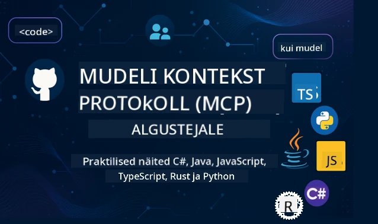

 

[](https://GitHub.com/microsoft/mcp-for-beginners/graphs/contributors)
[](https://GitHub.com/microsoft/mcp-for-beginners/issues)
[](https://GitHub.com/microsoft/mcp-for-beginners/pulls)
[](http://makeapullrequest.com)

[](https://GitHub.com/microsoft/mcp-for-beginners/watchers)
[](https://GitHub.com/microsoft/mcp-for-beginners/fork)
[](https://GitHub.com/microsoft/mcp-for-beginners/stargazers)


[](https://discord.gg/nTYy5BXMWG)

Järgige neid samme, et alustada nende ressursside kasutamist:
1. **Haarake hoidla kahvlina**: Klõpsake [](https://GitHub.com/microsoft/mcp-for-beginners/fork)
2. **Klooni hoidla**:   `git clone https://github.com/microsoft/mcp-for-beginners.git`
3. **Liituge** [](https://discord.gg/nTYy5BXMWG)


### 🌐 Mitmekeelne tugi

#### Toetatud GitHub Actioni kaudu (automatiseeritud ja alati ajakohane)

<!-- CO-OP TRANSLATOR LANGUAGES TABLE START -->
[Arabic](../ar/README.md) | [Bengali](../bn/README.md) | [Bulgarian](../bg/README.md) | [Burmese (Myanmar)](../my/README.md) | [Chinese (Simplified)](../zh-CN/README.md) | [Chinese (Traditional, Hong Kong)](../zh-HK/README.md) | [Chinese (Traditional, Macau)](../zh-MO/README.md) | [Chinese (Traditional, Taiwan)](../zh-TW/README.md) | [Croatian](../hr/README.md) | [Czech](../cs/README.md) | [Danish](../da/README.md) | [Dutch](../nl/README.md) | [Estonian](./README.md) | [Finnish](../fi/README.md) | [French](../fr/README.md) | [German](../de/README.md) | [Greek](../el/README.md) | [Hebrew](../he/README.md) | [Hindi](../hi/README.md) | [Hungarian](../hu/README.md) | [Indonesian](../id/README.md) | [Italian](../it/README.md) | [Japanese](../ja/README.md) | [Kannada](../kn/README.md) | [Korean](../ko/README.md) | [Lithuanian](../lt/README.md) | [Malay](../ms/README.md) | [Malayalam](../ml/README.md) | [Marathi](../mr/README.md) | [Nepali](../ne/README.md) | [Nigerian Pidgin](../pcm/README.md) | [Norwegian](../no/README.md) | [Persian (Farsi)](../fa/README.md) | [Polish](../pl/README.md) | [Portuguese (Brazil)](../pt-BR/README.md) | [Portuguese (Portugal)](../pt-PT/README.md) | [Punjabi (Gurmukhi)](../pa/README.md) | [Romanian](../ro/README.md) | [Russian](../ru/README.md) | [Serbian (Cyrillic)](../sr/README.md) | [Slovak](../sk/README.md) | [Slovenian](../sl/README.md) | [Spanish](../es/README.md) | [Swahili](../sw/README.md) | [Swedish](../sv/README.md) | [Tagalog (Filipino)](../tl/README.md) | [Tamil](../ta/README.md) | [Telugu](../te/README.md) | [Thai](../th/README.md) | [Turkish](../tr/README.md) | [Ukrainian](../uk/README.md) | [Urdu](../ur/README.md) | [Vietnamese](../vi/README.md)

> **Eelistate kohalikku kloonimist?**
>
> See hoidla sisaldab üle 50 keele tõlke, mis suurendab oluliselt allalaadimise suurust. Tõlgeteta kloonimiseks kasutage sparsilist checkouti:
>
> **Bash / macOS / Linux:**
> ```bash
> git clone --filter=blob:none --sparse https://github.com/microsoft/mcp-for-beginners.git
> cd mcp-for-beginners
> git sparse-checkout set --no-cone '/*' '!translations' '!translated_images'
> ```
>
> **CMD (Windows):**
> ```cmd
> git clone --filter=blob:none --sparse https://github.com/microsoft/mcp-for-beginners.git
> cd mcp-for-beginners
> git sparse-checkout set --no-cone "/*" "!translations" "!translated_images"
> ```
>
> See annab teile kõik vajaliku kursuse lõpuleviimiseks oluliselt kiirema allalaadimisega.
<!-- CO-OP TRANSLATOR LANGUAGES TABLE END -->

# 🚀 Mudeli konteksti protokolli (MCP) õppekava algajatele

## **Õppige MCP-d praktiliste koodinäidete abil C#, Java, JavaScripti, Rusti, Pythoni ja TypeScripti keeltes**

## 🧠 Mudeli konteksti protokolli õppekava ülevaade
Tere tulemast teie teekonnale Mudeli konteksti protokolli avastamisel! Kui olete kunagi mõelnud, kuidas tehisintellekti rakendused suhtlevad erinevate tööriistade ja teenustega, olete nüüd avastamas elegantset lahendust, mis muudab arendajate võimalusi luua nutikaid süsteeme.

Mõelge MCP-le kui universaalsele tõlkijale tehisintellekti rakendustele – nagu USB-pordid võimaldavad ühendada mis tahes seadme arvutiga, võimaldab MCP AI mudelitel suhelda mis tahes tööriista või teenusega standardiseeritud viisil. Olgu teie eesmärgiks esimese chatboti loomine või keerukate AI töövoogude arendamine, MCP mõistmine annab teile võimaluse luua võimekaid ja paindlikke rakendusi.

See õppekava on loodud kannatlikult ja hoolikalt teie õppimisteekonna jaoks. Alustame lihtsatest kontseptsioonidest, mida te juba mõistate, ning ehitame järk-järgult teie oskusi käsitsi harjutuste kaudu teie lemmikprogramme keeltes. Iga samm sisaldab selgeid selgitusi, praktilisi näiteid ja palju julgustust.

Selle teekonna lõpuks tunnete end kindlalt ise oma MCP serverite loomisel, nende integreerimisel populaarsete AI platvormidega ning mõistate, kuidas see tehnoloogia kujundab AI arendamise tulevikku. Alustame seda põnevat seiklust koos!

### Oficiaalne dokumentatsioon ja spetsifikatsioonid

See õppekava on kooskõlas **MCP spetsifikatsiooniga 2025-11-25** (viimane stabiilne versioon). MCP spetsifikatsioon kasutab kuupäevapõhist versioonihaldust (VVVV-KK-PP vorming), et tagada protokolli versioonide selge jälgimine.

Need ressursid muutuvad väärtuslikumaks, kui teie arusaam kasvab, kuid ärge tundke survet kõike kohe läbi lugeda. Alustage neidest piirkondadest, mis teid enim huvitavad!
- 📘 [MCP dokumentatsioon](https://modelcontextprotocol.io/) – See on teie põhiallikas samm-sammult juhendite ja kasutajajuhendite jaoks. Dokumentatsioon on kirjutatud algajatele, pakkudes selgeid näiteid, mida saate oma tempos järgida.
- 📜 [MCP spetsifikatsioon](https://modelcontextprotocol.io/specification/2025-11-25) – Mõelge sellele kui teie põhjalikule viiteteabele. Õppekavaga töötades leiate end siit otsimas konkreetseid detaile ja uurimas edasijõudnute funktsioone.
- 📜 [MCP spetsifikatsiooni versioonihaldus](https://modelcontextprotocol.io/specification/versioning) – Siit leiate infot protokolli versioonide ajaloo kohta ja selle kohta, kuidas MCP kasutab kuupäevapõhist versioonihaldust (VVVV-KK-PP vorming).
- 🧑‍💻 [MCP GitHubi hoidla](https://github.com/modelcontextprotocol) – Siit leiate SDK-d, tööriistad ja koodinäited mitmes programmeerimiskeeles. See on nagu aardelaegas praktiliste näidete ja valmis komponentidega.
- 🌐 [MCP kogukond](https://github.com/orgs/modelcontextprotocol/discussions) – Liituge teiste õppijate ja kogenud arendajatega MCP teemalistes aruteludes. See on toetav kogukond, kus küsimusi teretulnud ja teadmisi vabal käel jagatakse.
  
## Õpieesmärgid

Selle õppekava lõpuks tunnete end enesekindlalt ja põnevil oma uute võimete üle. Siin on, mida te saavutate:

• **MCP põhialuste mõistmine**: Te saate aru, mis on Mudeli konteksti protokoll ja miks see muudab AI rakenduste koostööd, kasutades näiteid ja võrdlusi, mis on arusaadavad.

• **Esimese MCP serveri loomine**: Loote töötava MCP serveri oma eelistatud programmeerimiskeeles, alustades lihtsatest näidetest ja arendades oskusi samm-sammult.

• **AI mudelite ühendamine päristööriistadega**: Õpite, kuidas sillutada vahe AI mudelite ja tegelike teenuste vahel, andes teie rakendustele võimsad uued võimalused.

• **Turvalisuse parimate praktikate rakendamine**: Mõistate, kuidas hoida MCP rakendused turvalisena, kaitstes nii rakendusi kui ka kasutajaid.

• **Rakenduste kasutuselevõtt kindlalt**: Teate, kuidas viia MCP projektid arendusest tootmiskeskkonda, kasutades praktilisi juurutusstrateegiaid, mis toimivad pärismaailmas.

• **Liitumine MCP kogukonnaga**: Saate osaks kasvavast arendajate kogukonnast, kes kujundab AI rakenduste arendamise tulevikku. 

## Oluline taustteave

Enne kui sukeldume MCP spetsiifikasse, veendume, et tunneksite ennast mugavalt mõningate põhimõistetega. Ärge muretsege, kui te ei ole nendes valdkondades ekspert – me selgitame kõik vajalikud asjad, kui edasi liigume!

### Protokollide mõistmine (Vundament)

Mõelge protokollile kui vestluse reeglitele. Kui helistate sõbrale, te teate mõlemad, et vastates öelda "tere", anda kord rääkida ja lõpetades "head aega". Arvutiprogrammid vajavad sarnaseid reegleid tõhusaks suhtlemiseks.

MCP on protokoll – kokkulepitud reeglite kogum, mis aitab AI mudelitel ja rakendustel võtta osa tulemuslikest "vestlustest" tööriistade ja teenustega. Nagu vestluse reeglid muudavad inimeste suhtluse sujuvamaks, muudab MCP AI rakenduste suhtluse palju usaldusväärsemaks ja võimsamaks.

### Klient-serveri suhted (Kuidas programmid koos töötavad)

Te kasutate klient-serveri suhteid iga päev! Kui kasutate veebibrauserit (klient) veebisaidile minemiseks, ühendute veebiserveriga, mis saadab teile lehe sisu. Brauser teab, kuidas infot küsida, ja server teab, kuidas vastata.

MCP-s on sarnane suhe: AI mudelid käituvad klientidena, kes taotlevad infot või toiminguid, samas kui MCP serverid pakuvad neid võimeid. See on nagu abivalmis assistent (server), kelle poole AI saab pöörduda spetsiifiliste ülesannete täitmiseks.

### Miks standardiseerimine on oluline (Asjade koos töötamine)

Kujutage ette, kui iga autotootja kasutaks erineva kujuga bensiinipumpasid – teil oleks vaja iga auto jaoks erinevat adapterit! Standardiseerimine tähendab kokkulepet ühistes lähenemisviisides, et asjad töötaksid sujuvalt koos.

MCP pakub AI rakendustele seda standardiseerimist. Selle asemel, et iga AI mudel vajaks kohandatud koodi iga tööriistaga töötamiseks, loob MCP universaalse võimaluse nende omavaheliseks suhtlemiseks. See tähendab, et arendajad saavad ühekordselt tööriistu ehitada ja neid kasutada paljude erinevate AI süsteemidega.

## 🧭 Teie õpitee ülevaade

Teie MCP teekond on hoolikalt üles ehitatud, et suurendada teie enesekindlust ja oskusi järk-järgult. Iga faas tutvustab uusi kontseptsioone ning tugevdab juba omandatut.

### 🌱 Vundamendifaas: Põhitõdede mõistmine (moodulid 0-2)

Siin algab teie seiklus! Tutvustame teile MCP mõisteid kasutades tuttavaid võrdlusi ja lihtsaid näiteid. Mõistate, mis on MCP, miks see olemas on ja kuidas see sobitub suuremasse AI arenduse maailma.

• **Moodul 0 - Sissejuhatus MCP-sse**: Alustame uurides, mis on MCP ja miks see on nii oluline kaasaegsetele AI rakendustele. Näete MCP reaalseid näiteid ja mõistate, kuidas see lahendab arendajate sagedasi probleeme.

• **Moodul 1 - Põhikontseptsioonide selgitus**: Siin õpite MCP olulisi põhikive. Kasutame rohkelt võrdlusi ja visuaalseid näiteid, et need kontseptsioonid tunduksid loomulikud ja arusaadavad.

• **Moodul 2 - Turvalisus MCP-s**: Turvalisus võib kõlada hirmutavalt, kuid näitame teile, kuidas MCP-l on sisseehitatud turvafunktsioonid ning õpetame parimaid praktikaid, mis kaitsevad teie rakendusi algusest peale.

### 🔨 Arendusfaas: Esimeste rakenduste loomine (moodul 3)

Nüüd algab tõeline lõbu! Saate käed külge, ehitades reaalseid MCP servereid ja kliente. Ärge muretsege – alustame lihtsast ja juhendame teid iga sammu juures.
See moodul sisaldab mitmeid praktilisi juhendeid, mis võimaldavad sul harjutada oma eelistatud programmeerimiskeeles. Sa lood oma esimese serveri, ehitad kliendi, et sellega ühenduda, ja integreerid isegi populaarsete arendustööriistadega nagu VS Code.

Iga juhend sisaldab täielikke koodinäiteid, tõrkeotsingu näpunäiteid ning selgitusi, miks teeme konkreetseid disainivalikuid. Selle etapi lõpuks on sul töötavad MCP rakendused, mille üle võid uhke olla!

### 🚀 Kasvamise etapp: Täiustatud kontseptsioonid ja reaalse maailma rakendused (moodulid 4-5)

Kui põhitõed on selged, oled valmis uurima keerukamaid MCP funktsioone. Käsitleme praktilisi rakendamisstrateegiaid, silumisvõtteid ja täiustatud teemasid nagu multimodaalne tehisintellekti integratsioon.

Sa õpid ka, kuidas MCP rakendusi tootmiskasutuseks skaleerida ja integreerida pilverakendustega nagu Azure. Need moodulid valmistavad sind ette MCP lahenduste loomiseks, mis suudavad toime tulla reaalse maailma nõudmistega.

### 🌟 Meistrietapp: Kogukond ja spetsialiseerumine (moodulid 6-11)

Viimane etapp keskendub MCP kogukonnaga liitumisele ja valdkondadele, mis sind enim huvitavad. Õpid panustama avatud lähtekoodiga MCP projektidesse, rakendama täiustatud autentimismustreid ning ehitama põhjalikke andmebaasiga integreeritud lahendusi.

Moodul 11 väärib erilist mainimist – tegemist on täieliku 13-laboriga praktilise õpiteega, mis õpetab tootmisvalmis MCP serverite loomist PostgreSQL integratsiooniga. See on nagu lõputöö, mis koondab kõik õpitut!

### 📚 Täielik õppekava struktuur

| Moodul | Teema | Kirjeldus | Link |
|--------|-------|-----------|------|
| **Moodul 0-3: Põhitõed** | | | |
| 00 | Sissejuhatus MCP-sse | Ülevaade Model Context Protocolist ja selle tähtsusest tehisintellekti töövoogudes | [Loe lisa](./00-Introduction/README.md) |
| 01 | Põhikontseptsioonide seletus | Süvitsi MCP põhikontseptsioonide uurimine | [Loe lisa](./01-CoreConcepts/README.md) |
| 02 | Turvalisus MCP-s | Turvaohtude käsitlus ja parimad tavad | [Loe lisa](./02-Security/README.md) |
| 03 | MCP-ga alustamine | Keskkonna seadistamine, põhilised serverid/kliendid, integratsioon | [Loe lisa](./03-GettingStarted/README.md) |
| **Moodul 3: Esimese serveri ja kliendi loomine** | | | |
| 3.1 | Esimene server | Loo oma esimene MCP server | [Juhend](./03-GettingStarted/01-first-server/README.md) |
| 3.2 | Esimene klient | Arenda lihtne MCP klient | [Juhend](./03-GettingStarted/02-client/README.md) |
| 3.3 | Klient LLM-iga | Integreeri suured keelemudelid | [Juhend](./03-GettingStarted/03-llm-client/README.md) |
| 3.4 | VS Code integratsioon | Kasuta MCP servereid VS Codes | [Juhend](./03-GettingStarted/04-vscode/README.md) |
| 3.5 | stdio server | Loo serverid stdio transpordi abil | [Juhend](./03-GettingStarted/05-stdio-server/README.md) |
| 3.6 | HTTP voogedastus | Rakenda HTTP voogedastust MCP-s | [Juhend](./03-GettingStarted/06-http-streaming/README.md) |
| 3.7 | AI tööriistakomplekt | Kasuta AI Toolkiti MCP-ga | [Juhend](./03-GettingStarted/07-aitk/README.md) |
| 3.8 | Testimine | Testi oma MCP serveri rakendust | [Juhend](./03-GettingStarted/08-testing/README.md) |
| 3.9 | Väljaandmine | Käivita MCP serverid tootmiskeskkonnas | [Juhend](./03-GettingStarted/09-deployment/README.md) |
| 3.10 | Täiustatud serveri kasutus | Kasuta edasijõudnud servereid täiendavate funktsioonide ja parema arhitektuuri jaoks | [Juhend](./03-GettingStarted/10-advanced/README.md) |
| 3.11 | Lihtne autentimine | Peatükk, mis näitab autentimist algusest peale ja RBAC-i | [Juhend](./03-GettingStarted/11-simple-auth/README.md) |
| 3.12 | MCP hostid | Seadista Claude Desktop, Cursor, Cline ja teisi MCP hoste | [Juhend](./03-GettingStarted/12-mcp-hosts/README.md) |
| 3.13 | MCP Inspector | Silu ja testi MCP servereid Inspector tööriistaga | [Juhend](./03-GettingStarted/13-mcp-inspector/README.md) |
| 3.14 | Valim | Kasuta valimit koostööks kliendiga | [Juhend](./03-GettingStarted/14-sampling/README.md) |
| 3.15 | MCP rakendused | Ehita MCP rakendusi | [Juhend](./03-GettingStarted/15-mcp-apps/README.md) |
| **Moodul 4-5: Praktiline ja täiustatud** | | | |
| 04 | Praktiline rakendamine | SDK-d, silumine, testimine, taaskasutatavad promptide mallid | [Loe lisa](./04-PracticalImplementation/README.md) |
| 4.1 | Lehekülgede haldus | Töötle suuri tulemuste komplekte kursori põhise lehekülgede haldusega | [Juhend](./04-PracticalImplementation/pagination/README.md) |
| 05 | Täiustatud teemad MCP-s | Multimodaalne tehisintellekt, skaleerimine, ärikasutus | [Loe lisa](./05-AdvancedTopics/README.md) |
| 5.1 | Azure integratsioon | MCP integratsioon Azure’iga | [Juhend](./05-AdvancedTopics/mcp-integration/README.md) |
| 5.2 | Mitmemodaalsus | Töötamine mitme modaliteediga | [Juhend](./05-AdvancedTopics/mcp-multi-modality/README.md) |
| 5.3 | OAuth2 demo | Rakenda OAuth2 autentimine | [Juhend](./05-AdvancedTopics/mcp-oauth2-demo/README.md) |
| 5.4 | Põhikontekstid | Mõista ja rakenda põhikontekste | [Juhend](./05-AdvancedTopics/mcp-root-contexts/README.md) |
| 5.5 | Marsruutimine | MCP marsruutimisstrateegiad | [Juhend](./05-AdvancedTopics/mcp-routing/README.md) |
| 5.6 | Valim | Valimitehnikad MCP-s | [Juhend](./05-AdvancedTopics/mcp-sampling/README.md) |
| 5.7 | Skaleerimine | MCP rakenduste skaleerimine | [Juhend](./05-AdvancedTopics/mcp-scaling/README.md) |
| 5.8 | Turvalisus | Täiustatud turvakaalutlused | [Juhend](./05-AdvancedTopics/mcp-security/README.md) |
| 5.9 | Veebipäring | Rakenda veebipäringu võimalused | [Juhend](./05-AdvancedTopics/web-search-mcp/README.md) |
| 5.10 | Reaalaegne voogedastus | Ehita reaalaegse voogedastuse funktsionaalsus | [Juhend](./05-AdvancedTopics/mcp-realtimestreaming/README.md) |
| 5.11 | Reaalaegne otsing | Rakenda reaalaegne otsing | [Juhend](./05-AdvancedTopics/mcp-realtimesearch/README.md) |
| 5.12 | Entra ID autentimine | Autentimine Microsoft Entra ID-ga | [Juhend](./05-AdvancedTopics/mcp-security-entra/README.md) |
| 5.13 | Foundry integratsioon | Integratsioon Azure AI Foundry-ga | [Juhend](./05-AdvancedTopics/mcp-foundry-agent-integration/README.md) |
| 5.14 | Konteksti inseneriteadus | Tõhusad tehnikad konteksti inseneriteaduseks | [Juhend](./05-AdvancedTopics/mcp-contextengineering/README.md) |
| 5.15 | MCP kohandatud transport | Kohandatud transpordi rakendused | [Juhend](./05-AdvancedTopics/mcp-transport/README.md) |
| 5.16 | Protokolli funktsioonid | Edusammute teadete, tühistamise, ressursimallide teostus | [Juhend](./05-AdvancedTopics/mcp-protocol-features/README.md) |
| **Moodul 6-10: Kogukond ja parimad tavad** | | | |
| 06 | Kogukonna panused | Kuidas panustada MCP ökosüsteemi | [Juhend](./06-CommunityContributions/README.md) |
| 07 | Õppetunnid varajasest kasutuselevõtust | Reaalse maailma rakendamislood | [Juhend](./07-LessonsfromEarlyAdoption/README.md) |
| 08 | Parimad MCP tavad | Jõudlus, veataluvus, vastupidavus | [Juhend](./08-BestPractices/README.md) |
| 09 | MCP juhtumiuuringud | Praktilised rakendamisnäited | [Juhend](./09-CaseStudy/README.md) |
| 10 | Praktiline töötuba | MCP serveri loomine AI Toolkiti abil | [Labor](./10-StreamliningAIWorkflowsBuildingAnMCPServerWithAIToolkit/README.md) |
| **Moodul 11: MCP Serveri praktiline labor** | | | |
| 11 | MCP serveri andmebaasi integratsioon | Põhjalik 13-laboriline praktiline õpitee PostgreSQL integratsiooniga | [Laborid](./11-MCPServerHandsOnLabs/README.md) |
| 11.1 | Sissejuhatus | Ülevaade MCP-st andmebaasi integratsiooni ja jaemüügianalüüsi kasutusjuhtumiga | [Labor 00](./11-MCPServerHandsOnLabs/00-Introduction/README.md) |
| 11.2 | Põhiarhitektuur | MCP serveriarhitektuuri, andmebaasikihte ja turvamustreid mõistmine | [Labor 01](./11-MCPServerHandsOnLabs/01-Architecture/README.md) |
| 11.3 | Turvalisus ja mitmiküürimine | Ridade taseme turvalisus, autentimine ja mitme üürniku andmete ligipääs | [Labor 02](./11-MCPServerHandsOnLabs/02-Security/README.md) |
| 11.4 | Keskkonna seadistus | Arenduskeskkonna seadistamine, Docker, Azure ressursid | [Labor 03](./11-MCPServerHandsOnLabs/03-Setup/README.md) |
| 11.5 | Andmebaasi disain | PostgreSQL seadistus, jaemüügi skeemi disain ja näidisandmed | [Labor 04](./11-MCPServerHandsOnLabs/04-Database/README.md) |
| 11.6 | MCP serveri rakendus | FastMCP serveri ehitamine andmebaasi integratsiooniga | [Labor 05](./11-MCPServerHandsOnLabs/05-MCP-Server/README.md) |
| 11.7 | Tööriistade arendus | Andmebaasi päringutööriistade ja skeemi introspektsiooni loomine | [Labor 06](./11-MCPServerHandsOnLabs/06-Tools/README.md) |
| 11.8 | Semantiline otsing | Vektorite sisestuste rakendamine Azure OpenAI ja pgvector’iga | [Labor 07](./11-MCPServerHandsOnLabs/07-Semantic-Search/README.md) |
| 11.9 | Testimine ja silumine | Testimisstrateegiad, silumisvahendid ja valideerimise lähenemised | [Labor 08](./11-MCPServerHandsOnLabs/08-Testing/README.md) |
| 11.10 | VS Code integratsioon | VS Code MCP integratsiooni ja AI vestluse kasutuse seadistamine | [Labor 09](./11-MCPServerHandsOnLabs/09-VS-Code/README.md) |
| 11.11 | Väljaandmise strateegiad | Dockeri paigaldus, Azure konteinerirakendused ja skaleerimise kaalutlused | [Labor 10](./11-MCPServerHandsOnLabs/10-Deployment/README.md) |
| 11.12 | Jälgimine | Application Insights, logimine, jõudluse jälgimine | [Labor 11](./11-MCPServerHandsOnLabs/11-Monitoring/README.md) |
| 11.13 | Parimad tavad | Jõudluse optimeerimine, turvalisuse tugevdamine ja tootmistarkused | [Labor 12](./11-MCPServerHandsOnLabs/12-Best-Practices/README.md) |

### 💻 Koodinäidete projektid

Üks põnevamaid MCP õppimise osi on näha oma koodioskuste järjestikust arengut. Oleme kujundanud oma koodinäited nii, et need algavad lihtsast ja muutuvad üha keerukamaks, kui sinu arusaam süveneb. Siin on, kuidas me kontseptsioone tutvustame – kood, mis on lihtsalt arusaadav, kuid demonstreerib tegelikke MCP põhimõtteid; sa mõistad mitte ainult seda, mida see kood teeb, vaid miks see on selliselt struktureeritud ja kuidas see sobitub suurematesse MCP rakendustesse.

#### Lihtsad MCP kalkulaatori näited

| Keel | Kirjeldus | Link |
|----------|-------------|------|
| C# | MCP serveri näide | [Vaata koodi](./03-GettingStarted/samples/csharp/README.md) |
| Java | MCP kalkulaator | [Vaata koodi](./03-GettingStarted/samples/java/calculator/README.md) |
| JavaScript | MCP demo | [Vaata koodi](./03-GettingStarted/samples/javascript/README.md) |
| Python | MCP server | [Vaata koodi](../../03-GettingStarted/samples/python/mcp_calculator_server.py) |
| TypeScript | MCP näide | [Vaata koodi](./03-GettingStarted/samples/typescript/README.md) |
| Rust | MCP näide | [Vaata koodi](./03-GettingStarted/samples/rust/README.md) |

#### Täiustatud MCP rakendused

| Keel | Kirjeldus | Link |
|----------|-------------|------|
| C# | Täiustatud näide | [Vaata koodi](./04-PracticalImplementation/samples/csharp/README.md) |
| Java koos Springiga | Konteinerirakenduse näide | [Vaata koodi](./04-PracticalImplementation/samples/java/containerapp/README.md) |
| JavaScript | Täiustatud näide | [Vaata koodi](./04-PracticalImplementation/samples/javascript/README.md) |
| Python | Keeruline rakendus | [Vaata koodi](./04-PracticalImplementation/samples/python/README.md) |
| TypeScript | Konteineri näide | [Vaata koodi](./04-PracticalImplementation/samples/typescript/README.md) |

## 🎯 MCP õppimise eeldused

Selle õppekava maksimaalseks kasutamiseks peaks sul olema:
- Põhilised programmeerimisoskused vähemalt ühes järgmistest keeltest: C#, Java, JavaScript, Python või TypeScript  
- Arusaam kliendi-serveri mudelist ja API-dest  
- Tutvumine REST- ja HTTP-kontseptsioonidega  
- (Valikuline) Taust tehisintellekti / masinõppe kontseptsioonides  

- Osalemine meie kogukonna aruteludes toe saamiseks  

## 📚 Õpijuhend ja ressursid  

See hoidla sisaldab mitmeid ressursse, mis aitavad sul tõhusalt õppida ja orienteeruda:  

### Õpijuhend  

Saadaval on põhjalik [Õpijuhend](./study_guide.md), mis aitab sul selles hoidlis tõhusalt navigeerida. See visuaalne õppekava kaart näitab, kuidas kõik teemad on omavahel seotud, ning annab juhiseid, kuidas prooviprojekte efektiivselt kasutada. See on eriti kasulik, kui oled visuaalselt õppija, kes eelistab suurt pilti näha.  

Juhend sisaldab:  
- Visuaalne õppekava kaart kõikidest käsitletavatest teemadest  
- Iga hoidlasektori detailne jaotus  
- Juhised prooviprojektide kasutamiseks  
- Soovitatud õpperajad erinevatele oskustasemetele  
- Täiendavad ressursid õppimise täiendamiseks  

### Muudatuste päevik  

Me hoiame põhjalikku [Muudatuste päevikut](./changelog.md), milles jälgime kõiki olulisemaid uuendusi õppevahendites, et saaksid kursis olla viimaste täiustuste ja lisandustega.  
- Uued sisulised lisandused  
- Struktuurimuudatused  
- Funktsioonide täiustused  
- Dokumentatsiooni uuendused  

## 🛠️ Kuidas seda õppekava tõhusalt kasutada  

Iga selles juhendis olev õppetund sisaldab:  

1. Selgeid seletusi MCP kontseptsioonidest  
2. Reaalajas koodinäiteid mitmes programmeerimiskeeles  
3. Harjutusi tõeliste MCP rakenduste loomiseks  
4. Lisamaterjale edasijõudnutele  

### Õppigem MCP-d koos C#-ga - õppesari  

Õpime tundma Model Context Protocol’i (MCP), tipptasemel raamistiku, mis on loodud AI mudelite ja kliendirakenduste vahelist suhtlust standardiseerima. Selle algajale sõbraliku seansiga tutvustame MCP-d ning juhatame sind läbi oma esimese MCP serveri loomise.  
#### C#: [https://aka.ms/letslearnmcp-csharp](https://aka.ms/letslearnmcp-csharp)  
#### Java: [https://aka.ms/letslearnmcp-java](https://aka.ms/letslearnmcp-java)  
#### JavaScript: [https://aka.ms/letslearnmcp-javascript](https://aka.ms/letslearnmcp-javascript)  
#### Python: [https://aka.ms/letslearnmcp-python](https://aka.ms/letslearnmcp-python)  

## 🎓 Sinu MCP teekond algab  

Palju õnne! Sa astusid just esimese sammu põneval teekonnal, mis avardab sinu programmeerimisvõimeid ja ühendab sind AI arenduse tipptasemega.  

### Mida oled juba saavutanud  

Selles sissejuhatuses lugedes oled juba alustanud oma MCP teadmiste vundamendi ladumist. Sa mõistad, mis on MCP, miks see on oluline ja kuidas see õppekava toetab sinu õppimist. See on märkimisväärne saavutus ja algus sinu pädevusele selles olulises tehnoloogias.  

### Seiklus ees ootamas  

Edenedes moodulite kaupa, pea meeles, et iga ekspert on kord olnud algaja. Kontseptsioonid, mis praegu võivad tunduda keerulised, saavad harjutades ja rakendades ajapikku teine loomuseks. Iga väike samm ehitab võimsad võimed, mis teenivad sind kogu arendajakarjääri jooksul.  

### Sinu tugivõrgustik  

Sa liitud õppijate ja ekspertide kogukonnaga, kes on kirglikud MCP vastu ja soovivad aidata teistel edu saavutada. Olgu sul koodimisprobleem või soov jagada läbimurret, kogukond on siin, et sind toetada.  

Kui jääd takistusse või on sul küsimusi AI rakenduste loomisel, ühine õppurite ja kogenud arendajate aruteludega MCP teemal. See on toetav kogukond, kus küsimusi võetakse vastu ja teadmisi jagatakse vabalt.  

[](https://discord.gg/nTYy5BXMWG)  

Kui sul on toote tagasisidet või vigasid ehitamisel, külasta:  

[](https://aka.ms/foundry/forum)  

### Valmis alustama?  

Sinu MCP seiklus algab nüüd! Alusta Moodulist 0, et sukelduda oma esimestesse praktilistesse MCP kogemustesse, või vaata prooviprojekte ja saa aimu, mida hakkad looma. Pea meeles – iga ekspert algas täpselt sealt, kus sina nüüd oled, ja kannatlikkuse ning harjutamisega saad üllatuda, mida suudad saavutada.  

Tere tulemast Model Context Protocol arenduse maailma. Loome midagi imelist koos!  

## 🤝 Panustamine õppijate kogukonda  

See õppekava kasvab tugevamaks õppurite, nagu sina, panuste kaudu! Olgu see trükivea parandamine, selgemate seletuste soovitamine või uue näite lisamine – sinu panus aitab teistel algajatel edukalt edu saavutada.  

Tänud Microsofti hindatud professionaalile [Shivam Goyal](https://www.linkedin.com/in/shivam2003/) koodinäidete panustamise eest.  

Panustamisprotsess on kavandatud olema sõbralik ja toetav. Enamik panuseid nõuab Panustaja Litsentsilepingu (CLA) sõlmimist, kuid automaatsed tööriistad juhivad sind protsessi sujuvalt läbi.  

## 📜 Avatud lähtekoodiga õppimine  

Kogu see õppekava on saadaval MIT [LITSENTS](../../LICENSE) all, mis tähendab, et saad seda vabalt kasutada, muuta ja jagada. See toetab meie missiooni teha MCP teadmised arendajatele üle maailma kättesaadavaks.  
## 🤝 Panustamise juhised  

See projekt kutsub tervitama panuseid ja ettepanekuid. Enamik panuseid nõuab, et nõustuksid  
Panustaja Litsentsilepingu (CLA) tingimustega, mis kinnitavad, et sul on õigus ja sa annad meile tegelikult õigused oma panust kasutada. Lisainfo leiad aadressilt <https://cla.opensource.microsoft.com>.  

Kui esitad pull-päringu, määrab CLA bot automaatselt kindlaks, kas sul on vaja esitada CLA, ja märgistab PR õigesti (nt oleku kontroll, kommentaar). Järgi lihtsalt boti antud juhiseid. Seda peab tegema vaid korra kõigis CLA-d kasutavates hoidlates.  

See projekt on vastu võtnud [Microsofti avatud lähtekoodi käitumiskoodeksi](https://opensource.microsoft.com/codeofconduct/).  
Rohkem infot leiad [Käitumiskoodeksi KKK](https://opensource.microsoft.com/codeofconduct/faq/) või võta ühendust aadressil [opencode@microsoft.com](mailto:opencode@microsoft.com) täiendavate küsimuste või kommentaaride puhul.  

---  

*Valmis alustama oma MCP teekonda? Alusta [Moodul 00 - Tutvustus MCP-le](./00-Introduction/README.md) ja astu oma esimesed sammud Model Context Protocol arenduse maailma!*  


## 🎒 Teised kursused  
Meie meeskond toodab ka teisi kursuseid! Vaata lähemalt:  

<!-- CO-OP TRANSLATOR OTHER COURSES START -->  
### LangChain  
[](https://aka.ms/langchain4j-for-beginners)  
[](https://aka.ms/langchainjs-for-beginners?WT.mc_id=m365-94501-dwahlin)  
[](https://github.com/microsoft/langchain-for-beginners?WT.mc_id=m365-94501-dwahlin)  
---  

### Azure / Edge / MCP / Agendid  
[](https://github.com/microsoft/AZD-for-beginners?WT.mc_id=academic-105485-koreyst)  
[](https://github.com/microsoft/edgeai-for-beginners?WT.mc_id=academic-105485-koreyst)  
[](https://github.com/microsoft/mcp-for-beginners?WT.mc_id=academic-105485-koreyst)  
[](https://github.com/microsoft/ai-agents-for-beginners?WT.mc_id=academic-105485-koreyst)  

---  
 
### Generatiivse AI sari  
[](https://github.com/microsoft/generative-ai-for-beginners?WT.mc_id=academic-105485-koreyst)  
[-9333EA?style=for-the-badge&labelColor=E5E7EB&color=9333EA)](https://github.com/microsoft/Generative-AI-for-beginners-dotnet?WT.mc_id=academic-105485-koreyst)  
[-C084FC?style=for-the-badge&labelColor=E5E7EB&color=C084FC)](https://github.com/microsoft/generative-ai-for-beginners-java?WT.mc_id=academic-105485-koreyst)  
[-E879F9?style=for-the-badge&labelColor=E5E7EB&color=E879F9)](https://github.com/microsoft/generative-ai-with-javascript?WT.mc_id=academic-105485-koreyst)  

---  
 
### Põhijärjepidev õppimine  
[](https://aka.ms/ml-beginners?WT.mc_id=academic-105485-koreyst)  
[](https://aka.ms/datascience-beginners?WT.mc_id=academic-105485-koreyst)  
[](https://aka.ms/ai-beginners?WT.mc_id=academic-105485-koreyst)  
[](https://github.com/microsoft/Security-101?WT.mc_id=academic-96948-sayoung)  
[](https://aka.ms/webdev-beginners?WT.mc_id=academic-105485-koreyst)  
[](https://aka.ms/iot-beginners?WT.mc_id=academic-105485-koreyst)  
[](https://github.com/microsoft/xr-development-for-beginners?WT.mc_id=academic-105485-koreyst)  

---  
 
### Copiloti sari  
[](https://aka.ms/GitHubCopilotAI?WT.mc_id=academic-105485-koreyst)
[](https://github.com/microsoft/mastering-github-copilot-for-dotnet-csharp-developers?WT.mc_id=academic-105485-koreyst)
[](https://github.com/microsoft/CopilotAdventures?WT.mc_id=academic-105485-koreyst)
<!-- CO-OP TRANSLATOR OTHER COURSES END -->

---

<!-- CO-OP TRANSLATOR DISCLAIMER START -->
**Vastutusest loobumine**:  
See dokument on tõlgitud kasutades tehisintellektil põhinevat tõlketeenust [Co-op Translator](https://github.com/Azure/co-op-translator). Kuigi püüame tagada täpsust, palun arvestage, et automaatsed tõlked võivad sisaldada vigu või ebatäpsusi. Originaaldokument selle emakeeles loetakse autoriteetseks allikaks. Olulise teabe puhul soovitatakse kasutada professionaalset inimtõlget. Me ei vastuta nende arusaamatuste ega vale tõlgenduste eest, mis võivad tekkida selle tõlke kasutamisest.
<!-- CO-OP TRANSLATOR DISCLAIMER END -->