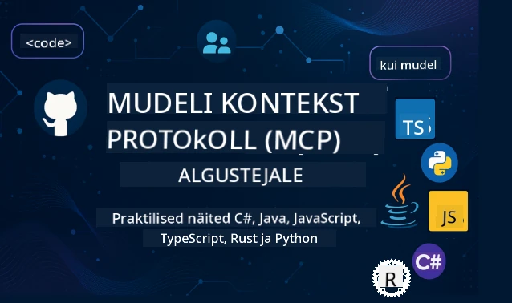

 

[](https://GitHub.com/microsoft/mcp-for-beginners/graphs/contributors)
[](https://GitHub.com/microsoft/mcp-for-beginners/issues)
[](https://GitHub.com/microsoft/mcp-for-beginners/pulls)
[](http://makeapullrequest.com)
[](https://mcptoplist.com/server/mcp.so%2Fmcp-for-beginners%2Fmicrosoft)

[](https://GitHub.com/microsoft/mcp-for-beginners/watchers)
[](https://GitHub.com/microsoft/mcp-for-beginners/fork)
[](https://GitHub.com/microsoft/mcp-for-beginners/stargazers)


[](https://discord.gg/nTYy5BXMWG)

Järgige järgmisi samme, et alustada nende ressursside kasutamist:
1. **Forkige hoidla**: Klõpsake [](https://GitHub.com/microsoft/mcp-for-beginners/fork)
2. **Kopeerige hoidla kohalikku masinasse**:   `git clone https://github.com/microsoft/mcp-for-beginners.git`
3. **Liituge** [](https://discord.gg/nTYy5BXMWG)


### 🌐 Mitmekeelne tugi

#### Toetatud GitHub Actioni kaudu (Automaatne ja alati ajakohane)

<!-- CO-OP TRANSLATOR LANGUAGES TABLE START -->
[Araabia](../ar/README.md) | [Bengali](../bn/README.md) | [Bulgaaria](../bg/README.md) | [Birma (Myanmar)](../my/README.md) | [Hiina (lihtsustatud)](../zh-CN/README.md) | [Hiina (traditsiooniline, Hongkong)](../zh-HK/README.md) | [Hiina (traditsiooniline, Macau)](../zh-MO/README.md) | [Hiina (traditsiooniline, Taiwan)](../zh-TW/README.md) | [Horvaadi](../hr/README.md) | [Tšehhi](../cs/README.md) | [Taani](../da/README.md) | [Hollandi](../nl/README.md) | [Eesti](./README.md) | [Soome](../fi/README.md) | [Prantsuse](../fr/README.md) | [Saksa](../de/README.md) | [Kreeka](../el/README.md) | [Heebrea](../he/README.md) | [Hindi](../hi/README.md) | [Ungari](../hu/README.md) | [Indoneesia](../id/README.md) | [Itaalia](../it/README.md) | [Jaapani](../ja/README.md) | [Kannada](../kn/README.md) | [Khmeri](../km/README.md) | [Korea](../ko/README.md) | [Leedu](../lt/README.md) | [Malai](../ms/README.md) | [Malajalami](../ml/README.md) | [Marathi](../mr/README.md) | [Nepali](../ne/README.md) | [Nigeeria Pidgin](../pcm/README.md) | [Norra](../no/README.md) | [Pärsia (Farsi)](../fa/README.md) | [Poola](../pl/README.md) | [Portugali (Brasiilia)](../pt-BR/README.md) | [Portugali (Portugal)](../pt-PT/README.md) | [Pandžabi (Gurmukhi)](../pa/README.md) | [Rumeenia](../ro/README.md) | [Vene](../ru/README.md) | [Serbia (kirilitsas)](../sr/README.md) | [Slovaki](../sk/README.md) | [Sloveeni](../sl/README.md) | [Hispaania](../es/README.md) | [Suaheli](../sw/README.md) | [Rootsi](../sv/README.md) | [Tagalogi (Filipino)](../tl/README.md) | [Tamili](../ta/README.md) | [Telugu](../te/README.md) | [Tai](../th/README.md) | [Türgi](../tr/README.md) | [Ukraina](../uk/README.md) | [Urdu](../ur/README.md) | [Vietnami](../vi/README.md)

> **Eelistate kopeerida kohalikku?**
>
> Selles hoidlas on üle 50 keele tõlke, mis suurendab allalaaditava faili suurust märkimisväärselt. Ilma tõlgeteta kloonimiseks kasutage harvendatud kontrollimist:
>
> **Bash / macOS / Linux:**
> ```bash
> git clone --filter=blob:none --sparse https://github.com/microsoft/mcp-for-beginners.git
> cd mcp-for-beginners
> git sparse-checkout set --no-cone '/*' '!translations' '!translated_images'
> ```
>
> **CMD (Windows):**
> ```cmd
> git clone --filter=blob:none --sparse https://github.com/microsoft/mcp-for-beginners.git
> cd mcp-for-beginners
> git sparse-checkout set --no-cone "/*" "!translations" "!translated_images"
> ```
>
> See annab teile kõik vajaliku kursuse läbimiseks palju kiirema allalaadimisega.
<!-- CO-OP TRANSLATOR LANGUAGES TABLE END -->

# 🚀 Mudelikonteksti protokolli (MCP) õppekava algajatele

## **Õppige MCP-d praktiliste koodinäidete abil keeles C#, Java, JavaScript, Rust, Python ja TypeScript**

## 🧠 Mudelikonteksti protokolli õppekava ülevaade
Tere tulemast teekonnale mudelikonteksti protokolli juurde! Kui olete kunagi mõelnud, kuidas tehisintellekti rakendused suhtlevad erinevate tööriistade ja teenustega, siis hakkate avastama elegantset lahendust, mis muudab arendajate töö intelligentsüsteemide loomisel.

Mõelge MCP-le kui universaalsele tõlkijale tehisintellekti rakendustele - nagu USB-pordid võimaldavad teil ühendada mis tahes seadet arvutiga, laseb MCP tehisintellekti mudelitel standardiseeritud viisil ühenduda mis tahes tööriista või teenusega. Olgu teie eesmärgiks esimene vestlusrobot või keeruliste tehisintellekti töövoogude loomine, MCP mõistmine annab teile võime luua võimekamaid ja paindlikumaid rakendusi.

See õppekava on loodud kannatlikkusega ja hoolitsusega teie õppeteekonna jaoks. Alustame lihtsatest kontseptsioonidest, mida juba mõistate, ja järk-järgult kasvatame teie oskusi praktilise harjutamise kaudu teie lemmik programmeerimiskeeles. Iga samm sisaldab selgitusi, praktilisi näiteid ja rohkesti innustust.

Selle teekonna läbimiseks on teil enesekindlus ehitada oma MCP serverid, integreerida neid populaarsete AI platvormidega ja mõista, kuidas see tehnoloogia kujundab tehisintellekti arendamise tulevikku. Alustame seda põnevat seiklust koos!

### Ametlik dokumentatsioon ja spetsifikatsioonid

See õppekava vastab **MCP spetsifikatsioonile 2025-11-25** (viimane stabiilne versioon). MCP spetsifikatsioon kasutab versioonide jälgimiseks kuupõhist märgistust (YYYY-MM-DD formaat), et tagada protokolli versioonide selge jälgitavus.

> **Vaadates tulevikku:** järgmise spetsifikatsiooni versiooni release kandidaat, **2026-07-28**, on plaanis välja anda 28. juulil 2026. See muudab protokolli transpordikihis olekuta, formaliseerib laienduste raamistikku (MCP rakendused, ülesanded), tugevdab autoriseerimist ja lõpeb Roots, Sampling ja Loggingi kasutamisega. Vaadake täielikku ülevaadet [Mis muutub MCP-s: 2026-07-28 väljalaske kandidaadis](./01-CoreConcepts/mcp-2026-07-28-release-candidate.md).

Need ressursid muutuvad väärtuslikumaks, kui teie arusaam suureneb, kuid ärge tundke survet kõike kohe lugeda. Alustage valdkondadest, mis teid kõige rohkem huvitavad!
- 📘 [MCP dokumentatsioon](https://modelcontextprotocol.io/) – See on teie põhiallikas samm-sammult juhendite ja kasutusjuhenditega. Dokumentatsioon on kirjutatud algajatele mõeldes, pakkudes selgeid näiteid, mida saate oma tempos jälgida.
- 📜 [MCP spetsifikatsioon](https://modelcontextprotocol.io/specification/2025-11-25) – Mõelge sellele kui teie põhjalikule viiteraamatule. Õppekava läbides leiate, et naasete siia, et otsida spetsiifilisi detaile ja avastada täiustatud funktsioone.
- 📜 [MCP spetsifikatsiooni versioonihaldus](https://modelcontextprotocol.io/specification/versioning) – Siin leidub infot protokolli versioonide ajaloo kohta ja selle kohta, kuidas MCP kasutab kuupõhist versioonimist.
- 🧑‍💻 [MCP GitHubi hoidla](https://github.com/modelcontextprotocol) – Siit leiate SDK-sid, tööriistu ja koodinäiteid mitmes programmeerimiskeeles. See on nagu praktiliste näidete ja kasutusvalmis komponentide aarete veeke.
- 🌐 [MCP kogukond](https://github.com/orgs/modelcontextprotocol/discussions) – Liituge teiste õppijate ja kogenud arendajatega aruteludes MCP teemadel. See on toetav kogukond, kus küsimused on oodatud ja teadmisi jagatakse vabalt.
  
## Õpieesmärgid

Selle õppekava lõpuks tunnete end kindlalt ja põnevil oma uute oskuste üle. Siin on, mida saavutate:

• **Mõistke MCP põhialuseid**: Saate selge pildi, mis on Mudelikonteksti protokoll ja miks see muudab AI rakenduste koostööd, kasutades arusaadavaid võrdlusi ja näiteid.

• **Looge oma esimene MCP server**: Teete töökorras MCP serveri oma eelistatud programmeerimiskeeles, alustades lihtsatest näidetest ja arendades oskusi samm-sammult.

• **Ühendage AI mudelid tegelike tööriistadega**: Õpite, kuidas sillata AI mudelite ja tegelike teenuste vaheline lõhe, andes oma rakendustele võimsaid uusi võimalusi.

• **Rakendage turvalisuse parimaid tavasid**: Saate aru, kuidas hoida MCP rakendused turvalised, kaitstes nii oma rakendusi kui kasutajaid.

• **Juurutage enesekindlalt**: Teate, kuidas viia MCP projektid arendusest tootmisse, kasutades praktilisi juurutusstrateegiaid, mis töötavad pärismaailmas.

• **Liituge MCP kogukonnaga**: Saate osaks kasvavast arendajate kogukonnast, kes kujundab tehisintellekti rakenduste arendamise tulevikku.

## Olulised taustteadmised

Enne kui sukeldume MCP spetsiifikasse, veendume, et tunneksite end mugavalt mõnede aluspõhimõtete osas. Ärge muretsege, kui te pole nendes valdkondades ekspert - me selgitame kogu vajaliku info teekonna jooksul!

### Protokollide mõistmine (alused)

Mõelge protokollile kui vestlusreeglitele. Kui helistate sõbrale, teate mõlemad, et vastates öelda "tere", rääkida kordamööda ja lõpetades öelda "nägemist". Arvutiprogrammid vajavad suhtlemiseks sarnaseid reegleid.

MCP on protokoll - kokkulepitud reeglistik, mis aitab AI mudelitel ja rakendustel produktiivselt "vestelda" tööriistade ja teenustega. Nii nagu vestlusreeglid sujuvamaks muudavad inimeste kommunikatsiooni, teeb MCP AI rakenduste suhtluse palju usaldusväärsemaks ja võimsamaks.

### Klient-Serveri suhted (kuidas programmid koos töötavad)

Te kasutate igapäevaselt klient-server suhteid! Kui kasutate veebibrauserit (klient) veebisaidi külastamiseks, ühendute veebiserveriga, mis saadab teile lehe sisu. Brauser teab, kuidas infot küsida, ja server teab, kuidas vastata.

MCP-s on meil sarnane suhe: AI mudelid toimivad klientidena, kes küsivad infot või tegutsevad, MCP serverid pakuvad neid võimeid. See on nagu kasulik assistent (server), kelle poole AI saab pöörduda konkreetsete ülesannete täitmiseks.

### Miks standardiseerimine on oluline (asjade sujuv koostöö)

Kujutage ette, kui iga autojuhtija kasutaks erinevate kujudega bensiinipumpasid - teil oleks iga auto jaoks erinev adapter vaja! Standardiseerimine tähendab ühiste lähenemiste kokkuleppimist, nii et asjad töötaksid sujuvalt koos.

MCP tagab selle standardiseerimise AI rakendustele. Selle asemel, et iga AI mudel vajaks iga tööriista jaoks eraldi koodi, loob MCP universaalse viisi, kuidas nad saavad suhelda. See tähendab, et arendajad saavad tööriistu ühekordselt luua ja neid kasutada paljude erinevate AI süsteemidega.

## 🧭 Teie õpitee ülevaade

Teekond MCP õppimisel on hoolikalt struktureeritud, et kasvatada teie enesekindlust ja oskusi järk-järgult. Iga faas tutvustab uusi mõisteid ning tugevdab juba omandatut.

### 🌱 Alusfaas: Põhitõdede mõistmine (moodulid 0-2)

Siit algab teie seiklus! Tutvustame teile MCP kontseptsioone kasutades tuttavaid võrdlusi ja lihtsaid näiteid. Saate aru, mis on MCP, miks see eksisteerib ja kuidas see sobitub AI arenduse laiemasse konteksti.


• **Moodul 0 - Sissejuhatus MCP-sse**: Alustame uurides, mis on MCP ja miks see on nii oluline tänapäevaste AI rakenduste jaoks. Näete MCP-d reaalsetes näidetes tegevuses ja saate aru, kuidas see lahendab arendajate ees seisvaid tavapäraseid probleeme.

• **Moodul 1 - Põhikontseptsioonide selgitus**: Siin õpite MCP olulisi põhielemente. Kasutame rohkelt analoogiaid ja visuaalseid näiteid, et need mõisted tunduksid loomulikud ja arusaadavad.

• **Moodul 2 - Turvalisus MCP-s**: Turvalisus võib tunduda hirmutav, kuid me näitame teile, kuidas MCP sisaldab sisseehitatud turvafunktsioone ja õpetame parimaid praktikaid, mis kaitsevad teie rakendusi algusest peale.

### 🔨 Ehitusetapp: Esimeste rakenduste loomine (Moodul 3)

Nüüd algab tõeline lõbu! Saate praktilist kogemust tegelike MCP serverite ja klientide loomisel. Ärge muretsege – alustame lihtsalt ja juhendame teid igal sammul.

See moodul sisaldab mitmeid praktilisi juhendeid, mis võimaldavad teil harjutada teie eelistatud programmeerimiskeeles. Loote oma esimese serveri, ehitate kliendi selle ühendamiseks ning integreerite isegi populaarsete arendustööriistadega nagu VS Code.

Iga juhend sisaldab täielikke koodinäiteid, tõrkeotsingu näpunäiteid ja selgitusi, miks teeme kindlaid disainivalikuid. Selle etapi lõpus on teil töökorras MCP rakendused, mille üle võite uhked olla!

### 🚀 Kasvufaas: Täiustatud kontseptsioonid ja reaalmaailma rakendus (Moodulid 4–5)

Kui põhitõed on selged, olete valmis uurima keerukamaid MCP funktsioone. Käsitleme praktilisi rakendusstrateegiaid, silumisvõtteid ja edasijõudnutele mõeldud teemasid, nagu mitmemodaalne tehisintellekti integratsioon.

Õpite ka, kuidas MCP rakendusi tootmiseks skaleerida ja integreerida pilveplatvormidega nagu Azure. Need moodulid valmistavad teid ette MCP lahenduste ehitamiseks, mis suudavad toime tulla reaalse maailma nõudmistega.

### 🌟 Meistriklassi etapp: Kogukond ja spetsialiseerumine (Moodulid 6–11)

Viimane etapp keskendub MCP kogukonnaga liitumisele ja teile huvipakkuvates valdkondades spetsialiseerumisele. Õpite, kuidas panustada avatud lähtekoodiga MCP projektidesse, rakendada täiustatud autentimismustreid ja ehitada ulatuslikke andmebaasiga integreeritud lahendusi.

Moodul 11 väärib erilist mainimist – see on täielik 13-laboriline praktiline õpperada, mis õpetab teid looma tootmiskõlblikke MCP servereid PostgreSQL integratsiooniga. See on nagu lõputöö, mis koondab kõik õppitu!

### 📚 Täielik õppekava struktuur

| Moodul | Teema | Kirjeldus | Link |
|--------|-------|-------------|------|
| **Moodulid 0-3: Põhitõed** | | | |
| 00 | Sissejuhatus MCP-sse | Ülevaade Model Context Protocol-ist ja selle tähtsusest AI töövoogudes | [Read more](./00-Introduction/README.md) |
| 01 | Põhikontseptsioonide selgitus | Süvitsi vaade MCP põhikontseptsioonidele | [Read more](./01-CoreConcepts/README.md) |
| 1.1 | Mis MCP-s muutub (2026-07-28 RC) | Staatiline protokoll, laiendusraamistik ja järgmise spetsifikatsiooni versiooniga tulevad funktsioonide eemaldamised | [Guide](./01-CoreConcepts/mcp-2026-07-28-release-candidate.md) |
| 02 | Turvalisus MCP-s | Turvaohtude ja parimate tavade käsitlus | [Read more](./02-Security/README.md) |
| 03 | MCP-ga alustamine | Keskkonna seadistamine, põhilised serverid/klient, integratsioon | [Read more](./03-GettingStarted/README.md) |
| **Moodul 3: Esimese serveri ja kliendi loomine** | | | |
| 3.1 | Esimene server | Looge oma esimene MCP server | [Guide](./03-GettingStarted/01-first-server/README.md) |
| 3.2 | Esimene klient | Arendage baas MCP klient | [Guide](./03-GettingStarted/02-client/README.md) |
| 3.3 | Klient LLM-ga | Integreerige suured keelemudelid | [Guide](./03-GettingStarted/03-llm-client/README.md) |
| 3.4 | VS Code integratsioon | Kasutage MCP servereid VS Codes | [Guide](./03-GettingStarted/04-vscode/README.md) |
| 3.5 | stdio server | Looge servereid stdio transpordiga | [Guide](./03-GettingStarted/05-stdio-server/README.md) |
| 3.6 | HTTP voogedastus | Rakendage HTTP voogedastus MCP-s | [Guide](./03-GettingStarted/06-http-streaming/README.md) |
| 3.7 | Microsoft Foundry tööriistakomplekt | Kasutage Microsoft Foundry tööriistakomplekti MCP-ga | [Guide](./03-GettingStarted/07-aitk/README.md) |
| 3.8 | Testimine | Testige oma MCP serveri rakendust | [Guide](./03-GettingStarted/08-testing/README.md) |
| 3.9 | Juurutamine | Juurutage MCP serverid tootmisesse | [Guide](./03-GettingStarted/09-deployment/README.md) |
| 3.10 | Täiustatud serverikasutus | Kasutage täiustatud servereid täiustatud funktsioonide ja parendatud arhitektuuri jaoks | [Guide](./03-GettingStarted/10-advanced/README.md) |
| 3.11 | Lihtne autentimine | Peatükk, mis näitab autentimist algusest ja RBAC-i | [Guide](./03-GettingStarted/11-simple-auth/README.md) |
| 3.12 | MCP hostid | Konfigureerige Claude Desktop, Cursor, Cline ja teised MCP hostid | [Guide](./03-GettingStarted/12-mcp-hosts/README.md) |
| 3.13 | MCP Inspector | Siluge ja testige MCP servereid Inspector tööriistaga | [Guide](./03-GettingStarted/13-mcp-inspector/README.md) |
| 3.14 | Valimi kasutamine | Kasutage valimi koos kliendiga koostööks | [Guide](./03-GettingStarted/14-sampling/README.md) |
| 3.15 | MCP rakendused | Looge MCP rakendusi | [Guide](./03-GettingStarted/15-mcp-apps/README.md) |
| **Moodulid 4-5: Praktiline ja edasijõudnutele** | | | |
| 04 | Praktiline rakendamine | SDK-d, silumine, testimine, taaskasutatavad prompt mallid | [Read more](./04-PracticalImplementation/README.md) |
| 4.1 | Leheküljestamine | Suurtes andmetes kursori baasil leheküljestamine | [Guide](./04-PracticalImplementation/pagination/README.md) |
| 05 | Täiustatud teemad MCP-s | Mitmemodaalne AI, skaleerimine, ettevõtluseks kasutamine | [Read more](./05-AdvancedTopics/README.md) |
| 5.1 | Azure integratsioon | MCP integratsioon Azure-ga | [Guide](./05-AdvancedTopics/mcp-integration/README.md) |
| 5.2 | Mitmemodaalsus | Töötamine mitme modaliteediga | [Guide](./05-AdvancedTopics/mcp-multi-modality/README.md) |
| 5.3 | OAuth2 demo | OAuth2 autentimise rakendamine | [Guide](./05-AdvancedTopics/mcp-oauth2-demo/README.md) |
| 5.4 | Juurekontekstid | Juurekontekstide mõistmine ja rakendamine | [Guide](./05-AdvancedTopics/mcp-root-contexts/README.md) |
| 5.5 | Marsruutimine | MCP marsruutimisstrateegiad | [Guide](./05-AdvancedTopics/mcp-routing/README.md) |
| 5.6 | Valimi võtted | Valimi võtted MCP-s | [Guide](./05-AdvancedTopics/mcp-sampling/README.md) |
| 5.7 | Skaleerimine | MCP rakenduste skaleerimine | [Guide](./05-AdvancedTopics/mcp-scaling/README.md) |
| 5.8 | Turvalisus | Täiustatud turvalisuse kaalutlused | [Guide](./05-AdvancedTopics/mcp-security/README.md) |
| 5.9 | Veebipäringud | Veebipäringute võimete rakendamine | [Guide](./05-AdvancedTopics/web-search-mcp/README.md) |
| 5.10 | Reaalajas voogedastus | Ehitage reaalajas voogedastuse funktsionaalsus | [Guide](./05-AdvancedTopics/mcp-realtimestreaming/README.md) |
| 5.11 | Reaalajas otsing | Rakendage reaalajas otsingut | [Guide](./05-AdvancedTopics/mcp-realtimesearch/README.md) |
| 5.12 | Entra ID autentimine | Autentimine Microsoft Entra ID abil | [Guide](./05-AdvancedTopics/mcp-security-entra/README.md) |
| 5.13 | Foundry integratsioon | Integreerige Microsoft Foundry-ga | [Guide](./05-AdvancedTopics/mcp-foundry-agent-integration/README.md) |
| 5.14 | Konteksti inseneriteadus | Tõhus konteksti inseneriteaduse tehnikad | [Guide](./05-AdvancedTopics/mcp-contextengineering/README.md) |
| 5.15 | MCP kohandatud transport | Kohandatud transpordi rakendused | [Guide](./05-AdvancedTopics/mcp-transport/README.md) |
| 5.16 | Protokolli funktsioonid | Edenemiseteated, tühistamine, ressursimallid | [Guide](./05-AdvancedTopics/mcp-protocol-features/README.md) |
| 5.17 | Vastandlik mitmeagendiline põhjendus | Kaks agenti vaidlustavad vastandlikke seisukohti, kasutades ühiseid MCP tööriistu, mida hindab kohtunikagent | [Guide](./05-AdvancedTopics/mcp-adversarial-agents/README.md) |
| **Moodulid 6-10: Kogukond ja parimad tavad** | | | |
| 06 | Kogukonna panused | Kuidas panustada MCP ökosüsteemi | [Guide](./06-CommunityContributions/README.md) |
| 07 | Õppetunnid varajasest kasutuselevõtust | Reaalse maailma rakenduse lood | [Guide](./07-LessonsfromEarlyAdoption/README.md) |
| 08 | Parimad MCP praktikad | Jõudlus, tõrketaluvus, vastupidavus | [Guide](./08-BestPractices/README.md) |
| 09 | MCP juhtumiuuringud | Praktilised rakendusnäited | [Guide](./09-CaseStudy/README.md) |
| 10 | Praktiline töötuba | MCP serveri ehitamine Microsoft Foundry tööriistakomplektiga | [Lab](./10-StreamliningAIWorkflowsBuildingAnMCPServerWithAIToolkit/README.md) |
| **Moodul 11: MCP serveri praktilised laborid** | | | |
| 11 | MCP serveri andmebaasi integratsioon | Ulatuslik 13-laboriline praktiline õpperada PostgreSQL integratsiooniks | [Labs](./11-MCPServerHandsOnLabs/README.md) |
| 11.1 | Sissejuhatus | MCP ülevaade andmebaasi integratsiooni ja jaemüügianalüüsi juhtumiga | [Lab 00](./11-MCPServerHandsOnLabs/00-Introduction/README.md) |
| 11.2 | Põhiarhitektuur | MCP serveri arhitektuuri, andmebaasikihi ja turvamustrite mõistmine | [Lab 01](./11-MCPServerHandsOnLabs/01-Architecture/README.md) |
| 11.3 | Turvalisus ja mitmetenantlus | Rida-tasandi turvalisus, autentimine ja mitme kasutajaga andmejuurdepääs | [Lab 02](./11-MCPServerHandsOnLabs/02-Security/README.md) |
| 11.4 | Keskkonna seadistamine | Arenduskeskkonna, Dockeri ja Azure ressursside seadistamine | [Lab 03](./11-MCPServerHandsOnLabs/03-Setup/README.md) |
| 11.5 | Andmebaasi disain | PostgreSQL seadistamine, jaemüügi skeemi disain ja näidisandmed | [Lab 04](./11-MCPServerHandsOnLabs/04-Database/README.md) |
| 11.6 | MCP serveri rakendamine | FastMCP serveri loomine andmebaasi integratsiooniga | [Lab 05](./11-MCPServerHandsOnLabs/05-MCP-Server/README.md) |
| 11.7 | Tööriistade arendamine | Andmebaasi päringutööriistade ja skeemi introspektsiooni loomine | [Lab 06](./11-MCPServerHandsOnLabs/06-Tools/README.md) |
| 11.8 | Semantiline otsing | Vektori manuste rakendamine Azure OpenAI ja pgvector abil | [Lab 07](./11-MCPServerHandsOnLabs/07-Semantic-Search/README.md) |
| 11.9 | Testimine ja silumine | Testimisstrateegiad, silumisvahendid ja valideerimise meetodid | [Lab 08](./11-MCPServerHandsOnLabs/08-Testing/README.md) |
| 11.10 | VS Code integratsioon | VS Code MCP integratsiooni ja AI vestluse seadistamine | [Lab 09](./11-MCPServerHandsOnLabs/09-VS-Code/README.md) |
| 11.11 | Juhtimisstrateegiad | Dockeri juurutamine, Azure Container Apps ja skaleerimise kaalutlused | [Lab 10](./11-MCPServerHandsOnLabs/10-Deployment/README.md) |
| 11.12 | Jälgimine | Application Insights, logimine, jõudluse monitooring | [Lab 11](./11-MCPServerHandsOnLabs/11-Monitoring/README.md) |
| 11.13 | Parimad praktikad | Jõudluse optimeerimine, turvalisuse tugevdamine ja tootmisnõuanded | [Lab 12](./11-MCPServerHandsOnLabs/12-Best-Practices/README.md) |
| **Moodul 12: MCP tööriistad** | | | |
| 12.1 | Tööriistad | MCP kasutamine Copilot rakenduses | [ Guide ](./12-tooling/README.md) |

### 💻 Näidiskoodiprojektid

Üks põnevamaid MCP õppimise osasid on näha, kuidas teie koodioskused järk-järgult arenevad. Oleme oma koodinäited kujundanud nii, et algul on need lihtsad ja kasvavad arusaamise süvenedes keerukamaks. Siin tutvustame kontseptsioone – kood, mis on lihtne mõista, kuid demonstreerib tõelisi MCP põhimõtteid, aitab teil mõista mitte ainult seda, mida kood teeb, vaid miks see on selliselt üles ehitatud ja kuidas see sobitub suuremate MCP rakenduste hulka.

#### Põhilised MCP kalkulaatori näited

| Keel | Kirjeldus | Link |
|----------|-------------|------|

| C# | MCP serveri näide | [Vaata koodi](./03-GettingStarted/samples/csharp/README.md) |
| Java | MCP kalkulaator | [Vaata koodi](./03-GettingStarted/samples/java/calculator/README.md) |
| JavaScript | MCP demo | [Vaata koodi](./03-GettingStarted/samples/javascript/README.md) |
| Python | MCP server | [Vaata koodi](../../03-GettingStarted/samples/python/mcp_calculator_server.py) |
| TypeScript | MCP näide | [Vaata koodi](./03-GettingStarted/samples/typescript/README.md) |
| Rust | MCP näide | [Vaata koodi](./03-GettingStarted/samples/rust/README.md) |

#### Täiustatud MCP rakendused

| Keel | Kirjeldus | Link |
|----------|-------------|------|
| C# | Täiustatud näide | [Vaata koodi](./04-PracticalImplementation/samples/csharp/README.md) |
| Java koos Springiga | Konteinerirakenduse näide | [Vaata koodi](./04-PracticalImplementation/samples/java/containerapp/README.md) |
| JavaScript | Täiustatud näide | [Vaata koodi](./04-PracticalImplementation/samples/javascript/README.md) |
| Python | Keerukas rakendus | [Vaata koodi](./04-PracticalImplementation/samples/python/README.md) |
| TypeScript | Konteineri näide | [Vaata koodi](./04-PracticalImplementation/samples/typescript/README.md) |


## 🎯 MCP õppimise eeltingimused

Selle õppekava maksimaalseks kasutamiseks peaks teil olema:

- Põhiteadmised vähemalt ühest järgmisest keelest: C#, Java, JavaScript, Python või TypeScript
- Arusaam kliendi- ja serverimudelist ning API-dest
- Tutvus RESTi ja HTTP mõistetega
- (Valikuline) Teadmised tehisintellekti ja masinõppe kontseptsioonidest

- Osalemine meie kogukonna aruteludes abi saamiseks

## 📚 Õpijuhend ja ressursid

See hoidla sisaldab mitmeid ressursse, mis aitavad teil tõhusalt navigeerida ja õppida:

### Õpijuhend

Üksikasjalik [Õpijuhend](./study_guide.md) on saadaval, et aidata teil seda hoidlat tõhusalt kasutada. See visuaalne õppekava kaart näitab, kuidas kõik teemad on omavahel seotud ja annab juhiseid näidiste projektide efektiivseks kasutamiseks. See on eriti kasulik visuaalsetele õppijatele, kes soovivad näha kogu pilti.

Juhend sisaldab:
- Visuaalne õppekava kaart kõigi kaetavate teemadega
- Iga osa üksikasjalik ülevaade
- Juhised näidiste projektide kasutamiseks
- Soovitused õpiteede kohta erinevatele oskustasemetele
- Lisamaterjalid õppeteekonna toetamiseks

### Muudatuste logi

Hoiame detailset [Muudatuste logi](./changelog.md), mis jälgib kõiki olulisi uuendusi õppevahendites, et hoida teid kursis viimaste täiustuste ja lisandustega.
- Uued sisulised lisandid
- Struktuurimuudatused
- Funktsioonide täiustused
- Dokumentatsiooni uuendused

## 🛠️ Kuidas seda õppekava efektiivselt kasutada

Igas selles juhendis sisaldatud õppetükis on:

1. Selged MCP kontseptsioonide seletused  
2. Reaalajas koodinäited mitmes keeles  
3. Harjutused tõeliste MCP rakenduste loomiseks  
4. Täiendavad ressursid edasijõudnutele

### Õpime MCP-d C#-ga - juhendite sari
Õpime Model Context Protocoli (MCP), tipptasemel raamistikku, mis on mõeldud tehisintellekti mudelite ja kliendirakenduste vahelist suhtlust standardiseerima. Selle algajasõbraliku sessiooni jooksul tutvustame MCP-d ja juhendame teid oma esimese MCP serveri loomisel.
#### C#: [https://aka.ms/letslearnmcp-csharp](https://aka.ms/letslearnmcp-csharp)
#### Java: [https://aka.ms/letslearnmcp-java](https://aka.ms/letslearnmcp-java)
#### JavaScript: [https://aka.ms/letslearnmcp-javascript](https://aka.ms/letslearnmcp-javascript)
#### Python: [https://aka.ms/letslearnmcp-python](https://aka.ms/letslearnmcp-python)

## 🎓 Sinu MCP teekond algab

Palju õnne! Sa oled just teinud esimese sammu põneval teekonnal, mis laiendab sinu programmeerimisvõimekust ja ühendab sind tehisintellekti arenduse tipuga.

### Mida oled juba saavutanud

Läbi selle sissejuhatuse lugemise oled sa juba alustanud oma MCP teadmiste aluse loomist. Sa mõistad, mis on MCP, miks see on oluline ja kuidas see õppekava toetab sinu õppeteekonda. See on märkimisväärne saavutus ja sinu asjatundlikkuse algus selles olulises tehnoloogias.

### Eesootav seiklus

Moodulite läbimisel pea meeles, et iga ekspert oli kord algaja. Kontseptsioonid, mis võivad nüüd tunduda keerulisena, saavad harjutamisel ja rakendamisel teiseks loomuseks. Iga väikene samm ehitab võimsate võimeteni, mis teenivad sind kogu arenduskariääri jooksul.

### Sinu tugivõrgustik

Sa liitud õppijate ja ekspertide kogukonnaga, kes on MCP vastu kirglikud ja soovivad teisi edukusele aidata. Olgu su koodis väljakutse või soov jagada läbimurret - kogukond on siin, et sind toetada.

Kui sa jääd hätta või sul on küsimusi AI rakenduste loomisest, liitu teiste õppijate ja kogenud arendajatega MCP teemalistes aruteludes. See on toetav kogukond, kus küsimused on teretulnud ja teadmisi jagatakse vabalt.

[](https://discord.gg/nTYy5BXMWG)

Kui sul on tootepalautust või ehitamisel vigu, külasta:

[](https://aka.ms/foundry/forum)

### Valmis alustama?

Sinu MCP seiklus algab nüüd! Alusta moodulist 0, et sukelduda oma esimestesse praktilistesse MCP kogemustesse, või sirvi näidisprojekte, et näha, mida hakkad looma. Pea meeles - iga ekspert alustas täpselt sealt, kus sina praegu oled, ja kannatlikkuse ning praktika abil saad sa hämmastada, mida suudad saavutada.

Tere tulemast Model Context Protocoli arenduse maailma. Loome koos midagi imelist!

## 🤝 Panustamine õppijate kogukonda

See õppekava muutub tugevamaks tänu sinu ja teiste õppijate panustele! Olgu see õigekirja parandamine, selgema seletuse soovitus või uue näite lisamine, sinu panus aitab teistel algajatel edu saavutada.

Tänu Microsofti hinnatud spetsialistile [Shivam Goyal](https://www.linkedin.com/in/shivam2003/) koodinäidiste panustamise eest.

Panustamisprotsess on loodud olema sõbralik ja toetav. Enamik panuseid nõuab panustaja litsentsilepingu (CLA) allkirjastamist, kuid automaatsed tööriistad juhendavad sind protsessi ladusalt.

## 📜 Avatud lähtekoodiga õppimine

Kogu see õppekava on saadaval MIT [LITSENTS](../../LICENSE) alusel, mis tähendab, et saad seda vabalt kasutada, muuta ja jagada. See toetab meie missiooni teha MCP teadmised arendajatele kõigile kättesaadavaks.
## 🤝 Panustamise juhised

See projekt võtab vastu panuseid ja ettepanekuid. Enamik panuseid nõuab, et sa nõustuksid
Panustaja litsentsilepinguga (CLA), mis kinnitab, et sul on õigus ja sa annad meile
õigused kasutada sinu panust. Lisateabe saamiseks külasta <https://cla.opensource.microsoft.com>.

Kui esitad tõmbepäringu, määrab CLA bot automaatselt, kas sul tuleb CLA esitada,
ning märgistab PR sobivalt (nt oleku kontroll, kommentaar). Lihtsalt järgi boti antud juhiseid.
Sa pead seda tegema ainult ühe korra kõigis meie CLA-ga repos.

See projekt on võtnud kasutusele [Microsofti avatud lähtekoodi käitumisreeglid](https://opensource.microsoft.com/codeofconduct/).
Lisainfo saamiseks vaata [Käitumisreeglite korduma kippuvad küsimused](https://opensource.microsoft.com/codeofconduct/faq/) või
võta ühendust aadressil [opencode@microsoft.com](mailto:opencode@microsoft.com) täiendavate küsimuste või märkustega.

---

*Valmis alustama oma MCP teekonda? Alusta [Moodul 00 - Sissejuhatus MCP-sse](./00-Introduction/README.md) ja astu oma esimesed sammud Model Context Protocoli arenduse maailmas!*


## 🎒 Muud kursused
Meie meeskond toodab ka teisi kursuseid! Vaata:

<!-- CO-OP TRANSLATOR OTHER COURSES START -->
### LangChain
[](https://aka.ms/langchain4j-for-beginners)
[](https://aka.ms/langchainjs-for-beginners?WT.mc_id=m365-94501-dwahlin)
[](https://github.com/microsoft/langchain-for-beginners?WT.mc_id=m365-94501-dwahlin)
---

### Azure / Edge / MCP / Agentid
[](https://github.com/microsoft/AZD-for-beginners?WT.mc_id=academic-105485-koreyst)
[](https://github.com/microsoft/edgeai-for-beginners?WT.mc_id=academic-105485-koreyst)
[](https://github.com/microsoft/mcp-for-beginners?WT.mc_id=academic-105485-koreyst)
[](https://github.com/microsoft/ai-agents-for-beginners?WT.mc_id=academic-105485-koreyst)

---
 
### Generatiivse AI sari
[](https://github.com/microsoft/generative-ai-for-beginners?WT.mc_id=academic-105485-koreyst)
[-9333EA?style=for-the-badge&labelColor=E5E7EB&color=9333EA)](https://github.com/microsoft/Generative-AI-for-beginners-dotnet?WT.mc_id=academic-105485-koreyst)
[-C084FC?style=for-the-badge&labelColor=E5E7EB&color=C084FC)](https://github.com/microsoft/generative-ai-for-beginners-java?WT.mc_id=academic-105485-koreyst)
[-E879F9?style=for-the-badge&labelColor=E5E7EB&color=E879F9)](https://github.com/microsoft/generative-ai-with-javascript?WT.mc_id=academic-105485-koreyst)

---
 
### Põhiõpe
[](https://aka.ms/ml-beginners?WT.mc_id=academic-105485-koreyst)
[](https://aka.ms/datascience-beginners?WT.mc_id=academic-105485-koreyst)
[](https://aka.ms/ai-beginners?WT.mc_id=academic-105485-koreyst)

[](https://github.com/microsoft/Security-101?WT.mc_id=academic-96948-sayoung)
[](https://aka.ms/webdev-beginners?WT.mc_id=academic-105485-koreyst)
[](https://aka.ms/iot-beginners?WT.mc_id=academic-105485-koreyst)
[](https://github.com/microsoft/xr-development-for-beginners?WT.mc_id=academic-105485-koreyst)

---
 
### Copiloti sari
[](https://aka.ms/GitHubCopilotAI?WT.mc_id=academic-105485-koreyst)
[](https://github.com/microsoft/mastering-github-copilot-for-dotnet-csharp-developers?WT.mc_id=academic-105485-koreyst)
[](https://github.com/microsoft/CopilotAdventures?WT.mc_id=academic-105485-koreyst)
<!-- CO-OP TRANSLATOR OTHER COURSES END -->

---

<!-- CO-OP TRANSLATOR DISCLAIMER START -->
**Lahtiütlus**:
See dokument on tõlgitud kasutades AI tõlketeenust [Co-op Translator](https://github.com/Azure/co-op-translator). Kuigi me püüdleme täpsuse poole, palun pange tähele, et automatiseeritud tõlgetes võib esineda vigu või ebatäpsusi. Originaaldokument selle emakeeles tuleks pidada autoriteetseks allikaks. Olulise teabe puhul soovitatakse kasutada professionaalset inimtõlget. Me ei vastuta selle tõlkega seotud eksimustest või valesti mõistmistest.
<!-- CO-OP TRANSLATOR DISCLAIMER END -->