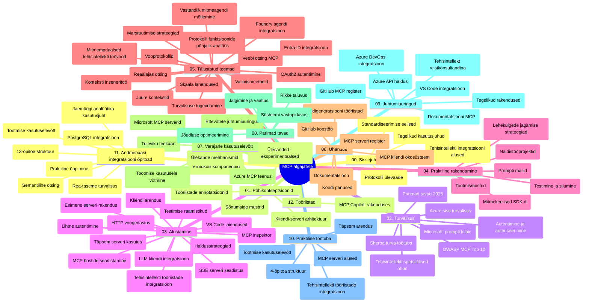

# Mudelikonteksti protokoll (MCP) algajatele – õpperaamat

See õpperaamat annab ülevaate hoidla struktuurist ja sisust "Mudelikonteksti protokoll (MCP) algajatele" õppekava jaoks. Kasutage seda juhendit, et hoidlas efektiivselt navigeerida ja kasutada kõiki saadaolevaid ressursse.

## Hoidla ülevaade

Mudelikonteksti protokoll (MCP) on standardiseeritud raamistik tehisintellekti mudelite ja kliendirakenduste vaheliseks suhtluseks. Algupäraselt lõi selle Anthropic, nüüd hooldab MCPd laiem kogukond ametliku GitHubi organisatsiooni kaudu. See hoidla pakub põhjalikku õppekava praktiliste koodinäidete ning C#, Java, JavaScripti, Pythoni ja TypeScripti keeltega, mis on mõeldud tehisintellekti arendajatele, süsteemiarhitektidele ja tarkvarainseneridele.

## Visuaalne õppekava kaart

## Hoidla struktuur

Hoidla on organiseeritud kaheteistkümneks peamiseks osaks, millest igaüks keskendub MCP erinevatele aspektidele:

1. **Sissejuhatus (00-Introduction/)**
   - Mudelikonteksti protokolli ülevaade
   - Miks on standardiseerimine AI torujuhtmetes oluline
   - Praktilised kasutusjuhtumid ja eelised

2. **Põhikontseptsioonid (01-CoreConcepts/)**
   - Kliendi-serveri arhitektuur
   - Olulised protokolli komponendid
   - Sõnumivahetuse mustrid MCPs
   - Tulevikku vaatamine: [Mis MCP-s muutub: 2026-07-28 versiooni kandidaat](./01-CoreConcepts/mcp-2026-07-28-release-candidate.md) — olekuvaba protokolli süda, laiendusraamistik ning juurpõhiste/Sampling/Logimise eemaldamise ootused järgmisel spetsifikatsiooni versioonil

3. **Turvalisus (02-Security/)**
   - MCP-põhiste süsteemide turvaohtud
   - Parimad tavad implementeerimise kaitsmiseks
   - Autentimise ja autoriseerimise strateegiad
   - **Kõikehõlmav turvalisuse dokumentatsioon**:
     - MCP turvalisuse parimad praktikad 2025
     - Azure Sisu turvalisuse kasutuselevõtujuhend
     - MCP turvakontrollid ja meetodid
     - MCP parimate tavade kiire ülevaade
   - **Olulised turvalisuse teemad**:
     - Käskluste süstimine ja tööriistade mürgitamise rünnakud
     - Sessiooni kaaperdamine ja segadusseajamise probleemid
     - Tokeni edasiandmise nõrkused
     - Liiga ulatuslikud õigused ja juurdepääsu kontroll
     - Tarneahela turvalisus tehisintellekti komponentide jaoks
     - Microsofti käskluskaitsed integratsioon

4. **Alustamine (03-GettingStarted/)**
   - Keskkonna seadistamine ja konfiguratsioon
   - Põhiliste MCP serverite ja klientide loomine
   - Integreerimine olemasolevate rakendustega
   - Sisaldab alajaotusi:
     - Esimene serveri implementatsioon
     - Kliendi arendamine
     - LLM kliendi integreerimine
     - VS Code integreerimine
     - Server-Sent Events (SSE) server
     - Täiustatud serveri kasutus
     - HTTP voogesitus
     - AI komplekti integratsioon
     - Testimise strateegiad
     - Rakendamise juhendid

5. **Praktiline rakendamine (04-PracticalImplementation/)**
   - SDK-de kasutamine erinevates programmeerimiskeeltes
   - Silumine, testimine ja valideerimise tehnikad
   - Taaskasutatavate käskluse mallide ja töövoogude loomine
   - Näidete projektid koos implementeerimisega

6. **Täiustatud teemad (05-AdvancedTopics/)**
   - Konteksti insenerimise tehnikad
   - Foundry agendi integratsioon
   - Multi-modaalsed tehisintellekti töövood
   - OAuth2 autentimise demo
   - Reaalajas otsinguvõimalused
   - Reaalajas voogedastus
   - Juurekonkesti implementeerimine
   - Marsruutimise strateegiad
   - Võtete proovid
   - Skaalumise lähenemised
   - Turvalisuse kaalutlused
   - Entra ID turvaintegratsioon
   - Veebipõhine otsing
   - Vastandlik multi-agent arutelu (debattimismustrid)

7. **Kogukonna panused (06-CommunityContributions/)**
   - Koodi ja dokumentatsiooni panustamine
   - Koostöö GitHubi kaudu
   - Kogukonnapõhised täiustused ja tagasiside
   - Mitmesuguste MCP klientide kasutamine (Claude Desktop, Cline, VSCode)
   - Populaarsete MCP serveritega töötamine, sh pildigeneratsioon

8. **Varajaste rakenduste õppetunnid (07-LessonsfromEarlyAdoption/)**
   - Reaalse maailma rakendused ja edulood
   - MCP-põhiste lahenduste loomine ja juurutamine
   - Trendid ja tuleviku strateegia
   - **Microsofti MCP serverite juhend**: Põhjalik juhend 10 tootmiskõlbuliku Microsofti MCP serveri kohta, nende seas:
     - Microsoft Learn Docs MCP server
     - Azure MCP server (15+ spetsialiseeritud kontrollerit)
     - GitHub MCP server
     - Azure DevOpsi MCP server
     - MarkItDown MCP server
     - SQL Server MCP server
     - Playwright MCP server
     - Dev Box MCP server
     - Microsoft Foundry MCP server
     - Microsoft 365 Agents Toolkit MCP server

9. **Parimad praktikad (08-BestPractices/)**
   - Jõudluse häälestamine ja optimeerimine
   - Vigadele vastupidavate MCP süsteemide disain
   - Testimise ja vastupanuvõime strateegiad

10. **Juhtumiuuringud (09-CaseStudy/)**
    - **Seitse põhjalikku juhtumiuuringut**, mis demonstreerivad MCP mitmekülgsust erinevates olukordades:
    - **Azure AI Reisiaagentid**: Multi-agentide orkestreerimine Azure OpenAI ja AI Search abil
    - **Azure DevOpsi integratsioon**: Töövoogude automatiseerimine YouTube andmete uuendamisega
    - **Reaalajas dokumentide hankimine**: Python konsooliklient HTTP voogedastusega
    - **Interaktiivne õppematerjalide generaator**: Chainlit veebirakendus vestleval AI-l
    - **Toimetajasisene dokumentatsioon**: VS Code integratsioon GitHub Copiloti töövoogudega
    - **Azure API haldus**: Ettevõtte API integratsioon MCP serveri loomisega
    - **GitHub MCP register**: Ökosüsteemi arendamine ja agendi integratsiooniplatvorm
    - Implementatsiooni näited hõlmavad ettevõtte integratsiooni, arendaja tootlikkust ja ökosüsteemi arengut

11. **Praktiline töötuba (10-StreamliningAIWorkflowsBuildingAnMCPServerWithAIToolkit/)**
    - Põhjalik praktiline töötuba, mis ühendab MCP ja AI komplekti
    - Intelligentsed rakendused, mis liidavad AI mudelid ja reaalse maailma tööriistad
    - Praktilised moodulid katavad põhialused, kohandatud serveri arenduse ning tootmise rakendamise strateegiad
    - **Labori struktuur**:
      - Labor 1: MCP serveri põhitõed
      - Labor 2: Täiustatud MCP serveri arendus
      - Labor 3: AI komplekti integratsioon
      - Labor 4: Tootmisesse juurutamine ja skaleerimine
    - Samm-sammult juhendatud laboripõhine õppimine

12. **MCP serveri andmebaasintegreerimise laborid (11-MCPServerHandsOnLabs/)**
    - **Üksikasjalik 13-laboriline õppeprogramm** tootmiskõlblike MCP serverite ehitamiseks koos PostgreSQL integratsiooniga
    - **Reaalse maailma jaekaupluste analüütika rakendus** kasutades Zava Retail juhtumit
    - **Ettevõtte klassi mustrid** nagu ridade taseme turvalisus (RLS), semantiline otsing ja mitme üürniku andmejuurdepääs
    - **Täielik laboristruktuur**:
      - **Laborid 00-03: Alused** — Sissejuhatus, Arhitektuur, Turvalisus, Keskkonna seadistamine
      - **Laborid 04-06: MCP serveri ehitamine** — Andmebaasi disain, MCP serveri implementatsioon, Tööriistade arendus
      - **Laborid 07-09: Täiustatud funktsioonid** — Semantiline otsing, Testimine ja silumine, VS Code integreerimine
      - **Laborid 10-12: Tootmine ja parimad praktikad** — Rakendamine, Jälgimine, Optimeerimine
    - **Kasutatud tehnoloogiad**: FastMCP raamistik, PostgreSQL, Azure OpenAI, Azure Container Apps, Application Insights
    - **Õpitulemused**: Tootmiskõlblikud MCP serverid, andmebaasi integratsiooni mustrid, AI-põhine analüütika, ettevõtte turvalisus

13. **Tööriistad (12-tooling/)**
    - Kuidas kasutada MCP-d Copilot rakenduses ja teistes tööriistades

## Lisamaterjalid

Hoidlas on saadaval tugimaterjalid:

- **Pildid kaustas**: Sisaldab diagramme ja illustratsioone kogu õppekava jooksul
- **Tõlked**: Mitmekeelne tugi dokumentatsiooni automaatsete tõlgetega
- **Ametlikud MCP ressursid**:
  - [MCP dokumentatsioon](https://modelcontextprotocol.io/)
  - [MCP spetsifikatsioon](https://spec.modelcontextprotocol.io/)
  - [MCP GitHub hoidla](https://github.com/modelcontextprotocol)

## Kuidas seda hoidlat kasutada

1. **Samm-sammult õppimine**: Järgige peatükke järjest (00 kuni 11) struktureeritud õppeks.
2. **Keele-spetsiifiline fookus**: Kui olete huvitatud konkreetsest programmeerimiskeelest, uurige prooviprojektide katalooge oma eelistatud keeles.
3. **Praktiline rakendamine**: Alustage „Alustamine“ osast, et seadistada keskkond ja luua esimene MCP server ning klient.
4. **Täiustatud uurimine**: Kui põhialused on selged, sukelduge täiustatud teemadesse teadmiste laiendamiseks.
5. **Kogukonna kaasamine**: Liituge MCP kogukonnaga GitHubi arutelude ja Discordi kanalite kaudu, et suhelda ekspertide ja teiste arendajatega.

## MCP kliendid ja tööriistad

Õppekava hõlmab mitmesuguseid MCP kliente ja tööriistu:

1. **Ametlikud kliendid**:
   - Visual Studio Code
   - MCP Visual Studio Code’is
   - Claude Desktop
   - Claude VSCode’is
   - Claude API

2. **Kogukonna kliendid**:
   - Cline (terminalipõhine)
   - Cursor (koodiredaktor)
   - ChatMCP
   - Windsurf

3. **MCP haldustööriistad**:
   - MCP CLI
   - MCP Manager
   - MCP Linker
   - MCP Router

## Populaarsed MCP serverid

Hoidla tutvustab mitmeid MCP servereid, sealhulgas:

1. **Ametlikud Microsofti MCP serverid**:
   - Microsoft Learn Docs MCP server
   - Azure MCP server (15+ spetsialiseeritud kontrollerit)
   - GitHub MCP server
   - Azure DevOps MCP server
   - MarkItDown MCP server
   - SQL Server MCP server
   - Playwright MCP server
   - Dev Box MCP server
   - Microsoft Foundry MCP server
   - Microsoft 365 Agents Toolkit MCP server

2. **Ametlikud referentsserverid**:
   - Filesystem
   - Fetch
   - Memory
   - Sequential Thinking

3. **Pildigeneratsioon**:
   - Azure OpenAI DALL-E 3
   - Stable Diffusion WebUI
   - Replicate

4. **Arendustööriistad**:
   - Git MCP
   - Terminal Control
   - Code Assistant

5. **Spetsialiseeritud serverid**:
   - Salesforce
   - Microsoft Teams
   - Jira & Confluence

## Panustamine

See hoidla tervitab kogukonna panuseid. Vaadake jaotust Kogukonna panused, et saada juhiseid tõhusaks panustamiseks MCP ökosüsteemi.

----

*See õpperaamat uuendati viimati 5. veebruaril 2026, kajastades viimast MCP spetsifikatsiooni 2025-11-25 ja annab ülevaate hoidlast selle kuupäeva seisuga. Hoidla sisu võib selle kuupäeva järel muutuda.*

*Lisand (2. juuli 2026): lisati õppetund `2026-07-28` MCP spetsifikatsiooni versioonikandidaadi teemal jaotises [01-CoreConcepts](./01-CoreConcepts/mcp-2026-07-28-release-candidate.md); õppekava baasversioon on jätkuvalt 2025-11-25 kuni uus spetsifikatsioon välja lastakse.*

---

<!-- CO-OP TRANSLATOR DISCLAIMER START -->
**Lahtiütlus**:
See dokument on tõlgitud kasutades AI tõlketeenust [Co-op Translator](https://github.com/Azure/co-op-translator). Kuigi me püüdleme täpsuse poole, palun pange tähele, et automatiseeritud tõlgetes võib esineda vigu või ebatäpsusi. Originaaldokument selle emakeeles tuleks pidada autoriteetseks allikaks. Olulise teabe puhul soovitatakse kasutada professionaalset inimtõlget. Me ei vastuta selle tõlkega seotud eksimustest või valesti mõistmistest.
<!-- CO-OP TRANSLATOR DISCLAIMER END -->