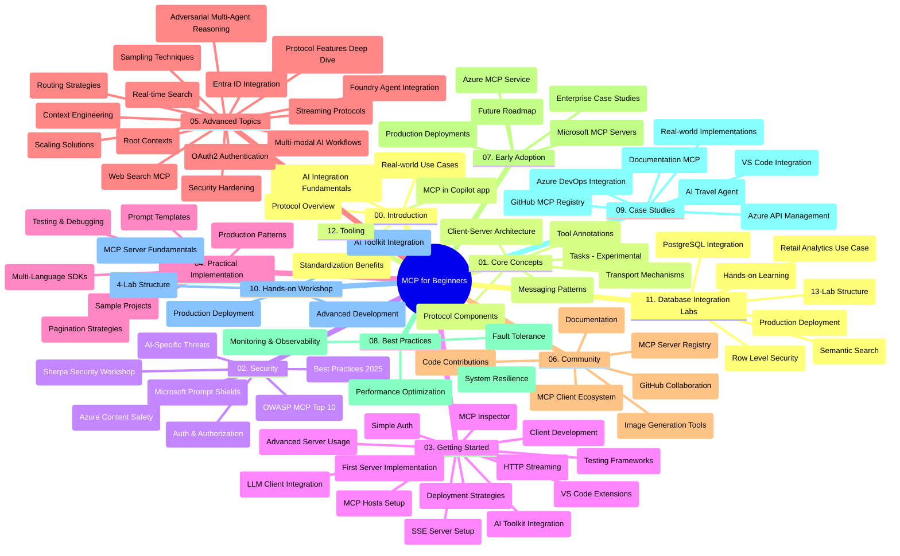

# Mudelikonteksti protokoll (MCP) algajatele - õpi juhend

See õpi juhend annab ülevaate "Mudelikonteksti protokoll (MCP) algajatele" õppekava hoidla struktuurist ja sisust. Kasutage seda juhendit hoidla tõhusaks sirvimiseks ja olemasolevate ressursside maksimaalseks kasutamiseks.

## Hoidla ülevaade

Mudelikonteksti protokoll (MCP) on standardiseeritud raamistik suhtlemiseks tehisintellekti mudelite ja kliendirakenduste vahel. Algupäraselt Anthropicu loodud MCP-d haldab nüüd laiem MCP kogukond ametliku GitHubi organisatsiooni kaudu. See hoidla pakub põhjalikku õppekava praktiliste koodinäidetega C#, Java, JavaScripti, Pythonis ja TypeScriptis, suunatud AI arendajatele, süsteemiarhitektidele ja tarkvarainseneridele.

## Visuaalne õppekava kaart

## Hoidla struktuur

Hoidla on korraldatud kaheteistkümne põhiosana, millest igaüks keskendub MCP erinevatele aspektidele:

1. **Sissejuhatus (00-Introduction/)**
   - Mudelikonteksti protokolli ülevaade
   - Miks standardimine on AI torudes oluline
   - Praktilised kasutusjuhud ja eelised

2. **Põhimõisted (01-CoreConcepts/)**
   - Kliendi-serveri arhitektuur
   - Peamised protokolli komponendid
   - Sõnumivahetuse mustrid MCP-s
   - Praegune spetsifikatsioon: [Mis on MCP-s muutunud: 2026-07-28 spetsifikatsioon](./01-CoreConcepts/mcp-2026-07-28.md) — riistvarata protokolli tuum, laienduste raamistik ja Roots/Sampling/Logging mahajätmised

3. **Turvalisus (02-Security/)**
   - Ohud MCP-põhistes süsteemides
   - Parimad tavad turvaliseks rakendamiseks
   - Autentimises ja autoriseerimises kasutatavad strateegiad
   - Praktiline [CIMD ja DCR autoriseerimise näide](./02-Security/samples/cimd-dcr-auth/README.md)
   - **Üldine turvalisuse dokumentatsioon**:
     - MCP turvalisuse parimad tavad
     - Azure sisu ohutuse juhend
     - MCP turvakontrollid ja tehnikad
     - MCP parimate tavade lühijuhend
   - **Olulised turvateemad**:
     - Kiirjuhendite süstimine ja tööriistamürgituse rünnakud
     - Seansi kaaperdamine ja segadusse aetud asetäitja probleemid
     - Tokeni läbipääsu haavatavused
     - Liigne õiguste ja juurdepääsu kontroll
     - Tarnija ahela turvalisus AI komponentidele
     - Microsoft Prompt Shields integratsioon

4. **Alustamine (03-GettingStarted/)**
   - Keskkonna seadistamine ja konfigureerimine
   - Põhiliste MCP serverite ja klientide loomine
   - Integratsioon olemasolevate rakendustega
   - Sisaldab järgmisi osi:
     - Esimene serveri rakendus
     - Klientide arendus
     - LLM kliendi integratsioon
     - VS Code integratsioon
     - Server-Sent Events (SSE) server
     - Täiustatud serverikasutus
     - HTTP voogedastus
     - AI komplekti integratsioon
     - Testimise strateegiad
     - Deployment juhised

5. **Praktiline rakendus (04-PracticalImplementation/)**
   - SDK-de kasutamine erinevates programmeerimiskeeltes
   - Silumine, testimine ja valideerimise tehnikad
   - Taaskasutatavate kiirjuhendi mallide ja töövoogude loomine
   - Näidisprojektid rakendustega

6. **Edasijõudnud teemad (05-AdvancedTopics/)**
   - Konteksti inseneritehnikad
   - Foundry agendi integratsioon
   - Multi-modaalsed AI töövood
   - OAuth2 autentimisdemonstraatsioonid
   - Reaalajas otsingu võimalused
   - Reaalajas voogedastus
   - Root konteksti rakendused
   - Marsruutimise strateegiad
   - Proovi võtmise tehnikad
   - Skaala lähenemised
   - Turva kaalutlused
   - Entra ID turva integratsioon
   - Veebipõhine otsingu integratsioon
   - Vastandlik mitme agendi arutelu (debati mustrid)

7. **Kogukonna panused (06-CommunityContributions/)**
   - Kuidas panustada koodi ja dokumentatsiooni
   - Koostöö GitHubi kaudu
   - Kogukonna eestvedamisel täiustused ja tagasiside
   - Erinevate MCP klientide kasutamine (Claude Desktop, Cline, VSCode)
   - Töö populaarsete MCP serveritega, kaasa arvatud pildigeneratsioon

8. **Esialgsest rakendusest õpitud õppetunnid (07-LessonsfromEarlyAdoption/)**
   - Reaalmaailma rakendused ja edulood
   - MCP-põhiste lahenduste loomine ja juurutamine
   - Trendide ja tuleviku tee kaart
   - **Microsoft MCP serverite juhend**: Põhjalik juhend 10 tootmiskõlbuliku Microsoft MCP serveri kohta, sealhulgas:
     - Microsoft Learn Docs MCP server
     - Azure MCP server (15+ spetsialiseeritud ühendajat)
     - GitHub MCP server
     - Azure DevOps MCP server
     - MarkItDown MCP server
     - SQL Server MCP server
     - Playwright MCP server
     - Dev Box MCP server
     - Microsoft Foundry MCP server
     - Microsoft 365 Agents Toolkit MCP server

9. **Parimad tavad (08-BestPractices/)**
   - Jõudluse häälestamine ja optimeerimine
   - Veakindlate MCP süsteemide projekteerimine
   - Testimise ja vastupidavuse strateegiad

10. **Juhtumiuuringud (09-CaseStudy/)**
    - **Seitse põhjalikku juhtumiuuringut**, mis demonstreerivad MCP mitmekülgsust erinevates stsenaariumites:
    - **Azure AI Reiseagentuurid**: Mitmeagendi orkestreerimine Azure OpenAI ja AI Otsingu abil
    - **Azure DevOps integratsioon**: töövoogude automatiseerimine YouTube andmete uuendustega
    - **Reaalajas dokumentatsiooni pärimine**: Python'i konsooli klient koos HTTP voogedastusega
    - **Interaktiivne õppekava generaator**: Chainlit veebirakendus jutustava AI-ga
    - **Redaktoris dokumentatsioon**: VS Code integratsioon GitHub Copiloti töövoogudega
    - **Azure API haldus**: Ettevõtte API integratsioon MCP serveri loomisega
    - **GitHub MCP registratuur**: Ökosüsteemi areng ja agentne integratsiooniplatvorm
    - Rakendusnäited hõlmates ettevõtte integratsiooni, arendaja tootlikkust ja ökosüsteemi arengut

11. **Praktiline töötuba (10-StreamliningAIWorkflowsBuildingAnMCPServerWithAIToolkit/)**
    - Põhjalik praktiline töötuba, mis ühendab MCP AI tööriistakomplektiga
    - Tarkade rakenduste loomine, mis ühendavad AI mudelid pärismaailma tööriistadega
    - Praktilised moodulid hõlmates aluseid, kohandatud serveri arendust ja tootmisjuurutamise strateegiaid
    - **Töötoa struktuur**:
      - Töötuba 1: MCP serveri alused
      - Töötuba 2: Täiustatud MCP serveri arendus
      - Töötuba 3: AI tööriistakomplekti integratsioon
      - Töötuba 4: Tootmisjuurutus ja skaleerimine
    - Töötubadepõhine õppe lähenemine samm-sammult juhistega

12. **MCP serveri andmebaasi integratsiooni töökohad (11-MCPServerHandsOnLabs/)**
    - **Põhjalik 13-töötuba õppeprogramm** tootmiskõlblike MCP serverite ehitamiseks PostgreSQL integratsiooniga
    - **Tegeliku maailma jaekaubanduse analüütika rakendus** kasutades Zava Retail kasutusjuhtumit
    - **Ettevõtte taseme mustrid**, sh rea tasandi turvalisus (RLS), semantiline otsing ja mitme kliendi andmejuurdepääs
    - **Täielik töötoastruktuur**:
      - **Töötuba 00-03: Alused** - Sissejuhatus, arhitektuur, turvalisus, keskkonna seadistamine
      - **Töötuba 04-06: MCP serveri ehitus** - Andmebaasi disain, MCP serveri rakendus, tööriistade arendus
      - **Töötuba 07-09: Täiustatud funktsioonid** - Semantiline otsing, testimine ja silumine, VS Code integratsioon
      - **Töötuba 10-12: Tootmine & parimad tavad** - Juurutus, jälgimine, optimeerimine
    - **Kaasatud tehnoloogiad**: FastMCP raamistik, PostgreSQL, Azure OpenAI, Azure Container Apps, Application Insights
    - **Õpitulemused**: Tootmiskõlblikud MCP serverid, andmebaasi integratsioonimustrid, AI-põhine analüütika, ettevõtte turvalisus

13. **Tööriistad (12-tooling/)**
    - Õppige, kuidas kasutada MCP-d Copilot rakenduses ja muudes tööriistades

## Täiendavad ressursid

Hoidla sisaldab toetavaid ressursse:

- **Pildikaust**: Sisaldab skeeme ja illustratsioone, mida kasutatakse kogu õppekavas
- **Tõlked**: Mitmekeelne tugi koos dokumentatsiooni automaatsete tõlgetega
- **Ametlikud MCP ressursid**:
  - [MCP dokumentatsioon](https://modelcontextprotocol.io/)
  - [MCP spetsifikatsioon](https://modelcontextprotocol.io/specification/2026-07-28/)
  - [MCP GitHub hoidlasse](https://github.com/modelcontextprotocol)

## Kuidas seda hoidlat kasutada

1. **Järjestikune õppimine**: Järgige peatükke järjestikku (00 kuni 11) struktureeritud õppimiskogemuse saamiseks.
2. **Keelepõhine fookus**: Kui olete huvitatud konkreetsest programmeerimiskeelest, uurige näidiste kaustu oma eelistatud keeles tehtud rakendustega.
3. **Praktiline rakendus**: Alustage jaotise "Alustamine" alt oma keskkonna seadistamisest ja esimese MCP serveri ning kliendi loomisest.
4. **Edasijõudnud uurimine**: Kui baasteadmised on omandatud, sukelduge edasijõudnud teemadesse oma teadmiste laiendamiseks.
5. **Kogukonnaga suhtlemine**: Liituge MCP kogukonnaga GitHubi arutelude ja Discordi kanalite kaudu, et suhelda ekspertide ja teiste arendajatega.

## MCP kliendid ja tööriistad

Õppekava hõlmab erinevaid MCP kliente ja tööriistu:

1. **Ametlikud kliendid**:
   - Visual Studio Code 
   - MCP Visual Studio Codes
   - Claude Desktop
   - Claude VSCode-is 
   - Claude API

2. **Kogukonna kliendid**:
   - Cline (terminalipõhine)
   - Cursor (koodi redaktor)
   - ChatMCP
   - Windsurf

3. **MCP haldustööriistad**:
   - MCP CLI
   - MCP Manager
   - MCP Linker
   - MCP Router

## Populaarsed MCP serverid

Hoidla tutvustab erinevaid MCP servereid, sealhulgas:

1. **Ametlikud Microsofti MCP serverid**:
   - Microsoft Learn Docs MCP server
   - Azure MCP server (15+ spetsialiseeritud ühendajat)
   - GitHub MCP server
   - Azure DevOps MCP server
   - MarkItDown MCP server
   - SQL Server MCP server
   - Playwright MCP server
   - Dev Box MCP server
   - Microsoft Foundry MCP server
   - Microsoft 365 Agents Toolkit MCP server

2. **Ametlikud referentsserverid**:
   - Failisüsteem
   - Fetch
   - Mälu
   - Järjestikune mõtlemine

3. **Pildigeneratsioon**:
   - Azure OpenAI DALL-E 3
   - Stable Diffusion WebUI
   - Replicate

4. **Arendustööriistad**:
   - Git MCP
   - Terminali juhtimine
   - Koodi assistent

5. **Spetsialiseeritud serverid**:
   - Salesforce
   - Microsoft Teams
   - Jira & Confluence

## Panustamine

See hoidla ootab kogukonna panuseid. Vaadake jaotist Kogukonna panused juhiste saamiseks, kuidas tõhusalt MCP ökosüsteemi panustada.

----

*See õpi juhend uuendati viimati 9. septembril 2026. See kajastab MCP
spetsifikatsiooni `2026-07-28`, praegust protokolli versiooni. Mõned praktilised
näited on selgelt versioonitud `2025-11-25` kuupäevaks, samas kui nende SDK-d ja tööriistad
kasutavad riistvarata protokolli API-sid.*

---

<!-- CO-OP TRANSLATOR DISCLAIMER START -->
**Lahtiütlus**:
See dokument on tõlgitud kasutades AI tõlketeenust [Co-op Translator](https://github.com/Azure/co-op-translator). Kuigi me püüdleme täpsuse poole, palun pange tähele, et automatiseeritud tõlgetes võib esineda vigu või ebatäpsusi. Originaaldokument selle emakeeles tuleks pidada autoriteetseks allikaks. Olulise teabe puhul soovitatakse kasutada professionaalset inimtõlget. Me ei vastuta selle tõlkega seotud eksimustest või valesti mõistmistest.
<!-- CO-OP TRANSLATOR DISCLAIMER END -->