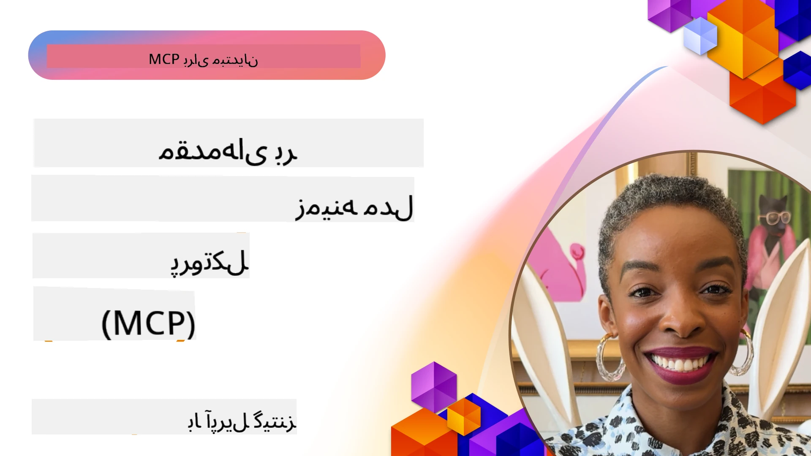
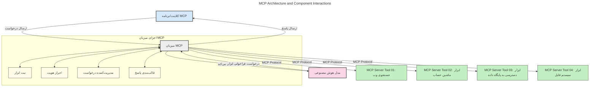
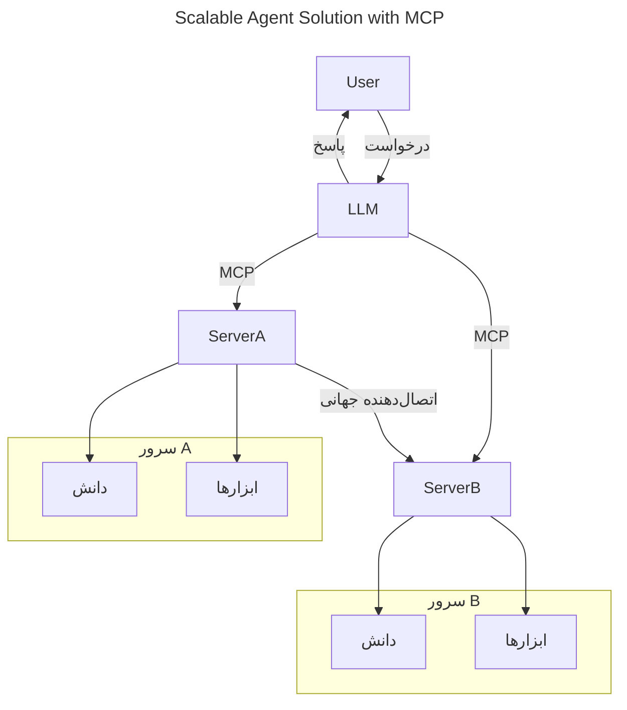
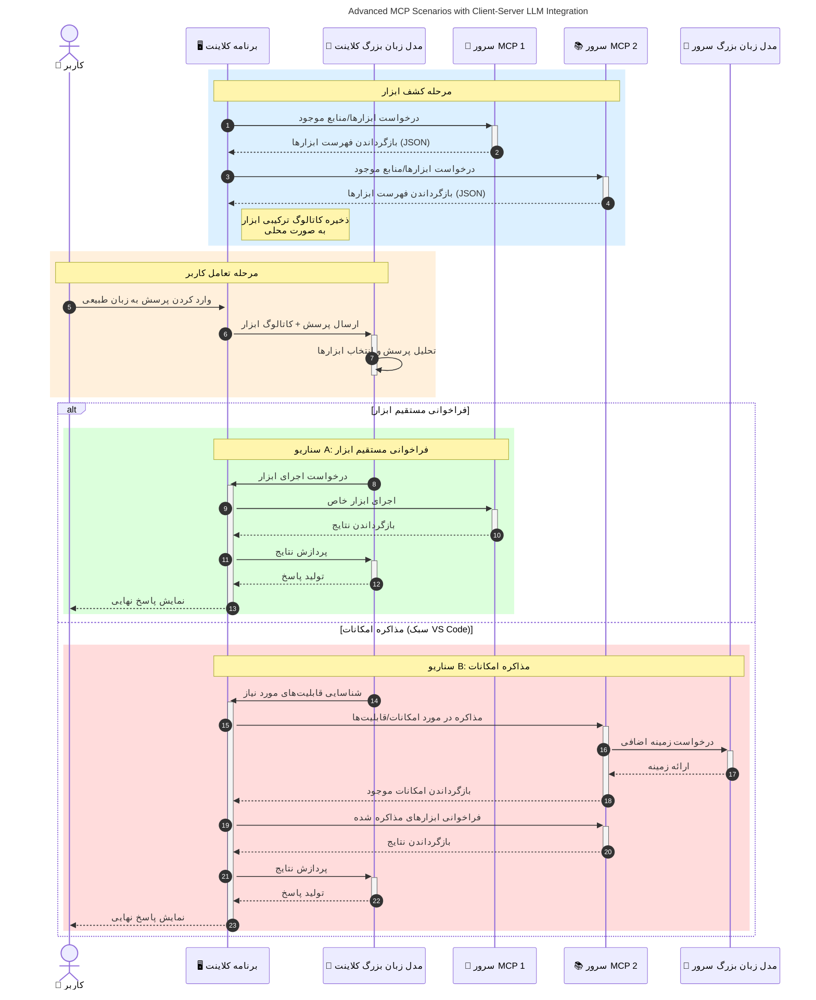

# معرفی پروتکل بستر مدل (MCP): چرا برای برنامه‌های هوش مصنوعی مقیاس‌پذیر اهمیت دارد

_(برای مشاهده ویدئوی این درس روی تصویر بالا کلیک کنید)_

برنامه‌های هوش مصنوعی مولد گامی بزرگ به جلو هستند زیرا معمولاً اجازه می‌دهند کاربر با استفاده از ورودی‌های زبان طبیعی با برنامه تعامل داشته باشد. اما هرچه زمان و منابع بیشتری در چنین برنامه‌هایی سرمایه‌گذاری شود، می‌خواهید مطمئن شوید که می‌توانید عملکردها و منابع را به گونه‌ای آسان ادغام کنید که توسعه‌پذیر باشد، برنامه شما بتواند بیش از یک مدل مختلف را پشتیبانی کند و پیچیدگی‌های مختلف مدل‌ها را مدیریت کند. به طور خلاصه، ساخت برنامه‌های هوش مصنوعی مولد در ابتدا آسان است، اما با رشد و پیچیده‌تر شدن آن‌ها، باید شروع به تعریف معماری کنید و احتمالاً نیاز به تکیه بر یک استاندارد دارید تا مطمئن شوید برنامه‌های شما به روشی سازگار ساخته شده‌اند. اینجا است که MCP وارد میدان می‌شود تا امور را سازماندهی کند و استانداردی فراهم آورد.

---

## **🔍 پروتکل بستر مدل (MCP) چیست؟**

**پروتکل بستر مدل (MCP)** یک **رابط استاندارد و باز** است که به مدل‌های زبان بزرگ (LLM) اجازه می‌دهد به صورت یکپارچه با ابزارهای خارجی، APIها و منابع داده تعامل داشته باشند. این پروتکل معماری یکپارچه‌ای ارائه می‌دهد تا عملکرد مدل‌های هوش مصنوعی را فراتر از داده‌های آموزشی آن‌ها افزایش دهد و سیستم‌های هوش مصنوعی هوشمندتر، مقیاس‌پذیرتر و پاسخگوتر بسازد.

---

## **🎯 اهمیت استانداردسازی در هوش مصنوعی**

همزمان با پیچیده‌تر شدن برنامه‌های هوش مصنوعی مولد، ضروری است که استانداردهایی را اتخاذ کنید که **مقیاس‌پذیری، توسعه‌پذیری، نگهداری آسان،** و **جلوگیری از وابستگی به یک فروشنده خاص** را تضمین کنند. MCP به این نیازها پاسخ می‌دهد با:

- یکپارچه‌سازی ابزار و مدل‌ها
- کاهش راه‌حل‌های سفارشی شکننده و اختصاصی
- اجازه به استفاده همزمان از چند مدل مختلف از فروشندگان مختلف در یک اکوسیستم

**توجه:** در حالی که MCP به عنوان یک استاندارد باز معرفی می‌شود، برنامه‌ای برای استانداردسازی آن از طریق نهادهای استاندارد موجود مانند IEEE، IETF، W3C، ISO یا هر نهاد استاندارد دیگری وجود ندارد.

---

## **📚 اهداف یادگیری**

تا انتهای این مقاله، قادر خواهید بود:

- تعریف **پروتکل بستر مدل (MCP)** و موارد استفاده آن  
- درک چگونگی استانداردسازی ارتباط مدل با ابزار توسط MCP  
- شناسایی اجزای اصلی معماری MCP  
- بررسی کاربردهای واقعی MCP در زمینه‌های سازمانی و توسعه  

---

## **💡 چرا پروتکل بستر مدل (MCP) تحول‌آفرین است**

### **🔗 MCP مشکل تکه‌تکه بودن تعاملات هوش مصنوعی را حل می‌کند**

پیش از MCP، ادغام مدل‌ها با ابزارها نیازمند:

- کدنویسی سفارشی برای هر جفت ابزار-مدل  
- APIهای غیر استاندارد برای هر فروشنده  
- خرابی‌های متعدد به دلیل به‌روزرسانی‌ها  
- مقیاس‌پذیری ضعیف با افزودن ابزارهای بیشتر  

### **✅ مزایای استانداردسازی MCP**

| **مزیت**               | **توضیحات**                                                                    |
|-----------------------|--------------------------------------------------------------------------------|
| تعامل‌پذیری            | مدل‌های LLM به صورت یکپارچه با ابزارهای فروشندگان مختلف کار می‌کنند         |
| یکنواختی               | رفتار یکنواخت در سراسر پلتفرم‌ها و ابزارها                                    |
| قابلیت استفاده مجدد   | ابزارهایی که یکبار ساخته می‌شوند می‌توانند در پروژه‌ها و سیستم‌های مختلف استفاده شوند |
| توسعه سریع‌تر          | کاهش زمان توسعه با استفاده از رابط‌های استاندارد و نصب آسان                  |

---

## **🧱 بررسی معماری سطح بالا MCP**

MCP از مدل **کلاینت-سرور** پیروی می‌کند، که:

- **میزبان‌های MCP** مدل‌های هوش مصنوعی را اجرا می‌کنند  
- **کلاینت‌های MCP** درخواست‌ها را آغاز می‌کنند  
- **سرورهای MCP** بستر، ابزارها و قابلیت‌ها را ارائه می‌دهند  

### **اجزای کلیدی:**

- **منابع** – داده‌های ایستا یا پویا برای مدل‌ها  
- **ورودی‌ها** – جریان‌های کاری از پیش تعریف شده برای تولید هدایت شده  
- **ابزارها** – توابع اجرایی مانند جستجو، محاسبه  
- **نمونه‌گیری** – رفتار عاملی به وسیله تعاملات بازگشتی (در MCP `2026-07-28` منسوخ شده؛ پیاده‌سازی‌های جدید باید مستقیماً با ارائه‌دهنده LLM ادغام شوند)  
    
    
- **درخواست اطلاعات** – درخواست‌های شروع شده توسط سرور برای ورودی کاربر  
- **ریشه‌ها** – مکان‌های سیستم فایل اطلاع‌رسانی مرتبط با سرور (در MCP `2026-07-28` منسوخ شده؛ ترجیحاً پارامترهای ابزار، آدرس‌های منابع یا پیکربندی سرور استفاده شود)  
    
    

### **معماری پروتکل:**

MCP از معماری دو لایه استفاده می‌کند:  
- **لایه داده**: پیام‌های JSON-RPC 2.0، فراداده هر درخواست، کشف و ابتدایی‌های پروتکل  
- **لایه انتقال**: stdio برای فرایندهای محلی و HTTP قابل پخش برای سرورهای راه دور. HTTP قابل پخش می‌تواند از فریم‌بندی SSE برای پاسخ‌های پخش شده استفاده کند، اما انتقال قدیمی HTTP+SSE منسوخ شده است.  
    
    
    

---

## عملکرد سرورهای MCP

سرورهای MCP به صورت زیر کار می‌کنند:

- **جریان درخواست**:  
    1. یک درخواست توسط کاربر نهایی یا نرم‌افزاری که به نمایندگی از او عمل می‌کند، آغاز می‌شود.  
    2. **کلاینت MCP** درخواست را به یک **میزبان MCP** می‌فرستد که مدیریت زمان اجرای مدل هوش مصنوعی را بر عهده دارد.  
    3. **مدل هوش مصنوعی** پیام ورودی کاربر را دریافت کرده و ممکن است برای دسترسی به ابزارها یا داده‌های خارجی از طریق یک یا چند فراخوانی ابزار اقدام کند.  
    4. **میزبان MCP** به جای مدل مستقیماً، با استفاده از پروتکل استاندارد با **سرور(های) MCP** مناسب ارتباط برقرار می‌کند.  
- **کارکردهای میزبان MCP**:  
    - **ثبت ابزارها**: حفظ فهرست ابزارهای در دسترس و قابلیت‌های آن‌ها.  
    - **احراز هویت**: تأیید مجوزهای دسترسی به ابزار.  
    - **مدیریت درخواست‌ها**: پردازش درخواست‌های ورودی ابزار از مدل.  
    - **فرمت‌کننده پاسخ‌ها**: ساختاربندی خروجی‌های ابزار به فرمتی که مدل بتواند بفهمد.  
- **اجرای سرور MCP**:  
    - **میزبان MCP** فراخوانی‌های ابزار را به یک یا چند **سرور MCP** که هرکدام توابع تخصصی مانند جستجو، محاسبات، پرس‌وجوهای پایگاه داده ارائه می‌دهند، هدایت می‌کند.  
    - **سرورهای MCP** عملیات خود را انجام داده و نتایج را در قالبی یکپارچه به **میزبان MCP** بازمی‌گردانند.  
    - **میزبان MCP** این نتایج را قالب‌بندی کرده و به **مدل هوش مصنوعی** منتقل می‌کند.  
- **تکمیل پاسخ**:  
    - **مدل هوش مصنوعی** خروجی ابزارها را در پاسخ نهایی لحاظ می‌کند.  
    - **میزبان MCP** این پاسخ را به **کلاینت MCP** ارسال می‌کند که آن را به کاربر نهایی یا نرم‌افزار فراخواننده تحویل می‌دهد.  
    

## 👨‍💻 چگونه یک سرور MCP بسازیم (با مثال‌ها)

سرورهای MCP به شما اجازه می‌دهند با فراهم کردن داده‌ها و قابلیت‌ها، توانمندی‌های مدل‌های LLM را گسترش دهید.

آماده‌اید امتحان کنید؟ در اینجا SDKهای زبان‌ها و یا پشته‌های مختلف همراه با مثال‌هایی برای ایجاد سرورهای ساده MCP در زبان‌ها و پشته‌های گوناگون آمده است:

- **Python SDK**: https://github.com/modelcontextprotocol/python-sdk  

- **TypeScript SDK**: https://github.com/modelcontextprotocol/typescript-sdk  

- **Java SDK**: https://github.com/modelcontextprotocol/java-sdk  

- **کیت توسعه C#/.NET**: https://github.com/modelcontextprotocol/csharp-sdk

## 🌍 نمونه‌های کاربردی دنیای واقعی برای MCP

MCP دامنه وسیعی از برنامه‌ها را با گسترش قابلیت‌های هوش مصنوعی ممکن می‌سازد:

| **کاربرد**                | **توضیح**                                                                    |
|------------------------------|-------------------------------------------------------------------------------|
| یکپارچه‌سازی داده‌های سازمانی | اتصال مدل‌های زبانی بزرگ به پایگاه‌های داده، CRM یا ابزارهای داخلی           |
| سیستم‌های هوش مصنوعی عامل‌گرا | فعال‌سازی عوامل خودکار با دسترسی به ابزارها و جریان‌های تصمیم‌گیری         |
| برنامه‌های چندرسانه‌ای       | ترکیب ابزارهای متن، تصویر و صدا در یک برنامه یکپارچه هوش مصنوعی             |
| یکپارچه‌سازی داده‌های زمان واقعی | وارد کردن داده‌های زنده در تعاملات هوش مصنوعی برای خروجی‌های دقیق و به‌روز  |

### 🧠 MCP = استاندارد جهانی برای تعاملات هوش مصنوعی

پروتکل مدل کانتکست (MCP) مانند استاندارد USB-C برای اتصال فیزیکی دستگاه‌ها، به عنوان یک استاندارد جهانی برای تعاملات هوش مصنوعی عمل می‌کند. در دنیای هوش مصنوعی، MCP واسطی سازگار فراهم می‌آورد که به مدل‌ها (کلاینت‌ها) اجازه می‌دهد به‌راحتی با ابزارها و ارائه‌دهندگان داده‌های خارجی (سرورها) یکپارچه شوند. این نیاز به پروتکل‌های متنوع و سفارشی برای هر API یا منبع داده را حذف می‌کند.

تحت MCP، ابزار سازگار با MCP (که به عنوان سرور MCP شناخته می‌شود) از یک استاندارد یکنواخت پیروی می‌کند. این سرورها می‌توانند فهرستی از ابزارها یا اقدامات قابل ارائه خود داشته باشند و وقتی یک عامل هوش مصنوعی درخواست می‌دهد، آن‌ها را اجرا کنند. پلتفرم‌های عامل هوش مصنوعی که MCP را پشتیبانی می‌کنند، قادر به کشف ابزارهای موجود در سرورها و فراخوانی آن‌ها از طریق این پروتکل استاندارد هستند.

### 💡 تسهیل دسترسی به دانش

فراتر از ارائه ابزارها، MCP همچنین دسترسی به دانش را تسهیل می‌کند. این امکان را به برنامه‌ها می‌دهد تا زمینه را به مدل‌های زبانی بزرگ (LLMها) بدهند با اتصال به منابع داده مختلف. به عنوان مثال، یک سرور MCP ممکن است نمایانگر مخزن اسناد یک شرکت باشد که به عوامل اجازه می‌دهد اطلاعات مرتبط را به تقاضا بازیابی کنند. سرور دیگری می‌تواند اقدامات خاصی مانند ارسال ایمیل یا به‌روزرسانی رکوردها را انجام دهد. از دیدگاه عامل، این‌ها فقط ابزارهایی هستند که می‌تواند استفاده کند — بعضی ابزارها داده (زمینه دانش) را برمی‌گردانند و برخی دیگر اقدامات را انجام می‌دهند. MCP هر دو را به طور مؤثر مدیریت می‌کند.

عامل متصل به یک سرور MCP به طور خودکار قابلیت‌ها و داده‌های قابل دسترسی سرور را از طریق قالب استاندارد می‌آموزد. این استانداردسازی امکان در دسترس بودن دینامیک ابزار را فراهم می‌کند. برای مثال، افزودن یک سرور MCP جدید به سیستم عامل باعث می‌شود که عملکردهای آن فوراً قابل استفاده باشند بدون نیاز به سفارشی‌سازی بیشتر دستورالعمل‌های عامل.

این یکپارچه‌سازی ساده‌شده با روند نشان‌داده شده در نمودار زیر همسو است، جایی که سرورها هم ابزار و هم دانش را فراهم می‌کنند و همکاری بی‌وقفه بین سیستم‌ها را تضمین می‌کنند.

### 👉 مثال: راه‌حل عامل مقیاس‌پذیر

کانکتور جهانی به سرورهای MCP امکان می‌دهد با هم ارتباط برقرار کنند و قابلیت‌های یکدیگر را به اشتراک بگذارند، به طوری که ServerA می‌تواند وظایف را به ServerB واگذار کند یا به ابزارها و دانش آن دسترسی یابد. این قابلیت فدراسیون ابزارها و داده‌ها را در میان سرورها ممکن می‌سازد و از معماری‌های عامل مقیاس‌پذیر و مدولار پشتیبانی می‌کند. به دلیل استانداردسازی ارائه ابزار توسط MCP، عوامل می‌توانند ابزارهای موجود را به صورت پویا کشف کنند و درخواست‌ها را بین سرورها بدون نیاز به یکپارچه‌سازی سخت‌کد شده هدایت کنند.

فدراسیون ابزار و دانش: ابزارها و داده‌ها می‌توانند در میان سرورها در دسترس باشند که امکان معماری‌های عامل‌گرا مقیاس‌پذیر و مدولار بیشتری را فراهم می‌آورد.

### 🔄 سناریوهای پیشرفته MCP با یکپارچه‌سازی LLM سمت کلاینت

فراتر از معماری پایه MCP، سناریوهای پیشرفته‌ای وجود دارد که هم کلاینت و هم سرور LLM دارند و تعاملات پیچیده‌تری را ممکن می‌سازند. در نمودار زیر، **اپلیکیشن کلاینت** می‌تواند یک IDE باشد با تعدادی از ابزارهای MCP که برای کاربر توسط LLM در دسترس هستند:

## 🔐 مزایای عملی MCP

در اینجا مزایای عملی استفاده از MCP آمده است:

- **تازگی**: مدل‌ها می‌توانند به اطلاعات به‌روز فراتر از داده‌های آموزشی خود دسترسی داشته باشند
- **افزایش قابلیت‌ها**: مدل‌ها می‌توانند از ابزارهای تخصصی برای وظایفی که آموزش ندیده‌اند بهره ببرند
- **کاهش توهمات**: منابع داده خارجی پایه‌های واقعی فراهم می‌کنند
- **حریم خصوصی**: داده‌های حساس می‌توانند در محیط‌های ایمن باقی بمانند به جای اینکه در دستورات جایگذاری شوند

## 📌 نکات کلیدی

نکات کلیدی برای استفاده از MCP عبارتند از:

- **MCP** نحوه تعامل مدل‌های هوش مصنوعی با ابزارها و داده‌ها را استاندارد می‌کند
- ترویج می‌کند **گسترش‌پذیری، سازگاری و همکاری‌پذیری**
- MCP کمک می‌کند **زمان توسعه را کاهش، قابلیت اطمینان را بهبود و قابلیت‌های مدل را گسترش دهد**
- معماری کلاینت-سرور **امکان برنامه‌های هوش مصنوعی انعطاف‌پذیر و گسترش‌پذیر را فراهم می‌کند**

## 🧠 تمرین

به یک برنامه هوش مصنوعی که می‌خواهید بسازید فکر کنید.

- چه **ابزارها یا داده‌های خارجی** می‌توانند قابلیت‌های آن را افزایش دهند؟
- MCP چگونه ممکن است یکپارچه‌سازی را **ساده‌تر و قابل اطمینان‌تر** کند؟

## منابع اضافی

- [مخزن GitHub MCP](https://github.com/modelcontextprotocol)

## بعدی چیست

بعدی: [فصل 1: مفاهیم پایه](../01-CoreConcepts/README.md)

---

<!-- CO-OP TRANSLATOR DISCLAIMER START -->
**سلب مسئولیت**:
این سند با استفاده از سرویس ترجمه هوش مصنوعی [Co-op Translator](https://github.com/Azure/co-op-translator) ترجمه شده است. در حالی که ما در تلاش برای دقت هستیم، لطفاً توجه داشته باشید که ترجمه‌های خودکار ممکن است شامل خطاها یا نادرستی‌هایی باشند. سند اصلی به زبان مادری خود باید به عنوان منبع معتبر در نظر گرفته شود. برای اطلاعات حیاتی، ترجمه حرفه‌ای انسانی توصیه می‌شود. ما در قبال هرگونه سوء تفاهم یا برداشت نادرست ناشی از استفاده از این ترجمه مسئولیتی نداریم.
<!-- CO-OP TRANSLATOR DISCLAIMER END -->