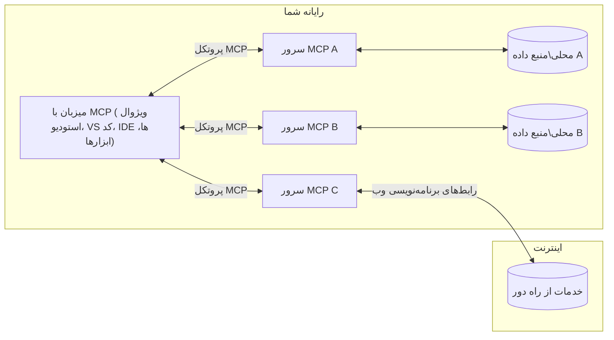

# مفاهیم اصلی MCP: تسلط بر پروتکل زمینه مدل برای یکپارچه‌سازی هوش مصنوعی

[](https://youtu.be/earDzWGtE84)

_(برای مشاهده ویدیو این درس روی تصویر بالا کلیک کنید)_

[پروتکل زمینه مدل (MCP)](https://github.com/modelcontextprotocol) یک چارچوب قدرتمند و استاندارد شده است که ارتباط بین مدل‌های زبان بزرگ (LLM) و ابزارها، برنامه‌ها و منابع داده خارجی را بهینه می‌کند.  
این راهنما شما را با مفاهیم اصلی MCP آشنا می‌کند. شما با معماری کلاینت-سرور، اجزای اساسی، مکانیزم‌های ارتباطی و بهترین شیوه‌های پیاده‌سازی آن آشنا خواهید شد.

- **رضایت صریح کاربر**: همه دسترسی‌ها و عملیات داده‌ای نیازمند تأیید صریح کاربر قبل از اجرا هستند. کاربران باید به وضوح بدانند چه داده‌هایی دسترسی خواهند داشت و چه اقداماتی انجام خواهد شد، با کنترل دقیق بر مجوزها و اختیارات.

- **حفاظت از حریم خصوصی داده‌ها**: داده‌های کاربر تنها با رضایت صریح افشا می‌شوند و باید در طول کل چرخه تعامل با کنترل‌های دسترسی قوی محافظت شوند. پیاده‌سازی‌ها باید از انتقال غیرمجاز داده جلوگیری کرده و مرزهای سختگیرانه حریم خصوصی را حفظ کنند.

- **ایمنی اجرای ابزارها**: هر فراخوانی ابزار نیازمند رضایت صریح کاربر با درک واضح از عملکرد، پارامترها و تأثیر احتمالی ابزار است. مرزهای امنیتی قوی باید از اجرای ناخواسته، ناایمن یا مخرب ابزار جلوگیری کنند.

- **امنیت لایه انتقال**: همه کانال‌های ارتباطی باید از مکانیزم‌های رمزنگاری و احراز هویت مناسب استفاده کنند. ارتباطات از راه دور باید پروتکل‌های انتقال امن و مدیریت صحیح اعتبارنامه‌ها را پیاده‌سازی کنند.

#### راهنمای پیاده‌سازی:

- **مدیریت مجوزها**: سیستم‌های مجوز دقیق پیاده‌سازی کنید که به کاربران اجازه کنترل سرورها، ابزارها و منابع قابل دسترسی را بدهد  
- **احراز هویت و مجوزدهی**: از روش‌های احراز هویت امن (OAuth، کلیدهای API) با مدیریت مناسب توکن و انقضا استفاده کنید  
- **اعتبارسنجی ورودی**: همه پارامترها و ورودی‌های داده را بر اساس طرح‌های تعریف شده اعتبارسنجی کنید تا از حملات تزریق جلوگیری شود  
- **ثبت گزارش‌ها**: لاگ‌های جامع از همه عملیات برای نظارت امنیتی و انطباق نگهداری کنید

## مرور کلی

این درس معماری بنیادی و اجزایی که اکوسیستم پروتکل زمینه مدل (MCP) را تشکیل می‌دهند بررسی می‌کند. شما با معماری کلاینت-سرور، اجزای کلیدی و مکانیزم‌های ارتباطی که تعاملات MCP را ممکن می‌سازند آشنا خواهید شد.

## اهداف کلیدی یادگیری

تا پایان این درس، شما:

- معماری کلاینت-سرور MCP را درک خواهید کرد.  
- نقش‌ها و مسئولیت‌های میزبان‌ها، کلاینت‌ها و سرورها را شناسایی خواهید کرد.  
- ویژگی‌های اصلی که MCP را به یک لایه یکپارچه‌سازی انعطاف‌پذیر تبدیل می‌کند تحلیل خواهید کرد.  
- خواهید آموخت که چگونه اطلاعات در اکوسیستم MCP جریان می‌یابد.  
- از طریق مثال‌های کد در .NET، جاوا، پایتون و جاوااسکریپت بینش‌های عملی کسب خواهید کرد.

## معماری MCP: نگاهی عمیق‌تر

اکوسیستم MCP بر اساس مدل کلاینت-سرور ساخته شده است. این ساختار مدولار به برنامه‌های هوش مصنوعی اجازه می‌دهد به طور مؤثر با ابزارها، پایگاه‌های داده، APIها و منابع زمینه‌ای تعامل داشته باشند. بیایید این معماری را به اجزای اصلی آن تقسیم کنیم.

در هسته خود، MCP از معماری کلاینت-سرور پیروی می‌کند که در آن یک برنامه میزبان می‌تواند به چندین سرور متصل شود:


- **میزبان‌های MCP**: برنامه‌هایی مانند VSCode، Claude Desktop، IDEها یا ابزارهای هوش مصنوعی که می‌خواهند از طریق MCP به داده‌ها دسترسی داشته باشند  
- **کلاینت‌های MCP**: کلاینت‌های پروتکل که ارتباط ۱:۱ با سرورها را حفظ می‌کنند  
- **سرورهای MCP**: برنامه‌های سبک‌وزنی که هر کدام قابلیت‌های خاصی را از طریق پروتکل استاندارد شده زمینه مدل ارائه می‌دهند  
- **منابع داده محلی**: فایل‌ها، پایگاه‌های داده و خدمات کامپیوتر شما که سرورهای MCP می‌توانند به صورت امن به آن‌ها دسترسی داشته باشند  
- **خدمات راه دور**: سیستم‌های خارجی که از طریق اینترنت در دسترس هستند و سرورهای MCP می‌توانند از طریق APIها به آن‌ها متصل شوند.

پروتکل MCP یک استاندارد در حال تکامل است که از نسخه‌بندی مبتنی بر تاریخ (فرمت YYYY-MM-DD) استفاده می‌کند. نسخه فعلی پروتکل **2025-11-25** است. می‌توانید آخرین به‌روزرسانی‌ها را در [مشخصات پروتکل](https://modelcontextprotocol.io/specification/2025-11-25/) مشاهده کنید.

### ۱. میزبان‌ها

در پروتکل زمینه مدل (MCP)، **میزبان‌ها** برنامه‌های هوش مصنوعی هستند که به عنوان رابط اصلی کاربران با پروتکل عمل می‌کنند. میزبان‌ها اتصال به چندین سرور MCP را با ایجاد کلاینت‌های MCP اختصاصی برای هر اتصال سرور هماهنگ و مدیریت می‌کنند. نمونه‌هایی از میزبان‌ها عبارتند از:

- **برنامه‌های هوش مصنوعی**: Claude Desktop، Visual Studio Code، Claude Code  
- **محیط‌های توسعه**: IDEها و ویرایشگرهای کد با یکپارچه‌سازی MCP  
- **برنامه‌های سفارشی**: عوامل و ابزارهای هوش مصنوعی ساخته شده برای هدف خاص

**میزبان‌ها** برنامه‌هایی هستند که تعاملات مدل هوش مصنوعی را هماهنگ می‌کنند. آن‌ها:

- **هماهنگی مدل‌های هوش مصنوعی**: اجرای مدل‌های LLM یا تعامل با آن‌ها برای تولید پاسخ‌ها و هماهنگی جریان‌های کاری هوش مصنوعی  
- **مدیریت اتصال کلاینت‌ها**: ایجاد و نگهداری یک کلاینت MCP برای هر اتصال سرور MCP  
- **کنترل رابط کاربری**: مدیریت جریان گفتگو، تعاملات کاربر و نمایش پاسخ‌ها  
- **اجرای امنیت**: کنترل مجوزها، محدودیت‌های امنیتی و احراز هویت  
- **مدیریت رضایت کاربر**: مدیریت تأیید کاربر برای اشتراک‌گذاری داده‌ها و اجرای ابزارها

### ۲. کلاینت‌ها

**کلاینت‌ها** اجزای حیاتی هستند که ارتباطات اختصاصی یک به یک بین میزبان‌ها و سرورهای MCP را حفظ می‌کنند. هر کلاینت MCP توسط میزبان برای اتصال به یک سرور MCP خاص ایجاد می‌شود تا کانال‌های ارتباطی سازمان‌یافته و امن را تضمین کند. چندین کلاینت به میزبان‌ها امکان اتصال همزمان به چندین سرور را می‌دهد.

**کلاینت‌ها** اجزای اتصال‌دهنده درون برنامه میزبان هستند. آن‌ها:

- **ارتباط پروتکل**: ارسال درخواست‌های JSON-RPC 2.0 به سرورها با پرامپت‌ها و دستورالعمل‌ها  
- **مذاکره قابلیت‌ها**: مذاکره ویژگی‌های پشتیبانی شده و نسخه‌های پروتکل با سرورها در زمان راه‌اندازی  
- **اجرای ابزار**: مدیریت درخواست‌های اجرای ابزار از مدل‌ها و پردازش پاسخ‌ها  
- **به‌روزرسانی‌های بلادرنگ**: مدیریت اعلان‌ها و به‌روزرسانی‌های بلادرنگ از سرورها  
- **پردازش پاسخ**: پردازش و قالب‌بندی پاسخ‌های سرور برای نمایش به کاربران

### ۳. سرورها

**سرورها** برنامه‌هایی هستند که زمینه، ابزارها و قابلیت‌ها را به کلاینت‌های MCP ارائه می‌دهند. آن‌ها می‌توانند به صورت محلی (روی همان دستگاه میزبان) یا از راه دور (روی پلتفرم‌های خارجی) اجرا شوند و مسئول رسیدگی به درخواست‌های کلاینت و ارائه پاسخ‌های ساختاریافته هستند. سرورها عملکردهای خاصی را از طریق پروتکل استاندارد شده زمینه مدل ارائه می‌دهند.

**سرورها** خدماتی هستند که زمینه و قابلیت‌ها را فراهم می‌کنند. آن‌ها:

- **ثبت ویژگی‌ها**: ثبت و ارائه ابتدایی‌های موجود (منابع، پرامپت‌ها، ابزارها) به کلاینت‌ها  
- **پردازش درخواست‌ها**: دریافت و اجرای فراخوانی‌های ابزار، درخواست‌های منابع و درخواست‌های پرامپت از کلاینت‌ها  
- **ارائه زمینه**: فراهم کردن اطلاعات و داده‌های زمینه‌ای برای بهبود پاسخ‌های مدل  
- **مدیریت وضعیت**: نگهداری وضعیت جلسه و مدیریت تعاملات حالت‌دار در صورت نیاز  
- **اعلان‌های بلادرنگ**: ارسال اعلان‌ها درباره تغییرات قابلیت‌ها و به‌روزرسانی‌ها به کلاینت‌های متصل

سرورها می‌توانند توسط هر کسی برای گسترش قابلیت‌های مدل با عملکرد تخصصی توسعه یابند و از هر دو سناریوی استقرار محلی و راه دور پشتیبانی می‌کنند.

### ۴. ابتدایی‌های سرور

سرورها در پروتکل زمینه مدل (MCP) سه **ابتدایی** اصلی ارائه می‌دهند که بلوک‌های بنیادی تعاملات غنی بین کلاینت‌ها، میزبان‌ها و مدل‌های زبانی را تعریف می‌کنند. این ابتدایی‌ها انواع اطلاعات زمینه‌ای و اقدامات موجود از طریق پروتکل را مشخص می‌کنند.

سرورهای MCP می‌توانند هر ترکیبی از سه ابتدایی اصلی زیر را ارائه دهند:

#### منابع

**منابع** منابع داده‌ای هستند که اطلاعات زمینه‌ای را به برنامه‌های هوش مصنوعی ارائه می‌دهند. آن‌ها نمایانگر محتوای ایستا یا پویا هستند که می‌توانند درک مدل و تصمیم‌گیری را بهبود بخشند:

- **داده‌های زمینه‌ای**: اطلاعات ساختاریافته و زمینه برای مصرف مدل هوش مصنوعی  
- **پایگاه‌های دانش**: مخازن اسناد، مقالات، راهنماها و مقالات پژوهشی  
- **منابع داده محلی**: فایل‌ها، پایگاه‌های داده و اطلاعات سیستم محلی  
- **داده‌های خارجی**: پاسخ‌های API، خدمات وب و داده‌های سیستم‌های راه دور  
- **محتوای پویا**: داده‌های بلادرنگ که بر اساس شرایط خارجی به‌روزرسانی می‌شوند

منابع با URI شناسایی می‌شوند و از طریق متدهای `resources/list` برای کشف و `resources/read` برای بازیابی پشتیبانی می‌شوند:

```text
file://documents/project-spec.md
database://production/users/schema
api://weather/current
```

#### پرامپت‌ها

**پرامپت‌ها** قالب‌های قابل استفاده مجددی هستند که به ساختاردهی تعاملات با مدل‌های زبانی کمک می‌کنند. آن‌ها الگوهای تعاملی استاندارد و جریان‌های کاری قالب‌بندی شده را فراهم می‌کنند:

- **تعاملات مبتنی بر قالب**: پیام‌ها و شروع‌کننده‌های گفتگو از پیش ساختار یافته  
- **قالب‌های جریان کاری**: توالی‌های استاندارد برای وظایف و تعاملات رایج  
- **مثال‌های چندنمونه‌ای**: قالب‌های مبتنی بر مثال برای آموزش مدل  
- **پرامپت‌های سیستمی**: پرامپت‌های بنیادی که رفتار و زمینه مدل را تعریف می‌کنند  
- **قالب‌های پویا**: پرامپت‌های پارامتردهی شده که به زمینه‌های خاص سازگار می‌شوند

پرامپت‌ها از جایگزینی متغیر پشتیبانی می‌کنند و می‌توان آن‌ها را از طریق `prompts/list` کشف و با `prompts/get` بازیابی کرد:

```markdown
Generate a {{task_type}} for {{product}} targeting {{audience}} with the following requirements: {{requirements}}
```

#### ابزارها

**ابزارها** توابع اجرایی هستند که مدل‌های هوش مصنوعی می‌توانند برای انجام اقدامات خاص فراخوانی کنند. آن‌ها "افعال" اکوسیستم MCP را نمایندگی می‌کنند و به مدل‌ها امکان تعامل با سیستم‌های خارجی را می‌دهند:

- **توابع اجرایی**: عملیات مجزایی که مدل‌ها می‌توانند با پارامترهای خاص فراخوانی کنند  
- **یکپارچه‌سازی سیستم خارجی**: فراخوانی API، پرس‌وجوی پایگاه داده، عملیات فایل، محاسبات  
- **هویت منحصر به فرد**: هر ابزار نام، توضیح و طرح پارامتر متمایزی دارد  
- **ورودی/خروجی ساختاریافته**: ابزارها پارامترهای اعتبارسنجی شده را می‌پذیرند و پاسخ‌های ساختاریافته و نوع‌دار بازمی‌گردانند  
- **قابلیت‌های عملیاتی**: به مدل‌ها امکان انجام اقدامات دنیای واقعی و بازیابی داده‌های زنده را می‌دهند

ابزارها با JSON Schema برای اعتبارسنجی پارامتر تعریف می‌شوند و از طریق `tools/list` کشف و با `tools/call` اجرا می‌شوند:

```typescript
server.tool(
  "search_products", 
  {
    query: z.string().describe("Search query for products"),
    category: z.string().optional().describe("Product category filter"),
    max_results: z.number().default(10).describe("Maximum results to return")
  }, 
  async (params) => {
    // جستجو را اجرا کرده و نتایج ساختاریافته را بازگردانید
    return await productService.search(params);
  }
);
```

## ابتدایی‌های کلاینت

در پروتکل زمینه مدل (MCP)، **کلاینت‌ها** می‌توانند ابتدایی‌هایی ارائه دهند که به سرورها اجازه می‌دهد قابلیت‌های اضافی را از برنامه میزبان درخواست کنند. این ابتدایی‌های سمت کلاینت امکان پیاده‌سازی‌های سرور غنی‌تر و تعاملی‌تر را فراهم می‌کنند که می‌توانند به قابلیت‌های مدل هوش مصنوعی و تعاملات کاربر دسترسی داشته باشند.

### نمونه‌گیری

**نمونه‌گیری** به سرورها اجازه می‌دهد تا تکمیل‌های مدل زبانی را از برنامه هوش مصنوعی کلاینت درخواست کنند. این ابتدایی به سرورها امکان دسترسی به قابلیت‌های LLM را بدون جاسازی وابستگی‌های مدل خود می‌دهد:

- **دسترسی مستقل از مدل**: سرورها می‌توانند بدون گنجاندن SDKهای LLM یا مدیریت دسترسی مدل، تکمیل‌ها را درخواست کنند  
- **هوش مصنوعی آغاز شده توسط سرور**: به سرورها امکان تولید خودکار محتوا با استفاده از مدل هوش مصنوعی کلاینت را می‌دهد  
- **تعاملات بازگشتی LLM**: از سناریوهای پیچیده‌ای که سرورها نیاز به کمک هوش مصنوعی برای پردازش دارند پشتیبانی می‌کند  
- **تولید محتوای پویا**: به سرورها اجازه می‌دهد پاسخ‌های زمینه‌ای با استفاده از مدل میزبان ایجاد کنند

نمونه‌گیری از طریق متد `sampling/complete` آغاز می‌شود، جایی که سرورها درخواست‌های تکمیل را به کلاینت‌ها ارسال می‌کنند.

### استخراج اطلاعات

**استخراج اطلاعات** به سرورها اجازه می‌دهد تا از طریق رابط کلاینت اطلاعات اضافی یا تأییدیه از کاربران درخواست کنند:

- **درخواست ورودی کاربر**: سرورها می‌توانند هنگام نیاز به اجرای ابزار اطلاعات اضافی درخواست کنند  
- **دیالوگ‌های تأیید**: درخواست تأیید کاربر برای عملیات حساس یا تأثیرگذار  
- **جریان‌های کاری تعاملی**: به سرورها امکان ایجاد تعاملات گام به گام با کاربر را می‌دهد  
- **جمع‌آوری پارامترهای پویا**: جمع‌آوری پارامترهای گمشده یا اختیاری در حین اجرای ابزار

درخواست‌های استخراج اطلاعات با استفاده از متد `elicitation/request` برای جمع‌آوری ورودی کاربر از طریق رابط کلاینت انجام می‌شود.

### ثبت گزارش

**ثبت گزارش** به سرورها اجازه می‌دهد پیام‌های لاگ ساختاریافته را برای کلاینت‌ها ارسال کنند تا برای اشکال‌زدایی، نظارت و دید عملیاتی استفاده شود:

- **پشتیبانی اشکال‌زدایی**: به سرورها امکان ارائه لاگ‌های دقیق اجرای عملیات برای رفع اشکال می‌دهد  
- **نظارت عملیاتی**: ارسال به‌روزرسانی‌های وضعیت و معیارهای عملکرد به کلاینت‌ها  
- **گزارش خطا**: ارائه زمینه خطای دقیق و اطلاعات تشخیصی  
- **ردیابی حسابرسی**: ایجاد لاگ‌های جامع از عملیات و تصمیمات سرور

پیام‌های ثبت گزارش به کلاینت‌ها ارسال می‌شوند تا شفافیت در عملیات سرور فراهم شده و اشکال‌زدایی تسهیل شود.

## جریان اطلاعات در MCP

پروتکل زمینه مدل (MCP) جریان ساختاریافته‌ای از اطلاعات بین میزبان‌ها، کلاینت‌ها، سرورها و مدل‌ها تعریف می‌کند. درک این جریان به روشن شدن نحوه پردازش درخواست‌های کاربر و چگونگی یکپارچه‌سازی ابزارها و داده‌های خارجی در پاسخ‌های مدل کمک می‌کند.

- **میزبان اتصال را آغاز می‌کند**  
  برنامه میزبان (مانند IDE یا رابط چت) اتصال به یک سرور MCP را برقرار می‌کند، معمولاً از طریق STDIO، WebSocket یا یک پروتکل انتقال پشتیبانی شده دیگر.

- **مذاکره قابلیت‌ها**  
  کلاینت (که در میزبان جاسازی شده) و سرور اطلاعاتی درباره ویژگی‌ها، ابزارها، منابع و نسخه‌های پروتکل پشتیبانی شده خود رد و بدل می‌کنند. این اطمینان می‌دهد که هر دو طرف می‌دانند چه قابلیت‌هایی برای جلسه در دسترس است.

- **درخواست کاربر**  
  کاربر با میزبان تعامل می‌کند (مثلاً پرامپت یا فرمانی وارد می‌کند). میزبان این ورودی را جمع‌آوری کرده و برای پردازش به کلاینت می‌فرستد.

- **استفاده از منبع یا ابزار**  
  - کلاینت ممکن است برای غنی‌سازی درک مدل، زمینه یا منابع اضافی از سرور درخواست کند (مانند فایل‌ها، ورودی‌های پایگاه داده یا مقالات پایگاه دانش)  
  - اگر مدل تشخیص دهد که ابزار نیاز است (مثلاً برای بازیابی داده، انجام محاسبه یا فراخوانی API)، کلاینت درخواست فراخوانی ابزار را به سرور ارسال می‌کند و نام ابزار و پارامترها را مشخص می‌کند.

- **اجرای سرور**  
  سرور درخواست منبع یا ابزار را دریافت کرده، عملیات لازم را اجرا می‌کند (مانند اجرای تابع، پرس‌وجوی پایگاه داده یا بازیابی فایل) و نتایج را به صورت ساختاریافته به کلاینت بازمی‌گرداند.

- **تولید پاسخ**  
  کلاینت پاسخ‌های سرور (داده‌های منبع، خروجی ابزار و غیره) را در تعامل جاری مدل ادغام می‌کند. مدل از این اطلاعات برای تولید پاسخ جامع و مرتبط با زمینه استفاده می‌کند.

- **ارائه نتیجه**  
  میزبان خروجی نهایی را از کلاینت دریافت کرده و به کاربر ارائه می‌دهد، که معمولاً شامل متن تولید شده توسط مدل و هر نتیجه‌ای از اجرای ابزارها یا جستجوی منابع است.

این جریان به MCP امکان می‌دهد برنامه‌های هوش مصنوعی پیشرفته، تعاملی و آگاه به زمینه را با اتصال بی‌وقفه مدل‌ها به ابزارها و منابع داده خارجی پشتیبانی کند.

## معماری و لایه‌های پروتکل

MCP از دو لایه معماری متمایز تشکیل شده است که با هم کار می‌کنند تا چارچوب ارتباطی کاملی ارائه دهند:

### لایه داده

**لایه داده** پروتکل اصلی MCP را با استفاده از **JSON-RPC 2.0** به عنوان پایه پیاده‌سازی می‌کند. این لایه ساختار پیام، معناشناسی و الگوهای تعامل را تعریف می‌کند:

#### اجزای اصلی:

- **پروتکل JSON-RPC 2.0**: همه ارتباطات از فرمت پیام استاندارد شده JSON-RPC 2.0 برای فراخوانی متدها، پاسخ‌ها و اعلان‌ها استفاده می‌کنند  

- **مدیریت چرخه عمر**: مدیریت راه‌اندازی اتصال، مذاکره قابلیت‌ها و خاتمه جلسه بین کلاینت‌ها و سرورها
- **ابتدایی‌های سرور**: امکان ارائه عملکردهای اصلی توسط سرورها از طریق ابزارها، منابع و درخواست‌ها
- **ابتدایی‌های کلاینت**: امکان درخواست نمونه‌گیری از مدل‌های زبانی بزرگ (LLM)، دریافت ورودی کاربر و ارسال پیام‌های لاگ توسط سرورها
- **اطلاع‌رسانی بلادرنگ**: پشتیبانی از اطلاع‌رسانی‌های ناهمزمان برای به‌روزرسانی‌های پویا بدون نیاز به نظرسنجی مکرر

#### ویژگی‌های کلیدی:

- **مذاکره نسخه پروتکل**: استفاده از نسخه‌بندی مبتنی بر تاریخ (YYYY-MM-DD) برای اطمینان از سازگاری
- **کشف قابلیت‌ها**: تبادل اطلاعات ویژگی‌های پشتیبانی شده بین کلاینت‌ها و سرورها در زمان راه‌اندازی
- **جلسات حالت‌دار**: حفظ وضعیت اتصال در طول تعاملات متعدد برای تداوم زمینه

### لایه انتقال

**لایه انتقال** مدیریت کانال‌های ارتباطی، قالب‌بندی پیام‌ها و احراز هویت بین شرکت‌کنندگان MCP را بر عهده دارد:

#### مکانیزم‌های انتقال پشتیبانی شده:

1. **انتقال STDIO**:
   - استفاده از جریان‌های ورودی/خروجی استاندارد برای ارتباط مستقیم فرآیندها
   - بهینه برای فرآیندهای محلی روی همان دستگاه بدون سربار شبکه
   - معمولاً برای پیاده‌سازی‌های سرور MCP محلی استفاده می‌شود

2. **انتقال HTTP قابل پخش**:
   - استفاده از HTTP POST برای پیام‌های کلاینت به سرور  
   - استفاده اختیاری از Server-Sent Events (SSE) برای پخش سرور به کلاینت
   - امکان ارتباط با سرورهای راه دور از طریق شبکه‌ها
   - پشتیبانی از احراز هویت استاندارد HTTP (توکن‌های bearer، کلیدهای API، هدرهای سفارشی)
   - MCP توصیه می‌کند از OAuth برای احراز هویت امن مبتنی بر توکن استفاده شود

#### انتزاع انتقال:

لایه انتقال جزئیات ارتباط را از لایه داده انتزاع می‌کند و امکان استفاده از همان قالب پیام JSON-RPC 2.0 را در تمام مکانیزم‌های انتقال فراهم می‌سازد. این انتزاع به برنامه‌ها اجازه می‌دهد به‌راحتی بین سرورهای محلی و راه دور جابجا شوند.

### ملاحظات امنیتی

پیاده‌سازی‌های MCP باید به چند اصل حیاتی امنیتی پایبند باشند تا تعاملات ایمن، قابل اعتماد و مطمئن در تمام عملیات پروتکل تضمین شود:

- **رضایت و کنترل کاربر**: کاربران باید پیش از دسترسی به هر داده یا انجام هر عملی، رضایت صریح خود را اعلام کنند. آن‌ها باید کنترل واضحی بر داده‌های به اشتراک گذاشته شده و اقدامات مجاز داشته باشند، که این کنترل توسط رابط‌های کاربری شهودی برای بازبینی و تأیید فعالیت‌ها پشتیبانی می‌شود.

- **حریم خصوصی داده‌ها**: داده‌های کاربران تنها با رضایت صریح آن‌ها افشا شود و باید توسط کنترل‌های دسترسی مناسب محافظت شود. پیاده‌سازی‌های MCP باید از انتقال غیرمجاز داده جلوگیری کرده و حفظ حریم خصوصی را در تمام تعاملات تضمین کنند.

- **ایمنی ابزارها**: پیش از فراخوانی هر ابزار، رضایت صریح کاربر لازم است. کاربران باید درک روشنی از عملکرد هر ابزار داشته باشند و مرزهای امنیتی محکمی برای جلوگیری از اجرای ناخواسته یا ناامن ابزارها اعمال شود.

با پیروی از این اصول امنیتی، MCP اطمینان می‌دهد که اعتماد، حریم خصوصی و ایمنی کاربران در تمام تعاملات پروتکل حفظ شده و در عین حال ادغام‌های قدرتمند هوش مصنوعی ممکن می‌شود.

## نمونه‌های کد: اجزای کلیدی

در ادامه نمونه‌های کد در چند زبان برنامه‌نویسی محبوب ارائه شده است که نحوه پیاده‌سازی اجزای کلیدی سرور MCP و ابزارها را نشان می‌دهد.

### مثال .NET: ایجاد یک سرور ساده MCP با ابزارها

در اینجا یک مثال عملی در .NET ارائه شده که نشان می‌دهد چگونه یک سرور ساده MCP با ابزارهای سفارشی پیاده‌سازی شود. این مثال نحوه تعریف و ثبت ابزارها، مدیریت درخواست‌ها و اتصال سرور با استفاده از پروتکل مدل زمینه را نمایش می‌دهد.

```csharp
using System;
using System.Threading.Tasks;
using ModelContextProtocol.Server;
using ModelContextProtocol.Server.Transport;
using ModelContextProtocol.Server.Tools;

public class WeatherServer
{
    public static async Task Main(string[] args)
    {
        // Create an MCP server
        var server = new McpServer(
            name: "Weather MCP Server",
            version: "1.0.0"
        );
        
        // Register our custom weather tool
        server.AddTool<string, WeatherData>("weatherTool", 
            description: "Gets current weather for a location",
            execute: async (location) => {
                // Call weather API (simplified)
                var weatherData = await GetWeatherDataAsync(location);
                return weatherData;
            });
        
        // Connect the server using stdio transport
        var transport = new StdioServerTransport();
        await server.ConnectAsync(transport);
        
        Console.WriteLine("Weather MCP Server started");
        
        // Keep the server running until process is terminated
        await Task.Delay(-1);
    }
    
    private static async Task<WeatherData> GetWeatherDataAsync(string location)
    {
        // This would normally call a weather API
        // Simplified for demonstration
        await Task.Delay(100); // Simulate API call
        return new WeatherData { 
            Temperature = 72.5,
            Conditions = "Sunny",
            Location = location
        };
    }
}

public class WeatherData
{
    public double Temperature { get; set; }
    public string Conditions { get; set; }
    public string Location { get; set; }
}
```

### مثال Java: اجزای سرور MCP

این مثال همان سرور MCP و ثبت ابزار را که در مثال .NET بالا آمده است، اما به زبان Java پیاده‌سازی می‌کند.

```java
import io.modelcontextprotocol.server.McpServer;
import io.modelcontextprotocol.server.McpToolDefinition;
import io.modelcontextprotocol.server.transport.StdioServerTransport;
import io.modelcontextprotocol.server.tool.ToolExecutionContext;
import io.modelcontextprotocol.server.tool.ToolResponse;

public class WeatherMcpServer {
    public static void main(String[] args) throws Exception {
        // ایجاد یک سرور MCP
        McpServer server = McpServer.builder()
            .name("Weather MCP Server")
            .version("1.0.0")
            .build();
            
        // ثبت یک ابزار هواشناسی
        server.registerTool(McpToolDefinition.builder("weatherTool")
            .description("Gets current weather for a location")
            .parameter("location", String.class)
            .execute((ToolExecutionContext ctx) -> {
                String location = ctx.getParameter("location", String.class);
                
                // دریافت داده‌های هواشناسی (ساده‌شده)
                WeatherData data = getWeatherData(location);
                
                // بازگرداندن پاسخ قالب‌بندی شده
                return ToolResponse.content(
                    String.format("Temperature: %.1f°F, Conditions: %s, Location: %s", 
                    data.getTemperature(), 
                    data.getConditions(), 
                    data.getLocation())
                );
            })
            .build());
        
        // اتصال سرور با استفاده از انتقال stdio
        try (StdioServerTransport transport = new StdioServerTransport()) {
            server.connect(transport);
            System.out.println("Weather MCP Server started");
            // نگه داشتن سرور در حال اجرا تا زمانی که فرآیند خاتمه یابد
            Thread.currentThread().join();
        }
    }
    
    private static WeatherData getWeatherData(String location) {
        // پیاده‌سازی باید یک API هواشناسی را فراخوانی کند
        // برای اهداف نمونه ساده‌سازی شده است
        return new WeatherData(72.5, "Sunny", location);
    }
}

class WeatherData {
    private double temperature;
    private String conditions;
    private String location;
    
    public WeatherData(double temperature, String conditions, String location) {
        this.temperature = temperature;
        this.conditions = conditions;
        this.location = location;
    }
    
    public double getTemperature() {
        return temperature;
    }
    
    public String getConditions() {
        return conditions;
    }
    
    public String getLocation() {
        return location;
    }
}
```

### مثال Python: ساخت یک سرور MCP

این مثال از fastmcp استفاده می‌کند، لطفاً ابتدا آن را نصب کنید:

```python
pip install fastmcp
```
نمونه کد:

```python
#!/usr/bin/env python3
import asyncio
from fastmcp import FastMCP
from fastmcp.transports.stdio import serve_stdio

# ایجاد یک سرور FastMCP
mcp = FastMCP(
    name="Weather MCP Server",
    version="1.0.0"
)

@mcp.tool()
def get_weather(location: str) -> dict:
    """Gets current weather for a location."""
    return {
        "temperature": 72.5,
        "conditions": "Sunny",
        "location": location
    }

# رویکرد جایگزین با استفاده از یک کلاس
class WeatherTools:
    @mcp.tool()
    def forecast(self, location: str, days: int = 1) -> dict:
        """Gets weather forecast for a location for the specified number of days."""
        return {
            "location": location,
            "forecast": [
                {"day": i+1, "temperature": 70 + i, "conditions": "Partly Cloudy"}
                for i in range(days)
            ]
        }

# ثبت ابزارهای کلاس
weather_tools = WeatherTools()

# راه‌اندازی سرور
if __name__ == "__main__":
    asyncio.run(serve_stdio(mcp))
```

### مثال JavaScript: ایجاد یک سرور MCP

این مثال ایجاد سرور MCP در JavaScript و نحوه ثبت دو ابزار مرتبط با آب و هوا را نشان می‌دهد.

```javascript
// استفاده از کیت توسعه پروتکل مدل کانتکست رسمی
import { McpServer } from "@modelcontextprotocol/sdk/server/mcp.js";
import { StdioServerTransport } from "@modelcontextprotocol/sdk/server/stdio.js";
import { z } from "zod"; // برای اعتبارسنجی پارامترها

// ایجاد یک سرور MCP
const server = new McpServer({
  name: "Weather MCP Server",
  version: "1.0.0"
});

// تعریف یک ابزار هواشناسی
server.tool(
  "weatherTool",
  {
    location: z.string().describe("The location to get weather for")
  },
  async ({ location }) => {
    // این معمولاً یک API هواشناسی را فراخوانی می‌کند
    // ساده‌سازی شده برای نمایش
    const weatherData = await getWeatherData(location);
    
    return {
      content: [
        { 
          type: "text", 
          text: `Temperature: ${weatherData.temperature}°F, Conditions: ${weatherData.conditions}, Location: ${weatherData.location}` 
        }
      ]
    };
  }
);

// تعریف یک ابزار پیش‌بینی
server.tool(
  "forecastTool",
  {
    location: z.string(),
    days: z.number().default(3).describe("Number of days for forecast")
  },
  async ({ location, days }) => {
    // این معمولاً یک API هواشناسی را فراخوانی می‌کند
    // ساده‌سازی شده برای نمایش
    const forecast = await getForecastData(location, days);
    
    return {
      content: [
        { 
          type: "text", 
          text: `${days}-day forecast for ${location}: ${JSON.stringify(forecast)}` 
        }
      ]
    };
  }
);

// توابع کمکی
async function getWeatherData(location) {
  // شبیه‌سازی فراخوانی API
  return {
    temperature: 72.5,
    conditions: "Sunny",
    location: location
  };
}

async function getForecastData(location, days) {
  // شبیه‌سازی فراخوانی API
  return Array.from({ length: days }, (_, i) => ({
    day: i + 1,
    temperature: 70 + Math.floor(Math.random() * 10),
    conditions: i % 2 === 0 ? "Sunny" : "Partly Cloudy"
  }));
}

// اتصال سرور با استفاده از انتقال stdio
const transport = new StdioServerTransport();
server.connect(transport).catch(console.error);

console.log("Weather MCP Server started");
```

این مثال JavaScript نشان می‌دهد چگونه یک کلاینت MCP ایجاد شود که به سرور متصل شده، یک درخواست ارسال کند و پاسخ از جمله هر فراخوانی ابزار را پردازش کند.

## امنیت و مجوزها

MCP شامل چندین مفهوم و مکانیزم داخلی برای مدیریت امنیت و مجوزها در سراسر پروتکل است:

1. **کنترل مجوز ابزار**:  
  کلاینت‌ها می‌توانند مشخص کنند که مدل در طول جلسه از کدام ابزارها مجاز به استفاده است. این اطمینان می‌دهد که تنها ابزارهای صریحاً مجاز در دسترس هستند و خطر عملیات ناخواسته یا ناامن کاهش می‌یابد. مجوزها می‌توانند به صورت پویا بر اساس ترجیحات کاربر، سیاست‌های سازمانی یا زمینه تعامل تنظیم شوند.

2. **احراز هویت**:  
  سرورها می‌توانند پیش از اعطای دسترسی به ابزارها، منابع یا عملیات حساس، احراز هویت را الزامی کنند. این ممکن است شامل کلیدهای API، توکن‌های OAuth یا سایر روش‌های احراز هویت باشد. احراز هویت صحیح تضمین می‌کند که تنها کلاینت‌ها و کاربران مورد اعتماد قادر به فراخوانی قابلیت‌های سمت سرور هستند.

3. **اعتبارسنجی**:  
  اعتبارسنجی پارامترها برای تمام فراخوانی‌های ابزار اعمال می‌شود. هر ابزار نوع، قالب و محدودیت‌های مورد انتظار پارامترهای خود را تعریف می‌کند و سرور درخواست‌های ورودی را بر اساس آن اعتبارسنجی می‌کند. این از رسیدن ورودی‌های نادرست یا مخرب به پیاده‌سازی ابزار جلوگیری کرده و به حفظ یکپارچگی عملیات کمک می‌کند.

4. **محدودیت نرخ**:  
  برای جلوگیری از سوءاستفاده و تضمین استفاده عادلانه از منابع سرور، سرورهای MCP می‌توانند محدودیت نرخ برای فراخوانی ابزارها و دسترسی به منابع اعمال کنند. محدودیت‌ها می‌توانند به ازای هر کاربر، هر جلسه یا به صورت کلی اعمال شوند و از حملات انکار سرویس یا مصرف بیش از حد منابع جلوگیری کنند.

با ترکیب این مکانیزم‌ها، MCP پایه‌ای امن برای ادغام مدل‌های زبانی با ابزارها و منابع داده خارجی فراهم می‌کند و در عین حال کنترل دقیق بر دسترسی و استفاده را به کاربران و توسعه‌دهندگان می‌دهد.

## پیام‌های پروتکل و جریان ارتباطی

ارتباط MCP از پیام‌های ساختاریافته **JSON-RPC 2.0** برای تسهیل تعاملات واضح و قابل اعتماد بین میزبان‌ها، کلاینت‌ها و سرورها استفاده می‌کند. پروتکل الگوهای پیام خاصی را برای انواع مختلف عملیات تعریف می‌کند:

### انواع پیام‌های اصلی:

#### **پیام‌های راه‌اندازی**
- درخواست **`initialize`**: برقراری اتصال و مذاکره نسخه پروتکل و قابلیت‌ها
- پاسخ **`initialize`**: تأیید ویژگی‌های پشتیبانی شده و اطلاعات سرور  
- **`notifications/initialized`**: اعلام اتمام راه‌اندازی و آماده بودن جلسه

#### **پیام‌های کشف**
- درخواست **`tools/list`**: کشف ابزارهای موجود از سرور
- درخواست **`resources/list`**: فهرست منابع موجود (منابع داده)
- درخواست **`prompts/list`**: دریافت قالب‌های درخواست موجود

#### **پیام‌های اجرا**  
- درخواست **`tools/call`**: اجرای یک ابزار خاص با پارامترهای ارائه شده
- درخواست **`resources/read`**: دریافت محتوا از یک منبع خاص
- درخواست **`prompts/get`**: دریافت قالب درخواست با پارامترهای اختیاری

#### **پیام‌های سمت کلاینت**
- درخواست **`sampling/complete`**: سرور درخواست تکمیل مدل زبانی از کلاینت می‌کند
- **`elicitation/request`**: سرور درخواست ورودی کاربر از طریق رابط کلاینت می‌کند
- پیام‌های لاگ: سرور پیام‌های لاگ ساختاریافته به کلاینت ارسال می‌کند

#### **پیام‌های اطلاع‌رسانی**
- **`notifications/tools/list_changed`**: سرور تغییرات ابزارها را به کلاینت اطلاع می‌دهد
- **`notifications/resources/list_changed`**: سرور تغییرات منابع را به کلاینت اطلاع می‌دهد  
- **`notifications/prompts/list_changed`**: سرور تغییرات قالب‌های درخواست را به کلاینت اطلاع می‌دهد

### ساختار پیام:

تمام پیام‌های MCP از قالب JSON-RPC 2.0 پیروی می‌کنند با:
- پیام‌های درخواست: شامل `id`، `method` و پارامترهای اختیاری `params`
- پیام‌های پاسخ: شامل `id` و یا `result` یا `error`  
- پیام‌های اطلاع‌رسانی: شامل `method` و پارامترهای اختیاری `params` (بدون `id` و بدون انتظار پاسخ)

این ارتباط ساختاریافته تعاملات قابل اعتماد، قابل ردیابی و قابل توسعه را تضمین می‌کند که از سناریوهای پیشرفته مانند به‌روزرسانی‌های بلادرنگ، زنجیره‌سازی ابزارها و مدیریت خطای قوی پشتیبانی می‌کند.

## نکات کلیدی

- **معماری**: MCP از معماری کلاینت-سرور استفاده می‌کند که میزبان‌ها چندین اتصال کلاینت به سرورها را مدیریت می‌کنند
- **شرکت‌کنندگان**: اکوسیستم شامل میزبان‌ها (برنامه‌های هوش مصنوعی)، کلاینت‌ها (اتصال‌دهنده‌های پروتکل) و سرورها (ارائه‌دهندگان قابلیت) است
- **مکانیزم‌های انتقال**: ارتباط از STDIO (محلی) و HTTP قابل پخش با SSE اختیاری (راه دور) پشتیبانی می‌کند
- **ابتدایی‌های اصلی**: سرورها ابزارها (توابع اجرایی)، منابع (منابع داده) و درخواست‌ها (قالب‌ها) را ارائه می‌دهند
- **ابتدایی‌های کلاینت**: سرورها می‌توانند نمونه‌گیری (تکمیل مدل زبانی)، دریافت ورودی (elicitation) و لاگ‌گیری را از کلاینت‌ها درخواست کنند
- **پایه پروتکل**: بر اساس JSON-RPC 2.0 با نسخه‌بندی مبتنی بر تاریخ (فعلی: 2025-11-25)
- **قابلیت‌های بلادرنگ**: پشتیبانی از اطلاع‌رسانی برای به‌روزرسانی‌های پویا و همگام‌سازی بلادرنگ
- **امنیت در اولویت**: رضایت صریح کاربر، حفاظت از حریم خصوصی داده‌ها و انتقال امن از الزامات اصلی است

## تمرین

یک ابزار ساده MCP طراحی کنید که در حوزه شما مفید باشد. تعریف کنید:
1. نام ابزار چیست
2. چه پارامترهایی می‌پذیرد
3. چه خروجی‌ای بازمی‌گرداند
4. چگونه یک مدل ممکن است از این ابزار برای حل مشکلات کاربران استفاده کند


---

## مرحله بعد

بعدی: [فصل ۲: امنیت](../02-Security/README.md)

---

<!-- CO-OP TRANSLATOR DISCLAIMER START -->
**سلب مسئولیت**:  
این سند با استفاده از سرویس ترجمه هوش مصنوعی [Co-op Translator](https://github.com/Azure/co-op-translator) ترجمه شده است. در حالی که ما در تلاش برای دقت هستیم، لطفاً توجه داشته باشید که ترجمه‌های خودکار ممکن است حاوی خطاها یا نواقصی باشند. سند اصلی به زبان بومی خود باید به عنوان منبع معتبر در نظر گرفته شود. برای اطلاعات حیاتی، ترجمه حرفه‌ای انسانی توصیه می‌شود. ما مسئول هیچ گونه سوءتفاهم یا تفسیر نادرستی که از استفاده این ترجمه ناشی شود، نیستیم.
<!-- CO-OP TRANSLATOR DISCLAIMER END -->