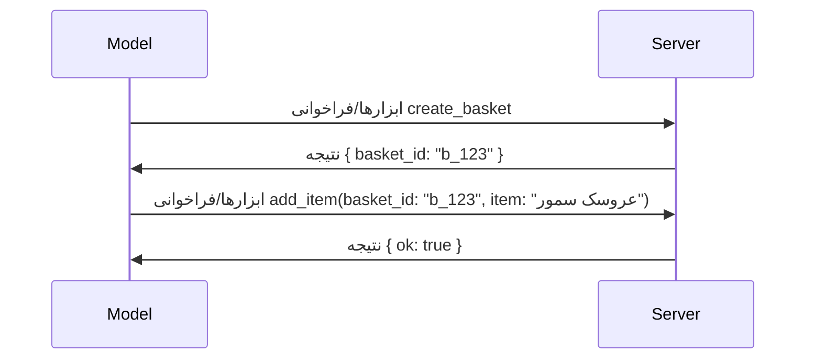

# تغییرات در MCP: مشخصات ۲۰۲۶-۰۷-۲۸

> **وضعیت:** نهایی. مشخصات MCP `2026-07-28` در ۲۸ ژوئیه ۲۰۲۶ عرضه شد
> و اصلاحیه فعلی پروتکل است. این درس مشخصات نهایی را شرح می‌دهد.
> برخی از مثال‌های دوره به صورت صریح نسخه‌شده باقی مانده‌اند به
> `2025-11-25` زیرا SDKهای آنها هنوز API بدون‌حالت جدید را پذیرفته‌اند؛
> آن مثال‌ها را به عنوان راهنمای سازگاری با نسخه‌های قدیمی در نظر بگیرید.

## مرور کلی

`2026-07-28` بزرگ‌ترین بازبینی MCP از زمان راه‌اندازی آن است. شش
پیشنهاد بهبود مشخصات (SEP) جلسات در سطح پروتکل را حذف کرده و
MCP را در لایه انتقال بدون‌حالت می‌کنند، افزونه‌ها به مکانیزمی
درجه‌یک و نسخه‌ای تبدیل می‌شوند، و چندین ویژگی که قبلاً در این دوره
پوشش داده شده‌اند (Roots، Sampling، Logging) طبق سیاست جدید چرخه عمر منسوخ شده‌اند.
این درس خلاصه‌ای از تغییرات، اهمیت آن‌ها، و معنای آن برای کدی است که
بر اساس `2025-11-25` نوشته شده است.

منبع: [کاندید انتشار مشخصات MCP ۲۰۲۶-۰۷-۲۸](https://blog.modelcontextprotocol.io/posts/2026-07-28-release-candidate/) (وبلاگ مدل کانتکست پروتکل، دیوید سوریه پاررا و دن دلیماریسکی).

## اهداف یادگیری

تا پایان این درس، شما قادر خواهید بود:

- توضیح دهید چرا MCP به هسته پروتکل بدون‌حالت منتقل می‌شود و چه مشکلی را برای استقرارهای مقیاس‌پذیر افقی حل می‌کند.
- نحوه جایگزینی دست‌دادن `initialize`/`initialized` و هدر `Mcp-Session-Id` را توصیف کنید.
- هدرهای جدید `Mcp-Method` و `Mcp-Name` و متادیتای کش `ttlMs`/`cacheScope` را شناسایی کنید.
- چارچوب Extensions و دو افزونه‌ای که با این نسخه عرضه شده‌اند: MCP Apps و Tasks را بشناسید.
- خلاصه‌ای از تقویت مجوزها و منسوخ شدن Dynamic Client Registration ارائه دهید.

- مشخص کنید کدام ویژگی‌های هسته‌ای (Roots، Sampling، Logging) اکنون منسوخ شده‌اند و این در عمل چه معنی دارد.
- تغییر کامل JSON Schema 2020-12 برای ابزار `inputSchema`/`outputSchema` را توضیح دهید.

## یک پروتکل بدون‌حالت

تغییر اصلی: MCP در لایه پروتکل بدون‌حالت می‌شود.

### قبل (2025-11-25): جلسات شما را به یک نمونه سرور متصل می‌کند

فراخوانی یک ابزار از طریق HTTP قابل استریم با دست‌دادن `initialize` آغاز می‌شود. سرور با هدر `Mcp-Session-Id` پاسخ می‌دهد که هر درخواست بعدی باید آن را همراه داشته باشد:

```http
POST /mcp HTTP/1.1
Mcp-Session-Id: 1868a90c-3a3f-4f5b
Content-Type: application/json

{"jsonrpc":"2.0","id":2,"method":"tools/call",
 "params":{"name":"search","arguments":{"q":"otters"}}}
```

چون جلسه به نمونه سروری که آن را صادر کرده بسته است، استقرارهای مقیاس‌پذیر افقی به **مسیر چسبنده** در تعادل بار و یک **ذخیره جلسه مشترک** بین نمونه‌ها نیاز دارند.

### بعد (2026-07-28): هر درخواست خودکفا است

```http
POST /mcp HTTP/1.1
MCP-Protocol-Version: 2026-07-28
Mcp-Method: tools/call
Mcp-Name: search
Content-Type: application/json

{"jsonrpc":"2.0","id":1,"method":"tools/call",
 "params":{"name":"search","arguments":{"q":"otters"},
           "_meta":{"io.modelcontextprotocol/protocolVersion":"2026-07-28",
                    "io.modelcontextprotocol/clientInfo":{"name":"my-app","version":"1.0"},
                    "io.modelcontextprotocol/clientCapabilities":{}}}}
```

هر نمونه سرور می‌تواند این درخواست را پردازش کند. تغییرات کلیدی:

- **دست‌دادن `initialize`/`initialized` حذف شده است** ([SEP-2575](https://github.com/modelcontextprotocol/modelcontextprotocol/pull/2575)). نسخه پروتکل، اطلاعات مشتری و قابلیت‌های مشتری به `_meta` در هر درخواست منتقل شده‌اند. یک متد جدید `server/discover` به کلاینت اجازه می‌دهد قابلیت‌های سرور را از پیش دریافت کند، زمانی که به آن‌ها نیاز دارد.

- **هدر `Mcp-Session-Id` و جلسه در سطح پروتکل حذف شدند** ([SEP-2567](https://github.com/modelcontextprotocol/modelcontextprotocol/pull/2567)). مسیر‌یابی چسبنده و ذخیره‌سازی‌های جلسه مشترک دیگر در سطح پروتکل لازم نیستند.

### پروتکل بدون حالت، برنامه‌های دارای حالت

حذف جلسه در سطح پروتکل به این معنا نیست که سرور شما نمی‌تواند دارای حالت باشد. الگوی پیشنهادی همان الگویی است که APIهای HTTP همیشه استفاده کرده‌اند: ایجاد یک دسته صریح (یک `basket_id`، یک `browser_id`) از یک تماس ابزار، و این که مدل این دسته را به عنوان یک پارامتر عادی در تماس‌های بعدی باز می‌فرستد.



این حالت را برای مدل قابل مشاهده و منطقی می‌کند به جای اینکه آن را در فراداده‌های انتقال پنهان کند، و اجازه می‌دهد هر نمونه سروری هر تماسی را اداره کند.

### درخواست‌های سرور به مشتری، بازساختار یافته

یک پروتکل بدون حالت هنوز به روشی نیاز دارد تا سرور بتواند در وسط تماس از مشتری چیزی بخواهد (مثلاً، یک درخواست استخراج اطلاعات):

- **درخواست‌های آغاز شده توسط سرور فقط زمانی قابل ارسال هستند که سرور فعالانه در حال پردازش درخواست مشتری باشد** ([SEP-2260](https://github.com/modelcontextprotocol/modelcontextprotocol/pull/2260)) — قبلاً توصیه بود، اکنون اجباری است. هیچ کاربری بدون مقدمه درخواست نمی‌شود.
- **درخواست‌های چند دور-رفت‌وبرگشتی** ([SEP-2322](https://github.com/modelcontextprotocol/modelcontextprotocol/pull/2322)) جایگزین باز نگه داشتن یک جریان SSE می‌شوند. در عوض، سرور یک `InputRequiredResult` برمی‌گرداند:

  ```json
  {
    "resultType": "input_required",
    "inputRequests": {
      "confirm": {
        "type": "elicitation",
        "message": "Delete 3 files?",
        "schema": { "type": "boolean" }
      }
    },
    "requestState": "eyJzdGVwIjoxLCJmaWxlcyI6WyJhIiwiYiIsImMiXX0="
  }
  ```

  مشتری پاسخ‌ها را جمع‌آوری می‌کند و تماس اصلی را مجدداً با `inputResponses` بعلاوه حالت اکو شده `requestState` ارسال می‌کند. هر نمونه سرور می‌تواند این تلاش مجدد را بردارد چون همه چیز مورد نیاز در بارگذاری است.

### قابلیت مسیر‌یابی، کش‌کردن، رد‌یابی

سه تغییر کوچک ترافیک بدون حالت را آسان‌تر برای اداره می‌کند:

- **هدرهای `Mcp-Method` و `Mcp-Name` در HTTP توان‌پذیر (Streamable) ضروری هستند** ([SEP-2243](https://github.com/modelcontextprotocol/modelcontextprotocol/pull/2243))، تا بار متعادل‌کننده‌ها، دروازه‌ها، و محدودکننده‌های نرخ بتوانند بدون بررسی بدنه JSON بر اساس عملیات مسیر‌یابی کنند. سرورها درخواست‌هایی را که هدرها و بدنه با هم مغایرت دارند رد می‌کنند.
- **نتایج `tools/list` و خواندن منابع دارای `ttlMs` و `cacheScope` هستند** ([SEP-2549](https://github.com/modelcontextprotocol/modelcontextprotocol/pull/2549))، مدل شده بر پایه `Cache-Control` در HTTP. مشتریان می‌دانند که یک نتیجه فهرست تا چه مدت تازه است و آیا به اشتراک گذاشتن آن بین کاربران ایمن است، بدون نیاز به یک جریان SSE بلند مدت برای آگاهی از تغییرات.
- **پراپاگیشن W3C Trace Context در `_meta` مستند شد** ([SEP-414](https://github.com/modelcontextprotocol/modelcontextprotocol/pull/414))، اصلاح نام کلیدهای `traceparent`، `tracestate`، و `baggage` تا رد‌یابی توزیع شده بتواند یک تماس را از طریق SDK مشتری، سرور MCP، و سیستم‌های پایین‌دستی در یک پشتیبان سازگار با [OpenTelemetry](https://opentelemetry.io/) دنبال کند.

## افزونه‌ها تبدیل به رده اول می‌شوند

افزونه‌ها به صورت غیررسمی در `2025-11-25` وجود داشتند. [SEP-2133](https://github.com/modelcontextprotocol/modelcontextprotocol/pull/2133) آنها را رسمی می‌کند:

- افزونه‌ها با شناسه‌های معکوس-DNS شناسایی می‌شوند.
- آنها از طریق یک نقشه `extensions` روی قابلیت‌های مشتری و سرور مذاکره می‌شوند.

- آنها در مخازن جداگانه‌ی خود با نام `ext-*` زندگی می‌کنند که نگهدارندگان واگذار شده‌ای دارند و نسخه‌هایشان مستقل از مشخصه‌ی اصلی است.
- یک مسیر جدید برای افزونه‌ها در فرایند SEP به آن‌ها مسیر رسمی شدن از حالت آزمایشی را می‌دهد.

این نسخه شامل دو افزونه رسمی است.


### برنامه‌های MCP: رابط‌های کاربری ارائه‌شده توسط سرور

[برنامه‌های MCP](https://blog.modelcontextprotocol.io/posts/2026-01-26-mcp-apps/) ([SEP-1865](https://github.com/modelcontextprotocol/modelcontextprotocol/pull/1865)) به سرورها اجازه می‌دهد رابط‌های تعاملی HTML ارسال کنند که میزبان‌ها آن‌ها را در یک iframe ایزوله شده رندر می‌کنند. ابزارها قالب‌های رابط کاربری خود را از پیش اعلام می‌کنند تا میزبان‌ها بتوانند پیش‌بارگذاری، کش و بازبینی امنیتی آن‌ها را پیش از اجرا انجام دهند. شما اصول این موضوع را قبلاً در [درس ۱۵: برنامه‌های MCP](../03-GettingStarted/15-mcp-apps/README.md) فراگرفته‌اید — تحت چارچوب افزونه‌ها، برنامه‌های MCP اکنون رسماً یک افزونه به جای یک ویژگی هسته‌ای آزمایشی هستند.

### انتقال وظایف به یک افزونه

وظایف به عنوان یک ویژگی اصلی آزمایشی در `2025-11-25` عرضه شدند. استفاده در تولید نیاز به طراحی مجددی داشت و مکان مناسب آن یک افزونه است: [افزونه وظایف](https://github.com/modelcontextprotocol/modelcontextprotocol/pull/2663) چرخه عمر را حول مدل بدون حالت تغییر می‌دهد — یک سرور می‌تواند با `tools/call` به یک تسک هندلر پاسخ دهد و کلاینت آن را با `tasks/get`، `tasks/update` و `tasks/cancel` پیش ببرد. ایجاد تسک به صورت سرور-هدایت شده است: کلاینت افزونه را اعلام می‌کند و سرور تصمیم می‌گیرد که چه زمانی یک فراخوان به عنوان تسک اجرا شود. `tasks/list` به کلی حذف شده زیرا بدون نشست‌ها نمی‌تواند به صورت امن محدود شود.

> **یادداشت مهاجرت:** اگر API آزمایشی وظایف `2025-11-25` را پیاده‌سازی کرده‌اید، باید به چرخه عمر افزونه جدید مهاجرت کنید — این سازگار با نسخه‌های قبلی نیست.

## تقویت مجوزها

چندین SEP مجوزها را در
[مشخصات مجوز](https://modelcontextprotocol.io/specification/2026-07-28/basic/authorization)
تطبیق نزدیک‌تر با پیاده‌سازی‌های واقعی OAuth 2.0 / OpenID Connect سخت می‌کنند:

| SEP | تغییر |
|---|---|
| [SEP-2468](https://github.com/modelcontextprotocol/modelcontextprotocol/pull/2468) | کلاینت‌ها باید پارامتر `iss` را در پاسخ‌های مجوز مطابق با [RFC 9207](https://www.rfc-editor.org/rfc/rfc9207) اعتبارسنجی کنند، که از حملات mix-up رایج در الگوی MCP تک کلاینت، چند سرور جلوگیری می‌کند. نسخه آینده نیاز به رد پاسخ‌هایی دارد که `iss` ندارند. |
| [SEP-837](https://github.com/modelcontextprotocol/modelcontextprotocol/pull/837) | کلاینت‌های ثبت‌نام دینامیک فقط سازگار با سازگاری، `application_type` خود را برای OpenID Connect اعلام می‌کنند تا از پیش‌فرض نادرست `"web"` برای کلاینت‌های دسکتاپ و خط فرمان جلوگیری شود. |
| [SEP-2352](https://github.com/modelcontextprotocol/modelcontextprotocol/pull/2352) | مدارک ثبت‌شده فقط به `issuer` سرور مجوز‌دهنده پیوند داده می‌شوند؛ کلاینت‌ها در صورت مهاجرت منبع دوباره ثبت‌نام می‌کنند. |
| [SEP-2207](https://github.com/modelcontextprotocol/modelcontextprotocol/pull/2207) | مستند می‌کند که چگونه توکن‌های تازه‌سازی را از سرورهای مجوز به سبک OpenID Connect درخواست کنید. |
| [SEP-2350](https://github.com/modelcontextprotocol/modelcontextprotocol/pull/2350) | تجمع دامنه در طی مجوز مرحله‌به‌مرحله را روشن می‌کند. |
| [SEP-2351](https://github.com/modelcontextprotocol/modelcontextprotocol/pull/2351) | پسوند کشف `.well-known` را روشن می‌کند. |

اگر در حال ساخت سرور مجوز برای MCP هستید، `iss` را در
پاسخ‌های مجوز فراهم کنید و مشخصات نهایی مجوز را دنبال کنید. راهنمای پیاده‌سازی را در
[02-Security](../02-Security/README.md) ببینید.

ثبت نام دینامیک کلاینت برای سازگاری همچنان در دسترس است اما در `2026-07-28` منسوخ می‌شود. پیاده‌سازی‌های جدید باید از اسناد
متادیتای شناسه کلاینت استفاده کنند.


[سیاست چرخه عمر ویژگی](https://github.com/modelcontextprotocol/modelcontextprotocol/pull/2577) جدید،
ریشه‌ها، نمونه‌برداری، لاگ‌گیری، و ثبت نام دینامیک کلاینت
**منسوخ** شده‌اند:

| ویژگی | جایگزین پیشنهادی |
|---|---|
| ریشه‌ها | پارامترهای ابزار، URIهای منبع، یا پیکربندی سرور |
| نمونه‌برداری | ادغام مستقیم با API‌های ارائه‌دهنده LLM |
| لاگ‌گیری | `stderr` برای انتقال‌های stdio؛ OpenTelemetry برای مشاهده‌پذیری ساخت‌یافته |
| ثبت نام دینامیک کلاینت | اسناد متادیتای شناسه کلاینت |

این ویژگی‌ها برای سازگاری در `2026-07-28` باقی می‌مانند. آن‌ها واجد شرایط
حذف در اولین بازنگری مشخصات منتشر شده از یا پس از ۲۸ ژوئیه ۲۰۲۷ هستند؛
حذف واقعی ممکن است دیرتر رخ دهد. پیاده‌سازی‌های جدید باید از الگوهای جایگزین
فوق استفاده کنند.

## اسکیما کامل JSON 2020-12 برای ابزارها

اسکیماهای `inputSchema` و `outputSchema` ابزار به [JSON Schema 2020-12](https://json-schema.org/draft/2020-12) کامل ارتقا یافته‌اند ([SEP-2106](https://github.com/modelcontextprotocol/modelcontextprotocol/pull/2106)):

- اسکیماهای ورودی محدودیت ریشه‌ای `type: "object"` را حفظ می‌کنند اما اکنون ترکیب (`oneOf`، `anyOf`، `allOf`)، شرط‌ها و مراجع (`$ref`، `$defs`) را اجازه می‌دهند.
- اسکیماهای خروجی محدودیتی ندارند و `structuredContent` اکنون می‌تواند هر مقدار JSON باشد نه فقط یک شیء.
- پیاده‌سازی‌ها نباید به صورت خودکار ارجاعات خارجی `$ref` را دنبال کنند و باید عمق اسکیما و زمان اعتبارسنجی را محدود کنند (یک ملاحظه جلوگیری از حمله انکار سرویس اگر اسکیماها را سروری اعتبارسنجی می‌کنید).

جداگانه، کد خطا برای منبع مفقود از عدد اختصاصی MCP `-32002` به استاندارد JSON-RPC `-32602` (پارامترهای نامعتبر) تغییر می‌کند ([SEP-2164](https://github.com/modelcontextprotocol/modelcontextprotocol/pull/2164)). اگر کلاینت شما بر اساس مقدار دقیق `-32002` شرط گذاشته، باید به‌روزرسانی شود.

## پروتکل چگونه از اینجا پیش می‌رود

این نسخه شامل تغییرات جدی است که نگهداران MCP قصد ندارند این روند به صورت معمول ادامه یابد. سه SEP حاکمیتی برای جلوگیری از تکرار وجود دارد:

- **سیاست چرخه عمر ویژگی** به هر ویژگی مسیر فعال → منسوخ → حذف با حداقل دوازده ماه فاصله بین منسوخ شدن و زودترین تاریخ حذف ممکن می‌دهد.
- **چارچوب افزونه‌ها** به قابلیت‌های جدید اجازه می‌دهد به عنوان افزونه‌های اختیاری عرضه شوند و آنجا تثبیت شوند قبل از اینکه (اگر اصلاً) وارد مشخصات اصلی شوند.
- یک SEP مسیر استاندارد دیگر نمی‌تواند وضعیت نهایی بگیرد مگر اینکه یک سناریوی مطابق در [مجموعه انطباق](https://github.com/modelcontextprotocol/conformance) ([SEP-2484](https://github.com/modelcontextprotocol/modelcontextprotocol/pull/2484)) ثبت‌شده باشد — همان مجموعه‌ای که [سیستم رتبه‌بندی لایه SDK](https://github.com/modelcontextprotocol/modelcontextprotocol/pull/1777) استفاده می‌کند تا SDKهای رسمی را ارزیابی کند.

## جدول زمانی انتشار و اعتبارسنجی

- کاندیدای انتشار در ۲۱ مه ۲۰۲۶ قفل شد.
- مشخصات نهایی در ۲۸ ژوئیه ۲۰۲۶ ارائه شد.

- پشتیبانی SDK ممکن است با مشخصات همگام نباشد. قبل از مهاجرت یک مثال، سند
  [مستندات SDK](https://modelcontextprotocol.io/docs/sdk) و یادداشت‌های انتشار SDK را بررسی کنید.
 
- تغییرات نهایی را در
  [مشخصات ۲۰۲۶-۰۷-۲۸](https://modelcontextprotocol.io/specification/2026-07-28/)
  و
  [فهرست تغییرات](https://modelcontextprotocol.io/specification/2026-07-28/changelog) دنبال کنید.

## معنای این برای این دوره آموزشی

دوره آموزشی در حال گذار از مثال‌های `2025-11-25` به مشخصات فعلی
`2026-07-28` است. به طور مشخص:

- **جلسات و دست دادن `initialize`** در مثال‌هایی که به صراحت
  `2025-11-25` هدف‌گذاری شده‌اند، رفتار قدیمی هستند. پروتکل `2026-07-28`
  آن‌ها را با مدل درخواست بدون حالت بالا جایگزین می‌کند.
- **نمونه‌برداری و ریشه‌ها** همچنان برای سازگاری در دسترس هستند اما منسوخ شده‌اند.
  طراحی‌های جدید باید از الگوهای جایگزین ذکر شده استفاده کنند.
- **ویژگی آزمایشی Tasks**، اگر از آن استفاده کرده‌اید، نیاز به مهاجرت به چرخه عمر جدید افزونه Tasks دارد.
- **برنامه‌های MCP** ([درس ۱۵](../03-GettingStarted/15-mcp-apps/README.md)) عملاً تحت تأثیر قرار نگرفته‌اند؛ صرفاً به چارچوب رسمی افزونه‌ها منتقل شده‌اند.

## منابع اضافی

- [مشخصات MCP ۲۰۲۶-۰۷-۲۸](https://modelcontextprotocol.io/specification/2026-07-28/)
- [فهرست تغییرات ۲۰۲۶-۰۷-۲۸](https://modelcontextprotocol.io/specification/2026-07-28/changelog)
- [منتخب انتشار مشخصات MCP ۲۰۲۶-۰۷-۲۸ (پست وبلاگ تاریخی)](https://blog.modelcontextprotocol.io/posts/2026-07-28-release-candidate/)
- [آینده انتقال‌های MCP](https://blog.modelcontextprotocol.io/posts/2025-12-19-mcp-transport-future/)
- [راهنمای SEP](https://modelcontextprotocol.io/community/sep-guidelines)
- [سیستم سطوح SDK MCP](https://modelcontextprotocol.io/docs/sdk)

## مراحل بعدی

به [مفاهیم اصلی](./README.md) بازگردید یا برای اعمال راهنمایی‌های فعلی `2026-07-28`
به [امنیت](../02-Security/README.md) ادامه دهید.

---

<!-- CO-OP TRANSLATOR DISCLAIMER START -->
**سلب مسئولیت**:
این سند با استفاده از سرویس ترجمه هوش مصنوعی [Co-op Translator](https://github.com/Azure/co-op-translator) ترجمه شده است. در حالی که ما در تلاش برای دقت هستیم، لطفاً توجه داشته باشید که ترجمه‌های خودکار ممکن است شامل خطاها یا نادرستی‌هایی باشند. سند اصلی به زبان مادری خود باید به عنوان منبع معتبر در نظر گرفته شود. برای اطلاعات حیاتی، ترجمه حرفه‌ای انسانی توصیه می‌شود. ما در قبال هرگونه سوء تفاهم یا برداشت نادرست ناشی از استفاده از این ترجمه مسئولیتی نداریم.
<!-- CO-OP TRANSLATOR DISCLAIMER END -->