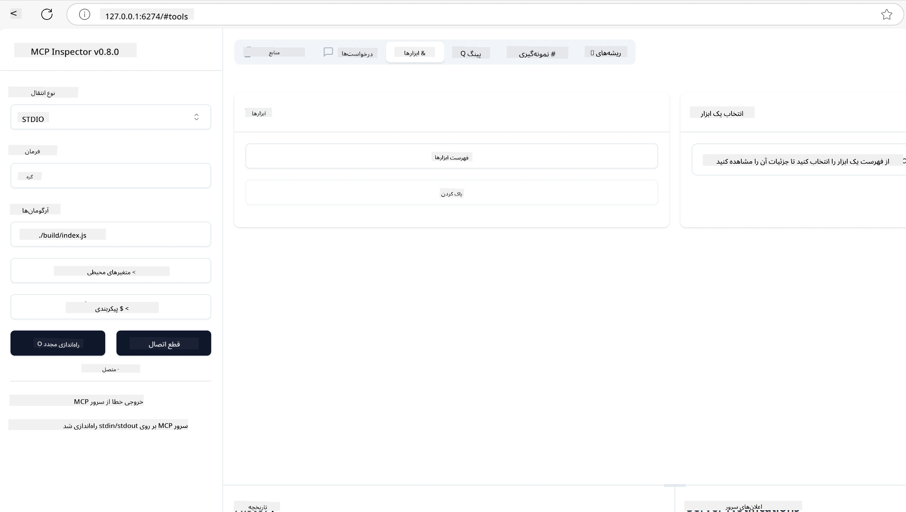
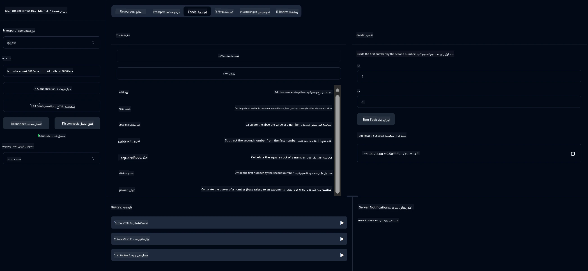
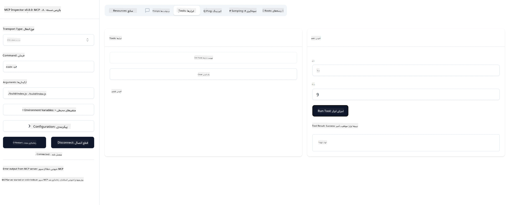

# شروع به کار با MCP

> [!NOTE]
> مثال HTTP جاوا در این درس از انتقال قدیمی HTTP+SSE استفاده می‌کند و
> هدف آن یک SDK سازگار با MCP `2025-11-25` است. برای سرورهای راه دور جدید،
> از انتقال Streamable HTTP نسخه `2026-07-28` استفاده کنید و پشتیبانی آن را در SDK خود بررسی نمایید.

به اولین گام‌های شما با پروتکل مدل کانتکست (MCP) خوش آمدید! چه تازه وارد MCP شده باشید و چه بخواهید دانش خود را عمیق‌تر کنید، این راهنما شما را در فرآیند ضروری راه‌اندازی و توسعه همراهی خواهد کرد. شما یاد خواهید گرفت که چگونه MCP اتصال بی‌دردسر بین مدل‌های هوش مصنوعی و برنامه‌ها را ممکن می‌سازد و محیط خود را سریع برای ساخت و آزمایش راه‌حل‌های مبتنی بر MCP آماده کنید.

> خلاصه؛ اگر برنامه‌های هوش مصنوعی می‌سازید، می‌دانید که می‌توانید ابزارها و منابع دیگر را به LLM (مدل زبان بزرگ) خود اضافه کنید تا دانش آن افزایش یابد. اما اگر آن ابزارها و منابع را روی یک سرور قرار دهید، برنامه و قابلیت‌های سرور توسط هر مشتری، با یا بدون LLM، قابل استفاده خواهد بود.

## مرور کلی

این درس راهنمایی‌های عملی درباره راه‌اندازی محیط‌های MCP و ساخت اولین برنامه‌های MCP شما ارائه می‌دهد. شما یاد خواهید گرفت که چگونه ابزارها و فریم‌ورک‌های لازم را راه‌اندازی کنید، سرورهای پایه MCP بسازید، برنامه‌های میزبان ایجاد کنید و پیاده‌سازی‌های خود را تست نمایید.

پروتکل مدل کانتکست (MCP) یک پروتکل باز است که استانداردسازی ارائه کانتکست به LLMها توسط برنامه‌ها را مشخص می‌کند. MCP را مانند یک پورت USB-C برای برنامه‌های هوش مصنوعی تصور کنید - یک راه استاندارد برای اتصال مدل‌های هوش مصنوعی به منابع داده و ابزارهای مختلف.

## اهداف یادگیری

تا پایان این درس، شما قادر خواهید بود:

- راه‌اندازی محیط‌های توسعه برای MCP در C#، جاوا، پایتون، تایپ‌اسکریپت و راست
- ساخت و استقرار سرورهای پایه MCP با ویژگی‌های سفارشی (منابع، پرامپت‌ها و ابزارها)
- ایجاد برنامه‌های میزبان که به سرورهای MCP متصل می‌شوند
- تست و اشکال‌زدایی پیاده‌سازی‌های MCP

## راه‌اندازی محیط MCP شما

پیش از شروع کار با MCP، آماده‌سازی محیط توسعه و درک جریان کاری پایه اهمیت دارد. این بخش شما را در مراحل اولیه راه‌اندازی برای شروعی روان با MCP راهنمایی خواهد کرد.

### پیش‌نیازها

قبل از ورود به توسعه MCP، اطمینان حاصل کنید که موارد زیر را دارید:

- **محیط توسعه**: برای زبان برنامه‌نویسی انتخابی شما (C#، جاوا، پایتون، تایپ‌اسکریپت یا راست)
- **IDE/ویرایشگر**: ویژوال استودیو، ویژوال استودیو کد، اینتلی‌جی، اکلیپس، پای‌چرم یا هر ویرایشگر کد مدرن
- **مدیران بسته‌ها**: NuGet، Maven/Gradle، pip، npm/yarn یا Cargo
- **کلیدهای API**: برای هر سرویس هوش مصنوعی که قصد دارید در برنامه‌های میزبان خود استفاده کنید

## ساختار پایه سرور MCP

یک سرور MCP معمولاً شامل موارد زیر است:

- **پیکربندی سرور**: تنظیم پورت، احراز هویت و سایر تنظیمات
- **منابع**: داده‌ها و کانتکستی که در دسترس LLMها قرار می‌گیرد
- **ابزارها**: عملکردهایی که مدل‌ها می‌توانند فراخوانی کنند
- **پرامپت‌ها**: قالب‌هایی برای تولید یا ساختاردهی متن

در اینجا یک مثال ساده به زبان تایپ‌اسکریپت آورده شده است:

```typescript
import { McpServer, ResourceTemplate } from "@modelcontextprotocol/sdk/server/mcp.js";
import { StdioServerTransport } from "@modelcontextprotocol/sdk/server/stdio.js";
import { z } from "zod";

// ایجاد یک سرور MCP
const server = new McpServer({
  name: "Demo",
  version: "1.0.0"
});

// افزودن یک ابزار اضافی
server.tool("add",
  { a: z.number(), b: z.number() },
  async ({ a, b }) => ({
    content: [{ type: "text", text: String(a + b) }]
  })
);

// افزودن یک منبع خوش‌آمدگویی پویا
server.resource(
  "file",
  // پارامتر 'list' کنترل می‌کند که منبع چگونه فایل‌های موجود را فهرست‌بندی کند. تنظیم آن روی undefined فهرست‌بندی را برای این منبع غیرفعال می‌کند.
  new ResourceTemplate("file://{path}", { list: undefined }),
  async (uri, { path }) => ({
    contents: [{
      uri: uri.href,
      text: `File, ${path}!`
    }]
  })
);

// افزودن یک منبع فایل که محتوای فایل را می‌خواند
server.resource(
  "file",
  new ResourceTemplate("file://{path}", { list: undefined }),
  async (uri, { path }) => {
    let text;
    try {
      text = await fs.readFile(path, "utf8");
    } catch (err) {
      text = `Error reading file: ${err.message}`;
    }
    return {
      contents: [{
        uri: uri.href,
        text
      }]
    };
  }
);

server.prompt(
  "review-code",
  { code: z.string() },
  ({ code }) => ({
    messages: [{
      role: "user",
      content: {
        type: "text",
        text: `Please review this code:\n\n${code}`
      }
    }]
  })
);

// شروع به دریافت پیام‌ها از stdin و ارسال پیام‌ها روی stdout
const transport = new StdioServerTransport();
await server.connect(transport);
```

در کد بالا ما:

- کلاس‌های لازم را از SDK تایپ‌اسکریپت MCP وارد کرده‌ایم.
- یک نمونه جدید از سرور MCP ایجاد و پیکربندی کرده‌ایم.
- یک ابزار سفارشی (`calculator`) با تابع مدیریت ثبت کرده‌ایم.
- سرور را شروع کرده‌ایم تا به درخواست‌های MCP پاسخ دهد.

## تست و اشکال‌زدایی

پیش از آغاز تست سرور MCP خود، مهم است که ابزارهای در دسترس و بهترین شیوه‌های اشکال‌زدایی را درک کنید. تست مؤثر تضمین می‌کند که سرور شما درست کار می‌کند و به شما کمک می‌کند مشکلات را سریع شناسایی و برطرف کنید. بخش بعدی روش‌های پیشنهادی برای اعتبارسنجی پیاده‌سازی MCP شما را تشریح می‌کند.

MCP ابزارهایی را برای کمک به شما در تست و اشکال‌زدایی سرورها فراهم می‌کند:

- **ابزار Inspector**، این رابط گرافیکی به شما اجازه می‌دهد به سرور متصل شوید و ابزارها، پرامپت‌ها و منابع خود را تست کنید.
- **curl**، می‌توانید همچنین با استفاده از ابزار خط فرمان مانند curl یا مشتریان دیگر که می‌توانند فرمان‌های HTTP ایجاد و اجرا کنند، به سرور خود متصل شوید.

### استفاده از MCP Inspector

[MCP Inspector](https://github.com/modelcontextprotocol/inspector) یک ابزار تست بصری است که به شما کمک می‌کند:

1. **کشف قابلیت‌های سرور**: کشف خودکار منابع، ابزارها و پرامپت‌های موجود
2. **تست اجرای ابزار**: آزمایش پارامترهای مختلف و مشاهده پاسخ‌ها به صورت زنده
3. **مشاهده فراداده سرور**: بررسی اطلاعات سرور، اسکیماها و پیکربندی‌ها

```bash
# مثال تایپ‌اسکریپت، نصب و اجرای MCP Inspector
npx @modelcontextprotocol/inspector node build/index.js
```

با اجرای دستورات بالا، MCP Inspector یک رابط وب محلی در مرورگر شما راه‌اندازی می‌کند. انتظار داشته باشید داشبوردی را مشاهده کنید که سرورهای MCP ثبت‌شده، ابزارها، منابع و پرامپت‌های در دسترس آن‌ها را نمایش می‌دهد. این رابط امکان تست تعاملی اجرای ابزار، بازبینی فراداده سرور و دیدن پاسخ‌های زنده را فراهم می‌کند که فرآیند اعتبارسنجی و اشکال‌زدایی پیاده‌سازی‌های سرور MCP را آسان‌تر می‌کند.

تصویری از نمای آن به این صورت است:



## مسائل و راه‌حل‌های رایج در راه‌اندازی

| مشکل | راه‌حل ممکن |
|-------|-------------------|
| ارتباط رد شده | بررسی کنید که سرور در حال اجرا باشد و پورت درست انتخاب شده باشد |
| خطاهای اجرای ابزار | اعتبارسنجی پارامترها و مدیریت خطاها را بازبینی کنید |
| نقص‌های احراز هویت | کلیدها و دسترسی‌های API را بررسی کنید |
| خطاهای اعتبارسنجی اسکیما | اطمینان حاصل کنید پارامترها با اسکیمای تعریف‌شده مطابقت دارند |
| عدم شروع سرور | وجود تداخل پورت یا کتابخانه‌های گم‌شده را بررسی کنید |
| خطاهای CORS | هدرهای CORS مناسب برای درخواست‌های بین‌مبدا را پیکربندی کنید |
| مسائل احراز هویت | اعتبار توکن و مجوزها را بازنگری کنید |

## توسعه محلی

برای توسعه و تست محلی، می‌توانید سرورهای MCP را مستقیماً روی ماشین خود اجرا کنید:

1. **فرآیند سرور را شروع کنید**: برنامه سرور MCP خود را اجرا کنید
2. **پیکربندی شبکه**: مطمئن شوید که سرور روی پورت مورد انتظار قابل دسترسی است
3. **اتصال مشتری‌ها**: از URLهای محلی مانند `http://localhost:3000` استفاده کنید

```bash
# مثال: اجرای محلی سرور TypeScript MCP
npm run start
# سرور در حال اجرا در http://localhost:3000
```

## ساخت اولین سرور MCP شما

ما مفاهیم [Core](../../01-CoreConcepts/README.md) را در درس قبلی پوشش داده‌ایم، حالا وقت آن است که آن دانش را به کار ببریم.

### سرور چه کارهایی می‌تواند انجام دهد

پیش از شروع به نوشتن کد، بیایید به یاد بیاوریم که یک سرور چه کارهایی می‌تواند انجام دهد:

یک سرور MCP می‌تواند به عنوان مثال:

- به فایل‌ها و پایگاه‌های داده محلی دسترسی پیدا کند
- به APIهای راه دور متصل شود
- محاسبات انجام دهد
- با سایر ابزارها و سرویس‌ها یکپارچه شود
- یک رابط کاربری برای تعامل فراهم کند

بسیار خوب، حالا که می‌دانیم چه کاری باید انجام دهیم، بیایید کدگذاری را شروع کنیم.

## تمرین: ایجاد یک سرور

برای ایجاد یک سرور باید مراحل زیر را دنبال کنید:

- نصب SDK MCP.
- ایجاد یک پروژه و تنظیم ساختار پروژه.
- نوشتن کد سرور.
- تست سرور.

### -1- ایجاد پروژه

#### تایپ‌اسکریپت

```sh
# ایجاد دایرکتوری پروژه و مقداردهی اولیه پروژه npm
mkdir calculator-server
cd calculator-server
npm init -y
```

#### پایتون

```sh
# ساخت پوشه پروژه
mkdir calculator-server
cd calculator-server
# پوشه را در Visual Studio Code باز کنید - اگر از IDE دیگری استفاده می‌کنید آن را رد کنید
code .
```

#### .NET

```sh
dotnet new console -n McpCalculatorServer
cd McpCalculatorServer
```

#### جاوا

برای جاوا، یک پروژه Spring Boot ایجاد کنید:

```bash
curl https://start.spring.io/starter.zip \
  -d dependencies=web \
  -d javaVersion=21 \
  -d type=maven-project \
  -d groupId=com.example \
  -d artifactId=calculator-server \
  -d name=McpServer \
  -d packageName=com.microsoft.mcp.sample.server \
  -o calculator-server.zip
```

فایل زیپ را استخراج کنید:

```bash
unzip calculator-server.zip -d calculator-server
cd calculator-server
# اختیاری حذف آزمایش استفاده نشده
rm -rf src/test/java
```

پیکربندی کامل زیر را به فایل *pom.xml* خود اضافه کنید:

```xml
<?xml version="1.0" encoding="UTF-8"?>
<project xmlns="http://maven.apache.org/POM/4.0.0"
    xmlns:xsi="http://www.w3.org/2001/XMLSchema-instance"
    xsi:schemaLocation="http://maven.apache.org/POM/4.0.0 http://maven.apache.org/xsd/maven-4.0.0.xsd">
    <modelVersion>4.0.0</modelVersion>
    
    <!-- Spring Boot parent for dependency management -->
    <parent>
        <groupId>org.springframework.boot</groupId>
        <artifactId>spring-boot-starter-parent</artifactId>
        <version>3.5.0</version>
        <relativePath />
    </parent>

    <!-- Project coordinates -->
    <groupId>com.example</groupId>
    <artifactId>calculator-server</artifactId>
    <version>0.0.1-SNAPSHOT</version>
    <name>Calculator Server</name>
    <description>Basic calculator MCP service for beginners</description>

    <!-- Properties -->
    <properties>
        <java.version>21</java.version>
        <maven.compiler.source>21</maven.compiler.source>
        <maven.compiler.target>21</maven.compiler.target>
    </properties>

    <!-- Spring AI BOM for version management -->
    <dependencyManagement>
        <dependencies>
            <dependency>
                <groupId>org.springframework.ai</groupId>
                <artifactId>spring-ai-bom</artifactId>
                <version>1.0.0-SNAPSHOT</version>
                <type>pom</type>
                <scope>import</scope>
            </dependency>
        </dependencies>
    </dependencyManagement>

    <!-- Dependencies -->
    <dependencies>
        <dependency>
            <groupId>org.springframework.ai</groupId>
            <artifactId>spring-ai-starter-mcp-server-webflux</artifactId>
        </dependency>
        <dependency>
            <groupId>org.springframework.boot</groupId>
            <artifactId>spring-boot-starter-actuator</artifactId>
        </dependency>
        <dependency>
         <groupId>org.springframework.boot</groupId>
         <artifactId>spring-boot-starter-test</artifactId>
         <scope>test</scope>
      </dependency>
    </dependencies>

    <!-- Build configuration -->
    <build>
        <plugins>
            <plugin>
                <groupId>org.springframework.boot</groupId>
                <artifactId>spring-boot-maven-plugin</artifactId>
            </plugin>
            <plugin>
                <groupId>org.apache.maven.plugins</groupId>
                <artifactId>maven-compiler-plugin</artifactId>
                <configuration>
                    <release>21</release>
                </configuration>
            </plugin>
        </plugins>
    </build>

    <!-- Repositories for Spring AI snapshots -->
    <repositories>
        <repository>
            <id>spring-milestones</id>
            <name>Spring Milestones</name>
            <url>https://repo.spring.io/milestone</url>
            <snapshots>
                <enabled>false</enabled>
            </snapshots>
        </repository>
        <repository>
            <id>spring-snapshots</id>
            <name>Spring Snapshots</name>
            <url>https://repo.spring.io/snapshot</url>
            <releases>
                <enabled>false</enabled>
            </releases>
        </repository>
    </repositories>
</project>
```

#### راست

```sh
mkdir calculator-server
cd calculator-server
cargo init
```

### -2- افزودن وابستگی‌ها

اکنون که پروژه خود را ایجاد کرده‌اید، بیایید وابستگی‌ها را اضافه کنیم:

#### تایپ‌اسکریپت

```sh
# اگر قبلاً نصب نشده است، TypeScript را به صورت جهانی نصب کنید
npm install typescript -g

# نصب SDK MCP و Zod برای اعتبارسنجی طرحواره
npm install @modelcontextprotocol/sdk zod
npm install -D @types/node typescript
```

#### پایتون

```sh
# یک محیط مجازی بسازید و وابستگی‌ها را نصب کنید
python -m venv venv
venv\Scripts\activate
pip install "mcp[cli]"
```

#### جاوا

```bash
cd calculator-server
./mvnw clean install -DskipTests
```

#### راست

```sh
cargo add rmcp --features server,transport-io
cargo add serde
cargo add tokio --features rt-multi-thread
```

### -3- ایجاد فایل‌های پروژه

#### تایپ‌اسکریپت

فایل *package.json* را باز کنید و محتوا را با موارد زیر جایگزین کنید تا مطمئن شوید که می‌توانید سرور را بسازید و اجرا کنید:

```json
{
  "name": "calculator-server",
  "version": "1.0.0",
  "main": "index.js",
  "type": "module",
  "scripts": {
    "build": "tsc",
    "start": "npm run build && node ./build/index.js",
  },
  "keywords": [],
  "author": "",
  "license": "ISC",
  "description": "A simple calculator server using Model Context Protocol",
  "dependencies": {
    "@modelcontextprotocol/sdk": "^1.16.0",
    "zod": "^3.25.76"
  },
  "devDependencies": {
    "@types/node": "^24.0.14",
    "typescript": "^5.8.3"
  }
}
```

یک فایل *tsconfig.json* با محتوای زیر ایجاد کنید:

```json
{
  "compilerOptions": {
    "target": "ES2022",
    "module": "Node16",
    "moduleResolution": "Node16",
    "outDir": "./build",
    "rootDir": "./src",
    "strict": true,
    "esModuleInterop": true,
    "skipLibCheck": true,
    "forceConsistentCasingInFileNames": true
  },
  "include": ["src/**/*"],
  "exclude": ["node_modules"]
}
```

یک دایرکتوری برای کد منبع خود بسازید:

```sh
mkdir src
touch src/index.ts
```

#### پایتون

یک فایل *server.py* بسازید

```sh
touch server.py
```

#### .NET

بسته‌های NuGet لازم را نصب کنید:

```sh
dotnet add package ModelContextProtocol --prerelease
dotnet add package Microsoft.Extensions.Hosting
```

#### جاوا

برای پروژه‌های جاوا Spring Boot، ساختار پروژه به طور خودکار ایجاد می‌شود.

#### راست

برای راست، یک فایل *src/main.rs* به طور پیش‌فرض هنگام اجرای `cargo init` ایجاد می‌شود. فایل را باز کنید و کد پیش‌فرض را حذف کنید.

### -4- ایجاد کد سرور

#### تایپ‌اسکریپت

یک فایل *index.ts* بسازید و کد زیر را اضافه کنید:

```typescript
import { McpServer, ResourceTemplate } from "@modelcontextprotocol/sdk/server/mcp.js";
import { StdioServerTransport } from "@modelcontextprotocol/sdk/server/stdio.js";
import { z } from "zod";
 
// ایجاد یک سرور MCP
const server = new McpServer({
  name: "Calculator MCP Server",
  version: "1.0.0"
});
```

اکنون یک سرور دارید، اما عملکرد زیادی ندارد، بیایید این را برطرف کنیم.

#### پایتون

```python
# سرور.py
from mcp.server.fastmcp import FastMCP

# ایجاد یک سرور MCP
mcp = FastMCP("Demo")
```

#### .NET

```csharp
using Microsoft.Extensions.DependencyInjection;
using Microsoft.Extensions.Hosting;
using Microsoft.Extensions.Logging;
using ModelContextProtocol.Server;
using System.ComponentModel;

var builder = Host.CreateApplicationBuilder(args);
builder.Logging.AddConsole(consoleLogOptions =>
{
    // Configure all logs to go to stderr
    consoleLogOptions.LogToStandardErrorThreshold = LogLevel.Trace;
});

builder.Services
    .AddMcpServer()
    .WithStdioServerTransport()
    .WithToolsFromAssembly();
await builder.Build().RunAsync();

// add features
```

#### جاوا

برای جاوا، اجزای اصلی سرور را ایجاد کنید. ابتدا کلاس اصلی برنامه را ویرایش کنید:

*src/main/java/com/microsoft/mcp/sample/server/McpServerApplication.java*:

```java
package com.microsoft.mcp.sample.server;

import org.springframework.ai.tool.ToolCallbackProvider;
import org.springframework.ai.tool.method.MethodToolCallbackProvider;
import org.springframework.boot.SpringApplication;
import org.springframework.boot.autoconfigure.SpringBootApplication;
import org.springframework.context.annotation.Bean;
import com.microsoft.mcp.sample.server.service.CalculatorService;

@SpringBootApplication
public class McpServerApplication {

    public static void main(String[] args) {
        SpringApplication.run(McpServerApplication.class, args);
    }
    
    @Bean
    public ToolCallbackProvider calculatorTools(CalculatorService calculator) {
        return MethodToolCallbackProvider.builder().toolObjects(calculator).build();
    }
}
```

سرویس ماشین حساب را ایجاد کنید *src/main/java/com/microsoft/mcp/sample/server/service/CalculatorService.java*:

```java
package com.microsoft.mcp.sample.server.service;

import org.springframework.ai.tool.annotation.Tool;
import org.springframework.stereotype.Service;

/**
 * Service for basic calculator operations.
 * This service provides simple calculator functionality through MCP.
 */
@Service
public class CalculatorService {

    /**
     * Add two numbers
     * @param a The first number
     * @param b The second number
     * @return The sum of the two numbers
     */
    @Tool(description = "Add two numbers together")
    public String add(double a, double b) {
        double result = a + b;
        return formatResult(a, "+", b, result);
    }

    /**
     * Subtract one number from another
     * @param a The number to subtract from
     * @param b The number to subtract
     * @return The result of the subtraction
     */
    @Tool(description = "Subtract the second number from the first number")
    public String subtract(double a, double b) {
        double result = a - b;
        return formatResult(a, "-", b, result);
    }

    /**
     * Multiply two numbers
     * @param a The first number
     * @param b The second number
     * @return The product of the two numbers
     */
    @Tool(description = "Multiply two numbers together")
    public String multiply(double a, double b) {
        double result = a * b;
        return formatResult(a, "*", b, result);
    }

    /**
     * Divide one number by another
     * @param a The numerator
     * @param b The denominator
     * @return The result of the division
     */
    @Tool(description = "Divide the first number by the second number")
    public String divide(double a, double b) {
        if (b == 0) {
            return "Error: Cannot divide by zero";
        }
        double result = a / b;
        return formatResult(a, "/", b, result);
    }

    /**
     * Calculate the power of a number
     * @param base The base number
     * @param exponent The exponent
     * @return The result of raising the base to the exponent
     */
    @Tool(description = "Calculate the power of a number (base raised to an exponent)")
    public String power(double base, double exponent) {
        double result = Math.pow(base, exponent);
        return formatResult(base, "^", exponent, result);
    }

    /**
     * Calculate the square root of a number
     * @param number The number to find the square root of
     * @return The square root of the number
     */
    @Tool(description = "Calculate the square root of a number")
    public String squareRoot(double number) {
        if (number < 0) {
            return "Error: Cannot calculate square root of a negative number";
        }
        double result = Math.sqrt(number);
        return String.format("√%.2f = %.2f", number, result);
    }

    /**
     * Calculate the modulus (remainder) of division
     * @param a The dividend
     * @param b The divisor
     * @return The remainder of the division
     */
    @Tool(description = "Calculate the remainder when one number is divided by another")
    public String modulus(double a, double b) {
        if (b == 0) {
            return "Error: Cannot divide by zero";
        }
        double result = a % b;
        return formatResult(a, "%", b, result);
    }

    /**
     * Calculate the absolute value of a number
     * @param number The number to find the absolute value of
     * @return The absolute value of the number
     */
    @Tool(description = "Calculate the absolute value of a number")
    public String absolute(double number) {
        double result = Math.abs(number);
        return String.format("|%.2f| = %.2f", number, result);
    }

    /**
     * Get help about available calculator operations
     * @return Information about available operations
     */
    @Tool(description = "Get help about available calculator operations")
    public String help() {
        return "Basic Calculator MCP Service\n\n" +
               "Available operations:\n" +
               "1. add(a, b) - Adds two numbers\n" +
               "2. subtract(a, b) - Subtracts the second number from the first\n" +
               "3. multiply(a, b) - Multiplies two numbers\n" +
               "4. divide(a, b) - Divides the first number by the second\n" +
               "5. power(base, exponent) - Raises a number to a power\n" +
               "6. squareRoot(number) - Calculates the square root\n" + 
               "7. modulus(a, b) - Calculates the remainder of division\n" +
               "8. absolute(number) - Calculates the absolute value\n\n" +
               "Example usage: add(5, 3) will return 5 + 3 = 8";
    }

    /**
     * Format the result of a calculation
     */
    private String formatResult(double a, String operator, double b, double result) {
        return String.format("%.2f %s %.2f = %.2f", a, operator, b, result);
    }
}
```

**اجزای اختیاری برای یک سرویس آماده تولید:**

پیکربندی شروع به کار ایجاد کنید *src/main/java/com/microsoft/mcp/sample/server/config/StartupConfig.java*:

```java
package com.microsoft.mcp.sample.server.config;

import org.springframework.boot.CommandLineRunner;
import org.springframework.context.annotation.Bean;
import org.springframework.context.annotation.Configuration;

@Configuration
public class StartupConfig {
    
    @Bean
    public CommandLineRunner startupInfo() {
        return args -> {
            System.out.println("\n" + "=".repeat(60));
            System.out.println("Calculator MCP Server is starting...");
            System.out.println("SSE endpoint: http://localhost:8080/sse");
            System.out.println("Health check: http://localhost:8080/actuator/health");
            System.out.println("=".repeat(60) + "\n");
        };
    }
}
```

کنترلر سلامت بسازید *src/main/java/com/microsoft/mcp/sample/server/controller/HealthController.java*:

```java
package com.microsoft.mcp.sample.server.controller;

import org.springframework.http.ResponseEntity;
import org.springframework.web.bind.annotation.GetMapping;
import org.springframework.web.bind.annotation.RestController;
import java.time.LocalDateTime;
import java.util.HashMap;
import java.util.Map;

@RestController
public class HealthController {
    
    @GetMapping("/health")
    public ResponseEntity<Map<String, Object>> healthCheck() {
        Map<String, Object> response = new HashMap<>();
        response.put("status", "UP");
        response.put("timestamp", LocalDateTime.now().toString());
        response.put("service", "Calculator MCP Server");
        return ResponseEntity.ok(response);
    }
}
```

هندلر استثنا ایجاد کنید *src/main/java/com/microsoft/mcp/sample/server/exception/GlobalExceptionHandler.java*:

```java
package com.microsoft.mcp.sample.server.exception;

import org.springframework.http.HttpStatus;
import org.springframework.http.ResponseEntity;
import org.springframework.web.bind.annotation.ExceptionHandler;
import org.springframework.web.bind.annotation.RestControllerAdvice;

@RestControllerAdvice
public class GlobalExceptionHandler {

    @ExceptionHandler(IllegalArgumentException.class)
    public ResponseEntity<ErrorResponse> handleIllegalArgumentException(IllegalArgumentException ex) {
        ErrorResponse error = new ErrorResponse(
            "Invalid_Input", 
            "Invalid input parameter: " + ex.getMessage());
        return new ResponseEntity<>(error, HttpStatus.BAD_REQUEST);
    }

    public static class ErrorResponse {
        private String code;
        private String message;

        public ErrorResponse(String code, String message) {
            this.code = code;
            this.message = message;
        }

        // گیرنده‌ها
        public String getCode() { return code; }
        public String getMessage() { return message; }
    }
}
```

یک بنر سفارشی بسازید *src/main/resources/banner.txt*:

```text
_____      _            _       _             
 / ____|    | |          | |     | |            
| |     __ _| | ___ _   _| | __ _| |_ ___  _ __ 
| |    / _` | |/ __| | | | |/ _` | __/ _ \| '__|
| |___| (_| | | (__| |_| | | (_| | || (_) | |   
 \_____\__,_|_|\___|\__,_|_|\__,_|\__\___/|_|   
                                                
Calculator MCP Server v1.0
Spring Boot MCP Application
```

</details>

#### راست

کد زیر را به بالای فایل *src/main.rs* اضافه کنید. این کتابخانه‌ها و ماژول‌های لازم برای سرور MCP شما را وارد می‌کند.

```rust
use rmcp::{
    handler::server::{router::tool::ToolRouter, tool::Parameters},
    model::{ServerCapabilities, ServerInfo},
    schemars, tool, tool_handler, tool_router,
    transport::stdio,
    ServerHandler, ServiceExt,
};
use std::error::Error;
```

سرور ماشین حساب یک سرور ساده خواهد بود که می‌تواند دو عدد را با هم جمع کند. بیایید یک struct برای نمایش درخواست ماشین حساب ایجاد کنیم.

```rust
#[derive(Debug, serde::Deserialize, schemars::JsonSchema)]
pub struct CalculatorRequest {
    pub a: f64,
    pub b: f64,
}
```

سپس، struct دیگری برای نمایش سرور ماشین حساب بسازید. این struct نگهدارنده مسیریاب ابزار است که برای ثبت ابزارها استفاده می‌شود.

```rust
#[derive(Debug, Clone)]
pub struct Calculator {
    tool_router: ToolRouter<Self>,
}
```

اکنون می‌توانیم struct `Calculator` را پیاده‌سازی کنیم تا یک نمونه جدید از سرور بسازد و هندلر سرور را برای ارائه اطلاعات سرور پیاده‌سازی نماید.

```rust
#[tool_router]
impl Calculator {
    pub fn new() -> Self {
        Self {
            tool_router: Self::tool_router(),
        }
    }
}

#[tool_handler]
impl ServerHandler for Calculator {
    fn get_info(&self) -> ServerInfo {
        ServerInfo {
            instructions: Some("A simple calculator tool".into()),
            capabilities: ServerCapabilities::builder().enable_tools().build(),
            ..Default::default()
        }
    }
}
```

در نهایت، باید تابع main را برای راه‌اندازی سرور پیاده‌سازی کنیم. این تابع یک نمونه از struct `Calculator` ایجاد می‌کند و آن را از طریق ورودی/خروجی استاندارد سرو می‌کند.

```rust
#[tokio::main]
async fn main() -> Result<(), Box<dyn Error>> {
    let service = Calculator::new().serve(stdio()).await?;
    service.waiting().await?;
    Ok(())
}
```

سرور اکنون آماده است تا اطلاعات پایه درباره خود را ارائه دهد. در مرحله بعدی، یک ابزار برای انجام جمع اضافه خواهیم کرد.

### -5- افزودن یک ابزار و یک منبع

یک ابزار و یک منبع اضافه کنید با افزودن کد زیر:

#### تایپ‌اسکریپت

```typescript
server.tool(
  "add",
  { a: z.number(), b: z.number() },
  async ({ a, b }) => ({
    content: [{ type: "text", text: String(a + b) }]
  })
);

server.resource(
  "greeting",
  new ResourceTemplate("greeting://{name}", { list: undefined }),
  async (uri, { name }) => ({
    contents: [{
      uri: uri.href,
      text: `Hello, ${name}!`
    }]
  })
);
```

ابزار شما پارامترهای `a` و `b` را می‌گیرد و تابعی اجرا می‌کند که پاسخی در قالب زیر تولید می‌کند:

```typescript
{
  contents: [{
    type: "text", content: "some content"
  }]
}
```

منبع شما از طریق رشته "greeting" دسترسی دارد و پارامتر `name` را می‌گیرد و پاسخی مشابه ابزار تولید می‌کند:

```typescript
{
  uri: "<href>",
  text: "a text"
}
```

#### پایتون

```python
# افزودن یک ابزار جمع
@mcp.tool()
def add(a: int, b: int) -> int:
    """Add two numbers"""
    return a + b


# افزودن یک منبع خوش‌آمدگویی پویا
@mcp.resource("greeting://{name}")
def get_greeting(name: str) -> str:
    """Get a personalized greeting"""
    return f"Hello, {name}!"
```

در کد بالا ما:

- ابزاری به نام `add` تعریف کرده‌ایم که پارامترهای `a` و `b` هر دو عدد صحیح هستند.
- منبعی به نام `greeting` ساخته‌ایم که پارامتر `name` را می‌گیرد.

#### .NET

این را به فایل Program.cs خود اضافه کنید:

```csharp
[McpServerToolType]
public static class CalculatorTool
{
    [McpServerTool, Description("Adds two numbers")]
    public static string Add(int a, int b) => $"Sum {a + b}";
}
```

#### جاوا

ابزارها قبلاً در مرحله قبل ایجاد شده‌اند.

#### راست

یک ابزار جدید داخل بلوک `impl Calculator` اضافه کنید:

```rust
#[tool(description = "Adds a and b")]
async fn add(
    &self,
    Parameters(CalculatorRequest { a, b }): Parameters<CalculatorRequest>,
) -> String {
    (a + b).to_string()
}
```

### -6- کد نهایی

آخرین کد مورد نیاز را اضافه کنیم تا سرور بتواند شروع شود:

#### تایپ‌اسکریپت

```typescript
// شروع دریافت پیام‌ها از stdin و ارسال پیام‌ها به stdout
const transport = new StdioServerTransport();
await server.connect(transport);
```

کد کامل به این صورت است:

```typescript
// index.ts
import { McpServer, ResourceTemplate } from "@modelcontextprotocol/sdk/server/mcp.js";
import { StdioServerTransport } from "@modelcontextprotocol/sdk/server/stdio.js";
import { z } from "zod";

// ساخت یک سرور MCP
const server = new McpServer({
  name: "Calculator MCP Server",
  version: "1.0.0"
});

// اضافه کردن یک ابزار افزودنی
server.tool(
  "add",
  { a: z.number(), b: z.number() },
  async ({ a, b }) => ({
    content: [{ type: "text", text: String(a + b) }]
  })
);

// افزودن یک منبع خوش‌آمدگویی پویا
server.resource(
  "greeting",
  new ResourceTemplate("greeting://{name}", { list: undefined }),
  async (uri, { name }) => ({
    contents: [{
      uri: uri.href,
      text: `Hello, ${name}!`
    }]
  })
);

// شروع به دریافت پیام‌ها از stdin و ارسال پیام‌ها به stdout
const transport = new StdioServerTransport();
server.connect(transport);
```

#### پایتون

```python
# سرور.py
from mcp.server.fastmcp import FastMCP

# ایجاد یک سرور MCP
mcp = FastMCP("Demo")


# افزودن ابزار جمع
@mcp.tool()
def add(a: int, b: int) -> int:
    """Add two numbers"""
    return a + b


# افزودن منبع خوش‌آمدگویی پویا
@mcp.resource("greeting://{name}")
def get_greeting(name: str) -> str:
    """Get a personalized greeting"""
    return f"Hello, {name}!"

# بلوک اجرای اصلی - این برای اجرای سرور لازم است
if __name__ == "__main__":
    mcp.run()
```

#### .NET

یک فایل Program.cs بسازید با محتوای زیر:

```csharp
using Microsoft.Extensions.DependencyInjection;
using Microsoft.Extensions.Hosting;
using Microsoft.Extensions.Logging;
using ModelContextProtocol.Server;
using System.ComponentModel;

var builder = Host.CreateApplicationBuilder(args);
builder.Logging.AddConsole(consoleLogOptions =>
{
    // Configure all logs to go to stderr
    consoleLogOptions.LogToStandardErrorThreshold = LogLevel.Trace;
});

builder.Services
    .AddMcpServer()
    .WithStdioServerTransport()
    .WithToolsFromAssembly();
await builder.Build().RunAsync();

[McpServerToolType]
public static class CalculatorTool
{
    [McpServerTool, Description("Adds two numbers")]
    public static string Add(int a, int b) => $"Sum {a + b}";
}
```

#### جاوا

کلاس کامل برنامه اصلی شما باید به این صورت باشد:

```java
// برنامه McpServerApplication.java
package com.microsoft.mcp.sample.server;

import org.springframework.ai.tool.ToolCallbackProvider;
import org.springframework.ai.tool.method.MethodToolCallbackProvider;
import org.springframework.boot.SpringApplication;
import org.springframework.boot.autoconfigure.SpringBootApplication;
import org.springframework.context.annotation.Bean;
import com.microsoft.mcp.sample.server.service.CalculatorService;

@SpringBootApplication
public class McpServerApplication {

    public static void main(String[] args) {
        SpringApplication.run(McpServerApplication.class, args);
    }
    
    @Bean
    public ToolCallbackProvider calculatorTools(CalculatorService calculator) {
        return MethodToolCallbackProvider.builder().toolObjects(calculator).build();
    }
}
```

#### راست

کد نهایی سرور راست باید به این صورت باشد:

```rust
use rmcp::{
    ServerHandler, ServiceExt,
    handler::server::{router::tool::ToolRouter, tool::Parameters},
    model::{ServerCapabilities, ServerInfo},
    schemars, tool, tool_handler, tool_router,
    transport::stdio,
};
use std::error::Error;

#[derive(Debug, serde::Deserialize, schemars::JsonSchema)]
pub struct CalculatorRequest {
    pub a: f64,
    pub b: f64,
}

#[derive(Debug, Clone)]
pub struct Calculator {
    tool_router: ToolRouter<Self>,
}

#[tool_router]
impl Calculator {
    pub fn new() -> Self {
        Self {
            tool_router: Self::tool_router(),
        }
    }
    
    #[tool(description = "Adds a and b")]
    async fn add(
        &self,
        Parameters(CalculatorRequest { a, b }): Parameters<CalculatorRequest>,
    ) -> String {
        (a + b).to_string()
    }
}

#[tool_handler]
impl ServerHandler for Calculator {
    fn get_info(&self) -> ServerInfo {
        ServerInfo {
            instructions: Some("A simple calculator tool".into()),
            capabilities: ServerCapabilities::builder().enable_tools().build(),
            ..Default::default()
        }
    }
}

#[tokio::main]
async fn main() -> Result<(), Box<dyn Error>> {
    let service = Calculator::new().serve(stdio()).await?;
    service.waiting().await?;
    Ok(())
}
```

### -7- تست سرور

سرور را با دستور زیر اجرا کنید:

#### تایپ‌اسکریپت

```sh
npm run build
```

#### پایتون

```sh
mcp run server.py
```

> برای استفاده از MCP Inspector، از `mcp dev server.py` استفاده کنید که به طور خودکار Inspector را راه‌اندازی می‌کند و توکن جلسه پراکسی لازم را فراهم می‌نماید. اگر `mcp run server.py` استفاده می‌کنید، باید به صورت دستی Inspector را راه‌اندازی و اتصال را پیکربندی کنید.

#### .NET

مطمئن شوید که در دایرکتوری پروژه خود هستید:

```sh
cd McpCalculatorServer
dotnet run
```

#### جاوا

```bash
./mvnw clean install -DskipTests
java -jar target/calculator-server-0.0.1-SNAPSHOT.jar
```

#### راست

دستورات زیر را برای فرمت و اجرای سرور اجرا کنید:

```sh
cargo fmt
cargo run
```

### -8- اجرا با استفاده از Inspector

Inspector ابزاری عالی است که می‌تواند سرور شما را راه‌اندازی کند و اجازه تعامل با آن را می‌دهد تا مطمئن شوید که کار می‌کند. بیایید آن را راه‌اندازی کنیم:

> [!NOTE]
> ممکن است در بخش "command" متفاوت به نظر برسد چون شامل دستور اجرای سرور با زمان اجرای خاص شما است.

#### تایپ‌اسکریپت

```sh
npx @modelcontextprotocol/inspector node build/index.js
```

یا این را به *package.json* خود اضافه کنید به شکل: `"inspector": "npx @modelcontextprotocol/inspector node build/index.js"` و سپس `npm run inspector` را اجرا کنید

#### پایتون

پایتون ابزار Node.js به نام inspector را فراخوانی می‌کند. می‌توانید این ابزار را به صورت زیر اجرا کنید:

```sh
mcp dev server.py
```


با این حال، همه روش‌های موجود در ابزار را پیاده‌سازی نمی‌کند، بنابراین توصیه می‌شود ابزار Node.js را به صورت مستقیم به شکل زیر اجرا کنید:

```sh
npx @modelcontextprotocol/inspector mcp run server.py
```

اگر از ابزاری یا IDEای استفاده می‌کنید که به شما اجازه می‌دهد دستورات و آرگومان‌ها را برای اجرای اسکریپت‌ها تنظیم کنید، 
مطمئن شوید که `python` در فیلد `Command` و `server.py` به عنوان `Arguments` تنظیم شده باشد. این تضمین می‌کند که اسکریپت به درستی اجرا شود.

#### .NET

مطمئن شوید که در دایرکتوری پروژه خود هستید:

```sh
cd McpCalculatorServer
npx @modelcontextprotocol/inspector dotnet run
```

#### جاوا

مطمئن شوید سرور ماشین حساب شما در حال اجرا است
سپس بازرس را اجرا کنید:

```cmd
npx @modelcontextprotocol/inspector
```

در رابط وب بازرس:

1. "SSE" را به عنوان نوع انتقال انتخاب کنید
2. آدرس را روی: `http://localhost:8080/sse` تنظیم کنید
3. روی "Connect" کلیک کنید



**شما اکنون به سرور متصل شده‌اید**
**بخش تست سرور جاوا اکنون تکمیل شده است**

بخش بعدی مربوط به تعامل با سرور است.

شما باید رابط کاربری زیر را ببینید:


1. با انتخاب دکمه Connect به سرور متصل شوید
  پس از اتصال به سرور، باید موارد زیر را ببینید:

  

1. "Tools" و "listTools" را انتخاب کنید، باید "Add" نمایش داده شود، "Add" را انتخاب کنید و مقادیر پارامترها را وارد کنید.

  باید پاسخ زیر، یعنی نتیجه‌ای از ابزار "add"، را مشاهده کنید:

  

تبریک، شما موفق به ایجاد و اجرای اولین سرور خود شدید!

#### Rust

برای اجرای سرور Rust با MCP Inspector CLI، از فرمان زیر استفاده کنید:

```sh
npx @modelcontextprotocol/inspector cargo run --cli --method tools/call --tool-name add --tool-arg a=1 b=2
```

### SDKهای رسمی

MCP SDKهای رسمی برای چند زبان ارائه می‌دهد:

- [C# SDK](https://github.com/modelcontextprotocol/csharp-sdk) - با همکاری مایکروسافت نگهداری می‌شود
- [Java SDK](https://github.com/modelcontextprotocol/java-sdk) - با همکاری Spring AI نگهداری می‌شود
- [TypeScript SDK](https://github.com/modelcontextprotocol/typescript-sdk) - پیاده‌سازی رسمی TypeScript
- [Python SDK](https://github.com/modelcontextprotocol/python-sdk) - پیاده‌سازی رسمی پایتون
- [Kotlin SDK](https://github.com/modelcontextprotocol/kotlin-sdk) - پیاده‌سازی رسمی Kotlin
- [Swift SDK](https://github.com/modelcontextprotocol/swift-sdk) - با همکاری Loopwork AI نگهداری می‌شود
- [Rust SDK](https://github.com/modelcontextprotocol/rust-sdk) - پیاده‌سازی رسمی Rust

## نکات کلیدی

- راه‌اندازی محیط توسعه MCP با SDKهای مخصوص زبان ساده است
- ساخت سرورهای MCP شامل ایجاد و ثبت ابزارها با شمای واضح است
- آزمایش و دیباگینگ برای پیاده‌سازی‌های مطمئن MCP ضروری است

## نمونه‌ها

- [ماشین حساب جاوا](../samples/java/calculator/README.md)
- [ماشین حساب .NET](../../../../03-GettingStarted/samples/csharp)
- [ماشین حساب جاوااسکریپت](../samples/javascript/README.md)
- [ماشین حساب تایپ‌اسکریپت](../samples/typescript/README.md)
- [ماشین حساب پایتون](../../../../03-GettingStarted/samples/python)
- [ماشین حساب راست](../../../../03-GettingStarted/samples/rust)

## تمرین

یک سرور ساده MCP با ابزار انتخابی خود ایجاد کنید:

1. ابزار را به زبان دلخواه خود پیاده‌سازی کنید (.NET، جاوا، پایتون، تایپ‌اسکریپت یا راست).
2. پارامترهای ورودی و مقادیر بازگشتی را تعریف کنید.
3. ابزار بازرس را اجرا کنید تا مطمئن شوید سرور به درستی کار می‌کند.
4. پیاده‌سازی را با ورودی‌های مختلف تست کنید.

## راه‌حل

[Solution](./solution/README.md)

## منابع بیشتر

- [ساخت عوامل با استفاده از Model Context Protocol در Azure](https://learn.microsoft.com/azure/developer/ai/intro-agents-mcp)
- [MCP از راه دور با Azure Container Apps (Node.js / TypeScript / JavaScript)](https://learn.microsoft.com/samples/azure-samples/mcp-container-ts/mcp-container-ts/)
- [.NET OpenAI MCP Agent](https://learn.microsoft.com/samples/azure-samples/openai-mcp-agent-dotnet/openai-mcp-agent-dotnet/)

## مرحله بعد

بعدی: [شروع کار با کلاینت‌های MCP](../02-client/README.md)

---

<!-- CO-OP TRANSLATOR DISCLAIMER START -->
**سلب مسئولیت**:
این سند با استفاده از سرویس ترجمه هوش مصنوعی [Co-op Translator](https://github.com/Azure/co-op-translator) ترجمه شده است. در حالی که ما در تلاش برای دقت هستیم، لطفاً توجه داشته باشید که ترجمه‌های خودکار ممکن است شامل خطاها یا نادرستی‌هایی باشند. سند اصلی به زبان مادری خود باید به عنوان منبع معتبر در نظر گرفته شود. برای اطلاعات حیاتی، ترجمه حرفه‌ای انسانی توصیه می‌شود. ما در قبال هرگونه سوء تفاهم یا برداشت نادرست ناشی از استفاده از این ترجمه مسئولیتی نداریم.
<!-- CO-OP TRANSLATOR DISCLAIMER END -->