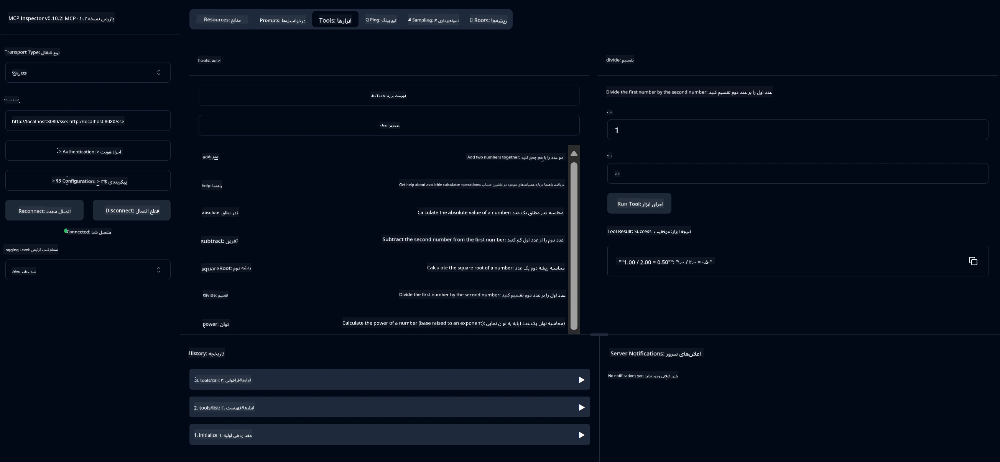

# سرویس ماشین‌حساب پایه MCP

> [!NOTE]
> این راه‌حل جاوا از انتقال قدیمی HTTP+SSE استفاده می‌کند و هدف آن SDK
> سازگار با MCP `2025-11-25` است. این نسخه برای تطبیق با کد دوره نگه داشته شده است؛
> سرورهای راه دور جدید باید از پشتیبانی Streamable HTTP نسخه `2026-07-28` استفاده کنند.

این سرویس عملیات پایه ماشین‌حساب را از طریق پروتکل مدل کانتکست (MCP) با استفاده از Spring Boot و انتقال WebFlux فراهم می‌کند. این بعنوان یک مثال ساده برای مبتدیانی که در حال یادگیری پیاده‌سازی‌های MCP هستند طراحی شده است.

برای اطلاعات بیشتر، به مستندات مرجع [MCP Server Boot Starter](https://docs.spring.io/spring-ai/reference/api/mcp/mcp-server-boot-starter-docs.html) مراجعه کنید.


## استفاده از سرویس

سرویس نقاط انتهایی (API) زیر را از طریق پروتکل MCP ارائه می‌دهد:

- `add(a, b)`: جمع دو عدد
- `subtract(a, b)`: تفریق عدد دوم از اول
- `multiply(a, b)`: ضرب دو عدد
- `divide(a, b)`: تقسیم عدد اول بر دوم (با بررسی صفر بودن)
- `power(base, exponent)`: محاسبه توان یک عدد
- `squareRoot(number)`: محاسبه ریشه دوم (با بررسی عدد منفی)
- `modulus(a, b)`: محاسبه باقی‌مانده تقسیم
- `absolute(number)`: محاسبه قدر مطلق

## وابستگی‌ها

پروژه به وابستگی‌های کلیدی زیر نیاز دارد:

```xml
<dependency>
    <groupId>org.springframework.ai</groupId>
    <artifactId>spring-ai-starter-mcp-server-webflux</artifactId>
</dependency>
```

## ساخت پروژه

پروژه را با استفاده از Maven بسازید:
```bash
./mvnw clean install -DskipTests
```

## اجرای سرور

### استفاده از جاوا

```bash
java -jar target/calculator-server-0.0.1-SNAPSHOT.jar
```

### استفاده از MCP Inspector

MCP Inspector ابزاری مفید برای تعامل با سرویس‌های MCP است. برای استفاده از آن با این سرویس ماشین‌حساب:

1. **نصب و اجرای MCP Inspector** در یک پنجره ترمینال جدید:
   ```bash
   npx @modelcontextprotocol/inspector
   ```

2. **دسترسی به رابط وب** با کلیک بر روی آدرس URL که برنامه نمایش می‌دهد (معمولاً http://localhost:6274)

3. **پیکربندی اتصال**:
   - نوع انتقال را روی "SSE" تنظیم کنید
   - URL نقطه انتهایی SSE سرور در حال اجرای خود را تنظیم کنید: `http://localhost:8080/sse`
   - روی "Connect" کلیک کنید

4. **استفاده از ابزارها**:
   - روی "List Tools" کلیک کنید تا عملیات‌های ماشین‌حساب موجود نمایش داده شود
   - یک ابزار را انتخاب کرده و برای اجرای عملیات روی "Run Tool" کلیک کنید



---

<!-- CO-OP TRANSLATOR DISCLAIMER START -->
**سلب مسئولیت**:
این سند با استفاده از سرویس ترجمه هوش مصنوعی [Co-op Translator](https://github.com/Azure/co-op-translator) ترجمه شده است. در حالی که ما در تلاش برای دقت هستیم، لطفاً توجه داشته باشید که ترجمه‌های خودکار ممکن است شامل خطاها یا نادرستی‌هایی باشند. سند اصلی به زبان مادری خود باید به عنوان منبع معتبر در نظر گرفته شود. برای اطلاعات حیاتی، ترجمه حرفه‌ای انسانی توصیه می‌شود. ما در قبال هرگونه سوء تفاهم یا برداشت نادرست ناشی از استفاده از این ترجمه مسئولیتی نداریم.
<!-- CO-OP TRANSLATOR DISCLAIMER END -->