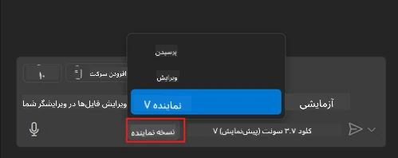
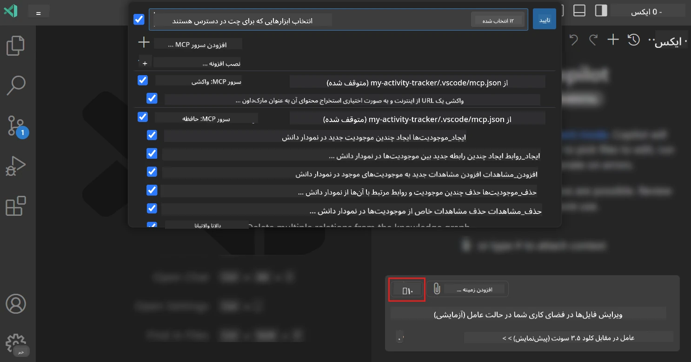
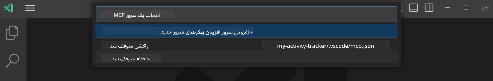
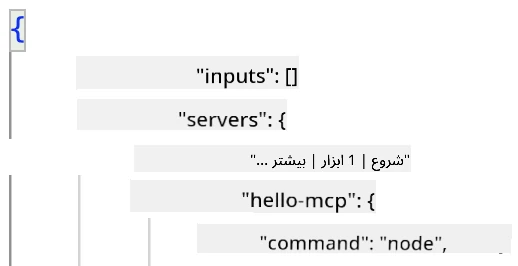
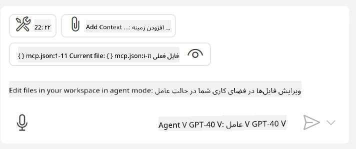
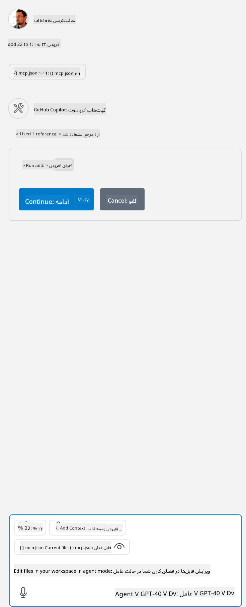

# مصرف یک سرور از حالت GitHub Copilot Agent

Visual Studio Code و GitHub Copilot می‌توانند به عنوان کلاینت عمل کرده و یک سرور MCP را مصرف کنند. ممکن است بپرسید چرا چنین کاری بخواهیم انجام دهیم؟ خب، این یعنی هر ویژگی که سرور MCP داشته باشد اکنون می‌تواند از درون IDE شما استفاده شود. تصور کنید به عنوان مثال سرور MCP گیت‌هاب را اضافه می‌کنید، این امکان را فراهم می‌کند که از طریق درخواست‌های متنی، کنترل گیت‌هاب را به جای تایپ دستورهای خاص در ترمینال داشته باشید. یا تصور کنید هر چیزی که به صورت کلی می‌تواند تجربه توسعه‌دهنده شما را بهبود بخشد و همه آن از طریق زبان طبیعی کنترل شود. حالا متوجه مزیت این کار شده‌اید، درست است؟

## مرور کلی

این درس نحوه استفاده از Visual Studio Code و حالت Agent گیت‌هاب کوپایلوت را به عنوان کلاینت برای سرور MCP شما پوشش می‌دهد.

## اهداف یادگیری

تا پایان این درس، شما قادر خواهید بود:

- مصرف یک سرور MCP از طریق Visual Studio Code.
- اجرای قابلیت‌هایی مانند ابزارها از طریق GitHub Copilot.
- پیکربندی Visual Studio Code برای یافتن و مدیریت سرور MCP خود.

## نحوه استفاده

شما می‌توانید سرور MCP خود را به دو روش مختلف کنترل کنید:

- رابط کاربری، که بعداً در این فصل نحوه انجام آن را خواهید دید.
- ترمینال، امکان کنترل از طریق ترمینال با استفاده از اجرایی `code` وجود دارد:

  برای افزودن یک سرور MCP به پروفایل کاربری خود، از گزینه خط فرمان --add-mcp استفاده کنید و پیکربندی سرور JSON را به شکل {\"name\":\"server-name\",\"command\":...} ارائه دهید.

  ```
  code --add-mcp "{\"name\":\"my-server\",\"command\": \"uvx\",\"args\": [\"mcp-server-fetch\"]}"
  ```

### تصاویر صفحه





در بخش‌های بعدی بیشتر درباره استفاده از رابط بصری صحبت خواهیم کرد.

## روش کار

در اینجا رویکرد کلی ما به شرح زیر است:

- پیکربندی یک فایل برای یافتن سرور MCP ما.
- راه‌اندازی/اتصال به سرور مذکور برای دریافت فهرست قابلیت‌های آن.
- استفاده از این قابلیت‌ها از طریق رابط چت GitHub Copilot.

بسیار خوب، حالا که جریان کار را می‌فهمیم، بیایید با یک تمرین یک سرور MCP را از طریق Visual Studio Code مصرف کنیم.

## تمرین: مصرف یک سرور

در این تمرین، Visual Studio Code را پیکربندی می‌کنیم تا سرور MCP شما را پیدا کرده و از طریق رابط چت GitHub Copilot قابل استفاده باشد.

### -0- مرحله مقدماتی، فعال کردن کشف سرور MCP

ممکن است لازم باشد کشف سرورهای MCP را فعال کنید.

1. به `File -> Preferences -> Settings` در Visual Studio Code بروید.

1. عبارت «MCP» را جستجو کنید و گزینه `chat.mcp.discovery.enabled` را در فایل settings.json فعال کنید.

### -1- ساخت فایل پیکربندی

با ساختن یک فایل پیکربندی در ریشه پروژه شروع کنید، نیاز به فایلی به نام MCP.json دارید که باید در پوشه‌ای به نام .vscode قرار گیرد. مشابه زیر باشد:

```text
.vscode
|-- mcp.json
```

حالا ببینیم چگونه می‌توان یک ورودی سرور اضافه کرد.

### -2- پیکربندی یک سرور

محتوای زیر را به *mcp.json* اضافه کنید:

```json
{
    "inputs": [],
    "servers": {
       "hello-mcp": {
           "command": "node",
           "args": [
               "build/index.js"
           ]
       }
    }
}
```

در بالا یک مثال ساده برای راه‌اندازی یک سرور نوشته شده با Node.js است، برای زمان‌ اجراهای دیگر فرمان مناسب برای راه‌اندازی سرور را با استفاده از `command` و `args` تعیین کنید.

### -3- راه‌اندازی سرور

حالا که یک ورودی اضافه کرده‌اید، بیایید سرور را شروع کنیم:

1. ورودی خود را در *mcp.json* پیدا کنید و مطمئن شوید که آیکون «پخش» را می‌بینید:

    

1. روی آیکون «پخش» کلیک کنید، باید آیکون ابزارها در GitHub Copilot Chat افزایش تعداد ابزارهای قابل دسترس را نشان دهد. اگر روی آن آیکون کلیک کنید، لیستی از ابزارهای ثبت‌شده را خواهید دید. می‌توانید هر ابزار را بسته به این که می‌خواهید GitHub Copilot از آن به عنوان زمینه استفاده کند یا نه، چک یا آنچک کنید:

  

1. برای اجرای یک ابزار، متنی را تایپ کنید که مطمئن هستید با توضیح یکی از ابزارهای شما مطابق است، به عنوان مثال متنی مانند «add 22 to 1»:

  

  باید پاسخی را ببینید که عدد 23 را نشان می‌دهد.

## وظیفه

تلاش کنید یک ورودی سرور به فایل *mcp.json* خود اضافه کنید و مطمئن شوید که می‌توانید سرور را شروع/متوقف کنید. همچنین اطمینان حاصل کنید که بتوانید از طریق رابط چت GitHub Copilot با ابزارهای روی سرور خود ارتباط برقرار کنید.

## راه‌حل

[راه‌حل](./solution/README.md)

## نکات کلیدی

نکات کلیدی این فصل به شرح زیر است:

- Visual Studio Code یک کلاینت عالی است که می‌گذارد چندین سرور MCP و ابزارهای آنها را مصرف کنید.
- رابط چت GitHub Copilot راهی است که شما با سرورها تعامل دارید.
- می‌توانید از کاربر ورودی‌هایی مانند کلیدهای API درخواست کنید که هنگام پیکربندی ورودی سرور در فایل *mcp.json* به سرور MCP منتقل شوند.

## نمونه‌ها

- [ماشین حساب جاوا](../samples/java/calculator/README.md)
- [ماشین حساب .Net](../../../../03-GettingStarted/samples/csharp)
- [ماشین حساب جاوااسکریپت](../samples/javascript/README.md)
- [ماشین حساب تایپ‌اسکریپت](../samples/typescript/README.md)
- [ماشین حساب پایتون](../../../../03-GettingStarted/samples/python)

## منابع اضافی

- [مستندات Visual Studio](https://code.visualstudio.com/docs/copilot/chat/mcp-servers)

## گام بعدی

- بعدی: [ایجاد یک سرور stdio](../05-stdio-server/README.md)

---

<!-- CO-OP TRANSLATOR DISCLAIMER START -->
**سلب مسئولیت**:
این سند با استفاده از سرویس ترجمه هوش مصنوعی [Co-op Translator](https://github.com/Azure/co-op-translator) ترجمه شده است. در حالی که ما در تلاش برای دقت هستیم، لطفاً توجه داشته باشید که ترجمه‌های خودکار ممکن است شامل خطاها یا نادرستی‌هایی باشند. سند اصلی به زبان مادری خود باید به عنوان منبع معتبر در نظر گرفته شود. برای اطلاعات حیاتی، ترجمه حرفه‌ای انسانی توصیه می‌شود. ما در قبال هرگونه سوء تفاهم یا برداشت نادرست ناشی از استفاده از این ترجمه مسئولیتی نداریم.
<!-- CO-OP TRANSLATOR DISCLAIMER END -->