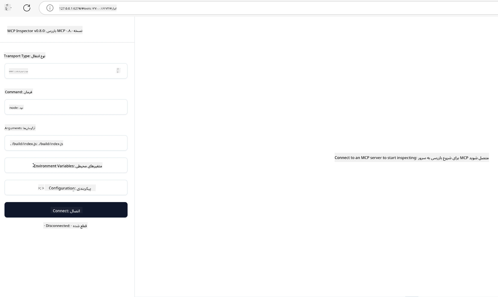

## آزمایش و رفع اشکال

پیش از شروع به آزمایش سرور MCP خود، مهم است که ابزارهای موجود و بهترین روش‌ها برای رفع اشکال را بشناسید. آزمایش مؤثر تضمین می‌کند که سرور شما همانطور که انتظار می‌رود عمل کند و به شما کمک می‌کند مشکلات را سریع‌تر شناسایی و برطرف کنید. بخش زیر رویکردهای پیشنهادی برای اعتبارسنجی پیاده‌سازی MCP شما را شرح می‌دهد.

## مرور کلی

این درس نحوه انتخاب رویکرد مناسب برای آزمایش و مؤثرترین ابزار آزمایش را پوشش می‌دهد.

## اهداف یادگیری

تا پایان این درس قادر خواهید بود:

- رویکردهای مختلف آزمایش را توصیف کنید.
- از ابزارهای مختلف برای آزمایش مؤثر کد خود استفاده کنید.


## آزمایش سرورهای MCP

MCP ابزارهایی را برای کمک به آزمایش و رفع اشکال سرورهای شما فراهم می‌کند:

- **بازرس MCP**: ابزاری خط فرمان که هم به صورت CLI و هم به صورت ابزار بصری اجرا می‌شود.
- **آزمایش دستی**: می‌توانید از ابزاری مانند curl برای اجرای درخواست‌های وب استفاده کنید، اما هر ابزاری که قادر به اجرای HTTP باشد قابل استفاده است.
- **آزمایش واحد**: امکان استفاده از چارچوب آزمایشی مورد علاقه خود برای تست ویژگی‌های سرور و کلاینت وجود دارد.

### استفاده از بازرس MCP

ما در درس‌های قبلی نحوه استفاده از این ابزار را توضیح داده‌ایم، اما اجازه دهید نگاهی کلی به آن داشته باشیم. این ابزاری است که در Node.js ساخته شده و می‌توانید با فراخوانی فایل اجرایی `npx` از آن استفاده کنید، که این ابزار را به طور موقت دانلود و نصب می‌کند و پس از اجرای درخواست شما خودش را پاک می‌کند.

[بازرس MCP](https://github.com/modelcontextprotocol/inspector) به شما کمک می‌کند:

- **کشف امکانات سرور**: به طور خودکار منابع، ابزارها و درخواست‌های در دسترس را شناسایی کنید
- **آزمایش اجرای ابزار**: پارامترهای مختلف را امتحان کرده و پاسخ‌ها را در زمان واقعی مشاهده کنید
- **مشاهده فراداده سرور**: اطلاعات سرور، شِماها و پیکربندی‌ها را بررسی کنید

اجرای معمولی این ابزار به صورت زیر است:

```bash
npx @modelcontextprotocol/inspector node build/index.js
```

دستور بالا یک MCP و رابط بصری آن را اجرا می‌کند و یک رابط وب محلی در مرورگر شما باز می‌کند. می‌توانید انتظار داشته باشید داشبوردی را مشاهده کنید که سرورهای MCP ثبت‌شده، ابزارهای در دسترس، منابع و درخواست‌های آن‌ها را نمایش می‌دهد. این رابط به شما امکان می‌دهد اجرای ابزارها را به صورت تعاملی آزمایش کنید، فراداده سرور را بازرسی کنید و پاسخ‌های زنده را ببینید که اعتبارسنجی و رفع اشکال پیاده‌سازی‌های سرور MCP را آسان‌تر می‌کند.

نمای این ابزار می‌تواند به صورت زیر باشد: 

همچنین می‌توانید این ابزار را در حالت CLI اجرا کنید که در این صورت صفت `--cli` را اضافه می‌کنید. در زیر نمونه‌ای از اجرای ابزار در حالت "CLI" آمده است که تمام ابزارهای سرور را لیست می‌کند:

```sh
npx @modelcontextprotocol/inspector --cli node build/index.js --method tools/list
```

### آزمایش دستی

علاوه بر اجرای ابزار بازرس برای آزمایش قابلیت‌های سرور، رویکرد مشابه دیگری این است که کلاینتی که قادر به استفاده از HTTP است، مانند curl را اجرا کنید.

با curl می‌توانید سرورهای MCP را مستقیماً با درخواست‌های HTTP آزمایش کنید:

```bash
# مثال: متاداده سرور آزمایشی
curl http://localhost:3000/v1/metadata

# مثال: اجرای یک ابزار
curl -X POST http://localhost:3000/v1/tools/execute \
  -H "Content-Type: application/json" \
  -d '{"name": "calculator", "parameters": {"expression": "2+2"}}'
```

همانطور که در مثال بالا با curl مشاهده می‌کنید، از درخواست POST برای فراخوانی ابزار با بار داده‌ای شامل نام ابزار و پارامترهای آن استفاده می‌کنید. از روشی استفاده کنید که برای شما مناسب‌تر است. ابزارهای CLI معمولاً سریع‌تر هستند و قابل اسکریپت شدن هستند که می‌تواند در محیط‌های CI/CD مفید باشد.

### آزمایش واحد

برای ابزارها و منابع خود تست‌های واحد ایجاد کنید تا از عملکرد آن‌ها اطمینان حاصل کنید. در اینجا نمونه‌ای از کد آزمایشی آورده شده است.

```python
import pytest

from mcp.server.fastmcp import FastMCP
from mcp.shared.memory import (
    create_connected_server_and_client_session as create_session,
)

# کل ماژول را برای تست‌های ناهمزمان علامت‌گذاری کنید
pytestmark = pytest.mark.anyio


async def test_list_tools_cursor_parameter():
    """Test that the cursor parameter is accepted for list_tools.

    Note: FastMCP doesn't currently implement pagination, so this test
    only verifies that the cursor parameter is accepted by the client.
    """

 server = FastMCP("test")

    # ایجاد چند ابزار تست
    @server.tool(name="test_tool_1")
    async def test_tool_1() -> str:
        """First test tool"""
        return "Result 1"

    @server.tool(name="test_tool_2")
    async def test_tool_2() -> str:
        """Second test tool"""
        return "Result 2"

    async with create_session(server._mcp_server) as client_session:
        # تست بدون پارامتر کِراسور (نادیده گرفته شده)
        result1 = await client_session.list_tools()
        assert len(result1.tools) == 2

        # تست با کِراسور برابر با None
        result2 = await client_session.list_tools(cursor=None)
        assert len(result2.tools) == 2

        # تست با کِراسور به صورت رشته
        result3 = await client_session.list_tools(cursor="some_cursor_value")
        assert len(result3.tools) == 2

        # تست با کِراسور رشته خالی
        result4 = await client_session.list_tools(cursor="")
        assert len(result4.tools) == 2
    
```

کد بالا کارهای زیر را انجام می‌دهد:

- از چارچوب pytest استفاده می‌کند که به شما امکان می‌دهد تست‌ها را به صورت توابع ایجاد کرده و از دستورات assert استفاده کنید.
- یک سرور MCP با دو ابزار مختلف ایجاد می‌کند.
- با دستور `assert` بررسی می‌کند که شرایط خاصی برقرار باشند.

می‌توانید فایل کامل را در [این لینک](https://github.com/modelcontextprotocol/python-sdk/blob/main/tests/client/test_list_methods_cursor.py) ببینید.

با داشتن فایل فوق، می‌توانید سرور خود را آزمایش کنید تا اطمینان حاصل شود قابلیت‌ها به درستی ایجاد شده‌اند.

تمام SDKهای اصلی بخش‌های مشابهی برای آزمایش دارند که می‌توانید متناسب با محیط اجرای انتخابی خود تنظیم کنید.

## نمونه‌ها

- [ماشین حساب جاوا](../samples/java/calculator/README.md)
- [ماشین حساب .Net](../../../../03-GettingStarted/samples/csharp)
- [ماشین حساب جاوااسکریپت](../samples/javascript/README.md)
- [ماشین حساب تایپ‌اسکریپت](../samples/typescript/README.md)
- [ماشین حساب پایتون](../../../../03-GettingStarted/samples/python) 

## منابع اضافی

- [SDK پایتون](https://github.com/modelcontextprotocol/python-sdk)

## مرحله بعد

- بعدی: [استقرار](../09-deployment/README.md)

---

<!-- CO-OP TRANSLATOR DISCLAIMER START -->
**سلب مسئولیت**:  
این سند با استفاده از سرویس ترجمه هوش مصنوعی [Co-op Translator](https://github.com/Azure/co-op-translator) ترجمه شده است. در حالی که ما برای دقت تلاش می‌کنیم، لطفاً توجه داشته باشید که ترجمه‌های خودکار ممکن است حاوی خطا یا نقص‌هایی باشند. سند اصلی به زبان بومی خود به عنوان منبع معتبر در نظر گرفته شود. برای اطلاعات حیاتی، ترجمه حرفه‌ای انسانی توصیه می‌شود. ما مسئول هیچ گونه سوءتفاهم یا تفسیر نادرستی که ناشی از استفاده از این ترجمه باشد، نمی‌باشیم.
<!-- CO-OP TRANSLATOR DISCLAIMER END -->