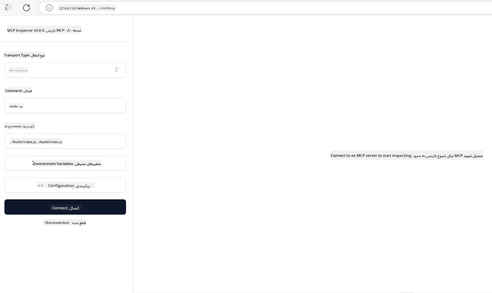

## آزمایش و اشکال‌زدایی

قبل از شروع به آزمایش سرور MCP خود، مهم است که ابزارهای موجود و بهترین روش‌های اشکال‌زدایی را بشناسید. آزمایش مؤثر اطمینان می‌دهد که سرور شما همانطور که انتظار می‌رود عمل می‌کند و به شما کمک می‌کند مسائل را سریع‌تر شناسایی و رفع کنید. بخش زیر رویکردهای پیشنهادی برای اعتبارسنجی پیاده‌سازی MCP شما را تشریح می‌کند.

## مرور کلی

این درس درباره انتخاب رویکرد آزمایشی مناسب و مؤثرترین ابزار آزمایش است.

## اهداف آموزشی

تا پایان این درس، شما قادر خواهید بود:

- توصیف رویکردهای مختلف برای آزمایش.
- استفاده از ابزارهای مختلف برای آزمایش مؤثر کد خود.


## آزمایش سرورهای MCP

MCP ابزارهایی را برای کمک به آزمایش و اشکال‌زدایی سرورهای شما فراهم می‌کند:

- **بازرس MCP**: یک ابزار خط فرمان است که می‌تواند به عنوان ابزار CLI و همچنین ابزار بصری اجرا شود.
- **آزمایش دستی**: می‌توانید از ابزاری مانند curl برای ارسال درخواست‌های وب استفاده کنید، اما هر ابزاری که توان اجرای HTTP دارد قابل استفاده است.
- **آزمایش واحد**: امکان استفاده از چارچوب آزمایشی دلخواه شما برای آزمایش ویژگی‌های سرور و کلاینت وجود دارد.

### استفاده از بازرس MCP

استفاده از این ابزار را در درس‌های قبلی توضیح داده‌ایم، اما اجازه دهید کمی به طور کلی درباره آن صحبت کنیم. این ابزاری است ساخته شده در Node.js که می‌توانید با فراخوانی اجرایی `npx` از آن استفاده کنید؛ که این ابزار را به طور موقت دانلود و نصب می‌کند و پس از اجرای درخواست‌تان خود را پاک‌سازی می‌کند.

[بازرس MCP](https://github.com/modelcontextprotocol/inspector) به شما کمک می‌کند:

- **کشف قابلیت‌های سرور**: منابع، ابزارها و پرامپت‌های موجود را به صورت خودکار شناسایی کنید
- **آزمایش اجرای ابزار**: پارامترهای مختلف را امتحان کنید و پاسخ‌ها را به صورت زنده ببینید
- **مشاهده متادیتای سرور**: اطلاعات سرور، اسکیماها و پیکربندی‌ها را بررسی کنید

اجرای معمولی این ابزار به شکل زیر است:

```bash
npx @modelcontextprotocol/inspector node build/index.js
```

فرمان بالا یک MCP را و رابط بصری آن را اجرا می‌کند و یک رابط وب محلی در مرورگر شما می‌گشاید. انتظار می‌رود داشبوردی ببینید که سرورهای ثبت‌شده MCP، ابزارهای موجود، منابع و پرامپت‌ها را نمایش دهد. این رابط به شما اجازه می‌دهد اجرای ابزارها را به صورت تعاملی آزمایش کنید، متادیتای سرور را بررسی کرده و پاسخ‌های زنده را مشاهده کنید که اعتبارسنجی و اشکال‌زدایی پیاده‌سازی‌های سرور MCP شما را آسان‌تر می‌کند.

نمایی مشابه این می‌تواند باشد: 

همچنین می‌توانید این ابزار را در حالت CLI اجرا کنید و در این صورت باید گزینه `--cli` را اضافه کنید. نمونه‌ای از اجرای ابزار در حالت «CLI» که تمام ابزارهای سرور را فهرست می‌کند به این شکل است:

```sh
npx @modelcontextprotocol/inspector --cli node build/index.js --method tools/list
```

### آزمون دستی

علاوه بر اجرای ابزار بازرس برای آزمایش قابلیت‌های سرور، رویکرد مشابه دیگری این است که یک کلاینت اجرا کنید که توان اجرای HTTP را دارد، برای مثال curl.

با curl می‌توانید مستقیم سرورهای MCP را با درخواست‌های HTTP آزمایش کنید:

```bash
# مثال: فراداده سرور آزمایشی
curl http://localhost:3000/v1/metadata

# مثال: اجرای یک ابزار
curl -X POST http://localhost:3000/v1/tools/execute \
  -H "Content-Type: application/json" \
  -d '{"name": "calculator", "parameters": {"expression": "2+2"}}'
```

همانطور که در کاربرد curl بالا می‌بینید، شما از یک درخواست POST برای فراخوانی ابزار با بار داده‌ای شامل نام ابزار و پارامترهایش استفاده می‌کنید. رویکردی که برایتان بهتر است را استفاده کنید. ابزارهای CLI معمولاً سریع‌تر استفاده می‌شوند و قابلیت اسکریپت شدن دارند که در محیط‌های CI/CD مفید است.

### آزمون واحد

برای ابزارها و منابع خود آزمون‌های واحد بسازید تا مطمئن شوید که آن‌ها مطابق انتظار کار می‌کنند. در اینجا نمونه کدی برای آزمایش آورده شده است.

```python
import pytest

from mcp.server.fastmcp import FastMCP
from mcp.shared.memory import (
    create_connected_server_and_client_session as create_session,
)

# علامت‌گذاری کل ماژول برای تست‌های ناهمزمان
pytestmark = pytest.mark.anyio


async def test_list_tools_cursor_parameter():
    """Test that the cursor parameter is accepted for list_tools.

    Note: FastMCP doesn't currently implement pagination, so this test
    only verifies that the cursor parameter is accepted by the client.
    """

 server = FastMCP("test")

    # ایجاد چند ابزار تست
    @server.tool(name="test_tool_1")
    async def test_tool_1() -> str:
        """First test tool"""
        return "Result 1"

    @server.tool(name="test_tool_2")
    async def test_tool_2() -> str:
        """Second test tool"""
        return "Result 2"

    async with create_session(server._mcp_server) as client_session:
        # تست بدون پارامتر کرسر (حذف شده)
        result1 = await client_session.list_tools()
        assert len(result1.tools) == 2

        # تست با کرسر برابر None
        result2 = await client_session.list_tools(cursor=None)
        assert len(result2.tools) == 2

        # تست با کرسر به صورت رشته
        result3 = await client_session.list_tools(cursor="some_cursor_value")
        assert len(result3.tools) == 2

        # تست با کرسر رشته‌ای خالی
        result4 = await client_session.list_tools(cursor="")
        assert len(result4.tools) == 2
    
```

کد بالا اقدامات زیر را انجام می‌دهد:

- از چارچوب pytest استفاده می‌کند که اجازه می‌دهد آزمون‌ها را به صورت توابع ایجاد کرده و از دستورات assert استفاده کنید.
- یک سرور MCP با دو ابزار مختلف می‌سازد.
- با دستور `assert` بررسی می‌کند که شرایط خاصی برآورده شده‌اند.

نگاهی به [فایل کامل اینجا](https://github.com/modelcontextprotocol/python-sdk/blob/main/tests/client/test_list_methods_cursor.py) بیندازید.

با استفاده از فایل فوق، می‌توانید سرور خود را آزمایش کنید تا مطمئن شوید قابلیت‌ها به درستی ایجاد شده‌اند.

تمام SDKهای اصلی بخش‌های آزمایشی مشابهی دارند، بنابراین می‌توانید آن را به محیط اجرایی انتخابی خود تنظیم کنید.

## نمونه‌ها

- [ماشین حساب جاوا](../samples/java/calculator/README.md)
- [ماشین حساب دات‌نت](../../../../03-GettingStarted/samples/csharp)
- [ماشین حساب جاوااسکریپت](../samples/javascript/README.md)
- [ماشین حساب تایپ‌اسکریپت](../samples/typescript/README.md)
- [ماشین حساب پایتون](../../../../03-GettingStarted/samples/python)

## منابع اضافی

- [SDK پایتون](https://github.com/modelcontextprotocol/python-sdk)

## گام بعدی

- بعدی: [استقرار](../09-deployment/README.md)

---

<!-- CO-OP TRANSLATOR DISCLAIMER START -->
**سلب مسئولیت**:
این سند با استفاده از سرویس ترجمه هوش مصنوعی [Co-op Translator](https://github.com/Azure/co-op-translator) ترجمه شده است. در حالی که ما در تلاش برای دقت هستیم، لطفاً توجه داشته باشید که ترجمه‌های خودکار ممکن است شامل خطاها یا نادرستی‌هایی باشند. سند اصلی به زبان مادری خود باید به عنوان منبع معتبر در نظر گرفته شود. برای اطلاعات حیاتی، ترجمه حرفه‌ای انسانی توصیه می‌شود. ما در قبال هرگونه سوء تفاهم یا برداشت نادرست ناشی از استفاده از این ترجمه مسئولیتی نداریم.
<!-- CO-OP TRANSLATOR DISCLAIMER END -->